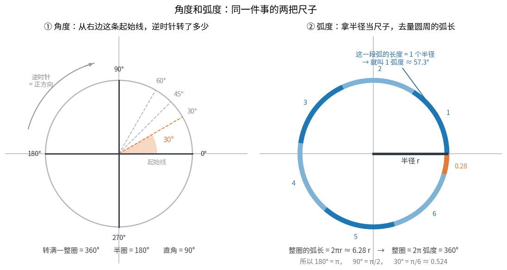
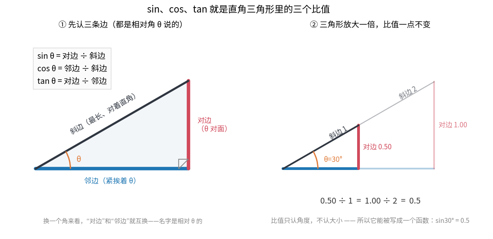
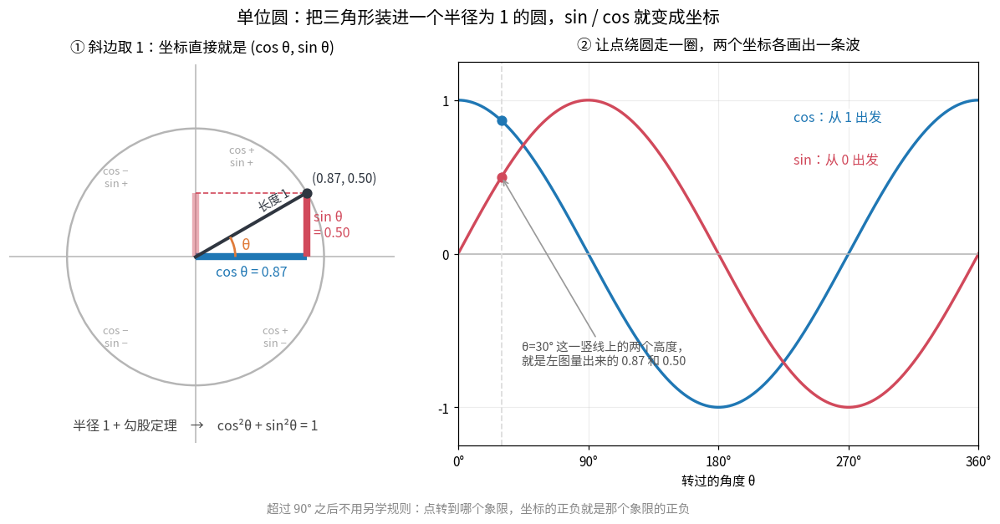
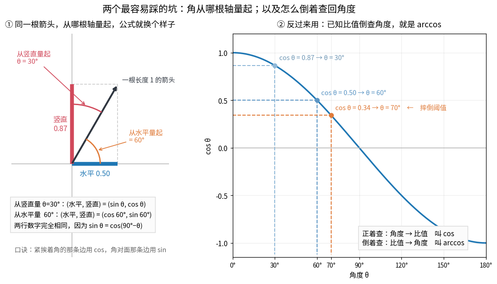

# 附录 D · 三角函数从 0 补课

> **谁需要这一篇**：在 §2.4（投影重力）、§3.3（梯度与夹角）、§9 映射到项目（摔倒判定）、
> §15.1（弧度单位）、§16.6 / §16.10（$\Delta\cos(\text{tilt})$）看到 sin、cos、弧度、arccos 就卡住的人。
>
> **需要的前提**：乘除法，和勾股定理（$3^2+4^2=5^2$）。**完全没学过三角函数也能读**，
> 这一篇从"角度是什么"讲起。
>
> **读完你能**：把任何一根倾斜的箭头拆成"水平占多少、竖直占多少"；看懂 §2.4 那两根身体轴；
> 从传感器读数 $g_z$ 反算出机器人倾了多少度；知道代码里 `math.sin(30)` 为什么是错的。
>
> **本篇实验**：`uv run python docs/learn-zh/labs/appendix_d_trig.py`（四张图都由它生成，并核对每个数字）

---

## D.1 角度：一句话就是"转了多少"

拿一根针钉在纸上，从**朝右**这个方向开始，逆时针转。转过的量就叫**角度**。



**这样读图：** 先看左边——角度量的是"从朝右的起始线逆时针转了多少"；再看右边——弧度量的是同一段转动对应的弧有几个半径那么长，D.2 讲。

看左边那张图：

- 转一点点 = 小角度（图里橙色那块扇形是 30°）
- 转到朝上 = **90°**，这是"直角"
- 转到朝左 = **180°**，半圈
- 转回原地 = **360°**，一整圈

为什么是 360 这么个怪数字？纯粹是几千年前巴比伦人留下的习惯（360 好整除：能被 2、3、4、5、6、8、9、10、12… 整除）。**它没有数学上的道理，所以后面会出现第二把尺子。**

> **只需记住三个锚点**：直角 90°、半圈 180°、整圈 360°。

## D.2 弧度：程序里真正用的那把尺子

看上面那张图的右半边。这次不数"转了几分之几圈"，而是**拿半径当尺子，去量圆周上走过的弧有多长**：

- 走过的弧长 = 1 个半径 → 就说转了 **1 弧度**（radian，代码里写 `rad`）
- 图里把整个圆周切成了一段段"1 个半径长"的弧：**正好能放下 6 段，还剩 0.28 段**

为什么是 6.28？因为圆周长 $= 2\pi r \approx 6.28r$。所以

$$\text{整圈} = 2\pi \text{ 弧度} = 360°, \qquad \text{半圈} = \pi = 180°, \qquad \text{直角} = \frac{\pi}{2} = 90°$$

换算就一条公式（记不住就记"180 对应 π"）：

$$\text{弧度} = \text{角度} \times \frac{\pi}{180}, \qquad \text{角度} = \text{弧度} \times \frac{180}{\pi}$$

代进两个常用的：$30° = \pi/6 \approx 0.524$ rad；$1 \text{ rad} = 180/\pi \approx 57.3°$。

**⚠️ 代码里的头号坑**：Python、numpy、torch 的 `sin` / `cos` **全部只吃弧度**。

```python
import math
math.sin(30)                 # 0.5? 不是！这是 sin(30 弧度) ≈ −0.988
math.sin(math.radians(30))   # 0.5 ✓  先把 30° 换成弧度
```

本书里凡是出现"1 弧度 = 57°"的地方（§17.1 动作 scale、§15.1 的 rad/s），说的都是这把尺子。

> **停一下，自测**：60° 是多少弧度？
> <details><summary>答案</summary>$60 \times \pi/180 = \pi/3 \approx 1.047$ rad。<br>
> 检查：1 弧度 ≈ 57.3°，所以 1.047 弧度 ≈ 60° ✓</details>

## D.3 sin、cos、tan：直角三角形里的三个比值



**这样读图：** 先在左图认三条边的名字（名字都是相对角 θ 说的）；再看右图，三角形放大一倍，两条边同时变大，比值一点不变。

### 先认三条边

上图左边是一个**直角三角形**（有一个角是 90°）。盯住那个我们关心的角 θ，三条边各有名字：

| 边 | 位置 | 记法 |
|---|---|---|
| **斜边** | 对着直角，最长的那条 | 永远是最长的 |
| **邻边** | 紧挨着 θ 的那条（不算斜边） | "邻" = 挨着 |
| **对边** | θ 正对面的那条 | "对" = 对面 |

⚠️ 名字是**相对 θ 说的**：换一个角来看，对边和邻边就互换了。

### 三个比值

$$\sin\theta = \frac{\text{对边}}{\text{斜边}}, \qquad
\cos\theta = \frac{\text{邻边}}{\text{斜边}}, \qquad
\tan\theta = \frac{\text{对边}}{\text{邻边}}$$

就这样，没有更多了。**sin、cos 不是什么神秘运算，就是两条边一除。**

### 为什么这个比值能写成"函数"

上图右边回答了这件事：同一个角 30°，画一个小三角形（斜边 1）和一个大三角形（斜边 2）——

$$\frac{0.50}{1} = \frac{1.00}{2} = 0.5$$

**三角形放大一倍，两条边一起放大一倍，比值一点不变。** 所以这个比值**只由角度决定**，与三角形多大无关。既然一个角度对应一个固定的数，它就能被做成一张表、一个函数——这张表就叫 $\sin$。

### 两个能手算的三角形

把一个正三角形（三边都是 2）从中间劈开，就得到 30°-60°-90° 的三角形，三边是 $1 : \sqrt3 : 2$：

$$\sin 30° = \frac{1}{2} = 0.5, \qquad \cos 30° = \frac{\sqrt3}{2} \approx 0.866, \qquad \tan 30° = \frac{1}{\sqrt3} \approx 0.577$$

把一个正方形沿对角线切开，得到 45°-45°-90°，三边是 $1 : 1 : \sqrt2$：

$$\sin 45° = \cos 45° = \frac{1}{\sqrt2} \approx 0.707$$

### 常用值表（不用背，用下面的口诀现推）

| θ | 0° | 30° | 45° | 60° | 90° |
|---|---|---|---|---|---|
| **sin θ** | 0 | 0.5 | 0.707 | 0.866 | 1 |
| **cos θ** | 1 | 0.866 | 0.707 | 0.5 | 0 |

**口诀**：sin 那一行就是 $\dfrac{\sqrt0}{2},\ \dfrac{\sqrt1}{2},\ \dfrac{\sqrt2}{2},\ \dfrac{\sqrt3}{2},\ \dfrac{\sqrt4}{2}$——根号里 0、1、2、3、4 数上去就行。
cos 那一行**就是同一行倒着读**（这不是巧合，D.5 节会解释）。

> **停一下，自测**：$\tan 45°$ 是多少？
> <details><summary>答案</summary>45° 的三角形两条直角边一样长，对边 ÷ 邻边 = 1 ÷ 1 = **1**。</details>

## D.4 单位圆：让 sin、cos 直接变成坐标



**这样读图：** 先看左图，找到圆上那个黑点，它的横坐标就是 cos θ、纵坐标就是 sin θ；再看右图 30° 处那条竖虚线，线上两个点的高度正是左图量出来的 0.87 和 0.50。

这是整个补课里**最值得记住的一张图**。

### 斜边取 1 会发生什么

把斜边固定成 **1**，那两个除法的分母就都是 1，除了个寂寞：

$$\sin\theta = \frac{\text{对边}}{1} = \text{对边}, \qquad \cos\theta = \frac{\text{邻边}}{1} = \text{邻边}$$

也就是说：**一根长度为 1、从水平方向转了 θ 的箭头，它的坐标就直接是 $(\cos\theta,\ \sin\theta)$。**

- cos = 往右伸多少（水平）
- sin = 往上伸多少（竖直）

$\S2.4$ 里那两根身体轴、那根重力箭头，全都是长度为 1 的箭头——所以它们的坐标都能这么读出来。

### 送一条恒等式

箭头长度是 1，而"水平、竖直、斜边"正好是个直角三角形，勾股定理直接给出

$$\cos^2\theta + \sin^2\theta = 1$$

这条式子在本书里出现过两次：§2.4 说"投影重力是单位向量，三个数平方和 = 1"，§2.4 的 $g_x^2+g_y^2 = \sin^2\theta$ 也是它的直接结果。

### 超过 90° 怎么办（这是从 0 学最容易卡的地方）

三角形里没有"120° 的角"，但圆上的点可以一直转下去。**规则不用另学**：点转到哪个象限，它的坐标是正是负，$\cos$、$\sin$ 就是正是负。图里四个角落标的就是这个。

- 转到左上（比如 120°）：往左伸 → cos 为负；还在上面 → sin 为正
- 转到正下（270°）：cos = 0，sin = −1

### 转一圈就画出一条波

上图右半边：让点绕圈走，把它的**高度**（sin）和**横坐标**（cos）随角度画出来，就得到两条波。

- sin 从 0 出发，cos 从 1 出发
- 转满 360° 走完一个完整周期，之后无限重复
- 两条波形状完全一样，只是**错开了 90°**

> **停一下，自测**：一根长度 1 的箭头从水平转了 90°，坐标是多少？
> <details><summary>答案</summary>$(\cos 90°,\ \sin 90°) = (0,\ 1)$——竖直朝上，一点不往右。对照 §2.4 里站直时的"机身上"轴 $(0,1)$。</details>

## D.5 从哪根轴量起——本书最容易踩的坑



**这样读图：** 左图只看一件事——箭头没动，两种量法读出的角度不同（30° 和 60°），但水平、竖直两个分量一模一样；右图顺着虚线从纵轴的比值走到曲线、再落到横轴，就是"已知比值查角度"。

上图左边：**同一根箭头**，同一个姿势，量法不同，写出来的公式就不同。

| 怎么量 | 角度 | (水平, 竖直) |
|---|---|---|
| 从**竖直**轴量起（§2.4 说"倾角"用的就是这种） | θ = 30° | $(\sin\theta,\ \cos\theta)$ = (0.50, 0.87) |
| 从**水平**轴量起（数学课本的标准量法） | 60° | $(\cos 60°,\ \sin 60°)$ = (0.50, 0.87) |

**两行数字完全一样**——同一根箭头当然只有一组坐标，变的只是"用哪个角来描述它"。背后是一条恒等式：

$$\sin\theta = \cos(90° - \theta)$$

这也解释了 D.3 那张表为什么"cos 就是 sin 倒着读"。

> **口诀（本书通用）：紧挨着角的那条边用 cos，角对面那条边用 sin。**
> 先找准角在哪，再套这句话，就不会记混。

**回到 §2.4**：那里两根身体轴的坐标是

- 机身"上"轴：从**竖直**方向歪开 θ → $(\sin\theta,\ \cos\theta)$
- 机身"前"轴：从**水平**方向低下 θ → $(\cos\theta,\ -\sin\theta)$

两根轴差 90°，所以两个函数正好对调；"低下头"是朝下，所以多一个负号。

## D.6 倒着用：已知比值，反查角度

上图右边。前面都是"给角度，问比值"；实际用的时候常常反过来：**传感器给了比值，问倾了多少度。**

这三个反函数就干这件事（名字前面加 arc，代码里写 `acos` / `asin` / `atan2`）：

| 要什么 | 用哪个 | 结果范围 |
|---|---|---|
| 已知 cos 值 → 角度 | $\arccos$，`math.acos` | 0° ~ 180° |
| 已知 sin 值 → 角度 | $\arcsin$，`math.asin` | −90° ~ 90° |
| 已知一个点 (x, y) → 方位角 | `math.atan2(y, x)` | −180° ~ 180° |

**项目里的用法**（§2.4、§9 映射到项目）：站直时 $g_z = -\cos\theta$，所以

$$\theta = \arccos(-g_z)$$

- $g_z = -0.87 \Rightarrow \arccos(0.87) = 30°$
- $g_z = -0.34 \Rightarrow \arccos(0.34) = 70°$ ← 仓库的摔倒阈值就是这么来的

会了这一步，你就不用死记 −0.34 这个数字，而是能解释它。

<details>
<summary>进阶：为什么算方位角要用 atan2 而不是 arctan</summary>

$\tan\theta = y/x$ 反过来就是 $\arctan$，但它有两个毛病：$x=0$ 时要除零；$(1,1)$ 和 $(-1,-1)$ 的比值一样，分不清是第一象限还是第三象限。`atan2(y, x)` 把 x、y **分开**传进去，两个毛病都没有，所以所有机器人代码算朝向都用它。

另外，`arccos` 只能还原出"倾了多少"，还原不出"往哪倾"——因为 $\cos(-\theta) = \cos\theta$。想知道方向，得看 $g_x$、$g_y$ 的符号（§2.4）。
</details>

> **停一下，自测**：某一帧读到 $g_z = -0.5$，机器人倾了多少度？
> <details><summary>答案</summary>$\arccos(0.5) = 60°$。查 D.3 的表：cos 60° = 0.5 ✓。已经超过 70° 阈值了吗？没有，还差 10°。</details>

## D.7 这本书需要的全部三角知识（一页速查）

| 你会看到 | 意思 | 出现在 |
|---|---|---|
| $\sin\theta$、$\cos\theta$ | 长度 1 的箭头，转了 θ 之后的两个分量 | §2.4 |
| $\sin^2\theta + \cos^2\theta = 1$ | 勾股定理（单位向量长度恒为 1） | §2.3、§2.4 |
| $\sin\theta = \cos(90°-\theta)$ | 从哪根轴量起的换算 | §2.4、D.5 |
| $\theta = \arccos(-g_z)$ | 从投影重力反算倾角；70° = 摔倒 | §2.4、§9 |
| rad（弧度），1 rad ≈ 57.3° | 代码里角度的单位；动作 scale=1 时 1 单位 = 1 rad | §15.1、§17.1 |
| $\mathbf{a}\cdot\mathbf{b} = \|\mathbf{a}\|\|\mathbf{b}\|\cos\varphi$ | 点积衡量两个方向多一致 | §2.2 进阶、§3.3 |
| $\Delta\cos(\text{tilt})$ | 势函数式塑形：只为"变直了多少"付钱 | §16.6、§16.10 |

## 🧪 动手实验

```bash
uv run python docs/learn-zh/labs/appendix_d_trig.py
```

1. 常用角度表（角度 / 弧度 / sin / cos / tan），并核对 $\sin^2+\cos^2=1$、$\sin(90°-\theta)=\cos\theta$、$\arccos(0.342)=70°$。
2. 画图 D1：角度与弧度两把尺子（`appd_angle_radian.png`）。
3. 画图 D2：直角三角形的三个比值（`appd_right_triangle.png`）。
4. 画图 D3：单位圆与 sin / cos 波形（`appd_unit_circle.png`）。
5. 画图 D4：从哪根轴量起、用 arccos 反查角度（`appd_which_axis.png`）。
6. 把补课接回项目：倾角 → $(g_x, g_z)$ → `arccos` 反算回倾角，来回对得上。

**改一改**：把第 1 节的角度列表换成 `[0, 15, 37, 53, 75]`，看 37° 和 53° 的 sin/cos 是不是正好互换（因为 37+53 = 90）。

## 小结

- **角度**是"转了多少"，整圈 360°；**弧度**是"用半径量弧长"，整圈 $2\pi \approx 6.28$。代码只认弧度。
- **sin、cos 就是直角三角形里两条边一除**，比值只跟角度有关，所以能写成函数。
- **把斜边取成 1**（单位圆），sin、cos 就直接变成箭头的坐标：$(\cos\theta, \sin\theta)$。
- 角**从哪根轴量起**会让公式里的 sin、cos 对调——紧挨着角用 cos，角对面用 sin。
- 反过来由比值查角度用 **arccos / arcsin / atan2**；项目里的倾角 = $\arccos(-g_z)$。

**回到正文**：[§2.4 手机的重力感应](../part1-math/02-向量与矩阵.md#24-手机的重力感应项目里的第一个真实向量)。
