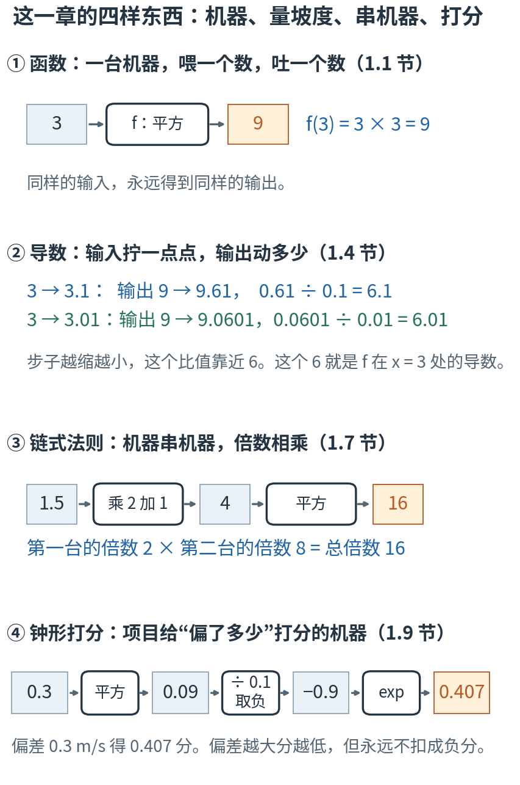
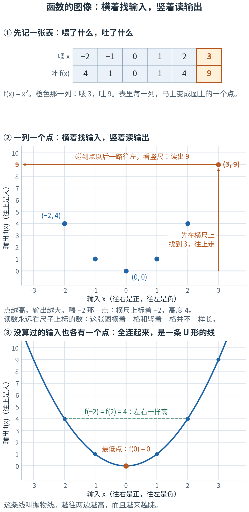
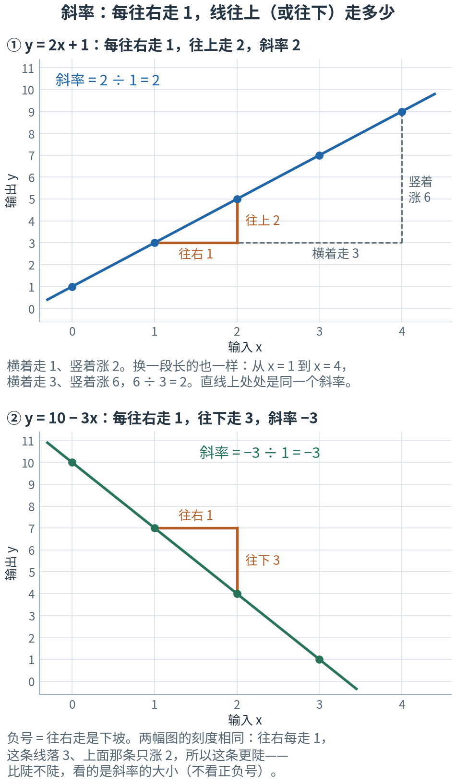
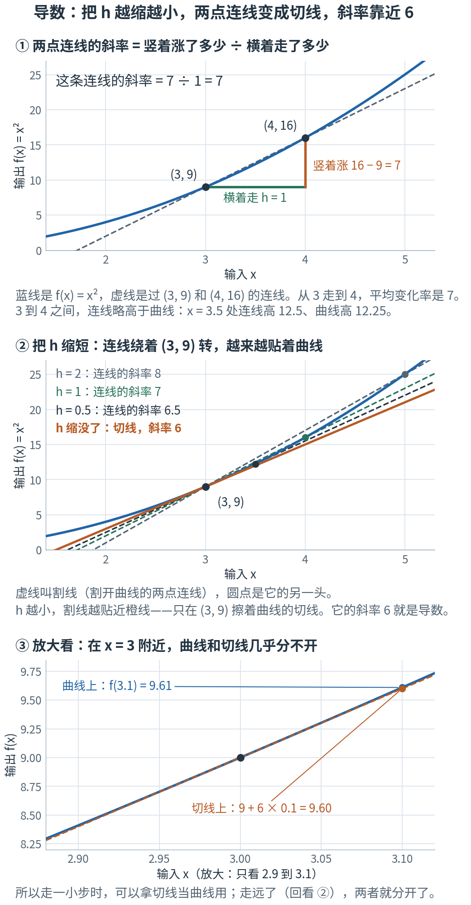
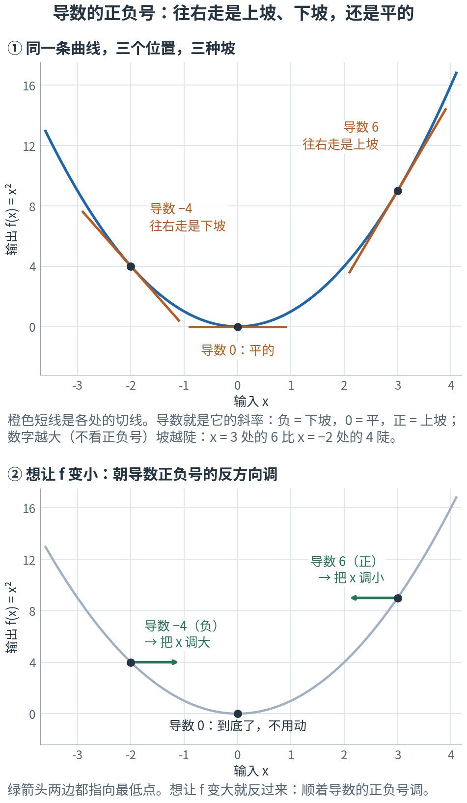
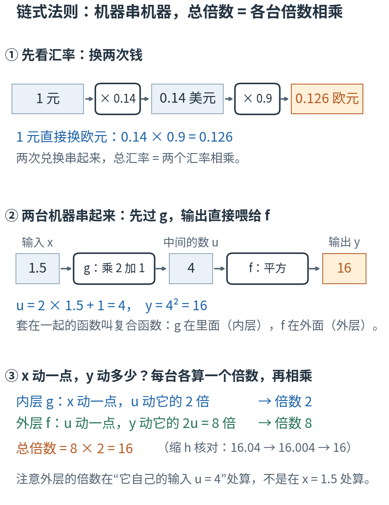
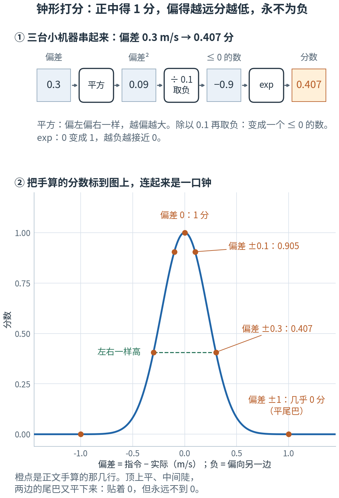
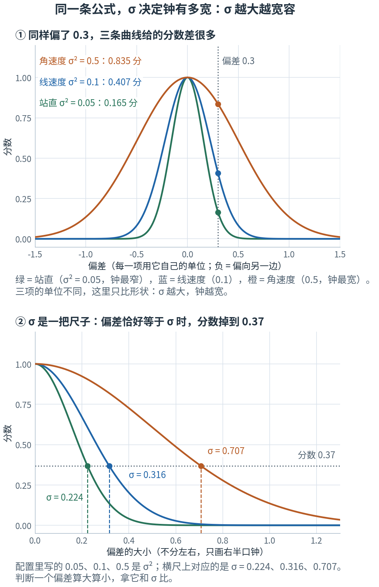
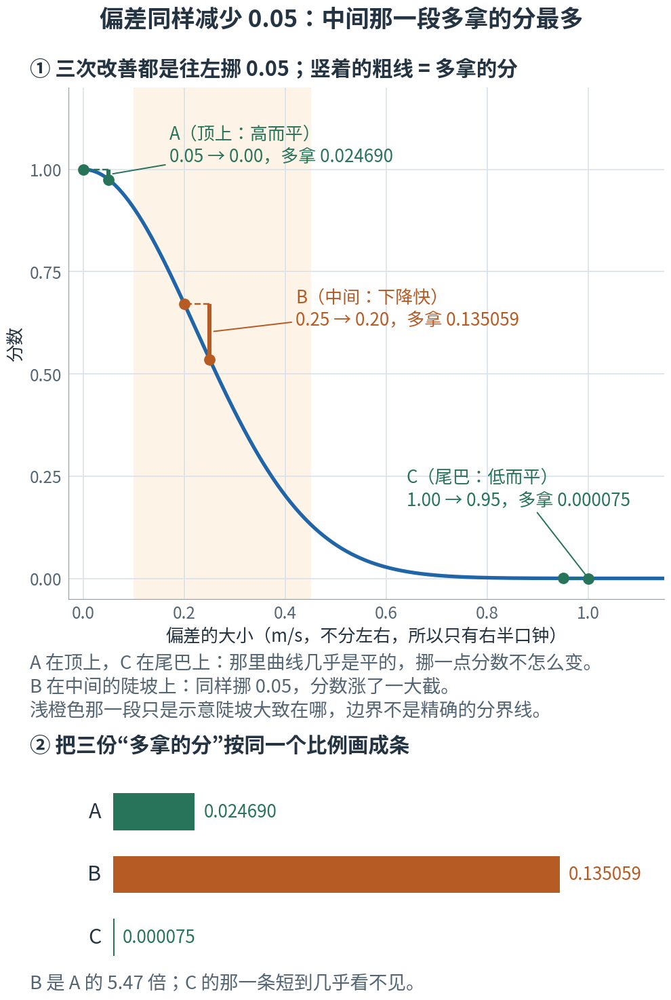
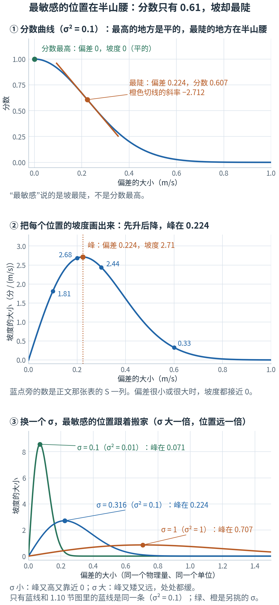

# 第 1 章 · 函数与变化率：读懂打分公式，量出“往哪边调”

> **上一章我们有了什么**：这是第一章，"上一章"就是 [README 里的那个故事](../README.md)——机器人看 61 个数、吐 14 个数、得一个分数，
> 网络里的参数被"往得分更高的方向微调"。
>
> **这一章要补什么**：故事里有两处还是黑箱。
> 第一，"得一个分数"——分数是按一条公式算出来的，你要能读懂它。
> 第二，"往得分更高的方向微调"——凭什么知道该往哪边调？靠一把量"坡度"的尺子，叫导数。
> 这两件事共同的地基是"函数"。这一章先只管**一个**输入、**一个**输出，把这三样东西做扎实。
>
> **本章新词**：函数、变化率、斜率、导数、复合函数、链式法则、指数函数、高斯核（本书平时叫它"钟形打分"）。
> **需要的前提**：会加减乘除和平方。**不要求**学过函数、坐标系或编程；用到时当场解释。
> 标"进阶""第二遍读"的折叠块，第一遍可以跳过。1.12–1.14 把导数用到钟形打分上，是本章的收官：第 2、3 章要用的东西，读完 1.11 就齐了；
> 第一遍读累了，可以先跳到章末的 📍 和小结，第二遍再回来。

---

## 1.0 先看地图：一台机器、一把量坡度的尺子、一条打分公式

**函数是一台"喂一个数、吐一个数"的机器；导数量的是"输入拧一点点，输出跟着动多少"；
项目给机器人打分的规则就是一个函数——一条钟形的曲线，用导数能看出它在哪里分得清好坏、在哪里分不清。**

先想象你是裁判，手里有一张打分表：机器人被要求走多快、实际走了多快，两者差多少，就查表给多少分。
这一章围着这张打分表转四圈：

1. 这张表是一台**机器**：喂进去"差了多少"，吐出来一个分数。
2. 你想知道"差距再缩小一点点，分数能涨多少"——这要一把**量坡度的尺子**。
3. 这张表其实是三台小机器**串起来**的（平方 → 除一下再取负 → 一台叫 exp 的机器）；串起来的机器，坡度怎么量？
4. 最后拿这把尺子去检查打分表本身：它在哪一段对进步最敏感？该把它调宽还是调窄？



**读图顺序：** 从 ① 到 ④ 竖着读。图里的数字现在不用算，后面各节会一个一个手算出来；
现在只要看清这四样东西的样子：一台机器、拧一点看动多少、机器串机器、项目的打分机。

| 概念 | 它在回答什么问题 | 在哪一节 |
|---|---|---|
| 函数 | 喂进去这个数，吐出来什么？ | 1.1–1.2 |
| 斜率 | 输入每多 1，输出多多少？（直线） | 1.3 |
| 导数 | 在**这一个位置**，输入拧一点点，输出动多少？（曲线） | 1.4–1.6 |
| 复合函数、链式法则 | 几台机器串起来，总的放大倍数是多少？ | 1.7 |
| 指数函数 | 什么机器能把"越大越糟"变成"0 到 1 之间的分数"？ | 1.8 |
| 钟形打分（高斯核） | 项目怎样给"偏了多少"打分？宽严由谁定？ | 1.9–1.10 |
| 用导数检查打分表 | 这张打分表在哪里分得清好坏？宽容度怎么选？ | 1.11–1.14 |

表里的名字先不背，英文和符号到了各节再给。本章最容易混的四处，先贴上标签：

- **函数值 和 导数值**：一个说"现在有多高"，一个说"这里有多陡"。1.12 节会算出一个 −1.81，它不是分数，是坡度。
- **分数高 和 对改善敏感**：分数最高的地方（正中靶心）恰恰是平的，进步一点几乎不加分；最敏感的地方在半山腰（1.11、1.13 节）。
- **σ 和 σ²**：配置里写的 0.1 是 σ²；判断"偏差多大算大"，要和 σ ≈ 0.316 比（≈ 读"约等于"；1.10 节）。
- **带正负号的偏差 和 偏差的大小**：偏左是负、偏右是正，两边一样糟。说"偏差变大、分数下降"时，指的是大小（1.12 节）。

还有一处字母换含义：前八节里 x 只是"随便一个输入"；从 1.12 节起，x 专门表示偏差。换的地方有 ⚠️ 提醒。

现在觉得这些区别有点抽象很正常，读到对应小节就清楚了。
第一次读，只要按顺序看正文、图片和手算。标着"进阶"的折叠内容可以先跳过；代码是复核工具，不是阅读门槛。
读完 1.11，第 2、3 章需要的东西就齐了；1.12–1.14 是本章的收官，第一遍读累了，可以先跳到章末的 📍 和小结，第二遍再回来。

## 1.1 函数：一台机器，喂进去一个数，吐出来一个数

先不谈数学。想象一台自动售货机：投 5 块钱，掉出一瓶水。投同样的钱，永远掉同样的东西。
它不会今天掉水、明天掉可乐。

**函数**（function）就是这样一台"确定的机器"：给它一个输入，它按固定规则给你一个输出。
同一个输入，永远得到同一个输出。

如果你写前端，你天天在写函数：

```js
const double = (x) => x * 2;   // 喂 3，吐 6，永远
const square = (x) => x * x;   // 喂 3，吐 9，永远
```

先拿 `square` 手算几个：喂 3，吐 3 × 3 = 9；喂 −2，吐 (−2) × (−2) = 4（负负得正）；喂 0.5，吐 0.25；喂 0，吐 0。

数学里给 `square` 起个名字叫 $f$，写成

$$f(x) = x^2$$

读作："f 在 x 处的值，等于 x 的平方"。刚才那四次手算就写成 $f(3) = 9$，$f(-2) = 4$，$f(0.5) = 0.25$，$f(0) = 0$。

| 符号 | 怎么读 | 就是 |
|---|---|---|
| $f$ | "f" | 机器的名字。和变量名一样，随便起，惯用 f、g |
| $x$ | "x" | 喂进去的数（输入） |
| $f(x)$ | "f of x" | 吐出来的数（输出）。$f(3)$ 就是"喂 3 时吐出来的数" |

（数学书里常把输入叫自变量、输出叫因变量；本书直接说输入、输出。）

> **停一下，自测**：$f(x) = x^2$，$f(4)$ 是多少？$f(-4)$ 呢？
> <details><summary>答案</summary>
>
> 都是 16。负数的平方也是正数，所以 4 和 −4 喂进去，吐出来的一样。实验第 1 节核对了这几个数。
>
> </details>

### 这和机器人有什么关系

后面你会反复遇到三台"机器"，它们都是函数，只是喂的东西不一定是一个数：

| 这台机器 | 喂进去 | 吐出来 |
|---|---|---|
| 打分规则（也叫奖励函数） | 机器人现在的状态 | 一个分数 |
| 策略（一张神经网络） | 61 个数 | 14 个数 |
| 损失函数 | 网络的全部参数（网络里能调的那些数，第 3 章正式讲） | 一个数："现在有多差" |

这三个名字先不背，后面各有专门的章节；"喂 61 个数"怎么处理，第 2 章（向量：有顺序的一串数）讲。
这一章只用第一台——打分规则，并且先看它最简单的样子：喂**一个**数，吐**一个**数。

一个提醒：这里说的函数是**确定的**输入输出关系，也就是前端说的纯函数。代码里的函数如果偷偷读了随机数、当前时间或外部状态，
同样的输入就可能得到不同的结果；要让它仍然算"确定的机器"，得把那些影响也算进输入里。

## 1.2 函数的图像：横着找输入，竖着读输出

一台机器喂什么吐什么，可以记成一张表。还是 $f(x) = x^2$：

| 喂 x | −2 | −1 | 0 | 1 | 2 | 3 |
|---|---|---|---|---|---|---|
| 吐 f(x) | 4 | 1 | 0 | 1 | 4 | 9 |

表只能列几个输入。想一眼看出"这台机器整体是什么脾气"，就把它画出来。画法只有一条约定：

**画一把横着的尺子放输入，一把竖着的尺子放输出。表里每一列变成一个点：横着走到输入的位置，再竖着走到输出的高度。**

横尺上 0 的右边是正数、左边是负数；竖尺上越往上数越大。比如"喂 3，吐 9"这一列，就是横着走到 3、再往上走到 9 的那个点，记作 (3, 9)。
尺子上每隔一段标一个数；两把尺子的一格不必一样长，一格代表多少也不一定是 1——读数永远看尺子上标的数，不要数方格。后面每张图的横竖比例都不一样，这条一直管用。



**这样读图：** ① 橙色那一列是"喂 3，吐 9"。② 沿橙色箭头走一遍：先在横尺上找到 3，往上走，碰到点以后一路往左，箭头尖指着竖尺上标的 9。
反过来找 −2：在横尺上标着 −2 的地方往上走，对应的点高度是 4。③ 表里没列的输入（比如 1.5、−0.3）也各有一个点，全画出来就连成一条线。
这条线叫函数的**图像**；$f(x)=x^2$ 的图像是一条 U 形的线，叫**抛物线**。

从图上能直接读出三件事：最低的点在 x = 0（那里 f 是 0）；左右一样高（$f(-2) = f(2) = 4$，就是 1.1 节自测里"负数平方也是正数"）；
越往两边走，线越高，而且**越来越陡**。"陡不陡"正是下两节要量的东西。

以后凡是看到一条曲线，都这样读：**横着找输入，竖着读输出**。
坐标轴（这两把尺子）在第 2 章 2.3 节会从零再讲一遍，那时还会用它画箭头；这里会读图就够了。

> **停一下，自测**：在图 ③ 上，输出等于 4 的输入有几个？输出等于 0 的呢？
> <details><summary>答案</summary>
>
> 输出 4 对应两个输入：2 和 −2（绿色虚线的两头）。输出 0 只对应一个输入：0，就是最低点。
> 所以"知道输入就知道输出"，反过来却不一定——这没有违反"确定的机器"，机器只保证同一个输入给同一个输出。
>
> </details>

## 1.3 变化率：东西变得有多快

开车从 A 到 B，100 公里，用了 2 小时。你会说"平均速度 50 公里/小时"。你是这么算的：

$$\text{平均速度} = \frac{\text{走了多远}}{\text{用了多久}} = \frac{100}{2} = 50$$

这个"多远 ÷ 多久"就是**变化率**（rate of change）：一样东西变了多少，除以另一样东西变了多少。

现在换成函数的语言。有一条直线 $y = 2x + 1$（这里用 y 给输出起了个名字，和写 $f(x) = 2x + 1$ 是一回事）：

| x | 0 | 1 | 2 | 3 | 4 |
|---|---|---|---|---|---|
| y = 2x + 1 | 1 | 3 | 5 | 7 | 9 |

x 每加 1，y 就加 2。"y 变了多少 ÷ x 变了多少" = 2 ÷ 1 = 2。随便挑两列再算一次：从 x = 1 到 x = 4，y 从 3 到 9，
(9 − 3) ÷ (4 − 1) = 6 ÷ 3 = 2。还是 2。

这个数叫**斜率**（slope）。按 1.2 节的办法把这条直线画出来，它每往右走 1 就往上走 2（下面的图 ①）；斜率越大，线越陡。
直线的斜率处处一样——直线就是"匀速"的。

斜率也可以是负的。直线 $y = 10 - 3x$：x 取 0、1、2 时 y 是 10、7、4，x 每加 1，y **减** 3，斜率是 −3。
**负号的意思是：往右走是下坡。** 这个读法 1.5 节要大用。



**这样读图：** ① 橙色的小台阶是"往右走 1、往上走 2"——台阶有多高，斜率就是多少。灰色虚线换了一段长的：横着走 3、竖着涨 6，6 ÷ 3 = 2，还是 2。
② 下坡的线，台阶往下走：往右 1、往下 3，斜率 −3。两幅图的刻度相同，这条落得比上面那条涨得快，所以更陡——比陡不陡看斜率的大小，不看正负号。

数学上用一个符号表示"变了多少"：希腊字母 Δ（读"德尔塔"）。$\Delta x$ 就是"x 的变化量"，$\Delta y$ 是"y 的变化量"。斜率写成：

$$\text{斜率} = \frac{\Delta y}{\Delta x}$$

| 符号 | 怎么读 | 就是 |
|---|---|---|
| $\Delta x$ | "德尔塔 x" | x 变了多少：后来的 x 减去原来的 x。上面的例子里是 4 − 1 = 3 |
| $\Delta y$ | "德尔塔 y" | y 跟着变了多少。上面是 9 − 3 = 6 |
| $\dfrac{\Delta y}{\Delta x}$ | "德尔塔 y 比德尔塔 x" | 变化率。对直线来说就是斜率：6 ÷ 3 = 2 |

**只是"多远除以多久"换了身衣服**，没有新东西。实验第 3 节把这两条直线各算了一遍，也画了上面那张图。

## 1.4 导数：曲线上某一点的坡度，缩 h 量出来

直线好办。可是 $f(x) = x^2$ 是弯的。弯的线，坡度处处不同——就像一辆一直在加速的车，
你问"它的速度是多少"，得先说"在哪个瞬间"。

那怎么量"在 x = 3 这一个点上，f 变得有多快"？

办法很朴素：**从 3 出发，往前走一小步，算这一小段的平均变化率；然后把这一步缩短，再缩短，看结果往哪个数靠。**
把"一小步"叫 h。本书把这个做法叫**缩 h**，后面几章会反复用它。先手算两次：

- h = 1：从 3 走到 4。$f(4) = 16$，比 $f(3) = 9$ 涨了 7。走了 1，平均变化率 7 ÷ 1 = **7**。
- h = 0.1：从 3 走到 3.1。$f(3.1) = 3.1 × 3.1 = 9.61$，涨了 0.61。走了 0.1，平均变化率 0.61 ÷ 0.1 = **6.1**。

步子小了，变化率从 7 变成了 6.1。写成一条式子，就是 1.3 节的"变了多少 ÷ 走了多少"：

$$\text{平均变化率} = \frac{f(3+h) - f(3)}{h}$$

实验第 4 节接着往下缩，h 从 1 一路缩到 0.00001：

```
      h        f(3+h)  (f(3+h) − f(3)) / h  与 6 的差
-------  ------------  -------------------  ---------
      1            16                    7          1
    0.1          9.61                  6.1        0.1
   0.01        9.0601                 6.01       0.01
  0.001      9.006001                6.001      0.001
 0.0001    9.00060001               6.0001     0.0001
0.00001  9.0000600001              6.00001    0.00001
```

看最后一列：h 每缩 10 倍，结果就离 6 近 10 倍。它在**靠近 6**，可以想多近就多近。
（从左边往回走也一样：h 取 −1、−0.1、−0.01，得到 5、5.9、5.99，靠近的还是 6。）

前端里这就是一行：

```js
const rate = (f, x, h) => (f(x + h) - f(x)) / h;   // rate(square, 3, 0.1) ≈ 6.1
```

画出来更直观：



**这样读图：** ① 曲线上取两个点连一条直线，它的斜率就是这一段的平均变化率：横着走 1、竖着涨 7，斜率 7——就是手算的第一行。
② 把 h 从 2 缩到 1、再缩到 0.5，连线的另一头沿着曲线滑向 (3, 9)，连线跟着转：斜率 8 → 7 → 6.5。（这种"割开曲线的两点连线"，数学书里叫割线，图里也这么标。）
h 缩没了的时候，它变成橙色那条只在 (3, 9) 这一点擦着曲线的直线，叫**切线**。切线的斜率是 6。
③ 放大了看，在 x = 3 附近曲线和切线几乎分不开：走到 3.1，曲线上是 9.61，切线上是 9.60。

这个"h 越缩越小时靠近的那个数"，就叫 f 在 x = 3 处的**导数**（derivative），也就是**切线的斜率**。记作

$$f'(3) = 6$$

$f'$ 读作"f 撇"。$f'(3)$ 就是"f 在 3 这一点的瞬时变化率"——车速表上此刻的读数。

导数本身也是一台机器：你给它一个位置 x，它告诉你那里的坡度。对 $f(x) = x^2$，这台机器是 $f'(x) = 2x$
（1.6 节给规则）：$f'(3) = 6$，$f'(1) = 2$，$f'(0) = 0$（U 形的底，是平的）。实验在这三个位置都缩 h 量过，对得上。

### 导数的第二种写法：dy/dx

后面几章更常见的是另一种写法。把输出叫 y，平均变化率就是 1.3 节的 $\frac{\Delta y}{\Delta x}$：
Δx = 0.1 时 Δy = 0.61，比值 6.1；Δx = 0.001 时 Δy = 0.006001，比值 6.001。
把 Δ 换成小写的 d，表示"缩到无限小的 Δ"，这个比值最后靠近的数就写成

$$\frac{dy}{dx} = 6 \qquad (\text{在 } x = 3 \text{ 处})$$

| 符号 | 怎么读 | 就是 |
|---|---|---|
| $f'(x)$ | "f 撇 x" | f 在 x 处的导数：那里切线的斜率 |
| $\dfrac{dy}{dx}$ | "dy 比 dx" | 同一个东西。d 是"无限小的 Δ"；分子写输出的名字 y，也可以写函数名：$\frac{df}{dx}$ |

**$f'(x)$ 和 $\frac{dy}{dx}$ 是同一个东西，只是两种写法。** 它不是真的拿两个数相除（dx 已经缩没了），是一个整体记号；
但它来自 $\frac{\Delta y}{\Delta x}$，很多时候可以照着"两个数相除"的直觉去用——1.7 节就有一个例子。

<details>
<summary>进阶：这张表就是"极限"（现在可跳过）</summary>

回头再读一遍那张缩 h 的表。第三列为什么恰好是 7、6.1、6.01……？用初中的完全平方公式展开：

$$(3+h)^2 = 9 + 6h + h^2$$

减去 $f(3) = 9$，剩下 $6h + h^2$；再除以 h，得到

$$\frac{f(3+h) - f(3)}{h} = 6 + h$$

所以平均变化率**恰好是 6 + h**：h = 1 时是 7，h = 0.1 时是 6.1。表的最后一列"与 6 的差"就是 h 本身。
h 越缩越小，6 + h 就越靠近 6。这个"靠近的那个数"，数学上叫**极限**，记号是 lim（英文 limit 的前三个字母）：

$$f'(3) = \lim_{h \to 0} \frac{f(3+h) - f(3)}{h} = \lim_{h\to0}\,(6 + h) = 6$$

$\lim_{h\to0}$ 读"h 趋近 0 时的极限"：让 h 越来越小，看式子靠近哪个数。注意 h **不能真的等于 0**——那样分子分母都是 0，0 ÷ 0 没有意义。
极限问的不是"h = 0 时是多少"，而是"h 一路缩下去，结果盯着哪个数去"。把 3 换成任意位置 x，同样的推导给出 $2x + h$，靠近 $2x$：

$$f'(x) = \lim_{h \to 0} \frac{f(x+h) - f(x)}{h}$$

这就是导数的正式定义；$\frac{dy}{dx}$ 是它的另一种写法。

</details>

> **停一下，自测**：一辆车的位置是 $s(t) = t^2$（t 秒后在 $t^2$ 米处）。用上面的 $f'(x) = 2x$，它在第 3 秒的瞬时速度是多少？
> <details><summary>答案</summary>
>
> $s'(3) = 2 × 3 = 6$ 米/秒。函数和 $f(x) = x^2$ 是同一个，只是字母换成了 s 和 t。位置对时间的导数，就是瞬时速度。
>
> </details>

## 1.5 导数的正负号：往哪边调

1.4 节在 x = 3 量到的导数是 6。换两个位置再量：

- **x = −2**：$f(-2) = 4$。往右走 0.1 到 −1.9，$f(-1.9) = 3.61$，**少了** 0.39，变化率 −0.39 ÷ 0.1 = **−3.9**。
  再缩：−3.99、−3.999，靠近 **−4**。负的：x 往大调，f 反而变小。
- **x = 0**：$f(0.1) = 0.01$，变化率 0.01 ÷ 0.1 = 0.1；再缩是 0.01，靠近 **0**。平的。

三个位置，三种情况（和 $f'(x) = 2x$ 给的 −4、0、6 一致）。这张表是全书最有用的一件事：

| 导数 | 意思 | 用人话说 |
|---|---|---|
| $f'(x) > 0$ | x 变大，f 跟着变大（往右是上坡） | 想让 f 涨？把 x 调大。想让 f 降？把 x 调小 |
| $f'(x) < 0$ | x 变大，f 反而变小（往右是下坡） | 想让 f 涨？把 x 调小。想让 f 降？把 x 调大 |
| $f'(x) = 0$ | 平的 | 可能到底了（也可能到顶了） |

后面几章说"导数的正负号那张表"，指的就是它。



**这样读图：** ① 三条橙色短线是三个位置的切线，导数就是它们的斜率。负 = 往右是下坡，0 = 平，正 = 往右是上坡。
② 想让 f 变小，就朝导数正负号的**反**方向调 x：在 −2 处导数为负，把 x 调大；在 3 处导数为正，把 x 调小。两个绿箭头都指向最低点。

再看数值大小：不看正负号，数字越大，f 对 x 越敏感。同样多拧 0.01：在 x = 3（导数 6）处 f 变了 0.0601，约等于 6 × 0.01；
在 x = 1（导数 2）处只变了 0.0201，约等于 2 × 0.01。

### 导数是“当前位置”的坡度，走远了就不准

刚才那句"约等于"可以写成一条很有用的式子：

$$\Delta f \approx f'(x) × \Delta x$$

意思是：**输出的变化 ≈ 导数 × 输入的变化**，把导数当成一个"汇率"来用。为什么是 ≈ 不是 =？看数字：

| 从 3 走 Δx | 预测 6 × Δx | 实际 f(3+Δx) − 9 | 差多少 |
|---:|---:|---:|---:|
| 0.01 | 0.06 | 0.0601 | 0.0001 |
| 0.1 | 0.6 | 0.61 | 0.01 |
| 1 | 6 | 7 | 1 |

步子越大，预测越不准。原因是：**导数只是当前位置的坡度，走出去一段，坡度自己也在变**——到 x = 4 时坡度已经是 8，不再是 6。
这就是 1.4 节图 ③ 和图 ② 的区别：贴近了看，切线就是曲线；走远了，两者分开。

**回到开篇的故事**："往得分更高的方向微调参数"，现在可以说清一半了：量出导数，看正负号，朝让结果变好的方向把旋钮（能调的那个数：这里是 x，网络里就是参数）拧**一小步**
（一小步，因为导数只在附近准）；到了新位置再量、再拧。第 3 章（梯度下降）把这件事推广到很多个旋钮同时拧。
至于训练机器人时到底对哪一台机器求导——不是直接对"机器人得的分"——要到第 11–13 章（策略梯度、PPO）才讲；1.14 节末尾有一段预告。

> **停一下，自测**：$f(x) = x^2$ 在 x = −1 处的导数是多少？想让 f 变小，x 该调大还是调小？
> <details><summary>答案</summary>
>
> $f'(-1) = 2 × (-1) = -2$。导数为负：x 往大调，f 变小。确实，从 −1 调到 −0.9，f 从 1 降到 0.81——x 在朝最低点 0 靠近。
>
> </details>

## 1.6 求导规则：不用每次都缩 h

每次都缩 h 太累。前人缩了足够多次，总结出几条规则。**规则不是凭空来的——每一条你都可以随时缩 h 抽查**，下面就各查一次（实验第 6 节打印了完整的表）。

**规则一：常数的导数是 0。** 机器 $f(x) = 5$ 喂什么都吐 5。输出从不变化，变化率当然是 0：(5 − 5) ÷ h = 0。

**规则二（幂，也就是"x 的几次方"）。** $x^2$ 已经见过：在 3、1、−2 处量到 6、2、−4，全是"2 × 位置"，即 $(x^2)' = 2x$（给一个式子加上括号再打撇，意思是"这个式子的导数"，和 f′ 一样）——右上角的 2 搬到了前面，右上角自己减成了 1。
这个规律对别的次方也成立：**$(x^n)' = n\,x^{n-1}$**——右上角的数（它叫**指数**）搬到前面当系数，自己再减 1。
换 $x^3$（就是 x × x × x）试试，规则说 $(x^3)' = 3x^2$，在 x = 2 处应该是 3 × 4 = 12。缩 h：

- h = 0.1：$2.1^3 = 9.261$，比 $2^3 = 8$ 涨了 1.261，变化率 **12.61**。
- h = 0.01：$2.01^3 = 8.120601$，涨了 0.120601，变化率 **12.0601**。再缩一次是 12.006。靠近 12。✓

最简单的情形是 x 自己：直线 $y = x$ 的斜率是 1，所以 $(x)' = 1$。套幂规则也对得上：x 就是 $x^1$，$(x^1)' = 1 × x^0$，而任何数的 0 次方都是 1（1.8 节会见到 $2^0 = 1$）。

**规则三：常数倍照搬。** $(5x^2)' = 5 × 2x = 10x$。道理是：输出整体放大 5 倍，变化也跟着放大 5 倍。
在 x = 3 处应该是 30。缩 h：$5 × 3.1^2 = 48.05$，比 45 涨了 3.05，变化率 **30.5**；再缩是 30.05、30.005。靠近 30。✓

**规则四：加法可以分开求导。** $(x^2 + x^3)' = 2x + 3x^2$。道理是：两份变化各算各的，再加起来。
在 x = 2 处应该是 4 + 12 = 16。缩 h（h = 0.01）：$4.0401 + 8.120601 = 12.160701$，比 12 涨了 0.160701，变化率 **16.0701**；再缩是 16.007。靠近 16。✓

四条规则放在一起，当索引用，不用背：

| 规则 | 公式 | 例子 |
|---|---|---|
| 常数不变化 | $(c)' = 0$ | $(5)' = 0$ |
| 幂：指数搬下来，再减 1 | $(x^n)' = n\,x^{n-1}$ | $(x^2)' = 2x$，$(x^3)' = 3x^2$，$(x)' = 1$ |
| 常数倍照搬 | $(c \cdot f)' = c \cdot f'$ | $(5x^2)' = 10x$ |
| 加法分开求 | $(f + g)' = f' + g'$ | $(x^2 + x^3)' = 2x + 3x^2$ |

马上用一次：1.3 节的直线 $y = 2x + 1$，导数是 $(2x)' + (1)' = 2 + 0 = 2$——正是它的斜率。直线上每一点的导数都一样，规则和 1.3 节的表说的是同一件事。

> ⚠️ **加法能分开，乘法不能。** 两个函数相乘，导数**不是**各自的导数相乘。最小的反例：$x^2 = x × x$，两个 x 各自的导数都是 1，
> 1 × 1 = 1；可 $(x^2)'$ 在 x = 3 处明明是 6。乘法有它自己的规则，这本书只在 1.13 节的折叠块里用一次，到时再讲。

> **停一下，自测**：$(3x^2 + 7)'$ 是什么？在 x = 2 处是多少？
> <details><summary>答案</summary>
>
> 分开求：$(3x^2)' = 3 × 2x = 6x$，$(7)' = 0$，合起来是 $6x$。在 x = 2 处是 12。
>
> </details>

## 1.7 链式法则：机器套机器，倍数相乘

### 先看汇率

人民币换美元，汇率 0.14（1 元换 0.14 美元）。美元换欧元，汇率 0.9。
人民币直接换欧元的汇率是多少？两个相乘：0.14 × 0.9 = 0.126。

这就是这一节的全部内容：**两台机器串起来，总的"放大倍数"等于各自倍数相乘。**

### 再看函数套函数

两台机器串成流水线：先过 $g$，输出直接喂给 $f$。

```js
const g = (x) => 2 * x + 1;          // 第一台：乘 2 加 1
const f = (u) => u * u;              // 第二台：还是那台平方机
const pipeline = (x) => f(g(x));     // 串起来：先 g 再 f
```

喂 1.5 进去：第一台吐出 $g(1.5) = 2 × 1.5 + 1 = 4$；4 再喂给第二台，吐出 $4^2 = 16$。
把中间那个数叫 u，最后的输出叫 y：$u = g(x)$，$y = f(u)$，合起来 $y = f(g(x)) = (2x+1)^2$。

这种"套在一起的函数"叫**复合函数**（composition）。g 在里面，叫**内层**；f 在外面，叫**外层**。

问：在 x = 1.5 处，x 动一点，y 动多少？用汇率的思路，每台机器各算一个倍数：

1. 先算中间的数：$u = g(1.5) = 4$。
2. 内层的倍数：x 动一点，u 动它的几倍？$g'(x) = 2$（1.6 节：直线的导数就是斜率）。倍数 **2**。
3. 外层的倍数：u 动一点，y 动它的几倍？$f'(u) = 2u = 2 × 4 = 8$。倍数 **8**。
4. 串起来相乘：8 × 2 = **16**。

不信规则，就缩 h 量一遍：h = 0.1 时 $u = g(1.6) = 4.2$，$y = 4.2^2 = 17.64$，比 16 涨了 1.64，变化率 **16.4**；
h = 0.01 时 $u = 4.02$，$y = 16.1604$，变化率 **16.04**；再缩是 16.004。靠近 16。✓

还有第三条路可以核对：先把 $(2x+1)^2$ 展开：$(2x+1)(2x+1) = 4x^2 + 2x + 2x + 1 = 4x^2 + 4x + 1$，再用 1.6 节的规则求导得 $8x + 4$，在 x = 1.5 处是 12 + 4 = 16。三条路，同一个数。



**这样读图：** ① 两次兑换，总汇率是两个汇率的乘积。② 同一件事换成机器：方框是数，圆角框是机器，数从左流到右。
③ 每台机器只管自己那一段的倍数，最后乘起来。注意第 3 步里外层的倍数是在**它自己的输入 u = 4** 处算的（2 × 4 = 8），
不是在 x = 1.5 处算（2 × 1.5 = 3，那样会得到 3 × 2 = 6，错）。这是用这条规则时最常见的错。

写成公式，这条规则叫**链式法则**（chain rule）。两种写法各写一遍：

$$\big(f(g(x))\big)' = f'(g(x)) \cdot g'(x) \qquad\qquad \frac{dy}{dx} = \frac{dy}{du}\cdot\frac{du}{dx}$$

| 符号 | 怎么读 | 就是 |
|---|---|---|
| $f'(g(x))$ | "f 撇，在 g(x) 处" | 外层的倍数，在内层的输出 u = g(x) 处算。上面是 8 |
| $g'(x)$ | "g 撇 x" | 内层的倍数。上面是 2 |
| $\dfrac{dy}{du}$、$\dfrac{du}{dx}$ | "dy 比 du"、"du 比 dx" | 同样这两个倍数，用 1.4 节的第二种写法 |

读作："套着的函数的导数 = 外层在内层输出处的导数 × 内层的导数"。右边那种写法看上去像两个"几分之几"相乘、中间的 du 约掉了——
这正是 1.4 节说的：可以照着"两个数相除"的直觉去用。它就是汇率相乘。

**为什么重要**：神经网络就是**十来台机器串成的流水线**（第 6 章：神经网络）。训练时要知道"最后的损失对最里面每一个旋钮的导数"。
办法就是：从最外层开始，一台一台把倍数往回乘。这个过程叫反向传播（第 7 章），它就是链式法则，没有别的。
代码里 `loss.backward()` 这一行做的事情，就是你刚刚手算的那四步，对每一台机器、每一个旋钮各做一遍。

> **停一下，自测**：$y = (3x - 2)^2$，在 x = 2 处的导数是多少？先说出内层、外层各是什么。
> <details><summary>答案</summary>
>
> 内层 $u = 3x - 2$，倍数 3；在 x = 2 处 u = 4。外层 $y = u^2$，倍数 $2u = 8$。相乘得 24。
> 实验第 7 节用缩 h 核对了：也是 24。
>
> </details>

## 1.8 指数函数：每走一步，乘同一个数

### 翻倍机

先看 $2^x$（读"2 的 x 次方"）：$2^1 = 2$，$2^2 = 4$，$2^3 = 8$……x 每加 1，输出就**乘** 2。和 $x^2$ 比一比：

| x | 1 | 2 | 3 | 4 | 5 | 10 |
|---|---|---|---|---|---|---|
| $x^2$（每步加得越来越多） | 1 | 4 | 9 | 16 | 25 | 100 |
| $2^x$（每步翻一倍） | 2 | 4 | 8 | 16 | 32 | 1024 |

这种"每走一步乘同一个数"的函数叫**指数函数**（exponential function）；被反复乘的那个数（这里是 2）叫**底**。
名字是这么来的：1.6 节说过右上角的小数字叫指数，这里输入 x 就坐在指数的位置上。它和 $x^2$ 正好反过来——$x^2$ 是 x 在底下、指数固定为 2；$2^x$ 是底固定为 2、x 在指数上。

x 不必是正整数。往回走一步就是**除以** 2：$2^0 = 1$，$2^{-1} = 0.5$，$2^{-2} = 0.25$。
走半步，就是乘一个"连乘两次正好等于 2"的数：$2^{0.5} \approx 1.414$。所以 $2^x$ 对任何 x 都有值，画出来是一条光滑的线。

### 它的导数，总是它自己的若干倍

先在 x = 0 处自己缩一遍（$2^0 = 1$）。浏览器控制台里敲 `(2 ** 0.1 - 1) / 0.1` 这样的式子就行——`**` 是 JS 的"次方"，`2 ** 0.1` 就是 $2^{0.1}$：

- h = 1：(2 − 1) ÷ 1 = **1**；
- h = 0.5：$2^{0.5} \approx 1.4142$，(1.4142 − 1) ÷ 0.5 ≈ **0.828**；
- h = 0.1：$2^{0.1} \approx 1.0718$，(1.0718 − 1) ÷ 0.1 ≈ **0.718**；
- h = 0.01：再缩一次，≈ **0.696**……一路靠近 **0.693**。

h = 1 时恰好得 1，只是因为步子太大：从 $2^0 = 1$ 一步走到 $2^1 = 2$，正好涨了 1，量到的还不是 x = 0 这一点的坡度。
实验把 h 缩到 0.000001，在四个位置各量一次（实验第 8 节）：

| x | 0 | 1 | 2 | 3 |
|---|---|---|---|---|
| $2^x$ | 1 | 2 | 4 | 8 |
| 量到的变化率 | 0.693 | 1.386 | 2.773 | 5.545 |
| 变化率 ÷ $2^x$ | 0.693 | 0.693 | 0.693 | 0.693 |

每个位置的变化率，都是 $2^x$ 自己的 **0.693 倍**。数越大，涨得越快——这就是"指数增长"吓人的地方。
换一个底，这个倍数就换一个数：

| 底 | 2 | 2.5 | 2.7 | 2.718 | 2.72 | 3 |
|---|---|---|---|---|---|---|
| 变化率 ÷ 自己 | 0.693 | 0.916 | 0.993 | 1.000 | 1.001 | 1.099 |

2 和 3 之间，有一个底让这个倍数**恰好是 1**。它也像缩 h 一样是找出来的：底取 2.7 还差一点（0.993），取 2.72 又多了一点（1.001），
所以它夹在 2.7 和 2.72 之间；再细找下去，约等于 2.718。数学里给它一个专门的名字：**e**。
所以 $e^x$ 有一个独一无二的性质：**它的导数等于它自己**，$(e^x)' = e^x$。这让它在各种公式里最省事，数学和代码都最爱用它。

你可以自己手算核对（需要的几个值由计算器给出）：$e^{0.01} = 1.01005$，所以在 x = 0 处，(1.01005 − 1) ÷ 0.01 = **1.005**，
约等于 $e^0 = 1$；$e^{1} = 2.71828$、$e^{1.01} = 2.74560$，所以在 x = 1 处，(2.74560 − 2.71828) ÷ 0.01 = **2.732**，约等于 $e^1 = 2.718$。
实验把 h 缩到 0.001，在 x = −1、0、1、2 四个位置，量到的变化率 ÷ $e^x$ 都在 1.0005 左右——几乎正好是 1。

$e^x$ 在代码里写 `exp(x)`（JS 里是 `Math.exp(x)`），两种写法完全一样。

<details>
<summary>进阶：为什么指数函数的变化率总是“自己的若干倍”；e 的另一个来历（现在可跳过）</summary>

**为什么是自己的若干倍。** 走 x + h 步 = 先走 x 步、再走 h 步，所以 $2^{x+h} = 2^x × 2^h$。代进缩 h 的式子：

$$\frac{2^{x+h} - 2^x}{h} = 2^x × \frac{2^h - 1}{h}$$

右边那个比值**和 x 无关**：h = 0.001 时它是 0.6934，越缩越靠近 0.693。所以不管站在哪，变化率都是 $2^x$ 乘同一个数。
e 就是让这个数等于 1 的那个底。

**e 的另一个来历：连续复利。** 存 1 块钱，年利率 100%。一年结一次息得 2 块；半年结一次得 $1.5^2 = 2.25$；
每月结一次得 $(1+1/12)^{12} \approx 2.613$；每天结得 2.7146……结息次数越来越多，结果靠近 2.71828…，就是 e。
"每时每刻都按当前的量增长"——这和"导数等于自己"说的是同一件事。

</details>

### 项目里用的是衰减版

你在项目里主要碰到的是它的衰减版 $e^{-x}$：x 每加 1，输出乘 $1/e \approx 0.37$，越乘越小。这张表下一节马上要查：

| x | 0 | 0.1 | 0.5 | 0.9 | 1 | 2 | 5 | 10 |
|---|---|---|---|---|---|---|---|---|
| $e^{-x}$ | 1 | 0.904837 | 0.606531 | 0.406570 | 0.367879 | 0.135335 | 0.006738 | 0.000045 |

要点只有两个：**从 1 开始，往 0 衰减；永远不会变成负数**（0.000045 很小，但不是 0）。
所以只要"某个东西"不是负数，$e^{-\text{某个东西}}$ 就是一个 0 到 1 之间的数——正好可以当分数用。

顺带认识一个名字：$e^x$ 有个逆运算叫 $\ln$（自然对数），问的是"e 的几次方等于这个数"。
比如查上表，$e^{-1} = 0.367879$，所以 $\ln 0.367879 \approx -1$。先不背，第 4 章（概率与期望）用到它时再正式讲。

> **停一下，自测**：用链式法则求 $e^{-x}$ 的导数。它的正负号说明什么？
> <details><summary>答案</summary>
>
> 外层 $e^u$，导数还是 $e^u$；内层 $u = -x$，倍数 −1。相乘得 $-e^{-x}$。永远为负：x 越大，输出越小，一路下坡。
> 而且它的大小就是 $e^{-x}$ 自己：x 越大坡越缓——所以尾巴越来越平，贴着 0 却到不了 0。在 x = 1 处是 −0.368。
>
> </details>

## 1.9 钟形打分：正中得 1 分，偏得越远分越低

### 先想一个打分办法

投飞镖。你来当裁判，规则要满足四条：

1. 正中靶心得满分 1 分；
2. 偏得越远，分越低；
3. 偏左和偏右一样对待；
4. 再离谱也不扣成负分。

项目里要打分的是速度：指令要机器人走 0.4 m/s（米每秒），它实际走了 0.3 m/s，差的那 0.1 m/s 叫**偏差**：
**偏差 = 指令 − 实际**，可正可负（走慢了是正，走快了是负）。偏差是 0，就是正中靶心。

用手头现成的三台小机器串起来，四条要求正好全部满足：

- **① 平方**：$0.1^2 = 0.01$，$(-0.1)^2 = 0.01$。偏左偏右一样（要求 3）；偏得越远，数越大。
- **② 除以 0.1，再取负**：得到一个 ≤ 0 的数；偏差为 0 时它是 0，偏得越远越负。（为什么是 0.1，下一节讲。）
- **③ 喂给 exp**：查 1.8 节的表——0 变成 1（要求 1），越负越接近 0（要求 2），但永远大于 0（要求 4）。

拿几个偏差手算一遍。前两步是加减乘除；第三步查 1.8 节的表，比如 $e^{-0.1} = 0.904837$、$e^{-0.9} = 0.406570$、$e^{-10} = 0.000045$。
实验第 9 节打印的是同一张表：

```
偏差  ① 平方  ② 除以 0.1、取负  ③ exp → 分数
----  ------  ----------------  ------------
   0       0                 0      1.000000
 0.1    0.01              -0.1      0.904837
-0.1    0.01              -0.1      0.904837
 0.3    0.09              -0.9      0.406570
   1       1               -10      0.000045
```

偏差 0.1 m/s 得 0.905 分；−0.1 也是 0.905；偏差 0.3 得 0.407；偏差 1 几乎是 0 分。

### 写成公式

把三步合成一条式子：

$$\text{分数} = \exp\!\left(-\frac{\text{偏差}^2}{\sigma^2}\right)$$

| 符号 | 怎么读 | 就是 |
|---|---|---|
| 偏差 | | 指令 − 实际。可正可负。代码里常叫 `error` 或 `err` |
| 偏差² | | 第 ① 步。平方让偏左偏右一样 |
| $\sigma^2$ | "西格玛平方" | 第 ② 步里除的那个数，上面是 0.1。σ 是希腊字母；下一节专门讲它 |
| $-\dfrac{\text{偏差}^2}{\sigma^2}$ | | 第 ② 步的结果：一个 ≤ 0 的数；偏差为 0 时是 0 |
| $\exp(\cdot)$ | | 第 ③ 步，1.8 节的 $e^{(\cdot)}$：0 变 1，越负越接近 0 |

```js
const score = (dev, sigma2) => Math.exp(-(dev * dev) / sigma2);   // score(0.3, 0.1) → 0.4066
```

这是一个复合函数（1.7 节）：平方在最里层，exp 在最外层。1.12 节就用链式法则给它求导。



**这样读图：** ① 是偏差 0.3 这一行的手算，从左流到右。② 横尺是偏差（0 在正中，负数在左），竖尺是分数。
橙点就是上面手算的那几行；全部连起来，是一口**左右对称的钟**：顶在偏差 0 处，高度 1；绿色虚线说明 ±0.3 一样高。

这条曲线的正式名字叫**高斯核**（Gaussian kernel）；本书平时就叫它钟形打分。它是项目里最核心的打分形状：
全书后面凡是看到 `exp(-something**2 / std**2)` 这个模样的代码，就是它（`**` 是"次方"，和 1.8 节在浏览器控制台里敲的 JS 写法一样）。
（第 4 章会遇到它的孪生兄弟"高斯分布"——同一口钟，那里拿来描述概率。）

再多看一眼钟的两头：偏差 1 的分数是 0.000045，偏差 0.95 的分数是 0.000120。偏差缩小了 0.05，分数几乎没动。
远离目标的这一段，曲线又低又平，本书叫它**平尾巴**：在这里进步一点，打分表几乎不给反应。1.11 节会回到这件事。

> **停一下，自测**：σ² 还是 0.1。偏差 0.2 m/s 得几分？（$e^{-0.4} \approx 0.670$）偏差 −0.3 呢？
> <details><summary>答案</summary>
>
> 0.2² = 0.04，0.04 ÷ 0.1 = 0.4，取负得 −0.4，$e^{-0.4} \approx 0.670$ 分。
> 偏差 −0.3：平方后和 0.3 一样是 0.09，所以也是 0.407 分。
>
> </details>

## 1.10 宽容度 σ：同样的偏差，扣多少分由它定

上一节第 ② 步里除的那个 0.1，换成别的数会怎样？拿同一个偏差 0.3（平方是 0.09）试三种：

- 除以 **0.05**：0.09 ÷ 0.05 = 1.8，$e^{-1.8} = 0.165$。只剩 0.165 分，很严。
- 除以 **0.1**：0.09 ÷ 0.1 = 0.9，$e^{-0.9} = 0.407$。
- 除以 **0.5**：0.09 ÷ 0.5 = 0.18，$e^{-0.18} = 0.835$。还有 0.835 分，很宽容。

除的数越大，同样的偏差扣分越少。公式里把这个数写成 σ²，其中 σ（读"西格玛"）叫**宽容度**：**σ 越大，钟越宽，越宽容。**
代码里 σ 叫 `std`，σ² 写成 `std**2`。

这三个数不是随手编的：项目里好几项奖励都用钟形打分（第 16 章逐项列）。这里挑其中三项，σ² 分别是 0.05（站直）、0.1（线速度，就是上一节那条）、0.5（角速度）。
实验第 10 节把三条并排算了出来：

```
偏差   偏差²  σ² = 0.05（站直）  σ² = 0.1（线速度）  σ² = 0.5（角速度）
----  ------  -----------------  ------------------  ------------------
   0       0             1.0000              1.0000              1.0000
0.05  0.0025             0.9512              0.9753              0.9950
 0.1    0.01             0.8187              0.9048              0.9802
 0.2    0.04             0.4493              0.6703              0.9231
 0.3    0.09             0.1653              0.4066              0.8353
 0.5    0.25             0.0067              0.0821              0.6065
   1       1             0.0000              0.0000              0.1353
```

每一行从左到右，分数都在变高。最后一行的两个 0.0000 是只留 4 位小数的结果，真值是 0.000000002 和 0.000045——很小，但不是 0。
（三项的物理单位并不相同——线速度是 m/s，角速度是"每秒转多少"，站直那一项没有单位——
所以这张表只比较**同一条公式在不同 σ 下的形状**，不能拿来说"哪一项奖励更宽容"。）

### σ 是一把尺子

σ 到底多大？配置里写的是 σ² = 0.1，所以 $\sigma = \sqrt{0.1} \approx 0.316$。$\sqrt{0.1}$ 读"根号 0.1"，意思是"哪个正数乘自己等于 0.1"：0.316 × 0.316 ≈ 0.1。

它的含义很具体：**偏差恰好等于 σ 时**，偏差² ÷ σ² = 1，分数 = $e^{-1} \approx 0.37$。也就是说，
σ 就是"分数掉到 0.37 的那个偏差"。三项各自的 σ：

| 哪一项 | 配置里的 σ² | σ | 偏差 = σ 时的分数 |
|---|---:|---:|---:|
| 站直 | 0.05 | 0.224 | 0.368 |
| 线速度 | 0.1 | 0.316 | 0.368 |
| 角速度 | 0.5 | 0.707 | 0.368 |

> ⚠️ **σ 和 σ² 是两个数，别拿错了比。** 配置里看到的 0.1 是 σ²。判断一个偏差"算大还是算小"，要拿它和 **σ ≈ 0.316 m/s** 比，不是和 0.1 比。
> 偏差 0.1 m/s 看上去"等于 0.1"，其实只有 σ 的约三分之一，分数还有 0.905。



**这样读图：** ① 三条线是同一条公式、三个不同的 σ。沿着竖的虚线（偏差 0.3）往上看，依次碰到绿、蓝、橙三个点：0.165、0.407、0.835。
② 这一幅横尺换成了"偏差的大小"，不分左右，所以只有右半口钟。横的虚线是分数 0.37；它和三条曲线的交点，在横尺上的位置正好是各自的 σ。
**σ 量的就是钟有多宽。**

> **停一下，自测**：角速度那一项 σ² = 0.5。偏差 0.707 得几分？不查表能说出来吗？
> <details><summary>答案</summary>
>
> 能。0.707 就是这一项的 σ（0.707 × 0.707 ≈ 0.5），偏差² ÷ σ² = 1，分数 = $e^{-1} \approx 0.368$。
>
> </details>

## 1.11 敏感程度：分数高，不等于对改善敏感

现在不增加新公式，只问一个新问题：**偏差减少相同的一点，分数一定增加相同的一点吗？**

想象三次速度跟踪（都用线速度那条，σ² = 0.1）。A 从偏差 0.05 m/s 改善到 0；B 从 0.25 改善到 0.20；C 从 1.00 改善到 0.95。
三次都改善了 0.05 m/s。查分数、做减法：

| 情况 | 改善前的分数 | 改善后的分数 | 多拿到的分 |
|---|---:|---:|---:|
| A：0.05 → 0 | 0.975310 | 1.000000 | 0.024690 |
| B：0.25 → 0.20 | 0.535261 | 0.670320 | 0.135059 |
| C：1.00 → 0.95 | 0.000045 | 0.000120 | 0.000075 |

B 多拿的分约是 A 的 5.47 倍。C 的偏差也减少了 0.05，但这张打分表几乎没有把它的进步表现出来。
（这里只比较这一项打分本身，还没有乘权重，也没有加上别的奖励项。）



**这样读图：** ① 横尺是偏差的**大小**（不分左右，所以只画了右半口钟）。三次改善都是往左挪同样的 0.05；竖着的粗线是分数涨了多少。
② 把三根粗线按同一个比例躺平比一比。

为什么差这么多？看曲线的三段：

- **顶上（A）**：已经接近满分，曲线高而平，再好一点只能多拿很少分。
- **中间（B）**：曲线下降得快，偏差稍微缩小，分数就明显增加。
- **尾巴（C）**：就是 1.9 节的平尾巴，低而平，改善一点仍然很难拿到分。

这就是"敏感"的意思：**同样小的一点偏差变化，在这里引起更大的分数变化。** 用 1.5 节的话说：曲线在这里更陡，导数的大小更大。

> ⚠️ **"最敏感"不等于"分数最高"。** 分数最高的地方在偏差 0——恰恰是平的。最敏感的地方在半山腰，那里的分数反而低一截。
> 评价一张打分表时要分开问两件事：这个位置**得几分**？这个位置**进步一点能多得几分**？

> **停一下，自测**：D 从偏差 0.50 改善到 0.45（分数 0.082085 → 0.131994）。它多拿多少分？排在 A、B、C 的什么位置？
> <details><summary>答案</summary>
>
> 多拿 0.131994 − 0.082085 = 0.049909。比 A（0.024690）多，比 B（0.135059）少：0.5 附近已经开始离开最陡的那一段，但还没到平尾巴。
>
> </details>

到这里，第 2、3 章需要的东西已经齐了。1.12–1.14 把导数用到钟形打分上，是本章的收官；第一遍读累了，可以先跳到 📍 和小结，第二遍再回来。

## 1.12 钟形打分的导数：先量，再算，对上

上一节说"中间更陡"。陡多少？这正是导数量的东西。

> ⚠️ **字母换含义了。** 前面各节里 x 只是"随便一个输入"。从这里到 1.14 节，为了不每行都写"偏差"两个字，
> 用 **x 专门表示带正负号的偏差**，用 **R 表示分数**（取自 reward，奖励）：$R(x) = \exp(-x^2/\sigma^2)$，σ² = 0.1。
> σ 是事先定好的常数，不是这次要拧的东西。

### 先量：缩 h

站在偏差 x = 0.1 处，$R(0.1) = 0.904837$。往右走 0.001：$R(0.101) = 0.903021$，分数少了约 0.001817
（拿这两个四舍五入过的六位小数直接相减，得 0.001816，只差在最后一位的舍入），除以 0.001，变化率约 **−1.817**。实验第 12 节缩了三次：

| h | R(0.1 + h) | 分数变了多少 | 平均变化率 |
|---:|---:|---:|---:|
| 0.01 | 0.886034 | −0.018803 | −1.8803 |
| 0.001 | 0.903021 | −0.001817 | −1.8169 |
| 0.0001 | 0.904656 | −0.000181 | −1.8104 |

它在靠近 −1.81 左右的一个数。

### 再算：链式法则

把 R 拆成 1.7 节的内外两层：

- **内层** $u = -x^2/\sigma^2$。σ² = 0.1，除以 0.1 就是乘 10，所以 $u = -10 × x^2$。
  −10 是常数倍，照搬（规则三）；$x^2$ 的导数是 $2x$（规则二）；内层的倍数是 $-10 × 2x = -20x$。在 x = 0.1 处：−20 × 0.1 = **−2**。
- **外层** $R = e^u$。1.8 节说 $e^u$ 的导数还是 $e^u$，所以外层的倍数就是 $e^u$ 自己——也就是**分数本身**：$R(0.1) \approx$ **0.905**。
- 相乘：−2 × 0.905 = **−1.81**。

和缩 h 靠近的那个数对上了（实验把 h 缩到 0.000001，量到 −1.8097）。写成一般的式子：

$$R'(x) = -\frac{2x}{\sigma^2}\,R(x)$$

这个写法最好代数字：**先算分数，再乘前面的系数 $-2x/\sigma^2$**（σ² = 0.1 时 2/σ² = 20，系数就是 −20x）。

> ⚠️ **这个 −1.81 不是分数。** 分数还是 0.905。−1.81 是**坡度**：在这里，偏差每增加一个单位，分数按多大的比率下降。
> 分数没有单位、偏差的单位是 m/s，所以这个导数的单位是"分 / (m/s)"。函数值和导数值是两回事（1.0 节贴过标签）。

<details>
<summary>进阶：拿这个导数做一次预测（现在可跳过）</summary>

按 1.5 节的 $\Delta R \approx R'(x) × \Delta x$：把偏差从 0.100 改到 0.101，Δx = 0.001，预测分数变化 −1.81 × 0.001 = **−0.001810**。
直接代公式，真正的变化是 **−0.001817**（就是"先量"那段量到的数）。很接近，但不相等——还是 1.5 节那个原因：走的这一小段上，坡度自己也在变。
**导数是当前位置的近似，不是可以拿着走很远的固定汇率。**

反过来从 0.100 改善到 0.099，Δx = −0.001，负的坡度乘负的变化量得正数：预测分数**增加** 0.001810（实际增加 0.001802）。符号和直觉一致。

</details>

### 左半口钟：导数是正的

公式里的 x 带正负号。实验在五个位置把公式和缩 h 并排打印：

```
  偏差 x  分数 R(x)  系数 −2x/σ²  导数 R′(x)  缩 h 量到的
--------  ---------  -----------  ----------  -----------
    -0.3   0.406570            6    2.439418     2.439418
       0   1.000000            0    0.000000     0.000000
     0.1   0.904837           -2   -1.809675    -1.809675
0.223607   0.606531      -4.4721   -2.712488    -2.712488
     0.6   0.027324          -12   -0.327885    -0.327885
```

第一行：x = −0.3 时导数约是 **+2.44**。对照 1.5 节那张表：导数为正，x 往大调（从 −0.3 朝 0 走），分数上升——没错，那是在朝靶心靠近。
所以"分数随偏差变大而下降"这句话，说的是偏差的**大小**变大。偏差的大小写作 $|x|$，读"x 的绝对值"，就是去掉正负号。
带正负号的 x 和不带正负号的 $|x|$，别混着用。

第二行：x = 0 时导数是 0——钟顶是平的，1.5 节那张表的第三行（"也可能到顶了"）。

> **停一下，自测**：① $R'(0.1) \approx -1.81$，机器人这一步得了负分吗？② 算一下 $R'(0.3)$（$R(0.3) \approx 0.4066$）。
> <details><summary>答案</summary>
>
> ① 没有。这一步的分数是 $R(0.1) \approx 0.905$；−1.81 是坡度，不是分数。
> ② 系数 −20 × 0.3 = −6，$R'(0.3) \approx -6 × 0.4066 \approx -2.44$——和上表第一行（+2.439418）大小相同、符号相反，因为钟是左右对称的。
>
> </details>

## 1.13 最敏感的位置：不在分数最高处，在 σ/√2

我们关心的是坡有多陡，不管朝哪边，所以取导数的大小，只看右半口钟（x ≥ 0）。
比如上一节在 x = 0.1 处算出 $R'(0.1) \approx -1.81$，它的大小就是 1.81：先算系数 20 × 0.1 = 2，再乘分数 0.905，2 × 0.905 = 1.81。给这个"坡度的大小"起个名字叫 S：

$$S(x) = |R'(x)| = \frac{2x}{\sigma^2} × R(x)$$

S 也是一个函数：喂进去一个偏差，吐出来"分数曲线在这里有多陡"。找最敏感的位置，就是找 S 最高的地方。

先看数字，不用会任何新方法。S 是两样东西的乘积，把它们并排列出来（σ² = 0.1，系数就是 20x）：

```
  偏差 x  系数 2x/σ²  分数 R(x)  坡度的大小 S(x)
--------  ----------  ---------  ---------------
       0           0   1.000000         0.000000
     0.1           2   0.904837         1.809675
     0.2           4   0.670320         2.681280
0.223607      4.4721   0.606531         2.712488
     0.3           6   0.406570         2.439418
     0.6          12   0.027324         0.327885
       1          20   0.000045         0.000908
```

两样东西在**拔河**：系数从 0 起一路变大，分数从 1 起一路变小。偏差很小时，系数几乎是 0，乘积小；
偏差很大时，分数几乎是 0，乘积还是小；最大的乘积出现在中间。实验每隔 0.001 扫了一遍，S 最大的位置是 **0.224**。

它有一个干净的表达式：

$$x_{\text{最敏感}} = \frac{\sigma}{\sqrt 2}$$

（$\sqrt2 \approx 1.4142$，"哪个正数乘自己等于 2"。）代进项目的数：$\sigma/\sqrt2 \approx 0.3162 ÷ 1.4142 \approx$ **0.224 m/s**，就是表里第四行（0.223607）。
它乘自己是 0.05，所以也可以写成 $\sqrt{0.05}$——碰巧和 1.10 节站直那一项的 σ 同数，但在这里它是线速度这一项最陡的位置，别弄混。
那里偏差² ÷ σ² 恰好是 0.5，所以分数是 $e^{-0.5} \approx 0.607$——最陡的地方，分数只有约 0.61，远不是满分。

这个位置的推导要用到一条乘法的求导规则，放在折叠块里。不看推导，也可以用数字核对它确实是最高点：
往左、往右各挪 0.01，S 分别约是 2.7070 和 2.7071，都比峰上的 2.7125 小。

<details>
<summary>进阶：用乘法的求导规则推出 σ/√2（现在可跳过）</summary>

1.6 节的 ⚠️ 说过乘法不能分开求。正确的规则是：

$$(f \cdot g)' = f' \cdot g + f \cdot g'$$

道理：乘积变化时，两边各自的变化都要算——"左边动、右边按住"加上"左边按住、右边动"。先拿认识的函数验两次：
$x × x$：$1 × x + x × 1 = 2x$，正是 $(x^2)'$ ✓。$x^2 × x^3$：$2x × x^3 + x^2 × 3x^2 = 5x^4$，正是幂规则给的 $(x^5)'$ ✓（实验在 x = 2 处缩 h，也得 80）。

现在对 $S(x) = \frac{2}{\sigma^2} × x × R(x)$ 用它。前面的 $2/\sigma^2$ 是常数倍；$x$ 的导数是 1；$R(x)$ 的导数是 1.12 节的 $-\frac{2x}{\sigma^2}R(x)$：

$$S'(x) = \frac{2}{\sigma^2}\left[\,1 × R(x) + x × \left(-\frac{2x}{\sigma^2}R(x)\right)\right]
= \frac{2}{\sigma^2}\,R(x)\left(1 - \frac{2x^2}{\sigma^2}\right)$$

$2/\sigma^2$ 和 $R(x)$ 永远是正的，$S'$ 的正负号只由括号决定：

- $x < \sigma/\sqrt2$：括号为正，S 还在上升；
- $x = \sigma/\sqrt2$：$2x^2/\sigma^2 = 1$，括号为零，S 到顶；
- $x > \sigma/\sqrt2$：括号为负，S 开始下降。

左边升、右边降，所以这里是最高点，不只是"碰巧导数为零"。实验把三个位置的公式值和缩 h 并排核对了：
x = 0.2 处括号是 0.2、$S' = 2.6813$；x = 0.223607 处括号是 0、$S' = 0$；x = 0.3 处括号是 −0.8、$S' = -6.5051$。

</details>

### σ 变了，最敏感的位置跟着搬

$\sigma/\sqrt2$ 这条式子说：σ 大一倍，最敏感的位置也远一倍。下面另挑三个 σ，看峰怎么搬家。
注意：第一行的 0.1 这回是 σ 本身，不是配置里的 σ² = 0.1（那是第二行）；第三行的峰 0.707107 碰巧和 1.10 节角速度那一项的 σ 同数，但它在这里是峰的位置。

| σ | 最敏感的偏差 σ/√2 | 那里的坡度 |
|---:|---:|---:|
| 0.1（σ² = 0.01） | 0.070711 | 8.578 |
| 0.316228（σ² = 0.1，项目的线速度） | 0.223607 | 2.712 |
| 1（σ² = 1） | 0.707107 | 0.858 |



**这样读图：** ① 绿点是分数最高的地方，平的；橙点是最陡的地方，在半山腰，橙线是那里的切线。
② 把"每个位置有多陡"单独画成一条曲线：从 0 升到峰（偏差 0.224，坡度 2.71），再降回 0。蓝点旁的数就是本节开头那张 S 表的最后一列。
③ 上表的三个 σ 各一条坡度曲线，图例里 σ 和 σ² 都写着。σ 小的（绿）峰又高又靠近 0；σ 大的（橙）峰又矮又远，处处都缓。
只有蓝线和 1.10 节那张图里的蓝线是同一条（σ² = 0.1）；绿、橙是另挑的 σ，不是那张图里的站直、角速度。
现在的偏差落在哪个 σ 的陡坡上、能换来多少分？下一节直接做减法来比。

> **停一下，自测**：σ 从 0.1 改成 1（即 σ² 从 0.01 改成 1），最敏感的位置往哪里移？一个偏差一直在 0.05 左右的机器人，哪个 σ 对它的进步更敏感？
> 要用的两个值：$e^{-0.25} \approx 0.779$，$e^{-0.0025} \approx 0.998$。
> <details><summary>答案</summary>
>
> 从约 0.071 移到 0.707，往偏差更大的地方移。
> 第二问别凭"离哪个峰更近"去猜，直接在偏差 0.05 处算坡度：S = 系数 × 分数。
>
> - σ = 0.1（σ² = 0.01）：系数 2 × 0.05 ÷ 0.01 = 10，0.05² ÷ 0.01 = 0.25，$S(0.05) = 10 × e^{-0.25} \approx 10 × 0.779 = 7.79$；
> - σ = 1（σ² = 1）：系数 2 × 0.05 ÷ 1 = 0.1，0.05² ÷ 1 = 0.0025，$S(0.05) = 0.1 × e^{-0.0025} \approx 0.1 × 0.998 \approx 0.10$。
>
> σ = 0.1 那条在这里陡了七十多倍，对它的进步敏感得多。
>
> </details>

## 1.14 σ 怎么选：让值得改善的偏差落在分得出高低的区间

项目的经验里有一句话：钟的宽度 ≈ 你现在还在乎的那个偏差。它**不是**说偏差应该等于 σ，也**不是**说 σ 是允许的最大偏差。
它说的是：**当前还值得改善的偏差，应该落在分数有明显差异的那一段。**

假设现在机器人常见的偏差是 0.20 m/s，而且改善到 0.19 值得鼓励。再挑三种 σ——极严的 0.01、项目线速度的 0.316228、极宽的 10（又是新的一组，写的都是 σ 本身：第一行的 σ² 是 0.0001）——各给多少鼓励（实验第 14 节）：

| σ | R(0.20) | R(0.19) | 多拿的分 | 这意味着什么 |
|---:|---:|---:|---:|---|
| 0.01 | $e^{-400}$ | $e^{-361}$ | 几乎是 0 | 两个分数都小到存不下，计算机里都是 0 |
| 0.316228 | 0.670320 | 0.696979 | 0.026659 | 有看得见的差异 |
| 10 | 0.999600 | 0.999639 | 0.000039 | 两个都几乎满分，差异很小 |

第一行：0.2 ÷ 0.01 = 20，平方是 400（和先平方再除的 0.04 ÷ 0.0001 是同一个数），分数是 $e^{-400}$。训练代码默认用一种叫 float32 的格式存小数，太小的数它存不下，会直接变成 0
（这叫**下溢**）。实验核对过：这两个分数在 float32 里都是 0。两个 0 相减，进步了也看不出来。

太严，好比教投篮时"必须离篮心 1 毫米以内才有分"：新手从偏 2 米进步到偏 20 厘米，打分纹丝不动。
太宽，好比"偏 5 米都接近满分"：进步同样得不到清楚的区分。

再用上一节的结论：如果希望最陡的位置大约落在偏差 d 处，可以从 $\sigma \approx \sqrt2 × d$ 起步——比如 d = 0.2 时是 0.283。
这只是这条曲线的几何关系，**不是自动调参公式**。还要看机器人实际遇到的偏差有多大、测量里混了多少随机抖动、别的奖励项有多大，
以及这个偏差是不是机器人**改得掉**的（走路时头必然跟着摆，这种偏差罚了也没用——第 16 章（奖励逐项拆解）讲）。

### 调权重和调 σ，解决的是不同的问题

项目里线速度这一项最后还要乘一个权重 2.0。乘权重会把整条曲线和坡度都放大 2 倍（峰高从 2.71 变成 5.42），
但**不移动**最陡的位置——它还在 0.224。想让某一项更重要，调权重；想换一段偏差去区分，调 σ。
而一个已经下溢成 0 的分数，乘 10 还是 0。

### 导数这把尺子是拿来检查打分表的

读到这里最容易产生一个误会：机器人是不是沿着 $R'(x)$ 去调关节？**不是。**
这几节量的是"固定一张打分表，分数对偏差有多敏感"；它的用途是**检查打分表能不能分清当前行为的好坏**，不是算出舵机该转多少。
训练真正怎么用这些分数，是第 3 部的内容。

<details>
<summary>第二遍读：这条导数和 PPO 训练是什么关系（读完第 3 部再回来看）</summary>

两件事的"被调的东西"不同。这一章问的是：偏差变一点，分数变多少。训练问的是：网络里的旋钮变一点，机器人的行为——进而长期得到的分数——变多少。

项目用的训练算法叫 PPO（第 13 章）。用大白话说，它的一轮是这样的：

```text
机器人按当前的策略、带一点随机地试动作（第 9 章：强化学习的世界观）
        ↓
仿真执行，按打分表给每一步打分（就是这一章的钟形打分，再加上别的奖励项）
        ↓
算一算：这一步比"平时的预期"好多少、差多少（第 10、12 章：价值函数、优势估计）
        ↓
调网络的旋钮：让好于预期的动作以后更常出现（第 11、13 章：策略梯度、PPO）
```

几点要分清：

- 分数在这里是**采样得到的数据**。训练通常不沿着"分数 → 物理仿真 → 动作"这条路往回求导。
- 所以打分规则就算不光滑、有跳变，只要能让好的行为和差的行为在统计上分出高低，仍然学得动。
- 反过来，打分曲线很陡也不保证学得快：可能机器人很少走到那一段，或者别的奖励项和随机抖动把这点差异盖过去了。

</details>

> **停一下，自测**：① 训练日志里某一项钟形奖励，几乎每一步都约等于 1。一定说明机器人已经把这件事做好了吗？
> ② 训练时，会把 $R'(x)$ 直接送给电机吗？
> <details><summary>答案</summary>
>
> ① 不一定。也可能是 σ 太宽——差的行为也拿到接近满分（上表 σ = 10 那一行）。要去看偏差本身有多大。
> ② 不会。$R'(x)$ 只是用来检查打分表的分辨能力；训练调的是网络的旋钮，用的是机器人实际跑出来的分数。
>
> </details>

## 📍 映射到项目

> 只需看一眼。语法看不懂没关系。

**这段代码做什么**：拿指令要机器人走的前后、左右速度，减去它实际的速度，得到偏差；把偏差平方后加起来；
再加上"上下蹿"的速度平方（机器人不该上下蹿，目标是 0，所以不用减）；最后套 1.9 节的钟形打分。
它在 mjlab 包的 `mjlab/tasks/velocity/mdp/rewards.py` 的 `track_linear_velocity` 里：

```python
# ① 偏差 = 指令 − 实际（1.9 节）。前后、左右两个方向各算一个，平方后加起来 = 水平方向的偏差²
xy_error = torch.sum(torch.square(command[:, :2] - actual[:, :2]), dim=1)
# ② 上下方向的实际速度，平方（目标是 0）
z_error = torch.square(actual[:, 2])
# ③ 水平 + 上下，合起来才是公式里的偏差²
lin_vel_error = xy_error + z_error
# ④ exp(−偏差² / σ²)：1.9 节的公式，一模一样；std 就是 σ（1.10 节）
return torch.exp(-lin_vel_error / std**2)
```

`[:, :2]`、`dim=1` 这些写法，第 2 章 2.7 节会逐个拆开，还会回头重读这一行代码；现在只要认出最后一行就是钟形打分。

**三个宽容度在哪里设**：`src/mjlab_microduck/tasks/microduck_velocity_env_cfg.py` 的 `make_microduck_velocity_env_cfg` 里：

```python
cfg.rewards["upright"].params["std"] = math.sqrt(0.05)                  # 站直：σ² = 0.05，三条里钟最窄（1.10 节）
cfg.rewards["track_linear_velocity"].weight = 2.0                       # 线速度这一项的权重 2.0（1.14 节）
cfg.rewards["track_linear_velocity"].params["std"] = math.sqrt(0.1)     # 线速度：σ² = 0.1，本章一直用的那条
cfg.rewards["track_angular_velocity"].params["std"] = math.sqrt(0.5)    # 角速度：σ² = 0.5，三条里钟最宽
```

`math.sqrt` 是开平方根。把 `std` 写成"根号 0.1"，是为了让读代码的人一眼看到 σ² 是 0.1——1.10 节那三条曲线，就是这三行。

实验第 15 节会核对：上面引用的这几行代码和常数，在你机器上的源码里还原样存在。

## 🧪 动手实验

```bash
uv run python docs/learn-zh/labs/ch01_derivative.py
```

小节编号和正文一一对应：实验第 K 节 = 正文 1.K 节。

1. 函数：$f(x) = x^2$ 喂几个数，核对手算。
2. 函数的图像：六列的表；画 `ch01_function_graph.png`（表 → 点 → 抛物线）。
3. 变化率与斜率：100 ÷ 2 = 50；直线 $y = 2x + 1$ 任取两列斜率都是 2；下坡的直线斜率 −3；画 `ch01_slope.png`。
4. 导数：手算 h = 1 和 0.1，再把 h 缩到 0.00001 的表，从左边缩，dy/dx 的数字；画 `ch01_secant_to_tangent.png`。
5. 导数的正负号：在 −2、0、3 三处缩 h；"预测 6 × Δx"与实际的对照表；画 `ch01_derivative_sign.png`。
6. 求导规则：四条规则各缩 h 抽查一次，外加"乘法不能分开求"的反例。
7. 链式法则：汇率、x = 1.5 处的四步手算、缩 h 核对、展开后再求导的第三条路；画 `ch01_chain_rule.png`。
8. 指数函数：$2^x$ 与 $x^2$ 对比、x = 0 处手缩一遍、变化率总是自己的 0.693 倍、换底找到 e（2.7 和 2.72 夹住它）、$e^x$ 的导数等于自己、$e^{-x}$ 的表、连续复利。
9. 钟形打分：五个偏差的三步手算表、平尾巴、"站着不动得几分"那一行；画 `ch01_bell_score.png` 和 1.0 节的总览图 `ch01_overview.png`。
10. 宽容度 σ：三个 σ² 的对照表、σ 与 σ²、分数掉到 0.37 的偏差；画 `ch01_gaussian_kernel.png`。
11. 分数高 ≠ 敏感：A、B、C 三次改善各多拿多少分；画 `ch01_reward_zones.png`。
12. 钟形打分的导数：在 0.1 处缩 h、链式法则算出 −1.809675、五个位置并排核对、拿导数做预测。
13. 最敏感的位置：S 的表、扫描找峰、乘法规则的数字核对、三个 σ 的峰；画 `ch01_reward_sensitivity.png`。
14. σ 怎么选：三种 σ 下 0.20 → 0.19 多拿的分、float32 下溢、权重只放大不搬家。
15. 映射到项目：核对 📍 里引用的源码行和常数还在不在。

**改一改**（每条都先写下你的预测，再运行。要改的三行在脚本里都标着 `# TWEAK-1` / `TWEAK-2` / `TWEAK-3`。
改了参数以后，锁正文数字的检查会从 ✓ 变成 ✗，几张照着原数字画的讲解图会跳过，脚本照常跑完，最后提示"N 项没对上"——这是预期的；
有 ✗ 时新画的图不会覆盖教材里的图。试完改回去再跑一遍）：

- 把第 4 节的 `X0` 从 3.0 改成 5.0。先预测：缩 h 的那一列会靠近哪个数？"与它的差"那一列还会恰好等于 h 吗？再运行对照。
- 把第 7 节的 `G_SLOPE` 从 2.0 改成 5.0（第一台机器变成 5x + 1）。先手算 x = 1.5 处的 u、两个倍数和总倍数，再运行，看缩 h 的表是不是靠近你算的数。
- 把第 9 节的 `SIGMA2` 从 0.1 改成 1.0。机器人的前后速度指令最大是 0.4 m/s；一只站着不动的机器人偏差就是 0.4，现在它只得 0.202 分。
  先预测：它在新打分表下得几分？最敏感的位置会搬到哪？再运行，看第 9 节"站着不动"那一行和第 13 节扫描出来的峰。
  然后想一想：这张新打分表还分得清"走"和"不走"吗？（只凭这一项，不能断言最后的策略会不会走。）

本章 1.11–1.14 节的几个手算（三次改善的加分、−0.001817、0.026659、最敏感位置 √0.05）也可用 `python3 docs/learn-zh/labs/worked_examples.py` 独立复核。

## 本章小结

- **函数**：确定的机器，喂一个数吐一个数。打分规则、策略、损失都是函数。它的**图像**这样读：横着找输入，竖着读输出。
- **斜率 / 变化率**："变了多少 ÷ 走了多少"，$\Delta y / \Delta x$。直线处处一样；负的斜率 = 往右是下坡。
- **导数** $f'(x)$，也写作 $\frac{dy}{dx}$：曲线上某一点的坡度，切线的斜率。量法是**缩 h**：走一小步算平均变化率，把步子越缩越小，看它靠近哪个数。
- **导数的正负号**告诉你往哪边调：正 = 调大会涨，负 = 调大会降，0 = 平的。大小告诉你多敏感。
  $\Delta f \approx f'(x)\,\Delta x$ 只在小步时准——导数只是当前位置的坡度，走出去一段，坡度自己也在变。
- **求导规则**：常数的导数是 0；$(x^n)' = n x^{n-1}$；常数倍照搬；加法可以分开求导——乘法不行。每一条都能缩 h 抽查。
- **复合函数**是机器套机器；**链式法则**：总倍数 = 外层的倍数（在内层的输出处算）× 内层的倍数，$\frac{dy}{dx} = \frac{dy}{du}\cdot\frac{du}{dx}$，就是汇率相乘。反向传播就是它。
- **指数函数**每走一步乘同一个数；底取 e ≈ 2.718 时导数等于它自己。$e^{-x}$ 从 1 衰减到 0、永不为负——天然的"分数"。
- **钟形打分（高斯核）** $\exp(-\text{偏差}^2/\sigma^2)$：偏差 = 指令 − 实际；平方让偏左偏右一样；σ 是宽容度，偏差等于 σ 时分数掉到 0.37；
  配置里写的是 σ²（`std**2`）。顶上平、中间陡、远处是平尾巴。
- **分数高 ≠ 对改善敏感**：它的导数是 $-\frac{2x}{\sigma^2}R(x)$，最陡的位置在 $\sigma/\sqrt2$（项目里约 0.224 m/s），那里分数只有 0.61。
  选 σ，就是让现在还值得改善的偏差落在陡的那一段；权重只放大、不搬家。导数这把尺子用来检查打分表，不是拿来直接调关节的。

**下一章**：打分代码里 `command[:, :2] - actual[:, :2]` 一次减的是**两个**数（前后、左右），
观测是 61 个数，网络第一层要把 61 个数变成 512 个。"一串数"怎么加、怎么乘、怎么量长度——[第 2 章 · 向量与矩阵](02-向量与矩阵.md)。
