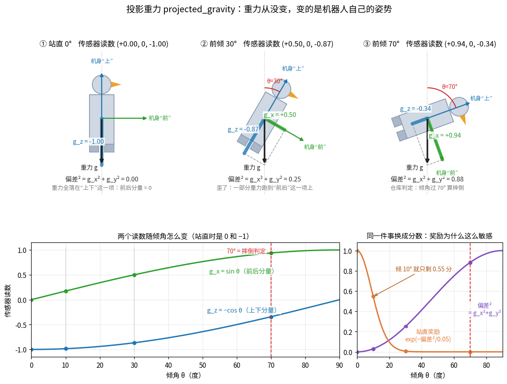
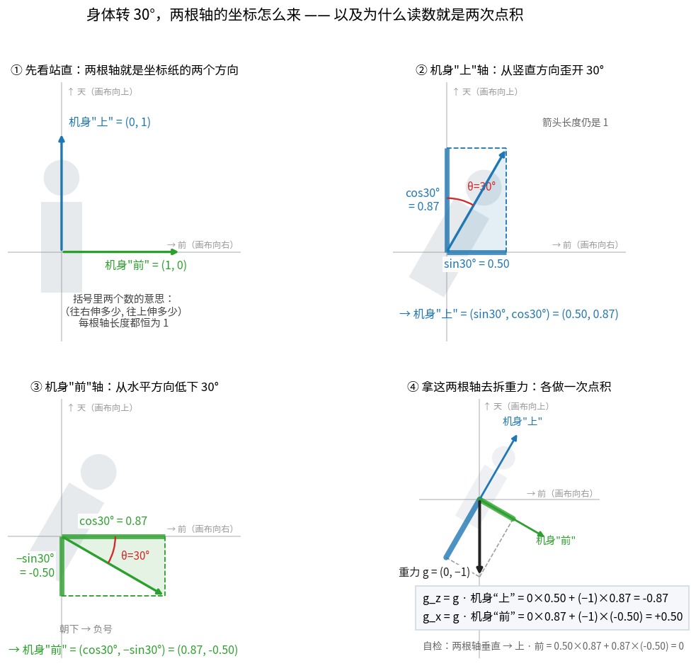

# 第 2 章 · 向量与矩阵

> **上一章我们有了什么**：函数、导数、链式法则，还有钟形打分 $\exp(-\text{偏差}^2/\sigma^2)$。
>
> **这一章要补什么**：上一章打分代码里的"偏差"其实不是一个数——它一次减了**两个**数（前后方向、左右方向）。
> 观测是 61 个数，动作是 14 个数，网络第一层把 61 个数变成 512 个。
> 机器学习里几乎没有"一个数"，全是"一串数"和"一表数"。这一章给它们起名字、定运算。
>
> **本章新词**：向量、点积、长度、矩阵、矩阵乘向量。
> **需要的前提**：第 1 章 + 勾股定理（3² + 4² = 5²）。

---

## 2.1 向量：一张购物清单

去超市买：3 个苹果、2 个梨、1 个西瓜。写成一串数：**(3, 2, 1)**。
顺序有意义——第 1 位永远是苹果、第 2 位永远是梨。

这就是**向量**（vector）：**固定长度、顺序有意义的一串数**。前端里就是一个定长数组：

```js
const cart = [3, 2, 1];   // 苹果、梨、西瓜
```

一串数有几个，就叫几**维**。购物清单是 3 维；机器人的观测是 61 维——一张 61 项的清单，
第 1 位永远是"绕前后轴转多快"，第 7 位永远是"左髋偏航角"……第 15 章会逐项列出这张清单。

数学记号：

| 符号 | 怎么读 | 就是 |
|---|---|---|
| $\mathbf{v}$ | "向量 v" | 整张清单。正式写法加粗或加箭头 $\vec v$；本书后面偷懒不加粗，靠上下文 |
| $v_i$ | "v 下标 i" | 第 i 项，`v[i]`。数学从 1 数起，代码从 0 数起 |
| $\mathbb{R}^{61}$ | "R 的 61 次方" | "61 个实数排成一串"的全部可能。"观测 $\in \mathbb{R}^{61}$"就是"观测是 61 维向量" |

### 两张清单相加、清单翻倍

上午买了 (3, 2, 1)，下午又买了 (4, −1, 0.5)（−1 表示退了一个梨）。一共买了多少？**逐项相加**：

$$(3, 2, 1) + (4, -1, 0.5) = (7, 1, 1.5)$$

明天买双份：**每一项乘 2**：$2 × (3, 2, 1) = (6, 4, 2)$。

前端里就是 `a.map((ai, i) => ai + b[i])` 和 `a.map(ai => 2 * ai)`。减法同理。

上一章打分代码里 `command[:, :2] - actual[:, :2]` 就是两张 2 项清单相减：
(指令前后速度, 指令左右速度) − (实际前后速度, 实际左右速度) = (前后偏差, 左右偏差)。

> **停一下，自测**：(1, 2, 3) + (4, −1, 0.5) = ？
> <details><summary>答案</summary>(5, 1, 3.5)。实验第 1 节打印的就是这个。</details>

## 2.2 点积：清单 × 价格 = 总价

苹果 4 块一个、梨 −1 块（打折倒贴）、西瓜 0.5 块。价格也是一张清单 (4, −1, 0.5)。
购物清单 (1, 2, 3) 一共多少钱？**每一项数量 × 单价，再全部加起来**：

$$1×4 + 2×(-1) + 3×0.5 = 4 - 2 + 1.5 = 3.5$$

这个"对应项相乘再相加"叫**点积**（dot product），写作 $\mathbf{a}\cdot\mathbf{b}$，读"a 点 b"。
输入两张同样长的清单，输出**一个数**。

正式公式：

$$\mathbf{a}\cdot\mathbf{b} = \sum_{i=1}^{n} a_i b_i$$

这里第一次出现大 Σ（"西格玛"）。它就是一个 for 循环：

```js
let s = 0;
for (let i = 0; i < n; i++) s += a[i] * b[i];   // 这就是 Σ a_i b_i
```

| 符号 | 怎么读 | 就是 |
|---|---|---|
| $\sum_{i=1}^{n}$ | "对 i 从 1 到 n 求和" | for 循环，i 从 1 跑到 n，把后面的东西累加 |
| $a_i b_i$ | | 第 i 项相乘 |

numpy 里写 `a @ b`。实验第 1 节手算和 numpy 都得 3.5。

**为什么重要**：神经网络里每一个"神经元"做的第一件事，就是拿自己的一张"价格表"（权重）和输入清单算一次点积
（第 6 章）。总价高 = "这个输入长得像我在找的东西"。

<details>
<summary>进阶：点积的几何意义（现在可跳过）</summary>

$\mathbf{a}\cdot\mathbf{b} = \|\mathbf{a}\|\,\|\mathbf{b}\|\cos\theta$，θ 是两个向量的夹角。
同向时 cos θ = 1 点积最大，垂直时为 0，反向为负。所以点积衡量"两个方向多一致"。
实验算出 (1,2,3) 和 (4,−1,0.5) 夹角 77°，接近垂直，所以 3.5 相对它们的长度不算大。
第 3 章讲"梯度方向涨得最快"时会用到这一条。
</details>

## 2.3 长度：勾股定理

向量 (3, 4) 画在纸上是从原点指向 (3, 4) 的箭头。它多长？勾股定理：$\sqrt{3^2 + 4^2} = \sqrt{25} = 5$。

三维、61 维一样：**每一项平方，加起来，开根号**。这叫向量的**长度**，正式名字叫**范数**（norm），写作 $\|\mathbf{v}\|$：

$$\|\mathbf{v}\| = \sqrt{v_1^2 + v_2^2 + \cdots + v_n^2}$$

实验：$\|(1, 2, 3)\| = \sqrt{1 + 4 + 9} = \sqrt{14} = 3.74$。

代码里更常见的是**长度的平方** $\|\mathbf{v}\|^2 = v_1^2 + \cdots + v_n^2$——不开根号，省事，也没有根号带来的求导麻烦。

**现在把上一章的打分公式说准确。** 偏差是 2 维向量（前后偏差，左右偏差）。
代码 `torch.sum(torch.square(...))` 算的是"每项平方再加起来"= **偏差向量的长度平方**。所以

$$\text{分数} = \exp\!\left(-\frac{\|\mathbf{偏差}\|^2}{\sigma^2}\right)$$

上一章的一维版本只是它的特例。"偏差多大"在多维里的意思就是"偏差向量多长"。

**单位向量**：长度恰好为 1 的向量，只保留"方向"。任何非零向量除以自己的长度就变成单位向量（零向量不能除以长度 0）：
(1, 2, 3)/3.74 = (0.27, 0.53, 0.80)。下一节马上用到。

## 2.4 手机的重力感应：项目里的第一个真实向量

手机里有个重力传感器。手机平放桌上，它读到"重力朝下"；把手机竖起来，它读到"重力朝手机的底边"——
所以手机知道该横屏还是竖屏。**重力没变，变的是手机自己的姿势。**

再说得直白一点：这个传感器**不会**告诉你"世界的下在哪"（那永远是同一个方向，不用问）。
它告诉你的是：**"从我自己的身体看，下在哪一边。"** 手机躺着，"下"在它的背面；手机立着，"下"在它的底边。
读数变了，是因为"我"转了。

机器人身上有同样的传感器。观测 61 项里第 4–6 项叫 `projected_gravity`（投影重力）：
**从机器人自己的角度看，重力指向哪个方向**，用一个 3 维单位向量表示（长度恒为 1，只表示方向，就是 2.3 节最后那个"单位向量"）。



### 怎么读上面这张图

先只看上面一排的三张小图，它们是同一个机器人的三种姿势（站直、前倾 30°、前倾 70°）。每张图里有四样东西：

| 图里的东西 | 是什么 | 三张图之间变不变 |
|---|---|---|
| 黑色粗箭头「重力 g」 | 世界的"下"。永远竖直向下，长度永远是 1 | **完全不变** |
| 蓝色细箭头「机身"上"」 | 机器人自己的上下轴，钉在身上 | 跟着身体一起转 |
| 绿色细箭头「机身"前"」 | 机器人自己的前后轴，钉在身上 | 跟着身体一起转 |
| 蓝色粗短段、绿色粗短段 | 把黑箭头**拆**到那两根轴上，各占多少 | 姿势一变就变 |

那两段粗线的长度（带正负号），就是传感器报给策略网络的两个数：沿"机身上"轴的那段是 $g_z$，沿"机身前"轴的那段是 $g_x$。
虚线画出的那个平行四边形只是在说一件事：**绿段 + 蓝段 = 黑箭头**，一点没多、一点没少。

三张图连起来看就是全部故事：

1. **站直**：黑箭头正好压在"机身上"轴上，全部重力都落进 $g_z$ 这一项，$g_z=-1$，而 $g_x=0$。
2. **前倾 30°**：身体转了，黑箭头没转，于是它开始"斜着"压在两根轴上——$g_x$ 从 0 变成 0.50，$g_z$ 从 −1 缩到 −0.87。
3. **前倾 70°**：大部分重力都跑到"前后"那一项去了，$g_x=0.94$，$g_z$ 只剩 −0.34。仓库就是在这里判定"摔倒"。

**一句话**：$g_x$ 是"歪度计"（站直是 0，越歪越大），$g_z$ 是"倒没倒计"（站直是 −1，躺平是 0）。

### 这两个数怎么算出来——就是 2.2 节的点积

"把一个箭头拆到某根轴上占多少"，数学上就是**和那根轴的单位向量做一次点积**：

$$g_x = \mathbf{g}\cdot\hat{\mathbf{x}}_{\text{机身前}}, \qquad g_z = \mathbf{g}\cdot\hat{\mathbf{z}}_{\text{机身上}}$$

下面这张图把前倾 30° 这一种情况从头到尾算了一遍（为了看得清，画的是侧视的二维截面：**画布向右 = 机器人的前，画布向上 = 天**）。



#### ① 先看站直：两根轴就是坐标纸的两个方向

括号里两个数的约定先说死：**(往右伸多少, 往上伸多少)**。站直时

- 机身"上"轴笔直朝天 → $(0,\,1)$，一点不往右
- 机身"前"轴水平朝前 → $(1,\,0)$，一点不往上

这两根轴有三条性质，后面一直成立：**长度恒为 1**、**互相垂直 90°**、**钉死在身体上**（身体转多少，它俩就跟着转多少）。

#### ② 机身"上"轴转 30° 后 = (sin30°, cos30°)

身体前倾 30°，这根原本朝天的箭头就**从竖直方向歪开了 30°**。图里那个直角三角形把它拆开：

- 斜边 = 箭头本身，长度还是 **1**（转动不改变长度）
- 竖直那条直角边 = $\cos 30° = 0.87$
- 水平那条直角边 = $\sin 30° = 0.50$

$$\text{机身"上"} = (\sin 30°,\ \cos 30°) = (0.50,\ 0.87)$$

这不是新公式，就是 sin / cos 的定义本身：**一根长度为 1、从竖直方向歪开 θ 的箭头，水平占 $\sin\theta$、竖直占 $\cos\theta$**（下一小节"补课"专门讲）。

> **直觉检查**：才歪 30° 不算多，所以它应该"主要还朝上、稍微朝前"。0.87 > 0.50 ✓。
> 歪到 90°（趴平）时就变成 $(1,\,0)$——全朝前、一点不朝上。

#### ③ 机身"前"轴转 30° 后 = (cos30°, −sin30°)

同一次转动，这根原本水平朝前的箭头**鼻子朝下低了 30°**。它离水平只差 30°，所以三角形里两条边换了个位置：

- 水平那条 = $\cos 30° = 0.87$（还是主要朝前）
- 竖直那条 = $-\sin 30° = -0.50$，**负号就是"朝下"**

$$\text{机身"前"} = (\cos 30°,\ -\sin 30°) = (0.87,\ -0.50)$$

**为什么两个数像是"换了个位置"？** 因为两根轴永远差 90°。一根从竖直量起是 30°，另一根从水平量起就也是 30°，而 sin 和 cos 正好是一对互换的函数（$\sin 30° = \cos 60°$）。所以一根写成 $(\sin,\cos)$，另一根就写成 $(\cos,-\sin)$：数字对调，再给"低头"那一份加负号。

#### ④ 拿这两根轴去拆重力：各做一次点积

万事俱备。重力在这张图里是 $\mathbf{g}=(0,\,-1)$（不往右、往下 1）。按 2.2 节"对应项相乘再相加"：

$$g_z = \mathbf{g}\cdot\text{机身"上"} = 0×0.50 + (-1)×0.87 = -0.87$$

$$g_x = \mathbf{g}\cdot\text{机身"前"} = 0×0.87 + (-1)×(-0.50) = +0.50$$

第一个式子里**第一项直接是 0**，因为重力没有水平成分；剩下的就是 $-1$ 乘那根轴的竖直分量。
第二个式子里出现**负负得正**：重力朝下是 $-1$，"前"轴也朝下低了头（$-0.50$），两个"朝下"一乘就成了正的 $+0.50$——这正是"前倾时 $g_x$ 为正"的来源。

和上一张大图里标的 $(+0.50,\ 0,\ -0.87)$ 一模一样。**所以这一节其实没有新东西——只是 2.2 节的点积换了个场景。**

> **两个可以随手验的自检**（图里右下角也写了）：
> - 两根轴垂直：$0.50×0.87 + 0.87×(-0.50) = 0$。点积为 0 = 两个方向垂直（2.2 节那个折叠的"进阶"）。
> - 读数还是单位向量：$0.50^2 + 0.87^2 = 0.25 + 0.75 = 1$ ✓

<details>
<summary>进阶：一次算完两根轴——这就是下一节的矩阵</summary>

"把一个向量转 θ 角"有通用公式。前倾在这张图里是顺时针转，于是

$$(x,\ y)\ \longrightarrow\ (x\cos\theta + y\sin\theta,\quad -x\sin\theta + y\cos\theta)$$

把两根轴的初始值代进去，两行就出来了：

- 机身"上" $(0,1) \to (\sin\theta,\ \cos\theta) = (0.50,\ 0.87)$
- 机身"前" $(1,0) \to (\cos\theta,\ -\sin\theta) = (0.87,\ -0.50)$

把这两行叠成一张表，就是一个 $2\times2$ 的**旋转矩阵**——学完 2.5 节你会发现"转一个姿势"就是乘这么一张表。
三维里换成 $3\times3$，MuJoCo 里再压缩成 4 个数的四元数。

顺带一提：因为旋转矩阵的每一行本身就是一根身体轴，**"矩阵乘向量 = 每行做一次点积"（2.5 节）在这里就是"每根轴各拆一次重力"**——③④ 两步其实是同一件事的两种写法。

</details>

用三角函数写成通式就是 $g_x=\sin\theta$、$g_z=-\cos\theta$（下一小节专门补 sin/cos）。实验第 2 节把几个角度都算了出来：

```
前倾角°  g_x(身体系)  g_y        g_z  g_x²+g_y²
-------  -----------  ---  ---------  ---------
      0            0    0         -1          0
     10     0.173648    0  -0.984808  0.0301537
     30          0.5    0  -0.866025       0.25
     70     0.939693    0   -0.34202   0.883022
```

> **关于正负号**：往前倾 $g_x$ 为正，往后仰就是负，左右歪则是 $g_y$ 变。哪边算正取决于"前"轴朝哪定，
> 换个约定符号就翻过来。下面奖励只用到平方，所以**符号不影响本节任何结论**——先别在符号上卡住。

### 这两个数在项目里各管一件事

看表的最后一列：前后分量和左右分量的平方和 $g_x^2+g_y^2$。站直时是 0，越歪越大，70° 时 0.88。
**它正是"站直打分"用的偏差²**：站直奖励 = $\exp(-(g_x^2 + g_y^2)/0.05)$——就是第 1 章的钟形打分，
只是这次"偏差"是一个 2 项向量的长度平方（2.3 节）。

这正是图里右下角那张小图：紫线是偏差²，橙线是它换算出来的分数。
倾 10° 时偏差² = 0.03，分数 $\exp(-0.03/0.05) = 0.55$——只剩一半，所以站直这一项的宽容度 0.05 很严。

而"摔倒"的判定看第 3 项：站直时 $g_z = -1$，倒地时接近 0。仓库定的阈值是倾斜超过 70° 算摔倒
（那一行 $g_z = -0.34$，也就是图里两张曲线图上的红色虚线）。

> **停一下，自测**：机器人向左歪了 30°，`projected_gravity` 的三个数大约是多少？
> <details><summary>答案</summary>左右那一项 $g_y=\pm0.5$（符号看"左"定成正还是负），$g_x=0$，$g_z=-0.87$。
> 偏差² 仍是 0.25——站直奖励只问"歪多少"，不问"往哪歪"。</details>

### 补课：没学过 sin、cos 的先看这里

角度描述“转了多少”。整圈是 360°，也是 $2\pi$ 弧度；
因此 30° 是 $30\pi/180=\pi/6\approx0.524$ rad。
代码里的三角函数通常接收弧度，不能把数字 30 直接当 30° 传进去。

画一个长度为 1 的箭头，从竖直方向倾斜 θ——就是上图里那根蓝色的"机身上"轴。
它在竖直方向的长度是 $\cos\theta$，在水平方向的长度是 $\sin\theta$。
你可把 cos 和 sin 先当两台“角度输入、分量比例输出”的函数：

| θ | sin θ：水平分量大小 | cos θ：竖直分量大小 |
|---:|---:|---:|
| 0° | 0 | 1 |
| 30° | 0.5 | 0.866025 |
| 60° | 0.866025 | 0.5 |
| 90° | 1 | 0 |

长度没变，所以勾股定理给出 $\sin^2\theta+\cos^2\theta=1$。
分量的正负还取决于你把哪个轴方向定为正；不要从“水平分量大小”直接猜符号。

站直的重力指向负 z，所以 $g_z=-\cos\theta$。
若测得 $g_z=-0.5$，就有 $\cos\theta=0.5$，表中对应倾斜 60°。
“已知 cos 值反查角度”的函数叫 $\arccos$，所以倾角是 $\arccos(-g_z)$。
这比仅记住摔倒阈值 −0.34 更有用：你能解释阈值从哪来。

还有一个容易漏的反例：倒立 θ=180° 时，$g_x^2+g_y^2$ 也为 0。
所以只用水平分量平方做站直核，本身分不清正立和倒立；走路任务还依赖终止条件等约束。
不能把“在正常站立附近倾得越多、扣得越多”无限推广到整个角度范围。

<details>
<summary>进阶：这些数是怎么算出来的（坐标系与旋转）</summary>

"从机器人自己的角度看"在数学上叫**坐标系变换**：世界坐标系里重力永远是 (0, 0, −1)，
把它换算到钉在机器人身上的"身体坐标系"，是一次**旋转**。旋转在数学上是乘一个 3×3 的矩阵（本章 2.5 节讲矩阵）。
绕左右轴前倾 θ 时结果是 $(\sin\theta, 0, -\cos\theta)$，表里的数就是这么来的；$g_x^2 + g_y^2 = \sin^2\theta$。

MuJoCo 存机器人朝向用的是 4 个数的**四元数**（quaternion），代码里叫 `quat`。你现在只需知道：
四元数 = "用 4 个数表示一个旋转"的紧凑格式，`quat_apply_inverse(quat, v)` = "把世界系向量 v 转到身体系"。
注意观测里的 `head_pose(4)` 也是 4 个数，但那是 4 个关节角，不是四元数。
</details>

## 2.5 矩阵：三家店的价格表

一家店的价格是一张清单。三家店呢？一张**表**：

|  | 苹果 | 梨 | 西瓜 |
|---|---|---|---|
| 店 A | 1 | 0 | 2 |
| 店 B | 0.5 | −1 | 1 |

这张表就是**矩阵**（matrix）：二维数组。2 行 3 列，记作 $2 \times 3$，读"2 乘 3"。**先说行数，再说列数**。

$$W = \begin{pmatrix} 1 & 0 & 2 \\ 0.5 & -1 & 1 \end{pmatrix}$$

| 符号 | 怎么读 | 就是 |
|---|---|---|
| $W$ | | 矩阵习惯用大写字母 |
| $W_{ij}$ | "W 下标 i j" | 第 i 行第 j 列那一格，`W[i][j]` |
| $m \times n$ | "m 乘 n" | m 行 n 列。**先行后列**，最容易记反的地方 |

### 矩阵乘向量 = 每家店各算一次总价

购物清单 (1, 2, 3)，在每家店各花多少钱？**每一行和清单做一次点积**：

- 店 A：1×1 + 0×2 + 2×3 = 7
- 店 B：0.5×1 + (−1)×2 + 1×3 = 1.5

结果是一张新清单 (7, 1.5)——"在每家店的花费"。写作 $W\mathbf{x}$，读"W 乘 x"：

$$(W\mathbf{x})_i = \sum_{j} W_{ij}\, x_j \qquad\text{（第 i 个输出 = 第 i 行 与 x 的点积）}$$

实验第 3 节：`W @ x = [7, 1.5]`，和逐行点积一致。

**形状规则**：$(2 \times 3)$ 的表 乘 3 项清单 得 2 项清单。**表的列数必须等于清单的项数**（3 = 3），
输出的项数等于表的行数（2）。记法："内侧对上，外侧留下"。

前端里就是一个 `map` 套一个 `reduce`：

```js
const y = W.map(row => row.reduce((s, wij, j) => s + wij * x[j], 0));
```

GPU 擅长的正是同时算几百个这样的 reduce。

## 2.6 一层神经网络 = 一张 512 行 61 列的价格表

现在可以说清"网络第一层把 61 个数变成 512 个"是什么意思了：

- 输入清单 $\mathbf{x}$：61 项（观测）。
- 一张 $512 \times 61$ 的价格表 $W$：512 家"店"，每家对 61 项各有一个价。
- 输出：512 项——"在每家店的总价"。

再给每家店加一个固定运费 $\mathbf{b}$（512 项），就是完整的一层：

$$\mathbf{y} = W\mathbf{x} + \mathbf{b}$$

| 符号 | 在网络里叫 | 形状 |
|---|---|---|
| $\mathbf{x}$ | 输入 | 61 |
| $W$ | **权重**（weight） | $512 \times 61$ |
| $\mathbf{b}$ | **偏置**（bias） | 512 |
| $\mathbf{y}$ | 输出 | 512 |

这一层有多少个"旋钮"（参数）？价格表 512 × 61 = 31,232 个，运费 512 个，**共 31,744 个**。
实验第 4 节用 `torch.nn.Linear(61, 512)` 建了真的这一层，用 numpy 手写 `W @ x + b` 算了一遍，
逐位相同，参数个数恰好 31744。第 6 章把四层全数出来。

<details>
<summary>进阶：转置、批量（现在可跳过）</summary>

**转置** $W^\top$（读"W 转置"）：把行和列互换，$2\times3$ 变 $3\times2$。实验第 5 节演示。
点积也常写成 $\mathbf{a}^\top\mathbf{b}$——"把 a 躺平和 b 相乘"。

**批量**：训练时一次喂 4096 张观测清单。把它们排成一个 4096 行 61 列的大表，一次矩阵乘矩阵全算完
（$(4096\times61)$ 乘 $(61\times512)$ 得 $(4096\times512)$，还是"内侧对上"）。
所以代码里的张量总多一个"环境数"维度，看到 `dim=1` 就想"对每只机器人各算一个"。
</details>

---

## 2.7 把一条批量计算拆到每一个格子

“4096×61”不是一个巨大的乘法答案，而是一张表的**形状**：4096 行机器人，每行 61 个数。
先缩小成两只机器人、每只两个速度误差：

$$E=\begin{pmatrix}0.1&-0.2\\-0.3&0.4\end{pmatrix}.$$

第一行是 A，第二行是 B；第一列是前后误差，第二列是左右误差。
我们要的是“每只机器人的误差有多大”，所以不能直接把四个格子全加起来。

先逐格平方，负误差也变正：

$$E^2_{\text{逐元素}}=\begin{pmatrix}0.01&0.04\\0.09&0.16\end{pmatrix}.$$

然后**每行内部**相加：A 得 0.05，B 得 0.25。PyTorch 写法：

```python
squared_error = E.square().sum(dim=1)  # shape: [2, 2] → [2]
reward = torch.exp(-squared_error / 0.1)
# A: exp(-0.5) ≈ 0.606531；B: exp(-2.5) ≈ 0.082085
```

`dim=1` 指第二个轴，也就是“同一行的各列”。如果改成 `dim=0`，
结果是 `[0.10, 0.20]`：把不同机器人的前后误差合在一起、左右误差合在一起了。
这个结果仍然是两个数，不会因形状错误而报错，但含义已经完全错了。

**张量**（tensor）在这里先理解为“带形状的多维数组”。
`[24, 4096, 61]` 的三个轴依次是采样时间、环境编号、观测分量。
时间轴和环境轴都叫“很多条数据”，但 GAE 沿时间递推时绝不能把两只机器人的经历串起来。

### 矩阵乘法与逐元素乘法不是一回事

用已经会算的点积验证矩阵乘法：

$$X=\begin{pmatrix}1&2\\3&4\end{pmatrix},\qquad
W=\begin{pmatrix}2&0\\1&-1\\0&3\end{pmatrix}.$$

$W$ 有三行，每行负责一个输出。单个列向量输入时算 $Wx$；
现在每个样本横放在 $X$ 的一行，批量公式应写成 $XW^\top$。
$\top$ 是转置，把 $W$ 从 3×2 翻成 2×3，才能让内侧的 2 对上。

第一行输入 `[1,2]` 得到 `[2, -1, 6]`；第二行 `[3,4]` 得到 `[6, -1, 12]`。
所以输出是 2×3：两只机器人，每只三个输出。
若偏置是 `[0.5, 0, -1]`，给**每一行**加同一份偏置，得到 `[2.5,-1,5]` 和 `[6.5,-1,11]`。
这叫广播，不是两只机器人共用一条观测。

`X * X` 通常是逐格相乘；`X @ W.T` 才是矩阵乘法。
每次看不懂运算，先写出轴的名字和输入输出形状，再代一行数字，往往比背公式有效。

### 向量“长度”什么时候有物理意义

前后速度与左右速度同为 m/s，平方相加后开根号可解释为合成速度。
但 61 维观测里同时有 rad/s、rad、无单位方向和命令，直接取长度不能叫“机器人的总体误差”。
把不同单位相加之前，要说明缩放、归一化或权重。第 8 章解决网络输入尺度，
第 16 章则分别给不同物理量设计评分。

**自测**：把两个环境的 14 个关节动作差排成 `[2,14]`，要每只环境一个平滑代价，应沿哪个轴求平方和？

**解释**：沿 `dim=1`，输出 `[2]`。若输出 `[14]`，你统计的是每个关节跨机器人的合计，不是每只机器人的奖励。

## 📍 映射到项目

> 只需看一眼。语法看不懂没关系。

**61 维观测 = 六张清单首尾拼接。** 真机推理脚本 `scripts/infer_policy.py` 的 `get_observations()`：

```python
obs.append(self.get_base_ang_vel())         # 3 项：身体转多快（陀螺仪）
obs.append(self.get_projected_gravity())    # 3 项：2.4 节的投影重力
obs.append(self.get_joint_pos_relative())   # 14 项：每个关节的角度（减去站姿）
obs.append(self.get_joint_vel())            # 14 项：每个关节转多快
obs.append(self.last_action)                # 14 项：上一步吐出的动作
obs.append(self.command)                    # 13 项：指令
return np.concatenate(obs)                  # 拼起来：3+3+14+14+14+13 = 61
```

`np.concatenate` 就是"把几张清单接成一张"。

**网络第一层**就是实验里那个 `nn.Linear(61, 512)`，在 `rsl_rl/modules/mlp.py` 里被建出来。

**上一章的打分**里 `torch.sum(torch.square(v), dim=1)` = 2.3 节的 $\|\mathbf{v}\|^2$。

## 🧪 动手实验

```bash
uv run python docs/learn-zh/labs/ch02_vectors.py
```

1. 清单相加、翻倍、点积、长度——手算与 numpy 对比。
2. 投影重力随倾角变化的表，并画出 2.4 节的两张图：`ch02_projected_gravity.png`（三种姿势 + 曲线）
   和 `ch02_axis_rotation.png`（两根轴的坐标怎么来 + 两次点积）。
3. 矩阵乘向量 = 逐行点积。
4. 建项目 actor 的第一层，numpy 手写对比，数出 31744 个参数。
5. 转置。

**改一改**：把第 4 节改成 `Linear(512, 256)`（第二层），先心算参数个数再运行验证。

## 本章小结

- **向量** = 购物清单，定长、顺序有意义。观测是 61 项的清单。加法逐项加，翻倍逐项乘。
- **点积** = 清单 × 价格表 = 总价，$\sum a_i b_i$，Σ 就是 for 循环。
- **长度** $\|\mathbf{v}\| = \sqrt{\sum v_i^2}$，勾股定理；代码里常用长度的平方。上一章的"偏差²"其实是偏差向量的长度平方。
- **投影重力**：从机器人自己看重力指哪；把重力这个箭头拆到两根身体轴上，拆出来的两个数就是点积。
  前后左右分量的平方和 = 站直打分的偏差²；上下分量 $g_z$ 管"倒没倒"。
- **矩阵** = 多家店的价格表，$m\times n$ 先行后列；**矩阵乘向量** = 每行各算一次总价。
- 一层网络 $\mathbf{y} = W\mathbf{x} + \mathbf{b}$：第一层 512×61 的表 + 512 个运费 = 31,744 个旋钮。

**下一章**：第 1 章的导数只管"一个旋钮"。网络有 197,788 个旋钮，得同时知道每一个往哪拧。
这个"每个旋钮的导数排成的清单"叫**梯度**——[第 3 章 · 多变量与梯度](03-多变量与梯度.md)。
