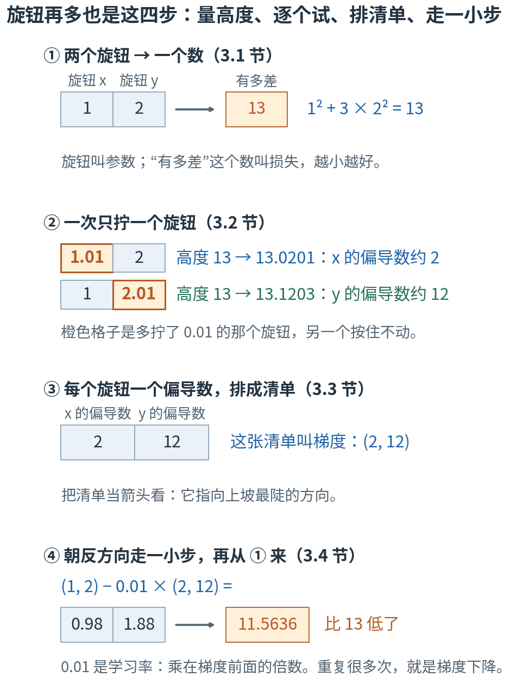
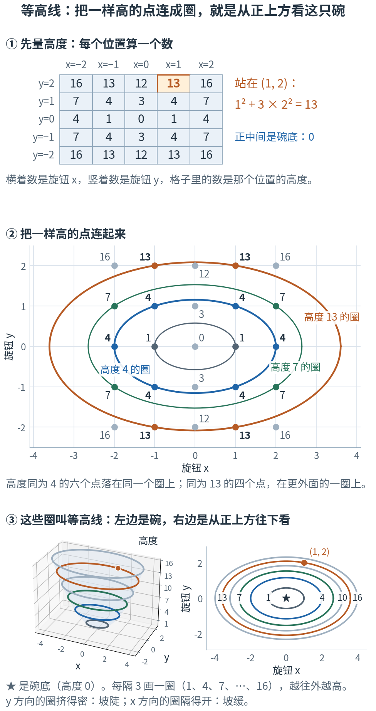
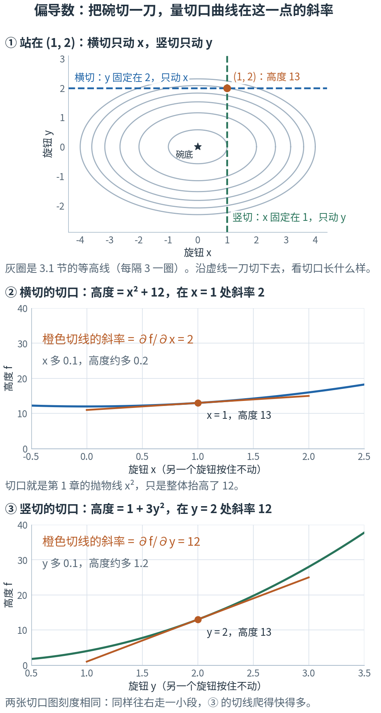
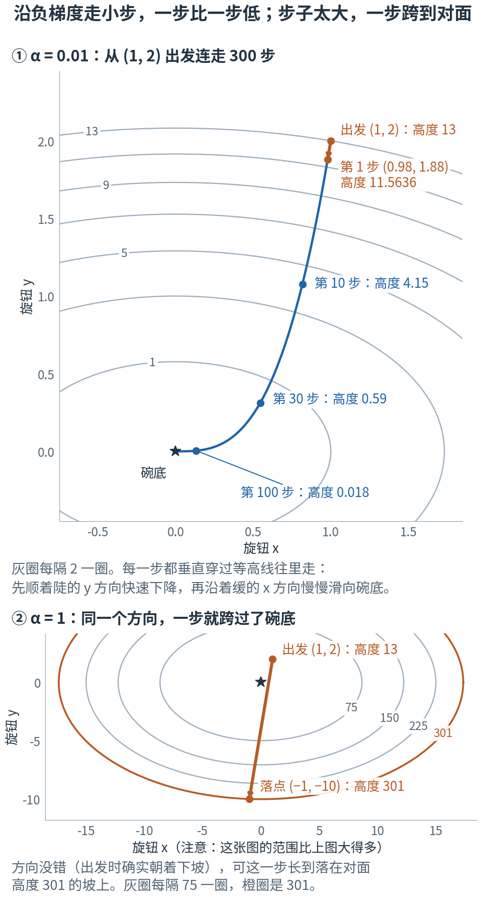
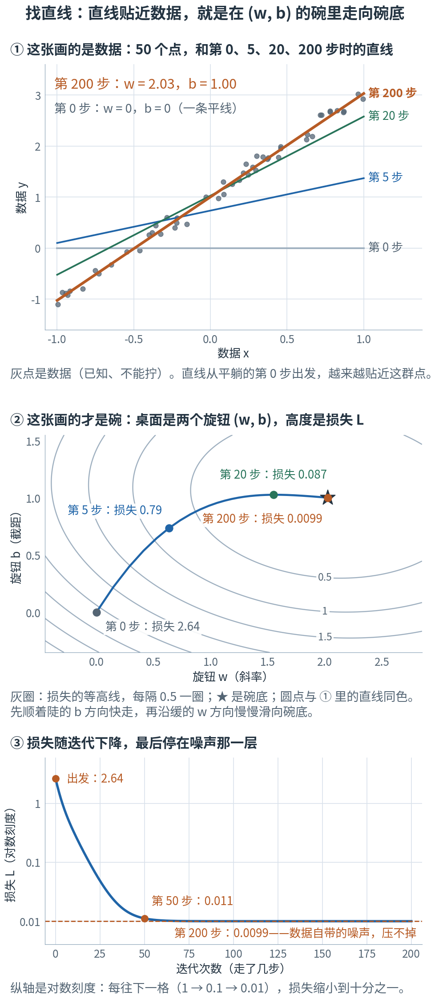
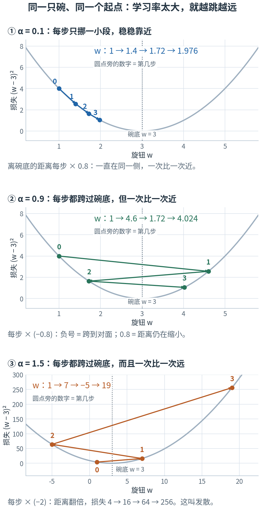
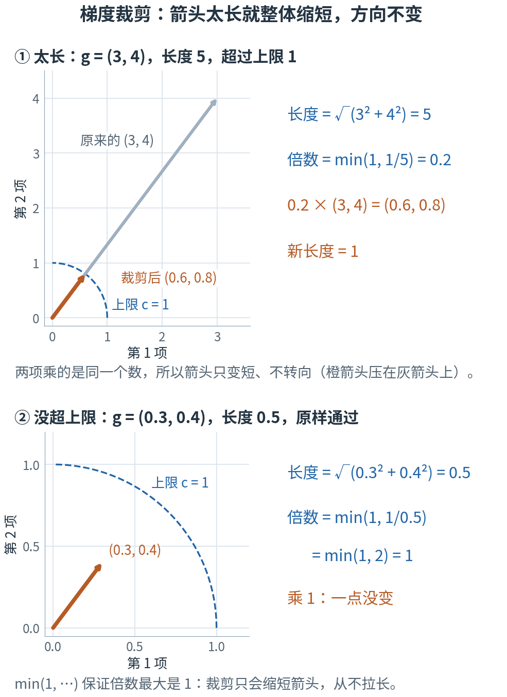

# 第 3 章 · 多变量与梯度：近二十万个旋钮，每个该往哪边拧

> **上一章我们有了什么**：向量和矩阵。一层网络就是 $W\mathbf{x}+\mathbf{b}$，光第一层就有 31,744 个旋钮。
>
> **这一章要补什么**：第 1 章的导数只回答"**一个**旋钮拧一点，结果动多少"。
> 可是训练要拧的是**全部**旋钮——策略网络（代码里叫 actor）一共有 197,788 个可以训练的旋钮（第 6 章数给你看）。
> 得同时知道每一个该往哪边拧、拧多少。这一章先用**两个**旋钮把这件事从头到尾做一遍：
> 量出每个旋钮的导数，排成一张清单，再照着清单往"变好"的方向各拧一小步，重复很多次。
> 旋钮从 2 个变成 197,788 个，做法一步不变。
>
> **本章新词**：参数、损失函数、偏导数、梯度、梯度下降、学习率、均方误差、梯度裁剪。
> **需要的前提**：第 1 章的导数（"缩 h"、切线的斜率、求导规则、链式法则），第 2 章的清单、点积（2.2 节）和长度（2.3 节）。
> **不要求**会三角函数——用到角度的地方，表里都直接给出了数。标"进阶"的折叠块可以第二遍再读。

---

## 3.0 先看地图：两个旋钮、一个“有多差”，反复往变好的方向拧

**好几个旋钮一起决定一个数。只拧其中一个、量出来的斜率叫偏导数；每个旋钮一个偏导数，排成一张清单，就是梯度；
照着梯度的反方向、每个旋钮各拧一小步，反复做，就是梯度下降。**

先想象你在调淋浴。龙头有两个旋钮：一个管热水，一个管冷水。你站在水下只关心一件事——**现在有多难受**
（太烫难受，太冰也难受）。两个旋钮的位置，决定了这一个"难受程度"。

你不会去解方程。你的做法是：只拧热水那个一点点，感觉一下是变好还是变坏；再试试冷水那个；
然后两个都朝"变好"的方向各拧一点。重复几轮，水就舒服了。
拧得太猛会怎样你也知道：烫了 → 猛拧回去 → 冰了 → 再猛拧 → 更烫。

这一章就是把这套动作写成数学，好让计算机对 197,788 个旋钮同时做。



**读图顺序：** 从 ① 到 ④ 竖着读，④ 做完再回到 ①。图里的数字现在不用算，3.1–3.4 节会一个一个手算出来；
现在只要看清"先量、再逐个试、排成清单、走一小步"这个次序。

| 概念 | 它在回答什么问题 | 淋浴里对应什么 | 在哪一节 |
|---|---|---|---|
| 参数 | 我们能调的是哪些数？ | 两个旋钮的位置 | 3.1 |
| 损失函数 | 调成这样，结果有多差？（一个数，越小越好） | 现在有多难受 | 3.1 |
| 偏导数 | 别的不动、只动这一个旋钮，结果变多快？ | 只拧热水，感觉变化 | 3.2 |
| 梯度 | 每个旋钮各自该往哪边拧、多敏感？ | 两个旋钮各一条"试拧结论" | 3.3 |
| 梯度下降 | 怎样一步步把损失降下去？ | 都朝变好的方向拧一点，重复 | 3.4–3.5 |
| 学习率 | 照着梯度拧的时候，整体拧多猛？（乘在梯度前面的一个倍数） | 你下手的轻重 | 3.4、3.6 |
| 均方误差 | 一批预测平均错了多少？ | （找直线时用的"有多差"） | 3.5 |
| 梯度裁剪 | 梯度大得离谱时怎么保险？ | 手再急，一次也只许拧这么多 | 3.7 |

表里的名字先不背，英文和符号到了各节再给。本章最容易混的四处，先贴上标签：

- **第 1 章的 f′ 和本章的 ∂f/∂x**：同一种量法。只有一个旋钮时写 f′；有好几个旋钮、只动其中一个时，写成 ∂f/∂x 这种样子（3.2 节）。
- **梯度裁剪 和 PPO 裁剪**：名字都叫"裁剪"，剪的东西完全不同。本章的梯度裁剪剪的是"这一步的梯度箭头有多长"；
  第 13 章（PPO 的裁剪）剪的是另一样东西。3.7 节会再提醒一次。
- **"梯度算对了" 和 "这一步一定变好"**：是两个判断。梯度只描述脚下这一点的坡；步子迈太大，照样会跨到对面更高的坡上（3.4、3.6 节）。
- **x、y 中途换角色**：前四节里 x、y 是能拧的旋钮；到 3.5 节找直线时，x、y 变成了已知的数据，旋钮换成 w 和 b。换的地方有 ⚠️ 提醒。

现在觉得这些区别有点抽象很正常，读到对应小节就清楚了。

第一次读，只要按顺序看正文、图片和手算。标着"进阶"的折叠内容可以先跳过；代码是复核工具，不是阅读门槛。

## 3.1 两个旋钮决定一个数：参数、损失，和一只碗

把淋浴的故事换成能算的数。为了能手算，我们**编**一个最简单的"难受程度"（教学构造，不是真实的水温物理）：

- $x$：热水旋钮离"最舒服的位置"偏了多少格，可正可负；$y$：冷水旋钮偏了多少格。
- 难受程度 = **x 的平方 + 3 × y 的平方**。

平方让"偏左"和"偏右"一样难受（第 1 章的钟形打分用过同一招）。
$y$ 前面的 3 表示冷水旋钮更敏感：同样拧偏 1 格，难受 3 倍。

先代几个位置，全是加减乘除：

| 位置 (x, y) | 怎么算 | 难受程度 |
|---|---|---:|
| (0, 0) | 0² + 3 × 0² | 0 |
| (1, 0) | 1² + 3 × 0² | 1 |
| (0, 1) | 0² + 3 × 1² | 3 |
| (2, 0) | 2² + 3 × 0² | 4 |
| (1, 1) | 1² + 3 × 1² | 4 |
| (−1, 1) | (−1)² + 3 × 1² | 4 |
| (1, 2) | 1² + 3 × 2² = 1 + 12 | **13** |

三件事已经看得出来：两个旋钮都在 0 时最舒服（难受程度 0）；同样偏 1 格，y 方向（3）比 x 方向（1）难受 3 倍；
(2, 0)、(1, 1)、(−1, 1) 位置不同，难受程度却一样，都是 4。**(1, 2) 这个位置、13 这个数，整章都会用。**

写成公式，就是第 1 章的函数多了一个输入——喂**两个**数，吐**一个**数：

$$f(x, y) = x^2 + 3y^2$$

| 符号 | 怎么读 | 就是 |
|---|---|---|
| $f(x, y)$ | "f of x y" | 喂进去两个数 x、y，吐出来一个数 |
| $f(1, 2) = 13$ | | 两个旋钮在 (1, 2) 时，难受程度是 13 |

```js
const f = (x, y) => x * x + 3 * y * y;   // f(1, 2) → 13
```

现在给这两样东西起正式的名字。我们**能调的那些数**，机器学习里叫**参数**（parameter）——本书一直叫它们"旋钮"，是同一个东西。
"调成这样有多差"的那台机器，叫**损失函数**（loss function），它吐出来的数叫**损失**：输入是全部参数，输出是一个数，**越小越好**。
第 1 章列"三台机器"时见过这个名字，这一章开始正式用它。训练 = 找到让损失尽量小的那组参数。

### 把它看成一只碗

把每个旋钮位置 $(x, y)$ 看成桌面上的一个点，把损失看成这个点上方的高度。
每个点一个高度，连成一个曲面——形状像一只碗：碗底在 (0, 0)，高度 0；越往外越高。
"让损失变小" = "往碗底走"。后面说"高度"和说"损失"，是一回事。

### 等高线：不画立体图，也能看出碗的形状

立体的碗不好画、更不好量。地图上有个老办法：**从正上方往下看，把一样高的点连成圈。**
先把位置铺成 5 × 5 的格子，每格算一个高度。实验第 1 节打印的就是这张表（从上往下 y 由大到小，和地图一样）：

```
      x=-2  x=-1  x=0  x=1  x=2
----  ----  ----  ---  ---  ---
 y=2    16    13   12   13   16
 y=1     7     4    3    4    7
 y=0     4     1    0    1    4
y=-1     7     4    3    4    7
y=-2    16    13   12   13   16
```

在表里找高度同为 4 的格子：有 6 个。同为 13 的：有 4 个，我们的 (1, 2) 是其中之一。
把一样高的点用一条线连起来，就得到一圈一圈的线：



**这样读图：** ① 先在表里找到橙色的 13，它就是 (1, 2)。② 每个圆点旁的数字是那个位置的高度；
蓝圈穿过所有高度为 4 的点，橙圈穿过所有高度为 13 的点。③ 左边是立体的碗，几个圈就套在碗壁上；右边是从正上方往下看，碗被"压扁"成了一圈圈线。这一幅特意**每隔 3 画一圈**（高度 1、4、7、10、13、16）。
这些圈叫**等高线**：同一圈上高度处处相同。看懂两件事就算会读了——**越往外的圈越高；相邻两圈的高度差相同时，圈挤得越密的地方，坡越陡**
（从碗底往 y 方向走 2 格要跨过 4 圈，往 x 方向走 2 格只跨过 1 圈、刚踩上第 2 圈）。

**为什么重要**：训练时的损失也是这样一只"碗"，只不过输入不是 2 个旋钮而是 197,788 个，画不出来。
这只两个旋钮的碗是它的迷你版：我们要做的事完全一样——**从碗上某个位置出发，走到碗底**。
（真实的损失地形比碗复杂，3.6 节的折叠块会说到。）

> **停一下，自测**：$f(2, -1)$ 是多少？它落在图 ② 的哪个圈上？(3, 1) 和 (0, 2) 谁更高？
> <details><summary>答案</summary>
>
> $f(2,-1) = 4 + 3 = 7$，在绿色那圈（高度 7）上。$f(3,1) = 9 + 3 = 12$，$f(0,2) = 12$：一样高，它们在同一条等高线上。
>
> </details>

## 3.2 偏导数：一次只拧一个旋钮

站在碗上 (1, 2) 这个位置，高度 13。先问最简单的问题：**y 按住不动，只把 x 拧一点点，高度变多快？**

用第 1 章"缩 h"的老办法，手算两步：

- x 从 1 拧到 1.1：$f(1.1, 2) = 1.21 + 12 = 13.21$。高度涨了 0.21，除以拧的 0.1，变化率 **2.1**。
- 拧得再少一点，到 1.01：$f(1.01, 2) = 1.0201 + 12 = 13.0201$。涨了 0.0201，除以 0.01，变化率 **2.01**。

步子越小，变化率越靠近 **2**。再换成 x 按住不动、只拧 y：

- y 从 2 拧到 2.1：$f(1, 2.1) = 1 + 3 × 4.41 = 14.23$。涨了 1.23，除以 0.1，变化率 **12.3**。
- 到 2.01：$f(1, 2.01) = 1 + 3 × 4.0401 = 13.1203$。变化率 **12.03**，靠近 **12**。

实验第 2 节把步子从 1 一路缩到 0.001：只动 x，变化率依次是 3、2.1、2.01、2.001；只动 y，依次是 15、12.3、12.03、12.003。

为什么恰好是 2 和 12？把"按住一个旋钮"画出来就明白了：



**这样读图：** ① y 固定在 2，就是沿蓝色虚线一刀切下去（图里叫"横切"）；x 固定在 1，就是沿绿色虚线切（图里叫"竖切"）。
图 ②③ 里写的 ∂f/∂x、∂f/∂y 就是下面马上要给的名字，先把它读成"橙色切线的斜率"。
② 蓝色那一刀的切口是 $f = x^2 + 3×2^2 = x^2 + 12$——就是第 1 章那条抛物线 $x^2$，整体抬高了 12。
常数的导数是 0，$x^2$ 的导数是 $2x$，所以在 x = 1 处，橙色切线的斜率是 2。
③ 绿色那一刀的切口是 $f = 1 + 3y^2$，导数是 $6y$，在 y = 2 处是 12。两张切口图刻度相同，一眼看出 ③ 陡得多。

**一次只动一个输入，其他输入当常数按住不动，然后用第 1 章的办法求导**——这样得到的导数叫**偏导数**（partial derivative）。对这只碗：

$$\frac{\partial f}{\partial x} = 2x, \qquad \frac{\partial f}{\partial y} = 6y$$

| 符号 | 怎么读 | 就是 |
|---|---|---|
| $\partial$ | "偏" | 弯弯的 d。第 1 章的导数也可以写成 $\frac{df}{dx}$（d 是"无限小的 Δ"），和 $f'(x)$ 是同一个东西；有好几个输入、只动其中一个时，就把 d 换成 ∂，提醒你"还有别的输入，此刻按住没动" |
| $\dfrac{\partial f}{\partial x}$ | "f 对 x 的偏导" | 只动 x、其他按住时，f 的变化率。算法和第 1 章一模一样 |
| $\dfrac{\partial f}{\partial y}$ | "f 对 y 的偏导" | 只动 y、其他按住时，f 的变化率 |

在 (1, 2) 处，两个偏导数是 $2×1 = 2$ 和 $6×2 = 12$——和上面"缩 h"靠近的两个数对上了（实验把 h 缩到 0.000001 又核对了一遍）。

**解读**：站在 (1, 2)，往 x 方向挪一小段（比如 0.01 格），高度涨约它的 2 倍（0.02）；往 y 方向挪同样一小段，涨约它的 12 倍（0.12）——**在这个位置**，y 方向的坡度是 x 方向的 6 倍。
注意"在这个位置"几个字：偏导数是**某个位置**的坡度，换个位置就换个数（公式 $2x$、$6y$ 里带着位置）。

> **停一下，自测**：在 (−1, 1) 这个位置，两个偏导数各是多少？其中一个是负数，负号在说什么？
> <details><summary>答案</summary>
>
> $\partial f/\partial x = 2×(-1) = -2$，$\partial f/\partial y = 6×1 = 6$。
> 负号就是第 1 章"导数的正负号"那张表：x 往大拧，高度反而**下降**（因为碗底在它右边）。
>
> </details>

## 3.3 梯度：每个旋钮一个偏导数，排成一张清单

两个旋钮，两个偏导数：2 和 12。按固定顺序排成一张清单——用 2.1 节的话说，一个向量：**(2, 12)**。
第 1 位永远是"对 x 的偏导"，第 2 位永远是"对 y 的偏导"。这张清单叫**梯度**（gradient），记作 $\nabla f$。

| 符号 | 怎么读 | 就是 |
|---|---|---|
| $\nabla$ | "纳布拉"，或者直接读"梯度" | 一个倒三角 |
| $\nabla f$ | "f 的梯度" | 全部偏导数排成的清单：$\nabla f = \left(\frac{\partial f}{\partial x}, \frac{\partial f}{\partial y}\right)$。在 (1, 2) 处是 (2, 12) |

**输入有几项，梯度就有几项。** 这里 2 个旋钮，梯度 2 项；项目里 197,788 个旋钮，梯度就是一张 197,788 项的清单——这里的 (2, 12) 是它的迷你版。

这张清单有两种用法，下面各手算一次。

### 用法一：当“价格表”，预测两个旋钮一起动的结果

偏导数 2 的意思是"x 每动 1，高度约动 2"；12 是"y 每动 1，高度约动 12"。两个旋钮一起动，就把两份变化加起来。
比如 x 多拧 0.03、y 少拧 0.01：

$$\text{预计变化} \approx 2 × 0.03 + 12 × (-0.01) = 0.06 - 0.12 = -0.06$$

直接代公式核对：$f(1.03, 1.99) = 1.0609 + 3 × 3.9601 = 12.9412$，实际变化 $12.9412 - 13 = -0.0588$。很接近。

"对应项相乘再相加"——这正是 2.2 节的点积。梯度是价格表（每个旋钮动 1 格，高度涨多少），
"这一步各拧多少"是购物清单，高度的变化就是总价：

$$\Delta f \approx \frac{\partial f}{\partial x}\,\Delta x + \frac{\partial f}{\partial y}\,\Delta y = \nabla f \cdot (\Delta x, \Delta y)$$

（Δ 是第 1 章的"变化量"。）为什么是"≈"不是"="？和第 1 章说的一样：导数只是**当前位置**的坡度，走出去一段，坡度自己也在变。步子越小，预测越准。

### 用法二：当箭头，它指向上坡最陡的方向

2.3 节说过：当清单的每一项代表沿一根坐标轴走多少时，它能画成箭头。梯度 (2, 12) 画在 (1, 2) 处，就是"往右 2、往上 12"的一根箭头。
它有一个漂亮的性质：**这根箭头指向从当前位置出发、上坡最陡的方向。**

不要先信，先试。从 (1, 2) 出发，朝各个方向都走**同样长**的一小步 0.01，看谁涨得最多。先手算两个方向：

- 正右方（只让 x 变大）：$f(1.01, 2) = 1.0201 + 12 = 13.0201$，涨了 **0.0201**。
- 正上方（只让 y 变大）：$f(1, 2.01) = 1 + 3 × 4.0401 = 13.1203$，涨了 **0.1203**。

实验第 3 节一共试了 12 个方向。方向角从正右方算 0°，逆时针转：90° 是正上方，180° 正左，270° 正下。
中间角度那一步具体是 (Δx, Δy) 多少，表里直接给了数（它们由 cos、sin 算出，见 [附录 D.4](../appendix/D-三角函数从0补课.md)；不会也不影响读表）。
你可以随便挑一行自己验：比如 30° 那一行，$f(1.00866, 2.005) - 13 = 0.0775$。

```
方向角°  这一步 Δx  这一步 Δy  f 的实际涨幅  梯度·这一步
-------  ---------  ---------  ------------  -----------
      0       0.01          0        0.0201       0.0200
     30    0.00866      0.005        0.0775       0.0773
     60      0.005    0.00866        0.1142       0.1139
     90          0       0.01        0.1203       0.1200
    120     -0.005    0.00866        0.0942       0.0939
    150   -0.00866      0.005        0.0428       0.0427
    180      -0.01          0       -0.0199      -0.0200
    210   -0.00866     -0.005       -0.0772      -0.0773
    240     -0.005   -0.00866       -0.1137      -0.1139
    270          0      -0.01       -0.1197      -0.1200
    300      0.005   -0.00866       -0.0937      -0.0939
    330    0.00866     -0.005       -0.0425      -0.0427
```

三个观察：

1. 最后一列就是用法一的"价格表预测"。它和实际涨幅每一行相差都不超过 0.0003。
2. 涨得最多的是 90°，跌得最多的是正对面的 270°。
3. 梯度 (2, 12) 这根箭头指向 80.5°（由"往右 2、往上 12"反查角度得到，见 [附录 D.6](../appendix/D-三角函数从0补课.md)）。12 个候选里离它最近的正是 90°。
   实验还正好沿 80.5° 走了一步——这一步是 (0.00164, 0.00986)，长度同样是 0.01——涨了 0.1219，比 12 个候选都多。


**这样读图：** ① 先看橙色那根：站在 (1, 2)，梯度 (2, 12) 几乎笔直朝上——因为这里 y 方向陡得多。
再看三根蓝色的：四个位置都特意选在画出来的圈上（灰圈每隔 3 一圈），每一根箭头都**垂直穿过脚下那一圈、指向更高的一侧**。
坡越陡的地方箭头越长——注意这**不等于**离碗底越远：(1, 2) 和 (2, −1) 离碗底一样远，箭头却一长一短（长度 12.17 对 7.21）；
(0.5, −1.5) 离碗底更近，箭头反而比 (2, −1) 的长（9.06）。差别在于谁更偏向陡的 y 方向。碗底的梯度是 (0, 0)，没有箭头。
② 13 根箭头一样长，尖都落在虚线圈上；旁边的数是走这一步高度涨了多少。橙色是上坡，蓝色是下坡，越粗变化越大。
最粗的橙箭头（90°）紧挨着黑色的梯度方向（80.5°）；最粗的蓝箭头（270°）在 90° 的正对面，也紧挨着梯度的反方向。

所以：**梯度指向上坡最陡的方向；正对面（负梯度）是下坡最陡的方向。** 箭头的长度也有含义：它就是最陡方向上的坡度。
用 2.3 节的办法量，$\|(2, 12)\| = \sqrt{2^2 + 12^2} = \sqrt{148} \approx 12.17$；沿它走 0.01，预计涨 0.1217，实验得 0.1219。

### “最陡”比较的必须是同样长的一步

从 (1, 2) 往 x 方向走 1 整格，高度从 13 涨到 $f(2, 2) = 16$，涨了 3；往 y 方向走 0.01 格，只涨 0.1203。
能说"x 方向更陡"吗？不能——一个走了 1，一个走了 0.01。**比较哪个方向更陡，要先把步长定成一样**，上面的实验 12 步都是 0.01。
另外，"最陡"说的是**当前位置、很小的一步**；它不保证顺着这个方向一直走就是到碗底最短的路（看上图 ①：箭头的反方向并不正对着碗底）。

<details>
<summary>进阶：为什么恰好是梯度方向最陡——点积的几何意义（现在可跳过）</summary>

第 2 章 2.2 节的进阶折叠块留了一句话："第 3 章讲'梯度方向涨得最快'时会用到这一条。"现在用上它：

$$\mathbf{a}\cdot\mathbf{b} = \|\mathbf{a}\|\,\|\mathbf{b}\|\cos\varphi \qquad (\varphi \text{ 是两根箭头的夹角})$$

cos 是一台"输入夹角、输出 −1 到 1 之间的数"的机器：夹角 0°（同向）时是 1，90°（垂直）时是 0，180°（反向）时是 −1
（从 0 补起见 [附录 D.3–D.4](../appendix/D-三角函数从0补课.md)：D.3 讲 0° 到 90°，D.4 讲超过 90° 的角）。

用法一说：高度变化 ≈ 梯度 · 这一步。让这一步的长度固定为 1，只换方向，那么

$$\text{变化率} = \nabla f\cdot\text{方向} = \|\nabla f\| × 1 × \cos\varphi = 12.17 × \cos\varphi$$

12.17 不变，能变的只有 $\cos\varphi$。它最大是 1，出现在夹角 0°——**方向和梯度重合时涨得最快**；
最小是 −1，出现在正对面——**负梯度方向跌得最快**。实验把几个方向都算了一遍：

```
方向角°  ∇f·方向  与梯度的夹角°  cos(夹角)  ‖∇f‖ × cos
-------  -------  -------------  ---------  ----------
      0        2          80.54     0.1644           2
     30    7.732          50.54     0.6356       7.732
     90       12          9.462     0.9864          12
   80.5    12.17              0          1       12.17
```

比如 90° 方向：它和梯度只差 9.46°，$\cos 9.46° = 0.986$，$12.17 × 0.986 = 12$——正是上面大表里 90° 那一行最后一列的 0.1200 ÷ 0.01。

同一条式子还解释了"箭头垂直穿过等高线"：夹角 90° 时点积为 0，高度（几乎）不变——不变高度的方向，就是沿着等高线走。
例如方向 (6, −1)：$2×6 + 12×(-1) = 0$。实验沿它走 0.01，高度只变了 0.000105。

</details>

**想下坡，就朝梯度的反方向走。** 下一节就做这件事。

> **停一下，自测**：在 (−1, 1) 处梯度是多少？想让高度下降，x 该往大拧还是往小拧？y 呢？
> <details><summary>答案</summary>
>
> 梯度是 (−2, 6)（3.2 节自测算过的两个偏导数）。下坡要朝反方向 (2, −6) 走：x 往大拧，y 往小拧。
> 对照上图 ①：那根蓝箭头指向左上方，反方向就是右下方，正是朝碗底那一侧。
>
> </details>

## 3.4 梯度下降：朝下坡方向走一小步，重复

想让损失变小，现在三个问题都有答案了：**往哪走**——梯度的反方向；**走多远**——一小步，大小是梯度乘上一个小倍数；**然后呢**——到了新位置重新量梯度，再走一小步……直到走不动。
先用数字各走一步，再给公式。

### 先走一步：一个旋钮

最简单的碗只有一个旋钮：$L(w) = (w - 3)^2$（换了两个字母：w 取自 weight，就是 2.6 节的"权重"；L 取自 loss）。
碗底在 w = 3，那里损失是 0。现在 w = 1。一轮要做三件事（对照 3.0 节的总览图：量损失是 ①；只有一个旋钮时，② 和 ③ 合成一件事"量坡度"；走一小步是 ④）：

1. **量损失**。$(1-3)^2 = 4$。
2. **量坡度**。用第 1 章的链式法则：外层是平方，导数 $2(w-3)$；内层 $w - 3$ 对 w 的导数是 1；相乘得 $2(w - 3)$。在 w = 1 处是 $2 × (-2) = -4$。
   导数为负：w 往大拧，损失下降（第 1 章那张正负号的表）。
3. **走一小步**。这一步取"−0.1 × 导数"：$w_{\text{新}} = 1 - 0.1 × (-4) = 1 + 0.4 = 1.4$。

然后回到第 1 件事再量一次：$(1.4 - 3)^2 = (-1.6)^2 = 2.56$。**一轮下来，损失从 4 降到 2.56。**

第 3 件事里有两处值得停一下。一是那个减号：减去一个负数等于加，所以 w 变大了。**导数是 −4，不是说要把 w 变成负数，而是说"增加 w 能降低损失"。**
如果站在碗底右边（导数为正），同一条式子会让 w 变小。不用分情况讨论，一条式子两边都对。
二是为什么要**乘上导数**，而不是每次固定挪 0.4：坡陡的地方离碗底还远，该迈大步；快到碗底时坡变缓，步子就自动变小，不会冲过头。

实验第 4 节接着走了几轮，每一轮都在重复上面三件事：

```
第几步       w  导数 2(w − 3)  损失 (w − 3)²
------  ------  -------------  -------------
     0       1             -4              4
     1     1.4           -3.2           2.56
     2    1.72          -2.56         1.6384
     3   1.976         -2.048         1.0486
     4  2.1808        -1.6384         0.6711
```

看 w 那一列：每一步挪的距离自己在变小——0.4 → 0.32 → 0.256。0.1 这个倍数一直没变，是坡变缓了（导数从 −4 到 −3.2 到 −2.56）。

### 再走一步：两个旋钮

回到碗 $f = x^2 + 3y^2$，站在 (1, 2)，高度 13，梯度 (2, 12)。这次步子取"0.01 × 梯度"，**每个旋钮各减各的**：

$$x_{\text{新}} = 1 - 0.01 × 2 = 0.98, \qquad y_{\text{新}} = 2 - 0.01 × 12 = 1.88$$

新高度：$0.98^2 + 3 × 1.88^2 = 0.9604 + 10.6032 = 11.5636$。高度从 13 降到 **11.5636**，实际下降 **1.4364**。

这一步走之前，能不能先估出大约降多少？能，用 3.3 节的"价格表"。这一步是 (−0.02, −0.12)：

$$\text{预计变化} \approx 2 × (-0.02) + 12 × (-0.12) = -0.04 - 1.44 = -1.48$$

预计下降 **1.48**，实际下降 1.4364。接近，但不相等——因为走了一段之后坡变缓了：到了 (0.98, 1.88)，梯度已经从 (2, 12) 变成 (1.96, 11.28)。

还要分清两个 0.01。3.3 节的 0.01 是那一步的**长度**；这里的 0.01 是乘在梯度前面的**倍数**。
这一步实际走的是 (−0.02, −0.12)，长约 0.12，是 3.3 节那一小步的 12 倍——所以高度一下降了 1.4 左右，而不是 0.12。

### 写成一行

$$\theta \leftarrow \theta - \alpha\,\nabla L(\theta)$$

| 符号 | 怎么读 | 就是 |
|---|---|---|
| $\theta$ | "西塔" | 全部参数（旋钮）排成的清单。上面是 (x, y) 两项；项目的 actor 里是 197,788 项 |
| $L(\theta)$ | "L of 西塔" | 损失函数：旋钮拧成 θ 时"有多差"。就是那只碗（上面的 f 也是一个 L） |
| $\nabla L(\theta)$ | "L 的梯度" | 损失对每个旋钮的偏导数排成的清单，和 θ 一样长。也常写成 $\nabla_\theta L$，下标 θ 只是写明"对哪些旋钮求偏导" |
| $\alpha$ | "阿尔法" | 梯度前面的倍数：这一步 = α × 梯度（再取反方向）。上面两次手算里的 0.1 和 0.01 |
| $\leftarrow$ | "更新为" | 编程里的 `=`：右边算完，存回左边 |
| 减号 | | 梯度指上坡，我们要下坡 |

这个"沿梯度反方向走一小步、到了新位置重新量、再走"的循环，叫**梯度下降**（gradient descent）；那个 α 叫**学习率**（learning rate）。
往哪边走、这里该迈大步还是小步，由梯度给；整体放大还是缩小，由 α 定。用你的母语写，就是一个 for 循环：

```js
const grad = ([x, y]) => [2 * x, 6 * y];           // 3.3 节：每个旋钮一个偏导数
let theta = [1, 2];                                // θ：全部旋钮排成的清单
const alpha = 0.01;                                // α：学习率
for (let step = 0; step < 300; step++) {
  const g = grad(theta);                           // 到了新位置，重新量一次坡
  theta = theta.map((t, i) => t - alpha * g[i]);   // θ ← θ − α∇L：每个旋钮各减各的
}
```

这有点像反复微调 CSS 直到"看起来对"——只不过这里有一台仪器，精确地告诉你每个属性该往哪边调、调多少。

### 为什么沿负梯度走，损失就会降

刚才的 1.48 不是凑巧。把"这一步 = −α × 梯度"代进价格表：

$$\text{预计变化} \approx \text{梯度}\cdot(-\alpha × \text{梯度}) = -\alpha × (\text{梯度}\cdot\text{梯度})$$

一张清单和自己做点积，就是每项平方再相加：$2×2 + 12×12 = 148$——正是 2.3 节的长度平方 $\|\nabla f\|^2$。
所以预计变化 = $-0.01 × 148 = -1.48$，和上面一项项加出来的是同一个数。
平方和不可能是负数，α 是正数，所以**只要梯度不全是 0，预计变化就一定是负的**：沿负梯度走，预计只会降、不会升。

<details>
<summary>进阶：写成一般公式（现在可跳过）</summary>

把"这次准备把每个旋钮各改多少"记成一张清单 $\Delta\theta$。3.3 节的价格表就是

$$\Delta L \approx \nabla L\cdot\Delta\theta .$$

梯度下降取 $\Delta\theta = -\alpha\nabla L$，代入得

$$\Delta L \approx -\alpha\,\nabla L\cdot\nabla L = -\alpha\,\|\nabla L\|^2 \le 0 .$$

这里 $\nabla L\cdot\Delta\theta$ 就是 2.2 节的点积，$\|\nabla L\|^2$ 就是 2.3 节的长度平方，旋钮有 2 个还是 197,788 个都成立。
它依赖一个前提：**步子足够小，"≈" 才可信。**

</details>

### “预计会降”要靠步子小

同一个位置、同一个方向（负梯度），只换 α，看预测和实际差多少：

```
学习率 α          新位置  预测变化 −α‖∇f‖²  实际变化   新高度
--------  --------------  ----------------  --------  -------
   0.001  (0.998, 1.988)            -0.148   -0.1476  12.8524
    0.01    (0.98, 1.88)             -1.48   -1.4364  11.5636
     0.1      (0.8, 0.8)             -14.8    -10.44     2.56
       1       (-1, -10)              -148       288      301
```

步子越小，预测越准。α = 0.1 时预测说能降 14.8——可这里总共才 13 高，估算已经明显走样（实际降了 10.44，仍然是降）。
α = 1 时你可以手算：新位置 $(1 - 2,\ 2 - 12) = (-1, -10)$，高度 $(-1)^2 + 3×(-10)^2 = 301$。**从 13 涨到了 301。**
方向本来是下坡，步子过大，却一步跨过碗底，落到了对面更高的坡上。

> ⚠️ **"梯度算对了"和"这一步一定变好"是两个判断。** 梯度只描述脚下这一点的坡；它管不了你迈出去多远之后的地形。
> 训练突然变差时，先怀疑步子（学习率），再怀疑梯度。3.6 节专门讲步子。



**这样读图：** ① 橙色短箭头就是刚才手算的第 1 步。之后每一步都垂直穿过脚下那条等高线、往里走，连成蓝色的路：
先顺着陡的 y 方向快速下降，再沿着缓的 x 方向慢慢滑向碗底（高度 13 → 4.15 → 0.59 → 0.018）。
② 同一个出发点、同一个方向，α = 1 的那一步长到要换一张大得多的地图才画得下：落点在高度 301 的那一圈上。

什么时候停？走到梯度是 (0, 0) 的地方，式子里减掉的就是 0，走不动了。碗底正是这样的地方。
但反过来不一定成立：梯度为 0 的地方不一定是碗底（折叠块里有三个例子）。

<details>
<summary>进阶：梯度为零，不等于学好了（现在可跳过）</summary>

三个一个旋钮的函数，在 0 处导数都是 0，情形却完全不同：

```
函数  0 处的导数  左边 f(−0.1)  右边 f(0.1)               0 是什么
----  ----------  ------------  -----------  ---------------------
  x²           0          0.01         0.01    两边都更高 → 最低点
 −x²           0         -0.01        -0.01    两边都更低 → 最高点
  x³           0        -0.001        0.001  一边低一边高 → 都不是
```

训练里梯度很小，还可能有别的原因：走进了几乎没有坡的平地（第 1 章钟形打分远离目标的那段平尾巴就是）、
数太小被计算机当成了 0、或者输入里根本没有可学的信息。所以判断"学好了没有"，要结合损失、任务指标和机器人的实际行为，
不能只看"梯度很小"。

</details>

顺带一句：想让一个数**变大**（比如得分）而不是变小，就把减号换成加号、顺着梯度走——第 11 章（策略梯度）用的就是加号版。

> **停一下，自测**：在一个旋钮的例子里，从 w = 1.4 再走一步（α 还是 0.1），w 到哪里？损失变成多少？
> <details><summary>答案</summary>
>
> 导数 $2×(1.4-3) = -3.2$；$w = 1.4 - 0.1×(-3.2) = 1.72$；损失 $(1.72-3)^2 = 1.6384$。就是上面那张表的第 2 行。
>
> </details>

## 3.5 找一条直线：把整个循环完整走一遍

前面的碗是现成的公式。真正的训练里，**碗是数据造出来的**。用一个最小的例子走一遍：有几个数据点，想找一条直线尽量贴着它们。

直线 $y = wx + b$ 由两个数决定：$w$ 是第 1 章讲过的斜率，$b$ 是 x = 0 时直线的高度（叫**截距**）。**这两个数就是旋钮。**

> ⚠️ **字母换角色了。** 前四节里 x、y 是旋钮。这一节 x、y 是**数据**——已知的、不能拧的数；能拧的旋钮是 **w 和 b**。
> 碗也换了一只：桌面的两个方向是 w 和 b，高度是损失 $L(w, b)$。后面那张图的 ① 画的是数据，② 画的才是这只新碗。

### 迷你版：3 个点，手算一整轮

三个数据点：(0, 1)、(1, 4)、(2, 7)。它们是为了好算编出来的（教学构造），都落在 $y = 3x + 1$ 上——但**假装不知道** 3 和 1，让梯度下降自己找。
从 $w = 0$、$b = 0$ 出发，此时这条"直线"对任何 x 都预测 0。下面还是 3.4 节那三件事：量损失、量坡度、走一小步。

**第一件事：量损失。** 对每个点，算预测值、误差（预测 − 真值）、误差的平方（最后两列先不管，第二件事才用）：

```
x  真值 y  预测 ŷ  误差 e = ŷ − y  e²  2·e·x  2·e
-  ------  ------  --------------  --  -----  ---
0       1       0              -1   1      0   -2
1       4       0              -4  16     -8   -8
2       7       0              -7  49    -28  -14
```

把三个平方误差取平均：$(1 + 16 + 49) / 3 = 22$。这就是此刻的损失。
平方的作用和第 1 章一样：正的误差和负的误差不会互相抵消，错得越离谱罚得越重。

这种损失叫**均方误差**（mean squared error，缩写 MSE）——"误差，平方，取平均"，名字就是算法：

$$L(w, b) = \frac{1}{n}\sum_{i=1}^{n}\big(\hat y_i - y_i\big)^2, \qquad \hat y_i = w x_i + b$$

| 符号 | 怎么读 | 就是 |
|---|---|---|
| $\hat y$ | "y 帽" | 预测值。戴帽子 = "猜的"；不戴帽子的 $y$ 是真值 |
| $x_i,\ y_i$ | "x 下标 i" | 第 i 个数据点（2.1 节的下标写法） |
| $n$ | | 数据点的个数，这里是 3 |
| $\frac{1}{n}\sum_{i=1}^{n}$ | "对 i 求和再除以 n" | 取平均。Σ 就是 2.2 节的 for 循环 |

```js
const xs = [0, 1, 2], ys = [1, 4, 7];                       // 三个数据点
const loss = (w, b) => xs.reduce((s, x, i) => s + (w * x + b - ys[i]) ** 2, 0) / xs.length;
// loss(0, 0) → 22
```

**第二件事：量坡度——两个旋钮，两个偏导数。** 先不看公式，用 3.2 节"缩 h"的办法量一遍。b 按住不动，只把 w 从 0 拧到 0.01：
三个预测从 0、0、0 变成 0、0.01、0.02，误差变成 −1、−3.99、−6.98，损失变成

$$\frac{1 + 15.9201 + 48.7204}{3} = 21.8802$$

变化率 $(21.8802 - 22) / 0.01 \approx -11.98$，靠近 **−12**。同样只把 b 拧到 0.01，损失变成 21.9201，变化率约 −7.99，靠近 **−8**。

这两个数可以不缩 h、直接从表里读出来——就是最后两列各自的平均：

$$\frac{\partial L}{\partial w} = \frac{0 - 8 - 28}{3} = -12, \qquad \frac{\partial L}{\partial b} = \frac{-2 - 8 - 14}{3} = -8$$

为什么是这两列？和 3.4 节 $(w-3)^2$ 的导数是 $2(w-3)$ 同一个道理：**平方的导数 = 2 × 括号里的东西，再乘"括号里的东西对这个旋钮的导数"**。
这里括号里的东西是误差 $e = wx + b - y$。w 动 1，预测 $wx + b$ 就动 x，所以多乘一个 x，得到"$2·e·x$"；b 动 1，预测就动 1，所以乘 1，得到"$2·e$"。
每个点一份，三个点取平均。

<details>
<summary>进阶：把上面这段话写成式子——第 1 章的链式法则（现在可跳过）</summary>

只看一个点的那一项 $(w x_i + b - y_i)^2$，把括号里的东西记作误差 $e_i$。外层是平方，导数 $2e_i$；
内层 $w x_i + b - y_i$ 对 w 求导时，$b$ 和 $y_i$ 当常数，剩下 $x_i$；对 b 求导时剩下 1。按链式法则相乘：

$$\frac{\partial}{\partial w}\,e_i^2 = 2\,e_i\,x_i, \qquad \frac{\partial}{\partial b}\,e_i^2 = 2\,e_i .$$

损失是 n 个这样的项取平均，加法可以分开求导（第 1 章的规则），所以

$$\frac{\partial L}{\partial w} = \frac{1}{n}\sum_i 2\,e_i\,x_i, \qquad \frac{\partial L}{\partial b} = \frac{1}{n}\sum_i 2\,e_i .$$

实验把 h 一路缩到 0.000001，量出来的是 −12.0000 和 −8.0000，和公式一致。

</details>

两个偏导数都是负的：w 和 b 都该往大拧。

**第三件事：走一小步。** 取 α = 0.1：

$$w = 0 - 0.1 × (-12) = 1.2, \qquad b = 0 - 0.1 × (-8) = 0.8$$

然后回到第一件事再量一次。新直线 $\hat y = 1.2x + 0.8$ 的三个预测是 0.8、2、3.2，误差 −0.2、−2、−3.8，
新损失 $(0.04 + 4 + 14.44)/3 = 6.16$。**一轮，损失从 22 降到 6.16。** 同样的循环重复 200 轮，实验得到 w = 3.0000、b = 1.0000——藏着的那条直线被找回来了。

### 正式版：50 个点，让循环自己跑

三个点是迷你版。实验第 5 节换成 50 个点：它们大致落在另一条直线 $y = 2x + 1$ 附近，而且每个点的 y 都被随机地上下挪了一点（这叫**噪声**，真实数据总带着它）。
做法一步不变，只是表从 3 行变成 50 行，交给 numpy：

```python
pred = w * X + b              # 50 个预测值
err = pred - Y                # 50 个误差
dw = np.mean(2 * err * X)     # ∂L/∂w：“2·e·x”那一列的平均
db = np.mean(2 * err)         # ∂L/∂b：“2·e”那一列的平均
w -= alpha * dw               # θ ← θ − α∇L
b -= alpha * db
```

从 w = 0、b = 0 出发，α = 0.1，循环 200 轮（表头的"迭代"就是"第几轮"）：

```
迭代         w         b      损失 L
----  --------  --------  ----------
   0         0         0     2.63843
   1  0.149613  0.222132     1.98174
   2  0.286588  0.398232     1.52404
   5  0.634356  0.734723     0.78503
  10   1.05726  0.956635    0.338378
  20    1.5492   1.02745   0.0872323
  50   1.96799   1.00662   0.0110862
 100   2.02442   1.00206  0.00993478
 200   2.02617   1.00192  0.00993373
```



**这样读图：** ① 画的是**数据**：灰点是 50 个数据点，灰色平线是出发时的"直线"（w = 0, b = 0），蓝、绿、橙依次是第 5、20、200 步——直线一边抬高一边转动，越来越贴近这群点。
② 画的才是**碗**：桌面的两个方向是旋钮 w 和 b，灰圈是损失的等高线（每隔 0.5 一圈），★ 是碗底。四个圆点和 ① 里同色的四条直线一一对应：
直线在 ① 里转动一点，圆点就在 ② 里挪一步。路径先顺着陡的 b 方向快走，再沿着缓的 w 方向慢慢滑向碗底——和 3.4 节那张路径图是同一种走法。
③ 损失一路下降，从 2.64 到第 50 步的 0.011，之后几乎不动，停在 0.0099。纵轴是对数刻度：每往下一格，损失缩小到十分之一。

200 步后 w = 2.03、b = 1.00——找到了。损失从 2.64 降到 0.0099 就降不动了：剩下的是数据自带的噪声，再好的直线也压不掉
（实验核对过：这 50 个点上最好的那条直线，损失就是 0.00993373）。

**这九行表就是全书的缩影。** 机器学习里绝大多数的"训练"——197,788 个旋钮也好、PPO 也好——都是这同一个循环。
变的主要是三样：模型长什么样（这里是一条直线）、损失怎么定（这里是均方误差）、梯度怎么算
（这里手写了两行；第 5 章（什么是学习）起交给 torch 自动算，第 7 章（反向传播）讲它是怎么算的）。
到了训练机器人，还要再变一样：数据不再是现成的 50 个点，而是机器人自己一边跑一边产生的，还带着随机——下一章从这里接着讲。

> **停一下，自测**：① 九行表里，第 1 步 w 从 0 变成 0.1496。这说明第 0 步时 $\partial L/\partial w$ 是正还是负？
> ② 回到 3 个点的迷你版：按 3.4 节的办法，那一步**预计**下降多少？和实际下降的 22 − 6.16 = 15.84 比，为什么差得比 3.4 节那次多？
> <details><summary>答案</summary>
>
> ① 负。w 变大了，说明 $-\alpha × \partial L/\partial w > 0$，即偏导数为负——"w 往大拧，损失会降"。
> ② 预计下降 $\alpha × \|\nabla L\|^2 = 0.1 × (12^2 + 8^2) = 20.8$，实际 15.84。这一步迈得比较大（w 一下走了 1.2），
> 走的路上坡度变了不少，所以"价格表"的估算偏得更多。方向仍然是对的，损失也确实降了。
>
> </details>

## 3.6 学习率：太小走不到，太大飞出去

3.4 节已经见过一次"步子太大"：α = 1 时高度从 13 跳到 301。这一节把它看清楚：**α 大到多少会出事？为什么？**

### 手算：同一只碗，三种 α

回到一个旋钮的碗 $L(w) = (w-3)^2$，导数 $2(w-3)$，都从 w = 1 出发。

**α = 0.1**（3.4 节算过）：1 → 1.4 → 1.72 → 1.976。一直在碗底左边，一步步靠近 3。

**α = 0.9**：

- w = 1，导数 −4：$w = 1 - 0.9×(-4) = 4.6$。**跨过了碗底**，到了 3 的右边。
- w = 4.6，导数 $2×1.6 = 3.2$：$w = 4.6 - 0.9×3.2 = 1.72$。又跨回左边。
- w = 1.72，导数 −2.56：$w = 1.72 + 2.304 = 4.024$。

每一步都跨到对面，但离 3 的距离在缩小：2 → 1.6 → 1.28 → 1.024。来回跳着靠近。

**α = 1.5**：

- w = 1，导数 −4：$w = 1 - 1.5×(-4) = 7$。
- w = 7，导数 8：$w = 7 - 1.5×8 = -5$。
- w = −5，导数 −16：$w = -5 + 24 = 19$。

每一步都跨到对面，而且离 3 **越来越远**：2 → 4 → 8 → 16。损失 4 → 16 → 64 → 256，每一步变成 4 倍。
这种"越走越差、没有尽头"的情形叫**发散**。



**这样读图：** 三张小图是同一只碗、同一个起点，圆点旁的数字是第几步。① 圆点顺着碗壁往下挪。② 箭头每次都横跨碗底（虚线），但一次比一次短。
③ 箭头一次比一次长——注意这张的坐标范围比上面两张大得多，第 3 步已经到了 w = 19、损失 256。

### 规律：每一步，离碗底的距离都乘同一个数

把上面几条轨迹换成"离碗底还有多远"（w − 3），实验第 6 节打印出来是这样（多加了一列 α = 1）：

```
第几步    α=0.1    α=0.9  α=1  α=1.5
------  -------  -------  ---  -----
     0       -2       -2   -2     -2
     1     -1.6      1.6    2      4
     2    -1.28    -1.28   -2     -8
     3   -1.024    1.024    2     16
     4  -0.8192  -0.8192   -2    -32
```

每一列都是"上一行乘一个固定的数"：0.8、−0.8、−1、−2。这个数就是 $1 - 2\alpha$。来历只有两步：
更新式是 $w_{\text{新}} = w - \alpha × 2(w - 3)$；两边同时减 3，

$$w_{\text{新}} - 3 = (w - 3) - 2\alpha\,(w - 3)$$

再把 $(w - 3)$ 看成一个整体提出来：

$$w_{\text{新}} - 3 = (1 - 2\alpha)(w - 3)$$

- 乘 0.8：距离稳稳缩小，一直在同一侧。
- 乘 −0.8：负号表示跨到对面，0.8 表示距离仍在缩小。
- 乘 −1（α = 1）：1 → 5 → 1 → 5，永远在两侧原地对跳，既不靠近也不远离。
- 乘 −2：每步翻倍，发散。

所以这只碗能容忍的学习率有一道门槛。$1 - 2\alpha$ 肯定小于 1；只要它还大于 −1，距离就在缩小——也就是 **α < 1**。超过它，乘数的大小超过 1，距离就越乘越大。

**太小也不行**，只是不出事、光费时间。要把距离缩到原来的 1%：α = 0.1 时每步乘 0.8，约 21 步；α = 0.001 时每步乘 0.998，要约 2300 步。

### 碗越陡，门槛越低

门槛里的"2"来自导数 $2(w-3)$。碗陡一点，这个数就跟着变。回到 $f = x^2 + 3y^2$：x 方向的偏导数是 $2x$，每步乘 $1 - 2\alpha$，门槛 α < 1；
y 方向的偏导数是 $6y$（那个 3 让碗陡了 3 倍），每步乘 $1 - 6\alpha$，门槛只有 **α < 1/3**。**陡 3 倍，门槛小 3 倍。**

这里的"陡 3 倍"说的是**整只碗的形状**：同样离碗底 1 格，y 方向的坡（$6y$）是 x 方向（$2x$）的 3 倍。
3.2 节那个"6 倍"是站在 (1, 2) 量到的——那里 y 离碗底还远一倍，所以是 3 × 2 = 6。门槛只看前者，站在哪里都一样。

可是两个方向只能用**同一个** α：

```
学习率 α  x 每步乘  y 每步乘  走 3 步后的位置  走 3 步后的高度
--------  --------  --------  ---------------  ---------------
    0.01      0.98      0.94  (0.9412, 1.661)           9.1643
     0.3       0.4      -0.8  (0.064, -1.024)           3.1498
     0.4       0.2      -1.4  (0.008, -5.488)          90.3545
       1        -1        -5       (-1, -250)           187501
```

α = 0.01 那一行就是 3.4 节手算的那一步（x 乘 0.98，y 乘 0.94）。α = 0.4 最有意思：x 方向毫无问题（每步乘 0.2，三步就到 0.008），
y 方向却在以 −1.4 倍越跳越远，整体发散。**一只碗能容忍多大的 α，由它最陡的那个方向说了算；而对缓的方向来说，这个 α 又嫌太小。**

### 回到 50 个点

3.5 节的找直线（那张图 ② 里的碗），固定走 50 步，只换 α（模型和数据都不变；实际训练里还有很多别的设置，这里只看这一个）：

```
学习率 α  50 步后的损失                        怎么样了
--------  -------------  ------------------------------
    0.01         0.8331                太慢，还在半山腰
     0.1        0.01109                        到碗底了
     0.5       0.009934                        到碗底了
       1          3.239  比出发时还高：在碗底两侧来回跳
     1.6      4.457e+34                飞出去了（发散）
```

`4.457e+34` 是科学计数法：$4.457 × 10^{34}$，4 后面跟着 34 位数。α = 1.6 时每一步都跨过碗底、落到对面更高的地方，50 步就涨到了这个天文数字。

α = 1 为什么也不行？只看 b 这个旋钮：b 动 1，每个点的误差都跟着动 1，$\partial L/\partial b$ 就动 2——和 $(w-3)^2$ 的导数 $2(w-3)$ 一样陡，所以单看 b，门槛是 1
（w 方向缓得多，单看它门槛约 2.9；上一节图 ② 里路径先走 b、再走 w，就是这个缘故）。
w、b 两个旋钮还互相牵连，精确的门槛要由实验来算：**0.9957**。α = 1 刚好超出一点点：
50 步后的损失 3.24 已经高过出发时的 2.64，继续跑到 200 步会涨到 43.5。它不是"走得慢"，而是在缓慢地发散。

真实的损失地形，不同旋钮方向上的陡峭程度能差几百上千倍，一个固定的 α 很难处处合适。
后面会讲两个补救办法：第 7 章的 Adam 让每个旋钮有自己的步长；项目用的 PPO 还会在训练中自动放大或缩小 α（见 📍）。

<details>
<summary>进阶：局部极小与鞍点（现在可跳过）</summary>

碗只有一个底。真实的损失地形有很多凹坑（叫局部极小：附近都比它高，但别处还有更低的）和"马鞍"（叫鞍点：沿一个方向看是底，沿另一个方向看是顶）。
一般的神经网络训练既不保证能停在某个底，更不保证那是全局最低的底。学习率、旋钮的初始值、数据和损失的形状都会影响结果；
是否达到了目标，要靠实际验证来判断。

</details>

> **停一下，自测**：把碗换成 $L(w) = 5(w-3)^2$。每一步离碗底的距离乘多少？α 最大到多少还不发散？
> <details><summary>答案</summary>
>
> 导数是 $10(w-3)$，所以每步乘 $1 - 10\alpha$。α < 0.2 时乘数在 −1 和 1 之间，才会靠近碗底；恰好 0.2 时乘 −1，原地对跳；超过 0.2 就发散。
> 碗陡 5 倍，门槛就从 1 降到 0.2。
>
> </details>

## 3.7 梯度裁剪：箭头太长就缩短，方向不变

学习率只是一个倍数，一步真正走多远是 **α × 梯度**。哪怕 α 选得合适，偶尔某一步的梯度特别大
（碰上一条特别离谱的数据，或者刚好走到一段陡崖边），这一步照样会把旋钮甩飞。
在 3.6 节那种规整的碗里不会这样——那里梯度大只是因为离碗底远，步子本来就该大；真实的地形不规整，才需要多一道保险。

保险的办法很朴素：**给梯度这根箭头的长度设一个上限。超长了，就整体缩短到上限；方向不变。没超长的，原样通过。**

手算一次。梯度 (3, 4)，上限取 1：

1. **量长度**（2.3 节）：$\sqrt{3^2 + 4^2} = \sqrt{25} = 5$。比上限 1 长。
2. **算倍数**：要从 5 缩到 1，整体乘 $1/5 = 0.2$。
3. **每一项乘同一个数**：$0.2 × (3, 4) = (0.6, 0.8)$。新长度 $\sqrt{0.36 + 0.64} = 1$。

两项乘的是同一个数，所以方向没变——(0.6, 0.8) 正是 2.3 节的单位向量：(3, 4) 除以自己的长度 5，只保留方向，长度为 1。

再来一个没超长的：梯度 (0.3, 0.4)，长度 0.5，没到上限。照上面的算法倍数是 $1/0.5 = 2$——但裁剪只许缩短、不许拉长，所以倍数最大取 1，原样通过。

这叫**梯度裁剪**（gradient clipping）。"超长就乘 c/长度，否则乘 1"可以写成一条式子：

$$\mathbf{g} \leftarrow \mathbf{g} × \min\!\left(1,\ \frac{c}{\|\mathbf{g}\|}\right)$$

| 符号 | 怎么读 | 就是 |
|---|---|---|
| $\mathbf{g}$ | "g" | 这一步算出来的梯度（一张清单 / 一根箭头） |
| $\lVert\mathbf{g}\rVert$ | "g 的长度" | 2.3 节的长度（每项平方、相加、开根号），正式名字叫范数（norm） |
| $c$ | | 上限。项目里叫 `max_grad_norm`，值是 1.0 |
| $\min(1, \cdot)$ | "取较小的那个" | 倍数最大是 1：没超长时 $c/\lVert\mathbf{g}\rVert \ge 1$，取 1，原样；超长时取 $c/\lVert\mathbf{g}\rVert$，缩到上限 |

```js
const norm = Math.hypot(...g);              // 2.3 节的长度
const scale = Math.min(1, c / norm);        // 没超长就是 1，超长就小于 1
const clipped = g.map(gi => gi * scale);    // 每一项乘同一个数：方向不变
```

实验第 7 节把这两种情况都算了一遍，和手算一致。



**这样读图：** 蓝色虚线弧是上限：半径为 1 的圈。① 灰箭头 (3, 4) 伸到圈外很远；裁剪后的橙箭头正好停在圈上，并且压在灰箭头上——只变短，没转向。
② 箭头 (0.3, 0.4) 本来就在圈里，什么也不发生。右边的手算和正文是同一组数。

项目里的"箭头"有 197,788 项，画不出来，但算法一字不差：每项平方、加起来、开根号得到长度，超过 1.0 就整体乘一个小于 1 的数。

> ⚠️ **梯度裁剪不是 PPO 裁剪。** 梯度裁剪限制的是"交给优化器的那根梯度箭头有多长"
> （优化器 = 拿到梯度后真正去拧旋钮的那段程序，第 7 章讲）。
> 它也**不等于**"这一步的总长度最多是 α × 1"——那只对本章原样的更新式成立。项目用的 Adam 拿到梯度后，还要按每个旋钮的历史统计重新换算一遍（第 7 章）；
> 裁剪在那里主要的作用是：不让一批离谱的数据把这些统计带偏。
> 第 13 章（PPO 的裁剪）剪的是另一样东西——某些数据对损失的贡献。名字都叫裁剪，作用的对象不同。

> **停一下，自测**：梯度 (6, 8)，上限 c = 5。裁剪后是多少？如果上限是 20 呢？
> <details><summary>答案</summary>
>
> 长度 $\sqrt{36 + 64} = 10$。上限 5：倍数 $\min(1, 5/10) = 0.5$，裁剪后 (3, 4)，长度 5。上限 20：倍数 $\min(1, 20/10) = 1$，原样 (6, 8)。
>
> </details>

## 📍 映射到项目

> 只需看一眼。语法看不懂没关系。

**这段配置做什么**：项目训练用的 PPO 算法（第 13 章）骨子里也在跑 3.4 节的循环。它的学习率和梯度裁剪上限，
写在 `src/mjlab_microduck/tasks/microduck_velocity_env_cfg.py` 的 `MicroduckRlCfg` 里：

```python
learning_rate=1.0e-3,     # 学习率 α 的初始值 0.001（3.4、3.6 节）
schedule="adaptive",      # α 不固定：训练中自动放大或缩小（看下一段代码）
...                       # （中间省略两行别的设置）
desired_kl=0.01,          # 自动调 α 时参照的目标值
max_grad_norm=1.0,        # 梯度裁剪的上限 c = 1.0（3.7 节）
```

**这段代码做什么**：下面是 `rsl_rl/algorithms/ppo.py` 的 `update()` 里的两段，中间省略了算损失的部分。
前一段是 3.6 节那张"五个 α"的表的自动版：每做一小步更新之前，先量一下"策略比采数据时变了多少"（用一把叫 KL 的尺子，第 13 章讲）。
变得太多（超过目标 0.01 的 2 倍），说明步子太大，α 除以 1.5；变得太少（不到目标的一半），α 乘 1.5；α 始终夹在 0.00001 和 0.01 之间。
后一段就是 3.4 节的那一步，外加 3.7 节的裁剪：

```python
if kl_mean > self.desired_kl * 2.0:                                      # 策略变得太多：步子大了
    self.learning_rate = max(1e-5, self.learning_rate / 1.5)             # α 除以 1.5，最低 0.00001
elif kl_mean < self.desired_kl / 2.0 and kl_mean > 0.0:                  # 变得太少：走得太慢
    self.learning_rate = min(1e-2, self.learning_rate * 1.5)             # α 乘 1.5，最高 0.01
...
for param_group in self.optimizer.param_groups:                          # 优化器管着的每一组旋钮
    param_group["lr"] = self.learning_rate                               # 都换上新的 α（代码里学习率叫 lr）
...
self.optimizer.zero_grad()                                               # 清掉上一次算的梯度
loss.backward()                                                          # 算出损失对每个旋钮的偏导数，也就是梯度 ∇L（第 7 章的反向传播）
...
nn.utils.clip_grad_norm_(self.actor.parameters(), self.max_grad_norm)    # 3.7 节：actor 的梯度箭头超过 1.0 就缩到 1.0
nn.utils.clip_grad_norm_(self.critic.parameters(), self.max_grad_norm)   # 另一张网络 critic（第 10 章的价值函数）单独再裁一次
self.optimizer.step()                                                    # 走一步：θ ← θ − α∇L 的升级版（Adam，第 7 章）
```

三个细节。第一，裁剪是对 actor 和 critic **各裁一次**，上限都是 1.0；actor 那根箭头就是 3.7 节说的 197,788 项。
第二，`optimizer` 只有一个：它在建的时候就同时接管了 actor 和 critic 两张网络的旋钮，所以最后一行 `step()` 一次把两边都更新了，用的是同一个 α。
第三，`step()` 走的不是本章原样的 $\theta \leftarrow \theta - \alpha\nabla L$，而是它的升级版 Adam——解决的正是 3.6 节"一个 α 顾不了陡缓两个方向"的问题。

实验第 8 节会核对：上面引用的这些常数和代码行，在你机器上的源码里还原样存在。

## 🧪 动手实验

```bash
uv run python docs/learn-zh/labs/ch03_gradient_descent.py
```

1. 两个旋钮一个数：手算 f(1, 2) = 13，打印 5 × 5 高度表，找出高度相同的位置，数一数往 x、往 y 各跨过几圈；画 `ch03_bowl_contours.png`（高度表 → 连成圈 → 从上往下看碗）。
2. 偏导数：两个方向各"缩 h"一遍，和规则算出的 2、12 对比；画 `ch03_partial_slice.png`（把碗切一刀）。
3. 梯度：价格表预测、12 个方向各走 0.01 的涨幅表、沿梯度方向走一步、四个位置"离碗底多远"与"梯度多长"的对照、点积与夹角的核对；画 `ch03_gradient_arrows.png`。
4. 梯度下降：一个旋钮走四轮（步子 0.4 → 0.32 → 0.256）、两个旋钮走一步（11.5636、1.48、1.4364）、四个 α 的预测与实际（含 301）、连走 300 步、梯度为零的三个例子；
   画 `ch03_descent_path.png`（小步的路径与大步的一跳）和 3.0 节的总览图 `ch03_overview.png`。
5. 找直线：3 个点手算一整轮（22 → 6.16），用"缩 h"量出 −11.98 和 −7.99，再跑 50 个点的九行表；画 `ch03_line_fit.png`（数据与直线、(w, b) 的碗与路径、损失曲线）。
6. 学习率：一个旋钮上四种 α 的轨迹与乘数 1 − 2α，"太小"要多走多少步，两个旋钮的碗上 x、y 两个方向的乘数，50 个点上五个 α 的表和这只碗的门槛；画 `ch03_learning_rate.png`。
7. 梯度裁剪：(3, 4) 缩成 (0.6, 0.8)，(0.3, 0.4) 原样通过，外加 3.7 节自测的两种上限；画 `ch03_gradient_clipping.png`。
8. 映射到项目：核对 📍 里引用的配置常数和源码行还在不在。

**改一改**（每条都先写下你的预测，再运行。要改的三行在脚本里都标着 `# TWEAK-1` / `TWEAK-2` / `TWEAK-3`。
改动之后，锁数字的检查会从 ✓ 变成 ✗，脚本照常跑完，最后提示"N 项没对上"——这是预期的，它们锁的是正文里的数；有 ✗ 时新画的图不会覆盖教材里的图。
试完记得改回去再跑一遍）：

- 把第 5 节的 `ALPHA_LINE` 从 0.1 改成 0.05。先预测：要走到 w ≈ 2，需要的步数会变多还是变少？九行表里哪几行会明显不同？再运行对照。
- 把第 5 节的 `X_RANGE` 从 (−1, 1) 改成 (−10, 10)——这会让碗在 w 方向变陡约 100 倍。先用 3.6 节"陡几倍，门槛就小几倍"的规则预测：α = 0.1 还稳不稳？
  再运行，先看九行表，再看第 6 节打印的"门槛"。（这是第 8 章"输入归一化"的伏笔。）
- 把第 7 节的上限 `MAX_NORM` 从 1.0 改成 10。先预测：(3, 4) 还会被缩短吗？表里的两个缩放倍数各是多少？再运行。

本章的 11.5636 和 301 这两个手算，也可用 `python3 docs/learn-zh/labs/worked_examples.py` 独立复核。

## 本章小结

- **参数**就是旋钮；**损失函数**输入全部参数、输出一个数"有多差"，越小越好。两个旋钮的损失画出来是一只碗；
  从正上方看是一圈圈等高线：越往外越高；相邻两圈高度差相同时，圈越密坡越陡。197,788 个旋钮画不出来，道理一样。
- **偏导数** $\partial f/\partial x$：一次只拧一个旋钮，其他按住当常数，用第 1 章的办法求导。等于把碗切一刀，量切口曲线的斜率。
- **梯度** $\nabla f$：每个旋钮一个偏导数，排成一张清单。当价格表用，它和"这一步"做点积，能预测高度变化；
  当箭头看，它指向上坡最陡的方向，长度是那个方向的坡度。比较陡不陡，要用同样长的一步。
- **梯度下降** $\theta \leftarrow \theta - \alpha\nabla L$：量损失、量梯度、朝负梯度走一小步，再从头来。预计变化是 $-\alpha\|\nabla L\|^2$，永远不会是正的；
  但"预计"要可信，得靠步子够小。找直线的九行表就是一切训练的模样；那里 x、y 是数据，旋钮是 w、b，损失是**均方误差**：误差、平方、取平均。
- **学习率** α：乘在梯度前面的倍数，这一步 = α × 梯度。坡陡步子大，坡缓步子自动变小。离碗底的距离每步乘 $1 - 2\alpha$（碗形陡 3 倍就是 $1 - 6\alpha$）；
  乘数的大小超过 1 就发散，太小则只是慢。碗越陡门槛越低，最陡的方向说了算。"梯度算对了"不等于"这一步一定变好"。
- **梯度裁剪**：梯度箭头比上限 c 长，就整体乘 $\min(1, c/\|\mathbf{g}\|)$ 缩到 c，方向不变。它和 PPO 的裁剪不是一回事。

**下一章**：这一章的损失是"50 个点取平均"，数据是现成的。可是训练机器人时，数据是随机来的，策略吐出的动作也故意带着随机。
"平均"要升级成**期望**，"随机的动作"要用**概率分布**来写——[第 4 章 · 概率与期望](04-概率与期望.md)，数学地基的最后一章。
