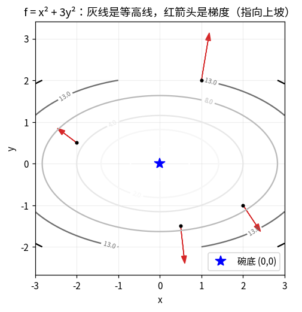
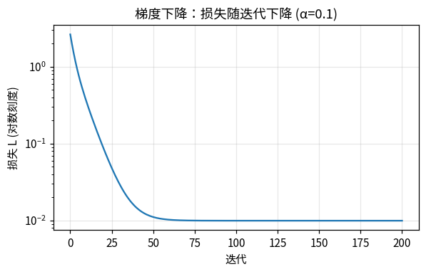

# 第 3 章 · 多变量与梯度

> **上一章我们有了什么**：向量和矩阵，知道了一层网络就是 $W\mathbf{x}+\mathbf{b}$，第一层有 31,744 个旋钮。
>
> **这一章要补什么**：第 1 章的导数回答的是"**一个**旋钮拧一点，输出动多少"。
> 可是训练要拧的是**全部**旋钮——actor 四层加起来 197,788 个（第 6 章数给你看）。
> 得同时告诉每一个旋钮往哪边拧。这个"每个旋钮的导数排成的清单"叫**梯度**，
> 顺着它反方向拧一点点、重复很多次，叫**梯度下降**。机器学习里 99% 的"训练"就是它。
>
> **本章新词**：偏导数、梯度、梯度下降、学习率。
> **需要的前提**：第 1 章的导数、第 2 章的向量。

---

## 3.1 两个旋钮的函数：一个碗

第 1 章的 $f(x) = x^2$ 只有一个输入。现在给两个：

$$f(x, y) = x^2 + 3y^2$$

喂两个数，吐一个数。图像不再是一条线，而是一个**碗**：x、y 是桌面上的位置，f 是碗面在那个位置的高度。
碗底在 (0, 0)，高度 0。碗沿 y 方向比沿 x 方向陡（因为 y 前面有个 3）。



上图是从正上方往下看这个碗：灰色的圈是**等高线**（同一圈上高度相同，像地图上的等高线），
越靠外越高。红色箭头下一节讲。

**训练里的损失函数就是这样一个碗**，只不过有 197,788 个输入而不是 2 个。画不出来，但"碗"的直觉完全够用：
我们要做的就是**从碗上某个位置出发，走到碗底**。

## 3.2 偏导数：一次只拧一个旋钮

站在碗上 (1, 2) 这个位置。问：只往 x 方向挪一点点，高度变多少？只往 y 方向挪呢？

**一次只动一个输入，其他输入当常数不动，然后用第 1 章的办法求导**——这叫**偏导数**（partial derivative）。

对 $f = x^2 + 3y^2$：
- 只动 x：$3y^2$ 里没有 x，当常数，导数 0；$x^2$ 的导数 2x。所以"对 x 的偏导" = $2x$。
- 只动 y：$x^2$ 当常数；$3y^2$ 的导数 6y。所以"对 y 的偏导" = $6y$。

在 (1, 2) 处：对 x 的偏导 = 2，对 y 的偏导 = 12。实验第 1 节用"缩 h"验证：

```
       数值  解析
-----  --  --
∂f/∂x   2   2
∂f/∂y  12  12
```

符号：$\frac{\partial f}{\partial x}$，读"f 对 x 的偏导"。那个弯弯的 ∂ 读"偏"，它和第 1 章的 d 是一回事，
只是特意提醒你"这是多个输入里、只动一个的导数"。

**解读**：在 (1, 2) 这个位置，往 x 方向挪 1 毫米，高度涨 2 毫米；往 y 方向挪 1 毫米，高度涨 12 毫米。
y 方向陡 6 倍。

## 3.3 梯度：把所有偏导数排成一张清单

两个偏导数排成一个 2 项清单——用第 2 章的话说，一个向量：$(2, 12)$。这就是**梯度**（gradient），记作 $\nabla f$。

| 符号 | 怎么读 | 就是 |
|---|---|---|
| $\nabla$ | "纳布拉"，或者直接读"梯度" | 倒三角 |
| $\nabla f$ | "f 的梯度" | 全部偏导数排成的向量。输入有几项，梯度就有几项：197,788 个旋钮 → 197,788 项的梯度 |

### 梯度指向"上坡最陡"的方向

梯度不只是"一堆导数放一起"。它有一个漂亮的性质：**梯度这个箭头，指向从当前位置出发上坡最陡的方向；箭头长度是那个方向的坡度。**

回头看 3.1 节的图：每个红箭头都是那一点的梯度，它们都**垂直穿过等高线、指向外（高处）**。
(1, 2) 处的箭头 (2, 12) 几乎竖直向上——因为 y 方向陡得多。

实验第 2 节从 (1, 2) 出发，朝 12 个方向各走 0.01，看哪个方向高度涨得最多：

```
方向角°       f 的涨幅
----  ----------
   0      0.0201
  30   0.0774705
  60    0.114173
  90      0.1203     ← 最多
 120    0.094173
 ...
 270     -0.1197     ← 最少（下坡最陡）
涨得最多的方向 ≈ 90°，梯度方向 = 80.5°
```

梯度 (2, 12) 指向 80.5°，12 个候选里最接近它的 90° 涨得最多；正对面的 270° 跌得最多。

<details>
<summary>为什么（一句话推导，可跳过）</summary>
往单位方向 $\mathbf{d}$ 走一小步 h，高度变化 ≈ $h\,(\nabla f\cdot\mathbf{d})$——梯度和方向的点积。
第 2 章进阶说过点积 = 长度 × 长度 × cos(夹角)，夹角为 0（同向）时最大。所以顺着梯度走涨得最快，逆着走跌得最快。
</details>

**所以想下坡，就朝梯度的反方向走。** 这就是下一节。

## 3.4 梯度下降：朝反方向走一小步，重复

想让损失变小 → 沿梯度反方向走一小步 → 到了新位置重新算梯度 → 再走一小步 → …… 直到走不动。

写成一行：

$$\theta \leftarrow \theta - \alpha\,\nabla L(\theta)$$

| 符号 | 怎么读 | 就是 |
|---|---|---|
| $\theta$ | "西塔" | 全部旋钮排成的清单（197,788 项） |
| $L(\theta)$ | | 损失：旋钮拧成这样时"有多差"。就是那个碗 |
| $\nabla L(\theta)$ | | 损失对每个旋钮的梯度，也是 197,788 项 |
| $\alpha$ | "阿尔法" | **学习率**（learning rate）：一步迈多远。梯度只给方向和坡度，α 定步长 |
| $\leftarrow$ | "更新为" | 编程里的 `=`：右边算完存回左边 |
| 减号 | | 梯度指上坡，我们要下坡 |

前端类比：反复微调 CSS 直到"看起来对"——只不过这里有一个仪器，精确告诉你每个属性该往哪边调、调多少。

### 走一遍完整的循环：找一条直线

不用 197,788 个旋钮，用 2 个就能把整个循环看清楚。

有 50 个数据点，它们大致落在直线 $y = 2x + 1$ 附近（加了点噪声）。**假装不知道 2 和 1**，让梯度下降自己找。

**两个旋钮**：$w$（斜率）和 $b$（截距）。猜测的直线是 $\hat y = wx + b$（$\hat y$ 读"y 帽"，表示"预测值"）。

**损失**："猜的和真的差多少"。对每个点算 (预测 − 真值)²，50 个点取平均。这叫**均方误差**（MSE）：

$$L(w, b) = \frac{1}{50}\sum_{i=1}^{50}\big(w x_i + b - y_i\big)^2$$

（还是 Σ = for 循环：对每个点算差的平方，累加，除以 50。）

**梯度**：L 对 w、对 b 的偏导。用第 1 章的链式法则（外层是平方、内层是 $wx_i + b - y_i$）：

$$\frac{\partial L}{\partial w} = \frac{1}{50}\sum_i 2\,e_i\,x_i \qquad \frac{\partial L}{\partial b} = \frac{1}{50}\sum_i 2\,e_i$$

其中 $e_i = wx_i + b - y_i$ 是第 i 个点的误差。（外层 $(e^2)' = 2e$；内层对 w 的导数是 $x_i$，对 b 的导数是 1；相乘。）

**循环**：从 w = 0、b = 0 出发，α = 0.1：

```python
dw = np.mean(2 * err * X)     # ∂L/∂w
db = np.mean(2 * err)         # ∂L/∂b
w -= alpha * dw               # θ ← θ − α ∇L
b -= alpha * db
```

实验第 3 节的输出：

```
 迭代         w         b        损失 L
---  --------  --------  ----------
  0         0         0     2.63843
  1  0.149613  0.222132     1.98174
  2  0.286588  0.398232     1.52404
  5  0.634356  0.734723     0.78503
 10   1.05726  0.956635    0.338378
 20    1.5492   1.02745   0.0872323
 50   1.96799   1.00662   0.0110862
100   2.02442   1.00206  0.00993478
200   2.02617   1.00192  0.00993373
```



200 步后 w = 2.03、b = 1.00——找到了。损失从 2.64 降到 0.0099，剩下的是数据本身的噪声，压不掉。

**这九行表就是全书的缩影。** 后面所有的"训练"——197,788 个旋钮也好、PPO 也好——都是这同一个循环。
变的只有三样：模型长什么样、损失怎么定、梯度怎么算（第 7 章让 torch 自动算）。

> **停一下，自测**：第 1 步 w 从 0 变成 0.1496。这说明第 0 步时 $\partial L/\partial w$ 是正还是负？
> <details><summary>答案</summary>负。w 增大了，说明 −α·(∂L/∂w) > 0，即偏导为负——"w 往大拧，损失会降"。</details>

## 3.5 学习率：太小走不到，太大飞出去

α 是唯一要人来定的数。实验第 4 节固定走 50 步，换不同的 α：

```
学习率 α     50 步后的损失
-----  -----------
 0.01     0.833106    ← 太慢，还在半山腰
  0.1    0.0110862    ← 刚好
  0.5   0.00993373    ← 刚好
    1      3.23937    ← 开始来回跳
  1.6  4.45694e+34    ← 飞出去了
```

α = 1.6 时每一步都跨过碗底跳到对面更高的地方，越跳越高，损失涨到 $10^{34}$。这叫**发散**。

碗越陡，能容忍的 α 越小。真实的损失地形在不同旋钮方向上陡峭程度差几个数量级，一个固定的 α 很难处处合适。
两个补救办法后面会讲：第 7 章的 Adam 优化器（每个旋钮自己调步长），和 PPO 的"自适应学习率"（见 📍）。

<details>
<summary>局部极小与鞍点（可跳过）</summary>
碗只有一个底。真实地形有很多凹坑（局部极小）和"马鞍"（一个方向是底、另一个方向是顶）。
梯度下降只保证走到"某个平的地方"，不保证是全局最低。实践中神经网络的地形足够好，加上第 7 章的随机性，通常能走到够低的地方。
</details>

## 3.6 梯度裁剪：一步最多迈这么远

有时某一步的梯度特别大（碰上一个离群数据、或刚好走到陡崖边），一步就把旋钮甩飞。
**梯度裁剪**（gradient clipping）：如果梯度这根箭头比上限 c 长，就把它按比例缩到 c，**方向不变**。

实验第 5 节：梯度 (3, 4) 长度 5，上限 1 → 缩成 (0.6, 0.8)，长度 1，方向一样。
不超过上限的梯度原样通过。

---

## 📍 映射到项目

> 只需看一眼。

项目训练用的 PPO 算法（第 13 章）本质上也在做 3.4 节的循环。它的三个数在
`src/mjlab_microduck/tasks/microduck_velocity_env_cfg.py` 里：

```python
learning_rate=1.0e-3,     # 学习率 α 的初始值 0.001
schedule="adaptive",      # 不固定：每次更新后自动放大或缩小（下面解释）
max_grad_norm=1.0,        # 梯度裁剪上限 1.0（3.6 节）
```

**"自适应"是什么意思**：rsl_rl 每更新一次就量一下"策略变了多少"（用一把叫 KL 的尺子，第 13 章讲）。
变得太多 → 学习率除以 1.5（正在"飞出去"，收着点）；变得太少 → 乘以 1.5（太慢，放开点）。
就是 3.5 节那张表的自动版。代码在 `rsl_rl/algorithms/ppo.py`：

```python
if kl_mean > self.desired_kl * 2.0:                           # 变太多
    self.learning_rate = max(1e-5, self.learning_rate / 1.5)  # 缩，最低 0.00001
elif kl_mean < self.desired_kl / 2.0 and kl_mean > 0.0:      # 变太少
    self.learning_rate = min(1e-2, self.learning_rate * 1.5)  # 放，最高 0.01
```

**梯度下降的那一行在哪**：同一个文件里，每次更新最后四行——

```python
self.optimizer.zero_grad()                                    # 清掉上次的梯度
loss.backward()                                               # 算梯度 ∇L（链式法则，第 7 章）
nn.utils.clip_grad_norm_(self.actor.parameters(), 1.0)        # 3.6 节：太长就缩到 1.0
self.optimizer.step()                                         # θ ← θ − α∇L（Adam 版，第 7 章）
```

## 🧪 动手实验

```bash
uv run python docs/learn-zh/labs/ch03_gradient_descent.py
```

1. 数值偏导 vs 手算偏导。
2. 12 个方向走一步，验证梯度方向涨得最快。
3. 梯度下降找直线：w、b、损失随迭代的表，画损失曲线。
4. 五个学习率，看到发散。
5. 梯度裁剪。
6. 画碗的等高线和梯度箭头。

**改一改**：把第 3 节的 α 改成 0.05，看要多少步才到 w ≈ 2。
再把 X 的范围从 (−1, 1) 改成 (−10, 10)——碗在 w 方向变陡 100 倍，α = 0.1 还稳吗？
（这是第 8 章"为什么要把输入归一化"的伏笔。）

## 本章小结

- **多个输入的函数**是一个碗（高维的碗画不出来，直觉一样）。
- **偏导数**：一次只拧一个旋钮，其他当常数。
- **梯度** $\nabla f$：全部偏导数排成的清单，指向上坡最陡处，长度是坡度。
- **梯度下降** $\theta \leftarrow \theta - \alpha\nabla L$：反方向走一小步、重复。九行表就是一切训练的模样。
- **学习率** α：太小慢、太大飞。PPO 自动调它。
- **梯度裁剪**：箭头太长就缩到上限，方向不变。

**下一章**：这一章的损失是"50 个点取平均"。可是训练数据是随机来的、策略吐的动作也是故意带随机的。
"平均"要升级成**期望**，"随机的动作"要用**概率分布**来写——[第 4 章 · 概率与期望](04-概率与期望.md)，数学地基的最后一章。
