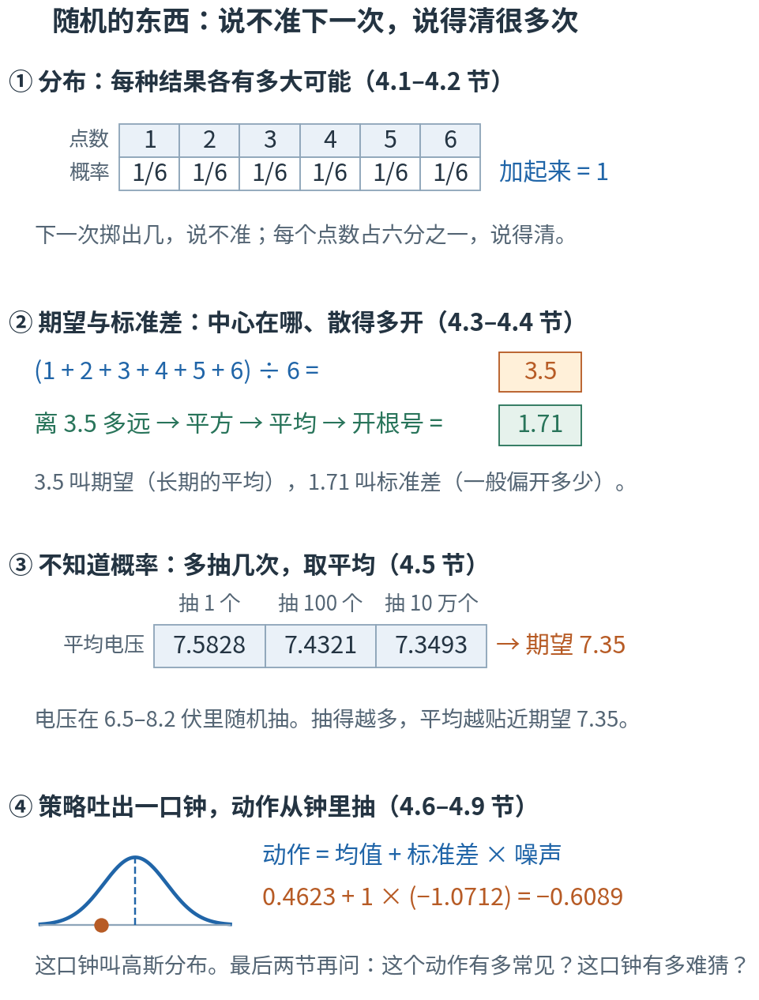
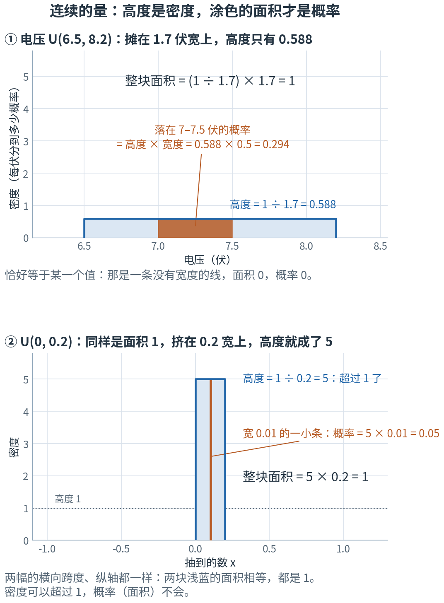
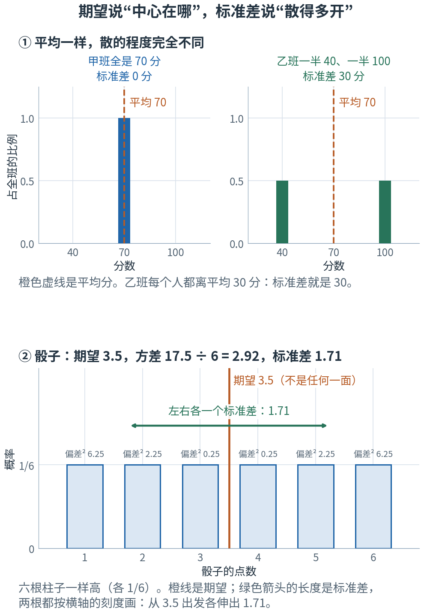
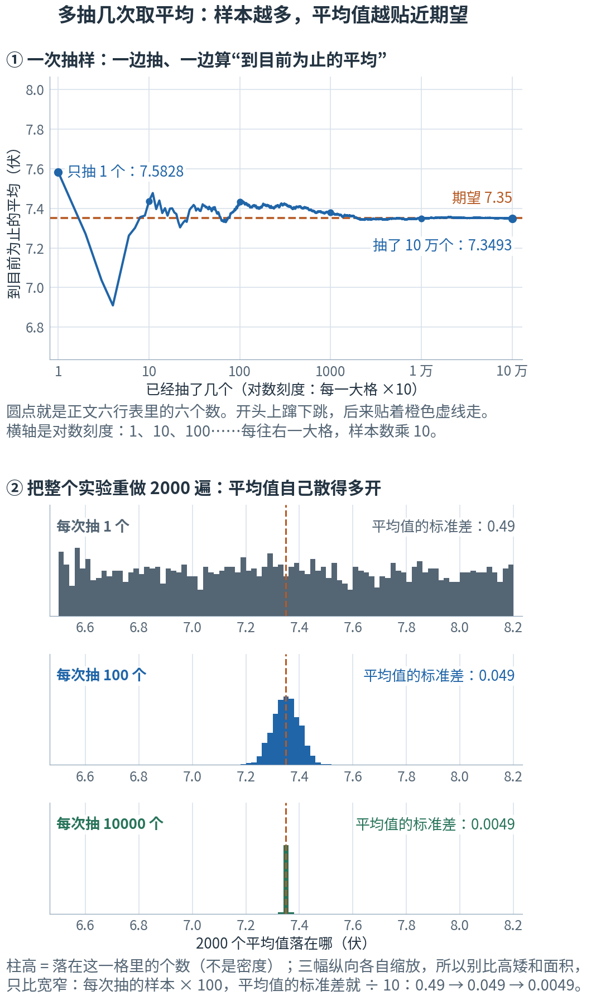
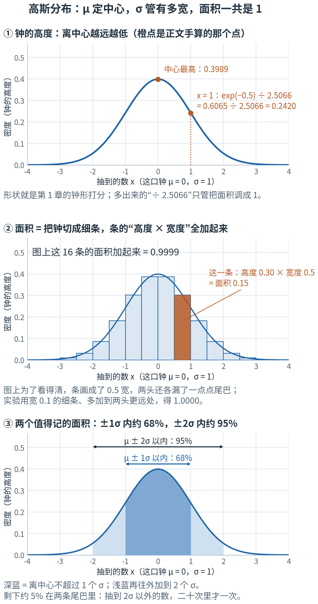
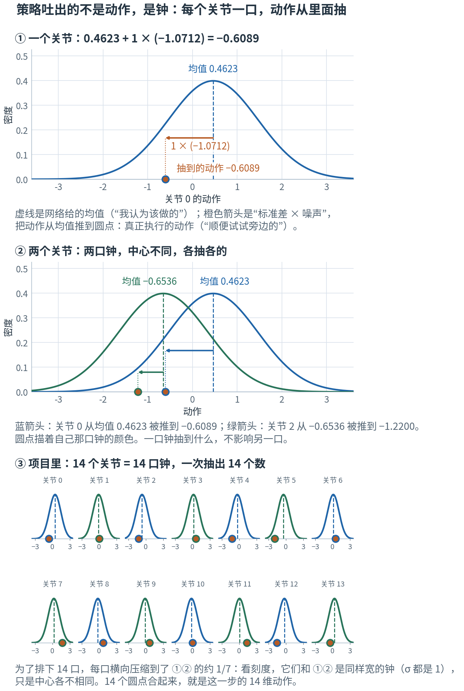
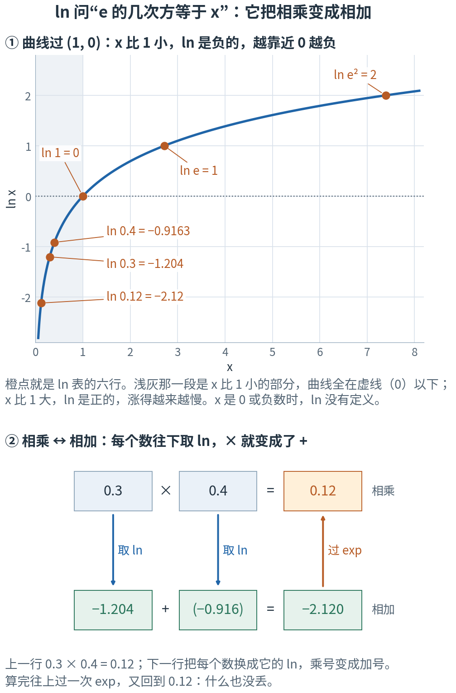
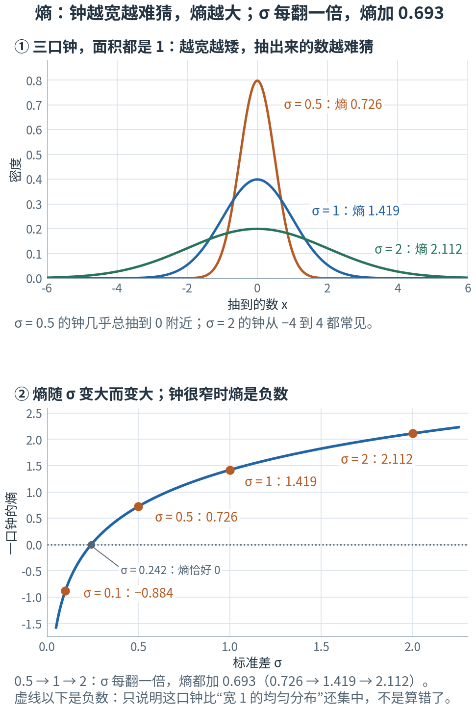

# 第 4 章 · 概率与期望：说不准下一次，说得清很多次

> **上一章我们有了什么**：梯度下降的完整循环。那里的损失是"50 个点取平均"，数据是现成的、摆在那里不动。
>
> **这一章要补什么**：训练机器人时，到处是随机。每次重新开始，机器人出生的姿势是随机的；每只仿真机器人抽到的电池电压是随机的；传感器读数带着随机的抖动，
> 连策略网络吐出的动作都**故意**加了随机——不然它永远不会去试新动作。
> 随机的东西"下一次是几"说不准，那还怎么算、怎么比？这一章给出一套说法：把"各种结果各有多大可能"写清楚，
> "平均"就升级成了**期望**；"策略网络吐 14 个动作"也要改口——它吐出的是 14 口"钟"，动作从钟里抽。
>
> **本章新词**：随机变量、概率分布、均匀分布、概率密度、期望、方差、标准差、大数定律、高斯分布（正态分布）、条件概率、自然对数、log 概率、熵。
> **需要的前提**：第 1 章的 exp 和钟形打分；第 2 章的 Σ（2.2 节）、开平方根（2.3 节）和 `sum(dim=...)`（2.7 节）；第 3 章的"取平均"。
> **不要求**学过概率，也不要求会积分——本章用"切成细条再相加"代替它。标"进阶"的折叠块可以第二遍再读。

---

## 4.0 先看地图：随机的东西，用“很多次”来描述

**随机的东西，下一次是几说不准；但"各种结果各有多大可能"说得清——这份说明叫分布。有了分布，就能算出长期的平均（期望）和散开的程度（标准差）；
不知道分布时，多抽几次取平均，也能把期望估出来。策略网络吐出的就是一种分布：一口钟，动作从钟里抽。**

先想你每天上班的路。今天花了 32 分钟，昨天 41 分钟，明天是几？说不准。
可你心里其实很有数："**一般 35 分钟，上下差个 5 分钟，偶尔堵到 50**。"

这一句话里，已经有了本章的大半主角（后面那张表的"通勤里"一列，会把它们一个个指出来）。下面这张图用本章真正要算的例子，把主线走了一遍：



**读图顺序：** 从 ① 到 ④ 竖着读。图里的数字现在不用算，4.1–4.7 节会一个一个手算出来；
现在只要看清次序：先把"各有多大可能"写成表，再从表里算出两个数（中心、散开程度），不知道表时靠多抽来估，最后轮到那口钟。

| 概念 | 它在回答什么问题 | 本章的例子 | 通勤里 | 在哪一节 |
|---|---|---|---|---|
| 随机变量、概率分布 | 哪个量说不准？各种结果各有多大可能？ | 骰子每面 1/6 | 明天花几分钟说不准；各种时长各有多大可能，就是你心里那张模糊的图 | 4.1 |
| 均匀分布、概率密度 | 结果是连续的数（电压、时间）时，"可能性"怎么写？ | 电压在 6.5–8.2 伏之间随便抽 | "恰好 35 分 0 秒到"几乎不可能，只能问"30 到 40 分钟之间到"有多大可能 | 4.2 |
| 期望 | 抽很多很多次，平均是多少？ | 骰子 3.5，电压 7.35 伏 | "一般 35 分钟" | 4.3 |
| 方差、标准差 | 结果一般离平均多远？ | 骰子 1.71 | "上下差个 5 分钟" | 4.4 |
| 大数定律 | 不知道概率，怎么把期望估出来？估得有多准？ | 抽 10 万个电压取平均 | 没人告诉你概率，35 是你走了很多次、自己平均出来的 | 4.5 |
| 高斯分布（正态分布） | 那口"中间高、两边低"的钟，高度怎么算？ | 中心 0、标准差 1 的钟 | 把心里那张图画出来：中间高、两边低，像一口钟 | 4.6 |
| 条件概率 | "看到了这个观测"之后，动作的分布是什么样？ | 14 个关节各一口钟 | 下雨天和晴天，时长的分布不一样 | 4.7 |
| 自然对数、log 概率 | 刚才抽到的这个动作，在这口钟下有多常见？ | 14 个数合成一个：−19.05 | 今天花了 50 分钟，这有多罕见？ | 4.8 |
| 熵 | 这口钟整体上有多"难猜"？ | 钟越宽，熵越大 | 一个天天准点的人和一个很随缘的人，谁更难猜？ | 4.9 |

表里的名字先不背，英文和符号到了各节再给。本章最容易混的四处，先贴上标签：

- **概率 和 密度**：骰子"掷出 3"有概率（1/6）。电压是连续的数，"恰好等于 7 伏"的概率是 0，只能问"落在某一段里"的概率。
  这时图上那条线的**高度叫密度，不是概率**，它可以超过 1；**一段下面的面积才是概率**，它不会超过 1（4.2 节）。
- **两个 σ**：第 1 章钟形打分里的 σ 是**人定的宽容度**——同样的偏差扣多少分；本章的 σ 是**分布的标准差**——抽出来的数一般离中心多远。
  字母相同、都管"钟有多宽"，但不是同一个量，公式里还差一个 2（4.4、4.6 节）。第 8 章（输入归一化）还会再遇到一个 σ，到时候再分。
- **两个 π**：4.6 节钟的高度公式里的 π 是圆周率 3.14159…；4.7 节的 $\pi(a\mid s)$ 是"策略"的记号。同一个希腊字母，毫无关系。
- **期望 和 样本均值**：期望是**分布自己**的一个数，算出来是几就是几（骰子永远是 3.5）；样本均值是**你这次抽到的那些数**的平均，
  每次重抽都会变一点。4.5 节讲的就是后者怎样靠近前者。

现在觉得这些区别有点抽象很正常，读到对应小节就清楚了。

第一次读，只要按顺序看正文、图片和手算。标着"进阶"的折叠内容可以先跳过；代码是复核工具，不是阅读门槛。

## 4.1 分布：说不准下一次，说得清很多次

掷一颗骰子。下一次掷出几？不知道。
但有一件事你很确定：**六个点数机会均等，每个占六分之一。**

实验第 1 节真的掷了 6000 次。（计算机的"随机数"其实由一个起始数算出来，这个起始数叫种子；实验把种子固定了，所以你每次运行，掷出的都是同一串。）前 12 次是 `3 4 5 6 1 1 5 6 2 2 6 3`——看不出任何规律。
可是把 6000 次数一数：

```
点数  出现次数   占比
----  --------  -----
   1      1031  0.172
   2       975  0.163
   3      1013  0.169
   4       965  0.161
   5      1017  0.170
   6       999  0.167
```

每个点数都在 1000 次上下，占比都在 1/6 ≈ 0.167 附近。**单独一次说不准，很多次合起来却很有规律**——这一章所有的工具，都建立在这件事上。

现在起名字。像"骰子掷出的点数"这样，**结果说不准、但每种结果有多大可能是确定的**量，叫**随机变量**（random variable），习惯用大写字母 $X$ 表示。
"每种结果各有多大可能"的那张完整说明，叫它的**概率分布**（probability distribution），简称**分布**。骰子的分布就是一张表：

| 点数 x | 1 | 2 | 3 | 4 | 5 | 6 |
|---|---|---|---|---|---|---|
| 概率 p(x) | 1/6 | 1/6 | 1/6 | 1/6 | 1/6 | 1/6 |

| 符号 | 怎么读 | 就是 |
|---|---|---|
| $X$ | "大 X" | 随机变量本身：那个还没掷出来、说不准的量 |
| $x$ | "小 x" | 它可能取到的某一个具体结果，比如 3 |
| $p(x)$ | "p of x" | 结果 x 的概率，一个 0 到 1 之间的数。$p(3) = 1/6$ |

概率有一条铁律：**所有结果的概率加起来必须是 1**（总得掷出一个）。$6 × 1/6 = 1$ ✓。

掷一次骰子，就是从这个分布里**抽样**一次（也说"采样"，代码里叫 sample）；抽到的那个数叫一个**样本**。
你其实天天在抽样：

```js
const roll = Math.floor(Math.random() * 6) + 1;   // 从骰子的分布里抽一个样本：1 到 6，各 1/6
```

### 概率不必相等

再看一只抽奖转盘（教学构造，不是真的商场活动）：转到"谢谢参与"得 0 元，概率 0.5；得 5 元，概率 0.3；得 20 元，概率 0.2。

| 奖金 x（元） | 0 | 5 | 20 |
|---|---|---|---|
| 概率 p(x) | 0.5 | 0.3 | 0.2 |

三个概率不相等，但加起来仍是 $0.5 + 0.3 + 0.2 = 1$。**一张"结果 → 概率"的表，每个概率不小于 0、加起来是 1——这就是一个分布。**
骰子和转盘后面都还要用。

## 4.2 连续的量：高度不是概率，面积才是

骰子只有 6 种结果，能列成表。可项目里大多数随机量是**连续的数**。
比如：每只仿真机器人开机时要"抽一块电池"，电压在 **6.5 伏到 8.2 伏之间随便取一个值，哪儿都一样可能**
（项目里这个范围写作 `vin_range=(6.5, 8.2)`。每只机器人开机时抽一次，之后一直用这个电压；
这样训练出来的策略，电池满电和快没电时都得能走——第 17 章讲的"域随机化"就是这个思路）。

这种"一段区间里处处机会均等"的分布，叫**均匀分布**（uniform distribution），记作：

$$X \sim U(6.5,\ 8.2)$$

| 符号 | 怎么读 | 就是 |
|---|---|---|
| $\sim$ | "服从" | 左边这个随机变量，按右边这个分布来抽 |
| $U(a, b)$ | "U a b" | a 到 b 之间的均匀分布。U 取自 uniform（均匀） |

你最熟的均匀分布是 `Math.random()`：它就是 $U(0, 1)$。要抽电压，平移、拉伸一下就行：

```js
const volt = 6.5 + (8.2 - 6.5) * Math.random();   // X ~ U(6.5, 8.2)
```

torch 里对应的两个函数是 `torch.rand`（抽 $U(0,1)$）和 `uniform_(6.5, 8.2)`（直接抽 $U(6.5, 8.2)$），📍 里会见到。

### “恰好等于 7 伏”的概率是 0

连续的量有个小别扭。6.5 到 8.2 之间有无穷多个数，抽到"恰好 7.000000… 伏"的可能性是多少？**是 0。**
实验第 2 节抽了 10 万个电压，恰好等于 7 的一个也没有。

所以对连续的量，要换一种问法：**落在某一段里的概率是多少？** 这个能算，而且只用除法。
整个区间宽 $8.2 - 6.5 = 1.7$ 伏，处处机会均等，那么落在 7.0 到 7.5 这半伏里的概率，就是这一段占总宽度的比例：

$$\frac{0.5}{1.7} = 0.294 \quad(\text{约 } 29\%)$$

实验抽的 10 万个电压里，落在这一段的占 0.293——对上了。

### 把它画出来：一块面积为 1 的长方形

把这件事画成图。横轴是电压；全部的"可能性"一共是 1，均匀地摊在 1.7 伏宽的区间上——画成一块**面积为 1** 的长方形。
宽 1.7，面积 1，所以高度是

$$\frac{1}{1.7} = 0.588$$

刚才那个 29% 现在有了第二种算法：7.0 到 7.5 那一段上方的小长方形，**高度 × 宽度** $= 0.588 × 0.5 = 0.294$。同一个数。

这块长方形的**高度**，叫**概率密度**（probability density），简称**密度**：它说的是"**每 1 伏宽度分到多少概率**"。
密度之于概率，就像时速之于路程：时速 120 不等于开了 120 公里，得乘上开了多久；密度 0.588 也不等于概率 0.588，得乘上宽度。
（时速是第 1 章的变化率——"每小时多少公里"；密度也是一种"每多少"——"每伏多少概率"。）
密度本身不是概率；**密度 × 宽度 = 面积，面积才是概率。** "恰好等于 7 伏"对应一条没有宽度的线，面积是 0，所以概率是 0。

现在把区间缩窄，看看会发生什么。换成 $U(0, 0.2)$：同样是面积 1，却只有 0.2 宽，高度只能是

$$\frac{1}{0.2} = 5$$

**密度是 5，比 1 大。** 这不违反"概率不超过 1"：宽度 0.01 的一小段，概率是 $5 × 0.01 = 0.05$；整段的概率是 $5 × 0.2 = 1$。
概率（面积）没有超标，超过 1 的只是高度。

密度还**带着单位**，这是它和概率的另一个区别。回到电压：0.588 的完整说法是"每伏 0.588"。
同一个分布改用毫伏来记，区间宽 1700 毫伏，密度就成了 $1/1700 ≈ 0.000588$（每毫伏）——数值差了一千倍；
而"落在 7.0–7.5 伏"的概率是 $0.000588 × 500 = 0.294$，一点没变。**换个单位，密度的数值跟着变，概率不变。**



**这样读图：** ① 先看浅蓝的长方形：宽 1.7、高 0.588，面积是 1。橙色那一段是 7.0–7.5 伏，它的面积 0.294 就是"电压落在这一段"的概率。
② 两幅图的横向跨度和纵轴刻度特意画成一样的，所以两块浅蓝的面积用眼睛就能比：一样大，都是 1。
只是下面这块被挤进 0.2 的宽度里，高度就蹿到了 5，越过了灰色虚线（高度 1）。橙色细条宽 0.01，面积 0.05。

> ⚠️ **$p(x)$ 从这里起换了含义。** 4.1 节里 $p(x)$ 是**概率**：一个不超过 1 的数，全部加起来是 1。
> 对连续的量，同一个写法 $p(x)$ 指的是**密度**：图上的高度，**可以超过 1**，"全部加起来是 1"的是面积。
> 以后看到一个"概率"大于 1，先别怀疑算错了——先问它是不是密度。4.6、4.8 节还会各碰到一次。

| 符号 | 怎么读 | 就是 |
|---|---|---|
| $p(x)$（离散） | | 结果 x 的概率。骰子：$p(3) = 1/6$ |
| $p(x)$（连续） | | x 处的密度（高度）。$U(a, b)$ 在区间里处处是 $\dfrac{1}{b-a}$，区间外是 0 |

### 概率为 0 的事，要专门安排

"恰好抽到某个值的概率是 0"在项目里有一个实实在在的后果。
训练时，给机器人的指令也是从均匀分布里抽的。比如项目里"摔倒后自己站起来"那个任务（下面简称"站起"任务），要抽一条 6 项的身体姿态指令（身体再高一点、往前倾一点……），
每一项都在一个小范围里均匀地抽，像 −0.05 到 0.05。抽到"**6 项恰好全是 0**"的概率是多少？是 0。
可"指令全零 = 保持标准站姿、什么也不用做"偏偏是真机上最常见的状态——只靠均匀分布抽，策略一次也练不到它。
项目吃过这个亏：早先一版策略只有在给了指令时才站得住，指令一空，反而不会好好站着了。
所以代码里专门加了一个开关：**先照常抽，再以一个指定的概率（"站起"任务里设的是 0.3），把整条指令强行设成 0**（📍 里有这段代码）。
这相当于在连续的分布上，给"0"这个点单独补了一份概率。走路任务的速度指令也用同样的办法，专门留出一部分机器人领"原地站着"的指令。

> **停一下，自测**：$X \sim U(2, 6)$。密度是多少？落在 3 到 4 之间的概率是多少？落在"恰好 3"上的概率呢？
> <details><summary>答案</summary>
>
> 宽度 4，密度 $1/4 = 0.25$。3 到 4 这一段宽 1，概率 $0.25 × 1 = 0.25$。恰好 3：没有宽度，面积 0，概率 0。
>
> </details>

## 4.3 期望：按概率加权的平均

骰子掷很多很多次，平均点数是多少？
六个点数各占 1/6，所以平均就是

$$\frac{1+2+3+4+5+6}{6} = 3.5$$

换一种写法，同一个数：**每个结果 × 它的概率，再全部加起来。**

$$1×\tfrac16 + 2×\tfrac16 + 3×\tfrac16 + 4×\tfrac16 + 5×\tfrac16 + 6×\tfrac16 = 3.5$$

第二种写法的好处，是概率不相等时照样能用。4.1 节那只转盘，平均一次能得多少钱？

$$0 × 0.5 + 5 × 0.3 + 20 × 0.2 = 0 + 1.5 + 4 = 5.5 \text{ 元}$$

如果图省事把三个奖金直接平均，$(0 + 5 + 20)/3 = 8.33$ 元——错了，因为 20 元只有两成机会，不该和"谢谢参与"平起平坐。
每个结果要按自己的概率"占份额"，这叫**加权平均**（概率就是权重）。

这个"**按概率加权的平均**"叫**期望**（expectation），记作 $\mathbb{E}[X]$：

$$\mathbb{E}[X] = \sum_x x\,p(x)$$

| 符号 | 怎么读 | 就是 |
|---|---|---|
| $\mathbb{E}[X]$ | "X 的期望" | 空心的 E 取自 expectation。结果是**一个确定的数**，不再随机 |
| $\sum_x$ | "对所有可能的结果 x 求和" | 第 2 章 2.2 节的 Σ，一个 for 循环：把每个可能的 x 过一遍 |
| $x\,p(x)$ | | 结果 × 它的概率 |

用你的母语写，就是一次 `reduce`：

```js
const prizes = [0, 5, 20], probs = [0.5, 0.3, 0.2];
const expectation = prizes.reduce((s, x, i) => s + x * probs[i], 0);   // Σ x·p(x) → 5.5
```

两点提醒。第一，**3.5 根本不是骰子能掷出的数**，5.5 元也不是转盘上的任何一格。期望是"长期的平均"，不是"会出现的结果"。
第二，期望也**不是"最可能出现的结果"**：转盘最可能转到的是 0 元，期望却是 5.5 元。

### 连续的量：切成细条，照样加

电压是连续的，没法一个个列出来。办法是**把区间切成细条**：6.5 到 8.2 切成 17 条，每条宽 0.1。
每条的概率 = 密度 × 宽度 $= 0.588 × 0.1 = 0.0588$（0.0588 是四舍五入过的，精确值是 1/17；所以 $17 × 0.0588 = 0.9996$，差的那一点来自舍入）。
拿每条的中点（6.55、6.65、……、8.15）当这一条的"结果"，照上面的式子加权相加。
这一步可以心算：17 条的概率相等，加权平均就是 17 个中点的普通平均；从两头往里配对，6.55 配 8.15、6.65 配 8.05……每对的平均都是 7.35，正中间那条的中点也是 7.35。
所以结果是 **7.35**（实验第 3 节算的也是它）——恰好是区间的正中间。

这不是巧合：均匀分布左右对称，平均一定落在中点。所以 **$U(a, b)$ 的期望就是 $(a+b)/2$**，电压的期望是 $(6.5 + 8.2)/2 = 7.35$ 伏。
"切成细条、逐条相加"这一招，本章后面还要用两次；它就是数学里"积分"的朴素版本，本书不需要积分的记号。

### 一条后面反复用的性质

把骰子的点数翻倍再加 3，得到一个新的随机变量 $2X + 3$，它的期望是多少？
逐面算：六个面变成 5、7、9、11、13、15，平均 $(5+7+9+11+13+15)/6 = 10$。
偷懒的算法：$2 × 3.5 + 3 = 10$。一样。

再掷两颗骰子，点数之和的期望是多少？实验把 36 种组合全列出来取平均，得 7——正是 $3.5 + 3.5$。

这两件事合起来，叫期望的**线性**。把 2 和 3 换成任何两个固定的数 c、d 都成立：

$$\mathbb{E}[cX + d] = c\,\mathbb{E}[X] + d, \qquad \mathbb{E}[X + Y] = \mathbb{E}[X] + \mathbb{E}[Y]$$

大白话：**先变换再求平均 = 先求平均再变换**——只要变换是"乘一个数、加一个数、几个量相加"。
别顺手推广到别的运算：平方就不行。$\mathbb{E}[X^2] = (1+4+9+16+25+36)/6 = 15.17$，而 $(\mathbb{E}[X])^2 = 3.5^2 = 12.25$，不相等
（差出来的那 2.92 下一节就会再见到）。

**为什么重要**：第 11 章（策略梯度）要证明"给每个奖励都减去同一个基准，不影响学习的方向"，靠的就是这条线性。

### 期望符号的完整写法

后面的章节里，期望常带一个下标：

$$\mathbb{E}_{x \sim p}\big[f(x)\big] = \sum_x f(x)\,p(x)$$

| 符号 | 怎么读 | 就是 |
|---|---|---|
| $x \sim p$ | "x 服从 p" | 写明 x 是按哪个分布抽的。分布不止一个时（比如新旧两个策略），靠它区分 |
| $f(x)$ | | 我们真正关心的量：不一定是 x 本身，可以是 x 的某个函数（比如"这个动作得几分"） |

读法："**x 按分布 p 来抽，f(x) 的平均是多少**"。上面的 $\mathbb{E}[X^2] = 15.17$ 就是 $f(x) = x^2$ 的例子。

> **停一下，自测**：一种抽奖，0.9 的概率得 0 元，0.1 的概率得 100 元。期望是多少？最可能的结果是多少？
> <details><summary>答案</summary>
>
> 期望 $0 × 0.9 + 100 × 0.1 = 10$ 元；最可能的结果是 0 元。抽一次多半什么也没有，但抽很多很多次，平均每次 10 元。
>
> </details>

## 4.4 方差与标准差：散得多开

两个班的平均分都是 70。甲班人人都考 70；乙班一半人 40、一半人 100。
平均一样，可这两个班完全不是一回事。期望只说了"中心在哪"，还缺一个数来说"**散得多开**"。

### 为什么要平方

最自然的想法：看每个结果**离平均多远**（结果 − 平均，下面叫它偏差。第 1 章的偏差是"指令 − 实际"，这里的参照物换成了平均；谁减谁不要紧，马上就要平方），
再把偏差平均一下。试一个最小的例子——等概率出现的 1 和 3：

- 平均是 2；偏差是 $1 - 2 = -1$ 和 $3 - 2 = +1$。
- 把偏差直接平均：$(-1 + 1)/2 = 0$。**正负抵消了**，好像一点都不分散。
- 先平方再平均：$\big((-1)^2 + 1^2\big)/2 = 1$。再开平方根：$\sqrt 1 = 1$——"一般离平均 1"，合情合理。

平方让正负偏差不再互相抵消，这一招第 1 章的钟形打分、第 3 章的均方误差都用过。乙班照这个办法算：
偏差是 −30 和 +30，平方都是 900，平均 900，开根号得 **30 分**。甲班偏差全是 0，结果是 0。

### 名字与公式

**每个结果离期望多远 → 平方 → 按概率加权平均**，得到的数叫**方差**（variance）；方差再开平方根，叫**标准差**（standard deviation），记作 σ。

$$\mathrm{Var}[X] = \sum_x (x - \mu)^2\,p(x), \qquad \sigma = \sqrt{\mathrm{Var}[X]}$$

| 符号 | 怎么读 | 就是 |
|---|---|---|
| $\mu$ | "缪" | 期望 $\mathbb{E}[X]$ 的简写。后面说"均值"，指的也是它 |
| $(x - \mu)^2$ | | 结果离期望多远，再平方 |
| $\mathrm{Var}[X]$ | "X 的方差" | 偏差平方的期望。单位是 X 的单位的平方（分²、伏²），不直观 |
| $\sigma$ | "西格玛" | 标准差 = 方差开平方根（第 2 章 2.3 节的 $\sqrt{\ }$）。**单位和 X 相同**（分、伏），所以平时多用它。方差也常直接写成 $\sigma^2$。它和求和号 Σ 是同一个希腊字母的小写和大写，读音都是西格玛，意思无关 |

对照公式看，它其实就是上一节的期望，只是 $f(x) = (x-\mu)^2$：**方差 = "离期望多远的平方"的期望。**

### 手算：骰子的方差

骰子的期望是 3.5。逐面列出偏差和偏差的平方：

```
点数 x  偏差 x − 3.5  偏差²
------  ------------  -----
     1          -2.5   6.25
     2          -1.5   2.25
     3          -0.5   0.25
     4           0.5   0.25
     5           1.5   2.25
     6           2.5   6.25
```

六个面概率相等，加权平均就是普通平均：

$$\mathrm{Var}[X] = \frac{6.25 + 2.25 + 0.25 + 0.25 + 2.25 + 6.25}{6} = \frac{17.5}{6} = 2.92, \qquad \sigma = \sqrt{2.92} = 1.71$$

"掷一次骰子，一般离 3.5 差 1.71 左右"。（上一节留下的那个 2.92 在这里：$\mathbb{E}[X^2] - \mu^2 = 15.17 - 12.25 = 2.92$，是方差的另一种算法。）



**这样读图：** ① 两个班的橙色虚线在同一个位置（平均 70），柱子却一个全挤在线上、一个远远站在两边。
② 骰子的六根柱子一样高。橙线是期望 3.5，落在 3 和 4 之间的空当里——它不是任何一面。
绿色箭头按横轴的刻度画，从 3.5 向两边各伸出 1.71：大致盖住 2 到 5。柱子上方的灰色小字就是上面那张表的最后一列。

连续的量也一样，仍然是"切成细条"，而且直接用 4.3 节那 17 条。17 个中点离 7.35 的偏差是 0、±0.1、±0.2、……、±0.8（正中间那条是 0，两边对称）。
一侧的偏差平方加起来是 $0.01 + 0.04 + 0.09 + 0.16 + 0.25 + 0.36 + 0.49 + 0.64 = 2.04$，两侧共 $2 × 2.04 = 4.08$。
17 条的概率相等，加权平均就是普通平均：方差 $4.08 ÷ 17 = 0.24$，标准差 $\sqrt{0.24} = 0.49$，也就是 **0.49 伏**。
切得更细（每条宽 0.001，共 1700 条），实验第 4 节得到方差 0.2408、开根号 0.4907；均匀分布的方差还有现成的公式 宽度² ÷ 12，$1.7^2 ÷ 12$ 也是 0.2408。
17 条给 0.24，1700 条给 0.2408：**切得越细，越接近精确值。** 实验还直接量了第 2 节那 10 万个样本，标准差也是 0.49。这个 0.49 下一节马上要用。

代码里算方差还有一个小坑：同样的两个数 1 和 3，`np.var` 给 1，`torch.var` 却给 2。原因在折叠块里；本书凡是手算，用的都是上面的公式（除以个数 n）。

<details>
<summary>进阶：除以 n 还是 n − 1（现在可跳过）</summary>

上面的公式是对**分布本身**算的，概率都已知，叫总体方差：等概率的 n 个结果，就是偏差平方的和除以 n。$[1, 3]$ 的总体方差是 $(1 + 1)/2 = 1$。

如果手里只有 n 个样本、连期望都得用样本均值来代替，统计上习惯改成除以 $n - 1$，来补偿"样本均值总比真的期望更贴近这批样本"带来的偏小。
numpy 的 `np.var` / `np.std` 默认除以 n；torch 的 `torch.var` / `torch.std` 默认除以 n − 1，要写 `correction=0` 才除以 n。
实验核对过：$[1, 3]$ 两种算法给 1 和 2；而 1 万个电压样本，两种算法的标准差相差不到 0.0001——样本一多，这个区别就无关紧要了。

</details>

> **停一下，自测**：等概率出现的三个数 2、4、9。期望、方差、标准差各是多少？
> <details><summary>答案</summary>
>
> 期望 $(2+4+9)/3 = 5$。偏差 −3、−1、+4，平方 9、1、16，方差 $26/3 ≈ 8.67$，标准差 $\sqrt{8.67} ≈ 2.94$。
>
> </details>

## 4.5 大数定律：不知道概率，就多抽几次取平均

期望的公式要用到"每个结果的概率"。骰子的概率我们知道，可训练机器人时，绝大多数概率我们**不知道**——
机器人下一步会看到什么、这个动作最后能得几分，没有任何一张现成的表。只能让它跑起来看。

好消息是 4.1 节已经见过的那件事：**单独一次说不准，很多次合起来很有规律。** 具体到平均值上：
**从同一个分布里抽很多个样本，取普通的算术平均，结果会靠近期望；抽得越多，靠得越近。** 这叫**大数定律**（law of large numbers）。
抽到的 n 个样本的平均，叫**样本均值**，记作 $\bar x_n$（读"x 杠"，下标 n 是样本个数）。4.0 节你心里那个"一般 35 分钟"，就是几百次通勤的样本均值。

```js
let sum = 0;
for (let i = 0; i < n; i++) sum += 6.5 + 1.7 * Math.random();   // 抽 n 个电压
const sampleMean = sum / n;                                     // 样本均值：n 越大，越靠近期望 7.35
```

实验第 5 节就是这么做的：假装不知道电压的期望是 7.35，从 $U(6.5, 8.2)$ 里一个接一个地抽，抽到第 1、10、100、……、10 万个时，各看一眼"到目前为止的平均"（也就是这 n 个样本的样本均值）：

```
样本数 n  样本均值  与期望的差
--------  --------  ----------
       1    7.5828      0.2328
      10    7.4359      0.0859
     100    7.4321      0.0821
    1000    7.3787      0.0287
   10000    7.3490     -0.0010
  100000    7.3493     -0.0007
```

只抽 1 个，差 0.23；抽 10 万个，只差 0.0007。不需要知道任何概率，期望就这样被"估"出来了。

### 多抽 100 倍，才准 10 倍

再细看那张表：误差并不是整整齐齐地缩小的——从 10 个加到 100 个，样本多了 10 倍，误差几乎没动（0.086 → 0.082）。
这是因为整张表只是**一次**抽样的过程，每一行都带着这一次的运气。

想看清规律，得把运气平均掉：把"抽 n 个、取平均"这整件事**重做 2000 遍**，得到 2000 个样本均值，
再用 4.4 节的标准差量一量：**这 2000 个平均值自己散得多开？**

```
样本数 n  平均值的标准差（实测）  比只抽 1 个时缩小了几倍
--------  ----------------------  -----------------------
       1                   0.492                        1
       4                  0.2445                      2.0
     100                  0.0487                     10.1
   10000                0.004943                     99.5
```

只抽 1 个时，"平均值"就是那一个电压，散布当然就是电压自己的标准差 0.49（4.4 节算的）。
然后看最后一列：**样本数 × 4，散布约 ÷ 2（2.0）；× 100，约 ÷ 10（10.1）；× 10000，约 ÷ 100（99.5）。** 除掉的那个数，乘自己正好等于样本数的倍数——
也就是第 2 章 2.3 节的平方根：$\sqrt 4 = 2$，$\sqrt{100} = 10$，$\sqrt{10000} = 100$。写成式子：

$$\bar x_n \text{ 的标准差} = \frac{\sigma}{\sqrt n}$$

| 符号 | 怎么读 | 就是 |
|---|---|---|
| $\bar x_n$ | "x 杠 n" | n 个样本的平均。它自己也是随机的：重抽一遍就变一点 |
| $\sigma$ | | **单个**样本的标准差（电压是 0.49 伏） |
| $\sigma / \sqrt n$ | | **平均值**的标准差：平均值一般离期望多远 |

拿 4.4 节切细条算出的 σ = 0.4907 代进去：实验在表的下面也印出了 0.4907 ÷ √n，依次是 0.4907、0.2454、0.04907、0.004907，和实测那一列只差一点运气。

**这条规律的代价很重：想准 10 倍，得多抽 100 倍。** 这也是第 11 章说"方差大，就要更多样本"的由来——σ 大一倍，想保持同样的准头，样本要多 4 倍。



**这样读图：** ① 这就是上面那张表背后的**一次**抽样：蓝线是"到目前为止的平均"，线上的六个圆点就是表里的六行；橙色虚线是期望 7.35。横轴是对数刻度——1、10、100、1000……每往右一大格，样本数乘 10
（第 3 章 3.5 节的损失曲线用过同一种刻度，只是那次用在纵轴上）。蓝线开头上蹿下跳，越往右越贴着虚线。
② 这是把实验**重做 2000 遍**：每幅画的是 2000 个平均值落在哪——把横轴切成一个个小格，数每格里落了几个，柱子越高表示落在那儿的越多（这种图叫直方图）。
柱高是个数，不是密度；三幅的纵向各自缩放，所以这里别比高矮和面积，只比宽窄（三幅的横轴完全相同）：
每次只抽 1 个，平均值铺满整个 6.5–8.2；每次抽 100 个，缩成 7.35 附近窄窄的一堆；每次抽 1 万个，只剩一根细柱。散布 0.49 → 0.049 → 0.0049，每次 ÷ 10。

> **停一下，自测**：单个样本的 σ = 2。想让平均值的标准差降到 0.2，要抽多少个？再降到 0.02 呢？
> <details><summary>答案</summary>
>
> $2/\sqrt n = 0.2$，所以 $\sqrt n = 10$，$n = 100$。降到 0.02：$\sqrt n = 100$，$n = 10000$。准 10 倍，样本多 100 倍。
>
> </details>

### 三条适用范围

1. **$\sigma/\sqrt n$ 说的是"一般差多少"，不是"这一次恰好差多少"。** 第一张表里，抽到第 100 个时差了 0.082，比"一般"的 0.049 大——运气差一点而已。
   多抽了样本，某一次的误差暂时变大，也是可能的。
2. **它要求每次抽样互不影响。** 这一次抽到什么，不改变下一次的可能性——这叫相互**独立**（掷骰子、`Math.random()` 都是）。
   严格说还要求样本都来自同一个分布；本章的例子都满足。
   项目里一次迭代（4096 只机器人各走 24 步，算一次迭代，第 14 章讲）有 4096 × 24 = 98,304 条记录，$\sqrt{98304} ≈ 313.5$；但同一只机器人相邻的两帧几乎一样，它们并不独立。
   所以不能把这 98,304 条当成 98,304 次掷骰子，再断言误差缩到了 1/313。并行的 4096 只机器人增加的是经历的多样性，这才是它值钱的地方。
3. **多抽只能消掉"运气"，消不掉"规则写错"。** 如果打分的办法本身就偏了（比如奖励写反了符号），抽再多样本，也只是把那个错的数估得更准。

**为什么重要**：训练代码里几乎每一个 `.mean()`，都是在用样本均值估一个期望。
第 3 章那句"50 个点取平均"是，PPO 对 98,304 条记录取平均也是。这个做法有个正式的名字叫"蒙特卡洛估计"，先不背，第 10 章会再见到。

## 4.6 高斯分布：第 1 章的钟形，这次装的是概率

量一千个人的身高，读一千次同一个传感器，画成 4.5 节那样的直方图，常常是同一副模样：**中间高、两边低、左右对称，像一口钟。**
（4.5 节图 ② 中间那一幅就是：2000 个"100 个电压的平均值"堆成了一口钟，尽管单个电压的分布是一块长方形。很多小的随机因素加在一起，结果常常就长这样。）

这口钟只要两个数就能说清：**中心在哪**（记作 μ，就是 4.4 节的期望）和**有多宽**（记作 σ，就是标准差）。
4.0 节那句"一般 35 分钟，上下差 5 分钟"，说的就是 μ = 35、σ = 5 的一口钟。

### 先手算一个点的高度

钟在 x 处有多高（密度是多少）？形状直接借第 1 章的钟形打分：**离中心越远，exp 里的数越负，高度越低。**
拿 μ = 0、σ = 1 的钟，算 x = 1 处的高度，分两步：

**① 形状。** 离中心多远：$1 - 0 = 1$；平方：1；除以 $2\sigma^2 = 2$：0.5（这个 2 保证式子里的 σ 恰好就是 4.4 节那种标准差，下面会核对）；取负号、过 exp：$\exp(-0.5) = 0.6065$（`Math.exp(-0.5)`，按一下就有）。

**② 把面积调成 1。** 再除以 $\sigma × 2.5066 = 1 × 2.5066$：$0.6065 ÷ 2.5066 = 0.2420$。

所以 x = 1 处的高度是 **0.2420**。同样算中心 x = 0：$\exp(0) = 1$，$1 ÷ 2.5066 = 0.3989$，是整口钟的最高点。

第 ② 步那个 2.5066 是哪来的？4.2 节说过，密度的图，**总面积必须是 1**。
只做第 ① 步的"半成品"钟 $\exp(-x^2/2)$，面积是多少？用 4.3 节的老办法：把钟切成宽 0.1 的细条，每条面积 = 高度 × 宽度，全加起来。
实验第 6 节算出来是 **2.5066**。面积多了，就整体除以 2.5066，面积正好变成 1.0000。
这个数其实是 $\sqrt{2\pi}$（π 是圆周率 3.14159…，$2\pi ≈ 6.2832$，开根号得 2.5066；为什么恰好是它要用到积分，这里只用细条核对）。
钟宽 σ 倍，面积也跟着大 σ 倍，所以一般情况下除以的是 $\sigma\sqrt{2\pi}$。

### 名字与公式

这口钟叫**高斯分布**（Gaussian distribution），也叫**正态分布**（normal distribution）——两个名字，同一个东西。把上面两步写成一条式子：

$$p(x) = \frac{1}{\sigma\sqrt{2\pi}}\,\exp\!\left(-\frac{(x-\mu)^2}{2\sigma^2}\right)$$

| 符号 | 怎么读 | 就是 |
|---|---|---|
| $\mu$ | "缪" | 钟的中心；也正是这个分布的期望，所以又叫均值 |
| $\sigma$ | "西格玛" | 管钟有多宽；也正是这个分布的标准差（实验第 6 节用细条核对过：$\sum (x - \mu)^2 × \text{条的面积} = 1.0000$，正是 $\sigma^2 = 1$） |
| $(x-\mu)^2$ | | 离中心多远，再平方 |
| $\exp(\cdots)$ | | 第 ① 步：形状。中心处是 1，越远越接近 0 |
| $\dfrac{1}{\sigma\sqrt{2\pi}}$ | | 第 ② 步：一个常数，只管把总面积调成 1 |
| $\pi$ | "派" | 圆周率 3.14159… |

> ⚠️ **这里的 π 是圆周率，不是策略。** 下一节起，$\pi(a\mid s)$ 用同一个希腊字母表示"策略"。
> 第 13 章两个 π 会出现在同一页上，靠上下文分：跟在根号里、和 2 乘在一起的，是 3.14159…；后面带括号、括号里有动作和观测的，是策略。

实验第 6 节把这条公式手写了一遍，和 torch 现成的 `Normal` 对比（这里印 4 位小数；实验核对到小数点后第 6 位，也全都相同）：

```
 x  高度 p(x) 手写  高度 p(x) torch
--  --------------  ---------------
-2          0.0540           0.0540
-1          0.2420           0.2420
 0          0.3989           0.3989
 1          0.2420           0.2420
 2          0.0540           0.0540
```

左右对称（−1 和 1 一样高）；x = 1 那一行就是刚才手算的 0.2420。



**这样读图：** ① 橙点就是刚才手算的那个点：x = 1，高度 0.2420；最高点在中心，0.3989。
② "面积"是怎么加出来的：每一条的面积 = 高度 × 宽度（橙色那条 $0.30 × 0.5 = 0.15$），全部加起来。图上这 16 条加起来是 0.9999：条画成 0.5 宽是为了看得清，两头还各漏了一点点尾巴；实验用 0.1 宽的细条、加到两头更远处，得 1.0000。
③ 只加离中心 1 个 σ 以内的条，得 0.68；加到 2 个 σ 以内，得 0.95。

第 ③ 幅的两个数值得记住：**抽出来的数，约 68% 落在 μ ± 1σ 以内，约 95% 落在 μ ± 2σ 以内。**
（细条加出来是 0.6829 和 0.9546；实验又真的抽了 10 万个数，落在两个范围里的占 0.681 和 0.955。）
这两个比例对任何 μ、σ 都成立。通勤"μ = 35、σ = 5"那口钟：约 68% 的日子在 30–40 分钟之间，约 95% 在 25–45 分钟之间；花 50 分钟是 3 个 σ 以外的事，很罕见。
（可 4.0 节说"偶尔堵到 50"并不稀奇——真实的通勤时间右边的尾巴更长，不严格是一口钟；这里只借它的数字。）

这口钟记作：

$$X \sim \mathcal{N}(\mu,\ \sigma^2)$$

> ⚠️ **括号里第二个数是方差 σ²，不是 σ。** 花体的 $\mathcal{N}$ 取自 normal。$\mathcal{N}(0, 4)$ 的标准差是 2，不是 4。
> 而代码里的 `Normal(mean, std)` 第二个参数却是**标准差**。数学记号和代码在这里不一致，抄公式进代码时最容易错。

### 和第 1 章的钟形打分，差在哪

把两条式子并排放：

$$\text{打分} = \exp\!\left(-\frac{\text{偏差}^2}{\sigma^2}\right) \qquad\qquad \text{密度} = \frac{1}{\sigma\sqrt{2\pi}}\,\exp\!\left(-\frac{(x-\mu)^2}{2\sigma^2}\right)$$

右边的 exp 部分**就是第 1 章的钟形打分**："偏差"换成了 $x - \mu$，形状一模一样——中心最高，越远越低，σ 越大钟越宽。差别有两处：

1. **分母多了一个 2。** 所以两个 σ 数值上对不上：要让两口钟一样宽，打分的 σ 得是分布的 σ 的 $\sqrt 2 ≈ 1.41$ 倍（实验核对过）。
   因此"±1σ 以内占 68%"这句话**只对分布的 σ 成立**，不能套到奖励的宽容度上。
2. **前面多了一个常数。** 分布要求面积为 1；打分只要求"正中得 1 分"，没有面积的要求，所以第 1 章没有这一项。

更根本的区别在于**谁来定**：打分的 σ 是人写在配置里的；分布的 σ 描述的是一个随机量真实的散布（下一节里，它还是一个会被训练的旋钮）。

### 密度又超过 1 了

把钟收窄到 σ = 0.1：最高点变成 $1 ÷ (0.1 × 2.5066) = 3.989$。比 1 大——和 4.2 节那块高度为 5 的长方形是同一个道理：
面积还是 1，挤在更窄的宽度里，只能长高。

> **停一下，自测**：某个连续的分布在 x = 0.3 处密度是 2。这是不是说"抽到 0.3 的概率是 200%"？那"落在 0.30 到 0.31 之间"的概率大约是多少？
> <details><summary>答案</summary>
>
> 不是。密度是高度，不是概率；恰好抽到 0.3 的概率是 0。落在 0.30–0.31 这一小段的概率约是 高度 × 宽度 $= 2 × 0.01 = 0.02$。
> 而且 4.2 节说过，密度的数值还跟着单位变；概率不会。
>
> </details>

## 4.7 策略吐出的是一口钟：动作 = 均值 + 标准差 × 噪声

### 先学会从钟里抽一个数

`Math.random()` 能从 $U(0,1)$ 里抽数。从钟里怎么抽？计算机里最基本的是一口**标准钟**：μ = 0、σ = 1。
torch 里抽它的函数是 `torch.randn`。从标准钟里抽出来的数，记作 ε（读"艾普西龙"）；按 4.6 节的 68% / 95%，它多半在 −1 到 1 之间，很少超出 ±2。

想要别的钟怎么办？和 4.2 节的 `6.5 + (8.2 - 6.5) * Math.random()` 是同一招：**把抽到的数拉宽，再平移。**
比如想要中心 0.4623、σ = 1 的钟，这次从标准钟里抽到 ε = −1.0712，就算 $0.4623 + 1 × (-1.0712) = -0.6089$；
想要中心 35、σ = 5 的钟（4.0 节的通勤时间），同一个 ε 给出 $35 + 5 × (-1.0712) = 29.6$ 分钟。写成式子：

$$x = \mu + \sigma\,\varepsilon$$

实验第 7 节用同一口钟反复抽了 10 万次：样本的平均 0.461、标准差 0.998——确实是一口中心 0.46、σ = 1 的钟。

反过来也成立：**任何量减去它的均值、再除以它的标准差，就变回"均值 0、标准差 1"的量。**
$(-0.6089 - 0.4623) ÷ 1 = -1.0712$，把 ε 找回来了。$(x - \mu)/\sigma$ 这一步，本书叫"归一化"（统计里也叫标准化）；
第 8 章（输入归一化）对网络的输入做的就是同一件事。

### 策略网络：每个关节一口钟

全书开头（README）那段话说，策略网络每 0.02 秒"看 61 个数、吐 14 个数"。现在可以把"吐 14 个数"说准确了：**网络不直接吐动作。它给每个关节吐一个均值 μ；每个关节另有一个标准差 σ；
真正执行的动作，是从这口钟里抽出来的。**

先看 1 个关节的迷你版，就是刚才那次计算：网络说"我认为该转到 0.4623"（μ），这个关节的 σ 是 1，这一步抽到的噪声 ε 是 −1.0712，
于是真正执行的是 −0.6089。（"噪声"这个词第 3 章 3.5 节见过：随机地挪一点。）

项目里有 14 个关节，就是 14 口钟、各抽各的。实验打印了前 4 个：

```
关节   均值 μ   噪声 ε  动作 = μ + 1 × ε
----  -------  -------  ----------------
   0   0.4623  -1.0712           -0.6089
   1  -0.0880   0.1227            0.0347
   2  -0.6536  -0.5663           -1.2200
   3   0.1705   0.3731            0.5436
```

表里的数都四舍五入到了小数点后 4 位，所以按印出来的数手算，关节 2 是 $-0.6536 + (-0.5663) = -1.2199$，和表里的 −1.2200 差在最后一位——这是舍入，不是算错；另外三行正好对上。写成式子：

$$\text{动作}_i = \mu_i + \sigma_i\,\varepsilon_i \qquad (i = 1, \dots, 14)$$

（表里的关节从 0 数到 13，式子里的 i 从 1 数到 14：第 2 章 2.1 节说过，数学从 1 数起，代码从 0 数起。）

三样东西来历不同：

- **μ 由网络算出来，看了观测才知道。** 它是"我认为现在该做的动作"。（实验里的 14 个 μ 是随便编的，代替网络的输出。）
- **σ 不看观测。** 它是另外 14 个单独的旋钮，初值都是 1.0，和网络的权重一起被训练。
  所以 actor 能训练的旋钮一共是网络的 197,774 个 + 这 14 个 = **197,788** 个——第 3 章一开头那个数，到这里才凑齐。
- **ε 每一步重新抽**，14 个关节各抽各的，互相独立。它是"顺便试试旁边的动作"。



**这样读图：** ① 虚线是网络给的均值 0.4623；橙色箭头是"σ × ε = 1 × (−1.0712)"，把动作从均值推到了圆点 −0.6089。
② 两个关节两口钟：形状一样（σ 相同），中心不同（μ 不同），各抽各的。每根箭头从自己那口钟的均值出发，指到自己抽到的点；圆点的描边是所属那口钟的颜色。
蓝钟（关节 0）抽到的点恰好落在绿钟（关节 2）的中心附近，但它描着蓝边、是蓝箭头推过去的——是蓝钟抽的，不是绿钟"正好抽中了均值"。
③ 14 口钟排开。为了排下 14 口，每口横向压缩到了约 1/7：看刻度（−3、0、3），它们和 ①② 是同样宽的钟（σ 都是 1），并没有变窄，只是中心各不相同。
14 个圆点合起来，就是这一步交给机器人的 14 维动作。下一步，观测变了，14 个中心跟着变；ε 也全部重抽。

**为什么要故意加噪声？** 如果每次都老老实实执行 μ，机器人永远只做"现在认为最好的"那个动作，就永远没机会发现旁边有更好的。
加了噪声，它才会偶然试到新动作；试到好的，训练就把 μ 往那边挪。这件事叫"探索"，第 9、11 章正式讲。
训练好之后**部署到真机时不加噪声**，直接执行 μ（第 19 章）。

### “给定”：那条竖线

同一张网络，观测不同，吐出的钟就不同。看一个只有 1 个旋钮的迷你网络（教学构造）：$\mu(s) = 0.5 × s$。

- 观测 s = 0.2 → 钟的中心 $0.5 × 0.2 = 0.1$；
- 观测 s = −1 → 钟的中心 $0.5 × (-1) = -0.5$。

所以不能笼统地问"动作 a 有多大可能"，得问"**已经看到观测 s 的情况下**，动作 a 有多大可能"。

> ⚠️ **从这里起 a 专指动作**（a 取自 action），和 4.2 节 $U(a, b)$ 里的区间端点无关。

这种"先给定一件事、再谈另一件事的可能性"，叫**条件概率**（conditional probability），用一条竖线写：

| 符号 | 怎么读 | 就是 |
|---|---|---|
| $a$、$s$ | | a 是动作；s 取自 state（状态；本书里就是观测） |
| $p(a \mid s)$ | "给定 s 时 a 的概率" | 竖线读"**给定**"。竖线右边是已经知道的，左边是还说不准的 |
| $\pi(a \mid s)$ | "派 a 给定 s" | 策略：看到观测 s 后，动作 a 的分布（本项目里是 14 口钟）。这个 π 不是圆周率 |

后面会写成 $\pi_\theta(a \mid s)$：下标 θ 提醒你，钟的中心由网络的旋钮 θ 决定（θ 是第 3 章 3.4 节的"全部旋钮"）。
动作是连续的数，所以严格说 $\pi(a\mid s)$ 是**密度**（4.2 节那个 ⚠️）；大家习惯上仍叫它"概率"。"策略"这个词第 9 章正式定义，这里先认得记号。

<details>
<summary>进阶：标准钟和这种抽法的正式名字（现在可跳过）</summary>

正文里的"标准钟"（μ = 0、σ = 1），正式名字叫"标准正态分布"，记作 $\mathcal{N}(0, 1)$。

"先从标准钟里抽 ε，再算 μ + σε"叫**重参数化**：随机性全部装在 ε 里，μ 和 σ 只做普通的加法和乘法。
好处是 $x = \mu + \sigma\varepsilon$ 对 μ、σ 能求导（对 μ 的导数是 1，对 σ 的导数是 ε）。第 11 章提到它时再细说。

14 口各管各的钟合在一起，正式名字叫"各维独立的多维高斯分布"。本书不需要更一般的多维高斯，知道"14 口钟、各抽各的"就够了。

</details>

## 4.8 log 概率：先取对数，14 个密度相乘就变成相加

后面 PPO 要反复问一个问题：**刚才抽到的这个 14 维动作，在现在这 14 口钟下，有多常见？** 要的是**一个数**，不是 14 个。

### 两个数的迷你版：相乘，然后发现麻烦

先只看 2 个关节，叫它们甲和乙。假设甲抽到的动作在自己那口钟下密度是 0.3，乙的是 0.4。两件事同时发生的可能性怎么算？
两个关节各抽各的、互相独立，这时**可能性相乘**。道理和两颗骰子一样：同时掷出"第一颗 3、第二颗 5"，是 36 种组合里的 1 种，$1/6 × 1/6 = 1/36$。所以

$$0.3 × 0.4 = 0.12$$

麻烦出在关节一多。14 个关节、每个密度都是 0.4 的话，连乘是 $0.4^{14} ≈ 0.0000027$——已经很小了。
要是 1000 个 0.4 连乘，实验里计算机直接给出了 `0.0`：数小到存不下，被当成了 0。这叫**下溢**。乘法还有一个麻烦：一长串连乘，求导很啰嗦。

### 工具：ln，把乘法变成加法

第 1 章讲 exp 时留过一句话：它有个逆运算叫 ln，到第 4 章再讲。现在讲。ln 的全名叫**自然对数**（natural logarithm）。

**$\ln x$ 问的是："e 的几次方等于 x？"** 它把 exp 做的事原路退回去：

```
         x     ln x
----------  -------
e² ≈ 7.389        2
 e ≈ 2.718        1
         1        0
       0.4  -0.9163
       0.3   -1.204
      0.12    -2.12
```

三件事：$\ln 1 = 0$（e 的 0 次方是 1）；**比 1 小的数，ln 是负的**，越小越负；ln 只接受正数。JS 里它就是 `Math.log`。

ln 最有用的性质来自乘方：$e^2 × e^3 = e^{2+3} = e^5$（实验：$7.389 × 20.086 ≈ 148.4$，而 $e^5 ≈ 148.4$）——**数相乘，指数相加**。
而 ln 取出来的正是指数。所以：

$$\ln(u × v) = \ln u + \ln v$$

u、v 代表任意两个正数。拿刚才的两个数验一下：

$$\ln 0.3 + \ln 0.4 = -1.204 + (-0.916) = -2.120, \qquad \ln 0.12 = -2.120 \;✓$$

想回到原来的数，再过一次 exp：$\exp(-2.120) = 0.12$。什么也没丢，只是换了一种记法。除法同理变成减法：$\ln(u/v) = \ln u - \ln v$。

```js
Math.log(0.3) + Math.log(0.4);   // −2.1203
Math.log(0.3 * 0.4);             // −2.1203：同一个数
```



**这样读图：** ① 蓝线是 ln x，六个橙点就是上面那张表的六行。曲线过 (1, 0)；浅灰那一段 x 比 1 小，曲线全在虚线（0）以下，x 越靠近 0 越负。
x 比 1 大时 ln 是正的，但涨得越来越慢：x 从 1 走到 2.718，ln 涨了 1；从 2.718 走到 7.389，才又涨了 1。
② 上一行是相乘：$0.3 × 0.4 = 0.12$。每个数往下取 ln，乘号就变成了加号：$-1.204 + (-0.916) = -2.120$；算完往上过一次 exp，又回到 0.12。

两个麻烦都解决了：14 个 0.4 取 ln 再相加，是 $14 × (-0.9163) = -12.83$；1000 个是 $1000 × (-0.9163) = -916.3$，一个普普通通的数，不会下溢。
而"一串数相加"求导，逐项求就行。

> **停一下，自测**：$\ln 1$、$\ln(e^3)$ 各是几？已知 $\ln 2 = 0.693$，$\ln 4$、$\ln 0.5$ 各是几？
> <details><summary>答案</summary>
>
> $\ln 1 = 0$（e 的 0 次方是 1）；$\ln(e^3) = 3$（ln 取出来的正是指数）。
> $\ln 4 = \ln(2 × 2) = \ln 2 + \ln 2 = 0.693 + 0.693 = 1.386$；$\ln 0.5 = \ln(1/2) = \ln 1 - \ln 2 = 0 - 0.693 = -0.693$。
>
> </details>

### 14 口钟合成一个数

回到 4.7 节抽到的那个 14 维动作。对每个关节，用 4.6 节的公式算"这个动作在自己那口钟下的密度"，再取 ln：

```
关节     动作     均值  密度 p     ln p
----  -------  -------  ------  -------
   0  -0.6089   0.4623  0.2248  -1.4927
   1   0.0347  -0.0880  0.3960  -0.9265
   2  -1.2200  -0.6536  0.3398  -1.0793
   3   0.5436   0.1705  0.3721  -0.9885
```

这四个里，关节 0 的动作离均值最远（差了 1.07 个 σ），密度最低、ln 最负。然后 14 个 ln p **相加**：

```
                          算法      结果
------------------------------  --------
                 14 个密度连乘  5.35e-09
                ln(连乘的结果)  -19.0465
         手写：14 个 ln p 相加  -19.0465
torch：log_prob(a).sum(dim=-1)  -19.0465
```

三种算法同一个数：**−19.0465**。它叫这个动作的 **log 概率**（log probability），写作

$$\log \pi(a \mid s) = \sum_{i=1}^{14} \log p_i(a_i)$$

| 符号 | 怎么读 | 就是 |
|---|---|---|
| $\log$ | | 机器学习的公式和代码里，log 默认就是 ln |
| $p_i(a_i)$ | | 第 i 个关节的动作 $a_i$，在第 i 口钟下的密度 |
| $\sum_{i=1}^{14}$ | | 14 个关节相加 |

代码里的 `.sum(dim=-1)` 就是这个 Σ：训练时一批动作的形状是 `[4096, 14]`，`log_prob` 先逐格算出 `[4096, 14]` 个 ln p，
再沿最后一条轴（14 个关节）加没，剩下 `[4096]`——每只机器人一个数。这正是第 2 章 2.7、2.8 节的"沿哪条轴加，哪条轴就消失"。

### 这个数怎么读、怎么用

log 概率越大（越接近 0、甚至为正），说明这个动作在这口钟下越"常见"——离各个均值越近；越负越"罕见"。
4.0 节那个问题现在能回答了：通勤那口钟（μ = 35、σ = 5）下，花 35 分钟的 log 密度是 −2.53，花 50 分钟的是 −7.03——低了 4.5，也就是密度只有前者的 $\exp(-4.5) ≈ 1/90$。
表里的 `5.35e-09` 是第 3 章 3.6 节见过的科学计数法（这里的 e 不是 2.718，是"乘 10 的几次方"的缩写；指数是负的，表示小数点后第 9 位才开始有数：$5.35 × 10^{-9} = 0.00000000535$），它这么小，只是因为 14 个小于 1 的数乘在了一起：上面四个密度都在 0.22 到 0.40 之间，再普通不过。

> ⚠️ **log 概率是负数很正常，是正数也不奇怪。** 密度小于 1 时 ln 为负，14 个加起来轻松到 −19；但它的名字虽叫 log"概率"，
> 连续动作下算的其实是 **log 密度**，而密度可以超过 1：σ = 0.1 的钟，中心密度 3.989，$\ln 3.989 = 1.384 > 0$。
> 代码里 `Normal.log_prob(a)` 的 `prob` 也是这个意思。单看它的正负、大小没有意义，有意义的是**两个 log 概率相比**。

**PPO 用的正是"相比"**（第 13 章）：同一个动作，在更新前后的两套钟下各有一个 log 概率。
实验假想把 14 个均值都朝这个动作挪 10%：log π 从 −19.0465 变成 −17.8721，差 $-17.8721 - (-19.0465) = 1.1744$；
$\exp(1.1744) = 3.24$——这个动作在新钟下的密度是旧钟下的 3.24 倍。**两个 log 相减、再过 exp，就得到两个密度之比**，用的正是 $\ln(u/v) = \ln u - \ln v$。
至于"密度不是概率"在这里并不碍事：比的是同一个动作附近、同样宽（单位也相同）的一小段，宽度在相除时约掉了。

<details>
<summary>进阶：连乘号、高斯的 log 密度写开、ln 的导数（第 11 章要用，现在可跳过）</summary>

**连乘号。** 正文里的"14 个密度连乘"，用符号写是 $\prod_{i=1}^{14} p_i(a_i)$。∏ 读"连乘"，和 Σ 是一对：Σ 把后面的东西累加，∏ 把它们累乘。
取 ln 之后，∏ 就变成了 Σ：$\ln \prod_i p_i = \sum_i \ln p_i$——这一节的全部内容，就是这一条。

**log 密度写开。** 把 4.6 节的密度公式取 ln，乘法全部变成加法：

$$\log p(x) = -\frac{(x-\mu)^2}{2\sigma^2} - \log\sigma - \frac12\log(2\pi)$$

第一项是"离均值多远"；σ 固定时，后两项是常数。实验核对过：这条式子和 torch 的 `log_prob` 逐个相同。
它对 μ 的导数是 $(x - \mu)/\sigma^2$——"动作比均值大，就该把均值往上推"。第 11 章（策略梯度）会用到，实验用 torch 的自动求导核对过。

**ln 的导数。** 先用第 1 章"缩 h"的办法量一下 x = 2 处：$(\ln 2.001 - \ln 2)/0.001 = 0.4999$，靠近 $0.5 = 1/2$。一般地，

$$(\ln x)' = \frac{1}{x} \qquad (x > 0)$$

推导只用链式法则：令 $y = \ln x$，也就是 $x = e^y$。两边对 x 求导，左边是 1，右边是 $e^y × y' = x\,y'$，所以 $y' = 1/x$。
以后见到 $\nabla \log \pi = (\nabla \pi)/\pi$，就是这一条再套一次链式法则。

</details>

> **停一下，自测**：两个互相独立的关节，密度分别是 0.5 和 0.4。用"先取 ln 再相加"的办法算它们的 log 概率，再用 exp 验证。（$\ln 0.5 = -0.693$，$\ln 0.4 = -0.916$。）
> <details><summary>答案</summary>
>
> $-0.693 + (-0.916) = -1.609$。验证：直接相乘 $0.5 × 0.4 = 0.2$，而 $\ln 0.2 = -1.609$ ✓；反过来 $\exp(-1.609) = 0.2$。
>
> </details>

## 4.9 熵：这口钟有多“随机”

宽的钟（σ 大）抽出来的数天南海北，窄的钟（σ 小）几乎总抽到 μ 附近。想给"**一个分布有多难猜**"也配一个数，怎么配？

### 先给“意外”打分

上一节的 log 概率量的是"**某一个**结果有多常见"。把它取个负号，$-\ln p$，就是这个结果的**意外程度**——它有多让人意外：

- 概率为 1 的事：$-\ln 1 = 0$，毫不意外；
- 概率 0.5：$-\ln 0.5 = 0.693$；
- 概率 0.1：$-\ln 0.1 = 2.303$，很意外。

一个分布整体有多难猜，就看**平均有多意外**——而"平均"现在有正式的说法了：4.3 节的期望，按概率加权。手算两枚硬币：

- 公平硬币（两面各 0.5）：$0.5 × 0.693 + 0.5 × 0.693 = $ **0.693**。
- 偏心硬币（正面 0.9、反面 0.1）：意外程度分别是 $-\ln 0.9 = 0.105$ 和 2.303，平均 $0.9 × 0.105 + 0.1 × 2.303 = $ **0.325**。

偏心硬币好猜（总猜正面就行），数就小。骰子六面各 1/6，每面的意外程度都是 $-\ln(1/6) = -(\ln 1 - \ln 6) = -(0 - 1.792) = 1.792$（除法变减法，4.8 节），平均也是 1.792——比硬币难猜。

这个"**意外程度的期望**"叫**熵**（entropy），记作 H：

$$H = -\,\mathbb{E}_{x\sim p}\big[\ln p(x)\big] = -\sum_x p(x)\,\ln p(x)$$

| 符号 | 怎么读 | 就是 |
|---|---|---|
| $H$ | | 熵：一个分布一个数。越大越难猜、越"随机" |
| $-\ln p(x)$ | | 结果 x 的意外程度 |
| $\mathbb{E}_{x\sim p}[\cdots]$ | | 4.3 节的期望：x 按这个分布自己来抽，对意外程度取平均 |

### 连续的分布：把概率换成密度

连续的量照搬同一条定义，只是 p(x) 换成密度。均匀分布最好算：$U(6.5, 8.2)$ 的密度处处是 $1/1.7$，
所以意外程度处处都是 $-\ln(1/1.7) = -(\ln 1 - \ln 1.7) = \ln 1.7$，平均当然还是它：

$$H = \ln 1.7 = 0.53$$

**均匀分布的熵 = ln(宽度)。** 区间越宽，越难猜，熵越大。再算两个：

```
       分布  宽度  熵 = ln(宽度)
-----------  ----  -------------
U(6.5, 8.2)   1.7         0.5306
    U(0, 1)     1              0
  U(0, 0.2)   0.2         -1.609
```

> ⚠️ **连续分布的熵可以是负数。** $U(0, 0.2)$ 的密度是 5，比 1 大，$-\ln 5 = -1.609$——"意外程度"成了负的。
> 这不是算错，也不表示"比完全确定还确定"；它只说明这个分布比"宽度为 1 的均匀分布"（熵恰好为 0）更集中。
> 根子还是 4.2 节那件事：密度不是概率，可以超过 1。所以连续分布的熵**只比大小，不看正负**；离散分布（硬币、骰子）的熵才保证不小于 0。

### 高斯分布的熵：只看 σ

钟的熵和中心 μ 无关（把钟整体平移，难猜的程度不变），只由 σ 决定。先手算 μ = 0、σ = 1 的钟，一共四步，用的全是前面教过的东西：

1. **写出密度**（4.6 节）：$p(x) = \exp(-x^2/2) ÷ 2.5066$。
2. **取 ln**：除法变减法，ln 又把 exp 原路退回（4.8 节），所以 $\ln p(x) = -x^2/2 - \ln 2.5066 = -x^2/2 - 0.9189$。
3. **取负号**，得到意外程度：$x^2/2 + 0.9189$。
4. **求平均**（4.3 节的线性）：常数 0.9189 的平均还是它自己；$x^2$ 就是"离中心多远的平方"，它的平均就是方差（4.4 节），这口钟的方差是 1，所以 $x^2/2$ 的平均是 0.5。于是熵 $= 0.5 + 0.9189 = 1.4189$。

torch 现成的函数给出的也是 **1.4189**（实验第 9 节核对过）。
拿它和均匀分布对照：熵为 1.4189 的均匀分布有多宽？$\ln(\text{宽度}) = 1.4189$，宽度就是 $\exp(1.4189) = 4.13$（你可以自己按一下：`Math.log(4.1327)` 得 1.4189）。
也就是说，**一口 σ = 1 的钟，和一段宽 4.13 的均匀分布一样难猜。** σ 换成别的值，钟只是整体拉宽 σ 倍，相当的宽度也跟着变成 4.13σ：

$$H = \ln(4.13 × \sigma)$$

（一般的 σ 怎么推，在折叠块里：还是这四步。）实验第 9 节的表里，第二列是 torch 给的熵，最后一列是按 ln(4.13σ) 算的，两列相同：

```
  σ  熵（torch 算的）  相当的宽度 4.13σ  ln(相当的宽度)
---  ----------------  ----------------  --------------
0.1           -0.8836            0.4133         -0.8836
0.5            0.7258            2.0664          0.7258
  1            1.4189            4.1327          1.4189
  2            2.1121            8.2655          2.1121
```

两件事可以自己核对。第一，**σ 每翻一倍，熵加 0.693**：$0.7258 → 1.4189 → 2.1121$，每次都多 $\ln 2 = 0.693$（宽度翻倍，ln 就多一个 ln 2）。
第二，σ = 0.1 的钟相当于宽度 0.41，比 1 小，所以熵是负的。
实验还用 4.5 节的办法直接验证了定义：从 σ = 1 的钟里抽 10 万个数，把 $-\ln p(x)$ 取平均，得 1.422，和表里的 1.4189 对上了。



**这样读图：** ① 三口钟面积都是 1。最窄的那口（σ = 0.5）几乎只在 −1 到 1 之间出数，好猜，熵最小；最宽的（σ = 2）从 −4 到 4 都常见，难猜，熵最大。
② 横轴是 σ，纵轴是熵。四个橙点就是上面那张表；曲线一路上升，但越来越平——σ 从 1 到 2 和从 0.5 到 1，熵涨得一样多。
灰色虚线是 0：σ 小于 0.242 的钟，熵是负数。

4.0 节表里那个问题现在也有了答案（按分钟算）：天天准点的人，通勤时间的 σ = 1 分钟，熵 $\ln 4.13 = 1.42$；很随缘的人 σ = 10 分钟，熵 $\ln 41.3 = 3.72$，难猜得多。
σ 大 10 倍，熵就多 $\ln 10 = 2.30$（$3.72 - 1.42 = 2.30$），和"σ 翻一倍、熵加 ln 2"是同一个道理。

14 口钟互相独立，总的熵就是 14 个相加：log 概率是 14 项相加（4.8 节），期望又是线性的（4.3 节），所以"意外程度的平均"也就是 14 口钟各自的平均相加（代码里也是 `.sum(dim=-1)`）。训练刚开始时 14 个 σ 都是 1，策略的熵是 $14 × 1.41894 = 19.865$。

**用处**：训练时，熵是策略"还有多爱尝试"的读数。PPO 在损失里专门给熵一点奖励（系数 `entropy_coef=0.01`，见 📍），
不让 σ 过早缩到 0——σ 一旦到 0，噪声就没了，策略不再尝试新动作，卡在当前的做法上（第 11 章细讲）。
训练日志里的 `Mean action std` 就是 14 个 σ 的平均（在 wandb 里叫 `Policy/mean_std`；wandb 是项目用来看训练曲线的网页工具，第 18 章讲）：慢慢下降是健康的，说明策略越来越有把握；骤降到 0 附近，说明策略过早"定型"了：还没找到好动作，就不再尝试。

<details>
<summary>进阶：一般的 σ，4.13 是哪来的（现在可跳过）</summary>

把上一节折叠块里的 log 密度 $\log p(x) = -\frac{(x-\mu)^2}{2\sigma^2} - \log\sigma - \frac12\log(2\pi)$ 取负号、再求期望。
第一项的期望用得上 4.4 节：$(x-\mu)^2$ 的期望就是方差 $\sigma^2$，所以这一项是 $\frac{\sigma^2}{2\sigma^2} = \frac12$。后两项是常数。于是

$$H = \frac12 + \log\sigma + \frac12\log(2\pi) = \frac12\log\big(2\pi e\,\sigma^2\big) = \log\big(\sqrt{2\pi e}\;\sigma\big)$$

（$\frac12 = \frac12\log e$，几项合并用的是"ln 把乘法变加法"倒过来。）而 $\sqrt{2\pi e} = \sqrt{17.079} = 4.1327$，正文里取了 4.13。

</details>

> **停一下，自测**：① $U(0, 0.5)$ 的熵是多少？② σ = 4 的钟，熵是多少？（不用公式，用"翻倍加 0.693"从表里推。）
> <details><summary>答案</summary>
>
> ① $\ln 0.5 = -0.693$，负的，因为宽度小于 1。② σ = 2 时是 2.1121，再翻一倍：$2.1121 + 0.6931 = 2.8052$。
>
> </details>

### 回看：全书的三个 σ

4.0 节贴过标签，现在可以把它们摆在一起了（回看用，不用背）：

| σ 出现在哪 | 谁决定它 | 它变大意味着什么 |
|---|---|---|
| 钟形打分的宽容度（第 1 章） | 人写在配置里 | 同样的偏差少扣一些分 |
| 动作那口钟的标准差（本章 4.7 节） | 14 个可训练的旋钮 | 在均值周围试得更散，熵更大 |
| 输入归一化的标准差（第 8 章） | 从采到的数据里统计出来 | 这一项输入历史上的波动更大 |

代码里它们可能都叫 `std`，却是三份互不相干的数：调奖励的 std，不会改变动作的噪声。

## 📍 映射到项目

> 只需看一眼。语法看不懂没关系。

**这段代码做什么**：造 14 口钟、从钟里抽动作、算熵、算 log 概率——4.7 到 4.9 节的全部内容。
它在 `rsl_rl/modules/distribution.py` 的 `GaussianDistribution` 类里，下面六行分属它的五个方法（建钟的参数、造钟、抽样、熵、log 概率）：

```python
self.std_param = nn.Parameter(init_std * torch.ones(output_dim))   # 14 个标准差 σ：nn.Parameter = “可训练的旋钮”，初值都是 init_std（4.7 节）
...
std = self.std_param.expand_as(mean)                               # 同一组 14 个 σ 发给每一只机器人；不看观测
self._distribution = Normal(mean, std)                             # 用网络给的均值和这 14 个 σ 造钟（第二个参数是标准差，不是方差——4.6 节的 ⚠️）
...
return self._distribution.sample()                                 # 从 14 口钟里各抽一个数，效果等同于 均值 + 标准差 × 噪声（4.7 节）
...
return self._distribution.entropy().sum(dim=-1)                    # 14 口钟的熵相加（4.9 节）
...
return self._distribution.log_prob(outputs).sum(dim=-1)            # 14 个 ln p 相加 = log 概率（4.8 节）
```

**这段配置做什么**：指定用上面这个类、σ 的初值，以及给熵多少奖励。它在 `src/mjlab_microduck/tasks/microduck_velocity_env_cfg.py` 的 `MicroduckRlCfg` 里：

```python
"class_name": "GaussianDistribution",   # 策略的分布用高斯（4.6 节）
"init_std": 1.0,                        # 14 个 σ 的初值 1.0：训练之初钟很宽，多尝试
"std_type": "scalar",                   # σ 直接当旋钮来训练（另一种选择是训练 ln σ）
...                                     # （中间省略几行别的设置）
entropy_coef=0.01,                      # 熵的奖励系数（4.9 节）：PPO 的损失里减去 0.01 × 熵的平均
```

**这段代码做什么**：4.2 节那个"概率为 0 的事要专门安排"。抽指令的类是 `src/mjlab_microduck/tasks/mdp.py` 的 `UniformPoseCommand`，
它的 `_resample_command()` 先让每一项各自从均匀分布里抽，再以 `zero_command_prob` 的概率把整条指令设成 0：

```python
for i, (lo, hi) in enumerate(self.cfg.ranges):                                        # 指令的每一项，各有自己的范围 (lo, hi)
    self._command[env_ids, i] = r.uniform_(lo, hi)                                    # 从 U(lo, hi) 里抽（4.2 节）
...
if self.cfg.zero_command_prob > 0.0:                                                  # 如果配置里给“全零指令”留了概率
    zero_mask = torch.rand(n, device=self.device) < self.cfg.zero_command_prob        # torch.rand 就是 U(0, 1)：它小于 0.3 的概率恰好是 0.3
    self._command[env_ids[zero_mask]] = 0.0                                           # 被选中的机器人，整条指令强行设成 0
```

倒数第二行是"以指定的概率做一件事"的标准写法：$U(0,1)$ 落在 0 到 p 这一段的概率，就是这一段的宽度 p（4.2 节的"面积"）。
前端里你写过一样的东西：`if (Math.random() < 0.3) { ... }`。这个开关默认是关的（概率 0）；"站起"任务的配置把它设成了 0.3。

正文另外用到的三处，出自这几个文件：4.2 节的 `vin_range=(6.5, 8.2)` 在 `src/mjlab_microduck/robot/microduck_constants.py`；"站起"任务的 0.3 是 `src/mjlab_microduck/tasks/microduck_standup_env_cfg.py` 里的 `BODY_CMD_ZERO_PROB`；4.9 节的日志名 `Mean action std` 在 `rsl_rl/utils/logger.py`。
实验第 10 节会核对：上面这些代码行和常数，在你机器上的源码里都还原样存在。

## 🧪 动手实验

```bash
uv run python docs/learn-zh/labs/ch04_probability.py
```

1. 分布：骰子的概率表，真的掷 6000 次数一数；概率不相等的转盘。
2. 连续的量：电压落在 7.0–7.5 伏的概率（两种算法 + 抽 10 万个核对）、"恰好等于 7"一个也没有、$U(0, 0.2)$ 的密度 5；画 `ch04_area_is_probability.png`。
3. 期望：骰子 3.5、转盘 5.5 元、电压切 17 条得 7.35；线性（$2X + 3$、两颗骰子之和）；$\mathbb{E}[X^2] ≠ (\mathbb{E}[X])^2$。
4. 方差与标准差：两个班、等概率的 1 和 3、骰子的偏差表（17.5 ÷ 6 = 2.92）、电压的 0.49 伏（17 条手算 → 1700 条细条 → 公式 → 10 万个样本）；画 `ch04_mean_and_spread.png`。
5. 大数定律：一条抽样流上的六行表；把实验重做 2000 遍，量出"缩小了几倍"，再和 $\sigma/\sqrt n$ 对照；98,304 与 313.5；画 `ch04_law_of_large_numbers.png`。
6. 高斯分布：手算 x = 1 处的高度 0.2420，公式与 torch 对比，切细条得到 2.5066、1.0000、0.68、0.95 和方差 1.0000，σ = 0.1 时的 3.989；画 `ch04_gaussian_68_95.png`。
7. 策略的钟：动作 = 均值 + 标准差 × 噪声（1 个关节 → 前 4 个 → 14 个）、反过来归一化、抽 10 万次核对、迷你网络 μ(s) = 0.5s、197,788；
   画 `ch04_policy_bells.png` 和 4.0 节的总览图 `ch04_overview.png`。
8. log 概率：ln 的表、0.3 × 0.4 的迷你版、$0.4^{14}$ 与下溢、14 维的 −19.0465（三种算法）、两套钟相比得 3.24；折叠块里的 log 密度三项式和 ln 的导数；画 `ch04_ln_curve.png`。
9. 熵：两枚硬币和骰子、均匀分布的 ln(宽度)、σ = 1 的钟手算 1.4189、高斯的四行表、"多抽取平均"验证定义、通勤的 1.42 和 3.72、14 口钟的 19.865；画 `ch04_entropy_vs_sigma.png`。
10. 映射到项目：核对 📍 和正文里引用的源码行、常数还在不在。

**改一改**（每条都先写下你的预测，再运行。要改的三行在脚本里都标着 `# TWEAK-1` / `TWEAK-2` / `TWEAK-3`。
改动之后，锁正文数字的检查会从 ✓ 变成 ✗，脚本照常跑完，最后提示"N 项没对上"——这是预期的，它们锁的是正文里的数；有 ✗ 时新画的图不会覆盖教材里的图。
试完记得改回去再跑一遍）：

- 把第 2 节的 `VIN_RANGE` 从 (6.5, 8.2) 改成 (6.9, 7.9)（项目配置里注释掉的另一组范围）。先预测四个数：密度、期望、标准差、熵。
  其中有两个数会变得特别"整"，为什么？再运行，对照第 2、3、4、9 节的输出。
- 把第 6 节的 `BELL_SIGMA` 从 1.0 改成 2.0。先预测：钟的最高点变成多少？总面积还是 1 吗？"±1σ 以内"还是 68% 吗？再运行。
- 把第 7 节的 `POLICY_STD` 从 1.0 改成 0.1。先预测：抽到的动作离均值更近还是更远？第 8 节的 log 概率会变大还是变小，会不会变成正数？
  第 9 节 14 口钟的熵是正是负？再运行。

本章"密度 5 × 宽度 0.01 = 0.05"和"1、3 的方差是 1"这两个手算，也可用 `python3 docs/learn-zh/labs/worked_examples.py` 独立复核。

## 本章小结

- **随机变量**是"结果说不准、各种结果的可能性却确定"的量；那份"各有多大可能"的完整说明叫**概率分布**。单独一次说不准，很多次合起来很有规律。
- 连续的量"恰好等于某个值"的概率是 0，要按一段来问。**均匀分布** $U(a,b)$ 是一块面积为 1 的长方形；图上的高度叫**概率密度**，可以超过 1；
  **面积才是概率**：$5 × 0.01 = 0.05$。概率为 0 却很重要的事（全零指令），要在代码里专门安排。
- **期望** $\mathbb{E}[X] = \sum x\,p(x)$：按概率加权的平均。骰子 3.5（不是任何一面），均匀分布取中点。期望是线性的：$\mathbb{E}[cX+d] = c\,\mathbb{E}[X]+d$；平方不行。
- **方差**：离期望多远 → 平方（不让正负抵消）→ 加权平均；开根号是**标准差** σ，单位和原来一样。骰子 17.5 ÷ 6 = 2.92，σ = 1.71。
- **大数定律**：不知道概率，就多抽几次取平均，样本均值会靠近期望。平均值的散布是 $\sigma/\sqrt n$：想准 10 倍，要多抽 100 倍。
  前提是样本相互独立；规则写偏了，抽再多也只是把错的数估得更准。代码里的 `.mean()` 都在估期望。
- **高斯分布**（正态分布）$\mathcal{N}(\mu, \sigma^2)$：一口钟，μ 定中心、σ 管钟有多宽；形状就是第 1 章的钟形打分（分母多个 2），前面的常数把面积调成 1。
  约 68% 在 ±1σ 内，95% 在 ±2σ 内。记号里第二个是方差；公式里的 π 是圆周率。
- 策略网络给每个关节吐一个均值，14 个 σ 是单独的可训练旋钮（197,774 + 14 = 197,788）；**动作 = 均值 + 标准差 × 噪声**，故意的噪声让它能试到新动作，部署时去掉。
  $\pi_\theta(a\mid s)$ 里的竖线读"给定"，这叫**条件概率**：观测不同，钟的中心不同。
- **log 概率**：**自然对数** ln 把乘法变成加法，14 个密度连乘 → 14 个 ln p 相加（`.sum(dim=-1)`），不下溢、好求导。它其实是 log 密度，可正可负，有意义的是两个相比：相减再 exp 就是密度之比。
- **熵** = 意外程度 $-\ln p$ 的期望：分布越难猜越大。均匀分布是 ln(宽度)，高斯是 ln(4.13σ)：σ 翻倍，熵加 0.693。连续分布的熵可以为负，只比大小。
  PPO 给熵一点奖励，防止 σ 过早缩到 0。

**第 1 部到此结束。** 数学地基打完了，你手里有：函数与导数、链式法则、向量与矩阵、梯度与梯度下降、期望与"多抽取平均"、高斯分布与 log 概率。

**下一章**：这些工具还各是各的。第 2 部先把它们第一次拼成一个会"学"的东西——从最小的例子看清"学习"到底由哪几个零件组成，再让它长成神经网络：[第 5 章 · 什么是"学习"](../part2-ml/05-什么是学习.md)。
