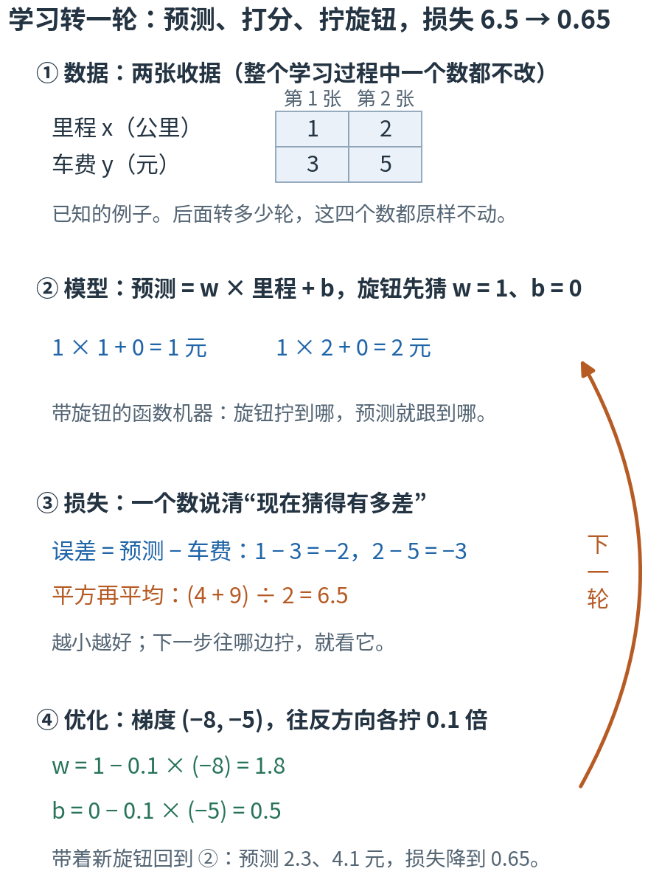
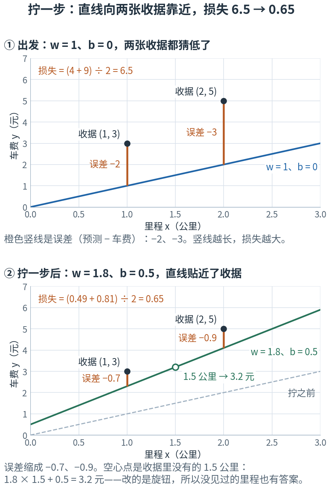
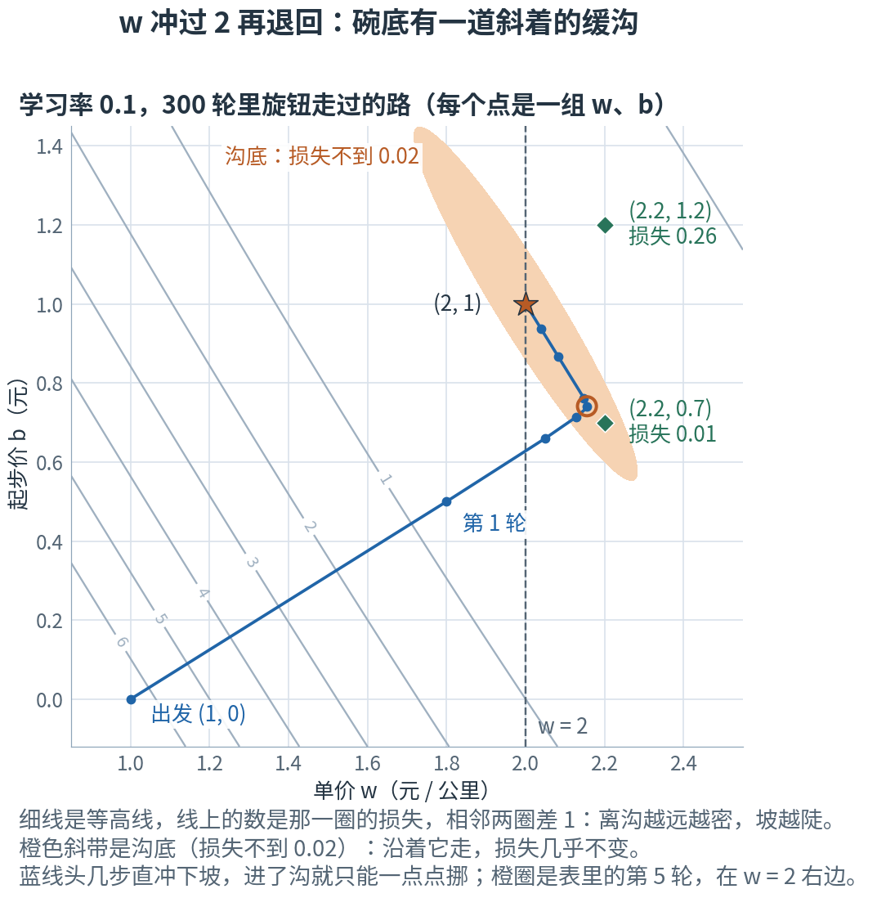
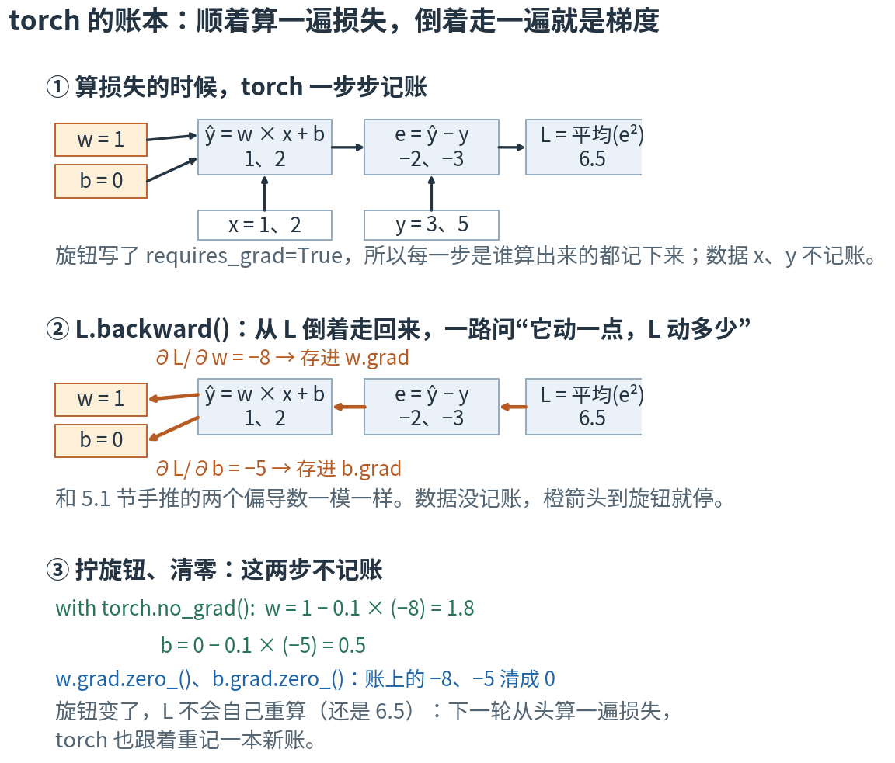
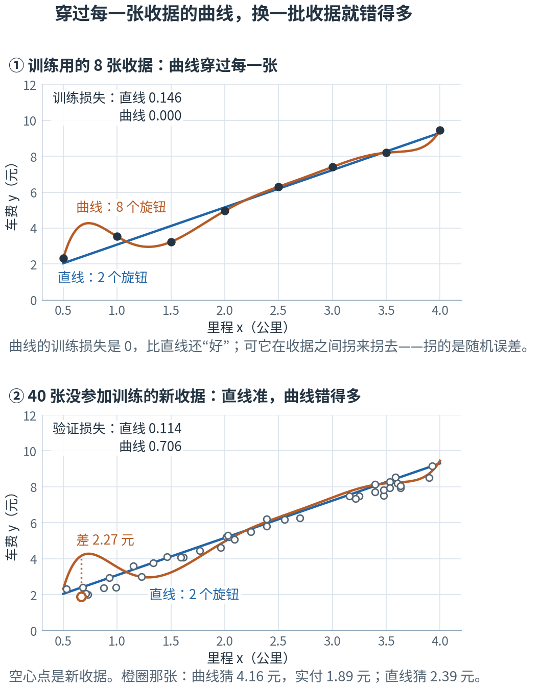
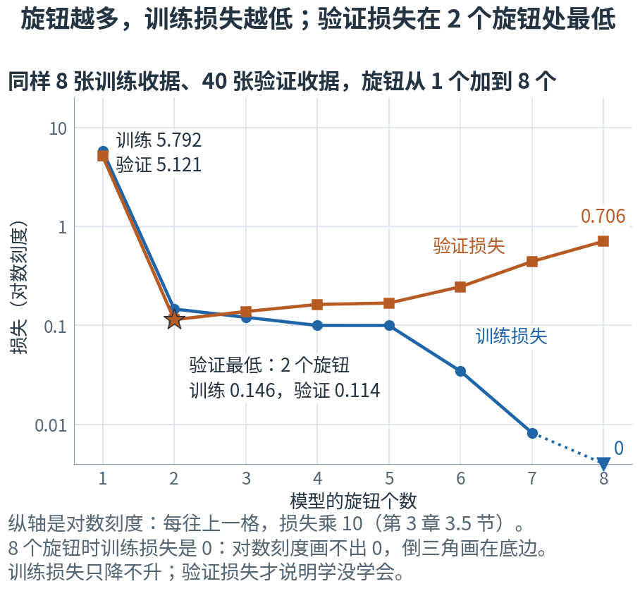

# 第 5 章 · 什么是"学习"：四个零件转一个圈，再拿没见过的数据来考

> **上一部我们有了什么**：函数、导数和链式法则（第 1 章），向量、矩阵和张量（第 2 章），参数、损失函数、梯度下降和学习率（第 3 章），分布与期望（第 4 章）。
> 其实第 3 章 3.5 节已经完整地"学"过一次：50 个点，梯度下降一轮轮地拧 w 和 b，找回了藏着的直线。
>
> **这一章要补什么**：第 1 部的工具到这里第一次拼到一起，拼成一个会"学"的东西。
> 上一次只叫"找直线"。这一章把它拆成四个零件——数据、模型、损失、优化——各起一个名字，
> 看清"学习"到底改了什么、没改什么；再兑现第 3 章的承诺：梯度不再手推，交给 torch 自动算。
> 最后回答一个第 3 章没问过的问题：训练损失降下来了，就算学会了吗？
>
> **本章新词**：模型、优化、训练、超参数、自动求导、泛化、过拟合、验证集、监督学习、无监督学习。
> **需要的前提**：第 3 章 3.4、3.5 节的梯度下降和找直线（本章直接用那里的偏导数公式，不重推）；第 1 章 1.7 节的链式法则只用到名字。
> **不要求**会写 torch 代码——5.4 节的代码逐行配中文，读懂"它在做哪一步"就够。标"进阶"的折叠块可以第二遍再读。

---

## 5.0 先看地图：四个零件连成一个圈，转一轮，旋钮就改一次

**学习 = 从例子里找规律。例子叫数据；带旋钮、用来猜规律的函数叫模型；"猜得有多差"用损失打分；照着损失的坡度拧旋钮叫优化。
四样连成一个圈：转一轮，旋钮改一次；转很多轮，就是训练。学会了没有，要拿没参加训练的数据来考。**

先想一个生活场景。你到外地出差，打了两次车：1 公里付了 3 元，2 公里付了 5 元。你不知道这里怎么计价，
但猜它大概长这样：**车费 = 每公里单价 × 里程 + 起步价**。单价和起步价是两个不知道的数——两个旋钮。
你先随便猜一组（单价 1 元、起步价 0 元），拿两张收据对一对：都猜低了。于是把两个数各调大一点，再对，再调……
调好之后，下一趟打 1.5 公里，不用等收据，你就能先说出大概多少钱。

这就是机器"学习"的全部骨架。本章用这两张收据（为了好算编的数，教学构造）把它从头到尾走一遍。



**读图顺序：** 从 ① 到 ④ 竖着读，④ 做完顺着橙色箭头回到 ②——不是回到 ①：数据一个数都不改，每一轮改的只是旋钮。
图里的数现在不用算，5.1 节会一个一个手算出来；现在只要看清"猜 → 打分 → 拧旋钮 → 再猜"这个圈。

| 概念 | 它在回答什么问题 | 打车里对应什么 | 在哪一节 |
|---|---|---|---|
| 数据 | 拿什么例子来学？ | 手上那两张收据 | 5.1、5.2 |
| 模型 | 用什么样的函数去猜规律？旋钮在哪？ | "单价 × 里程 + 起步价"这个猜法 | 5.2 |
| 损失 | 现在猜得有多差？（一个数，越小越好） | 猜的车费和收据差多少 | 5.2 |
| 优化 | 旋钮往哪边拧、拧多少？ | 把单价、起步价各调一点 | 5.2 |
| 训练 | 怎样一点点把旋钮拧对？ | 对一对、调一调，重复很多遍 | 5.3 |
| 超参数 | 哪些数是人定的、不靠学？ | 每次调多猛、一共调几遍 | 5.3 |
| 自动求导 | 梯度能不能不手推？ | 让计算器替你算"往哪边调" | 5.4 |
| 泛化、过拟合 | 在没见过的例子上准不准？ | 下一趟猜得准 / 只会背收据 | 5.5 |
| 验证集 | 怎么发现"只是背下来了"？ | 留几张收据先不看，最后拿来对答案 | 5.6 |
| 监督学习、无监督学习（还有强化学习） | 例子里带不带标准答案？ | 收据上印着车费 / 只记了里程 / 只知道好不好 | 5.7 |

表里的名字先不背，英文到了各节再给。本章最容易混的三处，先贴上标签：

- **参数 和 超参数**：参数（这里的单价 w、起步价 b）是训练中照着梯度拧出来的；超参数（每次拧多猛的学习率、一共拧几轮）是人事先定好的，训练中没有谁对它求梯度（5.3 节）。
- **"模型"是机器，不是那个文件**：本书说的模型，是"形状 + 旋钮"这台函数机器；平时说"下载一个模型"，指的是旋钮拧好之后存下来的那份文件（5.2 节）。
- **训练损失低 和 真学会了**：是两回事。训练损失可以降到 0，换一批数据照样错得离谱（5.5、5.6 节）。

现在觉得这些区别有点抽象很正常，读到对应小节就清楚了。

第一次读，只要按顺序看正文、图片和手算。标着"进阶"的折叠内容可以先跳过；代码是复核工具，不是阅读门槛。

## 5.1 一次学习：两张收据、两个旋钮，手算一步

两张收据：(1 公里, 3 元)、(2 公里, 5 元)。藏着的规则是"每公里 2 元、起步 1 元"——但**假装不知道**，让计算自己去找。

猜法就是第 3 章 3.5 节的直线：预测车费 $\hat y = wx + b$。x 是里程，w 是单价，b 是起步价；
$\hat y$（"y 帽"，第 3 章 3.5 节）是猜出来的车费，不戴帽子的 y 是收据上真付的车费。先随便猜 w = 1、b = 0。
下面还是第 3 章 3.4 节的三件事：量损失、量坡度、拧一步。

**第一件事：量损失。** 每张收据算预测、误差（预测 − 真值）、误差的平方：

| 里程 x | 车费 y | 预测 $wx + b$ | 误差 e | 误差平方 |
|---:|---:|---:|---:|---:|
| 1 | 3 | 1 × 1 + 0 = 1 | −2 | 4 |
| 2 | 5 | 1 × 2 + 0 = 2 | −3 | 9 |

平方再平均：$L = (4 + 9)/2 = 6.5$。这就是第 3 章 3.5 节的均方误差。

**第二件事：量坡度。** 第 3 章 3.5 节推过：对 w 的偏导数是"2 × 误差 × 里程"的平均，对 b 的是"2 × 误差"的平均
（链式法则：平方的导数是 2 × 误差，再乘误差对这个旋钮的导数——对 w 是 x，对 b 是 1）。

$$\frac{\partial L}{\partial w} = \frac{2×(-2)×1 + 2×(-3)×2}{2} = \frac{-4 - 12}{2} = -8, \qquad
\frac{\partial L}{\partial b} = \frac{2×(-2) + 2×(-3)}{2} = \frac{-4 - 6}{2} = -5$$

两个都是负的：w 和 b 往大拧，损失会变小（第 1 章 1.5 节：导数为负，往大调结果变小）。

**第三件事：拧一步。** 学习率取 0.1：

$$w = 1 - 0.1 × (-8) = 1.8, \qquad b = 0 - 0.1 × (-5) = 0.5$$

两个旋钮都用**拧之前**那一刻量出的坡度：先把 −8、−5 都量完，再一起拧。

**回头再量一次。** 新预测 1.8 × 1 + 0.5 = 2.3、1.8 × 2 + 0.5 = 4.1；新误差 −0.7、−0.9；
新损失 $(0.49 + 0.81)/2 = 0.65$。**一步，损失从 6.5 降到 0.65。**



**这样读图：** 横轴是里程，纵轴是车费。黑点是两张收据，斜线是模型此刻的猜法，橙色竖线是误差——竖线的长度就是"猜的比实付的差几块钱"。
① 两根竖线长 2 和 3，损失 6.5。② 拧一步后直线抬起来、也变陡了，竖线缩成 0.7 和 0.9，损失 0.65。
空心点落在直线上：它不是收据，是"没见过的 1.5 公里"——直线一动，它的预测也跟着动。

这一步到底"学"到了什么？我们没有把 3 和 5 这两个答案存起来查表——改的是两个旋钮，而旋钮对**任何**里程都起作用。
问 1.5 公里多少钱：拧之前，模型答 1 × 1.5 + 0 = 1.5 元；拧一步之后，答 1.8 × 1.5 + 0.5 = 3.2 元，
离藏着的答案 2 × 1.5 + 1 = 4 元近了一大截。收据里根本没有 1.5 公里这一趟。
**这就是这个例子里"学"的具体含义：用例子去改旋钮，让同一条规则对没见过的输入也更准。**

如果觉得眼熟：第 3 章 3.5 节的三个点也是这样手算一轮（损失 22 → 6.16），是同一件事。那时叫它"找一条直线"；这一章给它的各个部分起名字。
实验第 1 节用同一个函数把两边都算了一遍。

> **停一下，自测**：第二步还能直接用 −8、−5 去拧吗？如果不能，第二步的两个偏导数是多少？
> <details><summary>答案</summary>
>
> 不能。旋钮变了，误差就变了（现在是 −0.7、−0.9），坡度要重新量：
> $\partial L/\partial w = (2×(-0.7)×1 + 2×(-0.9)×2)/2 = (-1.4 - 3.6)/2 = -2.5$，
> $\partial L/\partial b = (2×(-0.7) + 2×(-0.9))/2 = (-1.4 - 1.8)/2 = -1.6$。
> 学习的每一轮重复的是**这套计算**，不是反复加同一个数。
>
> </details>

## 5.2 四个零件：数据、模型、损失、优化

5.1 节那一步，是四样东西在配合。把它们拆开、各起一个名字，以后每换一样东西，你都知道换的是哪个零件。
下面每个零件都先说它在 5.1 节里是什么，再说它在机器人身上是什么。

### 一个一个看：两张收据里的四个零件

**零件一：数据。** 已知的例子——那两张收据。整个学习过程中，数据一个数都不改；一轮轮变的只有旋钮。
第 3 章 3.5 节的 50 个点也是数据。机器人的数据，是 4096 只仿真机器人一边走一边记下的"看到了什么、做了什么、得了几分"：
每一轮每只走 24 步，一轮就是 4096 × 24 = 98,304 条记录。手上这两张收据，就是这 98,304 条的迷你版：条数差着四万九千倍（98,304 ÷ 2 = 49,152），"数据从头到尾不改"这一条完全一样。

**零件二：模型。** 一台带旋钮的函数机器：第 1 章 1.1 节"喂进去一个数、吐出来一个数"的那种机器，外加几个能拧的旋钮。
这里喂进去里程，吐出预测车费。机器的形状（一条直线 $wx + b$）是人选的；旋钮（w 和 b）是要学的。
这样一台机器叫**模型**（model）。机器人的模型是一张神经网络（代码里叫 actor）：喂进去它看到的 61 个数，吐出 14 个关节的动作；
形状也是人选的，**197,788** 个旋钮交给训练去拧。
这个数是两笔账加起来的：网络本身的 197,774 个权重和偏置，加上第 4 章 4.7 节那 14 个动作标准差 σ。
本书写 197,788 时说的是"actor 训练时要拧的全部旋钮"，写 197,774 时说的是"网络本身"——送上真机的只有后面这一部分（第 6 章照着配置一个不落地数给你看）。
**这里的 w 和 b 就是它的迷你版**：2 个旋钮和 197,788 个旋钮，转的是同一个圈。

注意"模型"在这里指机器本身：形状 + 旋钮，旋钮拧到哪都算。平时说的"模型文件"，是旋钮拧好之后某一刻存下来的一份存档。

**零件三：损失。** 一个数说清"现在猜得有多差"，越小越好——就是第 3 章 3.1 节的损失函数。
5.1 节用的是均方误差：误差、平方、取平均，得 6.5。为什么要平方，第 3 章 3.5 节说过（正负误差不会互相抵消）；
为什么是**平均**而不是加起来，看本节末的自测。机器人的损失是 PPO 的目标，比均方误差复杂得多（第 13 章讲）。

**零件四：优化。** 拧旋钮、让损失变小的办法，叫**优化**（optimization）；替你做这件事的那段程序，叫优化器。
5.1 节用的是第 3 章 3.4 节的梯度下降：量出梯度 (−8, −5)，每个旋钮往反方向拧 0.1 倍。项目用的是它的升级版 Adam（第 7 章讲）。

### 连成一个圈：四个零件的 JS 版

四个零件首尾相接，就是 5.0 节那张图的圈：数据喂进模型，模型给出预测，损失给预测打分，优化照着损失的坡度拧旋钮，
带着新旋钮回到模型。写成 JS，四个零件就是四样各管一件事的东西：

```js
const mean = a => a.reduce((s, v) => s + v, 0) / a.length;           // 求平均
const data = { x: [1, 2], y: [3, 5] };                                 // 零件一：数据（从头到尾不改）
const model = (w, b, x) => x.map(xi => w * xi + b);                    // 零件二：模型（形状是直线，旋钮 w、b）
const loss = (pred, y) => mean(pred.map((p, i) => (p - y[i]) ** 2));   // 零件三：损失（均方误差）
// 零件四：优化——量出梯度，每个旋钮往反方向拧一小步（5.4 节让 torch 替你量梯度）
loss(model(1, 0, data.x), data.y);                                     // → 6.5
```

把整段粘进浏览器的控制台（按 F12 打开）回车，会显示 6.5——和 5.1 节手算的一样。实验第 2 节用 Python 把四个零件各写成一个函数，
拼起来正好是 5.1 节那一步：6.5 → (1.8, 0.5) → 0.65。

**为什么重要**：这四个零件是全书的骨架。后面每一章都在把其中一个零件换成更复杂的版本：第 6 章换模型（神经网络），第 7 章换优化（Adam），
第 9 章换数据的来源（机器人自己跑出来），第 11–13 章换损失（策略梯度、PPO）。圈的形状始终不变。

回看用的索引（不用背）：

| 零件 | 5.1 节的两张收据 | 第 3 章 3.5 节 | 机器人（后面各章） |
|---|---|---|---|
| 数据 | 2 张收据 | 50 个 (x, y) 点 | 每轮 4096 × 24 = 98,304 条记录 |
| 模型 | 直线 $wx + b$，2 个旋钮 | 同样的直线，2 个旋钮 | 神经网络 actor，197,788 个旋钮（第 6 章） |
| 损失 | 均方误差 | 均方误差 | PPO 的目标（第 13 章） |
| 优化 | 梯度下降，学习率 0.1 | 梯度下降，学习率 0.1 | Adam（第 7 章） |

> **停一下，自测**：把损失从"取平均"改成"加起来"，两张收据时损失是多少？对 w 的偏导数呢？
> 再把两张收据各复制一份（变成一模一样的 4 张），这两个数变成多少？取平均的版本又是多少？
> <details><summary>答案</summary>
>
> 加起来：2 张时损失 4 + 9 = 13，偏导数 2×(−2)×1 + 2×(−3)×2 = −16；复制成 4 张，损失 26、偏导数 −32，全都翻倍。
> 取平均：不管复制几份，都是 6.5 和 −8。
> 数据还是那些、只是多抄了一遍，"猜得有多差"本不该变；可"加起来"的版本让坡度也翻了倍，同一个学习率一步就迈大一倍。
> 所以损失取平均：它说的是"平均每条错多少"，不随数据条数变。
>
> </details>

## 5.3 训练：把这一圈转很多轮；旋钮是学出来的，超参数是人定的

### 转 300 轮：损失先掉得飞快，再越来越慢

一轮只把损失从 6.5 降到 0.65。接着转第二轮：用 5.1 节自测里重新量出的坡度 (−2.5, −1.6)，

$$w = 1.8 - 0.1 × (-2.5) = 2.05, \qquad b = 0.5 - 0.1 × (-1.6) = 0.66$$

新预测 2.71、4.76，新误差 −0.29、−0.24，损失 $(0.0841 + 0.0576)/2 = 0.07085$。

把这个圈一轮一轮转下去，就叫**训练**（training）。实验第 3 节转了 300 轮（表头的"迭代"就是"第几轮"，和第 3 章 3.5 节一样）：

```
迭代       w       b    损失 L
----  ------  ------  --------
   0  1.0000  0.0000  6.500000
   1  1.8000  0.5000  0.650000
   2  2.0500  0.6600  0.070850
   3  2.1270  0.7130  0.013344
   5  2.1551  0.7410  0.006710
  10  2.1475  0.7614  0.005740
  50  2.0819  0.8674  0.001771
 100  2.0393  0.9364  0.000407
 300  2.0021  0.9966  0.000001
```

**怎么读这张表**：前三轮损失掉得飞快（6.5 → 0.013），之后越来越慢：第 100 轮 0.0004，第 300 轮只剩 0.000001。
旋钮一路走向藏着的规则 w = 2、b = 1——这组旋钮让两张收据的误差都恰好是 0。

### 为什么 w 先冲过 2：碗底有一道斜沟

表里有一处可能和你想的不一样：w 先冲过了 2（第 5 轮 2.1551），再慢慢退回来；b 则一路慢慢爬向 1。
原因是两个旋钮能互相补偿：单价高一点、起步价低一点，两张收据也差不多对得上。手算两组就看得出来：

- (w, b) = (2.2, 0.7)：单价多了 0.2、起步价少了 0.3。预测 2.9、5.1，误差 −0.1、0.1，损失只有 (0.01 + 0.01)/2 = 0.01。
- (w, b) = (2.2, 1.2)：两个都多了 0.2。预测 3.4、5.6，误差 0.4、0.6，损失 (0.16 + 0.36)/2 = 0.26，是上一组的 26 倍。

两个旋钮往同一边偏，两张收据一起错，损失涨得快：这是碗的陡方向。一个偏高、一个偏低，误差一正一负、都很小，损失几乎不涨：
碗底有一道斜着走的**沟**，沿着沟走，两张收据都差不多对得上。沟里的坡很缓：在 (2.2, 0.7)，梯度只有 (0.1, 0)，学习率 0.1 一轮只把 w 往回拧 0.01。
第 3 章 3.6 节说过，学习率能取多大由最陡的方向说了算，对缓的方向又嫌太小。所以前三轮顺着陡方向把损失压下去（6.5 → 0.013）、旋钮落进沟里之后，只能沿着沟一点点挪回 (2, 1)。



**这样读图：** 横轴是单价 w，纵轴是起步价 b，图上每个点是一组旋钮。细灰线是等高线（第 3 章 3.1 节），线上的数是那一圈的损失，相邻两圈差 1，离沟越远越密、坡越陡。
橙色斜带就是沟底（损失不到 0.02）。蓝线是 300 轮里旋钮走过的路：从 (1, 0) 出发，头几步又长又直，顺着陡方向冲下坡，一步比一步短；进了沟就拐个弯，沿着沟一点点挪向 ★ (2, 1)。
橙圈是表里的第 5 轮，在竖虚线 w = 2 的右边——这就是"w 冲过了 2"。两个绿菱形是上面手算的两组：(2.2, 0.7) 在沟里，(2.2, 1.2) 在坡上。

<details>
<summary>进阶：用第 5 轮的数看 w 为什么先冲过 2（现在可跳过）</summary>

一开始 w 就跑得比 b 快：w 的偏导数里多乘了一个里程 x，2 公里那张收据把它的作用放大了一倍，所以第一轮 w 的坡度是 −8，比 b 的 −5 陡。

到第 5 轮，w = 2.1551、b = 0.7410。两张收据的预测是 2.1551 + 0.7410 = 2.8961 和 2 × 2.1551 + 0.7410 = 5.0512，
误差 −0.1039 和 +0.0512——一张猜低、一张猜高。这时

$$\frac{\partial L}{\partial w} = \frac{2×(-0.1039)×1 + 2×0.0512×2}{2} = \frac{-0.2078 + 0.2048}{2} = -0.0015, \qquad
\frac{\partial L}{\partial b} = \frac{2×(-0.1039) + 2×0.0512}{2} = \frac{-0.2078 + 0.1024}{2} = -0.0527$$

w 这边，两张收据的意见几乎抵消（−0.0015，差不多是 0），w 就停住了；b 这边还是 −0.0527，b 继续往大拧。
b 一变大，两张的预测一起变高，2 公里那张猜得更高，于是 ∂L/∂w 转成正的（实验里第 10 轮已经是正的），w 开始往回退。
b 每往上爬一点，w 就得让一点——这就是"互相补偿"。

</details>

### 三种数别混：数据、参数、超参数

回头看这一轮轮的计算，里面有三种数，别混：

- 数据：x = 1、2 和 y = 3、5。给定的，从头到尾不改——优化器从不碰它们。
- 参数：w 和 b（第 3 章 3.1 节的旋钮；全部旋钮合起来记作 θ，第 3 章 3.4 节）。每一轮照着梯度改的，就是它们。
- 学习率 0.1、一共转 300 轮、从 (1, 0) 出发、选直线这种形状：这些是**人定的**，训练开始前就写好了，训练中没有谁对它们求梯度。
  这类数叫**超参数**（hyperparameter）——"超"是"在参数上面一层"的意思：它们管的是参数怎么学。

超参数选得不好，学习照样会失败：第 3 章 3.6 节的学习率太大就会飞出去，在这两张收据上也一样（"改一改"第 1 条让你亲手试）。

机器人也要这样分清。它的观测和已经做出的动作是收集来的记录，是数据；网络里的旋钮才是 PPO 要改的参数。
下一轮收到的记录会不一样，那是因为旋钮变了、机器人的走法变了，不是优化器回头改写了历史。
项目的超参数写在配置文件里：学习率 0.001、每轮每只机器人走 24 步、网络的形状、最多训练几轮……（📍 看一眼）。
它们都不是照着梯度拧出来的；有的会在训练中变，也是照人事先写好的规则变——比如学习率，配置里的 0.001 只是起点，训练中会按一条规则自动调大调小（第 3 章 📍 看过这条规则）。照着梯度拧的，只有网络里的旋钮（光 actor 就有 197,788 个）。

> **停一下，自测**：下面各是数据、参数还是超参数？① 第二张收据上的 5 元；② 第 2 轮之后的 w = 2.05；③ 学习率 0.1；④ "一共转 300 轮"。
> <details><summary>答案</summary>
>
> ① 数据（给定，不改）；② 参数（照着梯度拧出来的）；③、④ 超参数（人定的，训练中没有谁对它们求梯度）。
>
> </details>

## 5.4 自动求导：只写损失怎么算，梯度交给 torch

### 手推梯度：模型一改，就得重推一遍

到现在为止，每一轮的梯度都是照第 3 章 3.5 节**推出来的公式**算的：对 w 是"2 × 误差 × x"的平均，对 b 是"2 × 误差"的平均。
写成 JS，就是你自己先推完导数，再一行行抄进代码（`mean` 是 5.2 节那个求平均的小函数；接着 5.2 节那段粘进控制台，最后一行会显示 `[-8, -5]`，和 5.1 节手算的一样）：

```js
const x = [1, 2], y = [3, 5], w = 1, b = 0;        // 两张收据，旋钮在出发点
const err = x.map((xi, i) => w * xi + b - y[i]);   // 误差 → [-2, -3]
const dw = mean(err.map((e, i) => 2 * e * x[i]));  // ∂L/∂w：你推出来的"2 × 误差 × x"
const db = mean(err.map(e => 2 * e));              // ∂L/∂b：你推出来的"2 × 误差"
[dw, db];                                          // → [-8, -5]
// 模型一换（比如 5.5 节再加一个旋钮），dw、db 这两行就得重新推、重新写
```

两个旋钮还能手推。近 20 万个旋钮、四层网络套在一起，手推也不是做不到（同一层的旋钮可以用矩阵一起推），可每改一次网络就得重推一遍、重写一遍，很容易出错。

### torch 记的那本账：顺着算一遍，倒着走一遍

torch（项目训练网络用的 Python 库，第 2 章 2.8 节见过它的张量）的核心本领正好反过来：**你只写"损失怎么算"，它自己求出损失对每个旋钮的偏导数。**
这件事叫**自动求导**（automatic differentiation），torch 里这套功能叫 autograd。

用过 Vue 的 computed 或者 MobX 吗？你只写"总价 = 单价 × 数量"，框架就自己记下"总价是由单价和数量算出来的"，单价一变，它知道该重算谁。
torch 记的是同一种账，只是用法反过来：一边算损失，一边记下"损失是由 w、b 一步步算出来的"；
然后从损失出发倒着往回问——w 动一点，损失动多少？这一路问回去，就是第 1 章 1.7 节的链式法则从外往里乘一遍（具体怎么乘，第 7 章拆开看）。
还有一处和 computed 不一样：computed 会在单价变了之后自动重算总价，torch 不会。旋钮拧过之后，损失要你自己再算一遍（下面那段代码拧完之后，`L` 里还是 6.5），torch 也跟着重新记一本新账。所以训练代码总是一个循环：每一轮重新算损失、重新 `backward()`。

这本"账"长什么样，画出来就清楚了：



**读图顺序：** 先看 ① 里的黑箭头，从左往右顺着算一遍：两个旋钮和里程算出预测 1、2，预测减车费得误差 −2、−3，误差平方再平均得 6.5。
这一路上每一步是谁算出来的，torch 都记在账上——这就是"记账"的全部含义，账上记的是**哪个数由哪些数算出来的**。
再看 ② 的橙箭头，从右往左倒着走：每退一步问一句"它动一点，L 动多少"，走到头，w 和 b 各落下一个数（−8 和 −5），正是 5.1 节手推的那两个偏导数。
注意橙箭头走到旋钮就停了，没有伸向 x、y：数据没记账，torch 也就不去算"损失对数据的导数"。③ 是拧旋钮和清零，这两步不在账上，下面逐行讲。

### 四个动作：标旋钮、算损失、拧旋钮、清零

下面是 5.1 节那一步的 torch 版：

```python
w = torch.tensor(1.0, requires_grad=True)   # 旋钮 w，初值 1；requires_grad=True：请 torch 记下它参与的每一步计算
b = torch.tensor(0.0, requires_grad=True)   # 旋钮 b，初值 0
x = torch.tensor([1.0, 2.0])                # 数据：两张收据的里程（不用记账）
y = torch.tensor([3.0, 5.0])                # 数据：两张收据的车费

L = torch.mean((w * x + b - y) ** 2)        # 只写"损失怎么算"：预测、作差、平方、平均 → 6.5
L.backward()                                # 倒着把账算一遍：求出 ∂L/∂w、∂L/∂b，存进 w.grad、b.grad

with torch.no_grad():                       # 拧旋钮这两行不需要记账
    w -= 0.1 * w.grad                       # w = 1 − 0.1 × (−8) = 1.8
    b -= 0.1 * b.grad                       # b = 0 − 0.1 × (−5) = 0.5
w.grad.zero_()                              # 把 .grad 清零，准备下一轮
b.grad.zero_()
```

里面新出现的写法，逐个认一遍：

1. `torch.tensor(...)`：把数装进 torch，得到第 2 章 2.8 节的张量。`requires_grad=True` 是告诉 torch："这是旋钮，它参与的计算都要记账。"数据不用记账，就不写。
2. `L.backward()`：从损失倒着算回去，把 ∂L/∂w、∂L/∂b 分别存进 `w.grad`、`b.grad`（grad 是 gradient 的缩写，就是梯度）。它不返回东西，结果在 `.grad` 里。
3. `with torch.no_grad():`：Python 的 `with` 块，下面缩进的那几行都在它的设置下执行——这一段里的计算别记账。拧旋钮不是"算损失"的一部分，不该记账；不包这一句，torch 会直接报错（它不许在正在记账的旋钮上原地改数；实验第 4 节试给你看）。
4. `.zero_()`：把 `.grad` 清成 0（名字末尾的下划线是 torch 的习惯：直接改它自己，不另造一份）。为什么非清不可，看下面的 ⚠️。

实验第 4 节把 torch 算出的梯度和 5.1 节的手算并排打印：

```
       手算（5.1 节）  torch：w.grad、b.grad
-----  --------------  ---------------------
∂L/∂w              -8                     -8
∂L/∂b              -5                     -5
```

一模一样。`backward()` 算的就是你手推的那两个偏导数，只是不用你推。

> ⚠️ **忘了清零，梯度会累加。** `backward()` 不会覆盖 `.grad` 里原来的数，而是**加**上去。
> 实验连着调了两次 `backward()`、中间不清零：`w.grad` 变成 −8 + (−8) = −16，`b.grad` 变成 −5 + (−5) = −10。
> 拿它去拧，一步就迈大了一倍；每轮都忘，旧的梯度就一轮轮越积越多。torch 故意这样设计（有时要把几批数据的梯度加在一起再拧），
> 所以每一轮拧完都要清零。第 3 章 📍 里 `update()` 那行 `self.optimizer.zero_grad()` 就是这件事：一次清掉所有旋钮的 `.grad`。

### 回到 50 个点：torch 和手推走出同一条路

把第 3 章 3.5 节那 50 个点（x 在 −1 到 1 之间，没有单位）换成 torch 跑：同一份数据，从 w = 0、b = 0 出发，学习率 0.1，走 200 轮：

```
                           w        b
-------------------  -------  -------
     torch 自动求导  2.02617  1.00192
手写梯度（第 3 章）  2.02617  1.00192
```

两行一样，也正是第 3 章 3.5 节那张九行表的最后一行（第 200 轮 w = 2.02617、b = 1.00192）。
实验里两者相差不到 1e-12，也就是 0.000000000001：小数点后第 12 位才可能不同（这是第 3 章 3.6 节的科学计数法，e 后面带负号时小数点往左挪；这个 e 和误差没有关系）。

**你不需要现在就会写 torch。** 认得这四个动作就够：标出旋钮（`requires_grad`）、写出损失再 `backward()`、在 `no_grad` 里用 `.grad` 拧旋钮、清零。
后面所有训练代码，都是这四步的变体。

> **停一下，自测**：如果每一轮都忘了清零，第二轮拿去拧的 `w.grad` 是多少？（第二轮真正的梯度是 5.1 节自测算过的 −2.5。）
> <details><summary>答案</summary>
>
> −8 + (−2.5) = −10.5：第一轮的 −8 还留在 `.grad` 里，第二轮的 −2.5 又加了上去。拿它去拧，这一步是该走的 4 倍多（10.5 ÷ 2.5 = 4.2）。
>
> </details>

## 5.5 泛化与过拟合：学会了规律，还是背下了收据

5.3 节的训练损失降到了 0.000001。可是，**降下来就算学会了吗？** 你真正关心的从来不是那两张收据——它们多少钱你早就知道——而是**下一趟**。

### 学得好的样子：50 个点上的泛化

先看一个学得好的。第 3 章 3.5 节的 50 个点，训练完 w = 2.02617、b = 1.00192。拿 5 个训练时没见过的 x 去问它（实验第 5 节）：

```
新的 x  真值 2x+1  模型预测
------  ---------  --------
    -1         -1    -1.024
  -0.5          0    -0.011
     0          1     1.002
   0.5          2     2.015
     1          3     3.028
```

每一行都能手算核对，比如 x = 0.5：2.02617 × 0.5 + 1.00192 = 1.013085 + 1.00192 = 2.015005，约等于 2.015；真值 2，只差 0.015。五行的误差都不到 0.03。
模型没见过这 5 个 x，却都答得准。这种在没见过的数据上也准的本事，叫**泛化**（generalization）：学到的是规律，不是把 50 个点背了下来。

### 迷你版：两张收据管不住三个旋钮

反过来的情况也有。先看迷你版：还是那两张收据，但模型换成**三个旋钮**：$\hat y = b + wx + cx^2$。新旋钮 c 管着"弯"：c = 0 就是直线。下面两组旋钮都行：

- (b, w, c) = (1, 2, 0)：1 + 2 × 1 = 3，1 + 2 × 2 = 5。两张收据都对上，训练损失 0。
- (b, w, c) = (17, −22, 8)：17 − 22 + 8 = 3，17 − 44 + 32 = 5。**也都对上**，训练损失也是 0。

问 1.5 公里：第一组答 1 + 2 × 1.5 = 4 元；第二组答 17 − 22 × 1.5 + 8 × 2.25 = 17 − 33 + 18 = 2 元（1.5² = 2.25）。
两组的训练损失一样好，对没见过的里程却一个答 4、一个答 2。**两张收据只给了两个条件，管不住三个旋钮**——光看训练数据，分不出谁对谁错。

### 8 张收据配 8 个旋钮：把随机误差也学了进去

真实的情况更糟：收据还带着随机误差（堵车、等红灯，多付少付几毛钱；第 3 章 3.5 节叫它噪声）。
实验造了 8 张这样的收据（里程 0.5、1、1.5……4 公里；车费 = 2 × 里程 + 1，再加一点随机误差），分别用直线（2 个旋钮）和一条 8 个旋钮的曲线去学，
再拿 40 张**没参加训练**的新收据去考。表头的"验证损失"就是"在新收据上算的均方误差"，5.6 节细讲：

```
          模型  训练损失（8 张）  验证损失（40 张新收据）
--------------  ----------------  -----------------------
直线：2 个旋钮             0.146                    0.114
曲线：8 个旋钮             0.000                    0.706
```

（直线那一行有点反直觉：验证损失 0.114 比训练损失 0.146 还**低**。不是笔误，5.6 节末尾解释为什么会这样。）

直线那一行可以亲手核对。8 张训练收据的车费（实验第 5 节打印，保留 3 位小数）和这 8 张上最好的直线（w = 2.074、b = 1.008）都在下面；
接着 5.2 节的控制台（`mean` 已经有了），把这三行粘进去：

```js
const xs = [0.5, 1, 1.5, 2, 2.5, 3, 3.5, 4];                             // 8 张训练收据的里程
const ys = [2.316, 3.533, 3.234, 4.959, 6.304, 7.406, 8.196, 9.449];     // 它们的车费
mean(xs.map((x, i) => (2.074 * x + 1.008 - ys[i]) ** 2));                // 直线的训练损失
```

会显示 0.146 开头的一串数。曲线那一行的 0 不用算：下面的图里它穿过了每一个点，8 个误差全是 0。



**这样读图：** 横轴里程、纵轴车费，蓝线是直线，橙线是 8 个旋钮的曲线。① 黑点是训练用的 8 张收据：橙线穿过了每一个黑点（所以训练损失是 0），蓝线只从它们中间穿过。
再看 1 公里和 1.5 公里那两张：1 公里付了 3.533 元，多走半公里反而只付 3.234 元——这只能是随机误差在作怪（按藏着的规则该是 3 元和 4 元）。
可橙线为了穿过这两个点，只好在 0.5 到 1.5 公里之间先鼓起一个包、再凹下去。
② 空心点是 40 张新收据，它们老老实实贴着蓝线；橙线在那个包附近离得最远：橙圈那张 0.67 公里的收据实付 1.89 元，曲线猜 4.16 元，直线猜 2.39 元。

单看橙圈这一张：曲线错了 4.16 − 1.89 = 2.27 元，平方约 5.15；直线错了 2.39 − 1.89 = 0.5 元，平方 0.25——这一张上，曲线的平方误差是直线的 20 多倍。
验证损失，就是 40 张新收据各自的误差平方取平均。

8 个旋钮、8 张收据，曲线想怎么弯就怎么弯，于是它穿过了每一张——训练损失 0，比直线还"好"。
可它为了穿过每个点，把每张收据上那几毛钱的随机误差也当成了规律；换 40 张新收据，它的损失是直线的 6 倍多。
这叫**过拟合**（overfitting）：旋钮太多、数据太少，模型把噪声也"学"了进去——训练数据上损失很低，新数据上一塌糊涂。
好比学生把题库的答案背了下来，题目换个数字就不会。

曲线的 8 个旋钮是怎么定下来的，放在下面的折叠里；第一遍只要知道它是"在这 8 张收据上能做到的最好"。

<details>
<summary>进阶：8 个旋钮的曲线是怎么"学"的（现在可跳过）</summary>

曲线是 $\hat y = b + w_1 x + w_2 x^2 + \dots + w_7 x^7$，8 个旋钮是 b 和 $w_1 \dots w_7$（$x^7$ 就是 7 个 x 连乘，"…"表示中间几项照样子往下写）。
实验没有用梯度下降一步步拧，而是用 numpy 的 `polyfit` 直接解出让训练损失最小的那组旋钮——这种模型的"碗底"可以解方程一次算出来。
梯度下降一步步拧，最后也会走到同一个碗底，只是这只碗扁得厉害，要走非常多步。
表里直线的 0.146 也是这样解出来的：它是这 8 张收据上最好的那条直线。

</details>

> **停一下，自测**：(b, w, c) = (−7, 14, −4) 也能让两张收据都对上吗？它对 1.5 公里答多少？
> <details><summary>答案</summary>
>
> 能：−7 + 14 − 4 = 3，−7 + 28 − 16 = 5（x = 2 时 $x^2 = 4$，−4 × 4 = −16）。1.5 公里：−7 + 14 × 1.5 − 4 × 2.25 = −7 + 21 − 9 = 5 元。
> 三组旋钮训练损失都是 0，对 1.5 公里却答 4、2、5——训练数据真的管不住第三个旋钮。
> 其实 c 取任何数都行：配上 b = 1 + 2c、w = 2 − 3c，两张收据总能对上（c = 8 就是 (17, −22, 8)，c = −4 就是这一组）。两个条件、三个旋钮，对得上的组合有无数组。
>
> </details>

## 5.6 验证集：留一份不拿来拧旋钮的数据

5.5 节能看出曲线"背下了收据"，全靠那 40 张新收据。只看训练损失，曲线的 0 比直线的 0.146 还漂亮——你会选错。

### 迷你版：多一张不拿来拧旋钮的收据

先在 5.5 节的迷你版上试一下。那三组旋钮在两张收据上的训练损失都是 0，打成平手。这时又来了一张收据：1.5 公里，付了 4 元。它不拿来拧旋钮，只拿来打分（这里的"分"就是损失，越低越好——和第 1 章 1.9 节那种越高越好的打分反着来）：

- (1, 2, 0) 答 4 元，误差 0，损失 0；
- (17, −22, 8) 答 2 元，误差 −2，损失 4；
- (−7, 14, −4) 答 5 元，误差 1，损失 1。

只多了一张没拿来拧旋钮的收据，打平的三组就分出了高下，挑中的正是藏着的规则。

所以要把手上的数据分成两份。一份拿来拧旋钮，叫**训练集**；另一份从头到尾**不拿来拧旋钮**，只拿来打分，叫**验证集**（validation set）——上面那张 1.5 公里的收据，就是只有一张的验证集。
在训练集上算的损失叫训练损失，在验证集上算的叫验证损失。验证集里的数据越多，打出的分越稳（第 4 章 4.5 节：抽得越多，平均越准）。

### 用验证集挑超参数：旋钮从 1 个加到 8 个

验证集最常见的用处是挑超参数。"用几个旋钮的曲线"就是一个超参数（5.3 节：模型的形状是人定的）。
实验第 6 节把旋钮从 1 个加到 8 个，每种都在同样 8 张训练收据上学，再用同样 40 张验证收据打分：



**这样读图：** 横轴是模型的旋钮个数，蓝线是训练损失，橙线是验证损失。纵轴是对数刻度（第 3 章 3.5 节）：0.01、0.1、1、10，每往上一格乘 10，
这样 5.792 和 0.008 才画得进同一张图。先看蓝线：一路往下，到 8 个旋钮时是 0——对数刻度画不出 0，就画成底边上的倒三角。
再看橙线：从 1 个旋钮的 5.121 猛降到 2 个旋钮的 0.114（★），然后一路往上爬，到 8 个旋钮时是 0.706。

- 1 个旋钮（只有起步价，一条水平线）：训练 5.792、验证 5.121，两边都差——连"越远越贵"都学不到。
- 2 个旋钮（直线）：训练 0.146、验证 0.114，验证损失最低。
- 再往上加：训练损失继续降，到 8 个旋钮降到 0；验证损失却一路升，到 0.706。

**训练损失只看拧旋钮用过的数据，所以旋钮越多它越低，只降不升；验证损失才说明学没学会。**
按验证损失挑，选中的是 2 个旋钮——正好是藏着的规则的形状。

> ⚠️ **验证集只能拿来打分，不能拿来拧旋钮；最后的考试还要再留一份。** 一旦把验证集也拿去训练，它就成了训练集，分数又会像训练损失一样只降不升。
> 还有一层：你反复看验证分数挑超参数，挑来挑去，选出的设置也会碰巧偏爱这 40 张收据。
> 所以严格的做法是再留第三份数据，叫**测试集**：所有选择都定下来之后，只用它考一次。若反复按测试集回头改模型，它就不再是独立的最终考试了。

### 为什么验证损失会比训练损失还低

回头看 5.5 节那张表：直线的训练损失 0.146，验证损失 **0.114**，更低。说好的"在拧旋钮用过的数据上更准"呢？

因为这两个数是在两批不同的收据上算的，而每批收据自带的随机误差不一样大。
拿藏着的规则 $y = 2x + 1$ 当模型——它一个旋钮也没学过，谈不上偏爱哪一批——分别在两批上打分（实验第 5 节）：

- 8 张训练收据上：损失 **0.184**；
- 40 张验证收据上：损失 **0.069**。

这两个数说的是"这批收据上的随机误差有多大"。恰好这 8 张抽得偏大（0.184），那 40 张抽得偏小（0.069），
所以在 8 张上算出来的分数天生就难看一些。实验里每张收据的随机误差，是按标准差 σ = 0.3 抽出来的（5.5 节的堵车、等红灯；σ 在这里是随机误差的标准差，不是 5.2 节那 14 个动作 σ），
平均而言应该是 σ² = 0.3 × 0.3 = 0.09（第 4 章 4.4 节：随机误差围着 0 散开，"误差平方的平均"正是它的方差）；
0.184 和 0.069 一高一低，都是这一把的运气，抽的张数越多越贴近 0.09（第 4 章 4.5 节）。

0.184 你可以自己核对：接着 5.5 节的控制台（`xs`、`ys` 已经在了），把那一行里的 `2.074 * x + 1.008` 换成藏着的规则 `2 * x + 1`：

```js
mean(xs.map((x, i) => (2 * x + 1 - ys[i]) ** 2));   // → 0.1837…：这 8 张收据自带的随机误差有多大
```

学出来的直线在这 8 张上只有 0.146，比藏着的规则还低——它已经稍稍迁就了这 8 张的随机误差（w 学成 2.074 而不是 2）。
可这点迁就换不来新收据上的好处：同样一条直线，在 40 张新收据上是 0.114，比藏着的规则的 0.069 差。
**这就是过拟合最轻的一档**：8 个旋钮的曲线只是把同一件事做到了极端。

> ⚠️ **别横着比"训练损失和验证损失哪个低"。** 它们量的是两批运气不同的数据：验证损失更低，可能只是那批收据的随机误差抽得温和，
> 不说明模型在新数据上更厉害。要比的是**同一批验证收据上，几个候选模型谁更低**——上面那张 1 到 8 个旋钮的图，比的正是这个。

> **停一下，自测**：如果把那 40 张验证收据换成运气特别差的一批（随机误差普遍偏大），直线的验证损失会变大还是变小？这说明"该选几个旋钮"的结论会跟着变吗？
> <details><summary>答案</summary>
>
> 会变大——这批收据自带的随机误差更大，谁来考都得多扣分。但几个候选模型是在**同一批**验证收据上打分的，一起变大，排序基本不动，挑中的多半还是 2 个旋钮。
> 这也是验证集要多留几张的原因（第 4 章 4.5 节：抽得越多，平均越准）：张数太少，排序就容易被运气搅乱。
>
> </details>

机器人的训练里没有现成的"一份数据"可以分：数据是它自己跑出来的，每轮都是新的。过拟合换了个样子出现：
策略只会仿真里那一套地形、那几种速度指令，一到真机就更容易失效。
第 17 章讲的域随机化（在仿真里故意把摩擦、质量这些量随机改一改，逼策略别只适应一种情况）就是对策之一。
但仿真到真机的差距还包括仿真本身不准（仿真里的电机、摩擦和真的不一样），不能把所有失败都简单归成"数据不够"。

<details>
<summary>第二遍读：强化学习里怎么判断"学得好不好"</summary>

本章的例子里，训练损失一路降、最后停住，你能大致看出"学完了"。机器人用的 PPO 不是这样：数据每轮都换，损失的目标也跟着策略变，
它的损失不会像这里一样一路往下走，不能只看"损失停止下降"来决定停不停。项目里看的是另一组曲线（奖励等），
再加上看仿真视频、看真机表现；什么时候停，还要看训练预算。第 18 章（怎么读训练曲线）讲这些。

</details>

> **停一下，自测**：如果只按训练损失挑旋钮个数，实验第 6 节那张图会让你挑几个？按验证损失呢？哪一个更接近藏着的规则？
> <details><summary>答案</summary>
>
> 按训练损失挑 8 个（训练损失 0，最低）；按验证损失挑 2 个（0.114，最低）。藏着的规则"每公里 2 元、起步 1 元"是一条直线，正是 2 个旋钮。
>
> </details>

## 5.7 三种学法：有答案、只有输入、只有分数

前面每张收据上都印着车费——每个输入都配了标准答案，学的时候能直接算"错了多少"。不是所有学习都这么幸运。按"例子里带不带答案"，学习分三种。

**有标准答案。** 小孩认猫：大人指着一只只猫说"这是猫"，看多了，没见过的猫也认得出。找直线、猜车费都属于这一种：每个 x 都配好了正确的 y。
这叫**监督学习**（supervised learning）——像有老师在旁边批改。

**只有输入，没有答案。** 一抽屉没写名字的照片，你按长相把它们分成几堆——没人告诉你分对没有，你找的是数据自己的结构。
再比如一沓只记了里程、没记车费的行程单，你也能看出"短途一堆、长途一堆"。这叫**无监督学习**（unsupervised learning）。

**没有正确答案，只有分数。** 学骑自行车：没人告诉你每一刻车把该转几度，你只知道摔了疼、骑稳了爽。训练小狗也一样：做对了给零食，做错了没有。
这叫**强化学习**，第 9 章正式讲。

机器人走路是第三种，而且难在两处：

- **没人知道"正确的 14 个关节角"是什么。** 没法像收据那样给每一步配答案，只能让它试：摔了扣分、走稳了加分。
- **它看到的数据取决于它自己怎么走。** 走得歪，看到的全是歪的画面；旋钮一变，下一轮的数据也跟着变（5.3 节说的"不是改写历史"）。

这两点让强化学习的"损失"零件比均方误差复杂得多——那是第 3 部的全部内容。**但骨架不变**：还是数据、模型、损失、优化四个零件，
还是"算损失 → `backward()` → 拧旋钮"的那个圈。

回看用的索引（不用背）：

| 学法 | 有没有标准答案 | 数据从哪来 | 例子 |
|---|---|---|---|
| 监督学习 | 有：每个输入配一个正确输出 | 人标好的 | 认猫、找直线、猜车费、翻译 |
| 无监督学习 | 没有：只有输入，自己找结构 | 现成的 | 照片分堆、顾客分群 |
| 强化学习 | 没有正确动作，只有分数 | 自己跑出来的 | 下棋、打游戏、机器人走路 |

> **停一下，自测**：下面三件事各属于哪种学法？① 手上有过去的成交记录，根据房子的面积和位置预测房价；② 把一万篇新闻按话题自动分成几堆；
> ③ 让机器人学爬楼梯，只告诉它"爬上一级加分、摔倒扣分"。
> <details><summary>答案</summary>
>
> ① 监督学习（成交价就是标准答案）；② 无监督学习（没有答案，找结构）；③ 强化学习（只有分数，数据靠它自己爬出来）。
>
> </details>

## 📍 映射到项目

> 只需看一眼。语法看不懂没关系。

**这段配置做什么**：5.3 节说超参数是人定的。项目的超参数写在 `src/mjlab_microduck/tasks/microduck_velocity_env_cfg.py` 的 `MicroduckRlCfg` 里，下面是其中六个：

```python
    actor=RslRlModelCfg(                   # 模型（actor）的设置
        hidden_dims=(512, 256, 128),       # 网络的形状：中间三层各 512、256、128 个数（第 6 章）——人定的，不学
    ...
    algorithm=PpoWithSymmetryCfg(          # 优化（PPO 算法）的设置
        ...
        num_learning_epochs=5,             # 每轮收来的数据，从头到尾用 5 遍
        num_mini_batches=4,                # 每一遍分成 4 小批，每小批拧一次旋钮（看下面第二个细节）
        learning_rate=1.0e-3,              # 学习率 0.001（第 3 章 3.6 节）：训练中按规则自动调大调小（第 3 章 📍），但不靠求梯度
    ...
    num_steps_per_env=24,                  # 每轮每只机器人走 24 步收数据（5.2 节：4096 × 24 = 98,304 条）
    max_iterations=50_000,                 # 最多转 50,000 轮（5.3 节的"一共转几轮"）
```

机器人的只数 4096 写在训练命令里（`--env.scene.num-envs 4096`），也是超参数。50,000 轮只是上限：项目说明（AGENTS.md）给的经验预算是，
走路这类步态大约 4000–6000 轮；何时停，是人看着曲线定的（5.6 节的第二遍读）。

**这段代码做什么**：训练的主循环在 `rsl_rl/runners/on_policy_runner.py` 的 `learn()` 里（省略了记日志、计时等行）。
它就是 5.0 节那个圈，只是"数据"这个零件每一轮都要重新收：

```python
        total_it = start_it + num_learning_iterations               # 转到第几轮为止：从 start_it 起再转 max_iterations 轮（5.3 节）
        for it in range(start_it, total_it):                        # 训练：一轮又一轮
            with torch.inference_mode():                            # 收数据时不记账——和 5.4 节的 no_grad 同一个意思
                for _ in range(self.cfg["num_steps_per_env"]):      # ① 数据：每只机器人走 24 步
                    actions = self.alg.act(obs)                     # ② 模型（actor）看观测、给动作
                    obs, rewards, dones, extras = self.env.step(actions.to(self.env.device))   # 仿真走一步：新观测、得分
                    ...
                    self.alg.process_env_step(obs, rewards, dones, extras)   # 把这一步记进这一轮的数据
                    ...
                self.alg.compute_returns(obs)                       # 把得分整理成"每一步值多少"（第 12 章，优势估计）
            loss_dict = self.alg.update()                           # ③ 损失 + ④ 优化：PPO 的损失 → backward → 拧旋钮（第 13 章）
```

三个细节。第一，和 5.1–5.6 节最大的不同：数据是机器人自己跑出来的（① 那几行），旋钮一变，下一轮收到的数据就跟着变（5.7 节）。
第二，`update()` 里面那几行你在第 3 章 📍 见过：`zero_grad()` 清零 → `backward()` → 梯度裁剪 → `step()` 拧旋钮——就是 5.4 节的四个动作，外加一道第 3 章 3.7 节的裁剪。
（清零挪到了最前面也没关系，只要在下一次 `backward()` 之前清掉就行；"标出旋钮"那一步，建网络的时候就做好了。）
而且这几步一轮里不止做一次：`update()` 把这一轮收来的 98,304 条记录分成 4 小批、从头到尾用 5 遍，每一小批拧一次旋钮，一共 5 × 4 = 20 次（上面配置里的 5 和 4；为什么这样用，第 13 章讲）。
**所以机器人说的"一轮"（代码里叫 iteration）比 5.3 节的一轮大：收一次数据，旋钮拧 20 次。**
第三，收数据的那一段包在 `torch.inference_mode()` 里：跑仿真不需要求梯度，就不记账，省时间也省内存；求梯度只发生在 `update()` 里。

正文还用到两处别的文字：`mjlab/scripts/train.py` 把配置里的 `max_iterations` 交给 `learn()` 当轮数；仓库根目录的 AGENTS.md 里有训练命令和轮数预算。
实验第 7 节会核对：上面引用的常数和代码行，在你机器上的源码里还原样存在。

## 🧪 动手实验

```bash
uv run python docs/learn-zh/labs/ch05_linear_regression.py
```

1. 一次学习：两张收据手算一步（6.5 → w = 1.8、b = 0.5 → 0.65）、1.5 公里的预测、自测里第二步的梯度，并用同一个函数重算第 3 章 3.5 节的 22 → 6.16；
   画 `ch05_overview.png`（5.0 节总览）和 `ch05_one_step.png`（拧一步）。
2. 四个零件：数据、模型、损失、优化各写成一个函数，拼回 5.1 节那一步；自测里"加起来 vs 取平均"的表；4096 × 24 = 98,304 和 197,788 的算术。
3. 训练：转 300 轮的九行表，第 2 轮的手算（2.05、0.66、0.07085），w 先冲过 2 再退回：沟里 (2.2, 0.7) 与坡上 (2.2, 1.2) 的损失 0.01、0.26，沟里的梯度 (0.1, 0)，进阶折叠里第 5 轮的 −0.0015、−0.0527；画 `ch05_valley.png`（旋钮走过的路和那道斜沟）。
4. 自动求导：torch 的 `backward()` 与手算并排（−8、−5），拧一步、清零；拧完 `L` 不会自己重算（还是 6.5，重新算才是 0.65）；不包 `no_grad` 就原地改旋钮会报错；忘了清零时的 −16、−10 和自测的 −10.5；50 个点上 torch 与第 3 章手写两行都得 2.02617、1.00192；
   画 `ch05_autograd.png`（torch 的账本：顺着算一遍、倒着走一遍）。
5. 泛化与过拟合：50 个点的模型在 5 个新 x 上的预测，两张收据、三个旋钮的三组解（4、2、5 元），8 张收据上直线与 8 个旋钮的曲线（打印 8 张车费和直线的旋钮，供你在控制台核对 0.146；橙圈那张的 2.27 元）；
   藏着的规则在两批收据上的损失 0.184 与 0.069（5.6 节末尾那一问）；画 `ch05_overfit.png`。
6. 验证集：迷你版多一张 1.5 公里的收据（三组旋钮的损失 0、4、1），旋钮从 1 个加到 8 个的训练损失、验证损失表，验证损失最低的是 2 个；画 `ch05_train_vs_val.png`。
7. 映射到项目：核对 📍 里引用的配置常数和源码行还在不在，包括"一轮拧 5 × 4 = 20 次"的那两层循环。

**改一改**（每条都先写下你的预测，再运行。要改的三行在脚本里都标着 `# TWEAK-1` / `TWEAK-2` / `TWEAK-3`。
改动之后，锁数字的检查会从 ✓ 变成 ✗，脚本照常跑完，最后提示"N 项没对上"——这是预期的，它们锁的是正文里的数；有 ✗ 时新画的图不会覆盖教材里的图。
试完记得改回去再跑一遍）：

- 把第 3 节的 `ALPHA` 从 0.1 改成 0.3。先预测：步子大了 3 倍，是学得更快，还是飞出去（第 3 章 3.6 节：学习率有门槛）？再运行，看九行表的损失那一列。有兴趣再试 0.25，对比一下。
- 把第 4 节的 `REQUIRES_GRAD` 从 True 改成 False——不告诉 torch 哪些是旋钮。先预测：`backward()` 还能给出 −8 吗？
  再运行，读一读打印出来的那句英文报错：以后自己写 torch 代码，你多半还会见到它。
- 把第 5 节的 `N_TRAIN` 从 8 改成 40（训练收据多到 40 张）。先预测：8 个旋钮的曲线还能穿过每一张吗？它的验证损失会离直线更近还是更远？
  再运行，对照第 5、6 节的表。

本章 5.1 节的 6.5、1.8、0.5、0.65 这几个手算，也可用 `python3 docs/learn-zh/labs/worked_examples.py` 独立复核。

## 本章小结

- **学习 = 从例子里找规律**。两张收据、两个旋钮手算一步：损失 6.5 → 拧成 w = 1.8、b = 0.5 → 损失 0.65。
  改的是旋钮，不是把答案存起来查表，所以没见过的 1.5 公里也有答案（3.2 元）。第 3 章 3.5 节的找直线就是同一件事。
- 四个零件连成一个圈：**数据**（已知的例子，从头到尾不改）→ **模型**（带旋钮的函数机器：形状 + 旋钮，不是那个存档文件）→
  **损失**（一个数说清有多差；取平均，才不随数据条数变）→ **优化**（照着坡度拧旋钮：这里是梯度下降，项目里是 Adam）。
- **训练** = 把这个圈转很多轮。先快后慢：陡的方向几轮就压下去，碗底斜沟里的缓方向只能一轮轮慢慢挪（所以 w 会先冲过 2）。
  三种数要分开：数据给定不改；参数照着梯度拧；**超参数**（学习率、轮数、模型的形状）是人定的，没人对它求梯度
  （学习率这类会在训练中按人事先写好的规则自动调大调小，靠的也不是梯度）。
- **自动求导**：只写损失怎么算，`backward()` 倒着把账算一遍，把偏导数存进 `.grad`——和手推的一模一样。
  四个动作：`requires_grad` 标旋钮、`backward()`、在 `no_grad` 里拧、清零（不清零会累加）。它不会像 computed 那样自动重算：旋钮改了，要重新算一遍损失，所以训练总是一个循环。
- **泛化**：没见过的数据上也准。**过拟合**：旋钮太多、数据太少，把噪声也背了下来——8 个旋钮的曲线训练损失 0，新收据上的损失却是直线的 6 倍多。
- **验证集**：留一份不拿来拧旋钮的数据打分，用它挑超参数；训练损失只降不升，说明不了学没学会。最终的考试再留一份测试集。
  别拿训练损失和验证损失比高低（两批数据的运气不同，验证损失比训练损失低也很正常）；要比的是同一批验证数据上几个候选模型谁更低。
- 三种学法：**监督学习**（有标准答案）、**无监督学习**（只有输入，找结构）、强化学习（只有分数、数据自己跑出来）——机器人走路是最后一种，第 9 章正式讲。

**下一章**：这一章的模型，主线上只有 w、b 两个旋钮，最多也只到 8 个，形状是一条直线或一条曲线。机器人的模型要从 61 个观测算出 14 个动作，有 197,788 个旋钮。
它们怎么排、为什么这么排、中间为什么要夹一个叫 ELU 的东西——[第 6 章 · 神经网络](06-神经网络.md)。
