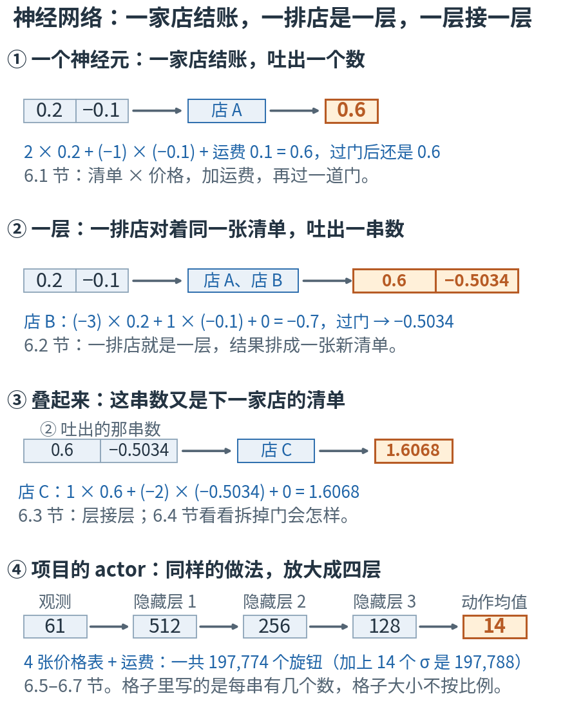
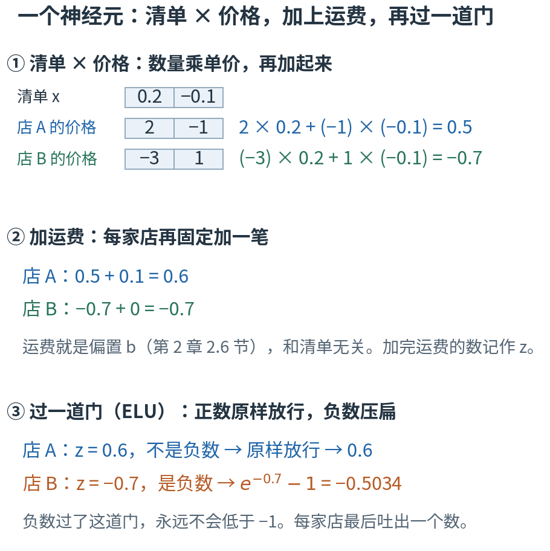
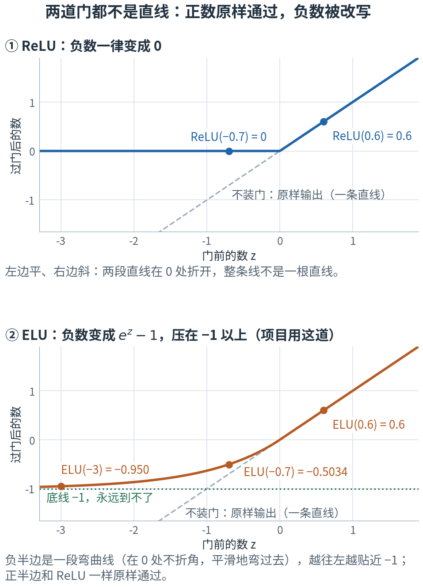
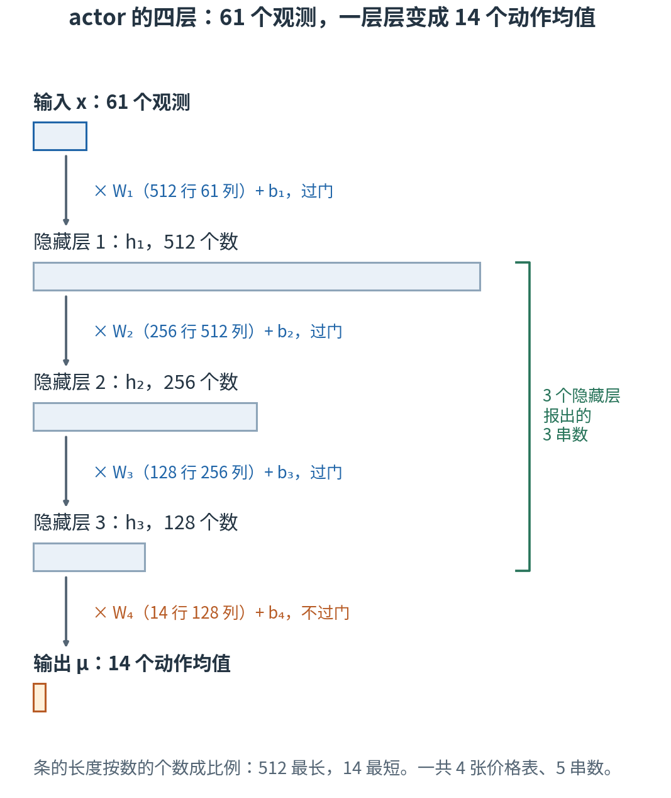
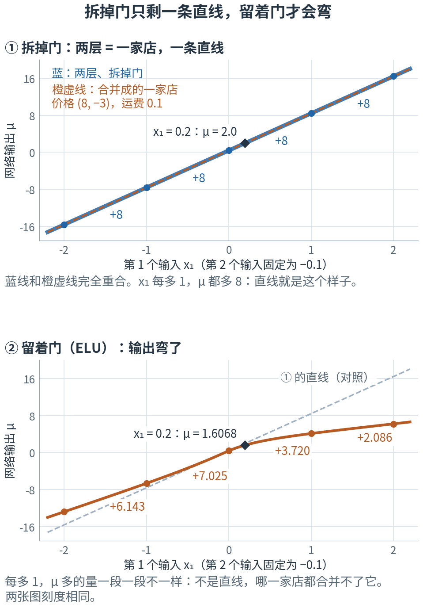

# 第 6 章 · 神经网络：一家店结账，一排店一层，一层接一层

> **上一章我们有了什么**：第 5 章（什么是学习）把"学习"拆成了四个零件：数据、模型、损失、优化。
> 其中"模型"是一台带旋钮的函数机器，例子里只有 w、b 两个旋钮。
>
> **这一章要补什么**：把"模型"换成项目里真正在用的那一台——策略网络 actor，197,788 个旋钮。
> 它一点也不神秘：**就是第 2 章的"价格表算总价"做 4 次，中间夹 3 次一道叫 ELU 的"门"。**
> 这一章先用一台 2 个输入、9 个旋钮的迷你网络把每一步手算一遍，再放大到项目的尺寸，数清 197,788 是怎么来的；
> 最后用 numpy 手写这 4 次运算，和 rsl_rl 建出来的真实网络对上（14 个输出相差不到 0.00001）。
>
> **本章新词**：神经元、激活函数、层、隐藏层、多层感知机、前向传播、actor、critic。
> **需要的前提**：第 2 章的点积（2.2 节）、矩阵乘向量（2.5 节）、一层网络 $W\mathbf{x}+\mathbf{b}$（2.6 节）、数据的轴（2.7 节）；
> 第 1 章的斜率（1.3 节）和指数函数 $e^x$（1.8 节）；第 4 章 4.7 节的"每个关节一口钟"（均值 μ、标准差 σ）。
> **不要求**会求导：这一章只"往前算"，导数是第 7 章（反向传播）的事。标"进阶"的折叠块可以第二遍再读。

---

## 6.0 先看地图：一家店结账，一排店一层，一层接一层

**一个神经元 = 拿价格表和清单算总价、加运费、再过一道"门"；一排神经元对着同一张清单同时结账，叫一层；
上一层报出的一串数当作下一层的清单，一层接一层，就是神经网络。从输入一路算到输出，叫前向传播。**

还是第 2 章那几家店。这次你拿着一张购物清单，走进一条商业街：

- 第一排有好几家店，**每家都看同一张清单**，各按各的价格表算总价，加上自家的运费，
  再按一条店规处理一下结果（比如"算出负数就记 0"）。这条店规就是"门"。
- 第一排每家店报出一个数。这些数排成**一张新的清单**，交给第二排的店；第二排照做，再交给第三排……
- 最后一排报出来的数，就是整条街的答案。

项目的策略网络就是这样一条街：第一排 512 家店，看的清单是机器人的 61 个观测；
最后一排 14 家店，报出 14 个关节的动作均值（第 4 章 4.7 节的 μ）。



**读图顺序：** 从 ① 到 ④ 竖着读。① 一家店结一次账；② 两家店并排，对着同一张清单；③ 这一排报出的数交给下一家店；
④ 同样的做法放大到项目的尺寸。图里的数现在不用算，6.1–6.3 节会一个一个手算出来；这里只要看清"一家 → 一排 → 一排接一排"这个次序。

| 概念 | 它在回答什么问题 | 商业街里对应什么 | 在哪一节 |
|---|---|---|---|
| 神经元 | 一个数是怎么算出来的？ | 一家店结一次账 | 6.1 |
| 激活函数 | 算出总价以后，还要做什么？ | 店规，也就是"门" | 6.1 |
| 层 | 一次算出一串数，怎么组织？ | 一排店，对着同一张清单 | 6.2 |
| 隐藏层 | 中间那几排叫什么？ | 夹在清单和答案之间的几排店 | 6.3 |
| 多层感知机 | 整台网络长什么样？ | 一排接一排的整条街 | 6.3 |
| 前向传播 | 从输入怎样一路算到输出？ | 从街头走到街尾，一排一排结账 | 6.6 |
| actor / critic | 项目里的两张网络各干什么？ | 两条结构一样的街：一条决定动作，一条给处境打分 | 6.7 |

表里的名字先不背，英文到了各节再给。另外两节没有新词：6.4 节回答"为什么非要那道门"，6.5 节把 197,788 个旋钮一个不落地数出来。
本章最容易混的四处，先贴上标签：

- **神经元 和 层**：一个神经元报出**一个数**；一层是一排神经元，报出**一串数**。项目第一层有 512 个神经元，不是 512 层（6.2 节）。
  整台 actor 是 4 层，其中 3 层叫隐藏层；图上却能数出 5 串数，多出的那一串是输入（6.3 节）。
- **隐藏层里的数 和 传感器读数**：第一层报出的 512 个数，没有一个是"角速度"或"关节角"，它们是网络自己拼出来的中间结果。
  有 512 个隐藏的数，不等于机器人有 512 个传感器（6.3 节）。
- **4096 行数据 和 4096 份旋钮**：训练时 4096 只仿真机器人的观测排成一张 4096 行的表一起算，
  但它们**共用同一套**旋钮（6.6 节）。
- **actor 和 critic**：项目里有两张结构几乎一样的网络。上真机的只有 actor；critic 只在训练时帮忙打分（6.7 节）。

现在觉得这些区别有点抽象很正常，读到对应小节就清楚了。

第一次读，只要按顺序看正文、图和手算。标着"进阶"的折叠内容可以先跳过；代码是复核工具，不是阅读门槛。

## 6.1 一个神经元：清单 × 价格，加上运费，再过一道门

### 前两步是老内容：总价 + 运费

先回忆第 2 章的一家店。它有一张价格表；你的购物清单进来，每一项数量 × 单价，全部加起来，就是总价（第 2 章 2.2 节的点积）；
再加一笔固定的运费（第 2 章 2.6 节的偏置 b）。

这一章用一张只有两项的清单：$\mathbf{x} = (0.2, -0.1)$。这是为了好算编的教学数，不冒充真实的机器人观测。
两家店各有自己的价格表和运费：

- 店 A：价格 (2, −1)，运费 0.1。总价 $2 × 0.2 + (-1) × (-0.1) = 0.4 + 0.1 = 0.5$，加运费 → **0.6**。
- 店 B：价格 (−3, 1)，运费 0。总价 $(-3) × 0.2 + 1 × (-0.1) = -0.6 - 0.1 = -0.7$，加运费 0 → **−0.7**。

加完运费的这个数，记作 z。到这里全是第 2 章的老内容。

### 新东西只有一步：z 还要过一道"门"

门按一条固定的规则改写 z。最简单的一道门，规则是"负数一律记 0，正数原样放行"。像店里的规定：算出来是负数（该倒找你钱）的，一律不找，记 0。

- 店 A：z = 0.6，不是负数 → 原样 → **0.6**。
- 店 B：z = −0.7，是负数 → 记 **0**。

这道门叫 ReLU。项目用的是另一道门，规则是"正数原样放行；负数不砍成 0，而是换成 $e^z - 1$"。
$e^z$ 是第 1 章 1.8 节的指数函数，z 是负数时它落在 0 和 1 之间，所以 $e^z - 1$ 落在 −1 和 0 之间：
负数被"压扁"了，但还留着一点"负了多少"的信息。

- 店 A：z = 0.6 → 原样 → **0.6**。
- 店 B：z = −0.7 → $e^{-0.7} - 1 ≈ 0.4966 - 1 = -0.5034$。浏览器控制台里输入 `Math.exp(-0.7) - 1`，得到 −0.5034146962…。

这道门叫 ELU。

两道门都能用；项目在自己的配置里明确写了 ELU（章末 📍 能看到这一行，也正好是 rsl_rl 的默认值）。差别全在负数这一侧：ReLU 把 −0.1 和 −5
压成同一个 0，过完门再也看不出"原来负了多少"；ELU 把它们分别压成 −0.0952 和 −0.9933
（控制台 `Math.exp(-0.1) - 1`、`Math.exp(-5) - 1`），大小关系还留着。哪道门更好没有定论，本章按项目的配置走。



**这样读图：** 从 ① 到 ③ 竖着读，左边是店，右边是手算。① 是第 2 章的点积：清单和价格表对应项相乘，再加起来；
② 加上各店的运费，得到 z；③ 过门：店 A 的 0.6 原样通过，店 B 的 −0.7 被压成 −0.5034（橙色）。三步走完，每家店报出**一个数**。

### 现在给名字：神经元和激活函数

清单 × 价格 + 运费，再过一道门——做这件事的单位叫**神经元**（neuron），那道门叫**激活函数**（activation function）。
叫"神经元"是历史原因：早年研究者用它模仿脑细胞"输入够强才放电"。你不需要在意这个比喻，它就是下面这一行：

$$h = \text{ELU}(\mathbf{w}\cdot\mathbf{x} + b)$$

第 2 章 2.2 节说过：总价高，意味着"这张清单长得像这家店在找的东西"。门接着做决定：不像的（总价是负数），就压下去。

两道门写全了，都是"分情况"的规则：

$$\text{ReLU}(z) = \begin{cases} z, & z \ge 0 \\ 0, & z < 0 \end{cases} \qquad\qquad \text{ELU}(z) = \begin{cases} z, & z \ge 0 \\ e^z - 1, & z < 0 \end{cases}$$

| 符号 | 怎么读 | 就是 |
|---|---|---|
| $\mathbf{x}$ | "x" | 输入清单。这里是 (0.2, −0.1)；项目里是 61 个观测 |
| $\mathbf{w}$ | "w" | 这个神经元的价格表（第 2 章叫权重），和 $\mathbf{x}$ 一样长 |
| $b$ | "b" | 运费，也就是偏置：一个数 |
| $z = \mathbf{w}\cdot\mathbf{x} + b$ | "z" | 过门之前的数 |
| $\text{ReLU}(z)$、$\text{ELU}(z)$ | 按字母读 | 两道门。大括号表示"分情况"：z 不是负数走上面一行，是负数走下面一行；不是两行相加 |
| $h$ | "h" | 过门之后，神经元报出的那一个数。和第 1 章"缩 h"里那个小步子 h 无关，只是碰巧同一个字母（这里的 h 取自 hidden，"藏着的"，6.3 节会用到这个词） |

前端写法就是两个箭头函数：

```js
const relu = z => Math.max(0, z);
const elu  = z => (z >= 0 ? z : Math.exp(z) - 1);
elu(0.6);    // 店 A：0.6
elu(-0.7);   // 店 B：-0.5034146962085905
```

实验第 1 节把两家店和两道门都算了一遍，还打印了一张表，门前的数 z 取 8 个值：

```
门前的数 z  ReLU(z)  ELU(z)
----------  -------  ------
    -3.000    0.000  -0.950
    -2.000    0.000  -0.865
    -1.000    0.000  -0.632
    -0.500    0.000  -0.393
     0.000    0.000   0.000
     0.500    0.500   0.500
     1.000    1.000   1.000
     3.000    3.000   3.000
```

正数那几行三列都一样：两道门对正数什么也不做。负数那几行，ReLU 一律是 0；ELU 是负的，但从不低于 −1
（z = −3 时是 −0.950；再往左，z = −10 时也只有 −0.99995，控制台 `Math.exp(-10) - 1` 可以核对）。

### 两道门都不是直线：先说清什么叫"线性"

两道门还有一个共同点，也是这一章最要紧的一点：**它们的图像不是一条直线。** 先说什么叫"直线"。
第 1 章 1.3 节量斜率，问的就是"输入每多 1，输出多多少"，还说过：直线的斜率处处一样。
假如不装门，z 进来原样出去，那么 z 每多 1，出来的数也多 1，处处一样。
输入每多 1，输出总是多同样多，这样的机器图像是一条直线，叫**线性**的
（第 3 章 3.5 节的直线 $y = wx + b$ 就是：x 每多 1，y 总是多 w）。不是这样的，叫**非线性**的。拿上表核对：

| 从 z 到 z + 1 | 不装门，多了 | ReLU，多了 | ELU，多了 |
|---|---|---|---|
| −2 → −1 | 1 | 0 | −0.632 − (−0.865) = 0.233 |
| −1 → 0 | 1 | 0 | 0 − (−0.632) = 0.632 |
| 0 → 1 | 1 | 1 | 1 |

ReLU 在 0 的左边一点不涨，右边每次涨 1；ELU 越往左涨得越少。各段不一样，所以两道门都是非线性的。



**这样读图：** 灰色虚线是"不装门"：一条直线。① 蓝线是 ReLU：0 的左边贴着横轴走平，右边和虚线重合；
两段直线在 0 处折开，整条线就不再是一根直线。② 橙线是 ELU：右半边同样和虚线重合；左半边是一段弯曲线（在 0 处不折角，是平滑地弯过去的），
越往左越贴近绿色的底线 −1，但碰不到。图上标的 0.6、−0.7、−3 几个点，就是上面手算和表里的数。

门"弯一下"有什么用，要等 6.4 节把两层叠起来才看得出。先剧透结论：没有门，叠多少层都白叠。

> **停一下，自测**：z = −1.5 过 ReLU、过 ELU 各得多少？z = 1.5 呢？（控制台里 `Math.exp(-1.5)` 约等于 0.2231。）
> <details><summary>答案</summary>
>
> z = −1.5 是负数：ReLU 记 0；ELU 得 $e^{-1.5} - 1 ≈ 0.2231 - 1 = -0.7769$。z = 1.5 不是负数：两道门都原样放行，得 1.5。
>
> </details>

## 6.2 层：一排店对着同一张清单，同时结账

店 A 和店 B 看的是**同一张**清单 (0.2, −0.1)。让它们并排站好、同时结账，报出来的两个数就排成了一张新清单：

$$(0.6,\ -0.5034)$$

一排神经元对着同一份输入同时算，叫一**层**（layer）。这一层报出的新清单，记作 $\mathbf{h}_1$（"第 1 层报出来的"）。
6.1 节的 h 是一家店报出的一个数；$\mathbf{h}_1$ 是一排店报出的一串数，所以像 $\mathbf{x}$ 一样写成粗体，下标 1 表示"第 1 层"。

两家店的价格表摞起来，就是第 2 章 2.5 节的矩阵：每一行是一家店的价格表。运费也摞成一列：

$$W_1 = \begin{pmatrix} 2 & -1 \\ -3 & 1 \end{pmatrix}, \qquad \mathbf{b}_1 = \begin{pmatrix} 0.1 \\ 0 \end{pmatrix}$$

这张表是 2 行 2 列，两个 2 是两件事：**行数 = 这一排有几家店，列数 = 清单有几项**。迷你网络里它们碰巧一样大，
所以别拿这里的 2 × 2 当规律——项目第一层的价格表是 512 行（512 家店）、61 列（61 项观测），行列一点也不一样长。

$W_1\mathbf{x}$ 按第 2 章 2.5 节的做法，每一行和清单做一次点积，再加上这一行的运费：第一行得 0.6，第二行得 −0.7——
正是刚才两家店各算的那两次。然后门**逐项**过，对 0.6 过一次、对 −0.7 过一次：

$$\mathbf{h}_1 = \text{ELU}(W_1\mathbf{x} + \mathbf{b}_1) = (\text{ELU}(0.6),\ \text{ELU}(-0.7)) = (0.6,\ -0.5034)$$

用前端的话说，就是第 2 章 2.5 节那个"`map` 套 `reduce`"，每一项加上运费、过一道门：

```js
const layer = (W, b, x) => W.map((row, i) => elu(row.reduce((s, wij, j) => s + wij * x[j], 0) + b[i]));
layer([[2, -1], [-3, 1]], [0.1, 0], [0.2, -0.1]);   // [0.6, -0.5034…]
```

一排有几家店，叫这一层的**宽度**。项目的第一层就是它的放大版：61 项的清单，512 家店，
价格表 512 行 61 列，512 笔运费——第 2 章 2.6 节数过，31,744 个旋钮。ELU 对 512 个数逐个过门，报出一张 512 项的清单 $\mathbf{h}_1$。
所以说"第一层宽 512""第一层有 512 个神经元"，说的是同一件事；它仍然只是**一层**。

实验第 2 节用矩阵写法、也用 torch 的 `nn.Linear(2, 2)`（torch 里"一张价格表加运费"的现成零件，📍 里还会见到）各算了一遍，都得 (0.6, −0.7)。

> **停一下，自测**：如果店 B 的运费从 0 改成 1，$\mathbf{h}_1$ 变成多少？
> <details><summary>答案</summary>
>
> 店 A 不受影响，还是 0.6。店 B 的 z 变成 −0.7 + 1 = 0.3，不是负数，原样通过。所以 $\mathbf{h}_1 = (0.6, 0.3)$。
> 同一排里，每家店只管自己的价格表和运费。
>
> </details>

## 6.3 把层叠起来：上一排报出的清单，是下一排的购物清单

### 第二排的店 C：最后一排不过门

第一层报出的 $\mathbf{h}_1 = (0.6, -0.5034)$ 本身就是一张清单。把它交给**下一排**的店，下一排照样结账。
迷你网络的第二排只有一家店 C：价格 (1, −2)，运费 0：

$$\mu ≈ 1 × 0.6 + (-2) × (-0.5034) + 0 = 0.6 + 1.0068 = 1.6068$$

不经四舍五入的精确值，控制台一行就能算：`0.6 - 2 * (Math.exp(-0.7) - 1)`，得 1.606829…。

注意店 C 结完账**没有过门**：最后一排报出的数直接就是答案。答案记作 μ，因为在项目里，最后一排报的正是第 4 章 4.7 节那 14 口钟的均值 μ。

最后一排为什么不装门？ELU 的输出永远大于 −1。要是最后也过一道 ELU，某个关节想要均值 −1.5，就怎么也给不出来：
门前算出 −1.5，过门只剩 $e^{-1.5} - 1 ≈ -0.7769$；门前的数再往负里推，也只是越来越贴近 −1（6.1 节的表：z = −3 时是 −0.950），
永远到不了 −1.5。最后一排不装门，是为了不额外限制输出的范围。
（这不是说动作可以不管电机的物理限制；动作怎样变成真实的关节转动，第 17 章（动作执行器）讲整条链。）

### 整台网络：迷你版两行，项目版四行

整台迷你网络写成两行：

$$\mathbf{h}_1 = \text{ELU}(W_1\mathbf{x} + \mathbf{b}_1), \qquad \mu = W_2\mathbf{h}_1 + b_2$$

其中 $W_2 = (1, -2)$ 是一行两列的价格表（第二排只有一家店），$b_2 = 0$。2 个输入 → 2 个数 → 1 个数。

项目的 actor 照这个样子叠了四张价格表：

$$
\begin{aligned}
\mathbf{h}_1 &= \text{ELU}(W_1\mathbf{x} + \mathbf{b}_1) && (61 \to 512)\\
\mathbf{h}_2 &= \text{ELU}(W_2\mathbf{h}_1 + \mathbf{b}_2) && (512 \to 256)\\
\mathbf{h}_3 &= \text{ELU}(W_3\mathbf{h}_2 + \mathbf{b}_3) && (256 \to 128)\\
\boldsymbol{\mu} &= W_4\mathbf{h}_3 + \mathbf{b}_4 && (128 \to 14,\ \text{不过门})
\end{aligned}
$$

| 符号 | 怎么读 | 就是 |
|---|---|---|
| $W_k$ | "W k" | 第 k 张价格表（第 k 层的权重），一行是一家店 |
| $\mathbf{b}_k$ | "b k" | 第 k 层的运费，每家店一笔 |
| $\mathbf{h}_k$ | "h k" | 第 k 层过门之后报出的清单 |
| $\boldsymbol{\mu}$ | "缪" | 最后一层报出的 14 个数：14 个关节的动作均值（第 4 章 4.7 节） |
| $61 \to 512$ | "61 到 512" | 这一层吃进 61 个数，报出 512 个数 |

两头的 61 和 14 是定死的：观测有 61 项、关节有 14 个。中间的 512、256、128 和"四层"这个层数则是**人挑的**，
不是训练出来的——第 5 章（什么是学习）把这类"人定的数"和"学出来的数"分成了两类，这三个宽度属于前者，
项目的这一组是试出来的（章末 📍 的那段配置里就写着这三个数）。这一章不讨论怎么挑，只按项目挑好的这一组往下算。

> ⚠️ 下标 k 只表示"第 k 张"。迷你网络和项目网络各有各的 $W_1$、$W_2$：迷你网络的 $W_2$ 是一行两列的 (1, −2)，
> 项目的 $W_2$ 是 256 行 512 列。迷你网络的 μ 是一个数，项目的 $\boldsymbol{\mu}$ 是 14 个数的清单。

### 5 串数，4 排店：隐藏层和多层感知机



**这样读图：** 从上往下读。每一根横条是一串数，**条的长度按数的个数成比例画**：输入 61 个，第一层 512 个（最长），
然后 256、128，最后只剩 14 个（最短的那一小格）。两根条之间的箭头就是一次"× 价格表 + 运费，过门"；
最下面那一步是橙色的"不过门"。右边的绿括号圈出 3 个隐藏层报出的三串数。

中间这三串数，既不是你喂进去的输入，也不是最后交出去的答案，从网络外面看不到。报出它们的那三排店（512、256、128 家）
就叫**隐藏层**（hidden layer）；平时说"隐藏层"，也常直接指它们报出的这三串数 $\mathbf{h}_1$、$\mathbf{h}_2$、$\mathbf{h}_3$。
像这样"一层接一层，每一层的每家店都看上一层报出的全部数"的网络，叫**多层感知机**（MLP，multi-layer perceptron）。
"感知机"是早年给单个神经元起的名字，如今只剩这个历史叫法。项目的 actor 就是一台多层感知机。

数层数时容易差一：图里有 **5 串数，却只有 4 排店**（4 张价格表）——输入那一串是你交进去的清单，不是哪一排店报的。
就像 5 根柱子之间只有 4 段栏杆。说"四层网络"，数的是这 4 排店；其中前 3 排报的数藏在中间，所以叫"三个隐藏层"；
最后一排报的就是答案。

> ⚠️ **隐藏层里的数不是传感器读数。** 迷你网络里，$\mathbf{h}_1$ 的第一个数 0.6 同时掺进了两个输入（2 × 0.2 和 (−1) × (−0.1)），第二个数也一样。
> 所以即使两个输入分别是"角速度"和"关节角"，$\mathbf{h}_1$ 里的数也不再单独代表其中哪一个，通常也不对应任何有名字的物理量，
> 它们是网络在训练中自己拼出来的中间结果。项目第一层有 512 个隐藏的数，不等于机器人有 512 个传感器；
> 机器人交给网络的只有那 61 个观测（第 15 章：61 维观测）。

> **停一下，自测**：把店 C 的价格换成 (1, 2)（运费还是 0），μ 是多少？
> <details><summary>答案</summary>
>
> $\mu = 1 × 0.6 + 2 × (-0.5034) = 0.6 - 1.0068 = -0.4068$。$\mathbf{h}_1$ 没变，变的只是第二排怎么"定价"。
>
> </details>

## 6.4 为什么要那道门：拆掉门，两层叠成一层

### 拆掉门：整条街合并成一家店

门看起来只是个小动作。拆掉它会怎样？用迷你网络试：店 A、店 B 结完账**不过门**，直接把 (0.6, −0.7) 交给店 C：

$$\mu = 1 × 0.6 + (-2) × (-0.7) = 0.6 + 1.4 = 2.0$$

换一种算法：先不看这张清单，只问一句——清单上某一项多买 1 份，店 C 最后报的数多多少？（就是 6.1 节"输入每多 1，输出多多少"的问法。）
先看第一排：店 A 的价格第 1 项是 2，所以清单第 1 项每多买 1 份，店 A 的账就多 2；店 B 的第 1 项是 −3，它的账就多 −3。
再看第二排：店 C 的价格是 (1, −2)，意思是"店 A 的账算 1 份，店 B 的账算 −2 份"。两排合起来：

- 第 1 项多买 1 份：店 A 的账多 2，店 B 的账多 −3（也就是少 3）。传到店 C：$1 × 2 + (-2) × (-3) = 2 + 6 = 8$。
- 第 2 项多买 1 份：店 A 的账多 −1，店 B 的账多 1。传到店 C：$1 × (-1) + (-2) × 1 = -1 - 2 = -3$。
- 运费：店 A 的 0.1 算 1 份，店 B 的 0 算 −2 份，店 C 自己再加 0：$1 × 0.1 + (-2) × 0 + 0 = 0.1$。

也就是说，**整条街等于一家店**：价格 (8, −3)，运费 0.1。让这家店直接结账：

$$8 × 0.2 + (-3) × (-0.1) + 0.1 = 1.6 + 0.3 + 0.1 = 2.0$$

（式子里的 −0.1 是清单的第 2 项，最后那个 0.1 是运费，数字碰巧相同。）一模一样。**两层不夹门，就是一层**，店 C 那一排白排了。

就像把一张照片先放大 2 倍、再放大 3 倍，等于一次放大 6 倍：两次操作合并成了一次。
叠 10 层、100 层也一样，最后都能合并成一层（迷你网络只报一个数，合并成的就是一家店）。
而一家店不过门，只能画出一条直线（这家店的第 1 个价格是 8：第 1 个输入每多 1，输出总是多 8）。

> ⚠️ 上面那套"多买 1 份"的算账法，**只有拆掉门时才成立**。门会看 z 是正是负、区别对待：同样多买 1 份，
> 门前的 z 每次都多同样多，门后多出来的量却一段一段不一样（6.1 节最后那张表量过：ELU 从 −2 到 −1 只多 0.233，从 −1 到 0 多 0.632）。
> 所以夹着门的时候，不能把各层的价格"一路乘过去"合并成一张。

### 留着门：线弯了，哪家店都合并不了

留着门呢？6.3 节算过，夹着 ELU 的 μ 是 1.6068，不是 2.0：(8, −3) 那家店已经不等于这条街了。
换一家店行不行？只看一张清单说明不了问题，得看一整条线。下面把第 2 个输入固定在 −0.1，只拧第 1 个输入 x₁
（这里的下标又回到第 2 章 2.1 节的用法：x₁ 是清单 $\mathbf{x}$ 的第 1 项，不是"第 1 层"），看输出怎么变：



**这样读图：** 两张图横轴都是 x₁，纵轴都是网络的输出 μ，刻度相同。① 拆掉门：蓝色粗线是两层网络，橙色虚线是合并成的那一家店，
两条线**完全重合**，是一条直线：x₁ 每多 1，μ 都多 8，正是合并店的第 1 个价格。② 留着门：橙线弯了，同样每多 1，μ 多的是 6.143、7.025、3.720、2.086，
一段一段不一样；灰色虚线是 ① 的那条直线，放在这里作对照。黑色菱形是正文手算的那一点：x₁ = 0.2，① 里是 2.0，② 里是 1.6068。

实验第 4 节打印了图上的五个点（x₁ = 0.2 那一点不在表里，上面已经手算过）：

```
x₁    拆掉门    夹着门
--  --------  --------
-2  -15.6000  -12.7776
-1   -7.6000   -6.6347
 0    0.4000    0.3903
 1    8.4000    4.1099
 2   16.4000    6.1955
```

用表里的数相减就能核对：拆掉门那一列每行多 8；夹着门那一列多 −6.6347 − (−12.7776) = 6.143、0.3903 − (−6.6347) = 7.025……

一条弯的线，任何一家店都合并不了，因为一家店只会画直线。门让每多叠一层都真的添了本事：
网络靠这些"弯"拼出"看到这 61 个数，该给出哪 14 个数"这样复杂的关系。但要说准：门给的是**能**表达弯曲关系的本事，
不保证训练一定能找到合适的旋钮，也不是说一台有限大的网络什么关系都能画得分毫不差。

<details>
<summary>进阶：一般的情形，为什么运费也救不了（现在可跳过）</summary>

把两层不夹门写全：

$$\mathbf{y} = W_2(W_1\mathbf{x} + \mathbf{b}_1) + \mathbf{b}_2 = (W_2W_1)\mathbf{x} + (W_2\mathbf{b}_1 + \mathbf{b}_2)$$

第二个等号只是把括号乘开：$W_2$ 分别乘括号里的两项。右边的 $W_2W_1$ 是一张新的价格表，$W_2\mathbf{b}_1 + \mathbf{b}_2$ 是一份新的运费：
又是"价格表 × 清单 + 运费"，还是一层。迷你网络里 $W_2W_1 = (1, -2)\begin{pmatrix}2&-1\\-3&1\end{pmatrix} = (8, -3)$，
$W_2\mathbf{b}_1 + b_2 = 0.1$，正是上面那家店。

6.1 节说的"线性"（输入每多 1，输出总多同样多），严格的名字叫**仿射**；数学课上说"线性"，还要求运费为 0。
机器学习里通常不分这么细，把带运费的这一步也叫线性层（torch 里就叫 `Linear`）。仿射叠仿射还是仿射，所以加了运费也救不了。
实验第 4 节还拿两张随机的表（4 行 3 列、2 行 4 列）试过：先后乘两次，和先合并成一张 2 行 3 列的表再乘一次，结果相同；夹上 ELU 就不再相同。

</details>

> **停一下，自测**：拆掉门以后，换一张清单 x = (1, 1)。先按两排店一排一排算，再用合并成的那家店（价格 (8, −3)，运费 0.1）算，两边一样吗？
> <details><summary>答案</summary>
>
> 一排一排算：店 A 是 2 − 1 + 0.1 = 1.1，店 B 是 −3 + 1 + 0 = −2；店 C 是 1 × 1.1 + (−2) × (−2) = 1.1 + 4 = 5.1。
> 合并店：8 × 1 + (−3) × 1 + 0.1 = 5.1。一样。不管清单是什么，两层不夹门都等于这一家店。
>
> </details>

## 6.5 数一数旋钮：197,774 个，再加 14 个 σ

每张价格表的每一格是一个旋钮，每笔运费也是一个旋钮。门没有旋钮：ELU 的规则是写死的，训练不改它。

先数迷你版：第一层价格表 2 行 2 列 = 4 格，加 2 笔运费，6 个；第二层 1 行 2 列 = 2 格，加 1 笔运费，3 个。整台迷你网络 9 个旋钮。

项目的 actor 同样数法。第一层第 2 章 2.6 节已经数过：512 × 61 = 31,232 格，加 512 笔运费，31,744 个。四层全数出来：

| 层 | 价格表的格子 | 运费 | 旋钮数 |
|---|---|---|---|
| 61 → 512 | 512 × 61 = 31,232 | 512 | 31,744 |
| 512 → 256 | 256 × 512 = 131,072 | 256 | 131,328 |
| 256 → 128 | 128 × 256 = 32,768 | 128 | 32,896 |
| 128 → 14 | 14 × 128 = 1,792 | 14 | 1,806 |
| **合计** | | | **197,774** |

一个心算的窍门：运费就像价格表**多出来的一列**（每家店一格），所以每层的旋钮数 = 店数 × (输入个数 + 1)。
第一层 512 × 62 = 31,744，第二层 256 × 513 = 131,328，第三层 128 × 257 = 32,896，最后一层 14 × 129 = 1,806，和上表对上。

再看中间那张 256 × 512 的表：一张就占了 131,328 ÷ 197,774 ≈ 0.664，差不多三分之二。
一层的旋钮数主要看相邻两串数的长度相乘，两头的 61 和 14 都小，所以大头在中间。

这 197,774 个旋钮，决定了网络怎样从 61 个观测算出 14 个均值 μ。第 4 章 4.7 节还说过：每个关节另有一个标准差 σ，
它**不看观测**，是 14 个单独的旋钮，和网络的权重一起训练。加上它们：

$$197{,}774 + 14 = 197{,}788$$

这就是第 3 章开篇那个数的来历。用哪个数，要说清是哪个口径：

- **197,774**：四张价格表加运费，也就是从观测算出 μ 的那台多层感知机。导出到真机上跑的就是它
  （前面还接着第 8 章（输入归一化）的那一步，那一步没有要训练的旋钮）。
- **197,788**：再算上 14 个 σ，是 actor 训练时要拧的全部旋钮。第 3 章 3.4 节的 θ，指的就是这 197,788 个数排成的一长串。

实验第 5 节照项目的配置，用 rsl_rl 真的建出这个 actor 来数：多层感知机里 197,774 个；
它之外只多出一项，叫 `distribution.std_param`，正好 14 个，初值都是 1.0；可训练的合计 197,788。

> **停一下，自测**：（1）把第一层改成 61 → 256（后面的 256 → 128 → 14 不变），旋钮少多少？（2）如果观测从 61 个变成 62 个，其他都不变，旋钮多多少？
> <details><summary>答案</summary>
>
> （1）第一层变成 256 × 62 = 15,872；第二层变成 256 → 256，256 × 257 = 65,792；后两层不变。
> 一共省下 (31,744 − 15,872) + (131,328 − 65,792) = 15,872 + 65,536 = 81,408 个。
> （2）只有第一层变：每家店的价格表多一格，512 家店多 512 个；运费个数不变，后面各层也不变。
> 但真要这么改，牵涉的不只是旋钮：真机和训练必须用同一份 61 维的观测约定（第 15 章：61 维观测），不能因为"只多 512 个旋钮"就随手改。
>
> </details>

## 6.6 它就是一个函数：前向传播，手写四行

6.3 节的四行公式，写成 numpy 就是四行代码：

```python
h = elu(W1 @ obs + b1)    # 61 → 512，过门
h = elu(W2 @ h + b2)      # 512 → 256，过门
h = elu(W3 @ h + b3)      # 256 → 128，过门
out = W4 @ h + b4         # 128 → 14，不过门
```

`@` 是 numpy 的矩阵乘向量，第 2 章 2.6 节手写 `W @ x + b` 时用过。实验第 6 节用 rsl_rl 按项目的尺寸建了一台网络，把里面的 W、b 拷出来，
用这四行重算同一个随机的 61 维观测（实验里写成了一个两行的循环，层数改了也能用，做的是同一件事）：

```
torch 前 5 个输出: [ 0.0828 -0.2874  0.1017  0.0403 -0.0097]
numpy 前 5 个输出: [ 0.0828 -0.2874  0.1017  0.0403 -0.0097]
```

14 个输出逐个相差不到 0.00001。这台网络的旋钮还没训练过，是随机的，所以这些数本身没有意义；要看的是两行一样。
**actor 从观测算出 μ 的那台多层感知机，就是这四行。** 像这样从输入出发、一层一层往后算到输出，叫**前向传播**（forward pass）。

第 1 章 1.7 节说，神经网络就是十来台机器串成的流水线。现在数得清了：4 张价格表、3 道门，一共 7 台机器首尾相接，
前一台吐出的就是后一台吃进的；要是把每张价格表再拆成"乘价格表""加运费"两台，就是 11 台——"十来台"说的就是它。

这一路上只有乘、加和过门：**没有学习，也没有随机**。旋钮固定时，同一个观测喂两次，输出逐位相同；换一个观测，输出就换一个
（实验都核对过）。用第 1 章的话说，actor 就是一台机器：吃进 61 个数，吐出 14 个数（迷你网络则是吃进 2 个数、吐出 1 个数）。
数学里把这句话缩写成：

$$\mathbb{R}^{61} \to \mathbb{R}^{14}$$

| 符号 | 怎么读 | 就是 |
|---|---|---|
| $\mathbb{R}$ | "实数" | 数轴上所有的数：正的、负的、带小数的 |
| $\mathbb{R}^{61}$ | "R 61" | 61 个实数排成的一张清单 |
| $\mathbb{R}^{61} \to \mathbb{R}^{14}$ | "从 R 61 到 R 14" | 吃进 61 个数、吐出 14 个数的机器 |
| $\mathbb{R}^{2} \to \mathbb{R}$ | "从 R 2 到 R" | 迷你网络：吃进 2 个数、吐出 1 个数（只吐 1 个数时，右上角的 1 省略不写） |

它吐出什么，完全由那 197,774 个旋钮决定（σ 不参与这一步）。训练时还要做两件这里没做的事：
按第 4 章 4.7 节的办法，在 μ 附近抽一个带随机的动作去执行，攒下经验；再用第 7 章（反向传播）算出每个旋钮该往哪边拧，改掉它们。

用第 5 章那四个零件的话说：这一章只换了**模型**一个零件——从 2 个旋钮的直线换成 197,788 个旋钮的神经网络。
数据、损失、优化三个零件还是第 5 章那一套，连转圈的次序都没变；换了模型以后，"优化"那一步怎么对这么多旋钮做，才是第 7 章的事。

> ⚠️ **4096 行数据不是 4096 份旋钮。** 训练时 4096 只仿真机器人同时跑，它们的观测排成一张 4096 行、61 列的表
> （第 2 章 2.7 节的批量），一次送进网络，出来一张 4096 行、14 列的表。可是网络只有**一套**旋钮：每一行都用同一组 W、b 各算各的，谁也不影响谁。
> 迷你版：两只机器人，清单分别是 (0.2, −0.1) 和 (0, 0)，过同一台 9 个旋钮的迷你网络，得到 1.6068 和 0.1。
> 第二只的账很好算：清单全是 0，两家店只剩运费 (0.1, 0)，都不是负数，过门不变；店 C 算 1 × 0.1 + (−2) × 0 = 0.1。
> 所有机器人攒下的经验，最后改的都是**同一套**旋钮，所以 4096 只一起跑，练出来的是同一个策略。

> **停一下，自测**：给迷你批量加第三只机器人，清单是 (0, 0.1)。前两只的 μ 会变吗？第三只的 μ 是多少？
> <details><summary>答案</summary>
>
> 前两只不变：每一行各算各的。第三只：店 A 是 2 × 0 + (−1) × 0.1 + 0.1 = 0，店 B 是 (−3) × 0 + 1 × 0.1 + 0 = 0.1，
> 都不是负数，过门不变；店 C 是 1 × 0 + (−2) × 0.1 = −0.2。两个 z 都不是负数，所以这一只拆不拆门结果都一样：门只在有负数时才起作用。
>
> </details>

## 6.7 第二张网络 critic：同样的街，最后只报一个数

项目里其实有**两张**多层感知机。决定动作的这一张叫 **actor**（演员）：看 61 个观测，吐出 14 个动作均值，导出到真机上跑的就是它。
另一张叫 **critic**（评论家）：它不决定动作，只给"现在这个处境"打一个分，估计"从这里往后，大概还能拿到多少奖励"。
这个分怎么定义、为什么训练需要它，是第 10 章（价值函数）的事。

| | 输入 | 隐藏层 | 输出 | 干什么 |
|---|---|---|---|---|
| actor（演员） | 61 个观测 | 512、256、128 | 14 个动作均值 | 决定怎么动。导出到真机的就是它 |
| critic（评论家） | 76 个数：61 个观测之外，多 15 项只有仿真器才知道的信息 | 512、256、128 | 1 个数 | 给处境打分。只在训练时用 |

结构一模一样，只有两头不同：critic 的清单长一点（76 项），最后一排只有 1 家店。多出来的 15 项是什么，第 15 章（61 维观测）逐项讲。
现在只要记住：**critic 只在训练时用，上真机的只有 actor**，所以 critic 多看了什么，都不影响真机上能拿到什么。

critic 也有自己的一套旋钮，和 actor 的互不相干。训练存下来的检查点文件里，除了 actor 的 197,788 个，
还有 critic 的这些旋钮，以及优化器记的两本账（第 7 章：优化器）。

> **停一下，自测**：critic 输入 76 个数，隐藏层 512、256、128，输出 1 个数。它一共有多少个旋钮？（用 6.5 节的窍门：每层 = 店数 × (输入个数 + 1)。）
> <details><summary>答案</summary>
>
> 第一层 512 × 77 = 39,424；中间两层和 actor 一样，131,328 和 32,896；最后一层 1 × 129 = 129。
> 合计 39,424 + 131,328 + 32,896 + 129 = 203,777。critic 没有 σ：它不抽随机动作。
>
> </details>

## 📍 映射到项目

> 只需看一眼。语法看不懂没关系。

**这段配置做什么**：定下两张网络的形状：三个隐藏层的宽度、用哪道门、σ 的初值。它写在
`src/mjlab_microduck/tasks/microduck_velocity_env_cfg.py` 的 `MicroduckRlCfg` 里：

```python
actor=RslRlModelCfg(                         # 第一张网络 actor（6.7 节）
    hidden_dims=(512, 256, 128),             # 三个隐藏层各有几家店（6.3 节）
    activation="elu",                        # 门用 ELU（6.1 节）
    obs_normalization=True,                  # 观测先归一化，再进网络（第 8 章）
    distribution_cfg={                       # 网络算出 μ 以后，再配上"一口钟"（第 4 章 4.7 节）
        "class_name": "GaussianDistribution",   # 钟的种类：高斯分布
        "init_std": 1.0,                     # 14 个 σ 的初值都是 1.0
        "std_type": "scalar",                # σ 本身就是旋钮，每个关节一个（6.5 节那 14 个）
    },
),
critic=RslRlModelCfg(                        # 第二张网络 critic（6.7 节）
    hidden_dims=(512, 256, 128),             # 和 actor 一样的三个隐藏层
    activation="elu",                        # 也用 ELU
```

**这段代码做什么**：把"三个宽度 + 一道门"变成一台真的网络：先放第一张价格表和门，再用一个循环给相邻两串数之间各放一张表和门，
最后放一张不接门的表；前向传播时按顺序一块一块过。它在 `rsl_rl/modules/mlp.py` 的 `MLP` 类里
（`hidden_dims_processed` 就是 (512, 256, 128)，它只多处理了一种项目没用到的特殊写法）：

```python
last_activation: str | None = None,                 # 最后一张表后面接不接门：默认不接（6.3 节）
...
activation_mod = resolve_nn_activation(activation)   # 把 "elu" 这个名字换成一道真正的 ELU 门
...
layers.append(nn.Linear(input_dim, hidden_dims_processed[0]))   # 第 1 张价格表加运费：61 → 512
layers.append(activation_mod)                                   # 过门
for layer_index in range(len(hidden_dims_processed) - 1):       # 相邻两个隐藏层之间，各放一张
    layers.append(nn.Linear(hidden_dims_processed[layer_index], hidden_dims_processed[layer_index + 1]))  # 512 → 256、256 → 128
    layers.append(activation_mod)                               # 每张表后面都过门
...
if isinstance(output_dim, int):                                 # 输出个数写成一个整数时（项目写的是 14）
    layers.append(nn.Linear(hidden_dims_processed[-1], output_dim))  # 最后一张：128 → 14，后面没有门
...
for layer in self:                                              # 前向传播：按顺序一块一块过（6.6 节）
    x = layer(x)                                                # 上一块吐出的，就是下一块吃进的
```

实验第 6 节把建好的网络打印出来：

```
MLP(
  (0): Linear(in_features=61, out_features=512, bias=True)
  (1): ELU(alpha=1.0)
  (2): Linear(in_features=512, out_features=256, bias=True)
  (3): ELU(alpha=1.0)
  (4): Linear(in_features=256, out_features=128, bias=True)
  (5): ELU(alpha=1.0)
  (6): Linear(in_features=128, out_features=14, bias=True)
)
```

**怎么读这段输出**：一共 7 块，编号 0 到 6，前向传播时按编号依次过。
`Linear(in_features=61, out_features=512, bias=True)` 是一张价格表加运费：吃进（in）61 个数，报出（out）512 个数，`bias=True` 表示带运费。
`ELU(alpha=1.0)` 是门。4 张表、3 道门交替排开，最后一块是表，和 6.3 节的图一一对应。

> ⚠️ `ELU(alpha=1.0)` 里的 alpha **不是**第 3 章的学习率 α，只是碰巧用了同一个希腊字母。
> ELU 的负半边写全了是 α × ($e^z$ − 1)，α = 1 时就是本章的 $e^z - 1$，所以负数最低压到 −1。它是写死的常数，不是旋钮，训练不改它。

另外几处也对过源码：`rsl_rl/models/mlp_model.py` 的 `MLPModel` 用 `self.mlp = MLP(self._get_latent_dim(), mlp_output_dim, hidden_dims, activation)`
照上面的配置建网络；`rsl_rl/modules/distribution.py` 的 `GaussianDistribution` 用 `nn.Parameter(init_std * torch.ones(output_dim))` 建出那 14 个 σ；
`rsl_rl/utils/utils.py` 里，名字 `"elu"` 对应的就是 `torch.nn.ELU()`。

实验第 8 节会核对：上面引用的这些配置和源码行，在你机器上的源码里还原样存在。

## 🧪 动手实验

```bash
uv run python docs/learn-zh/labs/ch06_mlp.py
```

1. 一个神经元：店 A、店 B 手算到 z = 0.6、−0.7；两道门各过一遍（0.6、0、−0.5034）；8 个 z 的门表；两道门对 −0.1 和 −5 的不同处理；"每多 1，输出多多少"的核对；自测 z = ±1.5。
   画 `ch06_neuron.png`（一家店结账）和 `ch06_gates.png`（两道门的图像）。
2. 层：矩阵写法 $W_1\mathbf{x} + \mathbf{b}_1$ 和 torch 的 `nn.Linear(2, 2)` 都得 (0.6, −0.7)，逐项过门得 (0.6, −0.5034)；自测（运费改成 1）；项目第一层 31,744 个旋钮。
3. 叠层：店 C 算出 μ = 1.6068（精确值 1.606829…）；自测（价格换成 (1, 2)）；最后一层不过门的理由；项目的 5 串数。画 `ch06_stack.png`（四层堆叠，按比例）。
4. 为什么要门：拆掉门得 2.0，合并成一家店 (8, −3)、运费 0.1 也得 2.0；自测 (1, 1)；随机的大例子；五个点的表和"每多 1"的核对。画 `ch06_gate_vs_nogate.png`。
5. 数旋钮：迷你网络 9 个；四层的表 197,774；用 rsl_rl 照配置建出 actor，数出 197,774 + 14 = 197,788；两道自测。画 6.0 节的总览图 `ch06_overview.png`。
6. 前向传播：打印 rsl_rl 的 MLP，numpy 手写对比；同一个观测喂两次；三个观测三个输出；4 只机器人的批量、迷你批量和自测里的第三只。
7. critic：建出 76 → 512 → 256 → 128 → 1 的网络，数出 203,777 个旋钮。
8. 映射到项目：核对 📍 里引用的配置和源码行还在不在。

**改一改**（每条都先写下你的预测，再运行。要改的三行在脚本里都标着 `# TWEAK-1` / `TWEAK-2` / `TWEAK-3`。
改动之后，锁正文数字的检查会从 ✓ 变成 ✗，脚本照常跑完，最后提示"N 项没对上"——这是预期的，它们锁的是正文里的数；有 ✗ 时新画的图不会覆盖教材里的图。
试完记得改回去再跑一遍）：

- 把第 3 节的 `MINI_GATE` 从 `"elu"` 改成 `"relu"`，让迷你网络换一道门。先预测：$\mathbf{h}_1$ 和 μ 各变成多少？拆掉门的那个 2.0 会不会变？再运行，看第 3、4 节打印的数。
- 把第 3 节的 `HIDDEN` 从 `(512, 256, 128)` 改成 `(64, 64)`：只剩两个隐藏层，各 64 家店。先用 6.5 节的窍门算出旋钮数，再运行，对照第 5 节的表。
  这么小的网络够不够控制机器人？（没有标准答案；项目的尺寸是试出来的。）
- 把第 6 节的 `N_ROBOTS` 从 4 改成 4096，模拟训练时的一整批。先预测：输出的表是什么形状？旋钮个数会变吗？再运行，看第 6 节打印的那一行。

本章 1.606829 这个手算，也可用 `python3 docs/learn-zh/labs/worked_examples.py` 独立复核。

## 本章小结

- **神经元** = 清单 × 价格（点积）+ 运费（偏置），再过一道门；那道门叫**激活函数**。ReLU 把负数记 0；项目用的 ELU 把负数换成 $e^z - 1$，压在 −1 以上。
  ReLU 在 0 处折一下，ELU 的负半边整段是弯的：输入每多 1，输出多的量不是处处一样，所以两道门都是非线性的。
- **层** = 一排神经元对着同一张清单同时结账，报出一串数：$\mathbf{h} = \text{ELU}(W\mathbf{x} + \mathbf{b})$，门逐项过。一层有几家店叫宽度，项目第一层宽 512。
- 上一层报出的清单，是下一层的购物清单。报出中间那几串数的几排店叫**隐藏层**，那些数不是传感器读数；一层接一层的整台网络叫**多层感知机**（MLP）。
  actor 是 61 → 512 → 256 → 128 → 14：5 串数、4 层（4 张价格表），其中 3 层是隐藏层；最后一层不过门，免得限制输出的范围。
  两头的 61 和 14 由观测和关节定死，中间三个宽度和层数是人挑的形状，不是学出来的。
- 没有门，两层能合并成一家店（迷你网络里是价格 (8, −3)、运费 0.1），叠多少层都只是一条直线；门让网络能弯。
- 旋钮：四层 **197,774** 个（31,744 + 131,328 + 32,896 + 1,806，每层 = 店数 × (输入个数 + 1)），加 14 个 σ 是 **197,788** 个。门没有旋钮。
- 从输入一路算到输出叫**前向传播**：四次"乘价格表加运费"、三次过门，没有学习、没有随机；actor 是一台 $\mathbb{R}^{61}\to\mathbb{R}^{14}$ 的机器。
  一批 4096 只机器人共用同一套旋钮。
- **actor** 决定动作、上真机；**critic** 结构相同，看 76 个数、只报 1 个分，只在训练时用。

**下一章**：197,788 个旋钮，每一个都要知道"损失对它的导数"才知道往哪边拧。一个一个去缩 h 量，太慢了；
第 1 章的链式法则可以把这件事自动化。算出梯度之后，还得有人照着它真的去拧旋钮，以及定下一次该用多少数据来拧——
这三件事一起交给[第 7 章 · 反向传播与优化器](07-反向传播与优化器.md)。
