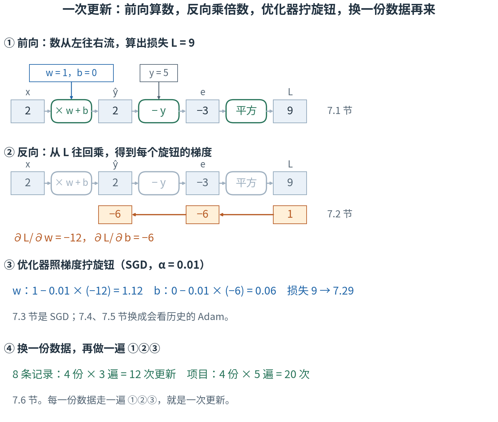
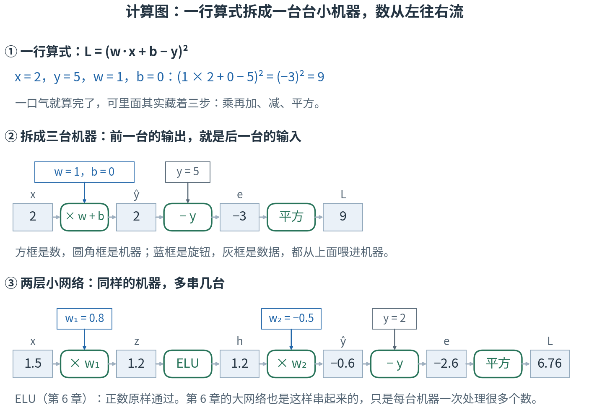
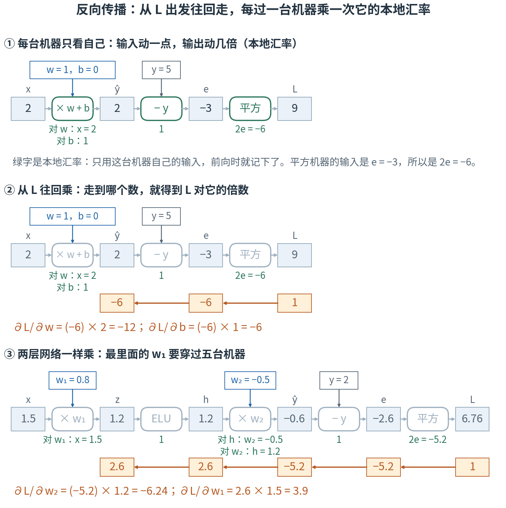
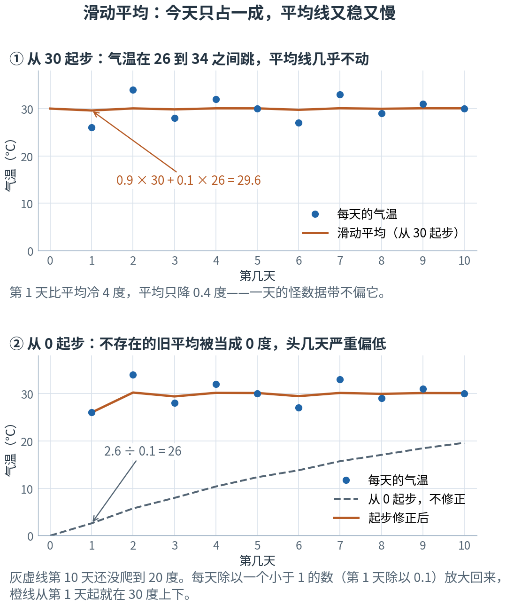
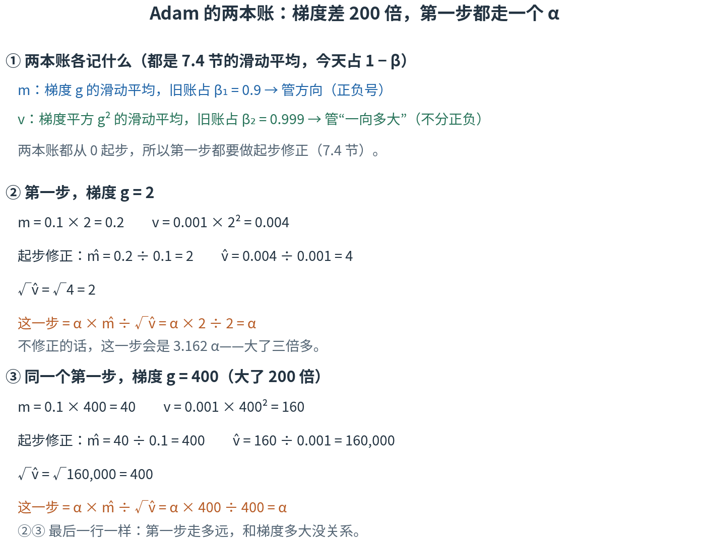
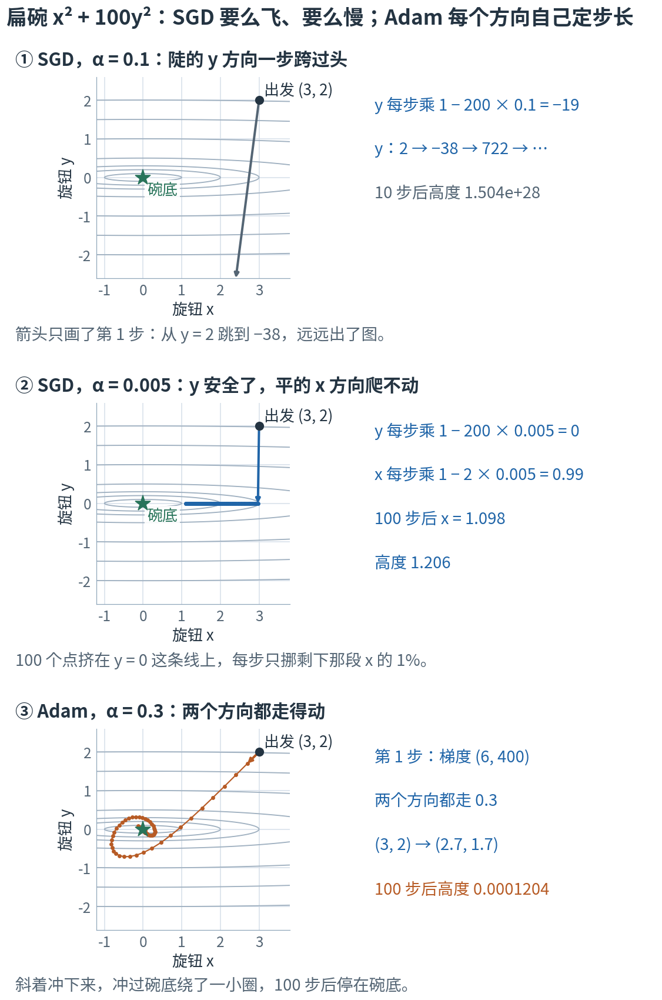
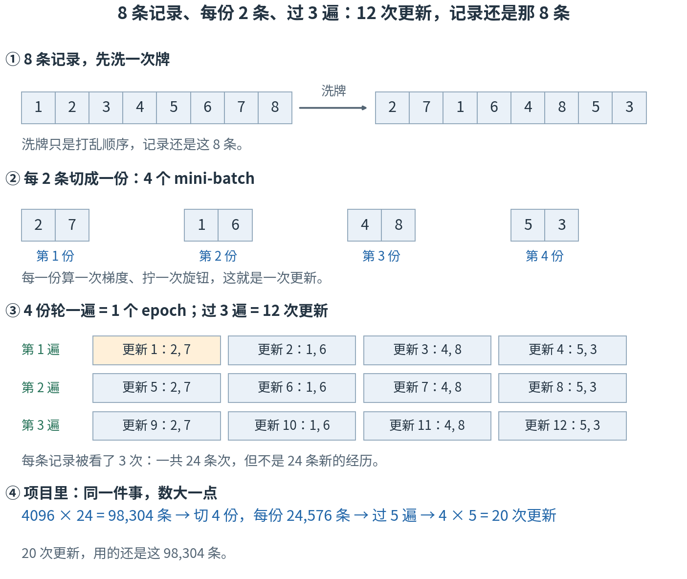
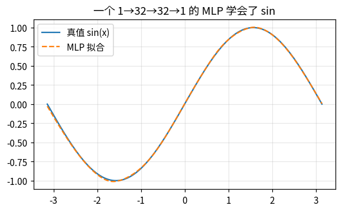

# 第 7 章 · 反向传播与优化器：梯度怎么算出来，旋钮怎么拧下去

> **上一章我们有了什么**：神经网络。它就是第 2 章的"价格表算总价"做 4 次，中间夹 3 次 ELU；项目的策略网络（actor）一共有 197,788 个可以训练的旋钮（第 6 章）。
>
> **这一章要补什么**：训练的每一步，都要知道损失对每一个旋钮的偏导数，也就是梯度。第 3 章手写了两个旋钮的梯度；第 5 章写一行 `loss.backward()` 就拿到了——这一行到底做了什么？
> 第 1 章 1.7 节已经给了答案的骨架：从最外层开始，一台一台把倍数往回乘。这一章把它从头到尾算给你看。
> 拿到梯度，还得真正去拧旋钮。第 3 章 3.6 节留下一个难题：陡的方向和缓的方向只能共用一个学习率 α。这一章讲拧旋钮的那段程序，以及项目用的 Adam 怎样让每个旋钮有自己的步长。
> 最后讲"一次用多少数据"：项目每次攒下 98,304 条记录，切成 4 份、过 5 遍，一共拧 20 次。
>
> **本章新词**：计算图、反向传播、优化器、SGD、滑动平均、Adam、mini-batch、epoch。
> **需要的前提**：第 1 章 1.7 节的链式法则（汇率相乘）；第 3 章的偏导数（3.2 节）、梯度下降（3.4 节）、误差与均方误差（3.5 节）、学习率的门槛（3.6 节）、梯度裁剪（3.7 节）；第 5 章（什么是学习）见过的 `loss.backward()`；第 6 章（神经网络）的 ELU。
> **不要求**会写 torch——代码只用来核对手算。标"进阶"和"第二遍读"的折叠块可以先跳过。

---

## 7.0 先看地图：数往前流，倍数往回传，再请一个会记账的人拧旋钮

**一行算式拆成一台台小机器，叫计算图；从损失出发、往回一台台乘倍数，叫反向传播，它把梯度一次算齐；拿着梯度真正去拧旋钮的程序，叫优化器。项目用的优化器 Adam 给每个旋钮记两本账，按各自的历史定步长；数据切成几小份，每份拧一次。**

想象一条做蛋糕的流水线：原料从左边进来，第一个工位按配方加料，第二个工位烤，第三个工位裱花，最后质检员打一个"有多差"的分。每个工位上都有旋钮（加多少糖、烤几分钟……）。分数不好，就要知道每个旋钮该往哪边拧、拧多少。

一个一个旋钮去试太慢了——项目里有 197,788 个。聪明的办法是**倒着传话**：质检员告诉裱花工位"你的成品每差一点，我的分就差这么多倍"；裱花工位乘上自己那一段的倍数，再告诉烤箱工位……一路传回第一个工位。每个工位只要知道自己那一段就够了。

话传完，还得有人真正去拧。莽撞的人照着传回来的数直接拧；有经验的老师傅会记住每个旋钮最近的反馈一向多大——一向很猛的，就轻点拧。另外，蛋糕不是全部做完才尝：每次抽几块尝一尝，就调一次旋钮；全部都尝过一遍算一轮，然后再从头尝。



**读图顺序：** 从 ① 到 ④ 竖着读，④ 做完再回到 ①。图里的数现在不用算，7.1–7.3 节和 7.6 节会一个一个手算出来；
现在只要看清次序：先往右算出损失，再往左传回倍数，然后拧旋钮，换一份数据再来。

| 概念 | 它在回答什么问题 | 蛋糕流水线里对应什么 | 在哪一节 |
|---|---|---|---|
| 计算图 | 一个算式由哪些小步骤、按什么顺序连起来？ | 工位的排列 | 7.1 |
| 反向传播 | 损失对每个旋钮的偏导数，怎样一次算齐？ | 从质检员开始倒着传话 | 7.2 |
| 优化器 | 拿到梯度以后，谁去拧、按什么规则拧？ | 真正动手拧旋钮的人 | 7.3 |
| SGD | 最朴素的拧法是什么？ | 照着传回来的数直接拧 | 7.3、7.6 |
| 滑动平均 | 怎样记住"最近一向多大"，又不被一天的怪数据带偏？ | 老师傅的记性 | 7.4 |
| Adam | 怎样让每个旋钮有自己的步长？ | 老师傅：反馈一向猛的，轻点拧 | 7.5 |
| mini-batch | 一次用多少数据算梯度？ | 每次抽几块尝 | 7.6 |
| epoch | 全部数据都用过一遍，叫什么？ | 全部尝过一遍 | 7.6 |

表里的名字先不背，英文到了各节再给。本章最容易混的四处，先贴上标签：

- **反向传播（`backward()`）不是把前向倒着放一遍，也不拧旋钮**：它不从损失倒推出输入，也不求什么"反函数"，往回传的是倍数（7.2 节）；
  它只算出梯度、记在旋钮旁边，一个旋钮都不动，真正拧旋钮的是另一行 `step()`（7.3 节）。
- **x、y 中途换角色**：7.1、7.2 节和 7.6 节以后，x 是输入、y 是真值，都是数据；7.3–7.5 节的扁碗上，x、y 是两个旋钮（第 3 章 3.6 节的意思）。换的地方有 ⚠️ 提醒。
- **学习率 α 和 Adam 的 β₁、β₂**：α 仍是第 3 章那个乘在更新量前面的倍数，决定步子多大；β₁、β₂ 管的是两本账"记性多长"（7.4、7.5 节）。
- **一次更新、mini-batch、epoch、迭代**：从小到大。一次更新 = 用一个 mini-batch（一小份数据）拧一次旋钮；所有 mini-batch 轮一遍是一个 epoch；
  项目的一次迭代 = 采一批新记录 + 过 5 个 epoch，每个 epoch 切 4 个 mini-batch，一共 20 次更新（7.6 节）。第 3 章 3.5 节表头的"迭代"只是"第几轮"，一轮拧一次，比这里小得多。

现在觉得这些区别有点抽象很正常，读到对应小节就清楚了。

第一次读，只要按顺序看正文、图片和手算。标着"进阶"的折叠内容可以先跳过；代码是复核工具，不是阅读门槛。

## 7.1 计算图：把一行算式拆成一台台小机器

先拿第 3 章 3.5 节找直线的那一套，只留**一条**数据：输入 x = 2，真值 y = 5。直线 ŷ = w·x + b 的两个旋钮，此刻是 w = 1、b = 0。
损失就是误差的平方（只有一条数据，平均就是它自己）：

$$L = (w x + b - y)^2 = (1 × 2 + 0 - 5)^2 = (-3)^2 = 9$$

一行就算完了。可计算机和你手算一样，是分三步走的，每一步的输出就是下一步的输入：

1. **乘再加**：ŷ = w·x + b = 1 × 2 + 0 = 2。这是预测值（3.5 节的"y 帽"）。
2. **减**：e = ŷ − y = 2 − 5 = −3。这是误差。
3. **平方**：L = e² = (−3)² = 9。

把每一步画成一台机器（第 1 章 1.1 节：函数就是一台机器），前一台的输出接到后一台的输入上：



**这样读图：** ① 是一口气算的写法。② 把它拆开：方框里是数，圆角框是机器，灰色小箭头是"数往哪流"。
蓝框里的 w、b 是旋钮，灰框里的 y 是数据，都从上面喂进机器。从左往右读：2 进去，出来 2，再出来 −3，最后是 9。③ 是一条更长的，下面马上算。

把一个算式拆成一台台小机器、再用箭头连起来，这样的图叫**计算图**（computational graph）。数从左往右流一遍、算出损失的这一趟，叫**前向**。
torch 在你每写一步运算时，都悄悄把这张图记下来：有哪几台机器，每台吃进了什么数、吐出了什么数。下一节往回算的时候，要用的正是这些记下来的数。

再看一条长一点的，图 ③：一个迷你的两层网络。输入 x = 1.5，真值 y = 2，两个旋钮 w₁ = 0.8、w₂ = −0.5：

1. z = w₁·x = 0.8 × 1.5 = 1.2
2. h = ELU(z) = 1.2（第 6 章的 ELU：正数原样通过）
3. ŷ = w₂·h = −0.5 × 1.2 = −0.6
4. e = ŷ − y = −0.6 − 2 = −2.6
5. L = e² = (−2.6)² = 6.76

第 6 章的网络就是这样串起来的，只是每台机器一次处理一整张清单（几十到几百个数），串得也更长。实验第 1 节把这两条流水线各算了一遍。

拆开有什么好处？下一节就用上了：每台机器只管自己那一小段"输入动一点、输出动几倍"，把这一串倍数乘起来，就是损失对某个旋钮的偏导数。

> **停一下，自测**：还是 x = 2、y = 5、w = 1，把 b 拧到 1。三台机器依次吐出什么？
> <details><summary>答案</summary>
>
> ŷ = 1 × 2 + 1 = 3，e = 3 − 5 = −2，L = (−2)² = 4。
>
> </details>

## 7.2 反向传播：从损失出发，往回乘本地汇率

现在问：**w 拧一点，L 动几倍？** 这就是 L 对 w 的偏导数（第 3 章 3.2 节）。

第 1 章 1.7 节的汇率法，把那里的数原样摆一遍：1 元换 0.14 美元，1 美元换 0.9 欧元，那么 1 元换 0.14 × 0.9 = **0.126** 欧元。
中间那道"美元"不用管，两段各自的倍数乘起来，就是全程的倍数。这里要串的是三段——w 变成 ŷ，ŷ 变成 e，e 变成 L。先问每台机器自己的那一段。

**每台机器只看自己**：它的输入动一点，它的输出动几倍？这个倍数叫这台机器的**本地汇率**——"本地"是说只看这一台，别的机器一概不管。
和真钱的汇率有两处不一样，先说在前头：这里的倍数可以大于 1（输入动 1，输出动 2），也可以是负的（输入变大，输出反而变小）。负号照样跟着一路乘下去。

- 平方机器 L = e²：导数是 2e（第 1 章 1.6 节的求导规则）。此刻 e = −3，本地汇率 2 × (−3) = **−6**。
- 减法机器 e = ŷ − y：ŷ 动一点，e 也动一点，本地汇率 **1**。
- 乘加机器 ŷ = w·x + b：w 动一点，ŷ 动 x 倍，对 w 的本地汇率是 x = **2**；b 动一点，ŷ 也动一点，对 b 是 **1**。

每一个都是用前向时记下的数（e = −3、x = 2）当场算的，不用把整条流水线重算一遍。然后**从 L 出发往回乘**：

- L 对自己：1。
- 过平方机器：1 × (−6) = −6。这是 L 对 e 的倍数。
- 过减法机器：−6 × 1 = −6。这是 L 对 ŷ 的倍数。
- 过乘加机器，走到两个旋钮：对 w，−6 × 2 = **−12**；对 b，−6 × 1 = **−6**。



**这样读图：** ① 绿字是每台机器的本地汇率，写在机器正下方。② 橙色格子是往回乘的结果：从最右边的 1 起，每往左过一台机器，就乘上它的绿字，写到左边那个数的正下方；
走到第一台机器，分两路乘出两个旋钮的梯度 −12 和 −6。图里的 ∂L/∂w 就是第 3 章 3.2 节的偏导数，读作"L 对 w 的偏导"。③ 是两层网络，这一节后半段讲。

不信就缩步量一遍（第 1 章 1.4 节的老办法）：w 从 1 拧到 1.01，ŷ = 2.02，e = −2.98，L = 8.8804，变化率 (8.8804 − 9) ÷ 0.01 = −11.96；
只拧 0.001，变化率 −11.996，越来越靠近 −12 ✓。b 从 0 拧到 0.01，L = 8.9401，变化率 −5.99，靠近 −6 ✓。

这两个数你见过：第 3 章 3.5 节表里"2·e·x"和"2·e"那两列，在这一条数据上正是 2 × (−3) × 2 = −12 和 2 × (−3) = −6。
当时那两列是直接写出来的公式，现在你看到了它们的来历：三台机器的本地汇率连乘。

从损失出发、沿着计算图往回走、每过一台机器乘一次它的本地汇率——这个算法叫**反向传播**（backpropagation）。写成式子，就是第 1 章的链式法则连用两次：

$$\frac{\partial L}{\partial w} = \frac{\partial L}{\partial e}\cdot\frac{\partial e}{\partial \hat y}\cdot\frac{\partial \hat y}{\partial w} = (-6) × 1 × 2 = -12$$

| 符号 | 怎么读 | 就是 |
|---|---|---|
| $\dfrac{\partial L}{\partial e}$ | "L 对 e 的偏导" | 平方机器的本地汇率 2e，此刻 −6 |
| $\dfrac{\partial e}{\partial \hat y}$ | "e 对 y 帽的偏导" | 减法机器的本地汇率，1 |
| $\dfrac{\partial \hat y}{\partial w}$ | "y 帽对 w 的偏导" | 乘加机器对 w 的本地汇率，就是 x，此刻 2 |
| $\cdot$ | "乘" | 一路上的本地汇率连乘 |

torch 里负责这件事的部分叫 `autograd`——就是第 5 章 5.4 节说的自动求导。`loss.backward()` 做的全部事情就是：沿着前向时记下的计算图往回走一遍，把每个旋钮的梯度写进它的 `.grad`。
实验第 2 节里 autograd 给出的也是 −12 和 −6。

### 两层网络：链长了，做法一样

回到图 ③ 的两层网络（x = 1.5、y = 2、w₁ = 0.8、w₂ = −0.5，前向算得 e = −2.6）。每台机器的本地汇率：

- 平方：2e = 2 × (−2.6) = −5.2；减法：1。
- 乘 w₂（ŷ = w₂·h）：对 h 是 w₂ = −0.5；对旋钮 w₂ 是 h = 1.2。（乘法机器有两个输入，问谁，本地汇率就是**另一个**：问 h 得 w₂，问 w₂ 得 h。例一"对 w 的本地汇率是 x"是同一条规则。）
- ELU：z = 1.2 是正数，原样通过，本地汇率 1。（z 是负数时，本地汇率是 exp(z)，比 1 小：z = −1.2 时是 0.3012，浏览器控制台里敲 `Math.exp(-1.2)` 可以核对。）
- 乘 w₁（z = w₁·x）：对旋钮 w₁ 是 x = 1.5。

从 L 往回乘：1 → −5.2（到 e）→ −5.2（到 ŷ）。在 ŷ 这里分岔：

- 往旋钮 w₂：−5.2 × 1.2 = **−6.24**。
- 往 h：−5.2 × (−0.5) = 2.6；过 ELU：2.6 × 1 = 2.6；到旋钮 w₁：2.6 × 1.5 = **3.9**。

实验第 2 节把手算和 autograd 并排打印：

```
        手算链式法则  autograd
------  ------------  --------
∂L/∂w2         -6.24     -6.24
∂L/∂w1           3.9       3.9
```

一模一样。最里面的 w₁ 离 L 最远，它的梯度是一路上**五个**本地汇率的连乘（其中两个是 1）：

$$\frac{\partial L}{\partial w_1} = \frac{\partial L}{\partial e}\cdot\frac{\partial e}{\partial \hat y}\cdot\frac{\partial \hat y}{\partial h}\cdot\frac{\partial h}{\partial z}\cdot\frac{\partial z}{\partial w_1} = (-5.2) × 1 × (-0.5) × 1 × 1.5 = 3.9$$

197,788 个旋钮也是这样算的：图大一点、岔路多一点，每个旋钮的梯度都是"从 L 走到它、一路上的本地汇率连乘"（遇到岔路怎么合，本节最后讲）。

还有一处省力的地方：往回乘到 ŷ 时已经得到 −5.2，w₂ 和 w₁ 两路都从这个数接着乘，不用各自从 L 重新走一遍。
整张图往回走**一趟**，所有旋钮的梯度就都有了——这正是反向传播快的原因。

> ⚠️ **反向传播不是把前向倒着放一遍。** 它没有从 L = 9 倒推出 e、再倒推出 x，也没有求什么"反函数"。往回传的是**倍数**：L 对每一个中间数有多敏感。
> 它要用前向时记下的数（例一的 e = −3，例二的 h = 1.2、w₂ = −0.5），这正是 torch 要在前向时把图记下来的原因。
> 叫"反向"，只是因为方向相反：前向从输入算到损失，反向从损失算回每个旋钮。

### 同一个旋钮走两条路：两份相加

同一个 w 在图里出现两次会怎样？比如 ŷ = w·x₁ + w·x₂，x₁ = 2、x₂ = 3。w 拧一点，两条路各自带动 ŷ：一条动 x₁ 倍，一条动 x₂ 倍，合起来 ∂ŷ/∂w = 2 + 3 = 5。
缩步核对：w 从 1 拧到 1.01，ŷ 从 5 变成 5.05，变化率 5 ✓。

一批数据里，每一条都经过同一套旋钮；所以每一条都给同一个旋钮贡献一份梯度，最后加起来（或取平均）。7.6 节会用到这一点。

> **停一下，自测**：还是例一（x = 2、y = 5、w = 1），但 b = 1，前向得 e = −2（7.1 节自测）。∂L/∂w 和 ∂L/∂b 各是多少？
> <details><summary>答案</summary>
>
> 平方机器的本地汇率 2e = −4；减法 1；乘加对 w 是 x = 2，对 b 是 1。∂L/∂w = (−4) × 1 × 2 = −8，∂L/∂b = (−4) × 1 × 1 = −4。
>
> </details>

## 7.3 优化器：`backward()` 只算梯度，`step()` 才拧旋钮

梯度有了：∂L/∂w = −12，∂L/∂b = −6。接下来就是第 3 章 3.4 节的那一步：每个旋钮减去"学习率 × 它的偏导数"。取 α = 0.01：

- w：1 − 0.01 × (−12) = 1.12
- b：0 − 0.01 × (−6) = 0.06

两个梯度都是负的，减去一个负数就是加，所以两个旋钮都往**大**里拧。这正是第 3 章 3.4 节"朝下坡方向走"的意思：L 对 w 的倍数是负的，说明 w 变大时 L 会下降，那就把 w 拧大。

拧完再前向一遍核对：ŷ = 1.12 × 2 + 0.06 = 2.30，e = 2.30 − 5 = −2.70，L = (−2.70)² = 7.29。从 9 降到了 7.29 ✓。

在 torch 里，这一步交给一段专门的程序：它拿到每个旋钮的梯度，按某种规则真正去改旋钮的值。这段程序叫**优化器**（optimizer）——第 3 章 3.7 节说的"拿到梯度后真正去拧旋钮的那段程序"，就是它。
上面这种最朴素的规则——θ ← θ − α∇L 原样照做——在 torch 里叫 **SGD**（stochastic gradient descent，随机梯度下降），就是第 3 章的梯度下降；名字里"随机"两个字的来历，7.6 节讲。

写成代码，一次更新是这样：

```python
opt = torch.optim.SGD([w, b], lr=0.01)   # 造一个优化器：它管着 w、b 两个旋钮，学习率 0.01（代码里学习率叫 lr）
opt.zero_grad()                          # ① 清空旋钮旁边存着的旧梯度
loss = (w * x + b - y) ** 2              # 前向：沿计算图算出 L = 9（7.1 节）
loss.backward()                          # ② 反向传播：梯度写进 w.grad、b.grad（7.2 节）
opt.step()                               # ③ 读 .grad，真正改旋钮：w ← w − 0.01 × w.grad
```

三个动作各管一件事。实验第 3 节在 `backward()` 和 `step()` 之后各看了一眼：`backward()` 之后，w 还是 1，只是 w.grad 里多了 −12；`step()` 之后，w 才变成 1.12、b 变成 0.06。
反过来，只调 `step()` 不调 `backward()`，它读到的是旧的（或空的）梯度，不会凭空学到新东西。

> ⚠️ **`backward()` 会累加，不会覆盖。** 连着做两次"前向 + `backward()`"、中间不 `zero_grad()`，w.grad 会变成 −12 + (−12) = −24，b.grad 变成 −12——同一份梯度被加了两遍（实验第 3 节核对过）。
> 所以每次更新前都要先清零。有人故意利用这一点：攒几份数据的梯度再拧一次，假装一次用了更多数据；那时要自己留意梯度被放大了几倍（要不要除以份数）。
> （每一次都要先前向：往回走完一趟，torch 就把前向记下的数扔了，对同一个 loss 再 `backward()` 一次会报错。）

> **停一下，自测**：同学说："我调了 `loss.backward()`，打印 w 发现一点没变，是不是求导失败了？"你怎么回答？再算一下：α 换成 0.05，SGD 一步后 w、b、L 各是多少？
> <details><summary>答案</summary>
>
> 不一定失败。先看 `w.grad`，这里应该是 −12。改 w 是 `step()` 的事，`backward()` 只算梯度。
> α = 0.05：w = 1 − 0.05 × (−12) = 1.6，b = 0 − 0.05 × (−6) = 0.3；ŷ = 1.6 × 2 + 0.3 = 3.5，e = −1.5，L = 2.25。
>
> </details>

### SGD 的老毛病：一个 α 顾不了陡缓两头

第 3 章 3.6 节已经见过这件事：碗 x² + 3y² 上，y 方向陡 3 倍，门槛就小 3 倍（x 方向每步乘 1 − 2α，y 方向每步乘 1 − 6α），可两个方向只能共用一个 α。
这里只把"陡几倍"加大到 100，看它有多麻烦。

> ⚠️ 从这里到 7.5 节，x、y 回到第 3 章 3.6 节的意思：**碗上的两个旋钮**，不是 7.1 节的输入 x 和真值 y。7.6 节起，x、y 又回到数据的意思。

碗 f = x² + 100y²，从 (3, 2) 出发。这种一个方向很陡、另一个方向很缓的碗，下面叫它**扁碗**。照 3.6 节的规则：x 方向每步乘 1 − 2α，y 方向每步乘 1 − 200α。

- α = 0.1：y 每步乘 1 − 200 × 0.1 = −19。大小超过 1，发散：y 从 2 跳到 −38，再跳到 722……
- 照 3.6 节的门槛，y 不发散要 1 − 200α 的大小（不管正负）小于 1，也就是 α < 0.01。取 α = 0.005：y 每步乘 1 − 200 × 0.005 = 0，一步就到底；
  可 x 每步乘 1 − 2 × 0.005 = 0.99，每步只挪剩下距离的 1%。100 步后 x = 3 × 0.99¹⁰⁰ = 3 × 0.366 = 1.098（0.99 连乘 100 次，第 1 章 1.8 节；控制台敲 `0.99**100` 得 0.366），
  碗的高度 1.098² = 1.206，离碗底还远。

这就是 3.6 节那句"最陡的方向说了算"：α 只能迁就最陡的 y，缓的 x 就只能慢慢爬。真实的损失地形，不同旋钮的陡峭程度能差上千倍。
我们想要的是**每个旋钮有自己的步长**：陡的轻点拧，缓的放心拧。要做到这一点，先得记住"这个旋钮的梯度一向有多大"——下一节先学怎么记。

## 7.4 滑动平均：今天只占一成，旧的平均占九成

怎样记住"最近一向多大"？先离开旋钮，想一件生活里的事：**你想知道这几天大概多热。**

最笨的办法是把每天的气温都记下来，要用时再求平均。更省事的办法是只记**一个**数——"到今天为止的平均"，每天用今天的气温把它更新一下：

**新平均 = 0.9 × 旧平均 + 0.1 × 今天的气温**

旧的平均占九成，今天只占一成。手算两天（这组气温是为了好算而构造的，10 天的平均正好 30 度）：

- 原来的平均是 30 度，第 1 天 26 度：0.9 × 30 + 0.1 × 26 = 27 + 2.6 = **29.6**。今天比平均冷了 4 度，平均只降了 0.4 度。
- 第 2 天 34 度：0.9 × 29.6 + 0.1 × 34 = 26.64 + 3.4 = **30.04**。

同一个式子也能读成"每天只把差距补上一成"：29.6 + 0.1 × (34 − 29.6) = 29.6 + 0.44 = 30.04，结果一样。

这样记出来的数叫**滑动平均**（moving average）：它跟着新数据慢慢"滑"，又不会被一天的怪数据带偏。"旧的平均占几成"这个比例记作 β（读"贝塔"），这里 β = 0.9，今天占 1 − β = 0.1。写成 JS，就是一个 `reduce`：

```js
const temps = [26, 34, 28, 32, 30, 27, 33, 29, 31, 30];          // 10 天的气温
const avg = temps.reduce((old, t) => 0.9 * old + 0.1 * t, 30);   // 从 30 起步：每天 0.9 × 旧平均 + 0.1 × 今天
// 在浏览器控制台里运行，avg 约为 30.06（第 10 天的滑动平均）
```



**这样读图：** 两张图的纵轴都是气温，刻度相同；蓝点是每天的气温，是同一组数。① 从 30 度起步：蓝点在 26 到 34 度之间跳，橙色的滑动平均 10 天里只在 29.6 到 30.07 之间动——**又稳又慢**。
箭头指的就是上面手算的第 1 天。② 先看灰虚线，下一段讲它。

### 从 0 起步：头几天偏低，要修正

如果一开始根本没有"旧平均"呢？最自然的做法是把它记成 0。第 1 天：0.9 × 0 + 0.1 × 26 = **2.6**——平均气温 2.6 度，离谱。
毛病出在那个不存在的"旧平均"被当成了 0 度，还占了九成。图 ② 的灰虚线就是这样一路记下去的：第 10 天才 19.60 度，还没爬到 20 度。

修正的办法：第 1 天记下的数里，真正来自数据的只有那一成，所以除以 1 − 0.9 = 0.1，放大回来：2.6 ÷ 0.1 = **26**，正好是第 1 天的气温 ✓。
之后每天也除一个数，这个数越来越接近 1（见下面折叠）。图 ② 的橙线就是修正后的：从第 1 天起就在 30 度上下。
这一步本书叫**起步修正**：平均从 0 起步，头几天偏小，每天除以一个小于 1 的数放大回来。

> ⚠️ **资料上管它叫"偏差修正"，可这里的"偏差"和前几章的不是一回事。** 它的英文是 bias correction，常译作"偏差修正"。
> 本书前几章的"偏差"都是"差多少"：第 1 章 1.9 节的"指令 − 实际"（要 0.4 m/s、走了 0.3 m/s，偏差 0.1），第 4 章 4.4 节的"结果 − 平均"。
> 这里修的是另一种偏差：**估计出来的平均值，系统性地偏向一边**——从 0 起步的滑动平均，头几天一律偏小，不是这一天运气不好，换哪组气温都偏小。
> 为了不和前面两种混，本书把这一步叫起步修正。第 12 章（GAE）讲偏差–方差权衡时会正式讲这种统计意义上的偏差，那里还会再提醒一次。

<details>
<summary>进阶：第 t 天除以几？记性有多长？（现在可跳过）</summary>

第 2 天：0.9 × 2.6 + 0.1 × 34 = 5.74。这个数里，来自数据的份额是第 1 天的 0.9 × 0.1 = 0.09 加上第 2 天的 0.1，共 0.19，正好是 1 − 0.9²；
剩下的 0.81 = 0.9² 是那个假的 0。所以第 2 天除以 0.19：5.74 ÷ 0.19 = 30.21。

一般地，第 t 天除以 $1 - \beta^t$：第 1 天 0.1，第 2 天 0.19，第 3 天 0.271……第 10 天 0.651。t 越大，$\beta^t$ 越接近 0，除的数越接近 1，修正也就几乎不起作用了。

换个角度看这个 30.21：第 2 天记下的 5.74 里，第 1 天的气温占 0.09 份、第 2 天占 0.1 份；修正就是按这两个份额求加权平均（第 4 章 4.3 节）：(0.09 × 26 + 0.1 × 34) ÷ 0.19 = (2.34 + 3.4) ÷ 0.19 = 30.21。越近的日子份额越大。

**记性有多长？** 每往前一天，那一天气温的权重就再乘一次 0.9——第 1 章 1.8 节的"每走一步，乘同一个数"，所以它也叫指数滑动平均。
最近 10 天的权重加起来占 $1 - 0.9^{10} = 0.651$，大约三分之二；粗略地说，β = 0.9 记得最近 1 ÷ (1 − 0.9) = 10 步。β = 0.999 记得最近约 1000 步：$1 - 0.999^{1000} = 0.632$。

</details>

实验第 4 节把 10 天都算了一遍，并核对了一件事：修正后的数，恰好等于"越近的日子权重越大"的加权平均（第 4 章 4.3 节；折叠里手算了第 2 天）——不管气温是哪几个数都成立。

> **停一下，自测**：昨天的滑动平均是 20 度（β = 0.9），今天 10 度，新的平均是多少？如果是从 0 起步的第 1 天、今天 10 度，记下的是几？修正后是几？
> <details><summary>答案</summary>
>
> 0.9 × 20 + 0.1 × 10 = 18 + 1 = 19 度。从 0 起步：0.9 × 0 + 0.1 × 10 = 1；除以 0.1 得 10，正好是今天的气温。
>
> </details>

## 7.5 Adam：每个旋钮按自己的历史定步长

回到 7.3 节的扁碗。SGD 的一步 = α × 梯度，和梯度成正比：y 方向的梯度大得多，步子就大得多，于是只能把 α 压得很小，x 方向跟着爬不动。

想法很直接：**把梯度除以"这个旋钮的梯度一向多大"**。一向很大的，除以一个大数，步子变小；一向很小的，除以一个小数，步子变大。"一向多大"就用上一节的滑动平均来记。

先手算一个旋钮的第一步。设这一次它的梯度 g = 2，两本账都从 0 起步：

1. **第一本账 m**：梯度的滑动平均，旧账占 0.9。m = 0.9 × 0 + 0.1 × 2 = **0.2**。
2. **第二本账 v**：梯度**平方**的滑动平均，旧账占 0.999。v = 0.999 × 0 + 0.001 × 2² = **0.004**。
3. **起步修正**（7.4 节）：0.2 ÷ (1 − 0.9) = **2**；0.004 ÷ (1 − 0.999) = **4**。
4. **这一步** = α × 2 ÷ √4 = α × 2 ÷ 2 = **α**。

第一步正好走一个 α。梯度换成 400 呢？m 记下 0.1 × 400 = 40，修正后 400；v 记下 0.001 × 400² = 160，修正后 160,000，开平方是 400。
这一步 = α × 400 ÷ 400，还是 **α**。梯度大了 200 倍，步子一点没变。



**这样读图：** ① 先记住两本账各管什么。②③ 是同一套四步手算，只换了梯度：② 是刚才的 g = 2，③ 换成 g = 400。
每一格竖着往下读：记账 → 起步修正 → v̂ 开平方 → 相除。②③ 的最后一行（橙色）都是 α——第一步走多远，和梯度多大没关系，这正是 Adam 和 SGD 最大的不同。

### 两个"为什么"：v 记平方、非修正不可

- **v 为什么记平方？** 梯度有正有负，直接平均会互相抵消；平方之后都是正的，开平方回来，就是"一向多大"（不管正负）。m 管方向（正负号），√v 管大小，相除以后剩下"方向 × 一个 1 左右的数"。v 也不是第 4 章 4.4 节的方差：方差要先减去平均值再平方，v 是直接平方再平均。
- **为什么非修正不可？** 不修正，第一步是 α × 0.2 ÷ √0.004 = α × 0.2 ÷ 0.06325 = 3.162α，比想要的大三倍多（控制台敲 `0.2 / Math.sqrt(0.004)` 可以核对）。
  两本账起步时偏小的程度不一样（一个小了 10 倍，一个小了 1000 倍），相除不会自己抵消。

### 放到扁碗上：两个方向都走一个 α

回到 7.3 节那只扁碗，从 (3, 2) 出发。梯度是 (2 × 3, 200 × 2) = (6, 400)，y 方向约是 x 方向的 67 倍（400 ÷ 6 ≈ 66.7）。SGD 在 y 方向的步子也会大约 67 倍；Adam 的第一步呢？
两个方向都是一个 α（往哪边由梯度的正负号定）。取 α = 0.3，两个方向都走 0.3，到 (2.7, 1.7)：

```
                   x    y
---------------  ---  ---
         梯度 g    6  400
 手算 Adam 一步  2.7  1.7
torch Adam 一步  2.7  1.7
```

手算和 torch 一模一样。y 方向的梯度是 x 方向的 67 倍，两边迈出的步子却一样，都是 0.3。
同一个 α = 0.3 交给 SGD：x 方向跨 0.3 × 6 = 1.8，y 方向跨 0.3 × 400 = 120——早飞出去了。

### 名字和公式：两本账写成两行

这种"给每个旋钮记两本账——梯度的滑动平均 m、梯度平方的滑动平均 v——再用 m 除以 √v 定步长"的优化器，叫 **Adam**（adaptive moment estimation 的缩写，意思是"自适应的矩估计"，名字不用记）。完整的一步是：

$$m \leftarrow \beta_1 m + (1-\beta_1)\,g, \qquad v \leftarrow \beta_2 v + (1-\beta_2)\,g^2$$

$$\theta \leftarrow \theta - \alpha\,\frac{\hat m}{\sqrt{\hat v} + \varepsilon}$$

| 符号 | 怎么读 | 就是 |
|---|---|---|
| $\theta$ | "西塔" | 旋钮。第 3 章 3.4 节的 θ 是全部旋钮排成的清单；Adam 对清单里的每一项各记各的账、各算各的 |
| $g$ | | 这一次这个旋钮的梯度（上面的 2、400） |
| $m$ | | 第一本账：g 的滑动平均，管方向 |
| $v$ | | 第二本账：g² 的滑动平均，管"一向多大" |
| $\beta_1$、$\beta_2$ | "贝塔一""贝塔二" | 两本账里旧账占几成：0.9 和 0.999（torch 的默认值，可以改） |
| $\hat m$、$\hat v$ | "m 帽""v 帽" | 起步修正后的 m、v：第 t 步分别除以 $1-\beta_1^{\,t}$、$1-\beta_2^{\,t}$。第 1 步就是上面的 2 和 4 |
| $\alpha$ | "阿尔法" | 学习率，还是乘在最后那一步前面的倍数（项目里从 0.001 起步） |
| $\varepsilon$ | "艾普西隆" | 一个极小的数 `1e-8`：第 3 章 3.6 节那种科学计数法，e 后面是负号，表示小数点往左挪 8 位，也就是 0.00000001。它只为防止除以 0 |

帽子你在第 3 章 3.5 节见过："戴帽子 = 猜的"，ŷ 是猜出来的 y。这里也是这个意思：m̂、v̂ 是用两本账估计出来的"梯度平均多大、平方平均多大"，只是先做了起步修正（Adam 名字里的"估计"说的就是它们）。

**以后每一步也都正好走 α 吗？** 不是。m̂ ÷ √v̂ 读成一句话是"这一次的梯度，比它一向的大小大几倍"：第一步两本账里只有这一个梯度，上下当然相等，所以正好是 1。
往后，梯度一直朝同一边、大小也差不多时，这个比值还在 1 附近；等它开始在碗底两侧来回跳，比值会掉到远小于 1（为什么，这一节末尾走完 100 步再说）。
所以 α 定的是步子的量级，不是每一步都走满。

顺带回答一个容易冒出来的问题：**为什么不干脆除以这一次梯度的大小**？那样这个比值永远是 1，每一步都不多不少走一个 α，什么也感觉不到。
两本账记的是**历史**——v 用 β₂ = 0.999，记的是最近约一千步的大小。有了这个参照物，才谈得上"这一次的梯度算大还是算小"，步子才有变化的余地。

### 走 100 步：三条路比一比

一步看不出全貌。实验第 5 节让三种走法在扁碗上各走 100 步，记下一路上的高度（碗底的高度是 0）：

```
     优化器  10 步后高度    30 步后     60 步后    100 步后
-----------  -----------  ---------  ----------  ----------
  SGD α=0.1    1.504e+28  2.125e+79  1.128e+156  2.253e+258
SGD α=0.005        7.361      4.924       2.694       1.206
 Adam α=0.3        24.24      10.14      0.3982   0.0001204
```

第一行是科学计数法（第 3 章 3.6 节）：1.504e+28 就是 $1.504 × 10^{28}$，越走越高，发散了。第二行就是 7.3 节手算的那条慢路，100 步后停在 1.206。
第三行，Adam 前 30 步反而比 α = 0.005 的 SGD 还高——它冲得猛，冲过了碗底；可到 100 步已经降到 0.0001204，几乎到底。



**这样读图：** 三张图都是从正上方看这只碗，灰线是等高线（第 3 章 3.1 节）。这只碗 y 方向陡，所以圈被压得很扁；横竖刻度相同，路径的长短可以直接比。
黑点是出发点 (3, 2)，绿星是碗底 (0, 0)。① SGD α = 0.1：第 1 步就从 y = 2 跳到 −38，箭头直接冲出了图。
② SGD α = 0.005：先一步竖直落到 y = 0，然后沿着 y = 0 一点点往左挪，100 步只挪到 x = 1.098。
③ Adam α = 0.3：第一步斜着走（两个方向各 0.3），一路冲下来，冲过碗底绕了一小圈，最后停在碗底。

Adam 为什么能停住，而不是在陡的方向上一直来回跳？来回跳的时候，梯度一会儿正一会儿负，m 这本账正负抵消、变得很小；v 记的是平方，不抵消，还是很大。m 除以 √v，步子自然就小了。

<details>
<summary>进阶：来回跳的方向，步子会自己缩小（现在可跳过）</summary>

设一个旋钮前两步的梯度是 +4、−4（在碗底两侧来回跳）。第 1 步：m = 0.1 × 4 = 0.4，v = 0.001 × 16 = 0.016。
第 2 步：m = 0.9 × 0.4 + 0.1 × (−4) = −0.04，修正（除以 1 − 0.9² = 0.19）后是 −0.2105；v = 0.999 × 0.016 + 0.001 × 16 = 0.031984，修正（除以 1 − 0.999² = 0.001999）后是 16.0，开平方 4。
这一步 = α × (−0.2105) ÷ 4 = −0.0526α，只有 α 的 5% 左右。

对照：如果两步都是 +4，第 2 步修正后的 m 是 4，这一步还是 α。

</details>

> ⚠️ **学习率 α 和 β₁、β₂ 不是一类东西。** α 决定步子多大（在 Adam 下，第一步差不多就走 α 那么远）；β₁、β₂ 是两本账的记性（0.9 大约记得最近 10 步，0.999 大约 1000 步，见 7.4 节的折叠），不直接决定步子。嫌步子太大，要调的是 α。

Adam 也不是万能的：它不知道"这个方向在机器人身上安不安全"，也替代不了一个合适的 α 和实际的检验。项目在它外面还套了一层"按 KL 自动调 α"的办法（第 3 章的 📍 映射块）。

> **停一下，自测**：某个旋钮第一步的梯度 g = −3。两本账记下多少？修正后各是多少？这一步旋钮往大拧还是往小拧，拧多少？
> <details><summary>答案</summary>
>
> m = 0.1 × (−3) = −0.3，修正后 −3；v = 0.001 × 9 = 0.009，修正后 9，开平方 3。这一步 = α × (−3) ÷ 3 = −α，所以 θ ← θ − (−α) = θ + α：往大拧，拧 α。
>
> </details>

## 7.6 mini-batch 和 epoch：切成几份，每份拧一次

到现在为止，每拧一次旋钮，用的都是**全部**数据（第 3 章找直线，每一步都用全部 50 个点）。训练机器人时，4096 只机器人各走 24 步（这是机器人在仿真里走的步，不是 7.3–7.5 节优化器拧旋钮的"一步"），一次就攒下 98,304 条记录。
每拧一次都把这 98,304 条全算一遍，太慢；只拧一次就把它们扔掉，又太浪费——这些记录是机器人辛辛苦苦跑出来的。

做法是：**洗一次牌，切成几份，每份算一次梯度、拧一次旋钮；所有份都轮过一遍，再从头轮，一共轮几遍。**

先看它的迷你版：8 条记录，编号 1 到 8。

1. 洗牌：顺序变成 2、7、1、6、4、8、5、3。
2. 每 2 条切成一份：{2, 7}、{1, 6}、{4, 8}、{5, 3}，一共 8 ÷ 2 = 4 份。
3. 每一份算一次梯度、拧一次旋钮，这是一次**更新**。4 份轮一遍，是 4 次更新。
4. 再轮两遍（和项目一样，沿用同一种切法），一共 4 × 3 = 12 次更新。



**这样读图：** ① 洗牌只是换顺序。② 每两格切成一份（图 ②③ 里的 mini-batch、epoch 是下面马上要给的名字：一份、一遍）。③ 每一行是一遍，每个格子是一次更新，格子里写着这次用的是哪两条记录；橙色的是第 1 次更新。
④ 是项目里的真实规模，这一节末尾会算。

切出来的每一小份叫一个 **mini-batch**（小批量）；所有 mini-batch 都用过一遍，叫一个 **epoch**（一遍）。于是：

**一共更新几次 = 切几份 × 过几遍** = 4 × 3 = 12。

> ⚠️ **epoch 不是新的经历。** 12 次更新一共看了 24 条次，可不同的记录只有 8 条，每条被看了 3 遍。多过几遍，只是把同一批记录多用几次，并没有变出新数据。

### 每份的梯度会"抖"：SGD 名字里的"随机"

一份只有几条记录，算出来的梯度和用全部数据算的不完全一样。看 4 条记录，旋钮都在 w = 1、b = 0；第一条就是 7.1 节的那条 (x = 2, y = 5)。
每一条自己的 ∂L/∂w，就是 7.2 节算过的 2·e·x：

| 记录 (x, y) | (2, 5) | (1, 3) | (2, 3) | (1, 1) |
|---|---|---|---|---|
| 预测 ŷ = 1·x + 0 | 2 | 1 | 2 | 1 |
| 误差 e = ŷ − y | −3 | −2 | −1 | 0 |
| 这一条的 ∂L/∂w = 2·e·x | −12 | −4 | −4 | 0 |

- 用全部 4 条（均方误差）：(−12 − 4 − 4 + 0) ÷ 4 = **−5**。每条贡献一份再取平均，就是 7.2 节末尾说的那回事。
- 只用前两条：(−12 − 4) ÷ 2 = **−8**；只用后两条：(−4 + 0) ÷ 2 = **−2**。

两份都说"w 该往大拧"（负号），方向一样；但一个说 −8、一个说 −2，大小在"抖"。两份再平均，(−8 − 2) ÷ 2 = −5，又回到了全体的梯度。
每一份都相当于从全部数据里随机抽几条来估计梯度——这就是 SGD 名字里"随机"的来历。
这点抖动有时能帮着离开停滞不前的区域，但不是越抖越好；抖得太厉害，每一步都像听了一个说法不一的传话人。

### 项目里的真实规模

- 4096 只机器人各走 24 步：4096 × 24 = 98,304 条记录。
- 切 4 份：98,304 ÷ 4 = 24,576 条一份。
- 过 5 遍：4 × 5 = **20 次更新**。

"采一批记录 + 用它们学 5 遍"合起来，项目里叫一次迭代（训练日志里写作 iteration）。所以：一次迭代 = 采 98,304 条记录 + 5 个 epoch；每个 epoch 4 个 mini-batch；每个 mini-batch 一次更新；一共 5 × 4 = 20 次更新。
它比第 3 章 3.5 节表头的"迭代"大得多：那里一轮只拧一次旋钮，这里一次迭代要拧 20 次。

> **停一下，自测**：① 8 条记录改成切 2 份、每份 4 条，过 3 个 epoch，一共更新几次？一共"看"了几条次？
> ② 项目如果**只切 1 份**（一次就把 98,304 条全用上），还是过 5 遍：一次迭代更新几次？每次更新用多少条？和现在的 20 次比，哪个数变了、哪个数没变？
> <details><summary>答案</summary>
>
> ① 2 × 3 = 6 次更新；看了 8 × 3 = 24 条次，不同的记录仍只有 8 条。
> ② 1 × 5 = 5 次更新，每次用全部 98,304 条（是 24,576 条的 4 倍）。**遍数没变**，还是 5 遍——同一批记录被用了几遍，由 epoch 数定；
> **更新次数变了**，20 次掉到 5 次——一遍里拧几次，由切几份定。切得越碎，同样一批记录能拧的次数越多，每次拧依据的记录也越少（梯度抖得更厉害）。
>
> </details>

<details>
<summary>第二遍读：同一批记录用 5 遍，PPO 怎样保证不出事</summary>

同一批记录反复用，有个隐患：记录是**旧的**网络跑出来的，可每拧一次，网络就变一点；到第 2 遍、第 3 遍，网络已经不是当初采记录的那个了。
PPO 的做法是：记录里存下当时的动作和它的 log 概率（第 4 章 4.8 节），每一遍都用**当前**的网络重新算一次，比一比变了多少，并且限制它别变得太离谱——第 13 章（PPO 的比率与裁剪）讲的就是这件事。

这里还会用到一个小工具 `detach()`：它把一个数从计算图上"摘"下来，数值留着，但反向传播不再从它往回走。
PPO 存下来的旧记录就是这样的数——它们是数据，不是要让梯度穿过去的路。"保存数据"和"让梯度穿过生成数据的全过程"是两回事。

</details>

## 7.7 一次完整的更新：五行代码，各管一件事

把本章和第 3 章串起来：每来一份数据，一次更新是五行。

```python
opt.zero_grad()                                        # ① 清掉上一次的梯度（7.3 节）
loss = torch.mean((net(X[idx]) - Y[idx]) ** 2)         # ② 用这一份数据前向（7.1 节），算出均方误差（第 3 章 3.5 节）
loss.backward()                                        # ③ 反向传播：梯度写进每个旋钮的 .grad（7.2 节）
torch.nn.utils.clip_grad_norm_(net.parameters(), 1.0)  # ④ 梯度裁剪：箭头太长就缩短（第 3 章 3.7 节）
opt.step()                                             # ⑤ 优化器拧旋钮（这里是 Adam，7.5 节）
```

外面再套两层循环：里层把一个 epoch 的每一份轮一遍，外层重复几个 epoch（7.6 节）。

实验第 7 节就用这五行训练一个小网络：1 个数 → 32 个数 → 32 个数 → 1 个数，三次"价格表算总价"、中间夹两道 ELU——和第 6 章的网络一个样子（那里是四次、夹三道），只是小得多。
目标是描出一条波浪线 sin(x)（[附录 D.4](../appendix/D-三角函数从0补课.md) 讲过这条曲线；这里只把它当成要描的形状）。
数据是从 −3.14 到 3.14 均匀取的 400 个点，每份 64 个：400 ÷ 64 = 6 份满的，剩下 16 个凑成第 7 份，所以每个 epoch 更新 7 次，60 个 epoch 共 7 × 60 = 420 次。

```
过了几个 epoch  更新了几次  全部 400 个点的损失
--------------  ----------  -------------------
        训练前           0                0.300
             1           7                0.238
             5          35               0.0752
            10          70               0.0146
            20         140              0.00152
            40         280            0.0000551
            60         420            0.0000609
```

损失从 0.300 一路降到 0.0000609。这些损失只能跑实验得到，看趋势就行；想知道它们大概意味着什么，开个根号换回"差多少"：
损失是误差平方的平均，√0.300 ≈ 0.55，√0.0000609 ≈ 0.0078（控制台敲 `Math.sqrt(0.0000609)`）。粗略地说，训练前每个点差 0.5 多，训练后只差 0.008 左右——而波浪线的最高点才 1。
最后两行有个小细节：第 40 个 epoch 的 0.0000551 反而比第 60 个略低——每份数据的梯度在抖（7.6 节），到了碗底附近，旋钮就在底下轻轻晃。



**这样读图：** 灰色粗线是目标 sin(x)，橙线是网络此刻的输出，右下角是全部 400 个点的损失。① 训练前，旋钮还是随机的初始值，橙线只是一条微微弯曲的斜线。
② 只过了 1 个 epoch（7 次更新），橙线变陡了，中间一段贴近了波浪线，两头还差得远（损失 0.238 只比 0.300 小一点）。③ 60 个 epoch 后，橙线压在灰线上，几乎看不出差别。

项目的 PPO 更新也是这五行，只是第 ② 行的损失复杂得多（第 13 章），而且一个优化器同时管着两张网络（见 📍）。

## 📍 映射到项目

> 只需看一眼。语法看不懂没关系。

**这段配置做什么**：一次迭代的记录切几份、过几遍、学习率从多少起步，写在 `src/mjlab_microduck/tasks/microduck_velocity_env_cfg.py` 的 `MicroduckRlCfg` 里：

```python
num_learning_epochs=5,     # 每次迭代的记录过 5 遍：5 个 epoch（7.6 节）
num_mini_batches=4,        # 每遍切成 4 份：4 个 mini-batch（7.6 节）
learning_rate=1.0e-3,      # Adam 的 α 从 0.001 起步（7.5 节；训练中还会自动调，见第 3 章的 📍）
...                        # （中间省略几行别的设置）
max_grad_norm=1.0,         # 梯度裁剪的上限 1.0（第 3 章 3.7 节）
...
num_steps_per_env=24,      # 每只机器人每次迭代走 24 步
```

4096 只机器人来自训练命令里的 `--env.scene.num-envs 4096`（见仓库根目录的 `AGENTS.md`）。

**这段代码做什么**：`rsl_rl/algorithms/ppo.py` 里，先造出优化器，再在 `update()` 里按 4 份 × 5 遍取出 mini-batch，每一份做一次 7.7 节的那几步：

```python
optimizer: str = "adam",                                                    # 优化器默认选 Adam（7.5 节）
...
self.optimizer = resolve_optimizer(optimizer)(                              # 按名字造出优化器：torch.optim.Adam
    chain(self.actor.parameters(), self.critic.parameters()), lr=learning_rate   # 它同时管着 actor、critic 两张网络的全部旋钮
...
generator = self.storage.mini_batch_generator(self.num_mini_batches, self.num_learning_epochs)   # 4 份 × 5 遍（7.6 节）
...
for batch in generator:                                                     # 每来一份 mini-batch……
    ...                                                                     # （先算 PPO 的损失，第 13 章）
    self.optimizer.zero_grad()                                              # 清掉旧梯度（7.3 节）
    loss.backward()                                                         # 反向传播，梯度写进 .grad（7.2 节）
    ...
    nn.utils.clip_grad_norm_(self.actor.parameters(), self.max_grad_norm)   # actor 的梯度裁剪（第 3 章 3.7 节）
    nn.utils.clip_grad_norm_(self.critic.parameters(), self.max_grad_norm)  # critic 单独再裁一次
    self.optimizer.step()                                                   # Adam 拧旋钮（7.5 节）
...
num_updates = self.num_learning_epochs * self.num_mini_batches              # 一次迭代的更新次数：5 × 4 = 20
```

**这段代码做什么**：`rsl_rl/storage/rollout_storage.py` 的 `mini_batch_generator` 负责洗牌和切分：

```python
batch_size = self.num_envs * self.num_transitions_per_env     # 4096 × 24 = 98,304 条
mini_batch_size = batch_size // num_mini_batches              # ÷ 4 = 24,576 条一份（// 是只取整数的除法）
indices = torch.randperm(num_mini_batches * mini_batch_size, requires_grad=False, device=self.device)   # 洗一次牌：把 0 到 98,303 这些编号打乱
...
for epoch in range(num_epochs):                               # 过 5 遍（epoch）
    for i in range(num_mini_batches):                         # 每遍 4 份（mini-batch）
        start = i * mini_batch_size                           # 这一份从洗好的第几个编号开始
        stop = (i + 1) * mini_batch_size                      # 到第几个为止
        batch_idx = indices[start:stop]                       # 取出这一份的编号
        yield RolloutStorage.Batch(                           # 交给上面的 for batch in generator，做一次更新
```

三个细节。第一，`randperm`（洗牌）在两层循环的**外面**：只洗一次，5 遍都用同一种切法——和 7.6 节的迷你版一样。（7.7 节描波浪线的例子是每遍重洗一次；两种做法都常见。）
`update()` 里取 mini-batch 其实有两支，另一支给另一类网络用；项目的 actor、critic 都是第 6 章那种一层接一层的网络，走的就是上面引的 `mini_batch_generator`。
第二，优化器只有一个，它同时管着 actor 和 critic 的旋钮，所以一次 `step()` 两张网络一起更新。
第三，Adam 的两本账也是训练的一部分：每个旋钮的 m、v 都会随检查点（训练中定期存下的 `model_N.pt` 文件）一起存下来（`ppo.py` 的 `save()` 里有 `optimizer_state_dict`），接着训练时账本才能接着记。
`resolve_optimizer` 在 `rsl_rl/utils/utils.py` 里，它把字符串 `"adam"` 换成 `torch.optim.Adam`。

实验第 8 节会核对：上面引用的常数和源码行，在你机器上的源码里还原样存在；洗牌确实只出现一次，而且在循环外面。

## 🧪 动手实验

```bash
uv run python docs/learn-zh/labs/ch07_backprop.py
```

1. 计算图：例一三台机器的前向（2、−3、9）和自测（3、−2、4），例二两层网络的前向（1.2、1.2、−0.6、−2.6、6.76）；画 `ch07_graph_forward.png`。
2. 反向传播：第 1 章那两道汇率相乘（0.14 × 0.9 = 0.126）；例一逐台的本地汇率和往回乘的表（−6、−6、−12、−6）、缩步核对（−11.96、−5.99）、autograd 对照；例二的 −6.24、3.9 与 autograd 并排；
   ELU 负半边的 0.3012；两条路相加的 5；自测 −8、−4；画 `ch07_graph_backward.png`。
3. 优化器：SGD 一步（1.12、0.06、7.29），`backward()` 和 `step()` 前后的 w，两次"前向 + `backward()`"累加成 −24、同一个 loss 不能 backward 两次，自测 α = 0.05；扁碗上 SGD 两种 α 的乘数表（−19；0.99、1.098、1.206）。
4. 滑动平均：10 天气温的三种平均（从 30 起步、从 0 起步、起步修正后），29.6、30.04、2.6 → 26、5.74 ÷ 0.19 与按份额的加权平均（都是 30.21），记性 0.651 与 0.632，自测 19 与 10；画 `ch07_moving_average.png`。
5. Adam：冻结手算 0.2、0.004、2、4，一步正好 α，不修正时的 3.162，g = 400 与 g = −3，扁碗第一步 (2.7, 1.7) 手算与 torch，三种走法 100 步的高度表（含 y 的 2 → −38 → 722），来回跳时的 −0.0526；
   画两本账的第一步 `ch07_adam_two_books.png` 和扁碗上三种走法 `ch07_optimizers.png`。
6. mini-batch 与 epoch：8 条记录洗牌、切 4 份、过 3 遍的 12 次更新；4 条记录各自的梯度与两份的平均（−5、−8、−2）；项目的 98,304、24,576、20，自测 6 与"切 1 份"的 5；画 `ch07_minibatch.png`。
7. 一次完整的更新：五行代码循环 420 次，训练小网络描 sin(x)，打印损失表和开根号的换算（0.55、0.0078）；画 `ch07_sin_fit.png` 和 7.0 节的总览图 `ch07_overview.png`。
8. 映射到项目：核对 📍 里引用的配置常数和源码行还在不在；洗牌只有一次，项目走的是 `mini_batch_generator` 这一支。

**改一改**（每条都先写下你的预测，再运行。要改的三行在脚本里都标着 `# TWEAK-1` / `TWEAK-2` / `TWEAK-3`。
改动之后，锁正文数字的检查会从 ✓ 变成 ✗，脚本照常跑完，最后提示"N 项没对上"——这是预期的，它们锁的是正文里的数；有 ✗ 时新画的图不会覆盖教材里的图，会另存到临时目录，路径脚本会打印出来。
试完记得改回去再跑一遍）：

- 把第 3 节的 `ALPHA_SLOW` 从 0.005 改成 0.011。先用 3.6 节的规则算：y 方向每步乘 1 − 200 × 0.011 等于几？它的大小超过 1 了吗？预测 SGD 还能不能走到碗底，再运行，看第 3 节的表和图 `ch07_optimizers.png` 的 ②。
- 把第 4 节的 `BETA` 从 0.9 改成 0.5（今天占一半）。先预测：从 30 起步的平均线会更稳还是更抖？从 0 起步时第 1 天要除以几？再运行，看表和图。
- 把第 7 节的 `BATCH_SIZE` 从 64 改成 400（一次用全部数据）。先预测：每个 epoch 更新几次？60 个 epoch 一共几次？最后的损失比 0.0000609 大还是小？再运行对照损失表。

本章 Adam 第一步的两个手算（0.2 ÷ (1 − 0.9) = 2、0.004 ÷ (1 − 0.999) = 4），也可用 `python3 docs/learn-zh/labs/worked_examples.py` 独立复核；它的输出用的是资料上的叫法"偏差修正"，就是本章的起步修正。

## 本章小结

- **计算图**：把一行算式拆成一台台小机器，前一台的输出是后一台的输入；数从左往右流一遍，就是前向。torch 边算边把图和每台机器吃进的数记下来。
- **反向传播**：从 L 出发往回走，每过一台机器乘一次它的本地汇率（只看这一台：输入动一点，输出动几倍），走到哪个旋钮，就得到 L 对它的偏导数。
  它就是第 1 章的链式法则，不是把前向倒着放——往回传的是倍数。例一得 −12、−6；例二最里面的 w₁ 是五个本地汇率连乘，3.9。`loss.backward()` 做的就是这件事，结果写进 `.grad`，而且会累加。
- **优化器**：拿到梯度后真正去拧旋钮的程序。`backward()` 只算梯度，`step()` 才改旋钮，`zero_grad()` 清掉旧梯度。
  最朴素的是 **SGD**：θ ← θ − α∇L。它的毛病是一个 α 要迁就最陡的方向：扁碗 x² + 100y² 上，α = 0.1 发散，α = 0.005 在缓的方向走 100 步才到 x = 1.098。
- **滑动平均**：新平均 = β × 旧平均 + (1 − β) × 今天；又稳又慢，一天的怪数据带不偏它。从 0 起步时头几步偏小，第 1 步除以 1 − β 放大回来（起步修正，资料里叫 bias correction）。
- **Adam**：给每个旋钮记两本滑动平均的账——梯度 m（β₁ = 0.9）和梯度的平方 v（β₂ = 0.999），修正后用 m̂ ÷ √v̂ 定步长：步子不再跟着梯度的大小涨落，陡的方向不会一步跨过头，缓的方向也不会爬不动。
  第一步不管梯度是 2 还是 400，都正好走 α。α 仍决定步子多大，β 是账本的记性。
- **mini-batch / epoch**：记录洗牌后切成几份，每份一次更新；全部轮一遍是一个 epoch。更新次数 = 份数 × 遍数；项目一次迭代 98,304 条、4 份 × 5 遍 = 20 次更新。
  多过几遍不是新的经历；每份的梯度会抖，这就是 SGD 的"随机"。
- **一次完整的更新**：`zero_grad → 前向算 loss → backward → clip → step`，五行，各管一件事。

**下一章**：第 3 章留了个伏笔——把数据的范围放大 10 倍，碗在一个方向上就陡了约 100 倍，梯度下降就飞了。Adam 能缓解，但治本的办法在输入那头：
观测的 61 项里，关节速度的数值动不动就是好几，投影重力却只在 −1 到 1 之间，这就是一只扁碗。解法叫**归一化**，而且它必须"烘进"导出的模型里——[第 8 章 · 输入归一化](08-输入归一化.md)。
