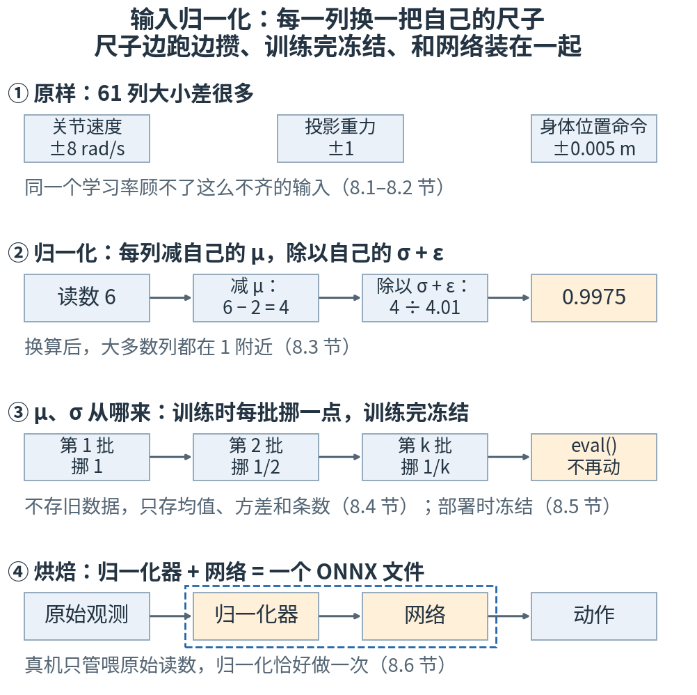
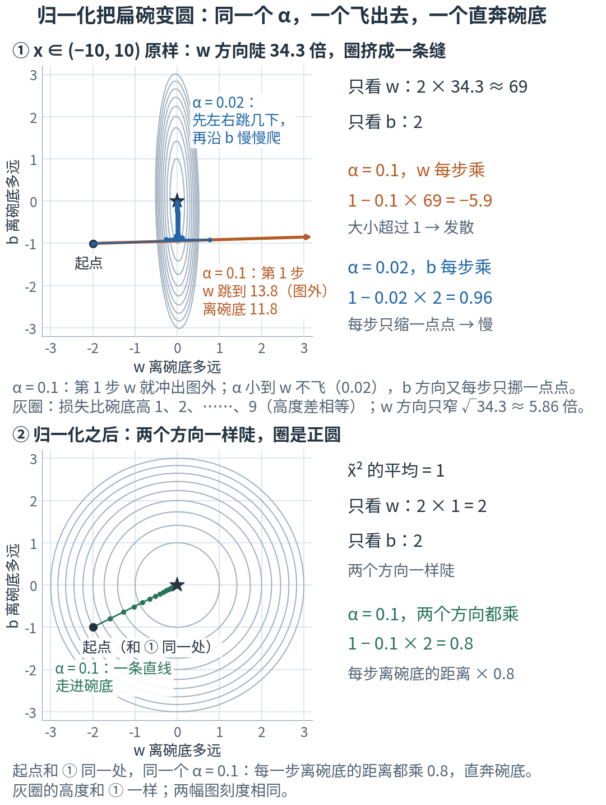
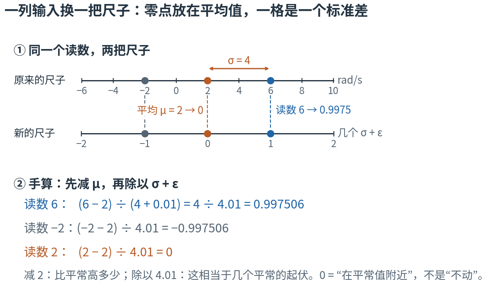
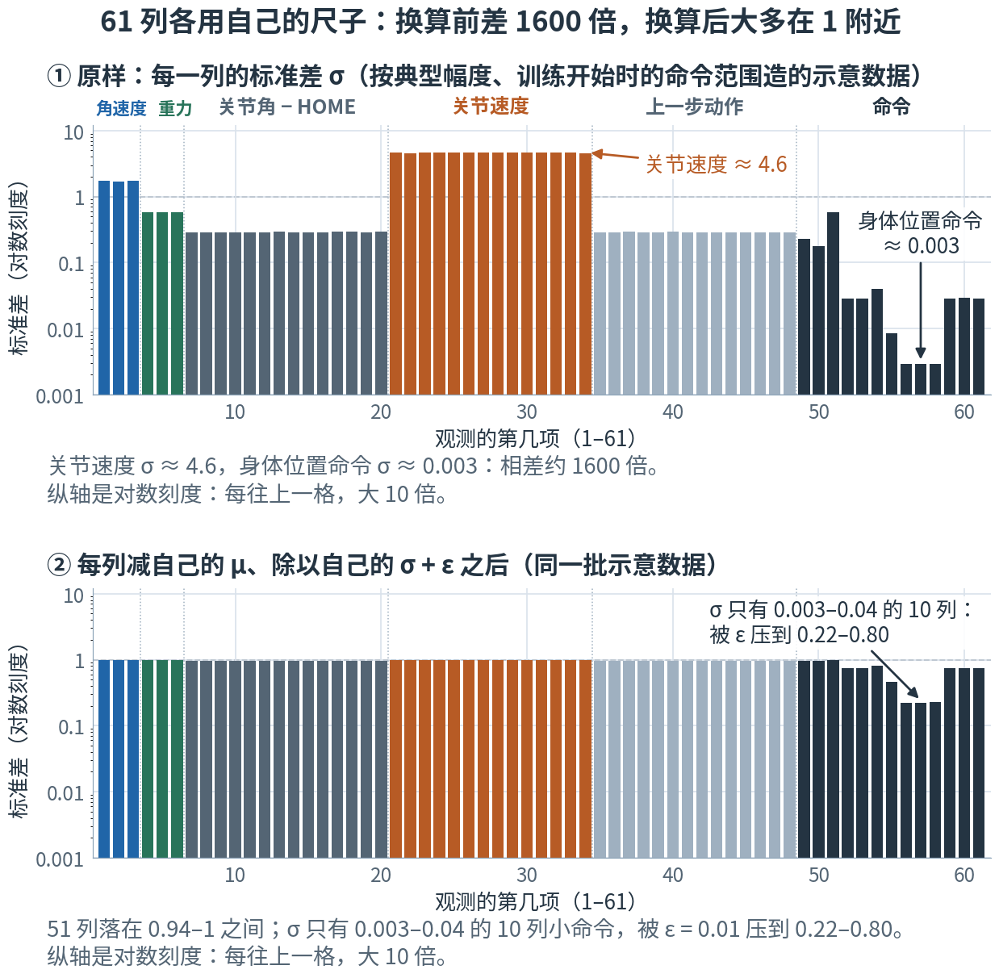
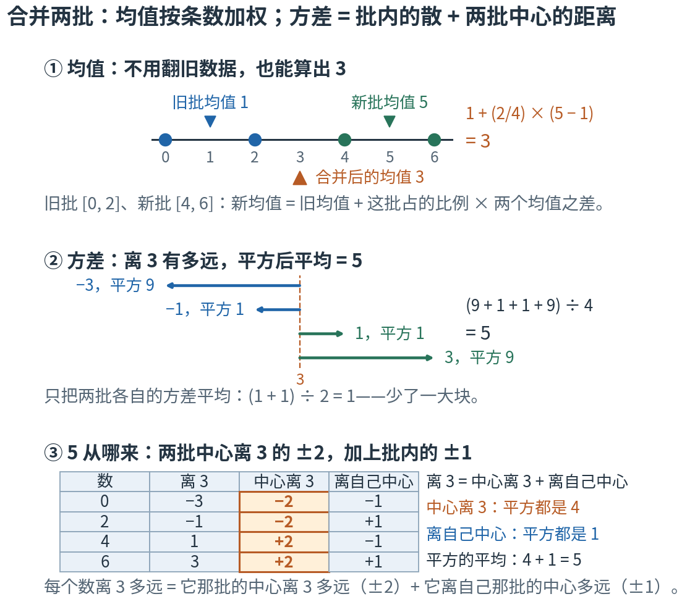
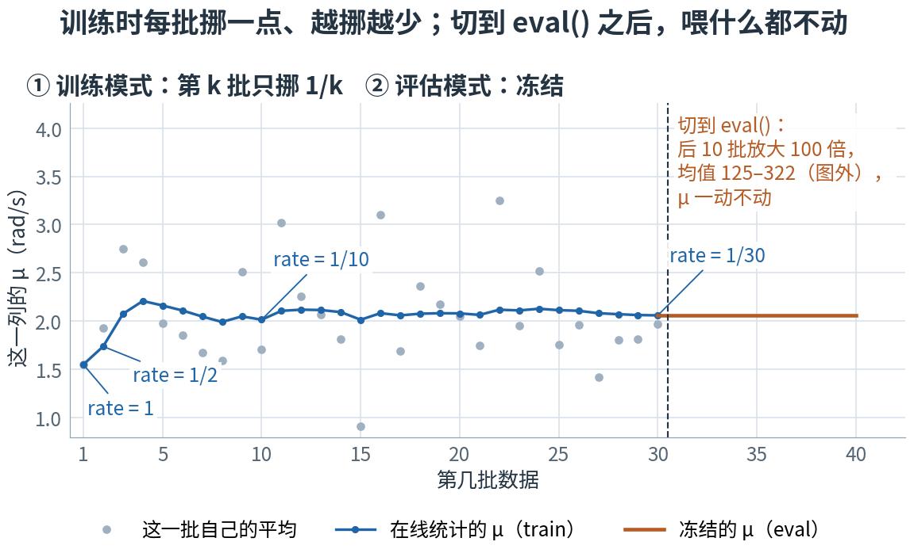
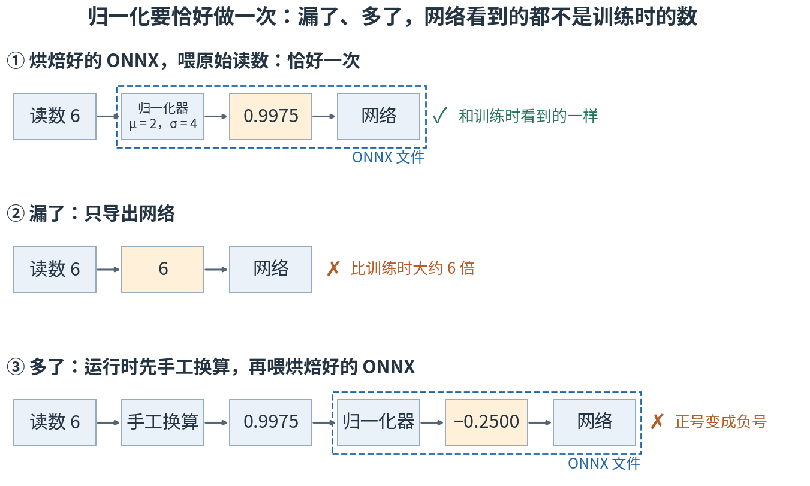

# 第 8 章 · 输入归一化：61 项输入，各用自己的尺子

> **上一章我们有了什么**：第 7 章（反向传播与优化器）：梯度怎样一层层算出来，优化器怎样照着梯度去拧旋钮。第 2 部"学习"的零件，只差最后一样了。
>
> **这一章要补什么**：第 3 章 🧪 改一改的第 2 条埋过一个伏笔：把找直线用的 x 从 (−1, 1) 放大到 (−10, 10)，同一个学习率 0.1 就发散了。
> 机器人交给网络的观测有 61 项，单位五花八门：关节速度动辄几 rad/s，身体位置的命令只有几毫米。喂给网络之前，得先把每一项换算到差不多的大小。
> 这一步看起来是个小细节，却是仓库里写明的"不变量"（`AGENTS.md` 里列出的、任何改动都不许打破的规矩）之一：**归一化器必须烘进导出的 ONNX 文件**。忘了它，策略在仿真里好好的，上了真机就乱了。这一章讲清为什么。
>
> **本章新词**：归一化、在线统计、冻结、烘焙。
> **需要的前提**：第 3 章 3.5、3.6 节（找直线的循环、学习率的门槛），第 4 章 4.3、4.4 节（均值、方差、标准差）和 4.7 节的 $(x-\mu)/\sigma$，第 2 章 2.7 节的 `dim=0`。
> **不要求**记得第 7 章的推导——本章只用到"优化器照着梯度拧旋钮"这一句。标"进阶"的折叠块可以第二遍再读。

---

## 8.0 先看地图：每一列换一把自己的尺子

**观测的 61 项各有各的单位和大小。每一项先减去自己的平均值、再除以自己的标准差，就都变成"比平常高出几个起伏"——这叫归一化。
平均值和标准差是训练时边跑边攒出来的（在线统计）；训练一结束就定住不再变（冻结）；导出时和网络装进同一个文件（烘焙），真机只管喂原始读数。**

先想象你在看全国的天气预报。哈尔滨一月零下 20 °C，没人觉得稀奇；广州一月要是降到 2 °C，就是罕见的寒潮。
同一个温度读数，放在不同城市意思完全不同。要判断"冷不冷"，得先问两件事：比这座城市平常冷多少？这相当于它平常起伏的几倍？
气象台的做法是：每座城市各记一份"常年平均"和"常年起伏"，每天新读数进来就顺手更新一下，不用把几十年的旧档案全翻出来重算；
预警标准一旦发布，就固定下来，不再跟着每天的数据变；再把这份标准直接写进每座城市的预警程序，现场的人只管读温度计。

机器人的 61 项观测就是 61 座"城市"：关节速度、投影重力、命令……各有各的平常值和起伏。



**读图顺序：** 从 ① 到 ④ 竖着读。① 是问题：同样是一个数，关节速度能到 ±8 rad/s，身体位置命令只有 ±0.005 m。② 是做法：每一列减自己的平均、除以自己的起伏（分母上的 ε 是防止除以 0 的小数 0.01，8.3 节讲）。
③ 回答"平均和起伏从哪来"：训练时每来一批数据就挪一点，而且越挪越少；训练完就不再动。④ 回答"部署时怎么保证照做"：把换算和网络装进同一个文件。
图里的数现在不用算，8.1–8.6 节会一个一个算出来。

| 概念 | 它在回答什么问题 | 天气预报里对应什么 | 在哪一节 |
|---|---|---|---|
| 尺度不齐 | 为什么同一个学习率会顾此失彼？ | 拿同一条"零下几度算冷"去套所有城市 | 8.1、8.2 |
| 归一化 | 怎样把每一列换成同一种说法？ | "比当地平常冷几个常年起伏" | 8.3 |
| 在线统计 | 平均和起伏从哪来？不存旧数据怎么算？ | 每天顺手更新常年平均，不翻旧档案 | 8.4 |
| 冻结 | 部署以后，平均和起伏还变不变？ | 预警标准发布后就固定 | 8.5 |
| 烘焙 | 怎样保证部署时恰好换算一次？ | 把标准直接写进预警程序 | 8.6 |

表里的名字先不背，到了各节再给。本章最容易混的四处，先贴上标签：

- **归一化和标准化**：是同一件事。第 4 章 4.7 节说过，$(x-\mu)/\sigma$ 这一步本书叫归一化，统计里也叫标准化。本章对网络的每一项输入各做一次。
- **第三个 σ**：第 4 章 4.9 节末"全书的三个 σ"里，第三个就是本章的——**从采到的数据里统计出来的**、每一项输入自己的标准差。
  它不是第 1 章钟形打分的宽容度，也不是第 4 章 4.7 节动作那口钟的标准差。本章的 μ 同理：它是这一项输入的历史平均，不是网络输出的动作均值。
- **本章的 ε 和第 4 章 4.7 节的 ε**：字母相同，意思毫不相干。那里的 ε 是从标准钟里抽出来的随机数；本章的 ε 是一个固定的小数 0.01，只为防止除以 0（8.3 节）。
- **训练时的 μ、σ 和部署时的 μ、σ**：是同一组变量，只是训练时每来一批就挪一点，部署时停在最后那一刻。管它停不停的开关是 `train()` / `eval()`，不是名字很像的 `no_grad()`（8.5 节有 ⚠️）。

现在觉得这些区别有点抽象很正常，读到对应小节就清楚了。

第一次读，只要按顺序看正文、图片和手算。标着"进阶"的折叠内容可以先跳过；代码是复核工具，不是阅读门槛。

## 8.1 伏笔兑现：输入放大 10 倍，同一个学习率就飞

第 3 章 🧪 改一改的第 2 条，让你把找直线用的 50 个 x 从 (−1, 1) 放大到 (−10, 10)，再用同一个学习率 α = 0.1 去跑。
如果你跑过，会看到损失一路涨成天文数字，第 3 章实验打印的门槛从 0.9957 掉到了 0.0292。这一节先用第 3 章 3.6 节的办法，把这件事手算出来。

### 为什么放大 10 倍，门槛就小 100 倍

照第 3 章 3.6 节"只看一个旋钮"的办法。只看 b 的那一半，3.6 节已经算过：$\partial L/\partial b$ 动 2，单看 b 门槛是 1，和 x 有多大无关。
只看 w：w 动 1，第 i 个点的误差动 $x_i$，于是 $\partial L/\partial w$（第 3 章 3.5 节那张表里"2·e·x"那一列的平均，e 是误差）就动"2 × x² 的平均"。

- x 在 (−1, 1) 里：x² 的平均是 0.343（实验第 1 节从那 50 个 x 算出），w 方向 2 × 0.343 ≈ 0.69。单看 w 每步乘 1 − 0.69α，这个乘数不能小于 −1（3.6 节），所以门槛是 2 ÷ 0.69 ≈ 2.9——正是第 3 章 3.6 节说的"w 方向缓得多，单看它门槛约 2.9"。
- x 放大 10 倍：x² 放大 100 倍，平均变成 34.3，w 方向 2 × 34.3 ≈ 69。单看 w 的门槛 2 ÷ 69 ≈ 0.029。

**陡 100 倍，门槛小 100 倍**（第 3 章 3.6 节的规则）：2.9 ÷ 100 ≈ 0.029。w、b 互相牵连，精确的门槛由实验算出来是 0.0292，单看 w 的估计已经很准。α = 0.1 是它的三倍多。

### 四种跑法，各走 100 步

实验第 1 节把找直线的循环跑了四遍，都从 w = 0、b = 0 出发，都走 100 步。(−10, 10) 那组数据和第 3 章同一种造法、同一个种子，改一改第 2 条跑的就是它：

```
                   数据     α             w             b  100 步后的损失
-----------------------  ----  ------------  ------------  --------------
 x ∈ (−1, 1)（第 3 章）   0.1       2.02442       1.00206      0.00993478
          x ∈ (−10, 10)   0.1  -1.14149e+77  -1.84119e+75    4.46717e+155
  x ∈ (−10, 10)，α 调小  0.02       2.00289      0.984961       0.0102188
x ∈ (−10, 10)，归一化后   0.1       11.6734       2.07675      0.00993373
```

表里的 `e+77`、`e+155` 是第 3 章 3.6 节的科学计数法："乘以 10 的 77 次方"。逐行看：

1. 第一行就是第 3 章那张九行表的第 100 步，原样没变。
2. 第二行：α = 0.1 超过门槛，发散了。w 离碗底的距离一步一步是 −2.0 → 11.8 → −69.2 → 405.1，每步乘约 −5.9——正是单看 w 的乘数 1 − 0.1 × 69 = −5.9（第 3 章 3.6 节：乘数的大小超过 1 就发散）。实验打印的相邻两个相除是 −5.91、−5.85、−5.86，都在 −5.9 上下、不正好相等：b 也在跟着动，两个旋钮互相牵连。
3. 第三行：把 α 调小到 0.02，低于门槛，w 不飞了。可 b 方向每步只乘 1 − 0.02 × 2 = 0.96：b 起点离最好的值差 1.0，乘 100 次 0.96 还剩 0.017，100 步后损失还停在 0.0102，没降到碗底的 0.00993。
   **α 小到 w 不飞，b 就走不动：一个学习率顾不了两头。**
4. 第四行：先把 x 归一化（第 4 章 4.7 节那一步：减均值、除以标准差），α 还用原来的 0.1。100 步后损失 0.00993373，正是这 50 个点上最好的那条直线能做到的（第 3 章 3.5 节说过，剩下的是数据自带的噪声）——比第 3 章原来那一行（0.00993478）还更贴近碗底。两组 x 只差一个放大倍数，最好的直线剩下的是同一份噪声，碗底都是 0.00993373；第 3 章那一行 100 步还差一点点没到。

### 归一化做了什么：两个方向一样陡

这组 x 的平均 μ = 0.537、标准差 σ = 5.829。每个 x 换成 $\tilde x = (x - 0.537)/5.829$ 之后，按第 4 章 4.7 节的结论，$\tilde x$ 的平均是 0、标准差是 1。
标准差 1 就是方差 1；方差是"离平均的距离的平方"的平均（第 4 章 4.4 节），而 $\tilde x$ 的平均正好是 0，所以"$\tilde x^2$ 的平均"就是方差，等于 1。

再照上面"只看 w"算一遍：w 方向 2 × 1 = 2，和 b 方向的 2 一样陡，两个方向的门槛都是 1。
α = 0.1 时，两个方向每一步离碗底的距离都乘 1 − 0.1 × 2 = 0.8——不再有一头飞、一头慢。



**这样读图：** 两幅图的桌面都是"w、b 各自离碗底多远"，碗底都挪到了正中间的 ★，两只碗的形状才好直接比。两幅图刻度一样，灰圈都是"损失比碗底高 1、2、……、9"，高度差相等。
第 3 章的小结说过：相邻两圈高度差相同时，圈越密，坡越陡。
① 原样的碗：圈在 w 方向挤成一条缝——w 方向比 b 方向陡 34.3 倍（2 × 34.3 ÷ 2，就是 x² 的平均）。圈在 w 方向只比 b 方向窄约 5.86 倍（√34.3），不是 34.3 倍：损失跟"离碗底的距离"的平方走，5.86 × 5.86 ≈ 34.3。
橙色箭头是 α = 0.1 的第 1 步：w 从 0 直接跳到 13.8（离碗底 11.8），冲出图外。
蓝色是 α = 0.02：先在 w 方向左右跳几下站稳，再沿着 b 往上爬——蓝点挤成密密的一串，就是每步只挪一点点；100 步后 b 还差 0.017，图上已经看不出来，可损失还没到碗底。
② 归一化之后：圈是正圆，两个方向一样陡。为了和 ① 直接比，起点特意放在和 ① 同一处；表里第四行是从 (0, 0) 出发的，离碗底更远（w 差 11.67、b 差 2.08）。
同一个 α = 0.1，绿色路径是一条直线，每一步离 ★ 的距离都乘 0.8。圆碗上从哪里出发都一样：每一步都正对着碗底，表里那一行走的也是这样一条直线。

还有两件顺带的事：

- (−10, 10) 那组 x 正好是 (−1, 1) 那组的 10 倍（同一个种子），归一化之后两组变成同一串数：$(10x - 10\mu)/(10\sigma) = (x-\mu)/\sigma$，放大的倍数被上下约掉了。**归一化之后，输入原来用多大的单位，网络就不再关心。**
- 第四行的 w 是 11.67，不再是 2。因为它现在回答的是"$\tilde x$ 动 1 时 y 动多少"，而 $\tilde x$ 动 1 就是 x 动一个 σ：2.0026 × 5.829 = 11.67（2.0026 是这组数据上最好那条直线的斜率）。
  **网络学到的旋钮，是配着这一组 μ、σ 才对的**——8.6 节会回到这一点。

第 7 章（优化器）的 Adam 从另一侧帮忙：它按每个旋钮自己的历史，换算每一步的步子。项目两样都用；归一化是从源头，也就是输入这一侧，把尺度拉齐。

> **停一下，自测**：反过来，把 x 缩小到 (−0.1, 0.1)。单看 w 的门槛变大还是变小，大约多少？α = 0.1 会发散吗？会不会有别的麻烦？归一化之后呢？
> <details><summary>答案</summary>
>
> x 缩小 10 倍，x² 缩小 100 倍：平均约 0.00343，w 方向 2 × 0.00343 = 0.00686，门槛 2 ÷ 0.00686 ≈ 290——大得很，α = 0.1 不会发散。
> 麻烦在另一头：w 每步只乘 1 − 0.1 × 0.00686 ≈ 0.9993，离碗底的距离缩到十分之一，要走三千多步（实验第 1 节打印了步数）。**放大会飞，缩小会慢。**
> 归一化之后，$\tilde x$ 还是"平均 0、标准差 1"，门槛回到 1，两种情况一样好走。
>
> </details>

## 8.2 61 项观测：每一列有自己的平常值和起伏

机器人每一步交给网络 61 个数（第 2 章 2.6 节：网络第一层就是一张 512 行 61 列的价格表）。先看它的迷你版：3 只机器人、每只 2 项观测，
形状和第 2 章 2.7 节那张误差表一样是 `[3, 2]`（数是为了好算编的）：

| | 关节速度（rad/s） | 投影重力的前后分量 $g_x$ |
|---|---|---|
| 机器人 A | 5 | 0.2 |
| 机器人 B | 1 | 0 |
| 机器人 C | −3 | −0.2 |

（$g_x$ 是第 2 章 2.4 节那根"机身前"轴上的重力分量：站直是 0，前倾 30° 是 0.50。）

**每一列各算各的。** 关节速度这一列的平均是 (5 + 1 − 3) ÷ 3 = 1；重力这一列是 (0.2 + 0 − 0.2) ÷ 3 = 0。
这正是第 2 章 2.7 节的 `sum(dim=0)`——"每一列跨机器人的合计"——再除以 3；写成代码是 `mean(dim=0)`，结果的形状是 `[2]`：每列一个平均。

两列离自己的平均有多远？关节速度那一列最远 4（5 − 1 = 4，−3 − 1 = −4），重力那一列最远 0.2。**同样是"正常的起伏"，一列是另一列的 20 倍。**

要是图省事，把六个数混在一起算一个平均：(5 + 1 − 3 + 0.2 + 0 − 0.2) ÷ 6 = 0.5。这个 0.5 是什么单位？rad/s 和无单位的重力分量加在一起——正是第 2 章 2.7 节说的"3 公斤 + 2 米"：数算得出来，意思没有。

大小不齐为什么是个麻烦？网络第一层给每一列配一个"价格"（权重）。关节速度这列的数大 20 倍，要让它和重力那列说得上话，它的价格就得小 20 倍；
而这个价格的偏导数里乘着输入本身（就像 8.1 节的"2·e·x"），这个方向也就陡得多。**这就是 8.1 节的病，只是一下子出现在 61 个方向上。**

还有一条铁律：归一化只是**每一列各自**换算，既不交换列，也不改变 61 项的顺序。训练时第 7 项是什么量，部署时第 7 项就必须还是它。仓库把"61 项的布局"列为不变量：走路、站立、做动作的各个策略都用同一种布局，真机上才能随时换着用。

### 真实的 61 项

项目里这 61 项分成 6 块（每一块是什么，第 15 章（61 维观测逐位拆解）逐位讲）。下表的"典型幅度"是按各项物理上大概能有多大估出来的示意数，不是实测；
只有两处是项目里定死的：投影重力是单位向量的分量，最大就是 1；命令那 13 列的范围取自项目的环境配置文件（代码里叫 env cfg；这是训练开始时的采样范围，实验第 2 节从源码核对）：

| 观测块 | 列数 | 典型幅度 | 单位 |
|---|---|---|---|
| 身体角速度 | 3 | ±3 | rad/s |
| 投影重力 | 3 | ±1 | 无单位 |
| 关节角 − HOME（HOME = 站立时的关节角） | 14 | ±0.5 | rad |
| 关节速度 | 14 | ±8 | rad/s |
| 上一步动作 | 14 | ±0.5 | rad |
| 命令 | 13 | ±0.005 到 ±1 | m/s、rad/s、m、rad |

命令那 13 列：走的速度前后 ±0.4 m/s、左右 ±0.3 m/s，转的速度 ±1 rad/s；头的 4 个角度 ±0.015 到 ±0.07 rad；身体的位置 ±0.005 m、角度 ±0.05 rad。这是训练开始时的范围：头的 4 个在训练中途会逐步放宽，最后到 ±0.31 到 ±1.4 rad；身体的 6 个一直不变。

关节速度的 ±8，是投影重力 ±1 的 8 倍、走路速度命令 ±0.4 的 20 倍、身体位置命令 ±0.005 的 1600 倍。8.3 节会把这张表画成 61 根条，看换算前后各是什么样。

> **停一下，自测**：有人说："分开统计太麻烦了。把 61 列倒成一大堆，算一个总平均、一个总标准差，所有列统一减、统一除，不也行吗？"行不行？
> <details><summary>答案</summary>
>
> 不行。所有列减同一个数、除同一个数，等于把整张表整体挪动、整体缩放——列与列之间的倍数一点没变，关节速度还是身体位置命令的 1600 倍。
> 何况那个总标准差几乎全由关节速度那几列决定，小的那些列除完之后更是挤在 0 附近。要拉齐，必须每一列用自己的平均和标准差。
>
> </details>

## 8.3 归一化：每一列先减自己的平均，再除以自己的标准差

### 手算一列

关节速度这一列，训练时攒了很多读数：平均 μ = 2 rad/s、标准差 σ = 4 rad/s（第 4 章 4.3、4.4 节的均值和标准差；这两个数是为了好算编的）。现在又读到 6 rad/s。网络该看到什么数？

1. **减平均**：6 − 2 = 4。"比平常高 4 rad/s。"
2. **除以标准差**：4 ÷ 4 = 1。"高出的这 4，正好是一个平常的起伏。"

项目的代码在分母上多加了一个很小的数 0.01（下面叫它 ε）：

$$\frac{6-2}{4+0.01} = \frac{4}{4.01} = 0.997506$$

比 1 小一点点。别的读数照样算：−2 变成 $(-2-2)/4.01 = -0.997506$；正好等于平均值的读数 2，变成 0。



**这样读图：** ① 上下两把尺子对齐放：上面是原来的 rad/s，下面是换算后的新尺子。新尺子的零点放在平均值 2 上，一格的长度是 σ + ε = 4.01。
虚线把同一个读数在两把尺子上的位置连起来：6 落在新尺子的 0.9975，−2 落在 −0.9975，2 落在 0。② 是同一组手算。
看懂的标志：**换算不挪动读数，只换一套刻度。**

两处容易想错：

- 0.997506 不是说关节现在转 0.997506 rad/s，而是"比平常高出约 1 个起伏"。
- 换算后的 0 是"在这一列的平常值附近"，不一定是物理上的静止。关节速度的平均是 2，读数 2 才换算成 0；关节真的一动不动（读数 0），换算出来是 $(0-2)/4.01 = -0.4988$。

### 分母上为什么要加 ε

假如某一列从来不变——比如某个命令在整个训练里一直是 0——它的标准差 σ = 0，照原样除就是除以 0。分母加上 ε = 0.01，就永远不会除以 0。
这是唯一的理由：对 σ = 4 这种正常的列，4 和 4.01 几乎没差别。

> ⚠️ **本章的 ε 不是第 4 章 4.7 节的 ε。** 那里的 ε 是从标准钟里随机抽出来的噪声；这里的 ε 是一个固定的小数 0.01，代码里叫 `eps`。字母相同，意思毫不相干。

### 名字与公式

每一列减去自己的平均、再除以自己的（标准差 + ε），这叫**归一化**（normalization）。第 4 章 4.7 节说过，统计里也叫它标准化，是同一件事。61 列各做一次：

$$\tilde{x}_j = \frac{x_j - \mu_j}{\sigma_j + \varepsilon}, \qquad j = 1, 2, \ldots, 61$$

| 符号 | 怎么读 | 就是 |
|---|---|---|
| $x_j$ | "x j" | 观测的第 j 项（第 j 列）此刻的读数。8.1 节那条直线只有一个输入 x；机器人有 61 个，用下标 j 区分 |
| $\mu_j$ | "缪 j" | 第 j 列**自己的**平均（8.4 节讲它怎么攒出来） |
| $\sigma_j$ | "西格玛 j" | 第 j 列**自己的**标准差。61 列各有一对 $\mu_j$、$\sigma_j$ |
| $\varepsilon$ | "艾普西龙" | 固定的小数 0.01，只为防止 $\sigma_j = 0$ 时除以 0 |
| $\tilde x_j$ | "x j 波浪" | 换算后、真正交给网络的第 j 个数 |
| $j = 1, 2, \ldots, 61$ | "j 从 1 到 61" | 每一列各做一次，互不相干 |

写成 JS，就是一个带下标的 `map`：

```js
// mu、sd 各是 61 个数的数组：每一列一对
const xt = obs.map((x, j) => (x - mu[j]) / (sd[j] + 0.01));
```

回到 8.2 节的迷你表，每列各用自己的平均和标准差（除以条数 3，第 4 章 4.4 节的算法）：

- 关节速度列：偏差 4、0、−4，$\sigma = \sqrt{(16 + 0 + 16)/3} = 3.266$（浏览器控制台里按一下 `Math.sqrt(32/3)`）。机器人 A 的 5 换算成 4 ÷ (3.266 + 0.01) = 1.221。
- 重力列：偏差 0.2、0、−0.2，$\sigma = \sqrt{0.08/3} = 0.1633$。机器人 A 的 0.2 换算成 0.2 ÷ (0.1633 + 0.01) = 1.154。

原来差 20 倍的两列，换算后都在 1.2 上下。第二列略小一点，是因为 ε = 0.01 相对 0.1633 已经不算太小——这一点在 61 列上看得更清楚。

### 61 列各做一次

实验第 3 节按 8.2 节表里的典型幅度造了一批假观测（4096 行 × 61 列，每一列在 ±典型幅度 之间均匀地散开），交给项目用的归一化器，再把换算前后每一列的标准差画成 61 根条：



**这样读图：** 横轴是观测的第几项，颜色区分 6 块；纵轴是这一列的标准差，用的是对数刻度（第 3 章 3.5 节用过）：每往上一格，大 10 倍。
① 换算前：最高的是关节速度那 14 列（约 4.6），最矮的是身体位置命令那 3 列（约 0.003），差约 1600 倍。条的高度是标准差，比表里的典型幅度小一些：数在 ±幅度 之间均匀散开时，标准差约是幅度的 0.58 倍。
② 换算后：51 列落在 0.94 到 1 之间，几乎一样高。例外是头和身体的 10 列小命令：它们的 σ 只有 0.003 到 0.04——最小的比 ε = 0.01 还小，最大的也只有 ε 的 4 倍。分母 σ + ε 里 ε 占了不小的一份，于是被压到 0.22–0.80。
它们没有变成 0，网络仍然看得见它们的变化，只是比别的列"声音小"一些。
这批假数据用的是训练开始时的命令范围（8.2 节）。真训练里，头的 4 个命令后来放宽到 ±0.31 到 ±1.4 rad，攒出来的 σ 大得多，那 4 列最后不会被压小；一直被压着的是身体的 6 列。

归一化只挪零点、换刻度，**不改变一列数的形状**：一列只有两种取值（比如 0 和 1），换算后还是只有两种取值。
它也不会把谁"夹"在 ±1 以内：关节速度读到 10，换算后是 (10 − 2) ÷ 4.01 = 1.995012，照样交给网络。

> **停一下，自测**：回到 8.0 节的天气预报。哈尔滨一月平均 −18 °C、起伏（标准差）5 °C，今天 −20 °C；广州一月平均 14 °C、起伏 3 °C，今天 2 °C。
> 各换算成"几个起伏"（这里不加 ε），哪边更反常？
> <details><summary>答案</summary>
>
> 哈尔滨：(−20 − (−18)) ÷ 5 = −2 ÷ 5 = −0.4，比平常冷一点点，很正常。
> 广州：(2 − 14) ÷ 3 = −12 ÷ 3 = −4，比平常冷了 4 个起伏，非常反常。
> 原始读数 −20 比 2 低得多，换算后却是广州更反常——这就是"每一列用自己的尺子"。
>
> </details>

> **停一下，自测**：某一列的读数从来没变过，一直是 3（σ = 0）。加了 ε 之后不会除以 0 了，那这一列换算成什么？它能给网络提供信息吗？
> <details><summary>答案</summary>
>
> 平均就是 3，所以每次都是 (3 − 3) ÷ (0 + 0.01) = 0。ε 只防止除以 0；分子本身就是 0，结果永远是 0，没有任何变化可学。**数值上安全，不等于凭空多出了信息。**
>
> </details>

## 8.4 在线统计：每来一批，把平均往这批挪一点

8.3 节假设"攒了很多读数"。可训练时数据是边跑边来的：4096 只机器人每走一步，就交来 4096 行新观测，一次训练要走几万步。
把它们全存下来再算平均，既占地方又慢。能不能**只记住现在的平均和条数，每来一批就更新一次**？

### 手算：先合并平均

旧的一批 [0, 2]（2 条，平均 1），新来一批 [4, 6]（2 条，平均 5）。四个数直接平均是 (0 + 2 + 4 + 6) ÷ 4 = 3。

不翻旧数据，只凭"旧平均 1、旧条数 2"也能算出来：新来的这批占了累计总条数的 2/4，新平均就从旧平均出发，朝这批的平均挪这么多：

$$1 + \frac{2}{4} \times (5 - 1) = 1 + 2 = 3$$

对上了。这种不存旧数据、每来一批就把统计往这批挪一点的做法，叫**在线统计**（running statistics）：

$$\mu_{\text{新}} = \mu_{\text{旧}} + \text{rate}\,(\mu_{\text{批}} - \mu_{\text{旧}}), \qquad \text{rate} = \frac{\text{这批的条数}}{\text{累计总条数}}$$

| 符号 | 怎么读 | 就是 |
|---|---|---|
| $\mu_{\text{旧}}$ | "缪 旧" | 这批来之前的平均（上例 1） |
| $\mu_{\text{批}}$ | "缪 批" | 新来这一批自己的平均（上例 5） |
| $\mu_{\text{新}}$ | "缪 新" | 更新后的平均（上例 3）。下一批来时，它就成了新的"旧" |
| rate | "rate"（比例） | 这批占累计总条数的几分之几（上例 2/4）。代码里就叫 `rate` |

rate 会自己越变越小。第一批来时，累计总数就是它自己，rate = 1：平均直接等于这批的平均，初始值被整个换掉。
每批一样多时，第 2 批 rate = 1/2，第 3 批 1/3……第 k 批只挪 1/k。项目里机器人每走一步（0.02 秒）来一批（4096 行）；训练按"迭代"计数，每次迭代每只机器人走 24 步（第 14 章（训练回路全貌）讲）。1000 次迭代就是 1000 × 24 = 24,000 批，之后 rate 只剩 1/24,000——统计几乎定住了。

```js
let mean = 0, count = 0;
for (const batch of batches) {            // 每来一批
  count += batch.length;                  // 累计总条数
  const rate = batch.length / count;      // 这批占几分之几
  mean += rate * (avg(batch) - mean);     // 往这批的平均挪一点
}
```

注意这里的"一批"，是机器人每走一步交来的 4096 行观测；它不是第 7 章（mini-batch）里为了更新网络而切出来的小批——这里既没有切分，也没有梯度。

### 方差不能只平均

平均可以这样挪；方差呢？旧批 [0, 2] 离自己的平均 1 各差 ±1，方差 1；新批 [4, 6] 离 5 也各差 ±1，方差也是 1。两个方差一平均：(1 + 1) ÷ 2 = 1？

直接看四个数离合并平均 3 的距离：−3、−1、1、3，平方是 9、1、1、9，平均 (9 + 1 + 1 + 9) ÷ 4 = **5**，不是 1。



**这样读图：** ① 蓝点是旧批、绿点是新批，▼ 是两批各自的平均，橙色 ▲ 是合并后的 3，右边是上面那行手算。
② 四根箭头是四个数离 3 有多远：只看每批自己，数离中心都只有 1；可两批的中心 1 和 5 本身就离 3 有 2，所以真实的箭头有的长到 3。
③ 把每根箭头拆成两段：它那批的中心离 3 多远（橙色一列，全是 ±2），加上它离自己那批的中心多远（全是 ±1）。前一段平方都是 4，后一段都是 1，合起来 5。

**合并方差 = 批内的散 + 两批中心相距带来的散。** 只平均两批的方差，就漏掉了后一块。
写成公式：设旧批 n 条、新批 m 条、共 N = n + m 条，两批平均之差 $d = \mu_{\text{批}} - \mu_{\text{旧}}$（方差照第 4 章 4.4 节写成 σ²）：

$$\sigma^2_{\text{新}} = \frac{n\,\sigma^2_{\text{旧}} + m\,\sigma^2_{\text{批}}}{N} + \frac{n\,m}{N^2}\,d^2$$

前一项是批内的散，后一项是批间的。代进上例（n = m = 2，N = 4，d = 4）：批内 (2 × 1 + 2 × 1) ÷ 4 = 1；批间 (2 × 2 ÷ 4²) × 4² = 4，前一个 4² 是 N²、后一个是 d²；合起来 5。
（这个例子里恰好有三个 4：总条数 N、两批平均差 d = 5 − 1、批间那一块，都是 4。纯属凑巧，它们不是同一个量：把新批换成 [6, 8]，N 还是 4，d 变成 6，批间变成 (2 × 2 ÷ 4²) × 6² = 9，合并方差 1 + 9 = 10。）

项目代码（rsl_rl 的 `EmpiricalNormalization`）把同一件事写成递推的样子，一行更新方差：

$$\sigma^2_{\text{新}} = \sigma^2_{\text{旧}} + \text{rate}\,\big(\sigma^2_{\text{批}} - \sigma^2_{\text{旧}} + d\,(\mu_{\text{批}} - \mu_{\text{新}})\big)$$

代进上例：rate = 0.5，$1 + 0.5 × (1 − 1 + 4 × (5 − 3)) = 1 + 0.5 × 8 = 5$。结果一样。
实验第 4 节把 [0, 2]、[4, 6] 两批真的喂给项目用的这个类：第一批后它存的平均 1、方差 1（rate = 1：初始的平均 0 被整个换成这批的 1；方差的初始值恰好也是 1，看不出换没换），第二批后平均 3、方差 5、标准差 $\sqrt 5 = 2.236$。

<details>
<summary>进阶：为什么递推写法和"批内 + 批间"是同一个数（现在可跳过）</summary>

记 r = rate = m/N，那么 1 − r = n/N，并且 $\mu_{\text{新}} = \mu_{\text{旧}} + r\,d$，所以 $\mu_{\text{批}} - \mu_{\text{新}} = d - r\,d = (1 - r)\,d$。代进递推式：

$$\sigma^2_{\text{旧}} + r\,\big(\sigma^2_{\text{批}} - \sigma^2_{\text{旧}}\big) + r(1-r)\,d^2 = (1-r)\,\sigma^2_{\text{旧}} + r\,\sigma^2_{\text{批}} + r(1-r)\,d^2$$

前两项就是 $(n\,\sigma^2_{\text{旧}} + m\,\sigma^2_{\text{批}})/N$，最后一项的 $r(1-r) = nm/N^2$。两种写法逐项相同。

"批内 + 批间"本身为什么成立：每个数离合并平均的距离 = 它那批的中心离合并平均多远 + 它离自己那批的中心多远（上图 ③）。
平方展开以后多出一项"两段相乘"；而每一批里"离自己中心"的那些距离加起来正好是 0，这一项平均下来就没了，只剩两段各自平方的平均。

</details>

实验第 4 节还做了一个更大的核对：5 批、每批 64 行、4 列随机数，分别交给 rsl_rl、手写的同一套公式，再和"把 320 行攒齐了一次算"对照：

```
列  rsl_rl 均值    手写均值  全部攒齐再算  rsl_rl 标准差  全部攒齐再算
--  -----------  ----------  ------------  -------------  ------------
 0   -0.0790712  -0.0790712    -0.0790712       0.916372      0.916372
 1      3.39981     3.39981       3.39981        8.51455       8.51455
 2    -0.973307   -0.973307     -0.973307       0.535507      0.535507
 3      4.94173     4.94173       4.94173         3.1049        3.1049
```

三种算法逐位一致：**在线更新和攒齐了再算，结果一样，但不用存数据。**

> **停一下，自测**：接着上面的例子（现在是 4 条，平均 3、方差 5），第三批 [3, 3] 进来。新的平均和方差各是多少？方差为什么变小了？
> <details><summary>答案</summary>
>
> 累计 6 条，rate = 2/6 = 1/3。平均：3 + (1/3) × (3 − 3) = 3，没动。
> 方差用"批内 + 批间"：批内 (4 × 5 + 2 × 0) ÷ 6 = 20 ÷ 6 = 3.333；两批平均差 d = 0，批间是 0。所以方差从 5 降到 3.333。
> 直接核对：六个数 0、2、4、6、3、3 离 3 的距离平方是 9、1、1、9、0、0，平均 20 ÷ 6 = 3.333。新来的两个数正好落在中心，把整体的"散"冲淡了。
>
> </details>

## 8.5 训练时更新，部署时冻结：同一组 μ、σ 的两种状态

训练中，μ 和 σ 每一步都在挪（虽然越挪越少）。部署到真机以后，它们**不能再变**：同一个观测，今天和明天必须换算成同一个数；
网络的旋钮是配着训练结束那一刻的 μ、σ 调出来的（8.1 节的 11.67 就是例子）；何况真机上会出意外——摔一跤、传感器抽风——要是还在更新，这些离谱读数会悄悄挪动尺子。

所以归一化器要有两种状态。先认清它的两个动作：`update()` 照 8.4 节更新统计，`forward()` 照 8.3 节把读数换算成 $\tilde x$。两种状态由一对开关管着：

| 开关 | 什么时候用 | `update()` 做什么 | μ、σ |
|---|---|---|---|
| `train()`（训练模式） | 训练时采数据 | 照 8.4 节更新 | 每批挪一点 |
| `eval()`（评估模式） | 回放（play：在仿真里把训练好的策略跑给人看）、导出 | 第一行就直接返回 | 停在最后一次更新的值 |

μ、σ 从此停止更新、固定不变，叫**冻结**（freeze）。代码里就是 `update()` 开头的两行：`if not self.training: return`——不在训练模式，就什么也不做。
另外要分清：`forward()` 只**读** μ、σ，从来不改；改统计的只有 `update()`。真机上跑的是导出的 ONNX 文件（8.6 节），里面只有 `forward()` 这一步，μ、σ 是写死的数，根本没有 `update()` 可调。



**这样读图：** 实验用随机数造了 40 批数据，每批 64 个数，真实的平均是 2、标准差是 4（就是 8.3 节那一列）。灰点是每一批自己的平均，在 2 上下乱跳；蓝线是在线统计的 μ。第 1 批 rate = 1，μ 直接等于这批的平均 1.55；第 2 批 rate = 1/2，挪一半；
到第 10 批、第 30 批，每次只挪 1/10、1/30，蓝线越来越平，停在 2 附近。
竖虚线处切到 `eval()`：后 10 批数据放大了 100 倍，每批均值都在 100 以上（画不下），橙线却纹丝不动。

> ⚠️ **`eval()` 才冻结统计，`no_grad()` 不管这件事。** `no_grad()`（和它的同类 `inference_mode()`）是另一个开关，管的是"要不要为反向传播（第 7 章）记账"。
> 两者名字都像"推理时用的"，职责完全不同。项目自己就是例子：采数据的那一段整个包在 `torch.inference_mode()` 里，不记账；可模型处在训练模式，统计照样每一步更新（📍 里有这几行）。
> 只包一层 `no_grad()`、忘了切 `eval()`，挡不住统计被更新。实验第 5 节三种组合都试了一遍：

| 开关 | 调用 `update()` 后，统计会不会变 |
|---|---|
| `train()` + `no_grad()` | 会 |
| `train()` + `inference_mode()` | 会 |
| `eval()` | 不会 |

> **停一下，自测**：同事写了一段评估脚本：加载检查点（训练途中存下的整套网络参数），整段用 `with torch.no_grad():` 包住，让机器人在仿真里跑 10 分钟、中间摔了好几跤；
> 脚本照训练时的写法，每一步也调用了更新统计的函数，但没有调 `eval()`。跑完以后导出 ONNX。导出的 μ、σ 还是训练结束时的吗？
> <details><summary>答案</summary>
>
> 不是了。`no_grad()` 只让它不记求导的账；模型还处在训练模式，`update()` 照常执行，这 10 分钟（包括摔倒时）的数据已经挪动了 μ、σ。
> 导出时虽然会切 `eval()`，冻结的却是"此刻"的值——已经被带偏的值。正确做法是评估一开始就切 `eval()`；rsl_rl 拿策略去回放、导出用的 `get_inference_policy()`，第一件事就是切到评估模式。
>
> </details>

## 8.6 烘焙：把归一化器和网络装进同一个文件

训练完的策略要交给真机上的程序去跑。项目导出的格式叫 **ONNX**：把网络连同它的计算步骤存成一个文件的格式，真机上的程序不装 PyTorch 也能照着算（第 19 章（导出与部署）细讲）。

网络训练时看到的**永远是换算后的** $\tilde x$。所以部署时也必须先换算、再交给网络：

$$\text{动作} = \text{网络}\big(\text{归一化}(\text{观测})\big)$$

有两种做法：

1. 真机程序自己减 μ、除以 σ + ε，再交给网络。那它就得拿到这 61 对数（还有 ε），一个都不能错，顺序不能乱。
2. **把归一化器和网络合成一个模块，一起导出。** 真机程序只管交原始观测，换算已经在文件里了。

项目用第 2 种，这叫**烘焙**（bake in）：像把调料烤进面包里，拿到面包的人不用再撒一遍。
实验第 6 节用一行代码演示：`baked = Sequential(norm, net)`，先归一化器、后网络，拼成一个新模块；再核对 `baked(x)` 和 `net(norm(x))` 完全一样。导出 ONNX 时导的，就是这样一个整体。

8.1 节那个 11.67 在这里派上用场：网络学到的旋钮，是配着这一组 μ、σ 才对的。烘焙把旋钮和配套的 μ、σ 锁进同一个文件，拆不散，也配不错。

> ⚠️ **归一化要恰好做一次。** 漏做和多做都会把网络看到的数弄错，而且程序照常运行、一句错也不报。

还是 8.3 节那一列（μ = 2、σ = 4），读数 6，训练时网络看到的是 0.997506：

- **漏了**：只导出了网络、没带归一化器，真机把原始的 6 直接交给网络。同一个读数，训练时网络看到的是 0.997506，现在是 6，大了约 6 倍（6 ÷ 0.997506 ≈ 6.0）。
- **多了**：ONNX 里已经烘好了归一化器，运行时的程序又"好心"先手工换算一次。6 先变成 0.997506，进了 ONNX 又被换算一遍：

$$\frac{0.997506 - 2}{4.01} \approx -0.2500$$

（四舍五入到 4 位。用没舍入的 4/4.01 去算是 −0.249998，四舍五入到 4 位也是 −0.2500。）**正号变成了负号**：本来是"比平常快"，网络却读成了"比平常慢"。



**这样读图：** 蓝色虚线框是 ONNX 文件里装着的东西，淡黄格子是"网络真正看到的数"。① 恰好一次：0.9975，和训练时一样。② 漏了：6。③ 多了：−0.2500（中间那格 0.9975 只是 ONNX 收到的数，进门又被换算了一次）。
要检查的不是"代码里有没有归一化"，而是**从传感器到网络的整条路上，恰好换算一次，并且用的是训练存下的那一组 μ、σ**。

最麻烦的是：**这两种错，在仿真里回放时都看不出来。** 回放脚本用的是训练框架里的整个策略模型，归一化器本来就在里面，自动换算；
只有手工转出来、漏了归一化器的文件，或者多换算了一次的真机程序，上了真机才露馅。这就是 `AGENTS.md` 里那条不变量的由来：

> Obs normalization is ON → the normalizer must be baked into the ONNX. `scripts/export.py` does this; in-sim play hides the bug (it applies the normalizer anyway), so never hand-convert a checkpoint.

（大意：观测归一化是开着的，所以归一化器必须烘进 ONNX；`scripts/export.py` 会做这件事；仿真里回放反正会做归一化，把这个错藏了起来，所以绝不要手工转换检查点。）

**为什么重要**：这个项目的全部意义是"仿真里训练、真机上跑"。这类错在仿真里无影无踪，查它要花真机上的时间；把归一化器烘进导出文件，是从流程上让它根本发生不了。

> **停一下，自测**：有人从检查点里只拷出了网络那几层的权重，自己写了一段推理代码。用原来的回放脚本在仿真里看，一切正常；上了真机，动作乱七八糟。先查哪里？
> 如果改用 `scripts/export.py` 导出，真机程序里还要不要自己减 μ、除 σ？
> <details><summary>答案</summary>
>
> 先查整条输入路径上归一化做了几次、用的是不是训练存下的 μ、σ。他只拷了网络，最可能是漏了归一化：网络直接吃原始观测。仿真回放正常说明不了问题——回放用的是带归一化器的整个模型。
> 改用 `scripts/export.py` 以后，归一化器已经烘在 ONNX 里，真机程序**不能**再自己换算，否则就成了"多做一次"。
>
> </details>

## 📍 映射到项目

> 只需看一眼。语法看不懂没关系。

**这段代码做什么**：归一化器本身。`forward()` 就是 8.3 节的公式；`update()` 就是 8.4 节的在线统计，开头两行是 8.5 节的冻结。它在 `rsl_rl/modules/normalization.py` 的 `EmpiricalNormalization` 里：

```python
def __init__(self, shape: int | tuple[int, ...] | list[int], eps: float = 1e-2, until: int | None = None) -> None:  # ε 默认 0.01
...
def forward(self, x: torch.Tensor) -> torch.Tensor:
    return (x - self._mean) / (self._std + self.eps)          # 8.3 节：减自己的平均，除以（标准差 + ε）
...
def update(self, x: torch.Tensor) -> None:
    if not self.training:                                     # 8.5 节：不在训练模式（已经 eval()）……
        return                                                # ……就直接返回：冻结
    ...
    count_x = x.shape[0]                                      # 这一批有几行（项目里 = 4096 只机器人）
    self.count += count_x                                     # 累计总条数
    rate = count_x / self.count                               # 8.4 节的 rate：这批占累计总数的几分之几
    var_x = torch.var(x, dim=0, unbiased=False, keepdim=True) # 这批每一列的方差（dim=0：每列各算各的；除以条数）
    mean_x = torch.mean(x, dim=0, keepdim=True)               # 这批每一列的平均
    delta_mean = mean_x - self._mean                          # d = μ批 − μ旧
    self._mean += rate * delta_mean                           # μ新 = μ旧 + rate × d
    self._var += rate * (var_x - self._var + delta_mean * (mean_x - self._mean))   # 8.4 节的递推：批内 + 批间
    self._std = torch.sqrt(self._var)                         # 标准差 = 方差开平方根
```

**这段代码做什么**：归一化器住在策略网络的模型里。开关打开，就建一个归一化器；每次往前算，先换算、再进网络；导出用的版本里，它排在网络最前面——这就是烘焙。
它在 `rsl_rl/models/mlp_model.py` 的 `MLPModel` 和 `_OnnxMLPModel` 里：

```python
if obs_normalization:                                               # 配置里的开关（项目里是 True）
    self.obs_normalizer = EmpiricalNormalization(self.obs_dim)      # 建一个归一化器：actor 这边 obs_dim = 61 列
...
latent = torch.cat(obs_list, dim=-1)                                # get_latent()：把各组观测拼成一行 61 个数
latent = self.obs_normalizer(latent)                                # 先归一化（8.3 节），再交给后面的网络
...
self.obs_normalizer.update(mlp_obs)                                 # update_normalization()：拿这一批观测更新统计（8.4 节）
...
x = self.obs_normalizer(x)                                          # _OnnxMLPModel.forward()：导出版的第一步是归一化……
out = self.mlp(x)                                                   # ……然后才是网络。8.6 节的烘焙就是这两行
```

**这段代码做什么**：什么时候更新、什么时候冻结。训练一开始切到训练模式；采数据时整段包在 `inference_mode()` 里（不记求导的账），可每走一步照样更新一次统计——这正是 8.5 节的 ⚠️。
拿策略去回放、导出之前，先切到评估模式。它在 `rsl_rl/runners/on_policy_runner.py` 的 `OnPolicyRunner` 里：

```python
self.alg.train_mode()                                          # learn() 开头：训练模式，统计开始更新
...
with torch.inference_mode():                                   # 采数据这一段不记求导的账……
    for _ in range(self.cfg["num_steps_per_env"]):             # 每次迭代每只机器人走 24 步
        ...
        self.alg.process_env_step(obs, rewards, dones, extras) # ……可每走一步，都拿这 4096 行观测更新一次统计
...
self.alg.eval_mode()                                           # get_inference_policy()：拿策略去回放、导出之前，先冻结
...
onnx_model = self.alg.get_policy().as_onnx(verbose=verbose)    # export_policy_to_onnx()：取出“归一化器 + 网络”的导出版
onnx_model.eval()                                              # 再切一次评估模式，然后写成 ONNX 文件
```

正文还用到这几处，没有贴代码：`src/mjlab_microduck/tasks/microduck_velocity_env_cfg.py` 的 `MicroduckRlCfg` 里，actor 和 critic（第 10 章的价值网络）各写了一次 `obs_normalization=True`（两张网络各有一个归一化器），`num_steps_per_env=24`；
`rsl_rl/algorithms/ppo.py` 的 `process_env_step()` 每一步先调 `actor.update_normalization(obs)` 和 `critic.update_normalization(obs)`；
`src/mjlab_microduck/export.py` 开头的说明写着，它是从检查点到可部署 `.onnx` 的唯一正路，归一化器自动烘进去（`scripts/export.py` 只是它的命令行外壳）；它的 `run_export()` 在导出之前先调 `get_inference_policy()`，也就是先冻结；还有 `AGENTS.md` 的那条不变量。
第 19 章（导出与部署）会真的打开一个 ONNX 文件，看这一层。

实验第 7 节会核对：上面引用的这些代码行和常数，在你机器上的源码里还原样存在。

## 🧪 动手实验

```bash
uv run python docs/learn-zh/labs/ch08_normalization.py
```

1. 伏笔兑现：四种跑法各走 100 步的表（第 3 章那一行原样、(−10, 10) 发散、α 调小又太慢、归一化后到碗底），x² 的平均与门槛 0.9957 → 0.0292 → 1，w 离碗底的距离每步乘约 −5.9，11.67 = 2.0026 × 5.829，自测 (−0.1, 0.1)；画 `ch08_bowl_round.png`（扁碗与圆碗）。
2. 61 项有多不齐：`[3, 2]` 迷你表的每列平均（`mean(dim=0)`）、20 倍、混着算的 0.5，6 块观测的典型幅度表，并从 env cfg 核对命令 13 列的起始范围、头部命令后来放宽到的范围和动作的 scale。
3. 归一化：6 → 0.997506 的手算、项目的归一化器算出同样的数、ε 默认 0.01、σ = 0 的列、天气自测、迷你表换算成 1.221 和 1.154、4096 × 61 的假观测换算前后的标准差（含 10 列小命令的 σ 0.003–0.04）；画 `ch08_one_column.png`（两把尺子）和 `ch08_obs_scales.png`（61 根条）。
4. 在线统计：[0, 2] 与 [4, 6] 合并（均值 3，方差 5 = 1 + 4）、递推写法、项目的类、三个 4 的反例 [6, 8]、自测里的第三批 [3, 3]、5 批 × 4 列的三方对照表；画 `ch08_running_merge.png`。
5. 训练时更新、部署时冻结：30 批的 rate 与 μ、`eval()` 后喂离谱数据、`forward()` 不改统计、三种开关组合；画 `ch08_train_freeze.png`。
6. 烘焙：`baked(x)` 和 `net(norm(x))` 一样，恰好一次 / 漏了 / 多了三种接法下网络看到的数；画 `ch08_bake_paths.png` 和 8.0 节的总览图 `ch08_overview.png`。
7. 映射到项目：核对 📍 里引用的源码行、`obs_normalization=True`、`num_steps_per_env=24`、`export.py` 导出前先冻结和 `AGENTS.md` 那条不变量还在不在。

**改一改**（每条都先写下你的预测，再运行。要改的三行在脚本里都标着 `# TWEAK-1` / `TWEAK-2` / `TWEAK-3`。
改动之后，锁正文数字的检查会从 ✓ 变成 ✗，脚本照常跑完，最后提示"N 项没对上"——这是预期的，它们锁的是正文里的数；有 ✗ 时新画的图不会覆盖教材里的图。
试完记得改回去再跑一遍）：

- 把第 1 节的 `X_RANGE` 从 (−10, 10) 改成 (−100, 100)。先预测：单看 w 的门槛大约变成多少？"α 调小"到 0.02 的那一行还稳不稳？归一化那一行的损失会不会变？再运行，看那张表。
- 把第 3 节的 `EPS` 从 0.01 改成 0。先预测：读数 6 会换算成多少？σ = 0 的那一列会得到什么？61 根条里原来被压到 0.22 的那几列呢？再运行。
- 把第 5 节的 `FIRST_BATCH_SCALE` 从 1 改成 100：第一批数据整个放大 100 倍，好比训练刚开始碰上一批离谱的数据。先预测：30 批之后在线的 μ 还在 2 附近吗？再运行，看打印的 μ 和新画的 `ch08_train_freeze.png`（改过参数，它存在临时目录里）。

本章 8.3 节的 0.997506、8.6 节的"多做一次"、8.4 节的合并方差，也可以用 `python3 docs/learn-zh/labs/worked_examples.py` 独立复核。

## 本章小结

- 输入的尺度不齐，损失的碗就扁：输入大的那一列，它的旋钮所在的方向陡得多。x 放大 10 倍，那个方向陡 100 倍，学习率的门槛从 0.9957 掉到 0.0292；α 大了那一头飞，α 小了另一头走不动。
- **归一化** $\tilde x_j = (x_j - \mu_j)/(\sigma_j + \varepsilon)$：每一列减自己的平均、除以自己的（标准差 + ε），换成"比平常高出几个起伏"，就像天气预报拿每座城市自己的常年平均和起伏去比。
  61 列各用自己的尺子，不交换列、不改布局；ε = 0.01 只防止除以 0，和第 4 章的噪声 ε 不相干。找直线的碗归一化之后两个方向一样陡，一个学习率就够了；真网络的碗做不到处处一样陡，但输入这一头差上千倍的尺度被拉齐了，剩下的交给 Adam（第 7 章）。
- **在线统计**：只记平均、方差和条数，每来一批就挪一点，$\mu_{\text{新}} = \mu_{\text{旧}} + \text{rate}\,(\mu_{\text{批}} - \mu_{\text{旧}})$，rate 是这批占累计总数的比例，越来越小。
  合并方差 = 批内的散 + 两批中心相距带来的散（[0, 2] 与 [4, 6]：1 + 4 = 5）。和攒齐了再算结果一样，但不用存数据。
- **冻结**：训练时 `train()` 更新，回放、导出时 `eval()` 冻结，真机上的 ONNX 里 μ、σ 已是写死的数；换算本身（`forward()`）从不改统计。`no_grad()` 只管求导记账，挡不住统计更新。
- **烘焙**：把归一化器和网络装进同一个 ONNX 文件，真机只喂原始观测。归一化必须恰好做一次：漏了，网络看到 6 而不是 0.9975；多了，看到 −0.25，正负都反了。仿真回放会自动归一化，两种错都藏得住——所以它是仓库的不变量。

**第 2 部到此结束。** 你现在有了"学习"的全部零件：数据、模型（网络）、损失、优化（反向传播 + Adam），还知道输入要先归一化。

**下一章**：到这里为止，数据都是现成的，损失都是"和标准答案差多少"。第 3 部换掉这两个零件：数据由机器人自己跑出来，目标变成"让得分越来越高"——先从强化学习怎样看待世界说起：[第 9 章 · 强化学习的世界观](../part3-rl/09-强化学习的世界观.md)。
