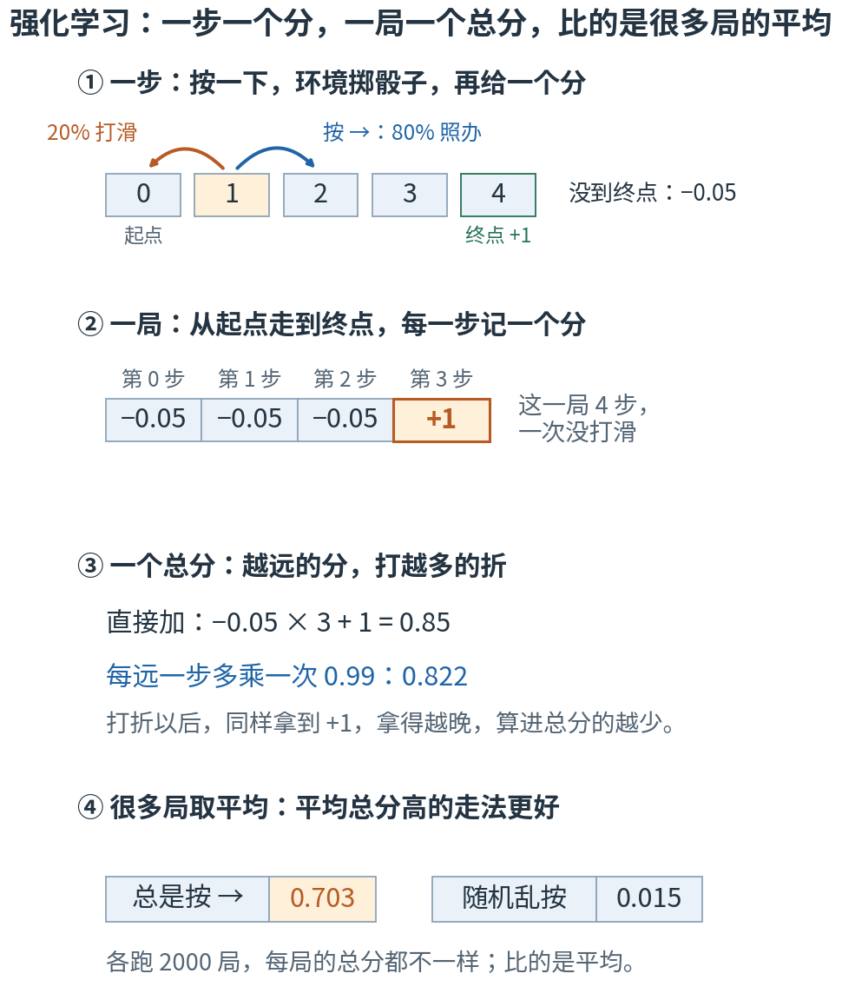
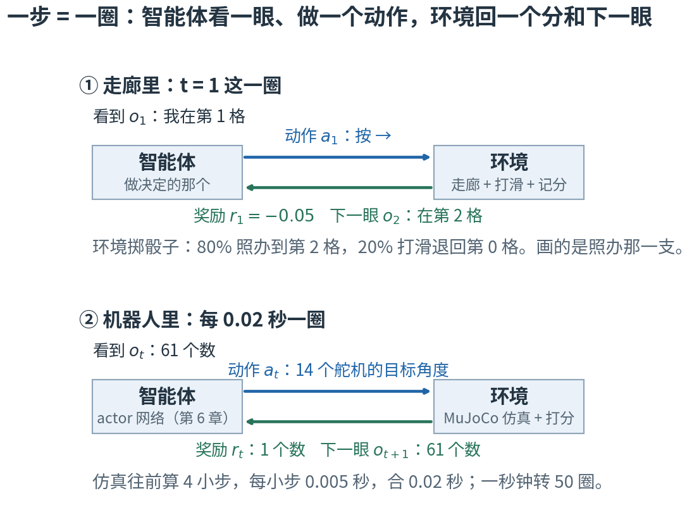
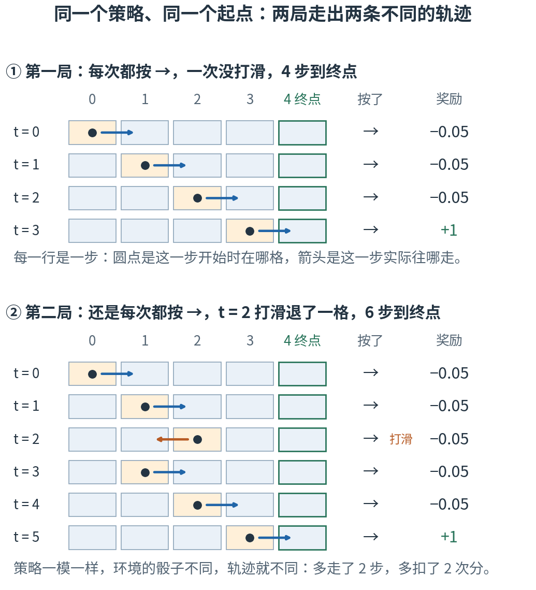
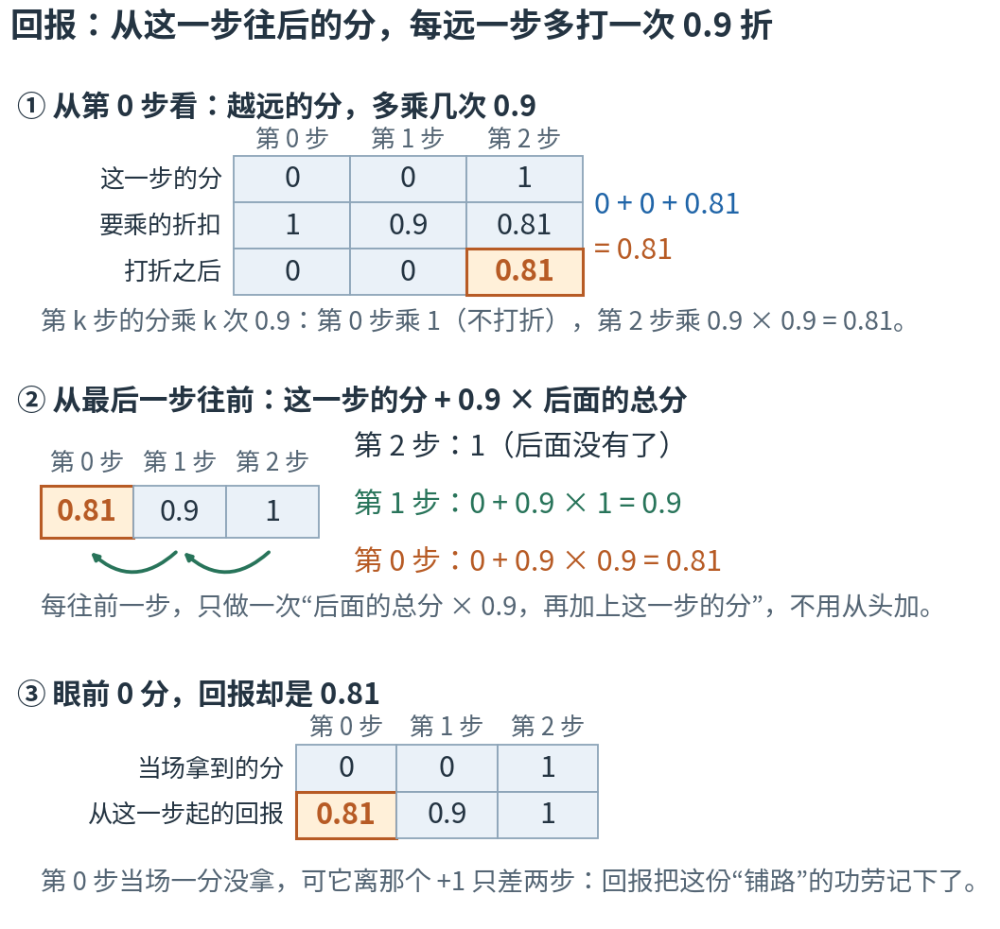
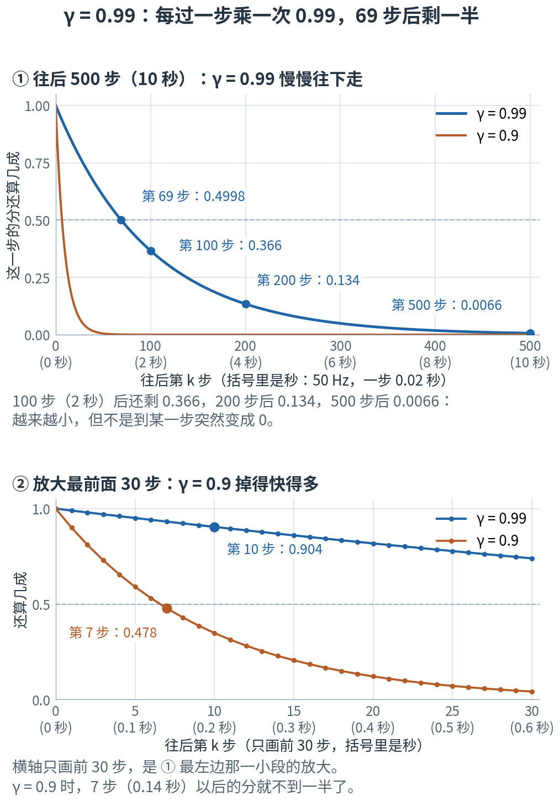
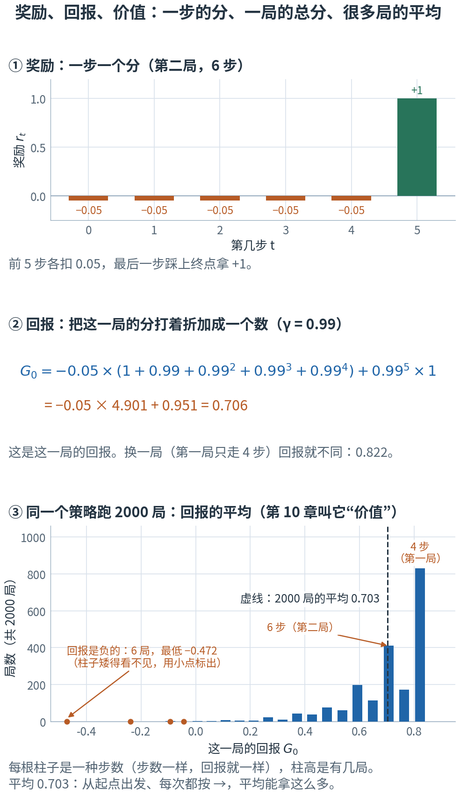

# 第 9 章 · 强化学习的世界观：没有标准答案，只有自己跑出来的分数

> **上一部我们有了什么**：一整套"学习"的零件（第 5 章）：数据、模型、损失、优化。模型是一张神经网络（第 6 章），梯度靠反向传播算、旋钮交给 Adam 去拧（第 7 章），输入先各自归一化（第 8 章）。
> 但到目前为止，数据都是现成的，损失都是"和标准答案差多少"。
>
> **这一章要补什么**：机器人没有标准答案——没人知道"这一刻 14 个关节该转到几度"。它只能自己试：摔了扣分，走稳了加分。
> 这一章把"边试边学"的整套说法建起来：谁在试，每一步看到什么、做什么，一局怎样算结束，总分怎么算，什么叫"学好了"。
> 全程用一个 5 格的走廊小游戏演示，每个词最后都对到机器人身上。
>
> **本章新词**：强化学习；智能体、环境；状态、观测；策略、探索；回合、轨迹；终止、超时；回报、折扣因子。
> **需要的前提**：第 4 章的期望（4.3 节）、大数定律（4.5 节）和"策略吐出的是一口钟"（4.7 节）；第 5 章的四个零件（5.2 节）；第 1 章 1.8 节的"每走一步，乘同一个数"。
> **不要求**新的数学：本章的计算只有加法和乘法，外加在浏览器控制台里按几次乘方。标"进阶"的折叠块可以第二遍再读。

---

## 9.0 先看地图：一条会打滑的走廊，一圈"看—做—得分"，一局一个总分

**强化学习里，一个做决定的"智能体"反复和"环境"打交道：看一眼，做一个动作，拿到一个分。一局从头到尾拿到的分，打着折加起来，是这一局的总分；学习的目标，是让很多局的平均总分尽量高。**

第 5 章 5.7 节说过学骑自行车：没人告诉你每一刻车把该转几度，你只知道摔了疼、骑稳了爽；摔过几十次，"什么感觉该往哪边扭"就练出来了。这一章把这种学法拆开来看。
骑车太复杂，先换一个小到能手算的游戏（教学构造的）：

- 走廊有 5 格，编号 0 到 4。你从第 0 格出发，第 4 格是终点。
- 每一步只能按一个键：→ 或 ←。
- 地面有点滑：80% 的时候照你按的走一格，20% 的时候反着走一格；撞到墙就原地不动。
- 没到终点的每一步扣 0.05 分；踩上终点的那一步得 +1 分（这一步不再扣），这一局结束。

你大概一眼就看出"总是按 →"是好办法。可机器不会"一眼看出"，它得从一局局的分数里自己学出来。
这个游戏小到每个数都能手算，又有机器人身上的全部要素：看、做、打分、随机、一局结束、总分。它是机器人的迷你版。



**读图顺序：** 从 ① 到 ④ 竖着读。① 是一步：你按一下，环境掷骰子决定真走到哪，再给一个分。② 是一局：从起点走到终点，每一步记一个分。
③ 把一局的分合成一个总分——越晚拿到的分，算进去的越少。④ 同一种走法，每局的总分都不一样，所以比的是很多局的平均。
图里的数字现在不用算，后面各节会一个一个算出来。

| 概念 | 它在回答什么问题 | 走廊里 | 机器人里 | 在哪一节 |
|---|---|---|---|---|
| 强化学习 | 没有标准答案，怎么学？ | 只知道每一步得了几分 | 只知道摔没摔、走得好不好 | 9.1 |
| 智能体、环境 | 谁做决定？谁回应？ | 按键的你；走廊 + 地面 + 记分规则 | 策略网络；物理仿真 + 打分规则 | 9.2 |
| 状态、观测 | 真相是什么？看得到多少？ | 在第几格；全看得见 | 仿真器里的一切；只看到 61 个数 | 9.3 |
| 策略、探索 | 看到什么就怎么做？为什么故意带随机？ | "总是按 →"；"九成按 →" | 14 口钟（第 4 章 4.7 节） | 9.4 |
| 回合、轨迹 | 一局从哪到哪？怎么记下来？ | 从第 0 格走到第 4 格；每步一行 | 从站好到摔倒或 20 秒到 | 9.5 |
| 终止、超时 | 一局有几种收场？ | 踩上终点；走满 50 步 | 摔倒；20 秒到 | 9.6 |
| 回报、折扣因子 | 从某一步起，往后总共值多少分？ | 越远的分，打越多的折 | 每远一步乘 0.99 | 9.7–9.8 |
| 目标 | 什么叫"学好了"？ | 很多局的平均总分最高 | 同左 | 9.9 |

表里的名字先不背，英文和符号到了各节再给。本章最容易混的四处，先贴上标签：

- **奖励、回报、价值**：三个都是"分"。奖励是一步的分；回报是从某一步起、往后的分打着折加起来；价值是很多局回报的平均。价值本章只贴个标签，第 10 章（价值函数）专门讲；9.7、9.9 节会用同一局把三者分开。
- **状态 vs 观测**：走廊里一样，机器人里不一样——仿真器知道的，远比机器人自己感觉得到的多。第 4 章 4.7 节写策略的记号时说过其中的 s"本书里就是观测"，9.3 节把这两样正式分开。
- **终止 vs 超时**：都是"这一局结束了"，意思却相反：一个是真的完了，一个只是不再往下记。9.6 节有 ⚠️。
- **一步、一局、一轮**：机器人的一步是 0.02 秒；一局最长 20 秒，也就是 1000 步；第 5 章 5.2 节说的"一轮"，是每只机器人攒够 24 步就训练一次。三种长度互不对齐，9.6 节的自测专门问这件事。
  还有两个"圈"也别混：9.2 节"看一眼、做动作、拿一个分"转一圈，是一步；第 5 章 5.0 节四个零件连成的圈转一轮，是训练一次。

现在觉得这些区别有点抽象很正常，读到对应小节就清楚了。

第一次读，按顺序看正文、图和手算就行。标着"进阶"的折叠块可以先跳过；代码是复核工具，不是阅读门槛。

## 9.1 强化学习：没有标准答案，只有分数

先看走廊里缺了什么。第 3 章 3.5 节找直线时，每个 x 都配好了正确的 y，错了多少，一减就知道。
走廊里没有人告诉你"在第 2 格应该按 →"。你按了一下，只得到一个分：−0.05。这个 −0.05 并不是在说"你按错了"——按对了也是 −0.05，因为还没到终点。只有踩上终点的那一步给 +1。

所以你手里的信息是：每一步一个分，好坏要**攒起来看**。一局 4 步到终点，拿到 −0.05、−0.05、−0.05、+1；另一局乱走了 20 步，前 19 步各扣 0.05。
哪种走法好，得比整局下来的分；而且得比很多局——地面会打滑，同一种走法，这局快、那局慢。

没有正确答案、只有分数，靠自己一次次试着学——这叫**强化学习**（reinforcement learning, RL）。第 5 章 5.7 节已经见过这个名字，这一章正式讲。拿第 5 章 5.2 节的四个零件对照：

| 零件 | 监督学习（第 3 章 3.5 节找直线） | 强化学习（学走路） |
|---|---|---|
| 数据 | 现成的 (x, y) 对，从头到尾一个数都不改 | **自己跑出来的**："看到什么、做了什么、得了几分"。旋钮一变，下一轮跑出来的数据也跟着变 |
| 模型 | 一条直线 $wx + b$ | 一张网络：看到的 61 个数 → 14 口钟（第 4 章 4.7 节）。9.4 节给它正式的名字 |
| 损失 | 和标准答案差多少 | **没有标准答案**，要从"分数"倒推出一个能求梯度的东西（第 11–13 章） |
| 优化 | 梯度下降 | 一样：反向传播 + Adam |

数据和损失这两行的差别，就是后面五章的全部内容。优化这一行不变：第 7 章的 `backward()`、`step()` 原样照用。

**为什么不能直接对分数求导？** 第 1 章 1.14 节的折叠里提过一句：分数是采样得到的数据，训练不沿着"分数 → 物理仿真 → 动作"这条路往回求导。走廊里看得最清楚：
在第 3 格按 →，80% 拿 +1，20% 打滑拿 −0.05。同一个动作，这一次拿几分由骰子定；分数从 −0.05 一下跳到 +1，中间没有一条光滑的坡可以量斜率。
机器人更是这样：分数要经过接触、摩擦、摔倒这些物理过程才算出来。所以本项目用的算法（和大多数强化学习算法一样）不去问"分数对动作的导数是多少"，
而是问"很多局平均下来，怎样的做法分数更高"。怎样把这个问题变成一个能求梯度的东西，是第 11 章（策略梯度）的事。

## 9.2 智能体与环境：看一眼、做一个动作、拿一个分，一圈叫一步

走廊游戏里有两方。一方是按键的你：你只管一件事——看看自己在哪，决定按哪个键。
另一方是其余的一切：走廊有几格、地面滑不滑、走到哪给几分。这些你都左右不了，只能照它的规矩来。

手算一圈。你站在第 1 格：

1. **看一眼**：我在第 1 格。
2. **做一个动作**：按 →。
3. **对方回应**：掷一次骰子。80% 照办，你到了第 2 格；20% 打滑，你退回第 0 格。不管哪种都没到终点，给你 −0.05 分。
4. 你再看一眼（现在在第 2 格，或者第 0 格），下一圈开始。

实验第 1 节把这些规矩列成了一张表。每一种"在哪、按什么"都有两种结果，概率加起来是 1：

```
                 在哪  按了     结果  概率   奖励  这一局结束？
---------------------  ----  -------  ----  -----  ------------
      第 1 格（中间）     →  第 2 格   0.8  -0.05            否
      第 1 格（中间）     →  第 0 格   0.2  -0.05            否
第 3 格（终点前一格）     →  第 4 格   0.8      1            是
第 3 格（终点前一格）     →  第 2 格   0.2  -0.05            否
      第 0 格（墙边）     ←  第 0 格   0.8  -0.05            否
      第 0 格（墙边）     ←  第 1 格   0.2  -0.05            否
```

最后两行是墙边：在第 0 格按 ←，照办就是撞墙、原地不动；打滑反而往右挪了一格。

做决定的那一方叫**智能体**（agent）；除它以外的一切叫**环境**（environment）。环境不只是"场地"：打滑的骰子、记分的规矩都算环境——凡是智能体左右不了、只能去适应的，都归环境。
"看一眼、做一个动作、拿一个分"这一圈，叫**一步**（代码里做这件事的函数就叫 `step`）。步从 0 开始编号，记作 t。

每一步来回传三样东西，各给一个记号：

| 符号 | 怎么读 | 就是 |
|---|---|---|
| $t$ | "t" | 第几步，从 0 数起（取自 time） |
| $o_t$ | "o 下标 t" | 第 t 步智能体看到的东西。o 取自 observation；9.3 节给它正式起名，并和另一样东西分清 |
| $a_t$ | "a 下标 t" | 第 t 步做的动作（第 4 章 4.7 节：a 专指动作） |
| $r_t$ | "r 下标 t" | 第 t 步拿到的分，叫**奖励**。r 取自 reward；第 1 章 1.1 节那张表里的"打分规则"（也叫奖励函数），打出来的就是它 |

注意下标的节奏：做完动作 $a_t$，环境一起送回两样东西——这一步的奖励 $r_t$，和下一步要看的 $o_{t+1}$。上面那一圈如果是这一局的第 1 步（t = 1，第 0 步刚从第 0 格走过来），写成记号：看到 $o_1$（在第 1 格），做 $a_1$（按 →），拿到 $r_1 = -0.05$，同时看到 $o_2$（在第 2 格，照办的那一支）。
下标是"第几步"，括号里的是"第几格"——这里碰巧都是 1；9.5 节的第二局里，两者就对不上了。



**这样读图：** 两张图是同一个圈，只是尺寸不同。蓝箭头从智能体指向环境：动作；绿箭头从环境指回智能体：这一步的奖励，加上下一步要看的东西。
① 走廊里，看到的是"在第几格"，动作是 → 或 ←，奖励是 −0.05 或 +1。
② 机器人里，看到的是 61 个数（第 8 章 8.2 节），动作是 14 个舵机的目标角度，奖励是一个数——十几项打分规则的加权和，第 16 章（奖励逐项拆解）逐项讲。
仿真器每转一圈往前算 0.02 秒，一秒钟转 50 圈。

这一圈就是游戏开发里的"主循环"。写成 JS：

```js
let obs = env.reset();                                // 一局开始：先看一眼（在第 0 格）
for (let t = 0; ; t++) {
  const action = agent.act(obs);                      // 智能体：看到什么 → 做什么
  const { nextObs, reward, done } = env.step(action); // 环境：执行、掷骰子、打分、给下一眼
  obs = nextObs;                                      // 下一圈从新的一眼开始
  if (done) break;                                    // 这一局结束了（怎么算结束，9.6 节）
}
```

智能体只有 `act` 这一个口子，环境只有 `reset` 和 `step` 两个。整个强化学习，就在这几个口子之间转。

> **停一下，自测**：下面几样，各属于智能体还是环境？① 走廊地面 20% 会打滑；② "踩上终点给 +1"这条规矩；③ 机器人的舵机收到指令后，要过一小会儿才转到位；④ 机器人策略网络里那 197,788 个可训练的旋钮。
> <details><summary>答案</summary>
>
> ①②③ 都是环境：智能体左右不了，只能适应。③ 最容易想错——舵机长在机器人身上，可"指令发出去以后怎样执行"智能体管不着，所以归环境。这类延迟，第 17 章（动作执行器）专门讲。
> ④ 是智能体：它就是做决定的那部分（第 6 章 6.5 节数过这个数）。
>
> </details>

## 9.3 状态与观测：环境知道的全部，和智能体看得到的那部分

走廊里，"我在第几格"就是全部真相：知道了它，再知道按哪个键，下一步会发生什么（80% 这样、20% 那样）就完全定了，用不着知道更早走过哪些格。而且这个真相你看得见。

机器人不一样。仿真器知道一切：每个零件的位置和速度，每个关节的角度和转速，脚底受了多大的力，地面有多滑……
机器人自己只"看"得到 61 个数（第 8 章 8.2 节）：关节的角度和速度、上一步的动作、身体转得多快、投影重力、命令。
仿真器知道、机器人看不到的东西很多，最典型的是**前进速度**：机器人相对地面走得多快。仿真器算得出来，真机上却没有任何传感器能直接测它——没有 GPS，也没有里程计。

环境在第 t 步的全部真相，叫**状态**（state），记作 $s_t$；智能体在第 t 步实际拿到手的那部分，叫**观测**（observation），就是 9.2 节的 $o_t$。

| 符号 | 怎么读 | 就是 |
|---|---|---|
| $s_t$ | "s 下标 t" | 第 t 步环境的全部真相（s 取自 state）。走廊里是"在第几格"；机器人里是仿真器里的全部物理量 |
| $o_t$ | "o 下标 t" | 第 t 步智能体看到的那部分。走廊里 $o_t = s_t$；机器人里是 61 个数 |

前进速度就是"状态里有、观测里没有"的例子。项目里有一个现成的对照：第 6 章 6.7 节那张只在训练时用的 critic，输入比 actor 多 15 项"只有仿真器才知道的信息"，前进速度就是其中之一。
配置里写得明明白白：从 actor 的观测里删掉它，只加给 critic（📍 映射到项目）。critic 不上真机，所以可以"偷看"；actor 要上真机，只能用真机上测得到的东西。

> ⚠️ **第 4 章 4.7 节的 s，严格说是这里的 o。** 那一节写策略的记号 $\pi(a \mid s)$ 时说过，其中的 s"本书里就是观测"——策略只能根据看得到的东西做决定，这句话没错。
> 可上面的表刚把 s 定成"全部真相"，两边怎么对上？靠一个习惯：强化学习的书和论文，把"网络拿到手的那些数"也写成 s（走廊里两者本来就一样）。本书后面沿用这个习惯：
> 公式里的 s，落到机器人身上就是网络的输入——策略是那 61 个数，critic 多看 15 项，是 76 个数。真要指"仿真器里的全部真相"时，会用文字明说"状态"。

**61 个数够不够？** 不一定。两只机器人此刻的 61 个数几乎一样，真相却可能不同：电池电压不同，通信延迟不同，一只脚刚好踩实了、另一只还悬着。
观测里放上"上一步的动作"（我刚才让舵机去哪）和关节速度，就是为了让"只看这一眼"也能推断出趋势，减少这种歧义——但减少不等于消除。
本项目是用有限的观测，训练一个扛得住这些不确定的策略；看不到的东西，并没有因此变成看得到。

<details>
<summary>进阶：马尔可夫性质与 MDP（现在可跳过）</summary>

走廊里"知道现在在第几格，就足以预测下一步"这件事有个名字，叫**马尔可夫性质**（英文名 Markov property，论文里常见）：下一步会发生什么，只取决于**现在**的状态和动作，不取决于更早的历史。

物理世界里，只要状态包含了全部必要的量（位置和速度都在），就满足它；只给一部分传感器读数就不一定。举个反例：只告诉你一个球现在在哪、不告诉你它的速度，你没法预测它下一刻往哪滚。
这时就得把"上一刻在哪"也塞进观测，用两帧的差推断速度。机器人的观测里放上一步的动作，是同一个道理（第 15 章（61 维观测）逐项讲）。

把"所有可能的状态、所有可能的动作、转移概率 $P(s' \mid s, a)$、奖励规则"打包在一起，叫**马尔可夫决策过程**（英文缩写 MDP）；论文里常再加上 9.7 节的折扣因子，把这五样写成一组（叫五元组）。
$P(s' \mid s, a)$ 读作"在 s 做了 a 之后，下一个状态是 s′ 的概率"（竖线读"给定"，第 4 章 4.7 节）。它只是本章这些词的正式打包：走廊里的 $P(s' \mid s, a)$，就是 9.2 节那张规矩表——"在第 1 格按 →：0.8 到第 2 格，0.2 到第 0 格"。

</details>

> **停一下，自测**：机器人观测里的"投影重力"（第 2 章 2.4 节）属于状态还是观测？"机器人相对地面的前进速度"呢？
> <details><summary>答案</summary>
>
> 投影重力两者都是：它是状态的一部分（机器人此刻的朝向），机身上的传感器也测得到（和第 2 章 2.4 节手机的重力感应是一回事），所以被放进了观测。
> 前进速度只属于状态：仿真器知道，真机上没有传感器能直接测，所以不在观测里——策略只能从关节速度、陀螺仪这些看得到的数里去推断它。
>
> </details>

## 9.4 策略与探索：看到什么就怎么做，带一点随机才试得到新东西

智能体凭什么决定按哪个键？它得有一条"看到什么 → 做什么"的规则。走廊里随手就能想出几条（后面几节一直用这三条，都是教学构造的）：

- **总是按 →**：不管在哪，都按 →。
- **九成按 →**：每一步掷一次骰子，90% 按 →，10% 按 ←。
- **随机乱按**：每一步抛一次硬币，→ 和 ← 各一半。

第一条每次都做同一件事；后两条带着随机——看到同样的东西，这次按 →，下次可能按 ←。能把三条统一起来的说法是：**看到什么之后，每个动作各有多大可能**。
"总是按 →"就是"→ 的可能是 1，← 是 0"的特例。

这条规则叫**策略**（policy），记作 π。第 4 章 4.7 节先认得的那个记号，就是它：

| 符号 | 怎么读 | 就是 |
|---|---|---|
| $\pi$ | "派" | 策略：看到什么就怎么做的规则。这个 π 不是圆周率 |
| $\pi(a \mid s)$ | "派 a 给定 s" | 看到 s 之后，做动作 a 的概率。"九成按 →"在第 2 格：π(→ ∣ 第 2 格) = 0.9，π(← ∣ 第 2 格) = 0.1 |
| $\pi_\theta$ | "派 西塔" | 由网络的旋钮 θ 决定的策略（θ 是第 3 章 3.4 节说的"全部旋钮"） |

它是一台第 1 章 1.1 节那样的机器：喂进去"看到的东西"，吐出来"每个动作的可能"。上面三条碰巧都不看自己在哪一格，每一格吐出的都一样；一般的策略会因地而异。
机器人的策略就是第 4 章 4.7 节那 14 口钟：网络看了 61 个数，给出 14 口钟的中心；每一步从每口钟里抽一个数当动作（动作 = 均值 + 标准差 × 噪声）。61 个数一变，14 个中心就跟着变。

**为什么要故意带随机？** 设想一个"总是按 ←"的策略：它每一局都只按 ←，于是永远只知道"按了 ← 之后会怎样"，永远不知道按 → 会不会更好。要学到"→ 更好"，它必须至少**试过** →。
"九成按 →"每一步都给 ← 留了一成机会。实验第 2 节让三个策略在第 0 格各按 100 次：

```
    策略  按 → 的概率  100 次里按 ← 的期望次数  这次实际按 ← 的次数
--------  -----------  -----------------------  -------------------
总是按 →            1                        0                    0
九成按 →          0.9                       10                    7
随机乱按          0.5                       50                   49
```

"总是按 →"一次 ← 也没试过；"九成按 →"期望试 100 × 0.1 = 10 次，这一次抽到 7 次（期望是很多次的平均，单独一次不一定正好是它，第 4 章 4.3 节）。
故意带一点随机、去试"眼下不认为最好"的动作，叫**探索**（exploration）。第 4 章 4.7 节说"加了噪声，它才会偶然试到新动作"，说的就是它。
试到了好的，训练就把钟的中心往那边挪——具体怎么挪，是第 11 章（策略梯度）的事。训练好以后部署到真机，就不再加噪声，直接执行钟的中心（第 19 章（导出与部署））。

> ⚠️ **走廊里有两层随机，不要混。** 地面 80% 照办、20% 打滑，是环境的随机：智能体管不着，它按的明明是 →，打滑也不是它"想试试 ←"。
> "九成按 →"里的那一成 ←，是策略的随机：这是智能体自己选的，只有这一层才叫探索。（也正因为如此，这里故意用"九成"而不用"八成"，免得和地面的 80% 搅在一起。）
> 两层随机会叠起来。用"九成按 →"，真往右挪一格有两条路：按 → 的九成里有八成照办，0.9 × 0.8 = 0.72；按 ← 的一成里有两成打滑、反倒往右，0.1 × 0.2 = 0.02。
> 两条路加起来 0.72 + 0.02 = **0.74**。实验第 2 节让它站在第 1 格试 10,000 次，真往右挪的比例是 0.7398。

> **停一下，自测**：① "九成按 →"在第 0 格按 1000 次，期望试几次 ←？② 用"总是按 →"，真往右挪一格的概率是多少？用"随机乱按"呢？
> <details><summary>答案</summary>
>
> ① 1000 × 0.1 = 100 次。② 总是按 →：只有"按 → 且照办"一条路，1 × 0.8 = 0.8。
> 随机乱按：0.5 × 0.8 + 0.5 × 0.2 = 0.4 + 0.1 = 0.5——硬币把地面的八成两成抵消了，往右往左一样多。
>
> </details>

## 9.5 回合与轨迹：一局从头到尾，每一步都记下来

让"总是按 →"真的玩一局：从第 0 格出发，一步一步走，直到踩上终点。实验第 3 节玩了两局，第二局是这样的：

```
t  s_t  a_t    r_t  s_{t+1}
-  ---  ---  -----  -------
0    0    →  -0.05        1
1    1    →  -0.05        2
2    2    →  -0.05        1
3    1    →  -0.05        2
4    2    →  -0.05        3
5    3    →      1        4
```

每一行是一步：这一步开始时在哪（$s_t$）、按了什么（$a_t$）、拿到几分（$r_t$）、走到了哪（$s_{t+1}$）。
t = 2 那一步按的是 →，却从第 2 格退回了第 1 格——打滑了。多绕了这一下，一共走了 6 步。第一局运气好，一次没打滑，4 步就到了。



**这样读图：** 每张图从上往下是时间，一行是一步。圆点是这一步开始时所在的格子，箭头是这一步实际往哪走：蓝的是照办，橙的是打滑。最右两列是按了什么、拿了几分。
两局用的是同一个策略（每次都按 →）、同一个起点，只是环境的骰子掷得不同——② 的第 3 行（t = 2）箭头是橙色的，"按了"那一列标着"打滑"：按的明明是 →，却退了一格。整条路线因此长了两步，多扣了两次 0.05。

从开始到结束的这一整局，叫一个**回合**（episode）。一回合里按顺序记下的整串东西——每一步的状态、动作、奖励，直到最后停在哪——叫一条**轨迹**（trajectory），记作 τ（希腊字母，读"陶"）：

$$\tau = (s_0, a_0, r_0,\ s_1, a_1, r_1,\ \ldots,\ s_T)$$

| 符号 | 怎么读 | 就是 |
|---|---|---|
| $\tau$ | "陶" | 一条轨迹：一回合的完整记录 |
| $T$ | "大 T" | 这一回合一共走了几步（第二局 T = 6） |
| $s_T$ | "s 下标大 T" | 最后停在的状态（第二局停在第 4 格）。停下了，就不再做动作、不再拿分 |

所以一条 T 步的轨迹里有 T 个动作、T 个奖励，状态多一个（从 $s_0$ 到 $s_T$）。第 2 章 2.8 节说过，时间这条轴有先后因果——轨迹就是沿着这条轴一步一步排出来的。

机器人的一个回合：从站好开始，到摔倒或者 20 秒时间到为止。它的轨迹最长 1000 步，每一步记下"看到的 61 个数、一个动作（14 个数）、1 个奖励"。

> **停一下，自测**：第一局（4 步到终点）的轨迹里，有几个状态、几个动作、几个奖励？最后一个状态是什么？
> <details><summary>答案</summary>
>
> 5 个状态（$s_0$ 到 $s_4$，依次是第 0、1、2、3、4 格），4 个动作（都是 →），4 个奖励（−0.05、−0.05、−0.05、+1）。最后一个状态是第 4 格——终点，这一局就停在这里。
>
> </details>

## 9.6 终止与超时：摔倒是真的完了，时间到只是不再往下记

一局怎样算结束？走廊里有两种收场。

第一种：踩上终点。游戏规则就是这样定的——踩上终点，这一局**真的完了**，之后再也没有分可拿。

第二种：走满 50 步还没到终点。"随机乱按"常常在走廊里来回晃，要是不设上限，一局可能走个没完，所以实验给每局定了 50 步的上限。到了上限，这一局就停下、从头再来——可游戏本身并没有完，只是**不再往下记**了。

环境自己宣布"这一局完了"——踩上终点、机器人摔倒——叫**终止**（termination）：之后没分了。
只是记录到了定好的时长上限、被截断——走满 50 步、机器人走满 20 秒——叫**超时**（time-out，也叫 truncation，意思是截断）：游戏本来还能接着玩，之后本来还有分，只是没记下来。

实验第 4 节让"随机乱按"跑了 2000 局，数一数两种收场各有多少：

```
“随机乱按”跑 2000 局：踩上终点而终止 1878 局，走满 50 步被超时截断 122 局
超时那几局，截断时站在哪一格： 第 0 格 48 局  第 1 格 34 局  第 2 格 26 局  第 3 格 14 局
```

看最后那 14 局：50 步用完的时候，它正站在第 3 格，离终点只差一步——下一步按 →，就有 80% 拿到 +1。游戏本来没完，是我们不再往下记了。这和"踩上终点"完全是两回事。

| 收场 | 意思 | 走廊里 | 机器人里 | 之后还有分吗 |
|---|---|---|---|---|
| 终止 | 真的完了 | 踩上终点 | 摔倒：倾斜超过 70° | 没有了 |
| 超时 | 时间到，不再往下记 | 走满 50 步 | 走满 20 秒 | 本来还有，只是没记 |

机器人的"摔倒"就是第 2 章 2.4 节的判据：投影重力的第 3 项 $g_z$ 从站直时的 −1 升到约 −0.34，也就是倾斜超过 70°。
"20 秒"合多少步：每步 0.02 秒，20 ÷ 0.02 = 1000 步。

> ⚠️ **超时不是终止，也不是失败。** 两种收场在代码里都会让这一局停下、重新开始，看上去一样，意思却相反。终止之后"没分了"，往后算账时按 0 算，这是对的。
> 超时之后"本来还有分"：机器人在第 20 秒时也许正稳稳地走着，只要还站着，后面每一步都还有分可拿。要是把超时也当成"之后没分了"，算法就会以为"走到第 20 秒会突然没分"，
> 把最后这段好好走路也算成了走向失败。所以项目的配置给每一种收场都标明了它是哪一种（📍 映射到项目）。
> 超时之后那段没记下的分怎么补？得先有"从这里往后平均能拿多少"的估计（第 10 章（价值函数）），再由第 12 章（优势估计 GAE）用它补上。

> **停一下，自测**：训练时，每只机器人攒够 24 步的数据就训练一次（第 5 章 5.2 节）。这是不是说，机器人每走 24 步就被重新摆回起点？
> <details><summary>答案</summary>
>
> 不是。"攒 24 步"是收数据的节奏，"一局结束"是游戏本身的事，两者互不相干：一局最长 1000 步，1000 ÷ 24 = 41.67，本来就对不齐。
> 攒够 24 步时，没摔倒、没超时的机器人接着往下走，下一批数据从它当时的样子接着记。这 24 步以后的分，这一批里也还没记下——和超时一样，要靠第 12 章（优势估计 GAE）用估计补上。
>
> </details>

## 9.7 回报与折扣因子：从这一步起的总分，越远的分打越多的折

一步的分只说明这一步。智能体真正关心的是：**从现在起往后，一共能拿多少分？**

先看一段只有三步的小经历（教学构造的，不是 Microduck 的真实评分）：三步拿到的分依次是 0、0、1。从第 0 步看，往后一共多少分？直接加是 0 + 0 + 1 = 1。

可"现在的 1 分"和"很久以后的 1 分"，值得一样多吗？通常不：我们更想早一点拿到。办法是**每远一步，就多打一次折**。
折扣取 0.9：当场的分算足，下一步的分乘 0.9，再下一步乘 0.9 × 0.9 = 0.81——正是第 1 章 1.8 节"每走一步，乘同一个数"的那种函数。（这个 0.9 是折扣，和 9.4 节"九成按 →"里的 0.9 不相干，只是碰巧同一个数。）从第 0 步看：

$$0 + 0.9 × 0 + 0.9^2 × 1 = 0.81$$

从第 1 步看，往后只剩两步：$0 + 0.9 × 1 = 0.9$。从第 2 步看，只剩它自己：1。

同样这三个数，还有一种更省事的算法：**从最后一步往前**。

- 第 2 步：1（后面没有了）。
- 第 1 步：这一步的 0，加上 0.9 × 后面的总分 1：$0 + 0.9 × 1 = 0.9$。
- 第 0 步：这一步的 0，加上 0.9 × 后面的总分 0.9：$0 + 0.9 × 0.9 = 0.81$。

两种算法得到同一个 0.81。倒着算的好处是：每往前挪一步，只做一次"乘 0.9、再加上这一步的分"，不必从头加起。

这个"从这一步往后、打着折加起来的总分"叫**回报**（return），记作 $G_t$；那个每远一步就乘一次的数叫**折扣因子**（discount factor），记作 γ。
上面三个数写成记号：$G_2 = 1$，$G_1 = 0.9$，$G_0 = 0.81$。



**这样读图：** ① 是从前往后：第 k 步的分乘 k 次 0.9（k 就是"往后第几步"），再全部加起来。② 是从后往前：绿色弧线表示"后面的总分"往前传，每传一步乘一次 0.9，再加上这一步的分。
③ 把"当场拿到的分"和"回报"并排：第 0 步当场一分没拿，回报却是 0.81。

③ 是这一节最要紧的一点。第 0 步的动作当场没得分，可正是它把你往那个 +1 推近了一步——回报把这份"铺路"的功劳记下了。
如果只看每一步当场的分，像监督学习那样"学当场得分高的动作"，这类准备动作就永远得不到认可。机器人走路满是这种动作：抬起一条腿的那一刻并不加分，可不抬腿就迈不出下一步。

写成一般的公式：

$$G_t = r_t + \gamma\, r_{t+1} + \gamma^2 r_{t+2} + \gamma^3 r_{t+3} + \cdots = \sum_{k=0}^{\infty} \gamma^k\, r_{t+k}$$

| 符号 | 怎么读 | 就是 |
|---|---|---|
| $G_t$ | "G 下标 t" | 回报：从第 t 步起往后的折扣总分。一局停了，后面的项就没有了（当 0） |
| $\gamma$ | "伽马" | 折扣因子，0 到 1 之间的一个数。上面用 0.9，项目用 0.99 |
| $\gamma^k$ | "伽马的 k 次方" | 往后第 k 步的分要乘的折扣：打 k 次折 |
| $\sum_{k=0}^{\infty}$ | "对 k 从 0 到无穷求和" | 第 2 章 2.2 节的 Σ，就是一个 for 循环：k = 0、1、2……一项一项加。一局有限长，加到最后一步就停 |

"从后往前"写成一条式子是 $G_t = r_t + \gamma\, G_{t+1}$：这一步的分，加上 γ 乘以下一步起的回报。它就是 JS 数组的 `reduceRight`——从最后一个元素往前累积：

```js
const rewards = [0, 0, 1], gamma = 0.9;
const G0 = rewards.reduceRight((later, r) => r + gamma * later, 0);   // 从最后一个往前：0.81
```

这条"从后往前"的规则，第 10 章（价值函数）还会反复用到；第 12 章（优势估计 GAE）的代码也正是这样倒着循环的。

回到走廊。第一局的四个分是 −0.05、−0.05、−0.05、+1。实验第 5 节用几个不同的 γ 算它的 $G_0$：

```
   γ  第一局的 G_0
----  ------------
   1          0.85
0.99      0.821794
 0.9        0.5935
 0.5        0.0375
```

γ = 1 就是不打折，直接加：−0.05 × 3 + 1 = 0.85。γ = 0.9 那一行可以手算：四个分分别乘 1、0.9、0.81、0.729，$-0.05 - 0.045 - 0.0405 + 0.729 = 0.5935$。
γ 越小，第 3 步那个 +1 被打的折越狠，开头看到的回报就越小。不管 γ 取多少，最后一步的回报都是 $G_3 = 1$：终点之后没有别的分了。

**为什么要打折？** 两个理由。① 它定下一种偏好：同样拿到 +1，早拿比晚拿好。② 它让总分不会无限大：机器人要是一直走、一直有分，不打折的总分会越加越大，没法比较；打了折，总和就有上限（9.8 节算给你看）。

还有一条容易想歪：打折**不是**用来表示"环境可能出事"的。地面打滑、机器人可能摔倒，这些随机已经体现在"每一局的轨迹不一样"里，要靠 9.9 节的"很多局取平均"来处理；γ 是我们选定的"对远处的分看得多重"，不是环境的属性；也别把它当成"每一步活下来的概率"（除非你专门按这个意思建了模）。

> **停一下，自测**：三步的分是 0、1、0，γ = 0.9。$G_0$、$G_1$、$G_2$ 各是多少？
> <details><summary>答案</summary>
>
> 从后往前：$G_2 = 0$；$G_1 = 1 + 0.9 × 0 = 1$；$G_0 = 0 + 0.9 × 1 = 0.9$。中间那一步当场拿的 1 分，传到第 0 步打了一次折，剩 0.9。
>
> </details>

## 9.8 γ = 0.99 看多远：每过一步乘 0.99，69 步后剩一半

项目用 γ = 0.99：往后第 k 步的分，要乘 $0.99^k$。这种数不用手算，打开浏览器控制台（按 F12）按几下——JS 的 `**` 就是乘方：

```js
0.99 ** 10    // 0.904…：10 步以后的分，还算 90%
0.99 ** 69    // 0.4998…：69 步以后，只算一半
0.99 ** 100   // 0.366…：100 步以后，剩 37%
```

每一步 0.02 秒，一秒 50 步（写作 50 Hz，Hz 读"赫兹"，就是"每秒几次"），所以步数 × 0.02 就是秒数：69 步是 1.38 秒，100 步是 2 秒。实验第 6 节把更多的点列成表，并和 γ = 0.9 对比：

```
往后第 k 步  = 几秒   0.99^k     0.9^k
-----------  ------  -------  --------
          1    0.02     0.99       0.9
         10     0.2   0.9044     0.349
         50       1    0.605   0.00515
         69    1.38   0.4998  0.000696
        100       2    0.366  2.66e-05
        200       4    0.134  7.06e-10
        500      10  0.00657  1.32e-23
```

最后一列的 `2.66e-05` 是第 3 章 3.6 节的科学计数法，只是指数是负的：$2.66 × 10^{-5}$，小数点往左挪 5 位，就是 0.0000266。



**这样读图：** 纵轴是"往后第 k 步的分还算几成"，也就是 $\gamma^k$；灰色虚线是一半。
① 蓝线（γ = 0.99）慢慢往下走：第 69 步穿过一半，100 步（2 秒）剩 0.366，500 步（10 秒）剩 0.0066——越来越小，但没有哪一步突然变成 0。橙线（γ = 0.9）一出发就几乎贴到了底。
② 是 ① 最左边前 30 步的放大（横轴只到 30 步）：γ = 0.9 到第 7 步（0.14 秒）就掉到 0.478，γ = 0.99 到第 10 步还有 0.904。

对走路来说，这个差别很实在。一个动作的后果常常要过一阵才显出来：9.7 节里第 0 步的功劳，要到两步以后才兑现；机器人一脚踩歪，身子也是慢慢歪下去的，要过一会儿才摔倒。γ = 0.9 时，1 秒（50 步）以后的分只算 0.00515，几乎看不见；γ = 0.99 时还算 0.605。

### 为什么折扣不是"机器人最多只看两秒"

常听到一个说法："γ = 0.99 的视界是 $1/(1-\gamma) = 100$ 步，也就是 2 秒。"（视界：能往前看多远。）这个 100 是有来历的。假设每一步都拿 1 分、一直拿下去，打折后的总分是

$$1 + 0.99 + 0.99^2 + 0.99^3 + \cdots$$

实验第 6 节把它一项一项加：前 2 项是 1.99，前 100 项是 63.40，前 500 项是 99.34，越加越靠近 **100**，但永远不超过——这正是 9.7 节说的"打了折，总和就有上限"。在控制台里也能自己加：

```js
let sum = 0;
for (let k = 0; k < 500; k++) sum += 0.99 ** k;   // 前 500 项
sum                                              // 99.34…
```

一般地，每步拿 1 分、打折后的总和上限是 $1/(1-\gamma)$：γ = 0.9 是 10，γ = 0.99 是 100。γ 越接近 1，上限越大，远处的分也就越算数。

<details>
<summary>进阶：为什么总和正好是 1/(1 − γ)（现在可跳过）</summary>

把总和记作 S（只是个代号，和状态 s 无关）：$S = 1 + \gamma + \gamma^2 + \gamma^3 + \cdots$。两边都乘 γ：$\gamma S = \gamma + \gamma^2 + \gamma^3 + \cdots$——正好是 S 去掉了开头的 1。
所以 $S - \gamma S = 1$，也就是 $S(1-\gamma) = 1$，$S = 1/(1-\gamma)$。

用一个小的 γ 核对：γ = 0.5 时，$1 + 0.5 + 0.25 + 0.125 = 1.875$，再加 0.0625、0.03125……越来越靠近 $1/(1-0.5) = 2$。
这种"每一项都是前一项乘同一个数"的无穷相加，叫几何级数；只要那个数在 0 到 1 之间，总和就是有限的。

顺带一个巧合：$0.99^{100} = 0.366$，和第 1 章 1.8 节那张表里的 $e^{-1} ≈ 0.3679$ 很接近。这不全是碰巧：γ 越接近 1，往后第 $1/(1-\gamma)$ 步的折扣就越接近 $e^{-1}$——控制台里依次按 `0.9 ** 10`、`0.99 ** 100`、`0.999 ** 1000`，得 0.349、0.366、0.3677。所以人们爱拿 $1/(1-\gamma)$ 当"看多远"的尺度。

</details>

但 100 步只是一个**尺度**，不是一刀切的截止线。回头看表：第 100 步的分还算 0.366，第 200 步还算 0.134，都不是 0。"第 101 步以后一律不管"是错的读法。

还有一点容易想歪：γ 管的是"步"，不是"秒"。同样的 γ = 0.99，控制频率（一秒做几次决定）一换，对应的秒数也跟着换：50 Hz 下 100 步是 2 秒，换成 100 Hz（一秒 100 步）就只有 1 秒。

<details>
<summary>进阶：换控制频率时，γ 怎么换才能让"每秒打的折"不变（现在可跳过）</summary>

记 50 Hz 下每一步的折扣为 $\gamma_{50}$，100 Hz 下为 $\gamma_{100}$。100 Hz 走两步，才是 50 Hz 的一步（都是 0.02 秒）。要让同样的 0.02 秒打的折一样多，$\gamma_{100}$ 乘两次得等于 $\gamma_{50}$：
$\gamma_{100} × \gamma_{100} = \gamma_{50}$，也就是 $\gamma_{100} = \sqrt{\gamma_{50}}$（√ 是开平方，第 2 章 2.3 节量长度时用过）。

代进去：γ = 0.99 → $\sqrt{0.99} = 0.99499$（$0.99499 × 0.99499 ≈ 0.99$）。核对：2 秒在 100 Hz 下是 200 步，$0.99499^{200} = 0.366$，和 50 Hz 下的 $0.99^{100}$ 一样（控制台里按 `Math.sqrt(0.99)` 和 `0.99499 ** 200` 各试一下）。

这只是单位换算的练习；项目的控制频率一直是 50 Hz，不需要改。

</details>

> **停一下，自测**：如果 γ = 0.95，往后大约多少步，一个分就只算一半了？合多少秒？每步都拿 1 分时，打折后的总分上限是多少？（提示：在控制台里试 `0.95 ** 13` 和 `0.95 ** 14`。）
> <details><summary>答案</summary>
>
> $0.95^{13} = 0.513$，$0.95^{14} = 0.488$，所以在第 13 到 14 步之间剩一半，约 13.5 × 0.02 = 0.27 秒。总分上限是 $1/(1-0.95) = 20$。
>
> </details>

## 9.9 目标：让平均回报最大

现在可以回答"什么叫学好了"。

同一个策略，每一局的回报都不一样。取 γ = 0.99：第一局 4 步到终点，$G_0$ 是 0.822（9.7 节那张表里的 0.821794）；第二局多绕了两步：

$$G_0 = -0.05 × (1 + 0.99 + 0.99^2 + 0.99^3 + 0.99^4) + 0.99^5 × 1 = -0.05 × 4.901 + 0.951 = 0.706$$

骰子一变，回报就变。所以比较两个策略，不能各跑一局就下结论，要比**很多局的平均**——也就是第 4 章 4.3 节的期望。每种结局的概率不好一一算出来也不要紧：像第 4 章 4.5 节那样，多跑很多局取平均就行。
实验第 7 节让三个策略各跑 2000 局：

```
    策略  2000 局的平均回报  平均每局几步
--------  -----------------  ------------
总是按 →              0.703          6.09
九成按 →              0.639          7.25
随机乱按              0.015         18.99
```

"总是按 →"平均 6 步多就到终点，平均回报 0.703；"随机乱按"平均要晃 19 步，一路扣的分几乎把终点那个 +1 抵光了。"九成按 →"夹在中间：那一成探索，让它平均多走了一步多。
实验还用另一种不抽样的办法算出了"总是按 →"的精确值 0.7015，和 2000 局的平均相差不到 0.002。这种不抽样的算法，第 10 章（价值函数）讲；这一章用抽样平均就够了。

写成记号，策略 π 的好坏用一个数衡量：

$$J(\pi) = \mathbb{E}\big[\,G_0\,\big]$$

| 符号 | 怎么读 | 就是 |
|---|---|---|
| $J(\pi)$ | "J 派" | 策略 π 的目标值：一个数，越大越好 |
| $\mathbb{E}[\cdot]$ | "期望" | 第 4 章 4.3 节：按概率加权的平均。这里的随机来自两处——环境的骰子和策略的骰子（9.4 节的两层随机） |
| $G_0$ | "G 下标 0" | 从一局开头算起的回报（9.7 节） |

读作"策略 π 的目标值，等于一局从头算起的回报的期望"。走廊里，"总是按 →"的 J 约是 0.70，"随机乱按"的 J 差不多是 0。
**强化学习的全部目标就是一句话：找到让 J 最大的策略。** 第 3 章是"让损失最小"，这里是"让 J 最大"——方向反了，道理一样。怎么用梯度去找，第 11 章（策略梯度）开始讲。



**这样读图：** 三段是三种"分"，从小往大读。① 奖励：一步一个分，第二局一共 6 个。② 回报：把一局的奖励打着折加成一个数，第二局是 0.706。
③ 同一个策略跑 2000 局，每局一个回报，按大小堆成柱子。步数一样的局，回报也一样，所以每根柱子对应一种步数（图上标出了 4 步和 6 步那两根），柱高是有几局。
最右、最高的那根在 0.822——4 步就到、一次没打滑的局，第一局就是其中之一。这种局占多少，可以自己算：四步都照办，0.8 × 0.8 × 0.8 × 0.8 = 0.4096，约四成；2000 局里有 829 局。
6 步那根在 0.706，第二局就在里面。越往左，走的步数越多；最左边还有 6 局绕了很久，回报是负的，柱子矮得看不见，图上用小点标出。虚线是 2000 局的平均 0.703，碰巧和 6 步那根几乎重合。

这三样最容易混，再用一句话分开：

- 奖励：某一步拿到的分。
- 回报：某一局从某一步起、打着折加起来的总分——一条轨迹一个数。
- 价值：从某个处境出发、按某个策略走，回报的平均——③ 里那条虚线，就是用 2000 局估出来的"起点的价值"。它有专门的名字和算法，先不背，第 10 章（价值函数）讲。

> **停一下，自测**：策略甲只跑了一局，回报 0.822；策略乙跑了 2000 局，平均回报 0.703。能说甲比乙好吗？
> <details><summary>答案</summary>
>
> 不能。一局只是一个样本：③ 里"总是按 →"自己的 2000 局，回报从 −0.472 到 0.822 都有——同一个策略，单独一局可以很高，也可以很低。要比，就让甲也跑很多局，比平均（第 4 章 4.5 节）。
>
> </details>

## 📍 映射到项目

> 只需看一眼。语法看不懂没关系。

**这段配置做什么**：定下机器人这个环境的"钟"和"收场"——一步多长、一局最长多久、哪几种情况算结束，以及每一种是终止还是超时（9.2、9.6 节）。
它在 mjlab 的 `mjlab/tasks/velocity/velocity_env_cfg.py` 的 `make_velocity_env_cfg()` 里，项目的走路任务就是在这个模板上改出来的：

```python
terminations = {
  "time_out": TerminationTermCfg(func=mdp.time_out, time_out=True),  # 时间到：time_out=True 标明“这是超时”（9.6 节）
  "fell_over": TerminationTermCfg(                                    # 摔倒：没写 time_out，默认就是终止
    func=mdp.bad_orientation,                                         # 判据：身子歪得太厉害
    params={"limit_angle": math.radians(70.0)},                       # 倾斜超过 70° 算摔倒（第 2 章 2.4 节）
  ),
  "out_of_terrain_bounds": TerminationTermCfg(                        # 走出了地形的边界
    func=mdp.out_of_terrain_bounds,                                   # （判断有没有走出去）
    time_out=True,                                                    # 也标成超时：不是它做错了什么，只是场地到头了
  ),
}
...
    timestep=0.005,                                                   # 物理仿真的一小步：0.005 秒
...
    decimation=4,                                                     # 4 小步合成一个环境步：0.02 秒，50 Hz（9.2 节）
    episode_length_s=20.0,                                            # 一局最长 20 秒，也就是 1000 步（9.5、9.6 节）
```

`bad_orientation` 在 `mjlab/envs/mdp/terminations.py` 里只有一行判断：倾角 = arccos(−$g_z$)，和 70° 比——就是第 2 章 2.4 节的算法（arccos 是"已知 cos 值反查角度"，没学过就看[附录 D.6](../appendix/D-三角函数从0补课.md)）。
`time_out` 也只是比一比"这一局走过的步数，到没到上限"；上限 1000 是 `mjlab/envs/manager_based_rl_env.py` 里用 20 秒除以每步 0.02 秒、向上取整算出来的。

**这段配置做什么**：项目在模板上又加了一种收场，把前进速度从 actor 的观测里拿掉、只给 critic（9.3、9.6 节），并在训练的超参数里定下 γ（9.7、9.8 节）。都在 `src/mjlab_microduck/tasks/microduck_velocity_env_cfg.py`：

```python
cfg.terminations["nan_state"] = TerminationTermCfg(                  # 仿真算出了 NaN（坏掉的数，not a number）
    func=microduck_mdp.robot_state_is_nan,                            # （检查机器人的状态里有没有 NaN）
    time_out=False,                                                   # 按终止处理：之后不再算分，立刻重来
...
del cfg.observations["actor"].terms["base_lin_vel"]                  # actor 看不到前进速度：状态里有、观测里没有（9.3 节）
...
cfg.observations["critic"].terms["base_lin_vel"] = ObservationTermCfg(  # 只有训练时用的 critic 看得到（第 6 章 6.7 节）
...
MicroduckRlCfg = RslRlOnPolicyRunnerCfg(                             # 训练用的一组超参数
...
        gamma=0.99,                                                   # 折扣因子 γ = 0.99（9.7、9.8 节）
...
    num_steps_per_env=24,                                             # 每只机器人攒 24 步就训练一次（9.6 节的自测）
```

合起来，机器人一共有 4 种收场：摔倒（`fell_over`）和数值出错（`nan_state`）是终止；20 秒到（`time_out`）和走出地形边界（`out_of_terrain_bounds`）标成超时。

最后一件事：`time_out=True` 这个标记会一路传到训练算法。`rsl_rl/algorithms/ppo.py` 里，碰上超时的那一步，算法会用 critic 的估计补上"后面本来还有的分"——
9.6 节 ⚠️ 说的"超时之后本来还有分"，代码里就是这样处理的。那几行，第 12 章（优势估计 GAE）逐行读。

实验第 8 节会核对：上面引用的这些常数和代码行，在你机器上的源码里还原样存在。

## 🧪 动手实验

```bash
uv run python docs/learn-zh/labs/ch09_gridworld.py
```

1. 走廊的规则：把"在哪、按什么"的每种结果列成表，再在第 1 格按 10,000 次，看照办的比例是不是约 0.8；画 `ch09_loop.png`（走廊里和机器人里的一圈）。
2. 策略与探索：三个策略在第 0 格各按 100 次，数试了几次 ←；两层随机叠起来的 0.74，手算和 10,000 步抽样对照，外加自测的 0.8 和 0.5。
3. 回合与轨迹："总是按 →"跑两局，打印两张轨迹表，数状态、动作、奖励各几个；画 `ch09_trajectory.png`。
4. 终止与超时："随机乱按"跑 2000 局，数终止和超时各几局、超时时站在哪一格；机器人一局最长 1000 步，和 24 步的节奏对不齐。
5. 回报：三步经历 [0, 0, 1] 用两种算法都得 0.81，自测 [0, 1, 0]，第一局在四个 γ 下的 $G_0$；画 `ch09_return_by_hand.png`。
6. 折扣看多远：$0.99^k$ 和 $0.9^k$ 的表，一半落在第几步，每步 1 分的总和靠近 100，γ = 0.5 的迷你版，换频率时的 √0.99，自测 γ = 0.95；画 `ch09_discount.png`。
7. 目标：三个策略各跑 2000 局比平均回报，并和不抽样的精确值核对；4 步就到的局有几成（0.8⁴ = 0.4096）；第二局的 0.706；画 `ch09_reward_return_value.png` 和 9.0 节的总览图 `ch09_overview.png`。
8. 映射到项目：核对 📍 里引用的配置常数和源码行还在不在。

**改一改**（每条都先写下你的预测，再运行。要改的三行在脚本里都标着 `# TWEAK-1` / `TWEAK-2` / `TWEAK-3`。
改动之后，锁正文数字的检查会从 ✓ 变成 ✗，脚本照常跑完，最后提示"N 项没对上"——这是预期的，它们锁的是正文里的数；有 ✗ 时新画的图不会覆盖教材里的图。试完记得改回去再跑一遍）：

- 把第 1 节的 `STEP_REWARD` 从 −0.05 改成 0（每一步不再扣分）。先预测：第 7 节"随机乱按"的平均回报会变大还是变小？它和"总是按 →"的差距会怎样？再想一想：为什么强化学习的任务常常给"每一步"一点小惩罚？
- 把第 6 节的 `GAMMA` 从 0.99 改成 0.9。先预测："一半"的位置从第 69 步挪到第几步？第 7 节"随机乱按"的平均回报还会是正的吗？为什么？
- 把第 1 节的 `P_SLIP` 从 0.2 改成 0.5（地面有一半的时候走反）。先用 9.4 节的办法算一算："总是按 →"和"随机乱按"真往右挪一格的概率各是多少？再预测两者的平均回报谁高，然后运行（除了 2000 局的平均，也看看表下面"不抽样的精确值"那几行）。

本章的 0.81 这个手算，也可用 `python3 docs/learn-zh/labs/worked_examples.py` 独立复核。

## 本章小结

- **强化学习**：没有标准答案，只有分数；数据是智能体自己跑出来的。分数是环境采样出来的数，训练不沿着仿真往回求导——所以后面几章要另找办法得到梯度。
- **智能体**看一眼、做一个动作，**环境**回一个奖励和下一眼；这一圈叫一步。凡是智能体左右不了的（打滑、舵机的延迟、记分的规矩），都归环境。
- **状态**是环境的全部真相，**观测**是智能体看得到的那部分。走廊里两者一样；机器人里，前进速度是"状态里有、观测里没有"的典型，只给训练时的 critic 看。
- **策略** π(a ∣ s)：看到什么之后，每个动作各有多大可能。故意带一点随机、去试眼下不认为最好的动作，叫**探索**——那是策略的随机，不是地面打滑那种环境的随机。
- 一局叫一个**回合**，一局的完整记录叫一条**轨迹** τ。一局有两种收场：**终止**（踩上终点、摔倒）之后没分了；**超时**（走满 50 步、走满 20 秒）只是不再往下记，后面本来还有分——两者不能混。
- **回报** $G_t = r_t + \gamma r_{t+1} + \gamma^2 r_{t+2} + \cdots$：从这一步起、越远打越多折的总分；从后往前算最省事，$G_t = r_t + \gamma G_{t+1}$。三步 [0, 0, 1]、γ = 0.9 时 $G_0 = 0.81$：眼前 0 分的铺路动作，也能记上功劳。
- **折扣因子** γ = 0.99：69 步（1.38 秒）后剩一半，100 步（2 秒）后剩 0.366；$1/(1-\gamma) = 100$ 是尺度，不是截止线。γ 管的是步，不是秒。
- 目标：让平均回报 $J(\pi) = \mathbb{E}[G_0]$ 最大。同一个策略每局的回报都不同，比的是很多局的平均；很多局回报的平均，第 10 章叫它价值。

**下一章**：走廊里只有踩上终点那一步给 +1，前面每一步都是 −0.05。可你会觉得"离终点近的格子"比"离得远的"更好——怎样给每一格打一个"从这里出发，平均能拿多少"的分？
这个分叫价值，估它的网络就是 critic——[第 10 章 · 价值函数与贝尔曼方程](10-价值函数与贝尔曼方程.md)。
