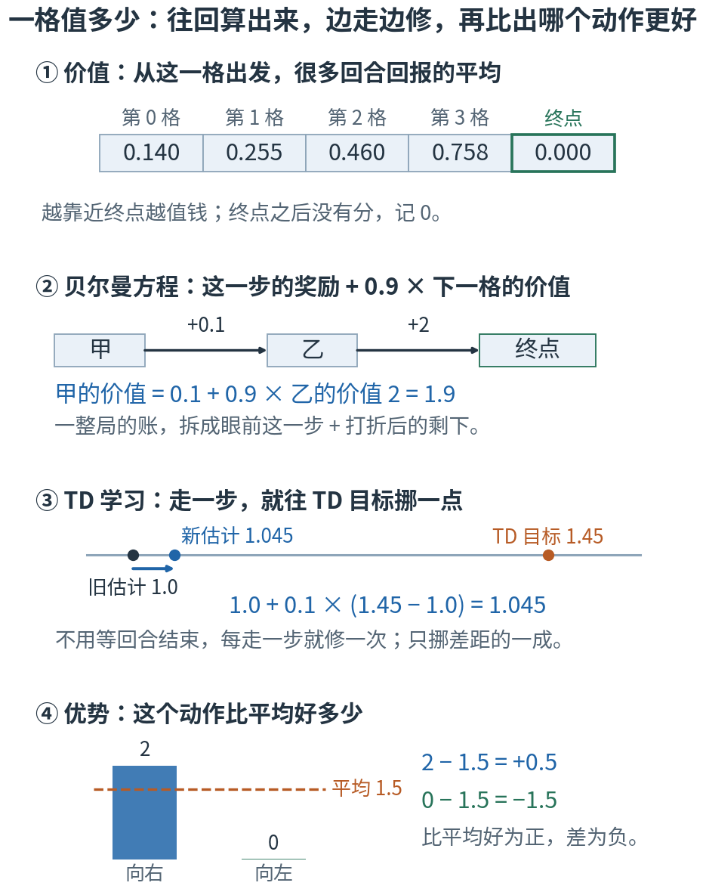
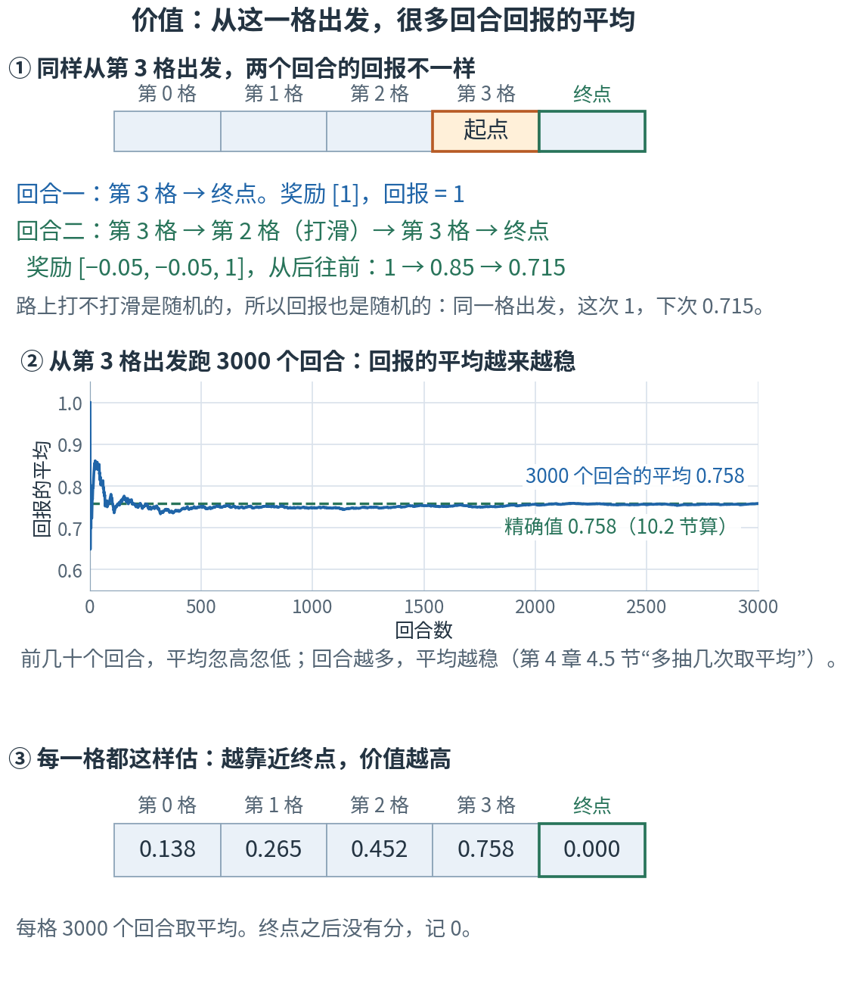
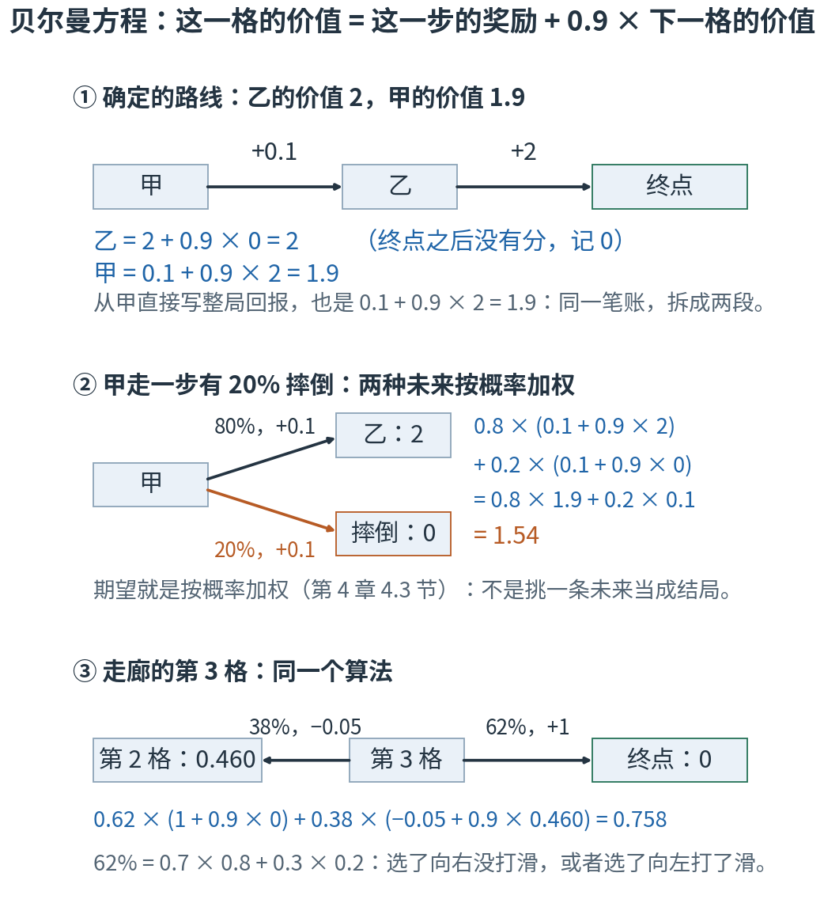
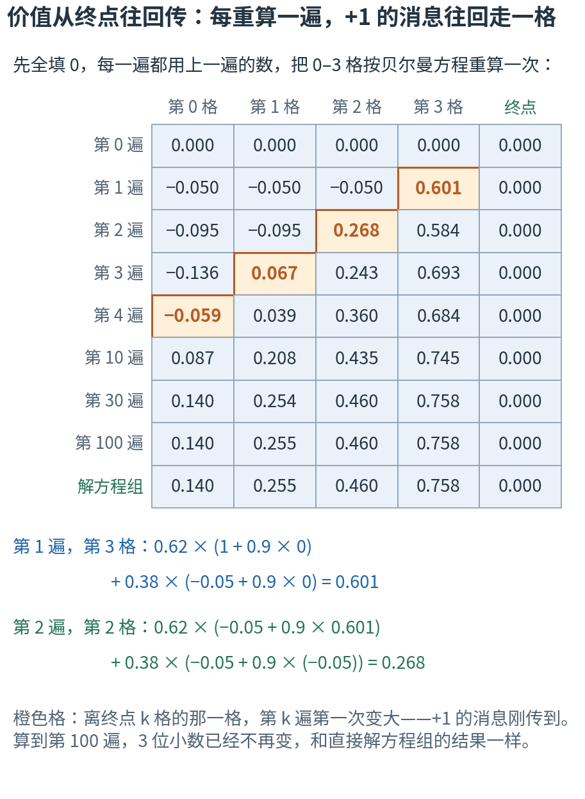
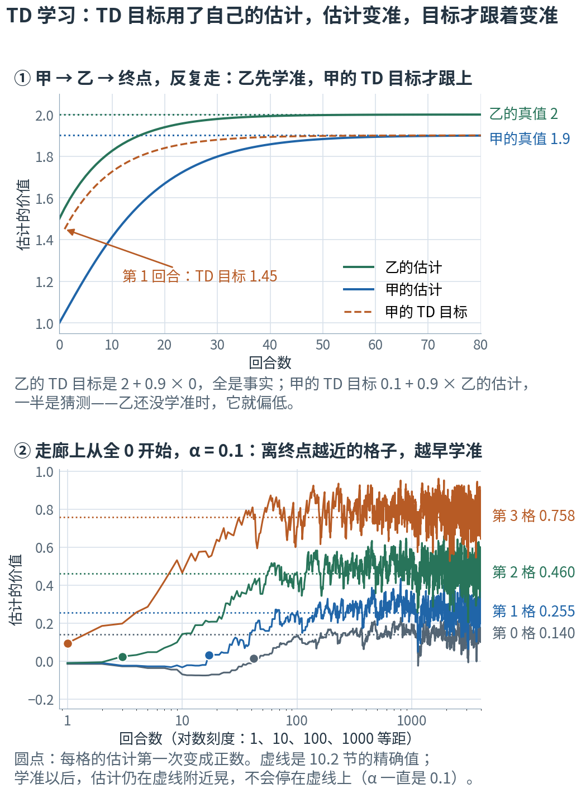
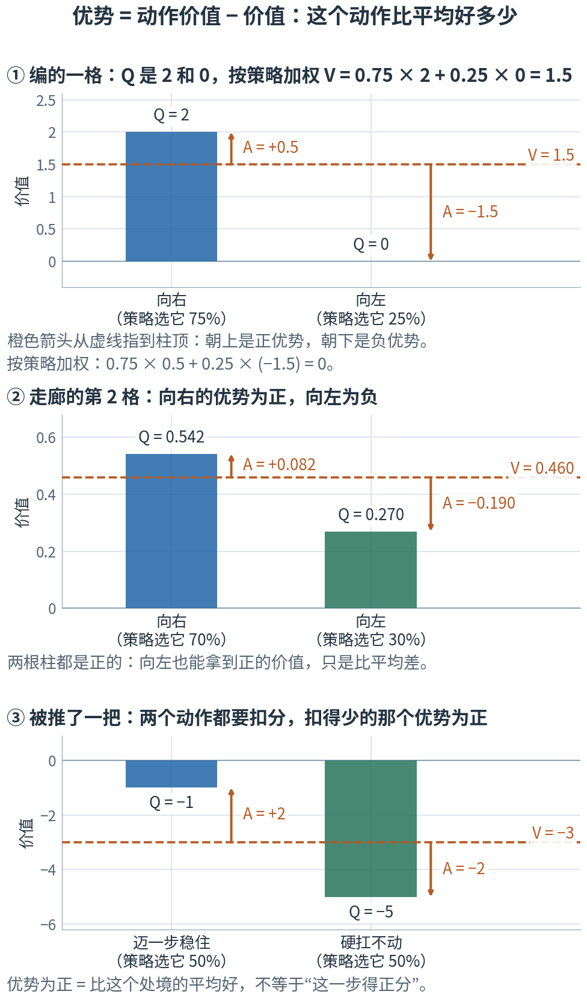

# 第 10 章 · 价值函数与贝尔曼方程：这一格值多少，一步一步往回算

> **上一章我们有了什么**：强化学习的循环——智能体看一眼（观测）、做动作、拿奖励；从某一步起、打过折的奖励总和叫回报；训练的目标是让平均回报最大（第 9 章）。
>
> **这一章要补什么**：回报要等回合结束才算得出来。可项目里每只机器人只走 24 步就要拧一次旋钮（第 7 章 7.6 节），一个回合却最长有 1000 步（20 秒，每秒 50 步）——等不起。
> 得在半路就估出"从这个处境往后，大概还能拿多少分"。这个估计叫**价值**；第 6 章 6.7 节那张最后只报一个数的 critic，报的就是它。
> 有了价值，还能算出"这个动作比平均好多少"——第 11 章（策略梯度）要用的正是这个量。
>
> **本章新词**：价值函数、蒙特卡洛估计、贝尔曼方程、TD 误差、自举、动作价值、优势、非对称 actor-critic。
> **需要的前提**：第 9 章的回报与折扣 γ（9.7 节）；第 4 章的期望（4.3 节）、"多抽几次取平均"（4.5 节）和竖线"给定"（4.7 节）；第 3 章的梯度下降与学习率（3.4 节）。
> **不要求**会解方程组——用到的地方都换成了"反复代入"。标"进阶"的折叠块可以第二遍再读。

---

## 10.0 先看地图：一格值多少，往回算出来，边走边修

**从一格出发、照着策略走下去，平均能拿到的回报，叫这一格的价值。价值可以一步一步往回算：这一格的价值 = 这一步的奖励 + 打过折的下一格的价值。
照着这条关系，每走一步就能把估计修一点，不用等回合结束。再细一点：先做某个动作、之后照策略走的价值，减去这一格的价值，就是这个动作比平均好多少。处境多到一张表存不下时，就用一张网络来估价值，它就是 critic。**

先想一个你天天见的东西：手机导航上的"预计还要多久"。

从北京开车去上海，导航说"还要 12 小时"。这个数不是哪一次的真实用时——每次路况都不一样；它说的是"照平常那样开，平均要多久"。
导航也不会每次都从北京一路算到上海：到天津这一段要多久、从天津到上海平均要多久，两段一加就是了。
开过天津，发现这一段堵了，比预计多用了 20 分钟，它不会等你到了上海才认错，当场就把"还要多久"改一点。
到了一个路口，它还会说"走左边的高速，比平常快 10 分钟"——这是拿一个选择，和"平常那样开"比。

这一章就是把导航的这四件事，搬到第 9 章的 5 格走廊上，再搬进机器人的训练。
（导航估的是时间，越少越好；价值估的是分，越多越好。方向相反，拆账的办法一样。）



**读图顺序：** 从 ① 到 ④ 竖着读。图里的数现在不用算，10.1–10.4 节会一个一个手算出来；
现在只看清四件事的次序：先有"一格值多少"，再把它拆成"这一步 + 下一格"，再用这条关系边走边修，最后拿它比较两个动作。

| 概念 | 它在回答什么问题 | 导航里对应什么 | 在哪一节 |
|---|---|---|---|
| 价值函数 | 从这一格出发、照策略走下去，平均能拿多少回报？ | 从这里到上海，平均还要多久 | 10.1 |
| 蒙特卡洛估计 | 不知道路况的概率，怎么估这个平均？ | 翻出很多次跑这段路的记录，取平均 | 10.1 |
| 贝尔曼方程 | 这个平均能不能拆开算？ | 到上海 = 到天津这一段 + 天津到上海 | 10.2 |
| TD 误差 | 走了一步，发现比估计的好还是差？差多少？ | 开过一段，实际用时和预计差了多少 | 10.3 |
| 自举 | 改估计时，还没走的那段用什么顶上？ | 剩下的路还没开，只能拿导航自己的预计顶上 | 10.3 |
| 动作价值、优势 | 先做这个动作、之后照策略走，平均多少？比平常好多少？ | 这个路口上高速，比平常快多少 | 10.4 |
| critic、非对称 actor-critic | 处境多到一张表存不下，怎么办？这张网络凭什么能比 actor 多看？ | 导航用一个模型来估，而不是背一张表 | 10.5 |

表里的名字先不背，英文和符号到了各节再给。本章字母多（V、δ、α、Q、A），10.4 节末尾有一张回看用的字母表。最容易混的几处，先贴上标签：

- **同一条走廊，两套设定**。第 9 章的走廊用 γ = 0.99、"总是按 →"、走满 50 步超时；本章为了好手算，换成 γ = 0.9、"每格 70% 向右"、不设步数上限。
  所以两章算出来的数不能互相对：同一个起点，第 9 章值 0.70 上下，本章只有 0.14。10.1 节一开头就说清，10.2 节末尾把这五倍的差距拆开给你看。
- **奖励、回报、价值：三个"分"**。奖励是一步的分；回报是一个回合里（从某一步起）实际拿到的总分，每次跑都可能不一样；价值是回报的平均，策略定了，一格就只有一个数。
  10.1 节会看到：同一格出发的两个回合，回报一个是 1、一个是 0.715，而这一格的价值是 0.758。
- **"TD 目标"的"目标"**：是"估计要往那儿挪的那个数"，不是第 9 章"让平均回报最大"那个训练目标。10.3 节还会提醒一次。
- **甲、乙不叫 A、B**：10.2、10.3 节用一条只有两格的路线手算，两个格子叫甲、乙——字母 A 留给 10.4 节的优势。
- **同一个 V，先是真值，后是估计**：10.1、10.2 节的 V 是价值本身（真值）；从 10.3 节起，V 也用来写"手里的估计"——一开始是猜的，每走一步改一次。10.3 节换用法的地方有 ⚠️。

现在觉得这些区别有点抽象很正常，读到对应小节就清楚了。

第一次读，只要按顺序看正文、图和手算。标着"进阶"的折叠内容可以先跳过；代码是复核工具，不是阅读门槛。

## 10.1 价值：从这一格出发，很多回合回报的平均

还是第 9 章的走廊：5 格，从左到右是第 0–4 格，第 4 格是终点。每一步选向左或向右，可地面有点滑：80% 照你选的走，20% 走反；撞了墙就停在原地。
走进终点得 +1，回合结束；其余每一步 −0.05。折扣 γ = 0.9。
本章固定一个策略：不管在哪一格，都是 70% 选向右、30% 选向左。

和第 9 章比，设定改了三处。第 9 章 9.9 节比较走法时，用的是项目的 γ = 0.99，策略是"总是按 →"或"随机乱按"，一个回合走满 50 步就超时；本章为了好手算，γ 取 0.9，策略固定成 70% 向右，也不设 50 步的上限——回合只在走进终点时结束。
设定一变，数就跟着变。第 9 章 9.9 节把"总是按 →"跑 2000 局的平均回报 0.703 叫作"起点的价值"，那个起点就是第 0 格；本章第 0 格的价值会小得多。
**两个数都没错，它们是同一条走廊上、两套设定下的两个价值**，别拿来互相对。10.2 节会按第 9 章的设定把 0.703 的精确值算出来，并说清两边差在哪。

第 3 格离终点一步，第 0 格离终点四步，直觉上第 3 格"更值钱"。值多少？从第 3 格出发，走两个回合看看。

**回合一**：选了向右，没打滑，一步进终点。奖励只有一个 1，回报就是 **1**。

**回合二**：选了向右，却打滑退到第 2 格（−0.05）；再往右，回到第 3 格（−0.05）；再往右，进终点（+1）。三步的奖励是 [−0.05, −0.05, 1]。
按第 9 章回报的算法，第 1 步的奖励原样，第 2 步乘 0.9，第 3 步乘 0.9 × 0.9 = 0.81：

$$-0.05 + 0.9 × (-0.05) + 0.81 × 1 = -0.05 - 0.045 + 0.81 = 0.715$$

倒着算更省事。从最后一步往前，每往前一步，就把"后面已经算好的那个数"乘 0.9，再加上这一步的奖励：

- 最后一步：1
- 倒数第二步：−0.05 + 0.9 × 1 = 0.85
- 第一步：−0.05 + 0.9 × 0.85 = 0.715

一样是 0.715。中间那个 0.85 也有意思：它正好是"从第 2 步起的回报"——站在第 2 格、往后两步的那笔账。
倒着算的每一步，只用"这一步的奖励"和"后面那个现成的数"，不用把后面的步子重新加一遍。这就是 JS 数组的 `reduceRight`：

```js
const rewards = [-0.05, -0.05, 1];                                // 回合二的三步奖励
const G = rewards.reduceRight((later, r) => r + 0.9 * later, 0);  // later = 后面算好的数：1 → 0.85 → 0.715
```

同一格出发，一次 1，一次 0.715：打不打滑是随机的，回报也跟着随机。那"第 3 格值多少"该怎么说？只看这两次，平均是 (1 + 0.715) / 2 = 0.8575，心里没底。
办法是第 4 章 4.5 节的老办法：不知道概率，就多抽几次取平均。实验第 1 节从第 3 格出发跑了 3000 个回合，回报的平均是 **0.758**；从别的格出发也各跑 3000 个，得到下图最下面那一排数。
（顺便记住一个数：从第 0 格出发的那 3000 个回合，平均要走 **11 步**才走进终点——每格只有 70% 选向右，路上免不了来回蹭。10.2 节末尾要用它。）



**这样读图：** ① 两个回合都从橙色的第 3 格出发：回合一一步到终点，回报 1；回合二打了一次滑，倒着算得 0.715。
② 横轴是跑了多少个回合，纵轴是"到目前为止所有回报的平均"。前几十个回合，蓝线忽高忽低；回合越多，蓝线越平，最后贴在 0.758 上。
绿色虚线是 10.2 节会用另一种办法算出的精确值——两条线重合。
③ 每一格都照这样估：0.138、0.265、0.452、0.758，越靠近终点越高；终点记 0。实验打印的"一般差多少"（第 4 章 4.5 节的 σ/√n）每格都不超过 0.007。

从一格出发、照着策略走下去，回报的平均——严格说是回报的期望（第 4 章 4.3 节：按概率加权的平均）——叫这一格的价值。
给每一格配上它的价值，这台"喂进去一格、吐出来一个数"的机器（第 1 章 1.1 节的函数），叫**价值函数**（value function），写成：

$$V^\pi(s) = \mathbb{E}\big[\,G_t \,\big|\, s_t = s\,\big]$$

| 符号 | 怎么读 | 就是 |
|---|---|---|
| $V^\pi(s)$ | "V 派 s" | 策略 π 下，从 s 出发的价值。走廊里 s 就是第几格：$V(3) = 0.758$；落到机器人身上，s 是网络的输入（第 9 章 9.3 节讲状态与观测时定的口径） |
| $\pi$ | "派" | 策略（第 4 章 4.7 节的记号）。本章是"每格 70% 向右" |
| $G_t$ | "G t" | 从第 t 步起的回报（第 9 章 9.7 节）。回合一里是 1，回合二里是 0.715 |
| $\mathbb{E}[\ \cdot\ ]$ | "期望" | 按概率加权的平均（第 4 章 4.3 节） |
| $\mid s_t = s$ | "给定第 t 步在 s" | 竖线读"给定"（第 4 章 4.7 节）：只算从 s 出发的那些回合 |

用"跑很多次、取平均"去估一个期望，叫**蒙特卡洛估计**（Monte Carlo estimate）。第 4 章 4.5 节末尾说"这个名字第 10 章会再见到"，就是这里。
名字里的"蒙特卡洛"是摩纳哥的赌城：答案靠反复掷骰子得来。它的好处是简单，连打滑的概率都不用知道；毛病是非得把回合走完，才能拿到一个回报。

还有两件事，写在这里：

- **价值取决于策略。** 上标 π 就是提醒这个。换一个总往左走的策略，站在第 3 格也拿不到多少分。
- **终点记 0。** 走进终点的那个 +1，已经算在"走进去的那一步"的奖励里了；到了终点回合就结束，之后没有分。

> **停一下，自测**：从第 2 格出发，一路没打滑，两步进终点，奖励是 [−0.05, 1]。回报是多少？它和上面回合二倒着算出的哪个数一样？为什么一样？
> <details><summary>答案</summary>
>
> 倒着算：1 → −0.05 + 0.9 × 1 = 0.85。和回合二倒着算的中间数 0.85 一样：回合二从第 2 步起，也正好是"站在第 2 格、往右两步进终点"。
> 从某一步起的那笔账，只看后面的步子，和前面是怎么来的无关——10.2 节就靠这一点拆账。
>
> </details>

## 10.2 贝尔曼方程：总账 = 这一步 + 打过折的剩下

蒙特卡洛要把回合走完。能不能不走完？

问"北京到上海多远"，可以答"北京到天津多远 + 天津到上海多远"。只要天津到上海早就量好了，就不用从北京重新量一遍。
价值也能这样拆：**这一格的价值 = 这一步拿到的奖励 + 打一次折的下一格的价值。** 先在一条最短的路线上手算。

### 两格：甲 → 乙 → 终点

一条编出来的路线，只有两格：从乙走一步得 2 分，进终点；从甲走一步得 0.1 分，到乙。折扣还是 0.9。

- **乙**：这一步 2，之后是终点，没有分：V(乙) = 2 + 0.9 × 0 = **2**。
- **甲**：这一步 0.1，之后站在乙，而乙的价值刚算过是 2，打一次折：V(甲) = 0.1 + 0.9 × 2 = **1.9**。

对一下账：从甲出发，整个回合就是"先 0.1，再 2"，按回报的定义是 0.1 + 0.9 × 2 = 1.9。同一个数。
拆账没有凭空加分，也没有漏分，只是把"后面所有的奖励"换成了一个现成的数——下一格的价值。10.1 节倒着算回报，用的就是这一招。

现在让它随机一点：**甲走这一步，有 20% 会摔倒，回合就此结束**（之后没有分，价值记 0）；80% 顺利到乙。两种情况，这一步都拿 0.1：

$$V(\text{甲}) = 0.8 × (0.1 + 0.9 × 2) + 0.2 × (0.1 + 0.9 × 0) = 0.8 × 1.9 + 0.2 × 0.1 = 1.52 + 0.02 = 1.54$$

摔倒那一支只有这一步的 0.1，后面乘的是 0：摔倒是回合结束，不是走廊里撞墙那样"停在原地、下一步接着走"。要是停在原地，那一支就得写成 0.1 + 0.9 × V(甲)，是另一笔账。

这就是第 4 章 4.3 节的期望：两种未来，各算各的账，再按概率加权。实验第 2 节从甲出发抽了 20000 个回合，回报的平均是 1.535，和 1.54 差不到 0.01。

> ⚠️ **1.54 这个价值，哪一个回合都拿不到。** 从甲出发，一个回合的回报不是 1.9（顺利到乙）就是 0.1（这一步就摔倒），从来不会恰好是 1.54。
> 期望是把两种未来按概率摊开来算的一笔账，不是挑一条未来当结局。10.1 节第 3 格的 0.758 也一样：那里两个回合的回报是 1 和 0.715，没有哪一个是 0.758。
> 看到"价值"两个字，先提醒自己一句：这是平均，不是这一次。



**这样读图：** ① 箭头上写的是这一步的奖励；下面两行是账：先算乙，再用乙算甲。
② 甲分出两根箭头，各写着概率和奖励；右边的账把两种未来按 80%、20% 加起来。
③ 是下面马上要算的走廊第 3 格：方框、箭头、账的读法和 ② 一模一样。

"这一格的价值 = 这一步的奖励 + γ × 下一格的价值，按概率取平均"，叫**贝尔曼方程**（Bellman equation）：

$$V^\pi(s) = \mathbb{E}\big[\, r + \gamma\, V^\pi(s') \,\big]$$

| 符号 | 怎么读 | 就是 |
|---|---|---|
| $s$ | | 这一格（甲） |
| $r$ | | 这一步拿到的奖励（0.1） |
| $s'$ | "s 撇" | 走一步之后到的那一格（乙，或者摔倒） |
| $\gamma$ | "伽马" | 折扣，本章是 0.9 |
| $\mathbb{E}[\ \cdot\ ]$ | "期望" | 对"这一步会发生什么"按概率加权：选哪个动作、打不打滑、摔不摔 |

等号两边都有 V：左边是这一格的，右边是下一格的。它说的是各格的价值之间必须满足的关系，所以叫"方程"。

下面这段推导，把 10.1 节"倒着算"的那一步和这条方程接起来；第一次读可以跳过，上面甲、乙的账已经说明了它为什么成立。

<details>
<summary>进阶：从"倒着算回报"推出贝尔曼方程，再把期望写全（现在可跳过）</summary>

10.1 节倒着算的每一步，写成式子是 $G_t = r_t + \gamma\,G_{t+1}$：从第 t 步起的回报 = 这一步的奖励 + 0.9 × 从下一步起的回报。

1. 两边都对"从 s 出发的所有回合"取平均。左边的平均，按定义就是 $V(s)$。
2. 右边用期望的线性（第 4 章 4.3 节：先加再平均 = 先平均再加，常数可以提出来）：$\mathbb{E}[r_t] + \gamma\,\mathbb{E}[G_{t+1}]$。
3. $G_{t+1}$ 的平均，可以先看走到了哪一格 $s'$：从 $s'$ 往后的回报，平均起来就是 $V(s')$——往后的路只看现在在哪一格，不看以前怎么来的（第 9 章 9.3 节的马尔可夫性质）。所以 $\mathbb{E}[G_{t+1}] = \mathbb{E}[V(s')]$。
4. 合起来：$V(s) = \mathbb{E}[\,r_t + \gamma V(s')\,]$，就是正文那条。

期望里其实有两层随机：先按策略抽动作 a，再按环境抽下一格 s'。写全了是

$$V^\pi(s) = \sum_a \pi(a\mid s) \sum_{s'} P(s'\mid s, a)\,\big[\,r + \gamma\, V^\pi(s')\,\big]$$

两个 Σ 就是两层 for 循环（第 2 章 2.2 节）；$P(s'\mid s, a)$ 是"在 s 做 a，到 s' 的概率"（打滑就藏在这里）。
走廊里 r 只看走到了哪一格，所以两层可以先合并：到右边一格的概率 = 0.7 × 0.8 + 0.3 × 0.2 = 0.62——正文马上就用这个数。

5 格的走廊就是 5 条方程、5 个未知数，也可以直接解方程组。实验第 2 节用 numpy 直接解了一次，结果和正文"反复代入"得到的一样。
机器人看到的是几十个连续的数，可能的取值有无穷多种，写不出这样的方程组——所以要靠 10.3 节的 TD 学习和 10.5 节的网络。

</details>

### 走廊：每一格一条方程

走廊里每一格都能写一条贝尔曼方程。先把"选哪个动作"和"打不打滑"合在一起：实际往右走一格，要么是选了向右、没打滑（0.7 × 0.8 = 0.56），要么是选了向左、打了滑（0.3 × 0.2 = 0.06），合计 **0.62**；实际往左，就是剩下的 **0.38**。

第 3 格：62% 往右进终点（这一步 +1，之后 0）；38% 往左到第 2 格（这一步 −0.05，之后是第 2 格的价值 V(2)）：

$$V(3) = 0.62 × (1 + 0.9 × 0) + 0.38 × \big(-0.05 + 0.9 × V(2)\big)$$

把实验算出的 V(2) = 0.460 代进去：0.9 × 0.460 = 0.414，−0.05 + 0.414 = 0.364；0.62 + 0.38 × 0.364 = 0.62 + 0.13832 = 0.75832，约等于 **0.758**——正是 10.1 节跑 3000 个回合估出来的那个数。

可 0.460 又是从哪来的？第 2 格的方程里有 V(1) 和 V(3)，第 1 格的方程里又有 V(0) 和 V(2)……五格互相引用，没有哪一格能先算。
办法很笨，也很管用：**先全填 0，然后按方程一遍一遍地重算，每一遍都用上一遍的数。**

- 第 1 遍，第 3 格：0.62 × (1 + 0.9 × 0) + 0.38 × (−0.05 + 0.9 × 0) = 0.62 − 0.019 = **0.601**。第 0–2 格往哪边走都只拿 −0.05，下一格又都还是 0，所以都是 −0.05。
- 第 2 遍，第 2 格：0.62 × (−0.05 + 0.9 × 0.601) + 0.38 × (−0.05 + 0.9 × (−0.05)) = 0.62 × 0.4909 − 0.38 × 0.095 ≈ **0.268**。第 3 格刚拿到的 +1 的"消息"，传到了第 2 格。



**这样读图：** 每一行是重算完一遍之后五格的数，从上往下越算越多。先跟着橙色格往左下走：第 1 遍是第 3 格，第 2 遍是第 2 格，第 3 遍是第 1 格，第 4 遍是第 0 格——离终点几格，就要第几遍才第一次变大（第 0 格这一遍从 −0.136 变到 −0.059，虽然还是负的，但 +1 的消息已经到了）。
再看下面几行：第 30 遍只有第 1 格还差最后一位（0.254 对 0.255），第 100 遍和最后一行"解方程组"的结果完全一样。

表里有一处容易看愣：第 3 格第 2 遍**不升反降**，从 0.601 掉到 0.584。自己按方程算一遍就明白了——这一遍它右手边还是终点（0.62 × 1 一点没变），左手边用的却是上一遍留下的 V(2) = −0.05，比第 1 遍用的 0 还差：

$$0.62 × 1 + 0.38 × \big(-0.05 + 0.9 × (-0.05)\big) = 0.62 + 0.38 × (-0.095) = 0.62 - 0.0361 = 0.5839$$

等第 3 遍第 2 格自己变好（0.268），第 3 格就跟着回到 0.693。所以"往回传"不是一格一格单向地涨：**每一格都跟着邻居上下调，最后才一起停下来。**

越算越靠近某个数、到后来几乎不再变，叫**收敛**。这张表就是贝尔曼方程在"算"价值：不用跑一个回合，只要知道打滑的概率，把"这一步 + 0.9 × 下一格"反复代入，终点的 +1 就一格一格往回传，最后收敛到每一格的价值。

### 第 k 遍的数，就是"最多再走 k 步"的平均回报

这张表还藏着一件事，知道了它，"为什么会收敛"和"该代几遍"就都不用猜了。

**第 k 遍算出来的数，正好是"最多再走 k 步就收工"时的平均回报。**

第 1 遍最好验。第 3 格那一格是 0.62 × 1 + 0.38 × (−0.05) = 0.601：只走一步，62% 进终点拿 +1，38% 退到第 2 格拿 −0.05，走完这一步就收工，后面一概不算——这正是"最多走一步"的平均回报。
第 0–2 格只走一步怎么也够不着终点，所以都是 −0.05。
第 2 遍把式子里"下一格的价值"换成第 1 遍那套"最多走一步"的数，算出来的就是"最多走两步"；第 3 遍最多三步……**每多代一遍，就多看一步。**
（实验第 2 节拿"最多走 4 步就停"的回合实打实抽了 20000 次，平均和第 4 遍的 −0.059 对上。）

这样一来，收敛也不神秘了：γ = 0.9，往后第 k 步的分只算 $0.9^k$（第 9 章 9.7 节）。第 30 步只算 0.042，第 60 步只算 0.042 × 0.042 = 0.0018——再多代几遍，能新加进来的那点分越来越少，表自然就不动了。

这也答得上第 9 章留的那句话。9.9 节说："总是按 →"的精确值 0.7015 是用一种不抽样的办法算的，第 10 章讲——就是这一招：换成那一章的设定（总是按 →、γ = 0.99），从全 0 反复代入。代几遍？那一章一个回合最多走 50 步（9.6 节的超时），它要的正是"最多再走 50 步"的平均回报，所以代 50 遍，不多不少。实验第 2 节照做了一遍，第 0 格正是 0.7015。

顺手把两套设定的差距看明白，省得以后记混：同一条走廊、同一个第 0 格，本章算出 0.140，第 9 章算出 0.7015，差了五倍。差在 10.1 节说的那两处设定上。

- **折扣**：本章 γ = 0.9，从第 0 格到终点至少四步，那个 +1 最多只剩 $0.9^4 = 0.6561$（0.9² = 0.81，0.81² = 0.6561）；第 9 章 γ = 0.99，四步之后还剩 0.9606（控制台按 `0.99 ** 4`）。
- **策略**：本章每格只有 70% 选向右，10.1 节那 3000 个回合从第 0 格出发平均要走 11 步，一路每步 −0.05 越扣越多；第 9 章"总是按 →"平均 6 步多就到了（9.9 节）。

两种办法对一对（实验第 2 节）：

```
格子  蒙特卡洛  精确值      差
----  --------  ------  ------
   0     0.138   0.140  -0.002
   1     0.265   0.255   0.010
   2     0.452   0.460  -0.008
   3     0.758   0.758   0.000
   4     0.000   0.000   0.000
```

差得最多的是第 1 格，0.010，约是它"一般差多少"（0.007 左右）的一倍半——正是第 4 章 4.5 节说的"运气差一点而已"。蒙特卡洛跑了 12000 个回合才得到这一排数；贝尔曼方程一个回合都没跑，靠的是知道打滑的概率。
机器人没有这张概率表——下一节就是既不知道概率、也不想把回合走完的办法。

> **停一下，自测**：① 终点的价值记 0，会不会把"走进终点"的那个 +1 漏掉？② 把两格路线的折扣改成 0.5（不会摔倒），甲的价值是多少？
> ③ 第 1 遍算出第 2 格是 −0.05。用"最多再走 k 步"的说法，这个 −0.05 在说什么？为什么同一遍里第 3 格却有 0.601？
> <details><summary>答案</summary>
>
> ① 不会。+1 是"走进终点那一步"的奖励 r，在 0.62 × (1 + 0.9 × 0) 里就是那个 1；终点价值 0 说的只是"到了之后没有后续的分"。
> ② 0.1 + 0.5 × 2 = 1.1。折扣越小，后面那 2 分打的折越狠。
> ③ 它是"从第 2 格出发、只许走一步"的平均回报：往右到第 3 格不是终点，往左到第 1 格也不是终点，两边都只拿 −0.05，之后一概不算，所以平均就是 −0.05。
> 第 3 格一步就够得着终点，62% 能拿到那个 +1，所以第 1 遍它就有 0.62 × 1 + 0.38 × (−0.05) = 0.601。
>
> </details>

## 10.3 TD 学习：走一步，往 TD 目标挪一点

贝尔曼方程说：这一格的价值 = 这一步的奖励 + 0.9 × 下一格的价值，按概率取平均。10.2 节拿它来**算**价值，前提是知道打滑的概率。
不知道概率，也能拿它来**学**价值：每真走一步，就用"刚拿到的奖励 + 0.9 × 下一格的估计"当靶子，把这一格的估计往靶子挪一点。不用等回合结束——就像导航开过一段就改预计时间。

手算一步。回到两格的确定路线（甲 → 乙 → 终点，不会摔），假装还不知道真值 1.9 和 2，手里的估计是随便猜的：甲 1.0，乙 1.5。现在从甲走了一步，到了乙，拿到 0.1：

1. **靶子**：刚拿到的 0.1，加上 0.9 × 乙的估计：0.1 + 0.9 × 1.5 = 1.45。
2. **差多少**：1.45 − 1.0 = 0.45。比原来估的好 0.45。
3. **只挪一成**：1.0 + 0.1 × 0.45 = 1.045。

甲的估计从 1.0 变成了 1.045。注意这里有两个 0.1：靶子里的 0.1 是甲这一步拿到的奖励，"挪一成"的 0.1 是一个倍数。数碰巧一样，角色不同。

那个靶子叫 **TD 目标**；靶子减旧估计的差，叫 **TD 误差**（temporal-difference error）。TD 是"时间上的差"：拿下一个时刻的估计，去修这一个时刻的估计。
那个"一成"是一个倍数，记作 α，和第 3 章 3.4 节的学习率是同一个角色：乘在"要改多少"前面的倍数。这样一步一修的学法，就叫 TD 学习。

$$\delta_t = r_t + \gamma\, V(s_{t+1}) - V(s_t), \qquad V(s_t) \leftarrow V(s_t) + \alpha\,\delta_t$$

| 符号 | 怎么读 | 就是 |
|---|---|---|
| $V(s_t)$ | "V s t" | 这一格眼下的估计：手里正在改的那个数（甲的 1.0） |
| $r_t + \gamma\,V(s_{t+1})$ | | TD 目标：一步真实的奖励 + 下一格的**估计**（刚才的 1.45） |
| $\delta_t$ | "德尔塔 t" | TD 误差 = TD 目标 − 旧估计（0.45）。正的：比估计的好；负的：比估计的差 |
| $\alpha$ | "阿尔法" | 挪多少的倍数（0.1）。角色同学习率：乘在"要改多少"前面 |
| $\leftarrow$ | "更新为" | 第 3 章 3.4 节：右边算完，存回左边 |

> ⚠️ **式子里的 V 是估计，不是真值。** 10.2 节的 V(甲) = 1.9 是真值，一个确定的数；这里的 V 是手里正在改的那张表（甲 1.0、乙 1.5）。本章同一个字母两种用法都有：说"这一格值多少"时指真值，写 TD 更新、说 critic 报的数时指估计。

> ⚠️ **TD 目标不是训练目标。** TD 目标是"估计要往那儿挪的那个数"，每走一步换一个；第 9 章"让平均回报最大"说的是整个训练要达到的目标。两个"目标"不是一回事。

### 为什么不一步改成 1.9：自举

两格路线的真值，10.2 节算过：甲 1.9。为什么不直接改成 1.9？
因为这一步只有 0.1 是真拿到的；后面的 1.5 是自己的估计，而且估错了（乙的真值是 2）。靶子里掺着一个错的数，靶子本身就偏低：1.45，不是 1.9。

接着走：每个回合先修甲，再修乙。乙的 TD 目标是 2 + 0.9 × 0 = 2——终点之后没有分，全是真拿到的，所以乙学得最快；乙准了，甲的 TD 目标 0.1 + 0.9 × 乙的估计，才跟着准。实验第 3 节走了 80 个回合：

```
回合  甲的 TD 目标  甲的估计  乙的估计
----  ------------  --------  --------
   1         1.450     1.045     1.550
   2         1.495     1.090     1.595
   3         1.536     1.135     1.635
  10         1.726     1.412     1.826
  30         1.879     1.798     1.979
  80         1.900     1.899     2.000
```

第 2 回合可以手算核对：乙此刻是 1.55，甲的 TD 目标 0.1 + 0.9 × 1.55 = 1.495，甲 1.045 + 0.1 × (1.495 − 1.045) = 1.045 + 0.045 = 1.09。

TD 目标里拿自己的估计，顶替"还没走的那段未来"，叫**自举**（bootstrapping，英文说法是"拽着自己的鞋带，把自己提起来"）。
好处是不用等回合结束；代价是估计错了，TD 目标就跟着错——**早期的 TD 目标是错的，因为喂给它的估计是错的**。
所以"TD 目标比旧估计多了一步真实的奖励"，不等于"它每次都更准"：环境一随机（打滑）、估计一出错，某一次的 TD 目标都可能偏离真值。只有反复走、一点点挪，才靠得住。
第 12 章（GAE）会在"信几步真实奖励、信多少自己的估计"之间折中。

### 走廊上：离终点近的格子先学准

两格的路线太顺了——不会打滑，每次都走同一条路，甲的估计只能一个方向往上爬。回到 10.1 节那条会打滑的 5 格走廊，把 TD 原样搬过去：

四格的估计全填 0（不知道就先当 0）；每个回合从第 0–3 格里随便挑一格出发；每走一步，就按上面那条式子修一次当前这一格，α 还是 0.1；一共走 4000 个回合。
这一次既不知道打滑的概率，也不解方程组——只是一步一步地走，一点一点地修。



**这样读图：** ① 是上一小节那两格：绿线是乙的估计，蓝线是甲的估计，橙色虚线是甲每个回合的 TD 目标；两条点线是真值 2 和 1.9。
先看绿线：它最先贴上 2。再看橙线：第 1 回合只有 1.45，跟着绿线一路抬高，最后贴上 1.9。蓝线追着橙线走——甲永远在追一个自己也在动的靶子。
② 就是刚说的那 4000 个回合。横轴是对数刻度（第 3 章 3.5 节用过）：1、10、100、1000 之间的距离相等，好把前 100 个回合拉开看。
四个圆点是每一格的估计第一次变成正数的时刻：第 3 格走完第 1 个回合就是正的，第 2 格在第 3 个回合，第 1 格在第 17 个，第 0 格在第 42 个。
虚线是 10.2 节的精确值：学准以后，四条线都在各自的虚线附近晃；细看，第 3 格那条大多在虚线上方——下一小节会说为什么。

第 3 格挨着终点：从它出发，62% 的时候 TD 目标是 1 + 0.9 × 0，全是真拿到的，所以它最先学准。第 0 格的 TD 目标全靠别的格子的估计，别的格子没学好，它就学不好。
+1 的消息也是从终点一格一格往回传——和 10.2 节那张表是同一件事，只是这里走一步、传一点。实验打印的几个时刻，最后两行是精确值和后一半回合的平均：

```
      回合数  第 0 格  第 1 格  第 2 格  第 3 格
------------  -------  -------  -------  -------
           1   -0.014   -0.010   -0.010    0.095
          10   -0.069   -0.032    0.143    0.466
         100    0.130    0.246    0.469    0.709
        1000    0.189    0.315    0.566    0.870
        4000    0.135    0.307    0.501    0.711
      精确值    0.140    0.255    0.460    0.758
后一半的平均    0.120    0.250    0.474    0.785
```

前三行就是"从终点往回传"：第 1 个回合只有第 3 格变成正的（0.095），另外三格还都是负的；第 10 个回合第 2 格跟上（0.143）；到第 100 个回合，四格离精确值都已经不远。

### α 一直不变，估计就一直在晃

可到了第 100 个回合之后，它们并不停在精确值上：第 1000 个回合时第 3 格晃到了 0.870，第 4000 个回合又回到 0.711。
α 一直是 0.1，每走一步，都把估计往"最近这一次经历"拉一成——最近几个回合运气好，估计就高一点，运气差就低一点。晃是这么来的，它不会自己停。

最后一行，是后一半回合（第 2000 个回合以后）的估计取的平均。晃动大体抵消了，可也没有正好落在精确值上：第 3 格 0.785，高了 0.785 − 0.758 = 0.027；第 0 格 0.120，低了 0.020。
下面这个折叠块把这两份偏差拆开来量了一遍：一份怪"什么时候看"，一份是 α 固定不变本身的代价，两份都随 α 一起变小。
结论先放在这里：**这不是"TD 学不准"，而是"α 固定就永远在追最近的经历"。** α 调小，晃得轻、偏得也少，代价是学得慢（"改一改"第 2 条就是让你看这个）。

<details>
<summary>进阶：平均起来为什么还偏一点（现在可跳过）</summary>

两份偏差，分开量。

**第一份：什么时候看。** 拿第 3 格说。表里的数，都是每个回合刚结束时记下的；而每个回合的最后一步，都是从第 3 格走进终点（实验核对过：4000 个回合全是这样结束的）。
那一步的 TD 目标是 1，刚把第 3 格往上拉了 0.1 × (1 − 0.758) = 0.0242——每次看它，都正好看在它刚被拉高的时候。
改成每走一步记一次、再取平均，第 3 格就只高 0.004 了：0.027 里有 0.027 − 0.004 = 0.023，和预测的 0.024 对得上。

**第二份：α 固定不变本身。** 第 0 格没有"什么时候看"的问题（没有哪个回合在它这儿结束），可每走一步记一次，它照样低 0.019。
这一份的来头要绕一点：修第 0 格用的 TD 目标里有下一格的估计，而下一格的估计自己也在晃；更要紧的是，它晃到哪个数，和这一步刚好走到哪一格是连着的——同一段路既决定了走去哪儿，也决定了那一格此刻晃成什么样。
两个连着晃的数凑一块儿取平均，得到的不是"拿两个准数算一遍"的结果。α 越小，各格晃得越轻，这份错配也越小。

实验第 3 节把 α 换成 0.05、0.025 各重跑了一遍（α 小学得慢，回合数跟着翻倍；每一档换 3 组随机数取平均），两份偏差一起缩：

```
    α  回合数  第 3 格回合末记  第 3 格每步记  两者之差  α × (1 − 0.758)
-----  ------  ---------------  -------------  --------  ---------------
0.100    4000            0.028          0.006     0.022            0.024
0.050    8000            0.013          0.002     0.010            0.012
0.025   16000            0.008          0.003     0.005            0.006
```

最后两列一行行对：0.022 对 0.024、0.010 对 0.012、0.005 对 0.006——"什么时候看"这一份，大小跟着 α 成比例缩，预测得住。
第 0 格"每步记"的偏差，同一批跑出来是 −0.018、−0.010、−0.003：α 每减半一次，它也跟着小一截，三档下来缩到原来的六分之一。
所以两份都不是"TD 学不准"，而是 α 的价钱。想要更准，就把 α 调小，或者让它随着训练慢慢变小；代价是学得慢。

第一份偏差也不是这一次运气不好：实验还换了 10 组随机数重跑 α = 0.1 这一档，第 3 格后一半的平均每一次都偏高（高 0.018 到 0.040）。

</details>

> **停一下，自测**：① 第 2 回合结束时，甲是 1.09，乙是 1.595。第 3 回合从甲走到乙、拿到 0.1：甲的 TD 目标、TD 误差、新估计各是多少？和表里第 3 行对一对。
> ② 走廊那张表里，第 1000 个回合第 3 格是 0.870，比精确值 0.758 高了 0.112。能不能说"TD 把第 3 格学错了"？
> <details><summary>答案</summary>
>
> ① TD 目标 0.1 + 0.9 × 1.595 = 1.5355；TD 误差 1.5355 − 1.09 = 0.4455；新估计 1.09 + 0.1 × 0.4455 = 1.13455。
> 表里按 3 位小数印成 1.536 和 1.135。
> ② 不能。α 一直是 0.1，估计就一直在精确值附近晃，挑某一个时刻的数说事没有意义——同一格第 4000 个回合是 0.711，又低了。
> 要看的是后一半回合的平均 0.785；它剩下的那 0.027 才是真要解释的东西（上面的进阶块把它拆成了两份）。
>
> </details>

## 10.4 动作价值与优势：这个动作比平均好多少

价值 V 回答的是"站在这一格、照策略走，平均多少"。训练策略时要问得更细：在这一格，**先**做向右（不管策略平常怎么选），之后再照策略走，平均多少？先做向左呢？哪个比平常好？

先看一个编出来的格子（这是新例子，和甲、乙无关；下面的 2 和 1.5 碰巧和前两节的数重了，意思不同）：策略在这一格 75% 选向右、25% 选向左。先向右、之后照策略走，平均能拿 2；先向左，平均是 0。
（这两个"平均能拿多少"先直接给你，好把关系看清楚；下面走廊的例子会从头算一遍。）

- 这一格的价值：先按策略抽动作，再看结果，按概率加权（第 4 章 4.3 节）：V = 0.75 × 2 + 0.25 × 0 = **1.5**。
- 向右比平均好多少：2 − 1.5 = **+0.5**；向左：0 − 1.5 = **−1.5**。

"先做 a、之后照策略走"的回报平均，叫**动作价值**（action value），写成 Q(s, a)；它减去这一格的价值，叫**优势**（advantage）：

$$A^\pi(s, a) = Q^\pi(s, a) - V^\pi(s), \qquad V^\pi(s) = \sum_a \pi(a\mid s)\,Q^\pi(s, a)$$

| 符号 | 怎么读 | 就是 |
|---|---|---|
| $Q^\pi(s, a)$ | "Q 派 s a" | 在 s 先做 a、之后照策略走，回报的平均（向右 2，向左 0） |
| $A^\pi(s, a)$ | "A 派 s a" | 优势 = Q − V：这个动作比这一格的平均好多少（+0.5、−1.5） |
| $\sum_a \pi(a\mid s)\,Q(s,a)$ | | 每个动作的 Q 乘上策略选它的概率，加起来（0.75 × 2 + 0.25 × 0）——V 就是 Q 按策略的平均 |

优势按策略加权，平均是 0：0.75 × 0.5 + 0.25 × (−1.5) = 0.375 − 0.375 = 0。这不是巧合：V 本来就是各个 Q 按策略的平均，每个 Q 都减去这个平均，再按同样的权重求平均，剩下的只能是 0。

> ⚠️ **"平均是 0"要按策略加权。** 两个优势直接相加是 0.5 + (−1.5) = −1，不是 0。常选的动作权重大，少选的权重小。

再看走廊的第 2 格，这回从头算（用 10.2 节的精确值 V(1) = 0.255、V(3) = 0.758）。算法就是 10.2 节那条贝尔曼方程，只改一处：**第一步的动作不按策略抽，由我们指定**，之后照旧"这一步的奖励 + 0.9 × 下一格的价值，按概率加权"。

先向右：80% 没打滑，到第 3 格；20% 打滑，到第 1 格。0.9 × 0.758 = 0.6822，所以到第 3 格那一支是 −0.05 + 0.6822 = 0.6322；0.9 × 0.255 = 0.2295，到第 1 格那一支是 −0.05 + 0.2295 = 0.1795：

$$Q(2, \text{右}) = 0.8 × 0.6322 + 0.2 × 0.1795 = 0.50576 + 0.0359 = 0.54166 ≈ 0.542$$

先向左，两支的概率正好反过来：Q(2, 左) = 0.8 × 0.1795 + 0.2 × 0.6322 = 0.1436 + 0.12644 = 0.27004 ≈ 0.270。
按策略加权：V(2) = 0.3 × 0.270 + 0.7 × 0.542 = 0.081 + 0.3794 = 0.4604 ≈ 0.460，正是 10.2 节的精确值——**V 和 Q 的唯一区别，就是第一步是按策略抽的，还是我们指定的**；把两个 Q 按策略再平均一次，就退回成 V。
优势：向右 0.542 − 0.460 = **+0.082**，向左 0.270 − 0.460 = **−0.190**。



**这样读图：** 每幅图里，条形的高度是动作价值 Q，橙色虚线是这一格的价值 V，橙色箭头从虚线指到条形的顶端，长度就是优势：朝上是正，朝下是负。
① 就是上面的手算。② 两根条形都是正的：在第 2 格往左走，平均也能拿到正的价值，只是比平均差。③ 马上讲。

**优势为正，不等于这一步得正分。** 机器人被推了一把，怎么做都要扣分：迈一步稳住，平均 −1；硬扛不动，平均 −5；策略两个各选一半。
V = 0.5 × (−1) + 0.5 × (−5) = −3。迈一步的优势是 −1 − (−3) = **+2**：它比这个处境的平均少扣 2 分。
所以"优势为正"说的是"比这个处境的平均好"，不能翻译成"这一步的奖励是正的"，也不能翻译成"这个动作安全"。

那 10.3 节的 TD 误差 δ 和优势是什么关系？还是第 2 格向右。没打滑时，到第 3 格：δ = −0.05 + 0.9 × 0.758 − 0.460 = 0.1722；打滑时，到第 1 格：δ = −0.05 + 0.9 × 0.255 − 0.460 = −0.2805。
按 80%、20% 平均：0.8 × 0.1722 + 0.2 × (−0.2805) = 0.13776 − 0.0561 = 0.08166 ≈ 0.082——正好是向右的优势。
**一次 δ，是优势的一次抽样**：可正可负，平均起来才是优势。

**为什么重要**：第 11 章（策略梯度）要做的，就是把优势为正的动作的概率推高、为负的推低；第 12 章（GAE）讲怎么从一串 δ 里把优势估得更好。项目的训练代码里，优势就是从 δ 算出来的（📍 映射到项目）。

> **停一下，自测**：训练时看到某一步的 δ = +0.17。能不能据此断定"这一步的动作是好动作"？
> <details><summary>答案</summary>
>
> 不能。上面第 2 格向右的例子里，同一个动作，没打滑时 δ 是 +0.1722，打滑时是 −0.2805——一次 δ 只是一次抽样，里面有运气。
> 何况训练时的 V 本身也是估计，估错了，δ 也跟着偏。要把很多次平均起来，才说得上"这个动作比平均好"。
>
> </details>

### 回看：本章的字母

本章的字母到这里都出场了。这张表只是回看用的索引，不用背：

| 字母 | 怎么读 | 一句话 | 在哪一节 |
|---|---|---|---|
| $r$ | | 奖励：走一步，当场拿到的分 | 第 9 章 9.2 节 |
| $G$ | | 回报：从某一步起、打过折的奖励总和。一个回合一个数，每次跑都可能不一样 | 第 9 章 9.7 节 |
| $\gamma$ | "伽马" | 折扣：往后每多一步，多乘一次。本章取 0.9，项目里是 0.99 | 第 9 章 9.7 节 |
| $V$ | | 价值：从一格出发，回报的平均。10.3 节起也用来写"手里的估计" | 10.1、10.3 |
| $\delta$ | "德尔塔" | TD 误差：走一步之后，"TD 目标 − 旧估计" | 10.3 |
| $\alpha$ | "阿尔法" | 每次往 TD 目标挪多少的倍数，角色同学习率 | 10.3 |
| $Q$ | | 动作价值：先做这个动作、之后照策略走，回报的平均 | 10.4 |
| $A$ | | 优势：$Q - V$，这个动作比平均好多少 | 10.4 |

## 10.5 critic：用一张网络代替这张表

走廊只有 5 格，价值就是一张 5 个数的表。机器人可不是 5 格：它的处境用几十个连续的数描述（actor 看 61 个，第 8 章 8.2 节），几乎不会两次落在完全相同的地方，表存不下。
办法是**用一张网络代替这张表**：输入处境，输出一个数——它的价值。这就是第 6 章 6.7 节的 critic：结构和 actor 一样（三个隐藏层 512、256、128），最后一排只有 1 家店。
落到机器人身上，V(s) 里的 s 就是 critic 的输入——76 个数（下面细说），不是仿真器里的全部真相——这是第 9 章 9.3 节讲状态与观测时定下的口径：公式里的 s，就是网络的输入。
网络的好处是没见过的处境，只要和见过的相近，报出的数也相近（第 5 章 5.5 节的泛化）。

训练为什么离不开它？第 6 章 6.7 节留下的这个问题，现在能答了。一是项目里每只机器人走 24 步就要更新一次，回合远没走完，第 24 步之后的那段未来，只能拿 critic 的估计顶上（10.3 节的自举）；
二是 10.4 节的优势要拿 V 当"这一格的平均"那条线，没有 V，就说不出哪个动作比平均好。

怎么训练它？把 10.3 节的 TD 目标当标准答案（项目里用的是它的升级版，📍 里说），网络的输出当预测，损失用第 3 章 3.5 节的均方误差——形式上就是第 5 章 5.7 节的监督学习。
在这里当标准答案用的数，叫 critic 的**标签**。先拿一个数手算：估计 1.0，标签 1.45（10.3 节的 TD 目标）。

1. **损失**：(1.0 − 1.45)² = 0.45² = 0.2025。
2. **导数**：(估计 − 标签)² 对估计求导，是 2 × (估计 − 标签) = 2 × (−0.45) = −0.9（第 1 章 1.7 节的链式法则：外层平方给出 2 × (1.0 − 1.45)，里层的倍数是 1；实验第 5 节用"缩 h"和 torch 各量了一次，都是 −0.9）。
3. **梯度下降一次**（第 3 章 3.4 节），学习率取 0.05：1.0 − 0.05 × (−0.9) = 1.0 + 0.045 = **1.045**。

和 10.3 节 TD 更新的 1.045 一模一样。对一张表来说，"往 TD 目标挪一成"和"把平方误差往下压一次"是同一步。
换成网络，改的不再是表里的一个数，而是 critic 的全部旋钮（第 6 章 6.7 节数过：203,777 个）；做法一样：损失对旋钮求梯度，往下走一步。

> ⚠️ **同一步，两个不同的倍数。** 平方求导会多出一个 2，所以乘在平方误差导数上的学习率 0.05，等于乘在 δ 上的 α = 0.1（0.05 × 2 = 0.1）。
> 看到"学习率"，先看清它乘在谁身上。

### critic 的标签是谁给的

第 5 章的监督学习，标签来自人工或测量，是一份固定的标准答案。critic 的标签却是奖励加上**它自己的估计**算出来的（10.3 节的自举）：critic 一变，标签跟着变；策略一变，价值本身也跟着变。
所以 critic 的损失降下来，只说明它更贴近眼下这批标签，不等于价值估准了，更不等于机器人走得更好。
为了不让网络追着自己的尾巴跑，项目每一轮先用当前的 critic 把这一批标签全部算好、定住，再拿来训练 critic（📍 里 `compute_returns()` 在前、`update()` 在后，就是这个意思）。
有的书把 critic 的旋钮记作 φ（读"fai"），和 actor 的 θ 区分开：两张网络各有各的旋钮，互不共用（第 6 章 6.7 节）。

### critic 可以多看一点

critic 还有一个特点：它只在训练时用，不上真机（第 6 章 6.7 节）。所以它可以看真机上量不到的东西：它的输入有 76 个数，比 actor 的 61 个多 15 项，都是只有仿真器才知道的：

- 机身真实的速度，3 项（前后、左右、上下）；
- 每只脚离地多高、悬空了多久、着没着地，一只脚 3 项，两只脚 6 项；
- 每只脚底受的力，一只脚 3 个方向，两只脚 6 项。

3 + 6 + 6 = 15，61 + 15 = 76。它看到的这些数也不加噪声。
这种"critic 看得比 actor 多"的安排，叫**非对称 actor-critic**（asymmetric actor-critic）。76 个数也还不是全部真相（电池电压、通信延迟就不在里面）；每一项怎么量，第 15 章（61 维观测）逐项讲。
多看的信息让"这个处境有多好"更容易估，可它不自动保证估得更准，也不保证训练更快；它的全部作用，都要通过 10.4 节的优势，间接地影响 actor。

> **停一下，自测**：训练日志里 critic 的损失一路下降。能不能说明机器人走得越来越好？反过来，损失突然变大，一定是坏事吗？
> <details><summary>答案</summary>
>
> 不能。损失下降只说明 critic 的输出更贴近它自己造出来的标签；标签本身可能不准，策略也可能没变好。
> 反过来，策略突然学会了新本事（比如走得更远、回报更高），价值跟着变，旧的估计一下子对不上，损失也会一时变大——那恰恰可能是好事。
>
> </details>

## 📍 映射到项目

> 只需看一眼。语法看不懂没关系。

**这段配置做什么**：定下 critic 的形状、critic 的损失在总损失里占多重、折扣 γ 是多少。它写在 `src/mjlab_microduck/tasks/microduck_velocity_env_cfg.py` 的 `MicroduckRlCfg` 里：

```python
critic=RslRlModelCfg(                  # 10.5 节：学价值的那张网络
    hidden_dims=(512, 256, 128),       # 三个隐藏层，和 actor 一样（第 6 章 6.7 节）
    activation="elu",                  # 每层后面的那道门（第 6 章 6.4 节）
    obs_normalization=True,            # critic 也有自己的归一化器（第 8 章）
),
...                                    # （下面进入 PPO 的设置）
value_loss_coef=1.0,                   # critic 的损失在总损失里乘 1.0（看下一段的最后一行）
use_clipped_value_loss=True,           # critic 每次别改太猛的保险（下一段）
...
gamma=0.99,                            # 折扣 γ：项目里是 0.99，本章为了好算用 0.9
lam=0.95,                              # 第 12 章（GAE）的 λ，先不背
...
num_steps_per_env=24,                  # 每只机器人走 24 步就更新一次：回合远没走完
```

**这段代码做什么**：`rsl_rl/algorithms/ppo.py` 里有三个函数和价值有关。`act()`：每走一步，请 critic 给眼下的处境估一次价值，存起来。
`compute_returns()`：24 步走完，从最后一步往前倒着算每一步的 TD 误差 δ（10.3 节），再由 δ 算出优势和 critic 的标签。`update()`：算 critic 的损失，和 actor 的损失加在一起更新。摘出这几行：

```python
self.transition.values = self.critic(obs).detach()        # act()：每走一步，先请 critic 估一次眼下处境的价值 V(s_t)，存起来
...
last_values = self.critic(obs).detach()                    # compute_returns()：24 步走完，再估一次最新的处境——后面的路没走，只能靠它顶上（自举，10.3 节）
...
for step in reversed(range(st.num_transitions_per_env)):   # 从第 24 步往前倒着算（10.1 节的 reduceRight）
    next_values = last_values if step == st.num_transitions_per_env - 1 else st.values[step + 1]   # 下一步的价值 V(s_{t+1})；最后一步用刚才那次估计
    ...
    next_is_not_terminal = 1.0 - st.dones[step].float()    # 这一步之后回合结束了，就是 0：下一格的价值记 0（10.1 节"终点记 0"）
    delta = st.rewards[step] + next_is_not_terminal * self.gamma * next_values - st.values[step]   # TD 误差 δ = r + γV(s') − V(s)（10.3 节）
...
values = self.critic(batch.observations, masks=batch.masks, hidden_state=batch.hidden_states[1])   # update()：critic 重新估一遍，这回要算梯度
...
value_losses = (values - batch.returns).pow(2)             # (估计 − 标签)²（10.5 节）；returns 就是标签
...
value_loss = torch.max(value_losses, value_losses_clipped).mean()   # 取平均 = 均方误差；max 那一层就是"别改太猛"的保险
loss = surrogate_loss + self.value_loss_coef * value_loss - self.entropy_coef * entropy.mean()   # critic 的损失 × 1.0，和 actor 的损失加在一起
```

四个细节。
第一，`.detach()`（第 7 章）：存下来的价值只当一个数用，反向传播不从它往回走——一轮更新里，标签是定住的（10.5 节"critic 的标签是谁给的"）。
第二，`returns` 这个标签怎么由 δ 算出来，要用到上面那个 λ，是第 12 章（GAE）的事；λ 取 0 时，它正好就是本章的 TD 目标 r + γV(s')。
第三，`dones` 里既有摔倒（终止），也有 20 秒到点（第 9 章 9.6 节说的超时）：mjlab 的 `rl/vecenv_wrapper.py` 把两种都算作"回合结束"。
到点并不是真的没有未来了，所以 `process_env_step()` 在到点的那一步，给奖励另外补上 γ × critic 对这一步处境的估计——又是自举，第 12 章细讲。
第四，`surrogate_loss` 是 actor 的损失（第 13 章（PPO）），`entropy` 是第 4 章 4.9 节的熵。三项加成一个总损失，由同一个优化器一起更新两张网络（第 3 章的映射块说过）。

实验第 6 节会核对：上面引用的这些常数和代码行，在你机器上的源码里还原样存在。正文还用到两处没贴代码的事实，也一并核对："一个回合 1000 步"来自 mjlab 的 `tasks/velocity/velocity_env_cfg.py`（每步 0.02 秒、回合 20 秒）；10.5 节"多看 15 项"来自同一个文件里 critic 组比 actor 组多的四项脚部观测，加上本项目 env cfg 里"机身速度只给 critic"那几行。

## 🧪 动手实验

```bash
uv run python docs/learn-zh/labs/ch10_td_learning.py
```

1. 价值：两个回合的回报 1 和 0.715（倒着算 1 → 0.85 → 0.715）和自测的 0.85；从每一格各跑 3000 个回合取平均，得 0.138、0.265、0.452、0.758，顺带量出各格平均走几步到终点（第 0 格 11.06）；画 `ch10_mc_value.png`。
2. 贝尔曼方程：两格的账 2、1.9、1.54，外加从甲抽 20000 个回合的核对（1.535）；走廊的 0.62、0.38 和每一格"左边 = 右边"；从全 0 反复代入（0.601、第 2 遍回落的 0.584、0.268），和直接解方程组对照；
   "第 k 遍 = 最多再走 k 步"的两处核对（第 1 遍的 0.601，"最多走 4 步"的抽样）；按第 9 章的设定代入 50 遍得 0.7015，并和本章的 0.140 比出五倍；蒙特卡洛与精确值的对比表；
   画 `ch10_bellman_ledger.png` 和 `ch10_value_sweeps.png`。
3. TD 学习：手算一步 1.045；甲、乙反复走 80 个回合的表和自测；走廊上 4000 个回合的 TD，每格第一次变正的回合（1、3、17、42），后一半回合的平均（0.785 等）；
   进阶块的四项核对（0.0242、每步一记、α 换三档的偏差表、换 10 组随机数）；画 `ch10_td_learning.png`。
4. 动作价值与优势：1.5、+0.5、−1.5、按策略加权的平均 0；被推了一把（−3、+2）；走廊第 2 格的 0.542、0.270、+0.082、−0.190，以及 δ 的平均 = 优势；画 `ch10_q_advantage.png` 和 10.0 节的总览图 `ch10_overview.png`。
5. critic：(1.0 − 1.45)² 往下压一次 = TD 走一步（1.045），导数 −0.9 用规则、"缩 h"、torch 各算一次；critic 的旋钮数 203,777。
6. 映射到项目：核对 📍 里引用的配置常数和源码行还在不在，以及 critic 多看的 15 项从哪来。

**改一改**（每条都先写下你的预测，再运行。要改的三行在脚本里都标着 `# TWEAK-1` / `TWEAK-2` / `TWEAK-3`。
改动之后，锁数字的检查会从 ✓ 变成 ✗，脚本照常跑完，最后提示"N 项没对上"——这是预期的，它们锁的是正文里的数；有 ✗ 时新画的图不会覆盖教材里的图，而是存到脚本提示的临时目录。
试完记得改回去再跑一遍）：

- 把开头的 `P_RIGHT` 从 0.7 改成 1.0（总往右走）。先预测：实际往右走一格的概率从 0.62 变成多少？第 0 格的价值会变高还是变低？会不会到第 9 章"总是按 →"的 0.703？再运行，看第 1、2 节的表。
- 把第 3 节的 `ALPHA_TD` 从 0.1 改成 0.01。先预测：`ch10_td_learning.png` 下图的四个圆点会往右挪还是往左挪？学准以后，曲线晃得更厉害还是更轻？再运行，看第 3 节的表和新画的图。
- 把第 4 节的 `PI_RIGHT_HERE` 从 0.75 改成 0.5。先手算：这一格的 V、两个优势、按策略加权的平均各是多少？再运行对照。

本章的 1.54、1.045 和"按策略加权的优势均值为 0"这几个手算，也可用 `python3 docs/learn-zh/labs/worked_examples.py` 独立复核。

## 本章小结

- **价值函数** $V^\pi(s)$：从 s 出发、照策略走下去，回报的平均（期望）。同一格出发，回报每次不同（1、0.715），价值只有一个数（第 3 格 0.758）；它取决于策略，终点记 0。
- **蒙特卡洛估计**：跑很多回合、取平均，就是第 4 章 4.5 节的老办法。简单，连概率都不用知道，但必须把回合走完。
- **贝尔曼方程** $V(s) = \mathbb{E}[r + \gamma V(s')]$：总账 = 这一步 + 打过折的剩下，像"北京到上海 = 到天津 + 天津到上海"。两格的账：乙 2，甲 1.9；有 20% 摔倒时按概率加权，得 1.54。
  走廊上从全 0 反复代入，终点的 +1 一格一格往回传，收敛到 0.140、0.255、0.460、0.758，和蒙特卡洛对上。
  第 k 遍算出来的，就是"最多再走 k 步"的平均回报——所以会收敛（远处的分打折打没了），也所以第 9 章那套 50 步的设定正好代 50 遍，得 0.7015。同一个第 0 格，两套设定差五倍，是 γ 和策略的功劳。
- **TD 误差** $\delta = r + \gamma V(s') - V(s)$：走一步，就拿"真拿到的奖励 + 0.9 × 下一格的估计"当 TD 目标，把估计往它挪 α 倍：1.0 + 0.1 × 0.45 = 1.045。像导航开过一段就改预计，不用等回合结束。
  α 一直不变，估计就一直在真值附近晃，平均起来也会偏一点（一份怪"什么时候看"，一份是 α 固定的代价，α 减半两份都减半）——这是 α 的价钱，不是 TD 学不准。
- **自举**：TD 目标里拿自己的估计顶替没走的未来。好处是快；代价是估计错，TD 目标也错（1.45，不是 1.9）。乙先学准，甲才跟上；走廊上也是离终点近的格子先学准。
- **动作价值** $Q(s,a)$ 与**优势** $A = Q - V$：先做这个动作、之后照策略走的平均，减去这一格的平均。0.75 × 2 + 0.25 × 0 = 1.5，优势 +0.5 和 −1.5，按策略加权平均为 0。
  扣分的动作也可能有正优势（−1 比平均的 −3 好）；一次 δ 只是优势的一次抽样。
- **critic**：用一张网络代替价值表，V(s) 里的 s 就是它的 76 个输入。标签是 TD 目标（项目里是它的升级版，第 12 章），损失是均方误差；对一张表，把平方误差往下压一次（学习率 0.05），正好等于 TD 走一步（α = 0.1）。
  标签是自己造的，会跟着变；critic 只在训练时用，所以能多看 15 项只有仿真器才知道的量（非对称 actor-critic）。

**下一章**：有了"哪个动作比平均好"，就该把它的概率推高了——可"推高"要靠梯度，这里却有两道坎：分数是仿真器算出来的，写不出一条能对旋钮求导的公式；动作又是从策略那口钟里随机抽的（第 4 章 4.7 节），"抽样"这一步怎么求导？
一个小技巧同时绕开了这两道坎，它是整个策略梯度的心脏；而"推多狠"最后乘的那个数，正是本章的优势——[第 11 章 · 策略梯度](11-策略梯度.md)。
