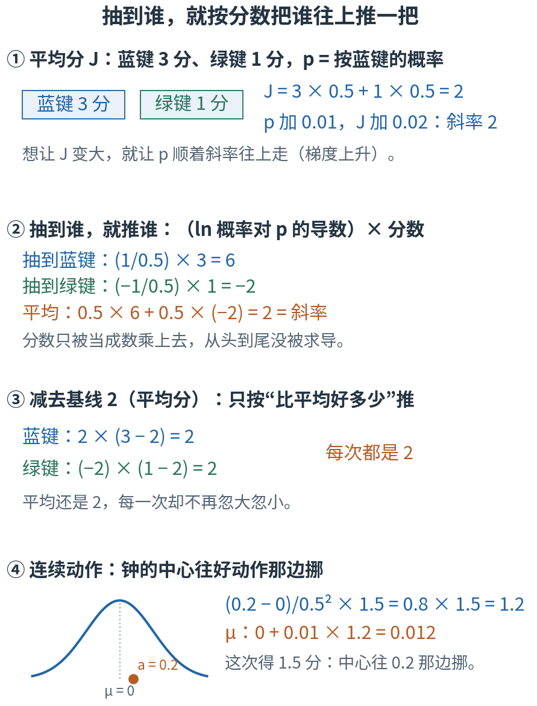
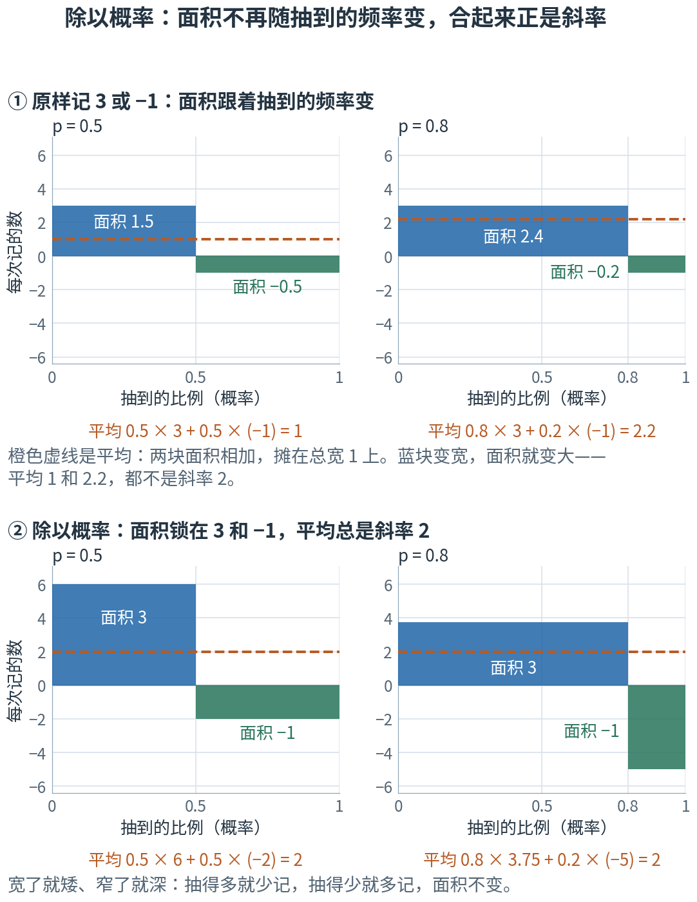
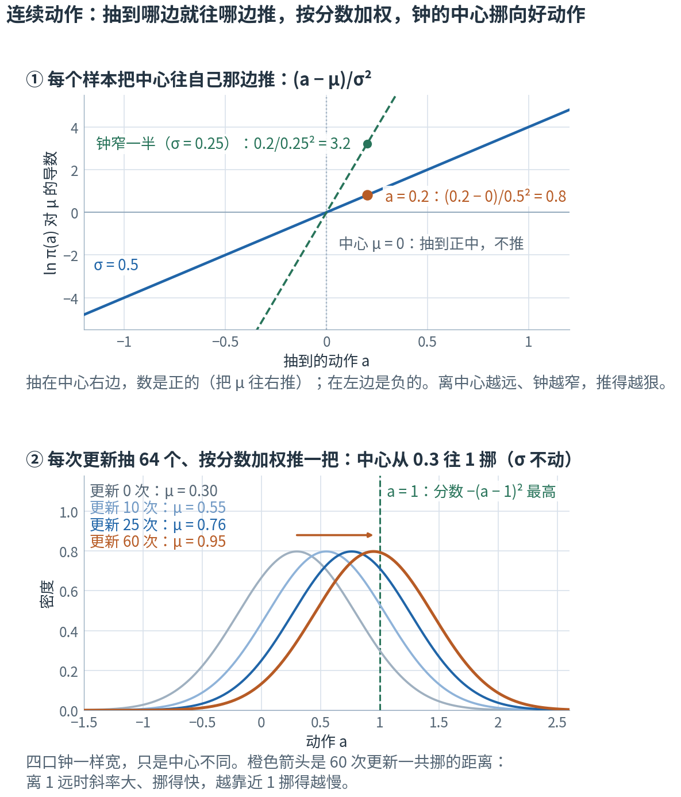
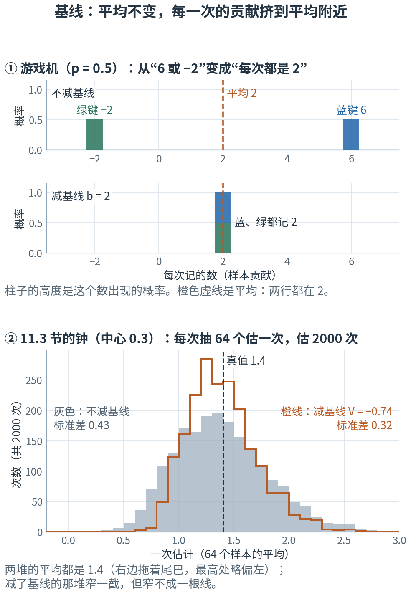
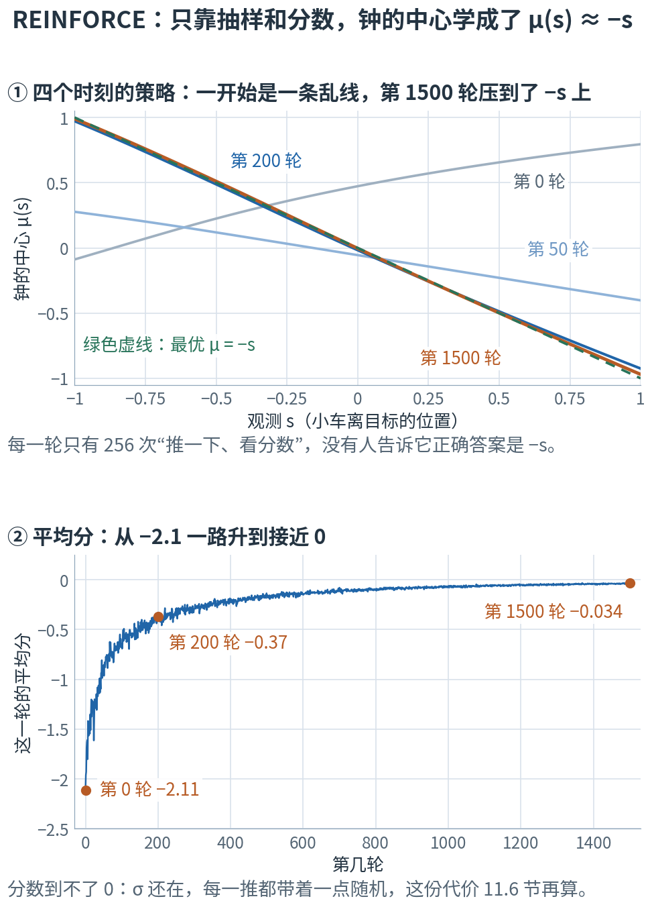
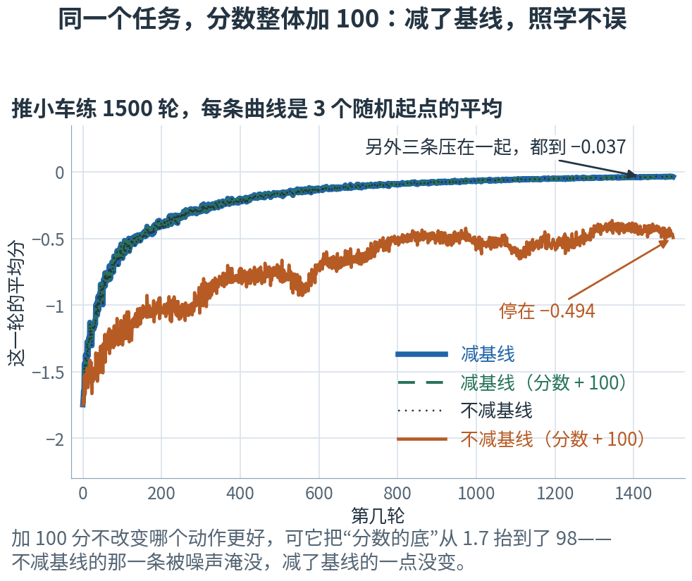
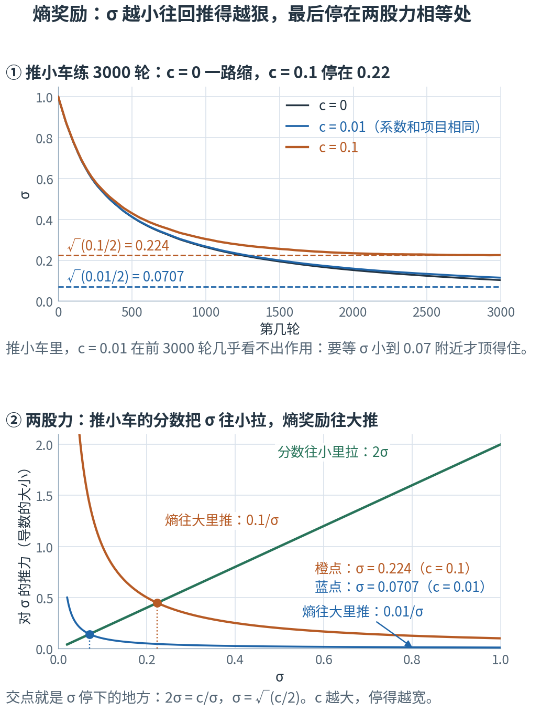
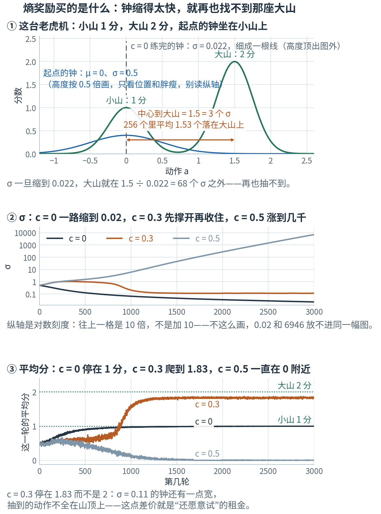

# 第 11 章 · 策略梯度：不对奖励求导，照样知道往哪边拧

> **上一章我们有了什么**：价值 V（从一个处境出发、照策略走，回报的平均）、TD 误差 δ、优势 A = Q − V（这个动作比平均好多少），以及用一张网络估价值的 critic（第 10 章）。
>
> **这一章要补什么**：该拧策略网络（actor）的旋钮了。目标还是第 9 章 9.9 节那句话——让平均回报 J 最大；办法还是第 3 章那一套——求出 J 对旋钮的梯度，朝它走一小步。
> 可是有两道坎：分数是仿真器给的，写不出一条能求导的公式；动作又是从钟里随机抽的（第 4 章 4.7 节）。
> 这一章用一台只有两个键的游戏机，手算出绕开这两道坎的办法：**抽到哪个动作，就把它的概率往上推一把，推多少看它得了几分**——很多次平均下来，恰好就是 J 的梯度。
> 这个小技巧是整个策略梯度的心脏；第 13 章（PPO）的公式，就是在它外面加了一层保险。
>
> **本章新词**：策略梯度、梯度上升、对数导数技巧、基线、REINFORCE、熵奖励。
> **需要的前提**：第 1 章的"缩 h"（1.4 节）和链式法则（1.7 节）；第 3 章的梯度下降（3.4 节）；第 4 章的期望（4.3 节）、标准差（4.4 节）、"多抽几次取平均"（4.5 节）、策略那口钟（4.7 节）、log 概率（4.8 节）和熵（4.9 节）；第 9 章的策略、回报和目标 J（9.4、9.7、9.9 节）；第 10 章的优势（10.4 节）。
> **不要求**记得第 4 章 4.8 节折叠块里的推导——本章用到的那一条（ln x 的导数是 1/x），会当场用数字再核对一次。标"进阶"的折叠块可以第二遍再读。

---

## 11.0 先看地图：抽到谁，就按分数把谁往上推一把

**想让平均回报变大，就得知道旋钮往哪边拧——可分数没法求导，动作又是随机抽的。办法是：抽一个动作、看它得几分，就把这个动作的概率往上推一把；分数越高推得越狠，平时越少被抽到、每次推得越重。很多次平均下来，恰好就是平均回报的梯度。
再减去一个"平均分"当基线，只按"比平均好多少"推：方向不变，抖得更少。连续动作就是把钟的中心往好动作那边挪。最后给熵一点奖励，别让钟太早缩死。**

想想你练投篮。手腕、手肘、出手角度和进不进之间，是一整套物理——你写不出公式，更没法对它求导。可你照样会越投越准：每次出手都有一点点不一样；哪一投的角度稍高、球进了，下次就往那个手型靠一点；投丢了，就离它远一点。
会练的人还多做两件事。一是**跟平常比**：平时十投三中，这一投进了是好消息；要是平时十投九中，进一个只是平常，不值得大改。二是**别太早把手型定死**：每一投都一模一样，就再也试不出更好的投法了。

这一章把这三件事——按结果往好的手型靠、跟平常比、留一点变化——写成数学，交给 197,788 个旋钮去做。



**读图顺序：** 从 ① 到 ④ 竖着读。图里的数现在不用算，后面会一个一个手算出来：①② 在 11.1、11.2 节，③ 在 11.4 节，④ 在 11.3 节（前三格用的是同一台游戏机，所以画在一起）。
现在只看清它们怎么接上：先有"平均分往哪边涨"，再用"抽到谁推谁"把它估出来，再减去平均分让每次记的数不再忽大忽小，最后把同一招用到钟上。

| 概念 | 它在回答什么问题 | 投篮里对应什么 | 在哪一节 |
|---|---|---|---|
| 策略梯度、梯度上升 | 旋钮往哪边拧，平均回报涨得最快？怎样一步步往上走？ | 手型往哪边改，命中率涨得最快 | 11.1 |
| 对数导数技巧 | 分数没法求导，怎样只凭"玩的记录"估出这个梯度？ | 投进了就往刚才的手型靠，靠多少看这一投多漂亮 | 11.2 |
| 钟的中心怎么挪 | 动作是从钟里抽的连续数，往哪边推？ | 这一投偏高一点却投得特别好，平常的出手角度就往高里挪 | 11.3 |
| 基线 | 分数全是正的，每一次的信号怎样不那么抖？ | 不看进没进，看比平常好还是差 | 11.4 |
| REINFORCE | 整套做法怎样循环起来？真训练里基线值多少？ | 投一组、复盘、改一点，再投一组 | 11.5 |
| 熵奖励 | 怎样不让策略太早定型？定早了会怎样？ | 别太早把手型定死 | 11.6 |

表里的名字先不背，英文和符号到了各节再给。

这一章一共用四台玩具，都不是项目本身，各管一件事——读到哪一台，先对一眼这张单子：

| 玩具 | 在哪几节 | 它干什么用的 |
|---|---|---|
| 两个键的游戏机 | 11.1、11.2、11.4、11.5 | 动作只有两个，每一笔账都能手算到底 |
| 一口钟（中心 0.3，分数 −(a − 1)²） | 11.3、11.4 | 动作是连续的数，而且能对上精确答案 1.4 |
| 推小车 | 11.5、11.6 | 真跑一遍 REINFORCE：有网络、有训练曲线 |
| 两座山的老虎机 | 11.6 | 专门用来看"钟缩太快，就再也找不到更好的动作" |

最容易混的四处，先贴上标签：

- **梯度上升、梯度下降，和代码里的负号**：本章要让 J 变大，公式里走的是加号（11.1 节）；torch 的优化器只会往"变小"的方向走，所以代码把要变大的量取个负号当损失——旋钮拧的方向完全一样。11.5 节写代码的地方有 ⚠️。
- **分数和优势**：11.2、11.3 节乘在"推一把"后面的是分数本身；11.4 节起换成"比平均好多少"，也就是第 10 章 10.4 节的优势。项目里乘的一律是后者。
- **对谁求导**：11.2 节只有一个旋钮 p，写 d/dp；11.3 节只看钟的中心 μ，写 ∂/∂μ（第 3 章 3.2 节的偏导数）；真正训练时对全部旋钮 θ 求，写 ∇_θ。分母或下标里写的，就是"对谁"。
- **两种"散得多开"**：钟的 σ 管动作抽得多散；11.4 节还要量"用样本估出来的梯度有多抖"。两件事都用第 4 章 4.4 节的标准差来量，量的却不是同一个东西——σ 这个字母，本章只留给钟。

现在觉得这些区别有点抽象很正常，读到对应小节就清楚了。

第一次读，只要按顺序看正文、图和手算。标着"进阶"的折叠内容可以先跳过；代码是复核工具，不是阅读门槛。

## 11.1 策略梯度：想让平均分变大，就顺着梯度往上走

第 9 章 9.9 节把强化学习的目标说成一句话：找到让 J 最大的策略。先拿一个最小的例子，看看"让 J 变大"具体怎么做。

一台游戏机只有两个键（数是教学构造的）：按蓝键得 3 分，按绿键得 1 分，按一次这一局就结束——所以这里一次的分数就是回报。
策略只有一个旋钮 p：以概率 p 按蓝键，以 1 − p 按绿键。
先拿 p = 0.5 算一次：玩很多次，一半按蓝键得 3 分、一半按绿键得 1 分，平均分就是按概率加权（第 4 章 4.3 节）**3 × 0.5 + 1 × 0.5 = 1.5 + 0.5 = 2**。
换成任意的 p，同一笔账写下来（旋钮只有 p，所以记成 J(p)）：

$$J(p) = 3 × p + 1 × (1 - p) = 1 + 2p$$

代回 p = 0.5 核对：1 + 2 × 0.5 = 2，和刚才一样。斜率用第 1 章 1.4 节的"缩 h"量：J(0.51) = 2.02，J(0.49) = 1.98，(2.02 − 1.98) ÷ 0.02 = **2**。
J = 1 + 2p 是一条直线，斜率处处是 2：p 每加 0.01，平均分加 0.02。

斜率是正的，说明 p 往大拧，平均分就涨。第 3 章 3.4 节的梯度下降是朝斜率的反方向走一小步，好让损失变小；那一节顺带说过：想让一个数变大，就把减号换成加号，**顺着**斜率走。
学习率取 0.1：p ← 0.5 + 0.1 × 2 = 0.7，平均分变成 J(0.7) = 2.4。多按蓝键，分就高了——和直觉一样。实验第 1 节把这几个数核对了一遍。

真正的策略由网络的全部旋钮 θ 决定（第 9 章 9.4 节的 π_θ），平均回报也就成了 θ 的函数 J(θ)。同样的一步写成：

$$\theta \leftarrow \theta + \alpha\,\nabla_\theta J$$

这叫**梯度上升**（gradient ascent）。式子里的 ∇_θ J——平均回报对策略旋钮的梯度——叫**策略梯度**（policy gradient）。游戏机里它只有一项，就是那个斜率 2。

| 符号 | 怎么读 | 就是 |
|---|---|---|
| $J(\theta)$ | "J 西塔" | 旋钮是 θ 时，策略的平均回报（第 9 章 9.9 节的 J，写成旋钮的函数） |
| $\nabla_\theta J$ | "J 对西塔的梯度" | 每个旋钮一个偏导数，排成一张清单（第 3 章 3.3 节）。下标 θ 说明对谁求导：对全部旋钮 |
| $\alpha$ | "阿尔法" | 学习率：乘在梯度前面的倍数（第 3 章 3.4 节）。游戏机里取 0.1 |

**难处在哪？** 上面这笔账算得出来，是因为你知道分数表（3 和 1），还能把两个键挨个算一遍。机器人两样都做不到：

- **分数写不出公式。** 分数是仿真器算的：关节怎么动、脚怎么着地、摔没摔倒（摔了回合就结束）。没有一条"动作 → 分数"的式子可以拿来求导。
- **动作列不完。** 每个动作是 14 个连续的数，一局要做上千个，不可能把所有可能挨个算一遍。

它能做的只有"玩"：按当前的策略抽动作、跑一跑、看得了几分。**光凭这些玩的记录，能不能估出 J 的梯度？** 下一节回答：能，而且连分数都不用求导。

<details>
<summary>进阶：从钟里抽样，真的不能求导吗？（现在可跳过）</summary>

能，只是项目没走这条路。第 4 章 4.7 节的折叠块说过：动作可以写成 a = μ + σε，随机性全装在标准钟抽出的 ε 里；按住 ε 不动，a 对 μ 的导数是 1，对 σ 的导数是 ε。这叫重参数化。

问题在下一环：要把梯度一路传回旋钮，还得知道"分数对动作的导数"。可分数来自物理仿真——脚着没着地、摔没摔倒，都是一下子跳变的事；项目也没有把仿真器搭成一条能反向传播的计算图。
所以项目选的是**不穿过环境求导**的办法：动作抽出来就当数据，只对"策略给这个动作多少概率"求导（下一节）。

准确的说法是"项目选了不经过环境的估计办法"，不是"随机抽样一律不能求导"。torch 里两种抽法都有：`rsample()` 是重参数化版，抽出来的数带着梯度；项目用的 `sample()` 不带（📍 映射到项目里会看到它）。

</details>

> **停一下，自测**：从 p = 0.7 再走一步（学习率还是 0.1），p 到哪里？J 是多少？再走一步呢？
> <details><summary>答案</summary>
>
> 斜率处处是 2：p = 0.7 + 0.1 × 2 = 0.9，J = 1 + 2 × 0.9 = 2.8。再走一步是 0.9 + 0.2 = 1.1——比 1 还大，不是合法的概率了。
> 所以真正的网络从不直接拧概率，而是拧一个怎么拧都合法的东西（比如钟的中心，11.3 节），梯度再用链式法则传回旋钮。这个小例子直接拧 p，只是为了让整笔账看得见。
>
> </details>

## 11.2 对数导数技巧：抽到谁就推谁，推多少看分数

回到游戏机，p = 0.5。目标是：最后只靠"玩"的记录——每玩一次，按策略抽一个键，看得几分——就能估出斜率 2，中途不查分数表、不对分数求导。

分三步走。前两步先在"知道分数表"的情况下，把斜率拆成"一个键一笔"；第三步才把这两笔换成能从记录里凑出来的东西。

### 三步凑出斜率：抽到谁、推多少、为什么要除以概率

**第一步：抽到哪个键，就想让它更常见一点。** 抽到蓝键，"让蓝键更常见"就是把 p 往大拧：蓝键的概率就是 p，p 拧大一点，它就大同样多——它对 p 的导数是 **+1**。
抽到绿键，要把 p 往小拧：绿键的概率是 1 − p，p 拧大一点，它反而小同样多——导数是 **−1**。

**第二步：推多少，看分数。** 分数高的推得狠：把导数乘上分数。蓝键 (+1) × 3 = 3，绿键 (−1) × 1 = −1。
两笔各算一次、加起来：3 + (−1) = 2，正是 11.1 节的斜率。这不是巧合：J = 3p + 1 × (1 − p) 里，p 加 0.01，蓝键那一项多 3 × 0.01 = 0.03，绿键那一项少 1 × 0.01 = 0.01，合起来多 0.02。**斜率本来就是"每个键的导数 × 分数，各算一次，再相加"。**

**第三步：常抽到的，每次少记一点。** 前两步用了分数表：两个键挨个算一遍，再相加。现在换成"玩"——每次只看见一个键、一个分数，能拿到的只有很多次的平均。
要是每抽一次就原样记下 3 或 −1，抽很多次取平均：蓝键出现一半，绿键出现一半，平均是 0.5 × 3 + 0.5 × (−1) = 1——不是 2。
毛病在于：斜率要的是两笔各算一次，可抽样取平均时，每一笔又被"它出现得多频繁"乘了一遍。p = 0.8 时更明显：0.8 × 3 + 0.2 × (−1) = 2.2，也不是 2。补救是把每次记的数再**除以这个键的概率**，把"出现得多频繁"约掉。

p = 0.5 时，每抽一次记的数是：

- 抽到蓝键：(1/p) × 3 = (1/0.5) × 3 = **6**
- 抽到绿键：(−1/(1−p)) × 1 = (−1/0.5) × 1 = **−2**

两种各占一半，平均 0.5 × 6 + 0.5 × (−2) = 3 − 1 = **2**——正好是 11.1 节的斜率。每抽一次记下的这个数，下面叫它这一次的**样本贡献**。

换成 p = 0.8 再算一遍：蓝键每次记 (1/0.8) × 3 = 3.75，绿键每次记 (−1/0.2) × 1 = −5。平均 0.8 × 3.75 + 0.2 × (−5) = 3 − 1 = 2，还是 2。绿键难得抽到（只占两成），所以每次抽到都记一大笔。



**这样读图：** 横轴是"抽到的比例"，总宽 1，每个键占一段，宽度就是它的概率；纵轴是这个键每被抽到一次记的数。所以**面积 = 抽到的比例 × 每次记的数**，就是这个键在平均里占的那一份；两块面积相加（横轴下面的算负数）就是平均，也就是橙色虚线的高度。
① 上一行原样记 3 和 −1：p 从 0.5 变成 0.8，蓝块变宽，面积从 1.5 涨到 2.4；绿块变窄，面积从 −0.5 缩到 −0.2。平均从 1 变成 2.2——面积跟着"抽到得多频繁"变，可斜率一直是 2。
② 下一行除以概率：蓝块变宽的同时变矮（6 → 3.75），绿块变窄的同时变深（−2 → −5），面积锁在 3 和 −1，平均一直是 2。
**除以概率，就是让面积不随抽到的频率变。** 锁住的面积，正是第二步的"导数 × 分数"：(+1) × 3 和 (−1) × 1，各算一次，加起来就是斜率。

到这里，目标已经达到了：算这两个数（6 和 −2）只用到"抽到的是哪个键"和"这一次得了几分"，分数表没再翻过。

### 换个写法：除以概率，就是对 ln 求导

"导数再除以自己的概率"，有一个更顺手的写法。第 4 章 4.8 节的折叠块推过：ln x 的导数是 1/x。你可以在浏览器控制台里缩 h 核对一次：`(Math.log(0.501) - Math.log(0.5)) / 0.001` 得 1.998，靠近 1/0.5 = 2。
再套一次链式法则（第 1 章 1.7 节：外层 ln 给出"1 ÷ 概率"，里层给出概率对 p 的导数）：

$$\frac{d}{dp}\ln p = \frac{1}{p} × 1 = \frac1p, \qquad \frac{d}{dp}\ln(1-p) = \frac{1}{1-p} × (-1) = -\frac{1}{1-p}$$

——正是上面每次记的数里，乘在分数前面的那两个数（1/p 和 −1/(1 − p)，下面管它们叫乘数）。所以"对抽到的键的概率求导，再除以这个概率"，就是"对它的 ln 求导"。一般地写成 ∇ln π = ∇π / π，两边乘 π：∇π = π ∇ln π。

这条式子的用处在于：本来要算的是"每个动作的概率导数 × 分数，全部加起来"（上图下一行的两块面积之和）；把概率导数换成 π × ∇ln π 以后，多出来的那个 π 不用我们乘——按策略抽样，每个动作本来就按 π 的比例出现。于是只剩"抽、记、取平均"。
这一招叫**对数导数技巧**（log-derivative trick）。写成式子：

$$\nabla_\theta J = \mathbb{E}_{a\sim\pi_\theta}\big[\,\nabla_\theta \ln \pi_\theta(a) \cdot r(a)\,\big] \;\approx\; \frac1N\sum_{i=1}^{N} \nabla_\theta \ln\pi_\theta(a_i)\, r(a_i)$$

| 符号 | 怎么读 | 就是 |
|---|---|---|
| $\pi_\theta(a)$ | "派 西塔 a" | 策略选动作 a 的概率（第 9 章 9.4 节）。游戏机里：π(蓝) = p，π(绿) = 1 − p |
| $\ln\pi_\theta(a)$ | | 这个动作的 log 概率（第 4 章 4.8 节） |
| $\nabla_\theta \ln\pi_\theta(a)$ | | 往哪边拧旋钮，a 的 log 概率涨得最快——"让 a 更常见"的方向。游戏机里就是 1/p 或 −1/(1 − p) |
| $r(a)$ | | 做动作 a 拿到的分数（第 9 章 9.2 节的奖励）。它只被当成一个数乘上去，**不求导** |
| $\mathbb{E}_{a\sim\pi_\theta}[\cdots]$ | "a 按派西塔抽时的期望" | 第 4 章 4.3 节的期望；下标说明随机性从哪来：a 是按当前策略抽出来的 |
| $\frac1N\sum_{i=1}^N$ | | 抽 N 次，把 N 个样本贡献取平均——用平均来估期望（第 4 章 4.5 节） |

整件事的妙处在三处：**分数从头到尾没被求导**，3 和 1 只被当成数乘上去；**抽样也没被求导**，求导的是"策略给已经抽到的那个动作多少概率"；而 ln π 是策略网络自己的公式（钟 + 网络），torch 的 `backward()` 算得出来（第 5 章 5.4 节）。
实验第 2 节让 torch 算了 ln p、ln(1 − p) 对 p 的导数，正是 2 和 −2。

### 亲手玩十万次：它到底在说什么

不信可以在浏览器里"玩"十万次：

```js
const p = 0.5;
let sum = 0;
const n = 100000;
for (let i = 0; i < n; i++) {
  const blue = Math.random() < p;                   // 按策略抽一个键
  sum += blue ? (1 / p) * 3 : (-1 / (1 - p)) * 1;   // 抽到谁，就记谁那一笔
}
console.log(sum / n);                               // 每次跑都不一样，但总在 2 附近
```

实验第 2 节用固定的一组随机数抽了 10 万次，平均是 1.990。

**它在说什么：加权的模仿。** 每个样本都在说"让我更常见一点"，说话的音量是它的分数。分数都是正的时候，每个被抽到的键都会被往上推（抽到绿键时，记下的 −2 是在把 p 往小拧——也就是把绿键自己的概率 1 − p 往大推）；
方向之所以对，是因为蓝键喊得更响：它那块面积是 3，绿键那块只有 1，两下一抵，还是把 p 往大拧。
换句话说，**策略梯度 = 按分数加权，模仿自己做过的动作**：分高的多模仿，分低的少模仿，分数是负的就反着来。它只认分数——分数里没写进去的东西，它一概不知道。

<details>
<summary>进阶：一般的推导，四行（现在可跳过）</summary>

动作有很多个时，平均分写开是 $J = \sum_a \pi_\theta(a)\, r(a)$（第 4 章 4.3 节）。r(a) 是环境给的数，不含 θ，所以求梯度时只动 π：

$$\nabla_\theta J = \sum_a \nabla_\theta\pi_\theta(a)\; r(a)$$

用 $\nabla\pi = \pi\,\nabla\ln\pi$ 换掉 $\nabla\pi$：

$$\nabla_\theta J = \sum_a \pi_\theta(a)\,\big[\nabla_\theta\ln\pi_\theta(a)\; r(a)\big] = \mathbb{E}_{a\sim\pi_\theta}\big[\nabla_\theta\ln\pi_\theta(a)\; r(a)\big]$$

最后一步是期望的定义倒着用："Σ 概率 × 某东西"就是"某东西的期望"。游戏机里：0.5 × (2 × 3) + 0.5 × (−2 × 1) = 2，和正文一模一样。连续的动作把 Σ 换成"切成细条再加"（第 4 章 4.3 节），结论不变。

</details>

> **停一下，自测**：p = 0.2 时，抽到蓝键、绿键各记多少？按概率平均是多少？
> <details><summary>答案</summary>
>
> 蓝键 (1/0.2) × 3 = 15，绿键 (−1/0.8) × 1 = −1.25。平均 0.2 × 15 + 0.8 × (−1.25) = 3 − 1 = 2——还是斜率。蓝键难得抽到，每次记一大笔。
>
> </details>

## 11.3 连续动作：把钟的中心往好动作那边挪

机器人的动作不是两个键，而是从 14 口钟里抽出来的数（第 4 章 4.7 节）。先只看一口钟，数是教学构造的：中心 μ = 0，宽度 σ = 0.5。这一次抽到了 a = 0.2，得了 1.5 分。

这一节分四段走：先手算这一个样本往哪边推；再让很多样本一起推，看钟怎么挪；然后对一对答案；最后看它怎样落到网络上。

### 一个样本往哪边推：(a − μ)/σ²

11.2 节的办法原样搬过来：要的是"让这个 a 更常见"的方向，也就是 a 的 ln 概率对旋钮的导数（动作是连续的数，这里的"概率"其实是密度；第 4 章 4.8 节的 log 概率就是这样算的）。旋钮先只看钟的中心 μ（σ 按住不动）。钟的 ln 密度，第 4 章 4.8 节的折叠块写过：

$$\ln\pi(a) = -\frac{(a-\mu)^2}{2\sigma^2} - \ln\sigma - \frac12\ln(2\pi)$$

左边的 π(a) 是策略给 a 的密度；最后一项 2π 里的 π 却是圆周率 3.14159……（第 4 章 4.6 节的 ⚠️ 说过这个同名）。
后两项不含 μ，拧 μ 时不变；只有第一项跟着变。用"缩 h"手算它（σ² = 0.25，所以分母 2σ² = 0.5）：

| μ | 第一项 −(0.2 − μ)² ÷ 0.5 | 比 μ = 0 时多了 | ÷ μ 挪动的量 |
|---|---|---|---|
| 0 | −0.04 ÷ 0.5 = −0.08 | | |
| 0.01 | −0.0361 ÷ 0.5 = −0.0722 | 0.0078 | 0.0078 ÷ 0.01 = 0.78 |
| 0.001 | −0.039601 ÷ 0.5 = −0.079202 | 0.000798 | 0.000798 ÷ 0.001 = 0.798 |

步子越小越靠近 **0.8**。规则也能直接求：第一项是"(a − μ)² 乘上 −1/(2σ²)"，用链式法则（第 1 章 1.7 节），外层平方给出 2(a − μ)，里层 a − μ 对 μ 的导数是 −1，所以

$$\frac{\partial \ln\pi(a)}{\partial\mu} = -\frac{1}{2\sigma^2} × 2(a-\mu) × (-1) = \frac{a-\mu}{\sigma^2}$$

代进去：(0.2 − 0) ÷ 0.5² = 0.2 ÷ 0.25 = 0.8，和缩 h 对上（实验第 3 节还让 torch 的自动求导算了一次，也是 0.8）。

| 符号 | 怎么读 | 就是 |
|---|---|---|
| $\dfrac{\partial\ln\pi(a)}{\partial\mu}$ | "ln 派 a 对缪的偏导" | 只拧钟的中心、别的按住，a 的 ln 密度变多快（第 3 章 3.2 节的偏导数） |
| $a-\mu$ | | 抽到的动作在中心的哪一边、离多远。正数：在右边 |
| $\sigma^2$ | "西格玛方" | 钟的宽度的平方。钟越窄，同样的 a − μ 推得越狠 |

这条式子读起来很直白：**抽在中心右边，就把中心往右推；在左边，往左推；离得越远、钟越窄，推得越狠。** 抽在正中，一点不推。

再乘上分数，就是这一个样本的贡献：0.8 × 1.5 = **1.2**。梯度上升走一步，学习率取 0.01：μ ← 0 + 0.01 × 1.2 = **0.012**——中心朝抽到的 0.2 挪了一点。
如果这次得的是 −1.5 分，就是 μ ← −0.012，离 0.2 远了一点。第 9 章 9.4 节说"试到了好的，训练就把钟的中心往那边挪"，挪法就是这一行。

到这里，一个样本的账算完了：**(a − μ)/σ² × 分数**，推的是钟的中心。下面让很多样本一起推。

### 很多个样本一起推：钟一次次挪向分数最高处

换一个能对答案的例子（数也是教学构造的）：钟的中心 0.3、宽 0.5，分数 −(a − 1)²——a = 1 时最高（0 分），离 1 越远扣得越多。
每次更新从钟里抽 64 个，每个按上面的办法算样本贡献 (a − μ)/σ² × 分数，取平均，再按学习率 0.02 挪一次中心；σ 一直按住不动。



**这样读图：** ① 横轴是抽到的动作 a，纵轴是它推中心的方向和力度 (a − μ)/σ²。σ = 0.5 时是一条过中心、斜率 4 的直线（1 ÷ 0.25 = 4），橙点就是上面手算的 0.8；
绿色虚线是钟窄一半（σ = 0.25）时的样子，同一个 0.2 推到 3.2，是原来的 4 倍。
② 就是上面那个例子。四口钟一样宽，更新 0、10、25、60 次时，中心在 0.30、0.55、0.76、0.95；橙色箭头是 60 次更新一共挪的距离。离 1 远的时候挪得快，越近越慢——下一段会算出，这时平均分的斜率是 2 × (1 − μ)，离 1 越近越小。

### 对答案：斜率真的是 1.4 吗

这个例子的平均分 J（旋钮是 μ）能直接算出来。分数是 −(a − 1)²，要的是 (a − 1)² 的平均。第 4 章 4.4 节有一条"方差的另一种算法"：平方的平均 − 平均的平方 = 方差；倒过来用，就是**平方的平均 = 平均的平方 + 方差**。
套到 a − 1 上：它的平均是 μ − 1；它的方差和 a 一样是 σ²（整体挪 1，散得多开不变）。所以 J = −((μ − 1)² + σ²)。
中心 0.3、宽 0.5 时，J = −(0.7² + 0.5²) = −(0.49 + 0.25) = −0.74；中心挪到 0.31，J = −(0.4761 + 0.25) = −0.7261。缩 h：(−0.7261 + 0.74) ÷ 0.01 = 1.39；
缩到底，就是 −(μ − 1)² 的导数 −2(μ − 1)（链式法则；σ² 不含 μ，导数是 0）：−2 × (0.3 − 1) = **1.4**。
对数导数技巧估出来的呢？实验第 3 节抽了三回：

```
抽几个样本  样本贡献的平均
----------  --------------
       100           1.815
    10,000           1.405
 1,000,000           1.398
```

100 个只能说"在 1.4 附近"，100 万个就贴上了。样本越多越准，正是第 4 章 4.5 节的大数定律；用有限的样本估，总带着一点运气，不能把"某一次对上了"当成证明。实验还用不抽样的办法把这个平均精确地算了一遍：正好是 1.4。

### 落到网络上

钟的中心不是一个自由的数，而是策略网络看了观测之后给出的：μ = μ_θ(s)。(a − μ)/σ² × 分数算出的只是"中心该往哪挪"；再往回乘"中心对每个旋钮的导数"，梯度就传到了全部旋钮——这正是第 7 章 7.2 节的反向传播。
真正训练时，还要把成千上万个样本的贡献平均起来，第 13 章（PPO）再在外面加一层保险。所以不是"每个关节的中心加 0.012"这么简单；但每一个样本出的主意，就是这一行。

> **停一下，自测**：分数改成"台阶"：a 超过 0.5 得 1 分，否则 0 分（像"摔没摔倒"这种非此即彼的分数）。这种分数对 a 的导数几乎处处是 0。还是中心 0、宽 0.5 的钟：抽到 a = 0.7，这个样本对 μ 的贡献是多少？抽到 a = 0.3 呢？策略梯度会不会因为"分数的导数是 0"而是 0？
> <details><summary>答案</summary>
>
> a = 0.7：(0.7 − 0)/0.25 × 1 = 2.8，把中心往右推。a = 0.3：(0.3 − 0)/0.25 = 1.2，乘上分数 0，贡献是 0。
> 策略梯度不会是 0：只要有样本跨过 0.5、拿到 1 分，中心就被往右推（实验第 3 节平均出来是 0.48）。对数导数技巧从来不需要分数的导数，只需要分数本身——这正是它能用在"摔倒就结束"这种分数上的原因。
>
> </details>

## 11.4 基线：只看比平均好多少，方向不变、抖得更少

回到游戏机，p = 0.5。11.2 节的样本贡献不是 6 就是 −2：平均是 2，可每一次都离 2 差 4。单看一次，它说的方向可能完全反了——抽到绿键时，它说"把 p 往小拧"。要靠很多次平均，才看得出真正的方向。

为什么这么抖？因为分数全是正的。抽到哪个键，那个键都被往上推；方向之所以对，只是因为蓝键推得更狠。就像投篮时"进了就高兴"：真正该看的，是比平常好还是差。

### 减去一个"平常分"：两种样本贡献都变成 2

那就给每个分数都**减去同一个数**，只看"比它好多少"。取 2（p = 0.5 时的平均分）：

- 抽到蓝键：(1/0.5) × (3 − 2) = 2 × 1 = **2**
- 抽到绿键：(−1/0.5) × (1 − 2) = (−2) × (−1) = **2**

（蓝键那一行有三个 2，各管各的：1/0.5 = 2 是乘数，3 − 2 里的 2 是基线，等号右边的 2 是这次记下的数。p = 0.5 时它们碰巧都是 2。）

不管抽到哪个，都记 2。平均还是 2，抖动没了：蓝键比平均好 1 分，就把它推高；绿键比平均差 1 分，就把它推低——而"把绿键推低"和"把蓝键推高"说的是同一件事（p 往大拧）。

减去的这个数叫**基线**（baseline），记作 b。

> ⚠️ **本章的 b 是基线，不是网络里的偏置 b**（第 2 章 2.6 节），也不是第 3 章 3.5 节直线的截距 b。三个都叫 b，互不相干。

**为什么平均不变？** 减去 b，每个样本贡献就少了"b × 那个乘数"（乘数就是 ln 概率对 p 的导数：蓝键 2，绿键 −2）。而乘数自己的平均是 0：0.5 × 2 + 0.5 × (−2) = 0。p = 0.8 也一样：0.8 × 1.25 + 0.2 × (−5) = 1 − 1 = 0。
第 4 章 4.3 节的线性让我们能把 b 提出来：

平均的"乘数 × (分数 − b)" = 平均的"乘数 × 分数" − b × 平均的"乘数" = 2 − b × 0 = 2

b 取多少都一样。大白话：两个键的概率加起来永远是 1，一个涨了另一个就得跌同样多；给所有分数一起减同一个数，谁比谁好没变。第 4 章 4.3 节预告过的"减去同一个基准，不影响学习的方向"，就是这件事。

**那抖动呢？** 平均不变，抖动却完全由 b 决定，而且在这台游戏机上能写成一行。p = 0.5 时两种样本贡献是 2 × (3 − b) = 6 − 2b 和 (−2) × (1 − b) = 2b − 2；平均永远是 2，所以各自离平均：

$$(6 - 2b) - 2 = 4 - 2b, \qquad (2b - 2) - 2 = -(4 - 2b)$$

一正一负、大小一样，都是 **2 × |2 − b|**——式子里那个 2，就是这台游戏机的平均分（0.5 × 3 + 0.5 × 1 = 2）。挨个代进去：

| 基线 b | 蓝键记 | 绿键记 | 平均 | 离平均多远 = 2 × \|2 − b\| |
|---|---|---|---|---|
| 0（不减） | 6 | −2 | 2 | 4 |
| 1 | 4 | 0 | 2 | 2 |
| 2（平均分） | 2 | 2 | 2 | 0 |
| 3 | 0 | 4 | 2 | 2 |
| 100 | −194 | 198 | 2 | 196 |

规律很直白：**基线离平均分差多远，每一次记的数就离平均多远（这里正好是 2 倍）。** b = 2 时差 0，一点不抖；不减基线等于取 b = 0，离平均分差 2，就抖 4；b = 100 差 98，抖到 196。
这条规律 11.5 节还会用一次——那里会把同一件事放到真的训练里看。

<details>
<summary>进阶：一般的证明一行，外加一个条件（现在可跳过）</summary>

乘数的平均为 0，对任何策略都成立：

$$\mathbb{E}_{a\sim\pi}\big[\nabla\ln\pi(a)\big] = \sum_a \pi(a)\,\frac{\nabla\pi(a)}{\pi(a)} = \nabla\sum_a\pi(a) = \nabla 1 = 0$$

概率加起来永远是 1，1 的导数是 0。所以 $\mathbb{E}[\nabla\ln\pi(a)\,(r(a) - b)] = \mathbb{E}[\nabla\ln\pi(a)\,r(a)] - b × 0$——只要 b 是个固定的数。

**b 不能跟着这一次抽到的动作变。** 上面把 b 提到期望外面，靠的就是"它不随 a 变"。拿这一批样本自己的平均分当 b（11.5 节的实验就这么做），严格说里面含着这个样本自己的分数：批平均 = 自己的分数 ÷ N + 其余 N − 1 个的分数之和 ÷ N。
其余那部分和这个 a 无关，照样平均贡献 0；自己那 1/N 却跟着 a 变，等于从"乘数 × 分数"里减掉了 1/N 份。所以在按一次就结束、每次抽样互相独立的例子里，平均会缩成原来的 (N − 1)/N 倍：N = 64 时是 63/64 = 0.984。
实验第 4 节做了 2 万次，平均是 1.3745，靠近 1.4 × 63/64 = 1.3781，而不是 1.4。一批的样本一多，这点差别就小到可以不管，所以代码里常这样图省事。

</details>

### 基线选什么：平常能拿多少，也就是 V

**基线选什么？** 自然的选择是"平常能拿多少"——第 10 章 10.1 节的价值 V。游戏机里 V = 0.5 × 3 + 0.5 × 1 = 2，正是上面的 b。
减去它，剩下的 r − V 就是第 10 章 10.4 节的优势（按一次就结束，所以"按这个键"的动作价值 Q 就是它的分数 r）：蓝键 +1，绿键 −1，按策略加权平均 0.5 × 1 + 0.5 × (−1) = 0。**优势为正的动作，概率被推高；为负的，被推低**——第 10 章留给这一章的，就是这句话。

真实的训练里，一局有很多步（第 9 章 9.2 节的"一步"：看一眼、做一个动作、拿一个分），每一步有自己的处境 s。

> ⚠️ **"一步"从这里起换了意思。** 11.1–11.3 节说"走一步"，指的是按梯度拧一次旋钮；从这里起，"一步"是环境的一步：看一眼、做一个动作、拿一个分（第 7 章 7.6 节也这样分过）。
> 拧旋钮这件事，下面说"更新"或"拧一次旋钮"，不再叫"一步"。11.5 节的推小车里，"跑一批、更新一次"叫一轮；项目里同样的一圈叫一次迭代。

每一步的权重，换成这一步的优势估计：

$$\nabla_\theta J \;\approx\; \frac{1}{N}\sum_{i=1}^{N} \nabla_\theta \ln\pi_\theta(a_i\mid s_i)\;\hat A_i$$

| 符号 | 怎么读 | 就是 |
|---|---|---|
| $\pi_\theta(a_i \mid s_i)$ | "派 西塔 a_i 给定 s_i" | 看到 $s_i$ 时选 $a_i$ 的概率（第 9 章 9.4 节）。$s_i$ 是网络的输入：策略看 61 个数（第 9 章 9.3 节） |
| $\hat A_i$ | "A 帽 i" | 第 i 个样本的优势估计。戴帽子表示"估出来的"：手里只有这一次的记录（第 10 章 10.4 节：一次 δ 只是优势的一次抽样） |
| $N$ | | 样本个数。项目里一批是 4096 只机器人 × 24 步 = 98,304 条 |

读作：对每个样本，"让这个动作更常见"的方向 × "它比平均好多少"，取平均。Â 最简单的算法是"从这一步起的回报 − 这一处境的价值"（G − V）；项目用的是从一串 δ 算出来的升级版，第 12 章（GAE）讲。
分工也清楚了：actor 出动作、被推着改；critic 估 V、给基线（第 10 章 10.5 节）。

### 抖动少了多少：0.427 → 0.317，样本省 1.8 倍

**抖动少了多少？** 游戏机里是从"离平均差 4"降到 0——这是特意挑的简单例子。回到 11.3 节那口钟（中心 0.3，分数 −(a − 1)²），基线取它的平均分 V = −0.74。
每次抽 64 个样本估一次斜率，估 2000 次，看这 2000 个估计散得多开：

```
每次 64 个样本，估 2000 次  估计的平均  估计的标准差  理论：单个的标准差 / √64
--------------------------  ----------  ------------  ------------------------
                  不减基线       1.389         0.427         3.402 / 8 = 0.425
          减基线 V = −0.74       1.395         0.317         2.534 / 8 = 0.317
```

两种估计的平均都在 1.4 附近；标准差从 0.427 降到 0.317，和理论值对上。理论那一列是第 4 章 4.5 节的规律"平均值的标准差 = 单个样本的标准差 ÷ √样本数"：单个样本贡献的标准差（实验算出是 3.402 和 2.534）除以 √64 = 8。

这笔账还能换个说法：不减基线想和减了一样准，样本要多 (3.402 ÷ 2.534)² ≈ 1.8 倍——这就是第 4 章 4.5 节说的"方差大，就要更多样本"：标准差是几倍，样本就要多它的平方倍。项目每次迭代要采近十万条记录（第 7 章 7.6 节），这个倍数省下的不是小数目。



**这样读图：** ① 柱子的高度是这个数出现的概率。上一行不减基线：−2 和 6 各一半；下一行减了基线：蓝、绿都记 2，叠成一根柱。橙色虚线是平均，两行都在 2。
② 和第 4 章 4.5 节那张"重做 2000 遍"的直方图是同一种画法：横轴是一次估计（64 个样本的平均），纵轴是 2000 次里落在这一格的次数。灰色是不减基线，橙线是减了基线。两堆的平均都是 1.4（堆有点歪，右边拖着尾巴，所以最高的柱子略偏左）；
橙色那堆窄一截，但窄不成一根线——一般情况下，基线只能减小抖动，不能消灭它。

基线也可能选坏：选得离谱，反而更抖（下面的自测就是一例）；V 也不是在所有情况下最省样本的那一个。它的好处是意思清楚，而且 critic 本来就在估它。

> **停一下，自测**：游戏机取 p = 0.8（注意：上面那张表和 2 × |2 − b| 都只对 p = 0.5 成立，这里要重新算）。① 基线还用 2：抽到蓝键、绿键各记多少？平均是多少？② 基线换成 100 呢？
> <details><summary>答案</summary>
>
> ① 蓝键 (1/0.8) × (3 − 2) = 1.25，绿键 (−1/0.2) × (1 − 2) = 5；平均 0.8 × 1.25 + 0.2 × 5 = 1 + 1 = 2。平均没变，但两种不再一样大——"每次都一样"只是 p = 0.5 的巧合。
> ② 蓝键 1.25 × (3 − 100) = −121.25，绿键 (−5) × (1 − 100) = 495；平均 0.8 × (−121.25) + 0.2 × 495 = −97 + 99 = 2。平均照样是 2，可每一次都在 −121.25 和 495 之间乱跳：坏的基线让抖动大得多。
>
> </details>

## 11.5 REINFORCE：抽一批、算权重、拧一次旋钮，反复做

把前面几节串起来，就是一个完整的训练循环。每一轮：

1. 用当前的策略跑一批，记下每一步的观测 s、抽到的动作 a、拿到的分数。
2. 给每一步算一个权重：从这一步起的回报 $G_t$（第 9 章 9.7 节）减去基线。
3. 损失 = −（权重 × ln π(a∣s)）的平均。
4. 反向传播、拧一次旋钮（第 7 章 7.7 节），回到第 1 条。

这就是最早、也最朴素的策略梯度算法，叫 **REINFORCE**（英文"强化"，1992 年提出）。

第 2 条为什么用"从这一步起"的回报，而不是整局的总分？这一步的动作，改变不了它之前已经拿到的分。那些分对它来说，就像 11.4 节的基线一样，是一个和这次动作无关的数——平均起来贡献 0，却白白添乱。所以只算它之后的。

<details>
<summary>进阶：一局有很多步，推导为什么还成立（现在可跳过）</summary>

一局的记录是 s₀、a₀、s₁、a₁……（第 9 章 9.5 节的轨迹）。这整条记录出现的概率，是一串概率相乘：开局落在 s₀ 的概率 × π(a₀∣s₀) × 环境把它送到 s₁ 的概率 × π(a₁∣s₁) × ……
取 ln，乘法变加法（第 4 章 4.8 节）：

$$\ln P(\text{这一局}) = \ln(\text{开局的概率}) + \sum_t \ln\pi_\theta(a_t\mid s_t) + \sum_t \ln(\text{环境那一步的概率})$$

对 θ 求梯度，开局和环境那两类项不含 θ，导数是 0；剩下的只有每一步的 $\nabla_\theta\ln\pi_\theta(a_t\mid s_t)$。把"一局"当成 11.2 节的"一个动作"，同样的推导给出

$$\nabla_\theta J = \mathbb{E}\Big[\,G_0 \sum_t \nabla_\theta\ln\pi_\theta(a_t\mid s_t)\Big]$$

环境的概率（比如第 9 章走廊里 20% 的打滑）在求导时整个消失了：**不需要知道环境怎么运作**，只要记下发生了什么。再用正文的理由把 $G_0$ 换成从每一步起的 $G_t$、减去基线，就是正文的循环。

</details>

### 推小车：一辆小车、一张小网络、1500 轮

先在一个玩具上跑。"推小车"：小车在一条直线上，观测 s 是它离目标的位置（−1 到 1 之间随机）；动作 a 是把它推多远，推完它停在 s + a；分数 −(s + a)²，离目标越远扣得越多。
最好的做法是 a = −s，一把推回目标。推一次这一局就结束，所以回报就是这一次的分数。

策略：钟的中心 μ_θ(s) 由一张 1 → 16 → 1 的小网络给出（第 6 章的网络，只是小得多）；宽度 σ 是一个单独的、可学的数，从 1 开始。每一轮 256 辆小车各推一次，然后更新一次。核心几行（摘自实验第 5 节的 `reinforce()`）：

```python
dist = torch.distributions.Normal(mu, std)     # 256 口钟：中心是网络给的 μ_θ(s)，宽度 σ（第 4 章 4.7 节）
a = dist.sample()                              # 每口钟抽一个动作：探索（第 9 章 9.4 节）
r = -((s + a) ** 2).squeeze(1)                 # 推完停在 s + a，离目标越远扣得越多
logp = dist.log_prob(a).squeeze(1)             # ln π(a|s)：抽到的动作在自己那口钟下的 ln 密度（第 4 章 4.8 节）
adv = r - r.mean()                             # 减基线：这里用这一批的平均分（11.4 节）
loss = -(adv.detach() * logp).mean()           # 权重 × ln π，取平均，再取负号（下面的 ⚠️）
...                                            # （这里还有一行 11.6 节的熵奖励，本节它的系数是 0）
opt.zero_grad(); loss.backward(); opt.step()   # 清零、反向传播、拧旋钮（第 7 章 7.7 节；opt 是 7.5 节的 Adam）
```

（实验里的 `reinforce()` 在这几行之间还夹了两行开关——"分数要不要整体加一个常数""要不要减基线"，本节两个开关都关着；下面最后一小节的对照实验会把它们打开。）

新东西有四样，一次看一个：

- `torch.distributions.Normal(mu, std)`：搭钟。mu 有 256 行，所以一次搭 256 口钟，一辆车一口。

  > ⚠️ **括号里第二个数，数学和代码不是一个东西。** 数学记号 $\mathcal{N}(0, 4)$ 里第二个数是**方差** σ²，所以标准差是 2（第 4 章 4.6 节的 ⚠️）；
  > 可 torch 的 `Normal(mu, std)` 收的是**标准差** σ 本身，`Normal(0, 4)` 的标准差就是 4。同一个位置、两套规矩：读公式按前一套，写代码按后一套。
- `dist.sample()`：从每口钟里抽一个数。抽出来的数**不带梯度**：它只是数据（11.1 节的折叠块）。
- `dist.log_prob(a)`：算"a 在这口钟下的 ln 密度"。梯度从这里流向 μ（再经网络流向旋钮）和 σ：11.3 节的 (a − μ)/σ²，就是 torch 在这里替你算的。
- `adv.detach()`：第 7 章 7.6 节的折叠块讲过的"摘下来"——数值留着，反向传播不从它往回走。这里的 adv 本来就不带梯度（它由抽出来的 a 算出），`.detach()` 是个保险：
  基线换成 critic 估的 V 以后，adv 里就带着 critic 的旋钮了，不摘下来，actor 的损失会去改 critic。

> ⚠️ **损失前面的负号。** 我们要的是梯度**上升**：让"权重 × ln π"的平均变大。可 `opt.step()` 只会往损失**变小**的方向走（第 3 章的梯度下降）。
> 办法是把要变大的量取个负号当损失：让 −X 变小，就是让 X 变大，两者的梯度只差一个负号，每次更新拧的方向完全一样。漏掉这个负号，训练照样跑、不报任何错，只是方向全反。
> 还有一点：这个"损失"只是借 `backward()` 求梯度搭的架子，它的数值不是"错了多少"，别像第 5 章的损失那样盯着它变小。

跑 1500 轮（实验第 5 节）：

```
第几轮  平均分     σ  μ(s = −0.8)  μ(s = 0)  μ(s = 0.6)
------  ------  ----  -----------  --------  ----------
     0  −2.111  1.00         0.04      0.47        0.69
    50  −0.856  0.88         0.22     −0.06       −0.26
   200  −0.368  0.63         0.78     −0.02       −0.58
   500  −0.161  0.41         0.79     −0.05       −0.64
  1500  −0.034  0.19         0.81      0.00       −0.59
```

最好的答案是 μ(s) = −s：μ(−0.8) 该是 0.8，μ(0) 该是 0，μ(0.6) 该是 −0.6。第 0 轮的网络是随手初始化的，三个数都不对；到第 200 轮已经八九不离十，第 1500 轮是 0.81、0.00、−0.59。
平均分从 −2.111 升到 −0.034。σ 从 1 一路缩到 0.19：策略越来越有把握。



**这样读图：** ① 横轴是观测 s，纵轴是网络给的钟的中心 μ(s)，绿色虚线是正确答案 −s。第 0 轮的线斜着往上，方向都反了；第 50 轮转成往下斜，但还太平；第 200 轮和第 1500 轮压在虚线上。
整个过程没有人告诉它 −s——它只有每轮 256 次"推一下、看分数"。
② 每一轮 256 辆车的平均分。前 200 轮涨得飞快，之后越来越慢，最后停在比 0 低一点的地方。为什么到不了 0，下一节算。

> **停一下，自测**：有人把 `loss = -(adv.detach() * logp).mean()` 写成了 `loss = (adv.detach() * logp).mean()`。程序会报错吗？训练出来的策略会是什么样？
> <details><summary>答案</summary>
>
> 不会报错，数值也都正常。可这样每次更新都成了梯度**下降**：比平均好的动作被推低，比平均差的被推高。策略会学着把小车往远处推，平均分越训越低。
> 所以看训练，要看平均分是不是在涨，不能只看"程序跑得通"。
>
> </details>

### 把基线拿掉试试：给每一局都加 100 分

11.4 节量出的 0.427 → 0.317，是在一个不训练的例子上量的：钟钉死在中心 0.3，估 2000 次，看散得多开。真训练起来，这点差别值多少？
把上面这段代码里的 `adv = r - r.mean()` 换成 `adv = r`，别的一个字不改，再跑 1500 轮——**几乎看不出区别**。

这不是基线没用，而是推小车的分数恰好帮了忙。11.4 节的规律说：抖动由"基线离平均分多远"定。不减基线等于取 b = 0；而推小车第 0 轮的平均分只有 −1.748，b = 0 离它才 1.748——这个"底"本来就浅。
（下面的数都取三个随机起点的平均，所以第 0 轮写的是 −1.748；上面那张表只跑了一个起点，写的是 −2.111。同一件事，两种口径。）

那就把这个"底"抬高：给每一局的分数都加 100，也就是分数改成 −(s + a)² + 100。哪个动作更好，一点没变（每个动作都加了同样的 100）；可平均分从 −1.748 变成 98.252，b = 0 离它远了 **98.252 ÷ 1.748 = 56.2 倍**。
四条曲线（每条是 3 个随机起点的平均，纵轴已经把加上去的 100 减回来，好和前面比）：

```
      3 个随机起点平均  第 200 轮的平均分  第 500 轮的平均分  第 1500 轮的平均分
----------------------  -----------------  -----------------  ------------------
                减基线             −0.404             −0.171              −0.037
              不减基线             −0.408             −0.173              −0.038
  减基线（分数 + 100）             −0.404             −0.171              −0.037
不减基线（分数 + 100）             −1.031             −0.738              −0.494
```

前三行几乎是同一条线；只有第四行掉了队，1500 轮之后还停在 −0.494，比另外三条差了十几倍。



**这样读图：** 蓝色粗线（减基线）、绿色虚线（减基线，分数 + 100）、黑色点线（不减基线）三条压成一条，1500 轮都到 −0.037 附近；橙线是"不减基线 + 加 100 分"，一路落在下面，还一直在抖。
绿虚线压在蓝线上，就是"**减了基线，加不加这 100 分毫无差别**"——这正是前面证过的"减去一个固定的数，方向不变"，只不过这次是在真的训练里看见的。
橙线掉队，是因为每一次记的数都被那 100 分的"底"乘大了几十倍：信号还是那个信号，噪声大了几十倍，一批 256 个样本平均不过来。曲线上那些忽上忽下的起伏，就是噪声留下的痕迹。

这其实就是 11.4 节自测 ② 那个坏基线 b = 100 的翻版：那里把基线抬到 100、分数留在原处，这里把分数抬起来、基线留在 0——"分数 − 基线"一样大。下面这道自测把这笔账算一遍。

> **停一下，自测**：回到 p = 0.5 的游戏机，把两个键的分数都加 100（蓝键 103、绿键 101），**不**减基线。抽到蓝键记多少？绿键呢？按概率平均是多少？每一次离平均多远？
> <details><summary>答案</summary>
>
> 蓝键 (1/0.5) × 103 = 206，绿键 (−1/0.5) × 101 = −202。平均 0.5 × 206 + 0.5 × (−202) = 103 − 101 = **2**——还是原来那个斜率，一点没偏。
> 可每一次都离平均 204（206 − 2 = 204，−202 − 2 = −204）：用 11.4 节的规律也对得上，这时的平均分是 0.5 × 103 + 0.5 × 101 = 102，基线 b = 0 离它 102，抖动就是 2 × 102 = 204。
> 原来只抖 4，现在抖 204——**估计值本身没错，只是要抽多得多的次数才平均得出来**。上面第四行的橙线，就是这件事在训练里的样子。
>
> </details>

> ⚠️ **"不减基线在推小车里也行"不能推广。** 那只是因为这个玩具的分数本来就在 0 附近上下，底很浅。
> 一个任务的分数底有多高，是任务自己的事，不由你挑：奖励里只要有一项"做对就给分"的正项，底就抬起来了（项目的奖励有十几项，第 16 章（奖励逐项拆解））。
> 所以标准做法是一律减基线，而不是去赌这一局的底浅不浅。

## 11.6 熵奖励：给"还愿意试"一点分，别让钟缩得太快

### σ 为什么会自己缩

上一节的表里，σ 从 1 一路缩到 0.19。它为什么会缩？两个原因。

一是在推小车里，随机本身就要扣分。平均分 = −(中心没对准的那部分)² − σ²（和 11.3 节算平均分是同一个办法：平方的平均 = 平均的平方 + 方差）。中心对准以后，还剩 −σ² 这一项：钟越宽，扣得越多。
第 1500 轮 σ = 0.19，σ² = 0.0361 ≈ 0.036，平均分 −0.034，差不多就是它。

二是更一般的：钟收窄，离中心近的动作会变得更常见（面积总是 1，窄了就高了）。抽到 a = 0.2 的密度，用第 4 章 4.6 节的公式（你可以拿 `Math.exp` 自己按）：
σ = 0.5 时是 exp(−0.08) ÷ (0.5 × 2.5066) = 0.737（2.5066 是 √(2π)）；σ = 0.4 时是 exp(−0.125) ÷ (0.4 × 2.5066) = 0.880。中心一旦对准了好动作，好动作多半就落在中心附近——为了让它们更常见，策略梯度会顺手把 σ 往小里推。

缩一点是好事：策略越来越有把握。缩到 0 就麻烦了：σ = 0 时钟变成一根针，每次抽到的都是中心，不再试任何别的动作——第 9 章 9.4 节的探索停了。
要是眼下的做法还不是最好的（比如机器人学会了一种能拿分、但别扭的走法），它就再也发现不了更好的。第 10 章 10.2 节把"越算越靠近某个数、到后来几乎不再变"叫收敛；策略还没找到好做法，就先定了型、不再变，叫**过早收敛**。

### 熵奖励：给"钟还宽着"一点分

办法是在要变大的那个量上，给熵加一点奖励。第 4 章 4.9 节算过：一口钟的熵只看宽度，H = ln(4.13σ)（4.13 是 4.1327 取的两位）；σ = 1 时是 ln 4.1327 = 1.4189，σ 减半就少 ln 2 = 0.6931（σ = 0.5 时是 1.4189 − 0.6931 = 0.7258）。
把要变大的量从 J 换成 J + c × H，c 是一个小小的系数（和第 3 章 3.7 节梯度裁剪的上限 c 无关）：钟越宽，这一项给的分越多。这叫**熵奖励**（entropy bonus）。代码里就是在损失后面再减一项——实验第 5 节的 `reinforce()` 里本来就留着这一行：

```python
loss = loss - c * dist.entropy().mean()        # 熵奖励：要变大的是 c × H，进损失时取负号（和 11.5 节的负号同一个道理）
```

它对 σ 的推力有多大？H = ln 4.13 + ln σ（ln 把乘法变加法，第 4 章 4.8 节），ln 4.13 是常数，ln σ 的导数是 1/σ，所以 c × H 对 σ 的导数是 **c/σ**。
c = 0.01 时：σ = 1，推力 0.01；σ = 0.1，推力 0.1。**σ 越小，往回推得越使劲。**

### 推小车里 σ 停在哪：两股力相等的地方

**在推小车里，σ 会停在哪？** 两股力拔河。分数那边：−σ² 对 σ 的导数是 −2σ，把 σ 往小里拉，力度 2σ；熵奖励那边往大里推，力度 c/σ。拉力和推力相等时，σ 就不动了：2σ = c/σ。两边乘 σ、再除以 2，得 σ² = c/2，也就是

$$\sigma = \sqrt{c/2}$$

c = 0.1 时 σ = √0.05 = 0.2236（核对：2 × 0.2236 = 0.4472，0.1 ÷ 0.2236 = 0.4472，两股力相等）；c = 0.01 时 σ = √0.005 = 0.0707。实验第 6 节把推小车在三种 c 下各练 3000 轮：

```
熵系数 c  第 1500 轮的 σ  第 3000 轮的 σ  停在 √(c/2)  最后 500 轮平均分     −σ²
--------  --------------  --------------  -----------  -----------------  ------
       0           0.193           0.103     一直往下             −0.013  −0.011
    0.01           0.199           0.114       0.0707             −0.015  −0.013
     0.1           0.255           0.225       0.2236             −0.051  −0.051
```



**这样读图：** ① 前 200 轮三条线几乎重合（σ 相差不到 0.01）：σ 大的时候 c/σ 很小，熵奖励插不上手。之后 c = 0.1 那条慢慢高出来，停在 0.224 的虚线上；c = 0 一直往下。
c = 0.01（系数和项目相同）在推小车里和 c = 0 几乎分不开：这里它要等 σ 小到 0.07 附近才顶得住（这个 0.07 为什么不能搬到项目里，见下面的 ⚠️）。
② 横轴是 σ，纵轴是对 σ 的推力。绿色直线是分数往小里拉的 2σ，橙、蓝两条曲线是熵往大里推的 c/σ。交点就是 σ 停下的地方：c 越大，交点越靠右，钟停得越宽。

表的最后两列是这份宽度的代价：c = 0.1 的钟停在 0.225 宽，平均分就停在 −0.051 左右（0.225² = 0.0506）。在推小车里这纯属浪费——答案早就找到了；
可在"眼下的做法还不是最好"的任务里，这份宽度就是继续试的本钱。熵奖励买的就是这个。

> ⚠️ **√(c/2) 只属于推小车。** 2σ 那股拉力，来自推小车的平均分恰好是"−(没对准)² − σ²"。
> 项目的奖励由很多项加起来（第 16 章（奖励逐项拆解）），σ 变一点、平均分跟着变多少，写不出这么简单的式子，而且训练中一直在变。
> 所以项目里的 σ 停在哪，不能拿 √(0.01/2) = 0.0707 去算；能搬过去的只有熵那一边：推力 c/σ，σ 越小推得越狠。

### 换一台机器：钟缩早了，那座大山就再也找不到

上面这三行里，熵奖励全是纯亏本：c = 0.1 多留的那点宽度，只把平均分从 −0.013 拖到 −0.051，什么也没换回来。
这不奇怪——推小车只有一个正确答案（a = −s），早早定型一点不吃亏。**要看见熵奖励到底买的是什么，得换一台"定早了就再也找不到更好答案"的机器。**

第四台玩具，一台老虎机：没有观测，动作就是一个数 a；分数是两座山——**小山在 a = 0，值 1 分；大山在 a = 1.5，值 2 分**；两座山中间是一段几乎不给分的低谷（分数的式子写在实验第 6 节）。
策略还是一口钟，起点 **μ = 0**（正好坐在小山顶上）、**σ = 0.5**。除了熵系数 c，三次训练的一切都一样。

先手算一下"大山有多难碰到"。中心在 0、σ = 0.5 时，a = 1.5 在 **3 个 σ** 之外；第 4 章 4.6 节说过，2 个 σ 以外一共只剩约 5%，3 个 σ 更少——实验数出来：一轮 256 个动作里，平均有 **1.53 个**落在大山那一带（1.25 到 1.75 之间）。不多，但够把中心一点点拽过去。
可 σ 要是缩到 0.1（c = 0 的钟练到第 600 轮左右就到这儿了），同一个数就掉成 **9.6 × 10⁻³⁴ 个**（科学计数法，第 3 章 3.6 节：小数点往左挪 34 位）。
用密度看更直白，下面这两个数你可以在浏览器里按出来（第 4 章 4.6 节的密度公式，2.5066 是 √(2π)）：

- σ = 0.5：a = 1.5 处的密度 = `Math.exp(-4.5) / (0.5 * 2.5066)` = **0.00886**（因为 1.5² ÷ (2 × 0.5²) = 2.25 ÷ 0.5 = 4.5）
- σ = 0.1：a = 1.5 处的密度 = `Math.exp(-112.5) / (0.1 * 2.5066)` = **5.5 × 10⁻⁴⁹**（1.5² ÷ (2 × 0.1²) = 2.25 ÷ 0.02 = 112.5）

5.5 × 10⁻⁴⁹ 就是小数点后 48 个 0，才轮到第一个有效数字。两个密度差了 0.00886 ÷ (5.5 × 10⁻⁴⁹) = **1.6 × 10⁴⁶ 倍**：σ 只缩到五分之一，远处就从"难得碰到"变成了"永远碰不到"。
**"缩死"不是慢慢变难，是一步跨进不可能。**

三种 c 各练 3000 轮（实验第 6 节）：

```
熵系数 c  第 300 轮的 σ  第 3000 轮的 σ  第 3000 轮的 μ  最后 300 轮平均分    落在哪座山
--------  -------------  --------------  --------------  -----------------  ------------
       0          0.191           0.022            0.00              0.996  小山（1 分）
     0.3          1.025           0.112            1.50              1.827  大山（2 分）
     0.5          1.132        6946.360            1.02              0.000  哪座也没停住
```

三行正好是三种结局。**c = 0**：σ 在 300 轮内就缩到 0.191、最后 0.022，中心一步没挪——这就是**过早收敛**，它拿着 1 分，而且再也不知道有 2 分这回事。
**c = 0.3**：熵奖励先把 σ 顶到 1.025，钟一宽，大山那边不断有样本回来报"这里 2 分"，中心被拽到 1.50；到位之后 σ 自己收回 0.112，平均分 1.827。宽度是本钱，找到了就收。
**c = 0.5**：推得太狠，σ 一路涨到 6946——钟宽到几乎在整条数轴上乱抽，两座山都抽不中，平均分 0.000。前面那句"c 太大，策略永远定不下来"，就是这一行。



**这样读图：** ① 绿线是分数（两座山），蓝线是起点那口钟——它按 0.5 倍画，只用来比位置和胖瘦，别读纵轴。
橙色双箭头量的就是上面手算的那段距离：中心到大山 1.5，正好 3 个 σ。灰色竖虚线是 c = 0 练完之后的钟：σ = 0.022，细成一根线（真画出来高度会顶出图外），大山在 1.5 ÷ 0.022 = 68 个 σ 之外。
② 纵轴是 **σ，用的是对数刻度**：往上一格是 10 倍，不是加 10——不这么画，0.02 和 6946 没法摆进同一幅图。三条线在前 200 轮还挨在一起，分岔全发生在 200 到 1000 轮之间。
③ 平均分：两条绿色点线是两座山的分数 1 和 2。c = 0.3 那条在第 900 轮前后一跃而上，正是"找到大山"的那一刻；它停在 1.83 而不是 2，是因为 σ = 0.11 的钟还有一点宽，抽到的动作不全在山顶上——这点差价就是"还愿意试"的租金。

> ⚠️ **这里的 c = 0.3 不能和推小车的 0.1、项目的 0.01 横着比。** c 是加在分数旁边的，分数的尺度不同，同一个 c 的分量就不同：这台老虎机满分 2 分，推小车的分数在 0 到 −4 之间。
> 能横着比的只有作用的方向：c 越大，钟停得越宽；太小挡不住过早收敛，太大定不下来。

> **停一下，自测**：把大山从 a = 1.5 挪到 a = 0.5（离小山近得多），起点还是 μ = 0、σ = 0.5。大山在几个 σ 之外？还需要熵奖励帮忙找它吗？
> <details><summary>答案</summary>
>
> 0.5 ÷ 0.5 = **1 个 σ**。第 4 章 4.6 节说过，抽出来的数约 68% 落在 ±1 个 σ 以内——大山就在钟最常抽的那一片里（实验算出来：一轮 256 个里约 62 个落在 0.25 到 0.75 之间，比原来的 1.53 个多了四十倍）。
> 这时候 c = 0 也能很快找到它，熵奖励没什么可买的。**熵奖励值钱，只在"更好的动作落在钟的边缘之外"的时候**——离得越远，它越要紧。
>
> </details>

### 项目里的 c = 0.01 有多大

**项目里的 c = 0.01 有多大？** 14 口钟，σ 一开始都是 1（📍 里的 `init_std`），总的熵是 14 × 1.41894 = 19.865（第 4 章 4.9 节），乘 0.01 是 0.199。
对每个 σ 的推力是 0.01/σ：σ 还在 1 附近时只有 0.01；σ 越往 0 缩，推得越狠（σ = 0.1 时 0.1，σ = 0.01 时 1），拦着它别缩到 0。这正是它的用意：不妨碍策略变得有把握，只防它过早定型。
c 太大，策略永远定不下来，一直乱动（上面 c = 0.5 那一行）；太小，又挡不住过早收敛（c = 0 那一行）。

看训练日志时，有两个数和它有关（第 14 章（训练回路全貌）会看到真实的日志）：终端里的 `Mean action std:`（wandb 里叫 `Policy/mean_std`）是 14 个 σ 的平均——慢慢下降是健康的，骤降到 0 附近就是过早定型的信号；
`Loss/entropy`（终端里是 `Mean entropy loss:`）记的是熵本身，没有乘 0.01，训练刚开始时就在 19.865 附近。

> **停一下，自测**：推小车里把熵系数换成 c = 0.02，σ 最后停在哪？在那里，两股力各是多大？
> <details><summary>答案</summary>
>
> σ = √(0.02/2) = √0.01 = 0.1。分数往小里拉 2 × 0.1 = 0.2，熵往大里推 0.02 ÷ 0.1 = 0.2，正好相等。
>
> </details>

## 📍 映射到项目

> 只需看一眼。语法看不懂没关系。

**这段配置做什么**：定下 actor 那 14 口钟怎么搭、σ 从多少开始，以及熵奖励的系数 c。它写在 `src/mjlab_microduck/tasks/microduck_velocity_env_cfg.py` 的 `MicroduckRlCfg` 里：

```python
distribution_cfg={                          # actor 的输出不是一个数，而是一口口钟（第 4 章 4.7 节）
    "class_name": "GaussianDistribution",   # 高斯钟：中心由网络给，宽度 σ 另外学
    "init_std": 1.0,                        # σ 的起点：14 口钟一开始都是 1（11.6 节的 19.865 从这来）
    "std_type": "scalar",                   # σ 自己就是旋钮（14 个），直接拧
},
...
entropy_coef=0.01,                          # 熵奖励的系数 c（11.6 节）
```

**这段代码做什么**：`rsl_rl/modules/distribution.py` 的 `GaussianDistribution` 管那 14 口钟：搭钟、抽样、算熵、算 ln 密度。摘出四行，各在一个函数里：

```python
self._distribution = Normal(mean, std)                      # update()：网络给中心，σ 给宽度，搭好钟（实验里的 Normal(mu, std)）
...
return self._distribution.sample()                          # sample()：每口钟抽一个数，不带梯度（11.1 节的折叠块）
...
return self._distribution.entropy().sum(dim=-1)             # entropy：14 口钟的熵相加（第 4 章 4.9 节）——11.6 节奖励的就是它
...
return self._distribution.log_prob(outputs).sum(dim=-1)     # log_prob()：14 个 ln 密度相加 = ln π(a|s)（第 4 章 4.8 节）
```

**这段代码做什么**：`rsl_rl/algorithms/ppo.py` 里的两处。`act()` 在采数据时抽动作，并顺手把 ln π 存下来；`update()` 在更新时用当前的旋钮重算 ln π 和熵，拼出总损失：

```python
self.transition.actions = self.actor(obs, stochastic_output=True).detach()          # act()：抽动作（探索），只当数据存
self.transition.actions_log_prob = self.actor.get_output_log_prob(self.transition.actions).detach()   # 抽的那一刻的 ln π(a|s)，也存下来
...
actions_log_prob = self.actor.get_output_log_prob(batch.actions)                     # update()：同一批动作，用现在的旋钮重算 ln π——这回要梯度
...
entropy = self.actor.output_entropy[:original_batch_size]                            # 现在这几口钟的熵
...
ratio = torch.exp(actions_log_prob - torch.squeeze(batch.old_actions_log_prob))    # 新 ln π − 存下的旧 ln π，过 exp：两个密度之比（第 4 章 4.8 节）
surrogate = -torch.squeeze(batch.advantages) * ratio                                 # −优势 × 比率：本章 −Â × ln π 的"换装版"（下面第二点）
...
loss = surrogate_loss + self.value_loss_coef * value_loss - self.entropy_coef * entropy.mean()   # 最后一项：− c × 熵（11.6 节）
```

三个细节。
第一，`act()` 里的两个 `.detach()`：动作和它的 ln π 都只当数据存起来，反向传播不从它们往回走（11.5 节）。存下旧的 ln π，是为了第 13 章（PPO）拿它和更新后的 ln π 比。
第二，`ratio` 和本章的关系。第一次更新之前，现在的旋钮和采数据时一样，新旧 ln π 相等，比率 = exp(0) = 1（严格说只是非常接近 1：项目开着输入归一化，采数据的过程中归一化器还在跟着新数据变——第 13 章（PPO）细说）。它的梯度呢？exp 的导数是它自己（第 1 章 1.8 节），在 0 处是 1；按链式法则，比率的梯度 = 1 × ln π 的梯度。
所以这一刻 `-advantages * ratio` 的梯度，和本章的 −Â × ln π 一模一样，就是 REINFORCE。之后旋钮变了，比率不再是 1，PPO 还要把它夹住，那是第 13 章（PPO 的裁剪）的事。
第三，`advantages` 就是 Â，由 `compute_returns()` 从一串 δ 算出来（第 10 章的映射块）；怎么算，是第 12 章（GAE）的事。

实验第 7 节会核对：上面引用的配置和源码行在你机器上还原样存在；`sample()` 抽的数不带梯度；更新前两种写法的梯度相同。正文还用到一处没贴代码的事实，也一并核对：训练日志的名字 `Mean action std:`、`Policy/mean_std`、`Loss/entropy` 来自 `rsl_rl/utils/logger.py`。

## 🧪 动手实验

```bash
uv run python docs/learn-zh/labs/ch11_reinforce.py
```

1. 策略梯度：游戏机的平均分 J = 1 + 2p，缩 h 量出斜率 2；梯度上升更新一次 0.5 → 0.7（J = 2.4），以及自测的 0.9 和 1.1。
2. 对数导数技巧：两笔各算一次 3 + (−1) = 2；p = 0.5、0.8、0.2 三笔账（6 和 −2、3.75 和 −5、15 和 −1.25，平均都是 2），不除以概率时的面积（1.5 和 −0.5、2.4 和 −0.2）与平均 1 和 2.2，ln 的导数（缩 h 的 1.998、torch 的 2 和 −2），抽 10 万次的 1.990；画 `ch11_two_buttons.png`（原样记与除以概率两行对照）。
3. 连续动作：缩 h 的 0.78、0.798 → 0.8，torch 的 0.8，1.2 和 0.012；中心 0.3 的例子（−0.74、1.39、1.4，三回抽样 1.815、1.405、1.398）；台阶分数的 2.8、0 和 0.48；画 `ch11_gauss_push.png`。
4. 基线：减去 2 后两个都是 2、乘数的平均为 0、优势 ±1；抖动的规律 2|2 − b| 那张表（4、2、0、2、196）；三道自测（1.25 和 5，−121.25 和 495，以及 11.5 节那道加 100 分的 206 和 −202）；2000 次估计的标准差 0.427 → 0.317 和样本倍数 1.8；进阶块里批平均的 1.3745；
   画 `ch11_baseline_variance.png` 和 11.0 节的总览图 `ch11_overview.png`。
5. REINFORCE：推小车 1500 轮的表（σ 1 → 0.19，μ 学成 −s），并核对正文贴的代码行；再跑"减不减基线 × 分数加不加 100"四种组合（−0.037 / −0.038 / −0.037 / −0.494）；画 `ch11_reinforce_policy.png` 和 `ch11_baseline_training.png`。
6. 熵奖励：熵 1.4189 和 0.7258，19.865 和 0.199，密度 0.737 → 0.880，推力 c/σ，停下的地方 √(c/2)（0.2236、0.0707、自测的 0.1），推小车三种 c 各练 3000 轮；
   两座山的老虎机三种 c（卡在小山 0.996 / 翻过去 1.827 / 定不下来 0.000），a = 1.5 处的密度 0.00886 和 5.5 × 10⁻⁴⁹，一轮里落在大山上的 1.53 个和自测的 62 个；画 `ch11_entropy_sigma.png` 和 `ch11_entropy_escape.png`。
7. 映射到项目：核对 📍 里引用的配置、源码行和日志名；`sample()` 不带梯度；更新前"−Â × 比率"和"−Â × ln π"的梯度相同。

**改一改**（每条都先写下你的预测，再运行。要改的三行在脚本里都标着 `# TWEAK-1` / `TWEAK-2` / `TWEAK-3`。
改动之后，锁数字的检查会从 ✓ 变成 ✗，脚本照常跑完，最后提示"N 项没对上"——这是预期的，它们锁的是正文里的数；有 ✗ 时新画的图不会覆盖教材里的图，而是存到脚本提示的临时目录。
试完记得改回去再跑一遍）：

- 把第 1 节的 `R_BLUE` 从 3 改成 5（蓝键得 5 分）。先手算：J(p) 的斜率变成多少？p = 0.5 时抽到蓝键、绿键各记多少？两者按概率平均，是不是正好等于新的斜率？再运行，看第 1、2 节的表。
- 把第 4 节的 `N_SAMPLES` 从 64 改成 256。先用第 4 章 4.5 节"标准差 ÷ √样本数"的规律预测：两种估计的标准差各变成多少？（提示：√256 = 16。）再运行，看第 4 节的表和新画的直方图。
- 把第 6 节的 `ENTROPY_COEF` 从 0.1 改成 0.5。先预测：σ 会停在哪？比 c = 0.1 时宽还是窄？推小车最后的平均分大约是多少？再运行，看第 6 节的表。

本章游戏机的斜率 2、减去基线后的两个 2，以及钟的中心那一个样本的 1.2，也可用 `python3 docs/learn-zh/labs/worked_examples.py` 独立复核（那个脚本写得早，把蓝键、绿键叫作 A、B，和优势 Â 无关）。

## 本章小结

- **策略梯度** $\nabla_\theta J$：平均回报对策略旋钮的梯度。**梯度上升** $\theta \leftarrow \theta + \alpha\nabla_\theta J$：想让 J 变大，就把梯度下降的减号换成加号。游戏机里 J = 1 + 2p，斜率 2，更新一次 p 从 0.5 到 0.7。
  难处在于：机器人的分数写不出公式，动作也列不完，只能"玩"。
- **对数导数技巧**：$\nabla\pi = \pi\,\nabla\ln\pi$，于是 $\nabla J = \mathbb{E}[\nabla\ln\pi(a)\cdot r(a)]$——抽一个动作，记"它的 ln 概率的梯度 × 分数"，很多次取平均。p = 0.5 时每次记 6 或 −2，平均 2；p = 0.8 时记 3.75 或 −5，平均还是 2：抽得少就多记，面积不变。
  分数和抽样都不求导，只对"策略给抽到的动作多少概率"求导。直觉是**按分数加权，模仿自己做过的动作**。
- **连续动作**：ln 密度对钟的中心的导数是 (a − μ)/σ²——抽在右边往右推，离得越远、钟越窄推得越狠。0.8 × 1.5 = 1.2，中心往 0.2 挪 0.012。台阶式的分数（导数几乎处处为 0）照样能推：这个技巧只要分数本身。
- **基线** b：给每个分数减同一个数，平均不变（乘数的平均是 0），抖动变小。减去 2 后，游戏机每次都记 2；游戏机里抖动正好是 2 × |2 − b|——基线离平均分差多远，就抖多少。钟的例子里标准差 0.427 → 0.317，不减基线要多抽 1.8 倍样本才一样准。
  最自然的基线是 V，减完就是优势 Â：正优势推高，负优势推低；actor 出动作，critic 给基线。坏的基线（比如 100）会让抖动大得多。
- **REINFORCE**：抽一批 → 权重 = 从这一步起的回报减基线 → 损失 = −(权重 × ln π) 的平均 → 反向传播、拧一次旋钮。损失前的负号把梯度上升变成优化器会做的下降；漏了它不报错，只会越学越差。推小车 1500 轮学会 μ(s) ≈ −s，σ 从 1 缩到 0.19。
  给每一局都加 100 分（谁比谁好完全没变）：减了基线的曲线一点不动（还是 −0.037），不减基线的掉到 −0.494——基线减掉的就是分数里那个和动作无关的"底"。
- **熵奖励**：把要变大的量换成 J + c × H，每个 σ 多了一股 c/σ 的推力，σ 越小推得越狠。推小车里 σ 停在 √(c/2)（c = 0.1 时 0.224）——这个停点只属于推小车，项目里停在哪要看奖励；多留的宽度要扣分，买的是继续试的本钱。
  两座山的老虎机把这份本钱值多少算清楚了：c = 0 时 σ 缩到 0.022、卡在 1 分的小山上（**过早收敛**，此时 2 分的大山在 68 个 σ 之外）；c = 0.3 先把钟撑开、找到大山、再收窄，拿到 1.827 分；c = 0.5 撑得太狠，σ 涨到几千，哪座山也没停住。
  项目的 c = 0.01：开始时熵 19.865、这一项 0.199；σ 大时推力很小，σ 越小推得越狠，拦着 σ 过早缩到 0（过早收敛）。日志里看 `Mean action std:` / `Policy/mean_std`。

**下一章**：公式里的 Â 用什么算？从这一步起的整段回报减 V，要等一局结束，一路的运气全堆在里面，抖得厉害；只看一步的 TD 误差 δ，抖得少，却全靠 critic 估得准不准。两者之间有一整条光谱，旋钮叫 λ——[第 12 章 · 优势估计 GAE](12-优势估计GAE.md)。
