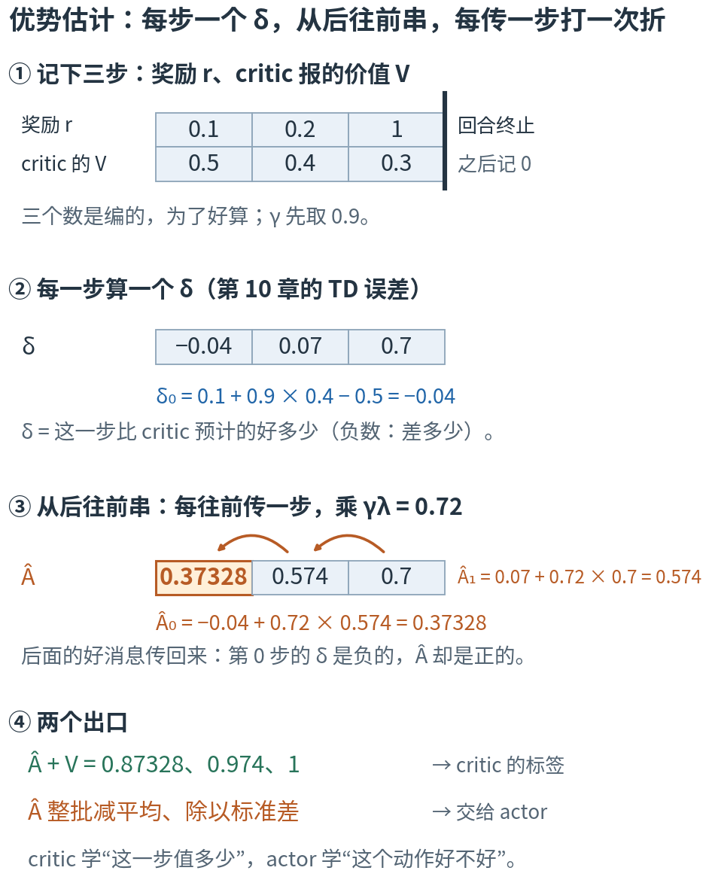
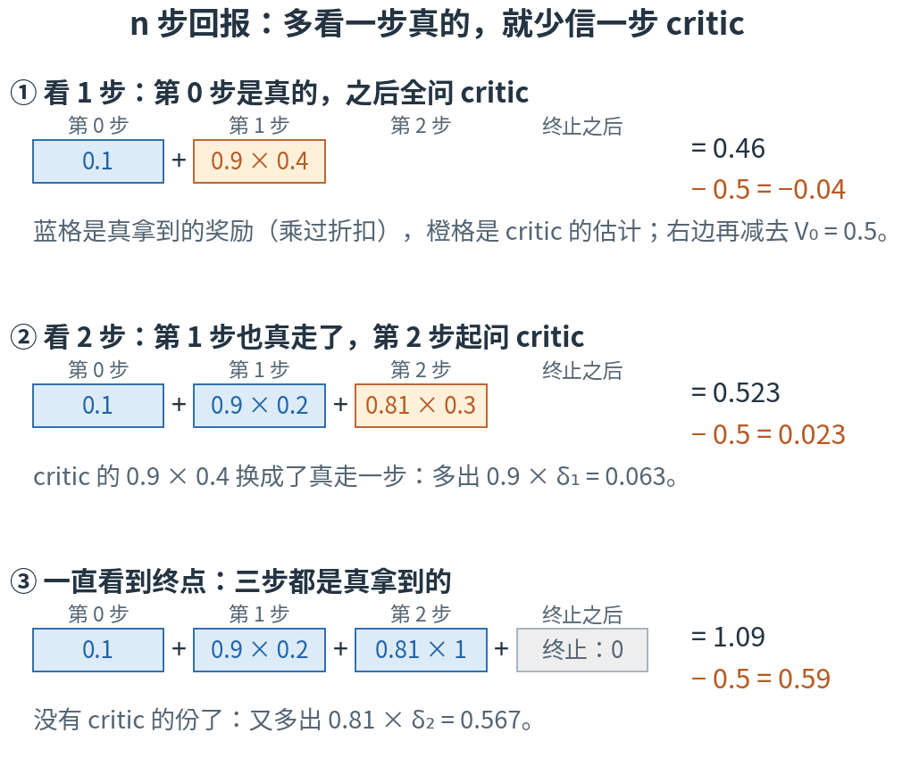
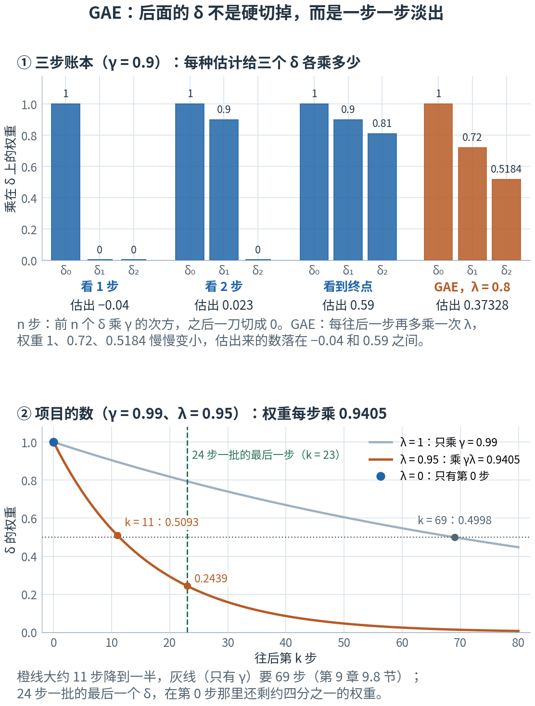
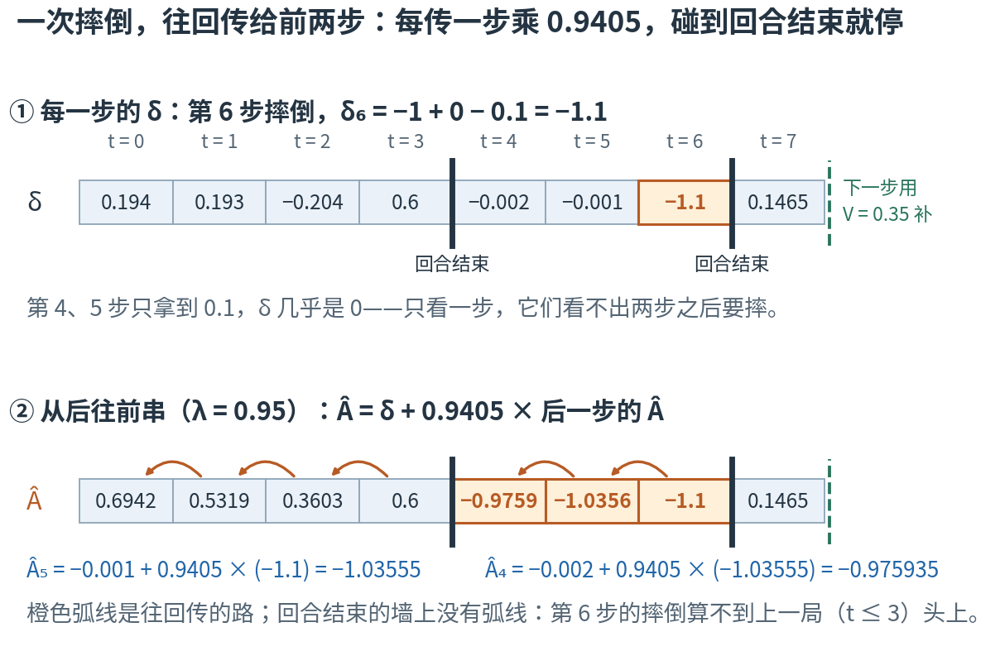
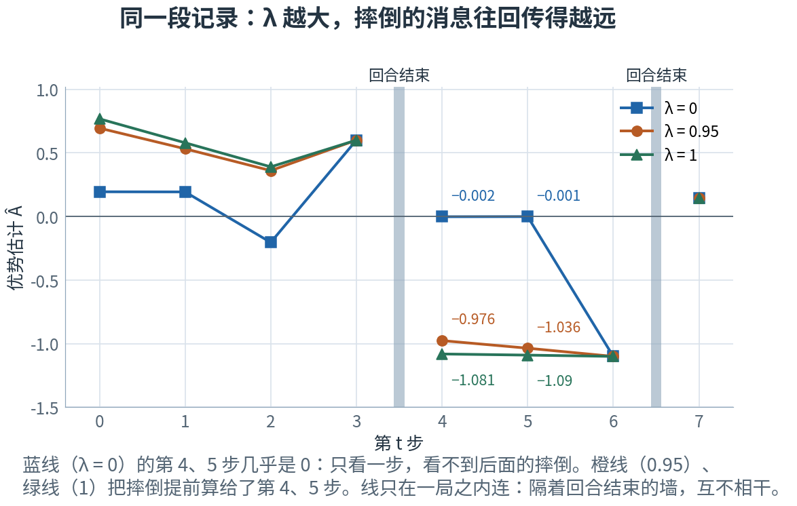
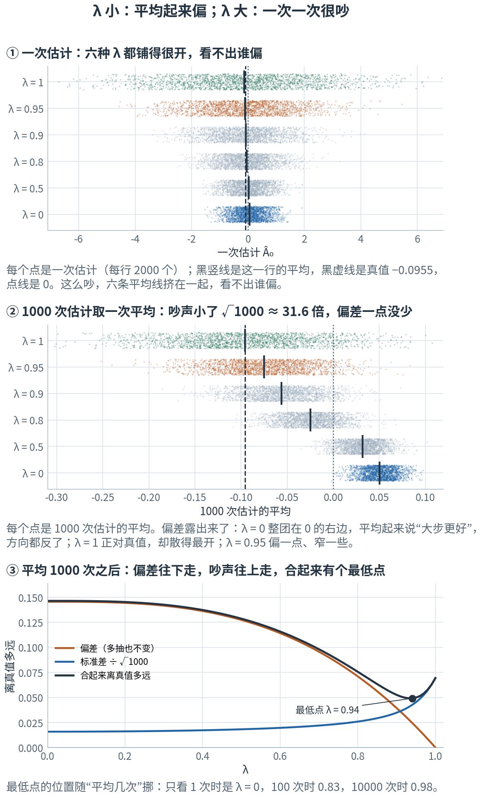
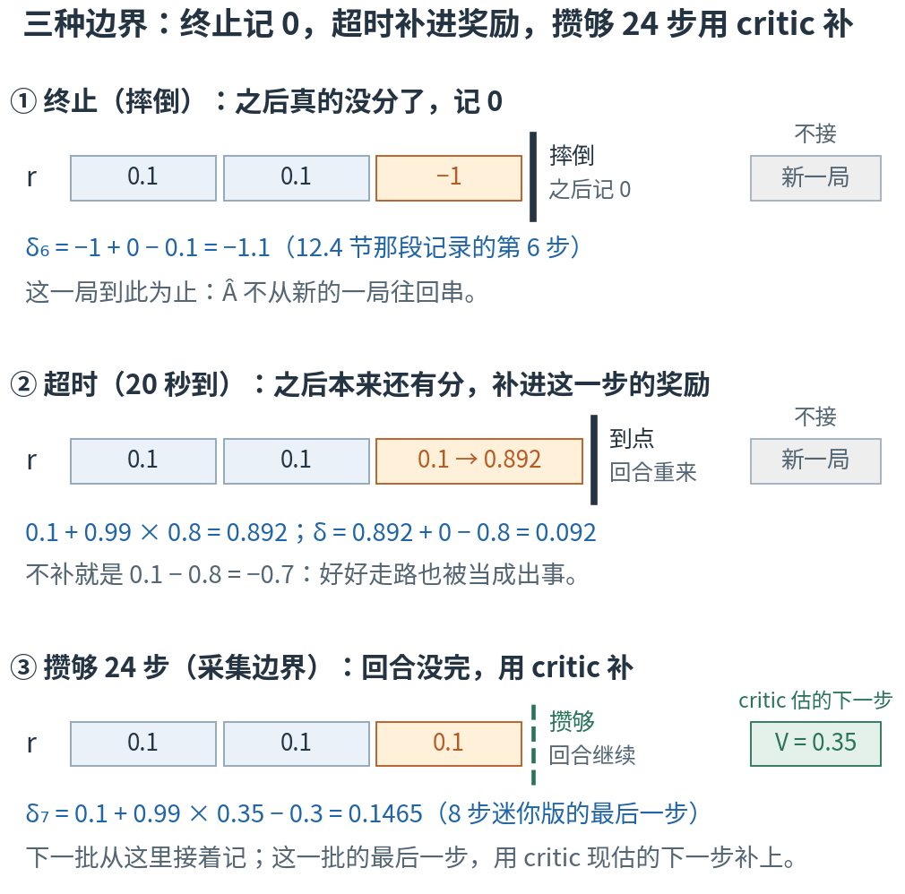

# 第 12 章 · 优势估计 GAE：一串"意外"从后往前传，每传一步打一次折

> **上一章我们有了什么**：第 11 章（策略梯度）的做法——抽到哪个动作，就把它的概率往上推一把，推多少看它**比平均好多少**；很多条记录平均起来，就是 actor 的旋钮该往哪边拧。这个"比平均好多少"就是第 10 章 10.4 节的优势，第 11 章的公式里乘的是它的估计，写成 $\hat A$。
>
> **这一章要补什么**：第 11 章留下的问题是：$\hat A$ 用什么算？第 10 章 10.4 节说过，一个 δ 就是优势的一次抽样；可它只看了一步，后面的事全凭 critic 的估计，critic 估错了，它就跟着错。
> 另一个极端是一直等到回合结束，拿真拿到的回报减去 V：不靠 critic，可一路上每一步的运气都加了进来，很吵；何况项目里每只机器人只走 24 步就要更新一次，常常等不到回合结束。
> 这一章在两个极端之间装一个旋钮 λ：把后面每一步的 δ 都加回来，越远的打越多的折。这就是 GAE，项目里 λ = 0.95。
> 本章最后，你会逐行读懂 rsl_rl 里干这件事的 `compute_returns()`——去掉注释和说明文字只有 12 行。
>
> **本章新词**：n 步回报、广义优势估计（GAE）、偏差、偏差-方差权衡、超时自举、优势归一化。
> **需要的前提**：第 9 章的终止与超时（9.6 节）、回报与折扣（9.7 节）；第 10 章的 TD 误差与自举（10.3 节）、优势（10.4 节）、critic（10.5 节）；
> 第 4 章的方差与标准差（4.4 节）、"多抽几次取平均"（4.5 节）；第 8 章的归一化（8.3 节）。
> **不要求**会推导求和公式——展开、化简都放在"进阶"折叠里，折叠外面各留一次能手算的核对。

---

## 12.0 先看地图：一串"意外"，从后往前传，每传一步打一次折

**一个动作好不好，要看它之后发生了什么。每一步都有一个"意外"：比 critic 预计的好了多少、差了多少，就是第 10 章的 δ。
把后面每一步的意外都算回到这个动作头上，越远的算得越少（每远一步多打一次折），就是本章的优势估计 GAE；折打得多狠，由旋钮 λ 决定。**

还是第 10 章那个导航。你在一个路口选了上高速，事后想知道：这个选择到底好不好？有三种算法。

- **急性子**：开过第一段就下结论。这一段比导航预计的快了 2 分钟，导航顺手把"剩下还要多久"也改短了一点——一加一减，结论是"上高速好"。
  快，可后面的路全凭导航的预计：导航要是还不知道前面 30 公里在修路，结论就错了，而且每次都错在同一边。
- **慢性子**：一直开到上海，拿实际总用时和出发时的预计比。不再靠导航的预计，可总用时里掺着一路上的运气——后面的红灯、别人的剐蹭，
  和那个路口的选择毫无关系，也全算了进来。同样的选择，今天和明天的结论可能一正一负。
- **折中**：把后面每一段"比预计快了多少、慢了多少"都记到这个选择头上，但越往后的段记得越少。

第三种就是 GAE。这一章先用三步的小账本把它手算一遍，再看它在训练代码里是哪几行。



**读图顺序：** 从 ① 到 ④ 竖着读。① 是一段只有三步的记录：每一步拿到的奖励，critic 当时报的价值；走完这三步，回合终止。② 每一步算一个 δ。
③ 从最后一步往前，把后一步的 Â 乘 0.72，加到这一步的 δ 上（0.72 就是图上写的 γλ = 0.9 × 0.8；λ 是开篇说的那个旋钮，12.3 节细讲）。④ 算出来的 Â 有两个去处。
图里的数现在不用算，12.1–12.3 节会一个一个手算出来；④ 的第二行到 12.7 节再讲。

| 概念 | 它在回答什么问题 | 导航里对应什么 | 在哪一节 |
|---|---|---|---|
| 两个极端：一步估计、整局估计 | 这个动作比预计好多少：只看一步，还是一直看到回合结束？ | 急性子开过第一段就下结论；慢性子开到上海再比总用时 | 12.1 |
| n 步回报 | 先看 n 步真拿到的分，剩下的交给 critic？ | 开过 n 段再下结论 | 12.2 |
| GAE 和它的旋钮 λ | 后面每一步的意外，各记多少到这个动作头上？ | 折中：后面每段都记，越远记得越少 | 12.3 |
| 回合边界 | 往回记，记到哪里为止？ | 这一趟到站了，下一趟的堵车不算在这一趟头上 | 12.4、12.6 |
| 偏差、方差 | 很多次估计平均起来，偏了多少？一次和一次差多少？ | 导航不知道修路；一路上的运气 | 12.5 |
| 超时自举 | 时间到了停下，本来还有的分怎么补？ | 导航到点关机，剩下的路按它最后的预计算 | 12.6 |
| 优势归一化 | 交给 actor 之前，怎么统一尺度？ | 把"快了几分钟"换成"比这一批平均快了多少" | 12.7 |

表里的名字先不背，英文和符号到了各节再给。本章最容易混的四处，先贴上标签：

- **三个"偏差"**：第 1 章 1.9 节的偏差是"指令 − 实际"（要 0.4 m/s，走了 0.3 m/s，差 0.1）；第 4 章 4.4 节算方差时，偏差是"这一次的结果 − 平均"。
  12.5 节的偏差是第三种：**很多次估计的平均，离真值还差多少**。那里有 ⚠️。
- **γ 和 λ**：都是"往后每多一步，多乘一次"的数，管的事却不同。γ 定"远处的分算多少"，是题目本身的一部分（第 9 章 9.7 节）；λ 定"后面的 δ 信多少"，是估计的办法。12.3 节把它们乘在一起，写成 γλ。
- **奖励 r、回报 G、代码里的 `returns`**：`returns` 是 critic 的标签 Â + V。只有 λ = 1、而且这一局在这批数据里走到了终止，它才等于第 9 章的回报 G（12.3 节）。
- **done 和终止**：代码里 done = 1 只说"这一局在这一步停了"。超时也会让 done = 1，可超时之后本来还有分（12.6 节）。

现在觉得这些区别有点抽象很正常，读到对应小节就清楚了。
还有一处数要留心：12.1–12.3 节为了好算，γ 取 0.9、λ 取 0.8；从 12.4 节起换成项目的 γ = 0.99、λ = 0.95。

第一次读，只要按顺序看正文、图和手算。标着"进阶"的折叠内容可以先跳过；代码是复核工具，不是阅读门槛。

## 12.1 两个极端：只看一步，还是一直看到终点

先造一段最短的记录（数是编的，为了好算）。一只机器人走了三步，每一步拿到的奖励，和 critic 在那一步报的价值：

| 第几步 t | 0 | 1 | 2 |
|---|---|---|---|
| 奖励 r | 0.1 | 0.2 | 1 |
| critic 报的 V | 0.5 | 0.4 | 0.3 |

第 2 步之后回合终止：之后没有分，"下一步的价值"记 0（第 10 章 10.1 节"终点记 0"）。γ 取 0.9。

要回答的问题是：**第 0 步做的那个动作，比平均好多少？**——第 10 章 10.4 节的优势。有两种最直接的算法。

**只看一步。** 第 0 步拿到 0.1；到了第 1 步，critic 说"从这里往后还值 0.4"，打一次折是 0.36。合起来 0.46，比 critic 在第 0 步的预计 0.5 少了 0.04：

$$\delta_0 = 0.1 + 0.9 × 0.4 - 0.5 = -0.04$$

这正是第 10 章 10.3 节的 TD 误差。结论：这个动作比平均差一点点。这种算法下面叫**一步估计**：只用了一步真拿到的奖励，其余全凭 critic。

**一直看到终点。** 三步真拿到的奖励打着折加起来，就是第 9 章 9.7 节的回报：$G_0 = 0.1 + 0.9 × 0.2 + 0.81 × 1 = 1.09$（0.81 = 0.9 × 0.9，打两次折）。
再减去 critic 在第 0 步的预计：1.09 − 0.5 = 0.59。结论：这个动作比平均好得多。这种算法下面叫**整局估计**：除了最后减去的起点那个 V，一个 critic 的数都不用。

这两种算法第 10 章都见过：一步估计是 10.3 节 TD 的做法，整局估计是 10.1 节蒙特卡洛的做法（拿真拿到的回报，只是这里只跑了一次）。

同一个动作，一个说 −0.04，一个说 0.59，连正负号都不一样。差在哪？看第 1 步：critic 说"从第 1 步往后还值 0.4"，可实际从第 1 步起拿到的是 $G_1 = 0.2 + 0.9 × 1 = 1.1$。
critic 估低了一大截，一步估计照单全收；整局估计根本没用这个数。

那是不是整局估计就对了？也不是。这三个奖励只是**一次**的结果。真训练时，奖励每次都带着运气（第 10 章 10.1 节：同一格出发，两个回合的回报一个 1、一个 0.715），
一局越长，加进来的运气越多。一步估计只沾一步的运气，整局估计沾一整局的。两种算法各有各的毛病：一个怕 critic 不准，一个怕运气太吵。12.5 节会把这两种毛病量出来。

估出来的优势，第 11 章 11.4 节的公式里已经写成 $\hat A$（读"A 帽"）：帽子提醒你它是**估计**，不是第 10 章 10.4 节那个"平均起来才是"的真值 A。这一章讲的就是 $\hat A$ 怎么算。

| 符号 | 怎么读 | 就是 |
|---|---|---|
| $\hat A_t$ | "A 帽 t" | 第 t 步那个动作的优势的估计 |
| $\delta_t = r_t + \gamma V(s_{t+1}) - V(s_t)$ | "德尔塔 t" | 第 10 章 10.3 节的 TD 误差。一步估计：$\hat A_t = \delta_t$ |
| $G_t - V(s_t)$ | | 从第 t 步起真拿到的回报，减去 critic 在第 t 步的预计。整局估计：$\hat A_t = G_t - V(s_t)$ |

下面常把 $V(s_t)$ 简写成 $V_t$：$V_0 = 0.5$，$V_1 = 0.4$，$V_2 = 0.3$。
实验第 1 节把这几个数都算了一遍：三个 δ 是 −0.04、0.07、0.7，$G_0 = 1.09$，$G_1 = 1.1$。

> **停一下，自测**：换成第 1 步的动作。一步估计和整局估计各是多少？
> <details><summary>答案</summary>
>
> 一步估计：$\delta_1 = 0.2 + 0.9 × 0.3 - 0.4 = 0.07$。整局估计：$G_1 - V_1 = 1.1 - 0.4 = 0.7$，差了 10 倍——还是因为 critic 在第 2 步报的 0.3，比实际的 1 低得多。
>
> </details>

## 12.2 n 步回报：先看 n 步真拿到的分，剩下的问 critic

两个极端之间，有一串中间的算法：先看两步真拿到的分，再问 critic；或者先看三步……还是第 0 步，手算三种：

- **看 1 步**：$0.1 + 0.9 × 0.4 = 0.1 + 0.36 = 0.46$，减去 0.5 得 −0.04。就是 12.1 节的一步估计。
- **看 2 步**：第 0、1 步真拿到的 0.1 和 0.2，第 2 步起问 critic（它报 0.3，打两次折）：$0.1 + 0.9 × 0.2 + 0.81 × 0.3 = 0.1 + 0.18 + 0.243 = 0.523$，减去 0.5 得 0.023。
- **看 3 步**：三步都是真的，走完这三步回合已经终止，没有 critic 的份：$0.1 + 0.18 + 0.81 × 1 = 1.09$，减去 0.5 得 0.59。就是 12.1 节的整局估计。



**这样读图：** 每一行从左往右，是"从第 0 步起，每一步贡献多少"。蓝格是真拿到的奖励（已经乘过折扣），橙格是 critic 的估计（也乘过折扣）。
从 ① 到 ③，蓝格一格一格往右长，橙格一格一格往右退，最后退没了。每一行右边先加起来，再减去 critic 在第 0 步的预计 0.5。

这样"前 n 步用真拿到的奖励、第 n 步之后请 critic 补上"算出来的数，叫 **n 步回报**（n-step return）。第 10 章 10.3 节的 TD 目标就是 1 步回报。写成式子：

$$G_t^{(n)} = r_t + \gamma r_{t+1} + \cdots + \gamma^{n-1} r_{t+n-1} + \gamma^n V(s_{t+n})$$

| 符号 | 怎么读 | 就是 |
|---|---|---|
| $G_t^{(n)}$ | "G t 的 n 步" | 从第 t 步起的 n 步回报。上标的括号只是"看几步"的标记，不是 n 次方 |
| $r_t + \cdots + \gamma^{n-1} r_{t+n-1}$ | | 前 n 步真拿到的奖励，打着折加起来（图里的蓝格） |
| $\gamma^n V(s_{t+n})$ | | 第 n 步之后请 critic 补的那一块，打 n 次折（图里的橙格）。中途终止了，就没有这一项 |

n 步回报不是第 9 章的回报 G：它只有前 n 步是真拿到的，最后一项是 critic 的估计。只有回合在这 n 步里终止了（图里的 ③），它才等于 G。

再看减去 0.5 之后的三个数：−0.04 → 0.023 → 0.59。每多看一步，多出来多少？

- 1 步 → 2 步：多出 0.023 − (−0.04) = 0.063 = 0.9 × 0.07，正好是**打过一次折的 δ₁**。
- 2 步 → 3 步：多出 0.59 − 0.023 = 0.567 = 0.81 × 0.7，正好是**打过两次折的 δ₂**。

不是巧合。多看一步，就是把橙格里"critic 对第 1 步的估计 0.9 × 0.4"，换成"真走一步：0.9 × (0.2 + 0.9 × 0.3)"。
换掉的差额是 0.9 × (0.2 + 0.27 − 0.4) = 0.9 × 0.07——括号里的 0.2 + 0.27 − 0.4，就是第 1 步的 δ₁。所以

$$\text{看 n 步的优势估计} = G_t^{(n)} - V(s_t) = \delta_t + \gamma\,\delta_{t+1} + \cdots + \gamma^{n-1}\,\delta_{t+n-1}$$

看到终点的那一行也不例外：$-0.04 + 0.9 × 0.07 + 0.81 × 0.7 = -0.04 + 0.063 + 0.567 = 0.59$，正是 $G_0 - V_0$。
把一局里的 δ 全部打着折加起来，中间 critic 的估计会两两抵消，只剩"真拿到的回报 − 起点的 V"——这一招叫"望远镜消去"，折叠里写开。

<details>
<summary>进阶：望远镜消去，为什么中间的 V 全都抵消（现在可跳过）</summary>

把三个 δ 按定义写开，γ 用 0.9：

$$\delta_0 + 0.9\,\delta_1 + 0.81\,\delta_2 = (r_0 + 0.9 V_1 - V_0) + 0.9\,(r_1 + 0.9 V_2 - V_1) + 0.81\,(r_2 + 0 - V_2)$$

第一个括号里有 $+0.9V_1$，第二个括号乘开有 $-0.9V_1$，抵消；第二个括号里的 $+0.81V_2$ 和第三个括号的 $-0.81V_2$，也抵消。剩下的是

$$r_0 + 0.9\,r_1 + 0.81\,r_2 - V_0 = G_0 - V_0$$

像一节一节收起来的望远镜：每一节的头都被下一节的尾盖住，只剩最外面的两端。一般地，γ 取任何值、一局有多长都一样：$\sum_k \gamma^k \delta_{t+k}$ 里，每个中间的 $\gamma^{k} V(s_{t+k})$ 都出现一正一负。
数字上，上面刚核对过：−0.04 + 0.063 + 0.567 = 0.59 = 1.09 − 0.5。

</details>

实验第 2 节把这三行分成"真拿到的""critic 补的"两块印了出来，数和上面一样。

看几步，就是在"信 critic"和"信真实奖励"之间选一个位置：n 越小，越依赖 critic 报得准；n 越大，加进来的真实奖励（连同它们的运气）越多。

> **停一下，自测**：假如 critic 在第 2 步报准了，报的是 1（从第 2 步起实际就拿到 1），而不是 0.3。看 2 步的估计变成多少？和看到终点的比呢？
> <details><summary>答案</summary>
>
> $0.1 + 0.18 + 0.81 × 1 - 0.5 = 0.59$，和看到终点的一模一样。critic 报得准的时候，看几步结论都一样（在不算运气的这个账本里）；n 越小，越依赖这份"准"。
>
> </details>

## 12.3 GAE：后面的 δ 全都加进来，越远打越多的折

12.2 节的 n 步估计有一个生硬的地方：前 n 个 δ 照单全收，第 n 个之后**一刀切成 0**。n = 1 时只信第 0 步的 δ；n = 3 时三个都信。
能不能不切，让后面的 δ 一个一个**淡出**？办法是：往后第 k 个 δ，除了照常乘 γ 的 k 次方，再多乘一个 λ 的 k 次方，λ 是 0 到 1 之间的一个数。

取 λ = 0.8。每往后一步乘的数变成 γλ = 0.9 × 0.8 = 0.72，再往后是 0.72 × 0.72 = 0.5184：

$$\hat A_0 = -0.04 + 0.72 × 0.07 + 0.5184 × 0.7 = -0.04 + 0.0504 + 0.36288 = 0.37328$$

它落在一步估计 −0.04 和整局估计 0.59 之间。这种算法叫**广义优势估计**（generalized advantage estimation，GAE）。写成一般的式子：

$$\hat A_t = \delta_t + (\gamma\lambda)\,\delta_{t+1} + (\gamma\lambda)^2\,\delta_{t+2} + \cdots = \sum_{k=0}^{\infty} (\gamma\lambda)^k\,\delta_{t+k}$$

| 符号 | 怎么读 | 就是 |
|---|---|---|
| $\lambda$ | "拉姆达" | 新旋钮，0 到 1 之间。越大，后面的 δ 淡出得越慢。项目里 0.95 |
| $\gamma\lambda$ | "伽马拉姆达" | 每往后一步多乘的数：本节 0.72，项目里 0.99 × 0.95 = 0.9405 |
| $(\gamma\lambda)^k$ | | 往后第 k 个 δ 的权重：打 k 次折 |
| $\sum_{k=0}^{\infty}$ | "对 k 从 0 到无穷求和" | 第 2 章 2.2 节的 for 循环。碰到回合结束就停，一局有限长 |

两头正好是 12.1 节的两个极端。λ = 0：从第二项起全是 0，只剩 $\hat A_t = \delta_t$，一步估计。λ = 1：权重变回 γ 的次方，就是 12.2 节"看到终点"那一行，$G_t - V(s_t)$。
λ 从 0 拧到 1，GAE 就从"只信 critic"滑到"只信真实奖励"。γ 和 λ 虽然都是每步乘一次，γ 定的是"远处的分算多少"（题目本身），λ 定的是"后面的 δ 信多少"（估计的办法）。

### λ 是一个"软的 n"：权重一步一步淡出

下图上半把 12.2 节的三种 n 步估计和 GAE 并排放，看它们各给三个 δ 乘多少；下半换成项目的数。



**这样读图：** ① 每组三根柱子是乘在 δ₀、δ₁、δ₂ 上的权重。蓝色的 n 步估计：前几根是 1、0.9、0.81，后面一刀切成 0；橙色的 GAE：1、0.72、0.5184，一根比一根矮，但没有哪一根是 0。
② 横轴是往后第几步，纵轴是那一步的 δ 的权重。灰线只乘 γ = 0.99（λ = 1），第 69 步才降到一半——就是第 9 章 9.8 节那条线；
橙线乘 0.9405（λ = 0.95），第 11 步就只剩 0.5093。绿色虚线是 24 步一批的最后一步：那里的 δ 对第 0 步还有 0.2439 的权重。

所以项目里的 GAE，大约看 11 步就把后面的 δ 打了对折。λ 是一个"软的 n"：不是硬切，而是慢慢淡出。

<details>
<summary>进阶：GAE 也是 1 步、2 步、3 步估计的加权平均（现在可跳过）</summary>

12.2 节算过：看 1 步、2 步、3 步的优势估计是 −0.04、0.023、0.59。给它们三个权重 $1-\lambda$、$(1-\lambda)\lambda$、$\lambda^2$，λ = 0.8 时是 0.2、0.16、0.64，加起来正好是 1：

$$0.2 × (-0.04) + 0.16 × 0.023 + 0.64 × 0.59 = -0.008 + 0.00368 + 0.3776 = 0.37328$$

又是 GAE。前两个权重 $(1-\lambda)$、$(1-\lambda)\lambda$ 按 λ 的次方递减；最后一个 $\lambda^2$ 把剩下的权重全拿走，因为第 3 步之后已经终止，没有更长的估计可分。
一般地，GAE = $(1-\lambda)$ × [1 步估计 + λ × 2 步估计 + λ² × 3 步估计 + …]，一局结束时，最后一项接住剩下的所有权重。

为什么相等？把 12.2 节的"n 步估计 = 前 n 个 δ 打折相加"代进去，数一数 δ₁ 一共分到多少：它出现在 2 步、3 步估计里，权重 $0.16 + 0.64 = 0.8$，再乘上它自带的 γ = 0.9，得 0.72——正是 GAE 给 δ₁ 的 γλ。
δ₂ 只出现在 3 步估计里：0.64 × 0.81 = 0.5184 = (γλ)²。δ₀ 三种估计都有：0.2 + 0.16 + 0.64 = 1。

</details>

### 从后往前算：和回报一样的 reduceRight

照定义算，每一步都要把后面所有的 δ 重新加一遍。第 9 章 9.7 节的回报有一个省事的算法：从最后一步往前，这一步的分，加上 γ 乘"后一步起的回报"。
GAE 照搬，只是"这一步的分"换成 δ，γ 换成 γλ。从最后一步往前手算：

1. $\hat A_2 = \delta_2 = 0.7$：第 2 步之后回合终止，后面没有了。
2. $\hat A_1 = 0.07 + 0.72 × 0.7 = 0.07 + 0.504 = 0.574$。
3. $\hat A_0 = -0.04 + 0.72 × 0.574 = -0.04 + 0.41328 = 0.37328$。

和上面按定义算的 0.37328 一样。写成式子，和第 9 章 9.7 节的 $G_t = r_t + \gamma G_{t+1}$ 是同一个样子：

$$\hat A_t = \delta_t + \gamma\lambda\,\hat A_{t+1}\qquad\text{（回合在第 t 步之后结束，就不加后面那一项）}$$

把 $\hat A_1$ 的算式代进 $\hat A_0$ 的，$-0.04 + 0.72 × (0.07 + 0.72 × 0.7)$ 乘开，就是 $-0.04 + 0.72 × 0.07 + 0.72^2 × 0.7$——递推只是把定义式从后往前、一层一层地算，每个 δ 只碰一次。
写成 JS 就是 `reduceRight`：

```js
const deltas = [-0.04, 0.07, 0.7], gl = 0.9 * 0.8;               // 三个 δ；每往前传一步乘 γλ = 0.72
const A0 = deltas.reduceRight((later, d) => d + gl * later, 0);   // 从最后一个往前：0.7 → 0.574 → 0.37328
```

控制台会印出 0.3732800000000001：小数在计算机里存得不精确，末尾那个 1 不用管。

第 0 步的 δ 是负的（−0.04），它的 Â 却是正的（0.37328）：后面两步的好消息传了回来，改变了对这一步的评价。
但别把它读成"证明了第 0 步的动作单独造成了后面的好结果"——这只是一次估计，要很多条记录平均起来才作数（第 10 章 10.4 节的那条自测）。

实验第 3 节把展开和递推都算了一遍，每一步都相同。

> **停一下，自测**：把 λ 换成 0.5（γλ = 0.45），用从后往前的办法算 $\hat A_1$ 和 $\hat A_0$；再用展开式核对 $\hat A_0$。
> <details><summary>答案</summary>
>
> $\hat A_2 = 0.7$；$\hat A_1 = 0.07 + 0.45 × 0.7 = 0.385$；$\hat A_0 = -0.04 + 0.45 × 0.385 = 0.13325$。
> 展开：$-0.04 + 0.45 × 0.07 + 0.2025 × 0.7 = -0.04 + 0.0315 + 0.14175 = 0.13325$。λ 变小，后面的好消息传回来的更少，Â₀ 从 0.37328 降到 0.13325。
>
> </details>

### critic 的标签：returns = Â + V

第 10 章 10.5 节说，critic 的标签是"TD 目标的升级版"。升级版就是它：把 Â 加回 critic 当时报的 V——

$$\text{returns}_t = \hat A_t + V(s_t)$$

三步账本：0.37328 + 0.5 = 0.87328，0.574 + 0.4 = 0.974，0.7 + 0.3 = 1。实验第 3 节把 λ 取 0、0.8、1 时的 returns 并排印出来：

```
t  λ = 0：TD 目标  λ = 0.8：returns  λ = 1：回报 G
-  --------------  ----------------  -------------
0            0.46           0.87328           1.09
1            0.47             0.974            1.1
2               1                 1              1
```

λ = 0 时 Â = δ，returns = δ + V = r + γV(s')，正是第 10 章 10.3 节的 TD 目标：0.1 + 0.9 × 0.4 = 0.46。λ = 1 时它就是真拿到的回报 G：1.09、1.1、1。
项目的 λ = 0.95，标签落在两者之间，更靠近真实的回报。

> ⚠️ **`returns` 不是第 9 章的回报 G。** 代码里把 critic 的标签叫 `returns`，可它是 Â + V：用了 critic 自己的估计，也被 λ 打过折。
> 只有 λ = 1、而且这一局在这批数据里走到了终止，它才等于 G。三个"分"别混：奖励 r 是一步的分，回报 G 是真拿到的折扣总和，`returns` 是给 critic 的标签。

**为什么重要**：第 11 章（策略梯度）乘在"推一把"后面的，就是这里的 Â；第 10 章 10.5 节 critic 要追的标签，就是这里的 returns。一次倒着的循环，同时喂饱了 actor 和 critic 两张网络（📍 映射到项目）。

## 12.4 往回传：一次摔倒，提前算到前两步头上

从这一节起换成项目的数：γ = 0.99，λ = 0.95，每往前传一步乘 γλ = 0.9405。记录也长一点：一只机器人连续 8 步（项目里是 24 步，这是它的迷你版），中间有两次回合结束。
数还是编的，但各种情况都有：第 3 步拿到 +1 后这一局终止；第 4 步起是新的一局，第 6 步摔倒（奖励 −1，终止）；第 7 步又是新的一局，记到这里正好攒够 8 步——
这时 critic 对"下一步"估的价值是 0.35（下面记作 $V_{\text{last}}$）。先照 12.1 节的办法，每一步算一个 δ：

```
t    r    V  这一步之后       δ
-  ---  ---  ----------  ------
0  0.1  0.5               0.194
1  0.1  0.6               0.193
2  0.1  0.7              -0.204
3    1  0.4        终止     0.6
4  0.1  0.3              -0.002
5  0.1  0.2              -0.001
6   -1  0.1        终止    -1.1
7  0.1  0.3   攒够 8 步  0.1465
```

抽几个核对：$\delta_0 = 0.1 + 0.99 × 0.6 - 0.5 = 0.194$；第 3 步之后终止，下一步的价值记 0，$\delta_3 = 1 + 0 - 0.4 = 0.6$；同理 $\delta_6 = -1 + 0 - 0.1 = -1.1$；
第 7 步是这一批的最后一步，下一步的价值用 $V_{\text{last}}$：$\delta_7 = 0.1 + 0.99 × 0.35 - 0.3 = 0.1465$。

再从后往前串。多了一条规矩：**碰到回合结束就断开**——第 t 步之后回合结束了，第 t + 1 步属于新的一局，它的 Â 不能加到第 t 步上。

1. $\hat A_7 = \delta_7 = 0.1465$：这一批里它后面没有记录了（它之后的未来，已经由 $V_{\text{last}}$ 算进 δ₇）。
2. $\hat A_6 = \delta_6 = -1.1$：第 6 步之后回合结束，第 7 步是新的一局，不接。
3. $\hat A_5 = -0.001 + 0.9405 × (-1.1) = -1.03555$。
4. $\hat A_4 = -0.002 + 0.9405 × (-1.03555) = -0.975935$。
5. $\hat A_3 = \delta_3 = 0.6$：第 3 步之后回合结束，第 4 步起是新的一局，不接。
6. 再往前照常：$\hat A_2 = -0.204 + 0.9405 × 0.6 = 0.3603$，$\hat A_1$、$\hat A_0$ 留给自测。

看第 4、5 步：它们各只拿到 0.1，δ 几乎是 0（−0.002、−0.001）——只看一步，看不出任何问题。可它们的 Â 是 −0.98、−1.04：第 6 步的摔倒传了回来。
**GAE 把"两步之后要摔"的消息，提前算到了第 4 步头上。** 传到第 4 步时乘了两次 0.9405：0.9405 × 0.9405 × (−1.1) ≈ −0.973，Â₄ 的大头就是它。



**这样读图：** ① 上排是每一步的 δ。第 6 步的 −1.1 最显眼；第 4、5 步的 δ 几乎是 0。两道粗竖线是回合结束；最右边的绿色虚线是这一批的末尾，那里用 $V_{\text{last}} = 0.35$ 补。
② 下排是 Â。橙色弧线是往回传的路：每条弧把后一格的 Â 乘 0.9405，加到前一格上。粗竖线上没有弧线——第 6 步的摔倒算不到上一局（第 0–3 步）头上；第 7 步那一局里的事，也算不到第 6 步头上。

同一段记录，λ 取别的值呢？实验第 4 节把 λ = 0、0.95、1 并排算了：

```
t  Â（λ = 0，就是 δ）  Â（λ = 0.95）  Â（λ = 1）
-  ------------------  -------------  ----------
0               0.194       0.694216    0.767309
1               0.193       0.531862      0.5791
2              -0.204         0.3603        0.39
3                 0.6            0.6         0.6
4              -0.002      -0.975935     -1.0811
5              -0.001       -1.03555       -1.09
6                -1.1           -1.1        -1.1
7              0.1465         0.1465      0.1465
```



**这样读图：** 横轴是第几步，纵轴是 Â。先看第 4、5 步：蓝线（λ = 0）贴着 0，橙线（0.95）和绿线（1）都掉到 −1 附近。
λ 越大，摔倒的消息往回传得越远、剩得越多；λ = 0 时消息一步也传不回去。再看两道灰色竖条：线在这里断开——隔着回合结束，互不相干。第 3、6、7 步三种 λ 完全一样：它们后面紧挨着回合结束或这一批的末尾，没有后面的 Â 可接，Â 就是 δ 自己。

"碰到回合结束就断开"，在代码里是乘一个 (1 − done)：第 t 步之后回合结束了，done 就是 1，1 − done = 0，把"下一步的价值"和"后一步的 Â"一起乘成 0：

$$\delta_t = r_t + \gamma\,(1 - \text{done}_t)\,V(s_{t+1}) - V(s_t), \qquad \hat A_t = \delta_t + \gamma\lambda\,(1 - \text{done}_t)\,\hat A_{t+1}$$

没结束时 1 − done = 1，式子和 12.3 节的一样。📍 映射到项目里，这个 (1 − done) 叫 `next_is_not_terminal`。

> **停一下，自测**：接着上面第 6 条，算 $\hat A_1$ 和 $\hat A_0$（提示：$\hat A_2 = 0.3603$），再和表里 λ = 0.95 那一列对一对。
> <details><summary>答案</summary>
>
> $\hat A_1 = 0.193 + 0.9405 × 0.3603 = 0.193 + 0.33886 = 0.53186$，和表里的 0.531862 对上（多保留几位：0.9405 × 0.3603 = 0.33886215）。
> $\hat A_0 = 0.194 + 0.9405 × 0.531862 = 0.194 + 0.500216 = 0.694216$，也和表里一样。
>
> </details>

### 4096 只机器人一起算：沿时间轴走，各算各的

项目里一批数据不是一条记录，是 4096 只机器人各 24 步，排成 `[24, 4096]` 的样子：第 0 轴是时间，第 1 轴是机器人（第 2 章 2.8 节）。
第 2 章 2.8 节说过：同一回合里，时间有先后因果；机器人编号没有——B 不是 A 的下一时刻。所以倒着循环时，**沿时间轴走**：每一步取出这一时刻的一整排（4096 只一起算），"下一步"永远是同一只机器人的下一行。

实验第 4 节做了一个迷你版 `[8, 2]`：A 是上面那段 8 步的记录，B 是一只一直稳稳走的机器人（每步奖励 0.1，critic 每步都报 0.3）。两只一起算，A 那一列和单独算 A 完全一样。
要是图省事，把 `[8, 2]` 按行展开成一条 16 步的长记录 A₀、B₀、A₁、B₁……再倒着算，A 第 0 步的"下一步"就成了 B 的第 0 步：
$\delta = 0.1 + 0.99 × 0.3 - 0.5 = -0.103$，而正确的是 0.194。B 的 0.3 被当成了 A 下一步的价值，后面的 Â 全错。

## 12.5 偏差与方差：λ 小了偏，λ 大了吵

λ 到底取多少？先把 12.1 节说的两种毛病量出来。

第 4 章 4.5 节讲大数定律时，留下过一句话：**多抽只能消掉"运气"，消不掉"规则写错"。** 打靶是个好例子：
手抖，弹孔围着靶心散开，一枪高一枪低——多打几枪、取弹孔的平均位置，就回到了靶心；准星歪了，弹孔整团偏向一边——打多少枪，平均位置都在那一边。
估计优势也有这两种错，而且 λ 正好在两者之间拉扯。

下面这个例子是为了看清两种错专门编的，数不来自项目：

1. 机器人在某个处境里，第 0 步有两种走法，策略各选一半：**大步**当场得 0.2，**小步**当场得 0.1。
2. 大步会让身子晃，可要到第 3 步才显出来：那一步少得 0.3。
3. 除此之外，两种走法以后都一样：每步平均得 0.1。但每一步的奖励都带随机的起伏，标准差 0.5（第 4 章 4.4 节）——比平均值还大，这个例子故意让奖励很吵。
4. critic 在第 1、2、3 步看不出走的是哪条路（身子还没晃起来，两种处境看上去一模一样），只能报两条路的平均；其余时刻它都报得准。
5. 每段记录 24 步，和项目一样，末尾用 critic 的估计补上（那时两条路早就没区别了，补得准）。γ = 0.99。

问题：**大步这个动作，优势是多少？GAE 平均起来又估成多少？**

先看大步这条路上，δ 平均是多少（不算随机起伏）：

- **第 0 步**：critic 在起点报的，是两种走法的平均：当场平均拿 0.15，再加上"之后"的那一截；到了第 1 步，critic 对两条路报的"之后"一模一样。
  δ₀ = 当场拿的 + 之后 − 起点的 V，"之后"一减就抵消了，大步这条路上 δ₀ 平均是 0.2 − 0.15 = **+0.05**。
- **第 3 步**：大步这条路实际少拿 0.3；critic 看不出走的是哪条路，只按"平均少拿 0.15"（一半的时候少 0.3）来预计。所以大步这条路上，δ₃ 平均是 −0.3 − (−0.15) = **−0.15**。
- **其余各步**：critic 估得准，δ 平均是 0。

真正的优势，是把真实发生的一切都算进来：当场多拿的 0.05，加上三步之后又少拿的 0.15（打三次折）：

$$A = 0.05 - 0.15 × 0.99^3 = 0.05 - 0.15 × 0.9703 = -0.0955$$

大步其实比平均**差**。再看 GAE：第 3 步的 −0.15 传回第 0 步，要乘 3 次 γλ（12.3 节的权重），所以 GAE 平均估成 $0.05 - 0.15 × (\gamma\lambda)^3$：

- λ = 0：只剩当场的 +0.05。它说"大步比平均好"——**连正负号都错了**。
- λ = 0.95：γλ = 0.9405，$0.9405^3 = 0.8319$，$0.05 - 0.15 × 0.8319 = -0.0748$。方向对了，还差一点。
- λ = 1：$0.05 - 0.15 × 0.9703 = -0.0955$，正好是真值。

λ = 0 的错，不是运气造成的：它压根没看第 3 步，全信了 critic 那个"两条路一样"的估计。重复一万次再平均，它还是 +0.05。
这种"很多次估计的平均，离真值还差多少"，叫**偏差**（bias）：λ = 0 的偏差是 0.05 − (−0.0955) = 0.1455，λ = 1 的是 0。

> ⚠️ **这是本书第三种"偏差"。** 第 1 章 1.9 节的偏差是"指令 − 实际"；第 4 章 4.4 节算方差时，偏差是"这一次的结果 − 平均"，它的平方再平均就是方差。
> 本节的偏差说的是**估计的平均 − 真值**：一次一次的估计有高有低，那是方差管的；平均起来还差多少，才是偏差。
> 英文也叫 bias、中文另起了名字的还有两个：第 7 章 7.4 节的起步修正，资料上常译"偏差修正"，修的正是本节这一种（从 0 起步的平均，头几步系统性地偏小）；网络里的 b 叫偏置（第 2 章 2.6 节），是一个旋钮，不是哪一种偏差。
> 本章里再说"偏差"，都是本节这一种。

再看随机起伏。这种一次一次的忽高忽低，第 11 章 11.4 节（基线）叫"抖"，本章叫"吵"，大小都用标准差来量。λ = 0 的 Â₀ 就是 δ₀，里面只有第 0 步那一个带起伏的奖励，所以它的标准差就是 0.5。λ = 1 把 24 步带起伏的奖励全加了进来，起伏也跟着叠起来。
实验第 5 节把六个 λ 的数都算了出来（表里是精确值；实验另外抽了 200 万段记录核对，只差一点运气）：

```
   λ  平均估成    偏差  一次估计的标准差  1000 次平均后离真值
----  --------  ------  ----------------  -------------------
   0    0.0500  0.1455            0.5000               0.1464
 0.5    0.0318  0.1274            0.5754               0.1286
 0.8   -0.0245  0.0710            0.8190               0.0756
 0.9   -0.0561  0.0394            1.0991               0.0526
0.95   -0.0748  0.0208            1.4322               0.0498
   1   -0.0955  0.0000            2.1927               0.0693
```

先看"偏差"和"一次估计的标准差"两列：λ 越大，偏差越小，标准差越大。一次估计的标准差（λ = 1 时 2.19）比要估的那个数（0.0955）大二十多倍——只看一次，几乎全是噪声。

<details>
<summary>进阶：一次估计的标准差 0.5、2.19 是怎么来的（现在可跳过）</summary>

第 k 步奖励的起伏，只出现在 δ_k 里，而 δ_k 在 Â₀ 里的权重是 $(\gamma\lambda)^k$（12.3 节）。所以 Â₀ = 固定的一部分 + $\sum_k (\gamma\lambda)^k$ × 第 k 步的起伏。
两条规矩：一个随机数乘 w，标准差乘 w，方差乘 w²；互相独立（第 4 章 4.5 节）的随机数相加，**方差相加**。
后一条可以用两枚硬币核对：各自等可能地出 +1 或 −1（方差都是 1），相加得 −2、0、0、+2 四种等可能的结果，平均 0，方差 (4 + 0 + 0 + 4) ÷ 4 = 2 = 1 + 1。

于是 Â₀ 的方差 = 0.5² × [1 + (γλ)² + (γλ)⁴ + ⋯]（24 项），标准差 = 0.5 × √[⋯]。λ = 0 时方括号里只剩 1，标准差 0.5；
λ = 1 时是 1 + 0.9801 + 0.9801² + ⋯，24 项加起来是 19.23（实验里一项一项加的；浏览器控制台里一行也能核对：`[...Array(24).keys()].reduce((s, k) => s + 0.9801 ** k, 0)`），标准差 0.5 × √19.23 ≈ 2.19。

</details>

两种错的区别在于多抽管不管用。第 4 章 4.5 节：把很多次估计取平均，标准差缩成原来的 1 ÷ √次数；可偏差一点不少。
第 11 章（策略梯度）最后也是把很多条记录的"推一把"平均起来用，所以要紧的是**很多次估计的平均**离真值多远。先随手取 1000 次（这个次数是挑的，下面会换），√1000 ≈ 31.6：
λ = 1 的吵声缩到 2.1927 ÷ 31.6 ≈ 0.069；λ = 0 的吵声缩到 0.5 ÷ 31.6 ≈ 0.016，可那 0.1455 的偏差原封不动。
表的最后一列就是"平均 1000 次之后，一般离真值多远"——和第 4 章 4.4 节算标准差是同一个配方（离多远 → 平方 → 平均 → 开根号），只是参照物从"自己的平均"换成了"真值"，所以偏差也算在里面。
六行里 λ = 0.95 那一行最小：0.0498。先别急着说"所以项目取 0.95"——这个"最小"跟着"平均几次"走。



**这样读图：** ① 每一行是一种 λ，每个点是一次估计，黑竖线是这一行的平均，黑虚线是真值 −0.0955，点线是 0。点铺满了 −6 到 6，六条平均线挤在一起，谁偏谁不偏根本看不出来。
② 换成"每个点是 1000 次估计的平均"。横轴的范围缩小了很多：点团收窄了 31.6 倍，偏差这才露出来——蓝色（λ = 0）整团在 0 的右边，平均起来说"大步更好"；
绿色（λ = 1）正对真值，却散得最开；橙色（0.95）偏一点，窄一些。③ 把②量成三条线：橙线是偏差（多抽也不变），随 λ 变大往下走；蓝线是标准差 ÷ √1000，往上走；黑线是两者合起来离真值多远，最低点在 λ = 0.94。

<details>
<summary>进阶：偏差和吵声怎样合成"离真值多远"（现在可跳过）</summary>

一个平均值离真值的距离，可以拆成两段：（这个平均值 − 它自己的平均）+（它自己的平均 − 真值）。第一段是运气，时正时负；第二段就是偏差，每次都一样。
平方再平均时，交叉的那一项里运气时正时负，平均掉了，剩下"运气的方差 + 偏差²"。所以

$$\text{离真值多远} = \sqrt{\text{偏差}^2 + \left(\text{标准差} \div \sqrt{\text{平均的次数}}\right)^2}$$

核对两行：λ = 0，$\sqrt{0.1455^2 + (0.5 ÷ \sqrt{1000})^2} = \sqrt{0.02117 + 0.00025} ≈ 0.1464$；λ = 0.95，$\sqrt{0.0208^2 + (1.4322 ÷ \sqrt{1000})^2} ≈ 0.0498$。和表里一样。

</details>

最低点在哪，要看平均几次。实验第 5 节把平均 1 次、100 次、1000 次、10000 次时最好的 λ 都找了出来：

```
平均几次  最好的 λ  那时离真值  λ = 0.95 时离真值
--------  --------  ----------  -----------------
       1         0      0.5208             1.4324
     100      0.83      0.1076             0.1447
   1,000      0.94      0.0491             0.0498
  10,000      0.98      0.0200             0.0252
```

只看一次，吵声是大头，宁可偏一点也要安静，最好的是 λ = 0；样本越多，吵声越能被平均掉，最好的 λ 就越往 1 挪，最后剩下偏差说了算。
λ 小，偏差大、方差小；λ 大，偏差小、方差大。两头不能同时占，只能挑一个折中——这叫**偏差-方差权衡**（bias-variance tradeoff）。

这个玩具只说明了**为什么**要折中，说明不了折中在哪。平均 1000 次时最好的是 0.94，和项目的 0.95 挨得很近，那是碰巧：平均 100 次就成了 0.83；数也全是编的，换一组（critic 错得更多、奖励更吵、样本更少），最好的 λ 还会挪（"改一改"第 3 条）。
真实训练里平均的是很多不同处境、不同动作的记录，也没有一个现成的"平均几次"可以代进这张表。
项目的 0.95 是 rsl_rl 和 mjlab 配置里的默认值，项目照用（📍 映射到项目）；它是大家试出来的经验值，不是推出来的。
直觉上，训练中的 critic 一直在追着变化的策略跑（第 10 章 10.5 节：它的标签会跟着变），总有估不准的地方；λ 取得接近 1，少受它的连累，同时比 λ = 1 安静不少（上表：1.4322 对 2.1927）。

还有一件事：例子里假定起点的 V 报得准。其实起点报偏了不要紧：同一个处境里的每个动作，Â 都减去同一个数——第 11 章 11.4 节（基线）说过，给每个分数减同一个数，平均起来的推动方向不变。
要紧的是**后面几步**的 V：它们对不同的动作会给出不同的错，λ 越小，越依赖它们。

> **停一下，自测**：训练刚开始，critic 还一塌糊涂。λ = 0 和 λ = 1，哪个估出来的优势更靠谱？代价是什么？
> <details><summary>答案</summary>
>
> λ = 1 更靠谱：它不用中间任何一步的 V（望远镜把它们消掉了），只剩起点那个（相当于基线）和 24 步末尾补的那一个，偏差小。λ = 0 的 Â = δ 里有一项 γV(s')，critic 一塌糊涂，它就系统性地偏，抽多少样本都救不回来。
> 代价是吵：λ = 1 的标准差大得多，得靠更多样本平均掉。这也是 λ 取得接近 1、又不取到 1 的一个原因。
>
> </details>

## 12.6 三种边界：终止记 0，超时补进奖励，攒够 24 步用 critic 补

12.4 节碰到了两种边界：回合终止（记 0、断开），和一批数据的末尾（用 $V_{\text{last}}$ 补）。还有第三种，第 9 章 9.6 节留下的那个问题：**超时**。

第 9 章 9.6 节分过两种收场：摔倒是终止，之后真的没分了；20 秒到了是超时，游戏本来还能接着玩，之后本来还有分，只是不再往下记。
可到了代码里，两种收场都让 done = 1（第 10 章的映射块说过：mjlab 把摔倒和到点都算作回合结束）。照 12.4 节的规矩，done = 1 就把下一步的价值记 0——超时也被当成了"之后没分了"。

手算一次。一只机器人稳稳地走着，走到第 20 秒那一步：拿到奖励 0.1，critic 对这一步处境的估计是 V = 0.8，γ = 0.99。

1. **当成终止**（下一步记 0）：δ = 0.1 + 0 − 0.8 = −0.7。看上去这一步出了大事——其实它什么也没做错。
2. **本来该是**：回合没有真的完，下一步的处境照样值 0.8 左右，δ = 0.1 + 0.99 × 0.8 − 0.8 = 0.092。
3. **rsl_rl 的补法**：在超时的那一步，把 γ × V 加进这一步的奖励：0.1 + 0.99 × 0.8 = **0.892**；然后照旧把下一步记 0：δ = 0.892 + 0 − 0.8 = 0.092。和第 2 条一样。

超时那一步，拿 critic 的估计补上"没记下来的未来"——又是第 10 章 10.3 节的自举，这叫**超时自举**（time-out bootstrapping）。摔倒（`fell_over`）没有这一步：后面真的没分了。

不补的话，冤枉的还不止这一步：GAE 会把 −0.7 往回传给前面几步。实验第 6 节算了超时前的最后 3 步（每步都是 0.1，critic 每步都报 0.8）：

```
超时前的最后 3 步  Â（不补，当成终止）  Â（补上 γV）
-----------------  -------------------  ------------
      倒数第 3 步              -0.4407        0.2599
      倒数第 2 步              -0.5664        0.1785
      倒数第 1 步                 -0.7         0.092
```

不补，快到 20 秒的那几步个个都像是"走向失败"，策略会学着讨厌"走到第 20 秒"——这正是第 9 章 9.6 节 ⚠️ 说的冤枉。补上以后，超时那一步的 δ 和前面每一步一样是 0.092，三步的 Â 都是正的：到点不再被当成出事。
（补上之后越靠近末尾 Â 越小，只是因为后面能接上来的 δ 越来越少；12.4 节那批数据的最后一步也是这样。）

三种边界放在一起：

| 边界 | 例子 | 之后的分 | 代码里怎么做 | Â 往回串，过不过这道边界 |
|---|---|---|---|---|
| 终止 | 摔倒、数值出错 | 真的没有了 | done = 1，下一步的价值记 0 | 不过：下一步是新的一局 |
| 超时 | 20 秒到、走出地形边界 | 本来还有，没记下 | done = 1；另外把 γ × V(s_t) 加进这一步的奖励 | 不过：下一步也是新的一局 |
| 采集边界 | 攒够 24 步 | 本来还有，在下一批里 | 最后一步的"下一步价值"用 critic 现估的 $V_{\text{last}}$ | 这一批算到这里；下一批从这里接着记 |

> ⚠️ **done = 1 不等于"之后没分了"。** done 只说"这一局在这一步停了、要重新开始"：终止和超时都是 1。
> 超时之后本来还有分，所以超时要另外补；采集边界更不是 done——回合根本没停，只是这一批记满了。三种边界，三种处理，混了任何一种，Â 就会系统性地偏（12.5 节意义上的偏）。



**这样读图：** 三排从上往下读，每排最后一格（橙色）是边界前的最后一步。粗黑竖线是回合停了：右边的"新一局"灰格和这一局不接，Â 不从那里往回传。
① 摔倒：之后记 0，δ 实打实地是 −1.1（12.4 节那段记录的第 6 步）。② 到点：奖励先补上 0.99 × 0.8，再照终止处理，δ 是 0.092 而不是 −0.7。
③ 绿色虚线不是回合结束，只是这一批记满了：右边的绿格是 critic 现估的下一步，δ₇ 就用它算（12.4 节的 0.1465）；要是错当成终止，δ₇ 就成了 0.1 − 0.3 = −0.2。

第 9 章 9.6 节的两处伏笔，到这里都兑现了：超时之后没记下的分，用超时自举补；24 步切片之后的分，用 $V_{\text{last}}$ 补。都是自举，都靠 critic。

<details>
<summary>进阶：rsl_rl 补的是 γV(s_t)，不是理论上的 γV(s_{t+1})（现在可跳过）</summary>

按道理，超时那一步该补的是**下一步**处境的价值 $V(s_{t+1})$：上面第 2 条就是这么算的。可超时的那一刻，环境会立刻把机器人摆回起点，交给算法的已经是新一局的观测，"下一步"那个处境没有传过来。
rsl_rl 5.0.1 的做法是拿动作之前存下的 $V(s_t)$ 顶替（📍 里 `process_env_step()` 那几行）。稳稳走路时，相邻两步的价值差得很少，顶替得几乎没有误差，上面第 2、3 条就一样。

要是下一步其实只值 0.7：理想的 δ = 0.1 + 0.99 × 0.7 − 0.8 = −0.007，rsl_rl 给的是 0.092，差 0.099 = 0.99 × (0.8 − 0.7)。
所以讲道理时用 $V(s_{t+1})$，读代码时要知道它用的是 $V(s_t)$——一个是算法，一个是这个库的具体近似，别当成同一个量。

</details>

> **停一下，自测**：λ = 1，一批只采了 24 步，这一局在这 24 步里没有终止。这时 critic 的标签 returns 完全不依赖 critic 了吗？
> <details><summary>答案</summary>
>
> 不是。λ = 1 时中间的 V 都消掉了（12.2 节的望远镜），可末尾还要用 critic 现估的 $V_{\text{last}}$ 补上 24 步以后的分。
> 只有这一局在这批数据里真的走到终止，λ = 1 的 returns 才是纯粹的真实折扣回报 G。
>
> </details>

## 12.7 优势归一化：整批减平均、除以标准差

最后一步，发生在 Â 交给 actor 之前。

 的大小跟着奖励的单位走：同样的走法，奖励的每一项都乘 100， 也整体乘 100，"推一把"的力度跟着乘 100。
第 7 章 7.5 节的 Adam 会把梯度"一向多大"除掉，单看这一项，步子不会跟着大 100 倍；麻烦在于损失里不只这一项。第 11 章 11.6 节（熵奖励）的那一项（项目里系数 c = 0.01）不跟着奖励变：
 放大 100 倍，熵那一项相对就小了 100 倍，等于没加；奖励单位缩小 100 倍，它又反过来压过了正事。何况训练中奖励会越拿越多， 的大小一直在变。
办法和第 8 章 8.3 节一样：换一把尺子。

为了好算，编三个优势：0.3、0.5、0.7。

1. **平均**：(0.3 + 0.5 + 0.7) ÷ 3 = 0.5。
2. **标准差**：离平均 −0.2、0、+0.2，平方 0.04、0、0.04，加起来 0.08；除以 3 − 1 = 2，得 0.04；开根号 0.2。（torch 的 `.std()` 默认除以 n − 1，不是 n；这里的 n 是数的个数 3，和 12.2 节"看 n 步"的 n 无关。见第 4 章 4.4 节的进阶折叠。）
3. **换算**：每个数减平均、除以标准差：(0.3 − 0.5) ÷ 0.2 = −1，0，+1。

奖励单位放大 100 倍，优势变成 30、50、70：平均 50，标准差 20，换算后还是 −1、0、+1。尺度没了，只剩"比这一批的平均好几个标准差"。
这就是第 8 章 8.3 节的归一化，用在优势上，叫**优势归一化**（advantage normalization）。和第 8 章有三处不同：它不分列，整批一起算（项目里 4096 × 24 = 98,304 个 Â 共用一个平均、一个标准差）；只用这一批自己的平均和标准差，每批重算，不像第 8 章 8.4 节那样一点一点挪；分母上加的小数也不一样：

$$\hat A \leftarrow \frac{\hat A - \operatorname{mean}(\hat A)}{\operatorname{std}(\hat A) + 10^{-8}}$$

| 符号 | 怎么读 | 就是 |
|---|---|---|
| $\operatorname{mean}(\hat A)$ | "Â 的平均" | 这一批全部 Â 的平均（上面的 0.5） |
| $\operatorname{std}(\hat A)$ | "Â 的标准差" | 这一批全部 Â 的标准差，除以 n − 1（上面的 0.2） |
| $10^{-8}$ | "10 的负 8 次方" | 0.00000001，代码里写成 `1e-8`（科学计数法，第 3 章 3.6 节）。只防一种情况：一批 Â 全一样、标准差是 0。不是第 8 章的 ε = 0.01 |

三个一样的优势 0.5、0.5、0.5：标准差 0，分子也是 0，没有 $10^{-8}$ 就是 0 ÷ 0，算出 nan（坏掉的数）；加上它，结果是 0、0、0。

归一化之后，Â 的平均是 0，有正有负：比这一批平均好的动作，概率往上推；比平均差的，往下推。注意 0.3 这个动作，原本 Â 是正的，归一化后成了 −1——它比这一批的平均差。
整批减去同一个数，就是第 11 章 11.4 节（基线）说的"给每个分数减同一个数"，不改变平均的推动方向（这个数是这一批自己算出来的，严格说沾了每个 Â 自己一点；98,304 个一起平均，小到可以不管）；整批除以同一个正数，方向也不变，只是尺度统一了。

> ⚠️ **critic 的标签用的是没归一化的 Â。** 12.3 节的 returns = Â + V，是在归一化**之前**算好存下的：三步账本的标签是 0.87328、0.974、1。
> 这三个 Â（0.37328、0.574、0.7）的平均是 0.54909、标准差 0.16478，第 0 个归一化后是 (0.37328 − 0.54909) ÷ 0.16478 ≈ −1.067。
> 要是把它加回 V 当标签，第 0 步的标签会从 0.87328 变成 0.5 + (−1.067) = −0.567——单位和意思全变了。📍 里的代码也是这个顺序：先存 returns，再归一化 Â。

实验第 7 节把这几种情况都算了一遍，也用 torch 核对了 `.std()` 除以 n − 1。

> **停一下，自测**：一批优势是 1、2、3。归一化之后是多少？奖励单位放大 10 倍（10、20、30）呢？
> <details><summary>答案</summary>
>
> 平均 2；离平均 −1、0、+1，平方加起来 2，除以 3 − 1 = 2 得 1，标准差 1。归一化后是 −1、0、+1。放大 10 倍：平均 20、标准差 10，还是 −1、0、+1。
>
> </details>

## 📍 映射到项目

> 现在可以逐行读了。本章手算过的 δ、Â、回合边界、超时补分、returns 和归一化，都能在下面找到对应的一行；语法看不懂没关系，看右边的中文注释。

**这段配置做什么**：定下 γ、λ，和"每只机器人攒几步就算一次"。它在 `src/mjlab_microduck/tasks/microduck_velocity_env_cfg.py` 的 `MicroduckRlCfg` 里：

```python
gamma=0.99,                 # 折扣 γ（第 9 章 9.7 节）；本章 12.4 节起用它
lam=0.95,                   # GAE 的 λ（12.3、12.5 节）；γλ = 0.9405，大约 11 步打对折
...                         # （中间省略几行别的设置）
num_steps_per_env=24,       # 每只机器人攒 24 步，就倒着算一遍 Â（12.4、12.6 节）
```

**这段代码做什么**：下面是 `rsl_rl/algorithms/ppo.py` 里的三段，按执行的先后排。`act()`：每走一步，做动作之前先存下 critic 对眼下处境的估计。
`process_env_step()`：记下这一步的奖励和 done；这一步有机器人超时，就把 γ × V 补进它的奖励（12.6 节）。
`compute_returns()`：攒够 24 步后，沿时间轴从后往前，算 δ、串 Â、存 returns，最后把 Â 整批归一化。

```python
self.transition.values = self.critic(obs).detach()      # act()：做动作之前，存下 critic 对眼下处境的估计 V(s_t)（12.1 节的 V_t）
...
self.transition.rewards = rewards.clone()               # process_env_step()：记下这一步的奖励 r_t（12.1 节）
self.transition.dones = dones                           # 和 done：摔倒或超时都是 1（12.6 节的 ⚠️）
...
if "time_outs" in extras:                               # extras 里有没有"超时"这一项：mjlab 每一步都给，是一排 0 和 1（12.6 节）
    self.transition.rewards += self.gamma * torch.squeeze(   # 奖励加上 γ × ……（12.6 节的 0.1 + 0.99 × 0.8 = 0.892）
        self.transition.values * extras["time_outs"].unsqueeze(1).to(self.device),   # …… V(s_t) × time_outs：超时的那只乘 1，其余乘 0、等于没加（12.6 节）
        1,                                              # 去掉多出来的第 1 条轴：[4096, 1] 变回 [4096]，和奖励对齐（12.4 节的形状）
    )                                                   # 超时补分到此为止（12.6 节）
...
st = self.storage                                       # compute_returns()：st 是存着这 24 步的那块存储（下面"第一"讲它的形状，12.4 节）
last_values = self.critic(obs).detach()                 # 攒够 24 步：critic 现估“下一步”的价值 V_last（12.4、12.6 节的采集边界）
advantage = 0                                           # 这一批的最后一步之后，没有 Â 可接：从 0 开始（12.4 节）
for step in reversed(range(st.num_transitions_per_env)):    # step = 23, 22, …, 0：沿时间轴从后往前（12.3 节的 reduceRight）
    next_values = last_values if step == st.num_transitions_per_env - 1 else st.values[step + 1]   # 下一步的 V；最后一步用 V_last（12.4 节）
    next_is_not_terminal = 1.0 - st.dones[step].float()     # 1 − done：这一步之后回合停了就是 0（12.4 节"碰到回合结束就断开"）
    delta = st.rewards[step] + next_is_not_terminal * self.gamma * next_values - st.values[step]   # δ = r + γV(s') − V(s)（12.1 节）
    advantage = delta + next_is_not_terminal * self.gamma * self.lam * advantage                   # Â = δ + γλ × 后一步的 Â，碰到回合结束就断（12.3、12.4 节）
    st.returns[step] = advantage + st.values[step]      # returns = Â + V：critic 的标签，用没归一化的 Â（12.3 节）
st.advantages = st.returns - st.values                  # 再减回去，得到这一批全部的 Â（12.3 节）
if not self.normalize_advantage_per_mini_batch:         # 项目用默认值 False，走这一支（12.7 节）
    st.advantages = (st.advantages - st.advantages.mean()) / (st.advantages.std() + 1e-8)   # 整批一起归一化（12.7 节）
```

四个细节。

第一，**哪条轴**。`rsl_rl/storage/rollout_storage.py` 把奖励、done、价值、returns、优势都存成 `[24, 4096, 1]`：第 0 轴 24 个时刻，第 1 轴 4096 只机器人，最后一条轴只有 1 项（每只每步一个数）。
`for step in reversed(...)` 沿第 0 轴走 24 圈；`st.rewards[step]` 取出这一时刻的一整排 `[4096, 1]`，4096 只一起算；`st.values[step + 1]` 是下一时刻的**同一行**，也就是同一只机器人的下一步。
`advantage` 从 0 开始，第一圈之后也变成 `[4096, 1]`，每只机器人一格，各传各的。第 2 章 2.8 节"不能把 A、B 两只机器人的经历误接成一条"，靠的就是这个形状——实验第 4 节的 `[8, 2]` 是它的迷你版。

第二，**顺序**。`rsl_rl/runners/on_policy_runner.py` 里，每走一步调一次 `process_env_step()`，攒够 24 步才调一次 `compute_returns()`。超时补分发生在前者，所以 `compute_returns()` 里看到的奖励已经补好了。
补分用的是 `self.transition.values`，也就是动作之前存下的 $V(s_t)$——12.6 节进阶折叠说的那个近似。`time_outs` 由 mjlab 的 `mjlab/rl/vecenv_wrapper.py` 给出：超时（`time_out=True` 的那几种收场）才是 1。

第三，**一个函数喂两张网络**。循环里存下的 `st.returns` 是 critic 的标签（第 10 章 10.5 节）；归一化后的 `st.advantages` 交给 actor，乘在第 11 章（策略梯度）的"推一把"后面，第 13 章（PPO）接着用。
项目还在 `src/mjlab_microduck/tasks/mdp.py` 开头给这个函数包了一层保险：原样算完之后，把 `st.advantages`、`st.returns` 里的 NaN（坏掉的数）、无穷大换成 0。它护的是网络的旋钮：归一化时只要混进一个 NaN，平均和标准差就都成了 NaN、整批 Â 跟着坏；换成 0，这一批就不推 actor 了，但坏数进不了损失，旋钮不会跟着坏。

第四，**它和本章的手算是同一个东西**。实验第 8 节把 `[8, 2]` 的迷你记录直接交给这个 `compute_returns()`，算出的 Â 和手写的 gae() 相同（只差计算机存小数时末几位的舍入，不到百万分之一）；
它还核对了上面引用的常数和代码行在你机器上的源码里原样存在，装的是 rsl_rl 5.0.1，rsl_rl 和 mjlab 的默认 λ 都是 0.95，以及 `compute_returns()` 去掉注释和说明文字正好 12 行（上面一行不落地引全了）。

## 🧪 动手实验

```bash
uv run python docs/learn-zh/labs/ch12_gae.py
```

1. 两个极端：三步账本的 δ（−0.04、0.07、0.7），回报 1.09、1.1，一步估计 −0.04 和整局估计 0.59，外加自测的 0.07 和 0.7。
2. n 步回报：1、2、3 步回报 0.46、0.523、1.09，"每多看一步，多一个打过折的 δ"（0.063、0.567），自测里 critic 报准时的 0.59；画 `ch12_nstep_ladder.png`。
3. GAE：展开和递推（0.37328、0.574、0.7），按 0.2、0.16、0.64 加权的 n 步平均，λ = 0 和 λ = 1 两头，returns 的三列表，项目的 0.9405、11 步和 69 步，自测的 λ = 0.5；
   画 `ch12_gae_weights.png` 和 12.0 节的总览图 `ch12_overview.png`。
4. 往回传：8 步记录的 δ 和 Â（−1.03555、−0.975935），回合边界挡住往回传，三个 λ 的对照，`[8, 2]` 两只一起算和"展开成一条"的错误做法；画 `ch12_news_backward.png` 和 `ch12_gae_lambda.png`。
5. 偏差与方差：大步、小步的例子，六个 λ 的偏差和标准差（精确值，外加 200 万段记录的抽样核对），平均 1000 次后离真值多远，最好的 λ 随平均次数怎么挪；画 `ch12_bias_variance.png`。
6. 三种边界：超时补分 0.892、δ 从 −0.7 变成 0.092，超时前 3 步补与不补的 Â，$V(s_t)$ 顶替 $V(s_{t+1})$ 差多少，采集边界的 0.1465；画 `ch12_boundaries.png`。
7. 优势归一化：0.3、0.5、0.7 变成 −1、0、1，放大 100 倍不变，$10^{-8}$ 防 0 ÷ 0，torch 的 `.std()` 除以 n − 1，错把归一化后的 Â 加回 V 会怎样，外加自测。
8. 映射到项目：核对 📍 里引用的常数和源码行，并把 `[8, 2]` 的迷你记录直接交给 rsl_rl 的 `compute_returns()`，和手写的对照。

**改一改**（每条都先写下你的预测，再运行。要改的三行在脚本里都标着 `# TWEAK-1` / `TWEAK-2` / `TWEAK-3`。
改动之后，锁正文数字的检查会从 ✓ 变成 ✗，脚本照常跑完，最后提示"N 项没对上"——这是预期的；有 ✗ 时新画的图不会覆盖教材里的图，而是存到脚本提示的临时目录。
试完记得改回去再跑一遍）：

- 把第 3 节的 `LAM_T` 从 0.8 改成 1.0。先预测：三步账本的 $\hat A_0$ 会变成多少？returns 那张表中间一列，会和哪一列一模一样？再运行对照。
- 把第 4 节的 `FALL`（第 6 步的奖励）从 −1.0 改成 0.0：回合照样在第 6 步结束，只是不再扣那 1 分。先预测：第 4、5 步的 Â 大约变成多少（提示：δ₆ 变成 0 − 0.1）？第 0–3 步的 Â 会不会变？再运行，看第 4 节的两张表和新画的图。
- 把第 5 节的 `NOISE`（每步奖励起伏的标准差）从 0.5 改成 0.1。先预测：表里哪几列会变、哪几列一点不变？平均 1000 次时最好的 λ 会往 0 挪还是往 1 挪？再运行。

本章的 0.37328、0.574 和 0.892 这几个手算，也可用 `python3 docs/learn-zh/labs/worked_examples.py` 独立复核。

## 本章小结

- **两个极端**：一步估计 $\hat A_t = \delta_t$ 只用一步真拿到的奖励，其余全信 critic；整局估计 $\hat A_t = G_t - V(s_t)$ 除了起点的 V，一个 critic 的数都不用，却把一整局的运气都加了进来。三步账本上一个是 −0.04，一个是 0.59。
- **n 步回报**：前 n 步用真拿到的奖励，第 n 步之后请 critic 补。每多看一步，优势估计就多一个打过折的 δ；把一局的 δ 全加起来，中间的 V 望远镜似地消掉，只剩 $G_t - V(s_t)$。
- **GAE**：不硬切，让后面的 δ 一步一步淡出：$\hat A_t = \sum_k (\gamma\lambda)^k \delta_{t+k}$，从后往前就是 $\hat A_t = \delta_t + \gamma\lambda\hat A_{t+1}$（reduceRight）。
  三步账本、λ = 0.8：0.7 → 0.574 → 0.37328。λ = 0 是一步估计，λ = 1 是整局估计；项目的 γλ = 0.9405，大约 11 步打对折。像导航的"折中"算法：后面每段的快慢都记上，越远记得越少。
- **往回传与边界**：第 6 步的摔倒（δ = −1.1）传回第 5、4 步，成了 −1.03555 和 −0.975935，只看一步时它们几乎是 0。碰到回合结束就断开（代码里乘 1 − done）；4096 只机器人沿时间轴各算各的。
- **偏差-方差权衡**：**偏差**是很多次估计的平均离真值差多少，多抽也消不掉；方差是一次和一次差多少，能被平均掉。λ 小偏、λ 大吵。
  大步、小步的例子里，λ = 0 连方向都估反了（+0.05 对 −0.0955），λ = 1 一次估计的标准差是 2.19；最好的 λ 随平均的次数从 0 挪到 0.98。玩具只说明为什么要折中；项目的 0.95 是经验值，不是它算出来的。
- **超时自举**：超时那一步把 γ × V 补进奖励（0.1 + 0.99 × 0.8 = 0.892），δ 从冤枉的 −0.7 变回 0.092；摔倒不补；攒够 24 步用 $V_{\text{last}}$ 补。done = 1 不等于"之后没分了"。
- **优势归一化**：交给 actor 前，整批 Â 减平均、除以标准差（加 $10^{-8}$ 防 0 ÷ 0）。奖励用什么单位，Â 都成了"比这一批平均好几个标准差"，和熵奖励那一项的轻重也就固定了。critic 的标签 returns = Â + V 用的是归一化**之前**的 Â。

**下一章**：有了 Â，第 11 章（策略梯度）的那个平均就能算了。可项目里同一批数据要用 5 遍（第 7 章 7.6 节：4 份 × 5 遍），第二遍时策略已经被改过，数据却还是改之前的策略采的——
改得太猛，这批数据就不再说真话。PPO 给每一步更新加了一道"别改太多"的保险——[第 13 章 · PPO](13-PPO.md)。
