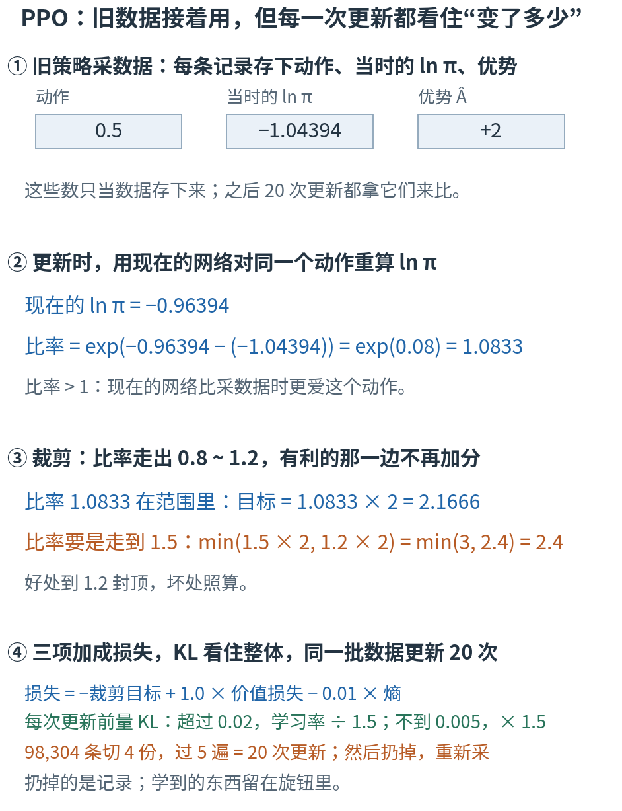
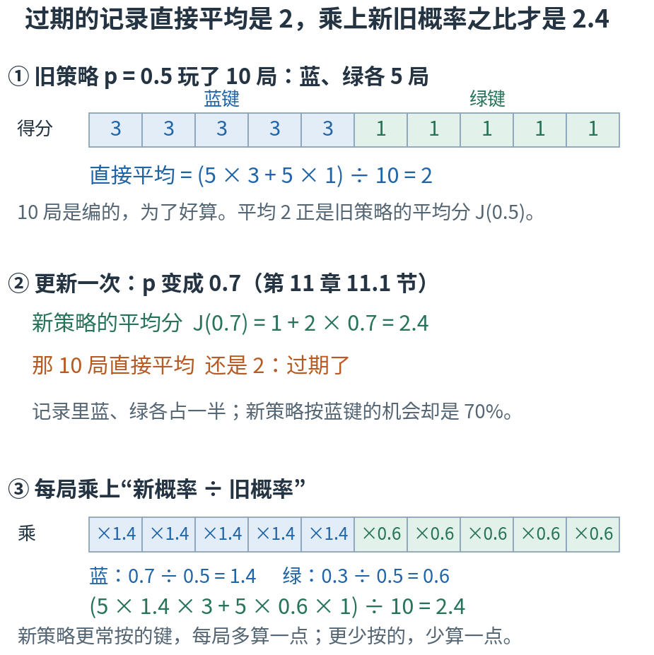
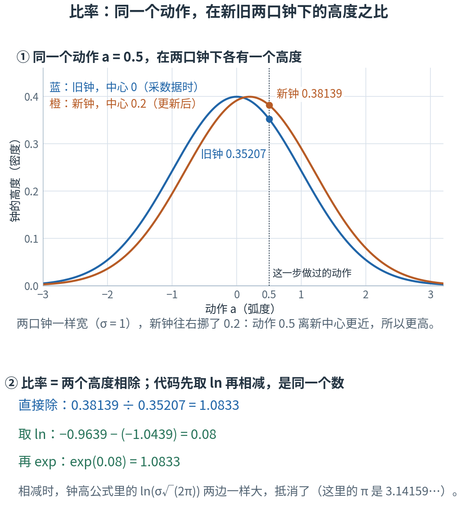
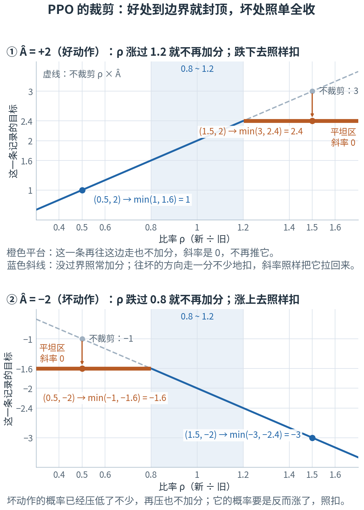
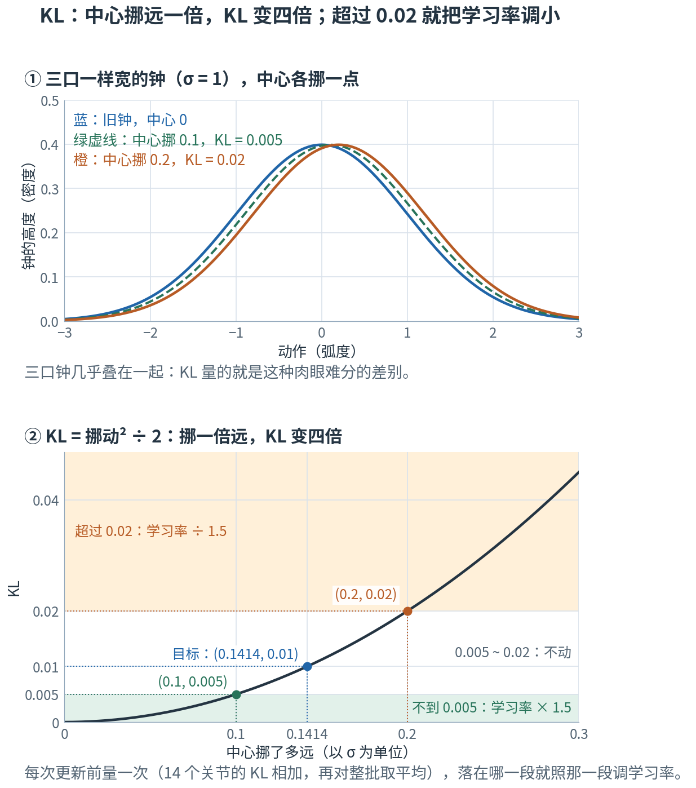

# 第 13 章 · PPO：旧数据接着用，但每一次更新都别改太多

> **上一章我们有了什么**：优势 Â。第 12 章用 GAE 把一串 δ 从后往前串起来，整批归一化之后交给 actor；第 11 章的策略梯度拿它当"推一把"的力度：比平均好的动作，概率往上推；比平均差的，往下推。
>
> **这一章要补什么**：第 11 章 11.5 节的 REINFORCE 每批数据只用一次：抽一批、拧一次旋钮、扔掉。项目却把一次采来的 98,304 条记录切 4 份、用 5 遍，一共更新 20 次（第 7 章 7.6 节）。
> 从第二次更新起，策略已经被改过了，记录却还是改之前的策略采的——数据"过期"了。硬拿来用，一次更新可能改得太猛，策略直接学坏；学坏了，下一批数据也是学坏的策略采的，很难救回来。
> PPO 给每一次更新加了一道保险：可以变，别变太多。这一章把它拆成四样东西——比率、裁剪、三项损失、KL，每样先用小数字手算一遍。读完，你能逐行读懂 rsl_rl 里 PPO 的 `update()`。
>
> **本章新词**：同策略、重要性采样、比率、裁剪、PPO、代理目标、KL 散度、自适应学习率。
> **需要的前提**：第 4 章的钟形高度和 ln 概率（4.6、4.8 节）；第 11 章的游戏机（11.1 节）、策略梯度和熵奖励；第 12 章的 returns 和优势归一化（12.3、12.7 节）；第 7 章 7.6 节的 mini-batch 和 epoch。
> **不要求**会推导 KL 的公式——正文用到的几个 KL 都能手算。标"进阶"的折叠块可以第二遍再读。

---

## 13.0 先看地图：比一比变了多少，变多了就不再给分

**PPO 一句话：同一批旧记录可以接着用；每用一次，先算一算现在的策略比采数据时变了多少。某一条记录上变得太多，就不再为它加分；整体变得太多，下一次更新就改得轻一点。**

先想象一个厨师。上周他收回一叠顾客的评价卡：每张卡写着点了哪道菜、比平时满意还是失望。这周他照着卡片改菜单——常被夸的菜多上，常被骂的菜少上。
问题来了：改过一次之后，这叠卡还能接着用吗？卡是在上周那份菜单下填的；这周多上的菜，卡里并没有那么多。
厨师的办法有三条：这周出得更多的菜，它的卡多算一点分量；某道菜已经改得够多了，就不再因为一张卡接着猛改；整份菜单要是和上周差得太远，下回就改得轻一点。
改几轮之后，把旧卡扔掉，按新菜单再收一叠。

这一章就是把这三条写成数学，好让 4096 只机器人攒下的 98,304 条记录，安全地用上 20 次。



**读图顺序：** 从 ① 到 ④ 竖着读。图里的数现在不用算，13.2–13.6 节会逐个手算出来；"比率"是 13.2 节才给的名字，先把它读成"现在的网络比采数据时更爱这个动作几倍"。
现在只要看清次序：采数据时存下 ln π；更新时对**同一个动作**重算；两个一比，得到比率；比率走得太远，就不再加分；最后加上另外两项，再用 KL 看住整体。

| 概念 | 它在回答什么问题 | 厨师那里对应什么 | 在哪一节 |
|---|---|---|---|
| 同策略 | 数据必须来自哪个策略？ | 评价卡只说得出上周那份菜单 | 13.1 |
| 重要性采样、比率 | 旧记录怎样折算成现在的策略的？ | 这周多上的菜，它的卡多算一点 | 13.2 |
| 裁剪、PPO | 一条记录最多能让策略变多少？ | 一道菜改够了，就不再因一张卡猛改 | 13.3 |
| 代理目标 | 用旧记录算出来的"分"，和真正想要的是什么关系？ | 卡片上的分，只是真实口碑的替身 | 13.4 |
| KL 散度 | 整个策略变了多少？ | 整份菜单和上周差多远 | 13.5 |
| 自适应学习率 | 变多了、变少了，下一次更新怎么调？ | 改多了下回轻点，改少了下回重点 | 13.5 |
| 一次迭代 | 同一批数据用几次，然后怎样？ | 同一叠卡翻几遍，再换新卡 | 13.6 |

表里的名字先不背，到了各节再给。本章最容易混的四处，先贴上标签：

- **三种"裁剪"**：第 3 章 3.7 节的梯度裁剪，剪的是梯度箭头的长度；13.3 节 PPO 的裁剪，剪的是比率——一条记录最多还能为它的动作加多少分；13.4 节 critic 那边还有一道价值裁剪。名字都叫裁剪，剪的东西各不相同。
- **ρ 和 r**：本章把比率写成 ρ（希腊字母，读"柔"），r 仍然只指奖励。PPO 论文和很多资料把比率写成 $r_t(\theta)$，读别的材料时要自己换过来。
- **π_θ 和 π_old**：π_θ 是"现在的"策略，每更新一次就变一次；π_old 是"采这批数据时"的策略，这批数据用完之前一直不变——不是"上一次更新之前"的那个。
- **损失的正负号**：论文里的裁剪目标要越大越好；代码里的 `surrogate_loss` 是它的相反数，要越小越好。训练日志里它常常是个小负数，这很正常（13.4 节）。

现在觉得这些区别有点抽象很正常，读到对应小节就清楚了。

第一次读，按顺序看正文、图和手算就够了；标"进阶"的折叠块可以先跳过；代码是复核工具，不是阅读门槛。

## 13.1 数据过期：旧策略采的记录，只说得出旧策略的平均分

回到第 11 章 11.1 节的游戏机：按蓝键得 3 分，按绿键得 1 分；策略只有一个旋钮 p，以概率 p 按蓝键。平均分 J(p) = 1 + 2p。

p = 0.5 时玩了 10 局（数是教学构造的）：蓝 5 局、绿 5 局。直接平均：

$$\frac{5 × 3 + 5 × 1}{10} = 2$$

正好是 J(0.5) = 2。这 10 局是好记录：它们就是按 p = 0.5 玩出来的。

第 11 章 11.1 节顺着斜率更新了一次：p 从 0.5 变成 0.7，新策略的平均分 J(0.7) = 1 + 2 × 0.7 = 2.4。
现在想接着用这 10 局，看看新策略怎么样、下一次该往哪拧。直接平均——还是 2。
记录没有变：里面仍是蓝、绿各半；可新策略按蓝键的机会已经是 70%。**这 10 局只说得出旧策略的平均分。**

这不是运气问题。实验第 1 节让 p = 0.5 的旧策略再玩 10 万局，直接平均是 2.0020，仍在 2 附近，离 2.4 差得远：多抽也没用。记录是哪个策略玩出来的，平均出来的就是哪个策略。

梯度也一样。第 11 章 11.2 节的策略梯度，就是"对记录取平均"；那里的 $\mathbb{E}_{a\sim\pi_\theta}[\cdots]$，下标写着动作要按**现在的** π_θ 抽（第 11 章 11.2 节的符号表）。
旧策略抽的记录不满足这一条，平均出来的就是旧策略的梯度，不是现在的。

<details>
<summary>进阶：梯度会估错多少（现在可跳过）</summary>

按第 11 章 11.2 节，p = 0.7 时每局记"ln 概率对 p 的导数 × 分数"：按蓝键记 3 ÷ 0.7 = 4.2857，按绿键记 −1 ÷ 0.3 = −3.3333。
新策略自己玩，70% 是蓝：0.7 × 4.2857 + 0.3 × (−3.3333) = 3 − 1 = 2，正是 J(p) = 1 + 2p 的斜率。
拿旧的 10 局（蓝、绿各半）直接平均：(4.2857 − 3.3333) ÷ 2 = 0.4762——方向没错，大小却只有 2 的四分之一不到。13.2 节的折叠块会把它修回 2。

</details>

像 REINFORCE 这样，要求数据必须由**现在的**策略采出来的算法，叫**同策略**（on-policy）算法。
第 11 章 11.5 节的 REINFORCE 严格做到了：抽一批、拧一次旋钮、扔掉，下一批用新策略重抽。代价是浪费：项目的一批，是 4096 只机器人各走 24 步攒下的 98,304 条记录，只拧一次就扔，第 7 章 7.6 节已经说过"太浪费"。

> ⚠️ **同策略不等于"每条记录只能用一次"。** 它要的是：数据要来自**和现在一样的**策略。PPO 仍然只用这一次迭代刚采的数据，只是要用 20 次；
> 它的办法是一边用、一边把策略拉住，别让它离采数据时的那个太远，数据就一直"差不多新鲜"。下面三节讲怎么拉。

> **停一下，自测**：如果更新一次后 p 变成了 0.9，那 10 局直接平均是多少？新策略的平均分是多少？差了多少？和 p = 0.7 时比，差得更多还是更少？
> <details><summary>答案</summary>
>
> 直接平均还是 2（记录没变）；J(0.9) = 1 + 2 × 0.9 = 2.8，差 0.8。p = 0.7 时只差 2.4 − 2 = 0.4。策略离采数据时越远，旧记录差得越多。
>
> </details>

## 13.2 比率：每条记录乘上"新概率 ÷ 旧概率"

先看一个生活里的做法。报社想知道全市居民平均每天通勤多久，可问卷只在地铁站发了：收回的答卷里，坐地铁的人占一半，而全市人口里坐地铁的只占四分之一。
不用重发问卷。给每份答卷一个"分量"：地铁族在全市占 1/4、在答卷里占 1/2，每份算 (1/4) ÷ (1/2) = 0.5 份；其余的人在全市占 3/4、在答卷里占 1/2，每份算 (3/4) ÷ (1/2) = 1.5 份。
**分量 = 在想要的人群里占多少 ÷ 在手上的答卷里占多少。** 占少了的多算，占多了的少算，答卷的比例就被扳回全市的比例。

游戏机照做。想要的是新策略（p = 0.7）的平均，手上是旧策略（p = 0.5）的记录：

- 蓝局：新策略按蓝的概率 0.7，旧策略 0.5，分量 0.7 ÷ 0.5 = **1.4**。
- 绿局：0.3 ÷ 0.5 = **0.6**。

每局的分数乘上自己的分量，再平均：

$$\frac{5 × 1.4 × 3 + 5 × 0.6 × 1}{10} = \frac{21 + 3}{10} = 2.4$$

正好是新策略的平均分 J(0.7) = 2.4，一局也没重玩。实验第 2 节还拿 10 万局旧记录加权平均，得 2.4035，也落在 2.4 附近。



**这样读图：** ① 旧策略的 10 局，蓝格 3 分、绿格 1 分，直接平均 2。② 策略更新以后，新策略的平均分是 2.4，那 10 局直接平均却还是 2——这就是 13.1 节的"过期"。
③ 每格乘上自己的分量：蓝格 ×1.4、绿格 ×0.6；乘完再平均，得 2.4。

用"另一个策略抽出来的样本，每个乘上分量，来估这个策略的平均"，这种做法叫**重要性采样**（importance sampling）。那个分量叫**比率**（ratio），本书写作 ρ：

$$\rho = \frac{\pi_\theta(a\mid s)}{\pi_{\text{old}}(a\mid s)}$$

| 符号 | 怎么读 | 就是 |
|---|---|---|
| $\rho$ | "柔" | 比率：现在的策略给这个动作的概率，是采数据时的几倍。代码里叫 `ratio` |
| $\pi_\theta(a\mid s)$ | "派西塔" | 现在的策略（旋钮是 θ）在观测 s 下做动作 a 的概率（第 9 章 9.4 节的 π_θ） |
| $\pi_{\text{old}}(a\mid s)$ | "派 old" | 采这批数据时的策略，给同一个动作的概率。这批数据用完之前，它一直不变 |

ρ > 1：现在的策略比采数据时更爱这个动作；ρ < 1：更不爱；ρ = 1：没变。游戏机里蓝局的 ρ = 1.4，绿局的 ρ = 0.6。

> ⚠️ **ρ 不是奖励。** PPO 论文把比率写成 $r_t(\theta)$，和第 9–12 章的奖励 r 撞了字母。本书用 ρ，r 只留给奖励。

有了比率，"新策略的平均"就能用旧记录算：把每条记录要平均的那个数乘上它的 ρ，再平均。为什么这样就对，进阶折叠里有一行推导。

<details>
<summary>进阶：重要性采样的一行推导；13.1 节估错的梯度也能修回来（现在可跳过）</summary>

$$\mathbb{E}_{a\sim\pi_\theta}[f(a)] = \sum_a \pi_\theta(a)\, f(a) = \sum_a \pi_{\text{old}}(a)\,\frac{\pi_\theta(a)}{\pi_{\text{old}}(a)}\, f(a) = \mathbb{E}_{a\sim\pi_{\text{old}}}\big[\rho\, f(a)\big]$$

f(a) 是"每条记录要平均的那个数"（游戏机里是分数）。第一个等号是期望的定义（第 4 章 4.3 节：按概率加权求和）；第二个等号乘一个 π_old 再除一个 π_old，等于没乘；第三个等号把 π_old 当成权重，读回成"按旧策略抽"的期望——右边就是"按旧策略抽，每条再乘 ρ"。
要求只有一个：新策略可能做的动作，旧策略也得有机会做（π_old > 0），不然就是除以 0。
把 f 换成优势 Â，就是 13.3 节的起点：用旧记录估"现在的策略比平均好多少"，就是 ρ × Â 的平均。

13.1 节折叠块里估错的梯度也能修回来：蓝局的 4.2857 乘分量 1.4，得 6.0000；绿局的 −3.3333 乘 0.6，得 −2.0000；平均 (6 − 2) ÷ 2 = 2，回到真值。
6 和 −2 眼熟吗？正是第 11 章 11.2 节 p = 0.5 时每局记的数。

</details>

**连续动作：两口钟的高度之比。** 机器人的动作是连续的数，没有"按蓝键的概率"这种东西，只有钟的高度（第 4 章 4.2 节：高度是密度，不是概率）。
比率就换成：**同一个动作，在现在的钟下有多高、在采数据时的钟下有多高，两个高度相除。**
第 4 章 4.8 节说过，拿同一个动作附近一样宽的一小段来比，宽度在相除时约掉了，所以高度之比就是概率之比。

手算一个。一个关节，钟的宽度 σ = 1；采数据时钟的中心在 0，更新后挪到了 0.2；这一步当时做过的动作是 a = 0.5。钟的高度用第 4 章 4.6 节那条公式：

$$\text{高度} = \frac{1}{\sigma\sqrt{2\pi}}\,\exp\!\left(-\frac{(a-\mu)^2}{2\sigma^2}\right)$$

- 旧钟（μ = 0）：(0.5 − 0)² = 0.25，高度 = exp(−0.125) ÷ √(2π) = **0.35207**。
- 新钟（μ = 0.2）：(0.5 − 0.2)² = 0.09，高度 = exp(−0.045) ÷ √(2π) = **0.38139**。
- 比率 ρ = 0.38139 ÷ 0.35207 = **1.0833**。

浏览器控制台里敲 `Math.exp(-0.125) / Math.sqrt(2 * Math.PI)`，就能核对第一个高度。
这一节里有两个 π：高度公式 √(2π) 里的是圆周率 3.14159…，ρ 的式子里的 π_θ(a∣s) 是策略——第 4 章 4.6 节提醒过，它们会在这一章同页出现。



**这样读图：** ① 蓝钟是采数据时的，橙钟是更新后的，一样宽，橙钟往右挪了 0.2。沿虚线看动作 0.5：橙点比蓝点高，所以 ρ > 1——现在的策略更爱这个动作。
② 同一个数有两条路：直接相除；或者先取 ln、相减、再过 exp。

**代码走的是第二条路。** 采数据时，rsl_rl 把每个动作的 ln π 存了下来（第 11 章的映射块）；更新时，用现在的网络对同一个动作重算 ln π，两个相减，再过 exp。
为什么要绕一下，第 4 章 4.8 节说过：14 个关节的密度相乘，会小到下溢；取了 ln，乘法变加法，除法变减法。手算：

- ln 0.35207 = −1.04394，ln 0.38139 = −0.96394；
- 相减：−0.96394 − (−1.04394) = 0.08；
- exp(0.08) = 1.0833（`Math.exp(0.08)`），和直接相除一样。

0.08 还有更快的算法：两口钟一样宽，高度公式前面那个 $\frac{1}{\sigma\sqrt{2\pi}}$ 两边一样，取 ln 相减时抵消了，只剩指数里的部分：(0.25 − 0.09) ÷ 2 = 0.08。

项目的动作有 14 个关节，ln π 是 14 个关节的 ln 密度相加（第 4 章 4.8 节），所以比率 = exp(14 个差之和) = 14 个关节各自比率的**乘积**。
每个关节只变一点点，乘起来就不小：14 个关节的比率都是 1.02，合起来是 1.02¹⁴ = 1.3195（`Math.pow(1.02, 14)`）。第 4 章 4.8 节那个"14 个中心各朝动作挪 10%"的例子，比率到了 3.24。

第一次更新之前，旋钮还没动过，新旧 ln π 相等，比率是 exp(0) = 1。第 11 章的映射块核对过：这一刻"−Â × 比率"的梯度，和第 11 章的 −Â × ln π 一模一样，就是 REINFORCE。
从第二次更新起，比率才偏离 1，开始干活。（项目里严格说还差一点点：输入归一化器在采数据时也在挪，13.5 节的最后一个折叠块会讲。）

> **停一下，自测**：① 游戏机更新到了 p = 0.9。蓝局、绿局的比率各是多少？用那 10 局加权平均，得多少？和 J(0.9) 对得上吗？
> ② 一条记录存下的 ln π 是 −1，现在的网络重算得 −0.8，比率是多少？如果重算得 −1.4 呢？哪一个是"更爱"？
> <details><summary>答案</summary>
>
> ① 蓝 0.9 ÷ 0.5 = 1.8，绿 0.1 ÷ 0.5 = 0.2；(5 × 1.8 × 3 + 5 × 0.2 × 1) ÷ 10 = (27 + 1) ÷ 10 = 2.8，正是 J(0.9) = 2.8。
> ② exp(−0.8 − (−1)) = exp(0.2) = 1.2214，更爱；exp(−1.4 − (−1)) = exp(−0.4) = 0.6703，更不爱。浏览器里 `Math.exp(0.2)`、`Math.exp(-0.4)` 可以核对。
>
> </details>

## 13.3 裁剪：好处到 1.2 封顶，坏处照单全收

有了比率，旧记录就能替现在的策略打分。每条记录的分是 ρ × Â：Â 是第 12 章 12.7 节归一化之后的优势（Â = 2 就是"比这一批的平均好 2 个标准差"）。
把所有记录的 ρ × Â 平均起来，就是用旧记录估的"现在的策略比平均好多少"。第 11 章的做法，是顺着梯度让它变大。

**问题是它没有刹车。** 拿 13.2 节那条记录，设它的 Â = +2（好动作）。要让 ρ × Â 变大，就要让 ρ 变大：把钟的中心挪到 0.5，再把钟收窄到 σ = 0.1。
第 4 章 4.8 节的 ⚠️ 算过，σ = 0.1 的钟中心高 3.989，于是

$$\rho = 3.989 \div 0.35207 = 11.33, \qquad \rho × \hat A = 11.33 × 2 = 22.66$$

比原来的 2 涨了十倍多。可这只是把全部赌注押在一条旧记录上：新策略几乎只会做 0.5 这一个动作，别的都不试了；而"它好"这个判断，只来自一条记录——13.1 节说过，策略离采数据时越远，旧记录越说不准。
98,304 条记录里，这样的"捷径"数不过来，优化器会一条条找出来，一次迭代就把策略推得面目全非。

PPO 的办法，是给每条记录装一个限位：**比率只在 0.8 到 1.2 之间算数；往有利的方向走过了界，就不再加分。**（改的只是这条记录在损失里的分，环境给的奖励一分没动。）

四种情况逐格手算。每一格做两件事：先把 ρ 夹进 [0.8, 1.2]——小于 0.8 算 0.8，大于 1.2 算 1.2，中间的原样，这就叫**裁剪**（clipping）；再把裁剪过的和没裁剪的两个结果比一比，取小的。（下面四格里的 0.5、1.5 都是比率 ρ，别和上面那个动作 0.5 搞混。）

**好动作（Â = +2）：**

1. ρ = 1.5：现在的策略更爱它了，而且爱过了头。不裁剪 1.5 × 2 = 3；裁剪：1.5 夹成 1.2，1.2 × 2 = 2.4。取小的：min(3, 2.4) = **2.4**。ρ 再涨到 1.6，还是 2.4——**这条记录不再奖励继续变**。
2. ρ = 0.5：好动作反而更少做了。不裁剪 0.5 × 2 = 1；裁剪：0.5 夹成 0.8，0.8 × 2 = 1.6。取小的：min(1, 1.6) = **1**——取到的是不裁剪的那个：分数跟着 ρ 一起掉，梯度照样把它拉回来。

**坏动作（Â = −2）：**

3. ρ = 0.5：坏动作已经大幅减少了。不裁剪 0.5 × (−2) = −1；裁剪 0.8 × (−2) = −1.6。取小的：min(−1, −1.6) = **−1.6**——封顶：再减少也不加分。
4. ρ = 1.5：坏动作反而更多了。不裁剪 1.5 × (−2) = −3；裁剪 1.2 × (−2) = −2.4。取小的：min(−3, −2.4) = **−3**——照扣，梯度照样把它压回去。

四格的规律：两个里取小的，**好处打折封顶，坏处一分不少**。封顶只发生在"往有利方向走过了界"时；往不利方向走，永远按原价算，好让策略纠正回来。

> ⚠️ **−3 比 −2.4 小。** 负数比大小看数轴：−3 在 −2.4 的左边。第 4 格要是当成"−2.4 更小"取了它，坏动作多做了也只罚到 −2.4 封顶——想保护的方向就全反了。



**这样读图：** 横轴是比率 ρ，浅蓝竖条是 0.8 到 1.2；灰虚线是不裁剪的 ρ × Â，蓝线是两者取小之后的结果。
① Â = +2：ρ 过了 1.2，蓝线变成水平的橙色平台——ρ 从 1.5 往上怎么涨都是 2.4；灰点 3 被箭头压到 2.4，就是第 1 格。ρ 往左走，蓝线跟着斜线一起下降，第 2 格的 1 就在这条线上。
② Â = −2 左右镜像：平台在 0.8 的左边（第 3 格 −1.6），右边的斜线一直往下（第 4 格 −3）。

图里橙色的水平段叫**平坦区**：在那里，这条记录的分不随 ρ 变，斜率是 0。
斜率就是"ρ 挪一点，这条记录的分变多少"；按链式法则（第 1 章 1.7 节）再乘上"旋钮动一点，ρ 变多少"，就是这条记录对旋钮的推力。斜率是 0，这条记录就不再推。
其余地方斜率等于 Â：Â = 2 时，ρ 挪 0.01，分变 0.02。实验第 3 节把四格的斜率用"缩 h"和 torch 各量了一遍：平坦区是 0，其余是 ±2。

这套"夹住、再和不裁剪的取小"写成一条式子，一小批记录每条算一个，再平均：

$$L^{\text{CLIP}} = \operatorname{mean}\Big[\min\big(\rho\,\hat A,\ \operatorname{clip}(\rho,\ 0.8,\ 1.2)\,\hat A\big)\Big]$$

| 符号 | 怎么读 | 就是 |
|---|---|---|
| $\rho\,\hat A$ | "柔乘 A 帽" | 不裁剪：比率乘优势 |
| $\operatorname{clip}(\rho, 0.8, 1.2)$ | "把柔夹在 0.8 到 1.2" | 小于 0.8 取 0.8，大于 1.2 取 1.2，中间原样。1.2 − 1 = 0.2，代码里叫 `clip_param` |
| $\min(\cdot,\cdot)$ | "取较小的" | 好处封顶，坏处照算 |
| $\operatorname{mean}[\cdots]$ | "取平均" | 一小批里的每条记录各算一个，再平均 |
| $L^{\text{CLIP}}$ | "L clip" | 裁剪目标：要让它**变大** |

夹的是比率本身，不是 ln π 之差：13.2 节自测里 ln π 差 0.2 的那条记录，ρ = exp(0.2) = 1.2214，已经出了 1.2。
PPO 论文里写作 $\min\big(r_t\hat A_t,\ \text{clip}(r_t, 1-\epsilon, 1+\epsilon)\,\hat A_t\big)$：$r_t$ 就是本书的 ρ，ε 就是 0.2（和第 4 章 4.7 节那个噪声 ε 只是撞了字母，本书不用它）。

写成 JS，夹住就是 `Math.min(Math.max(…))`：

```js
const clip = (x, lo, hi) => Math.min(Math.max(x, lo), hi);                  // 先抬到 lo 以上，再压到 hi 以下
const objective = (rho, adv) => Math.min(rho * adv, clip(rho, 0.8, 1.2) * adv);   // 两个里取小的
objective(1.5, 2);    // 2.4   好处封顶
objective(0.5, -2);   // -1.6  封顶
objective(1.5, -2);   // -3    坏处照算
```

这一套"比率 + 裁剪"，就是 **PPO**（Proximal Policy Optimization，近端策略优化）的核心。"近端"说的正是：只在采数据时那个策略的附近优化，走远了的部分不算数。

> ⚠️ **PPO 的裁剪不是梯度裁剪。** 第 3 章 3.7 节的梯度裁剪，剪的是交给优化器的整根梯度箭头的长度（项目里上限 1.0）；这里剪的是每条记录的比率，也就是某些记录对损失的贡献。
> 项目两样都用：先按本节的式子算损失、求梯度，再把梯度箭头按第 3 章 3.7 节剪短（📍 里能看到这两处）。

一大批记录里，有多少落在平坦区？实验第 3 节造了 10,000 条假记录：新旧 ln π 之差的标准差取 0.15（这个 0.15 是为了演示挑的，不是项目里的实测值）、Â 正负各半，结果 9.0% 落在平坦区。
平坦区比例要是高，说明策略这一次迭代变得比较多，该去看看 13.5 节的 KL 和学习率；低也未必是好事，可能只是更新得很保守。rsl_rl 的训练日志不记这个数。

<details>
<summary>进阶：这一条不推了，不等于它的比率不再变（现在可跳过）</summary>

平坦区只说明"**这一条记录**不再推"。旋钮是所有记录共用的，别的记录照样可以推着它走。

最小的例子：两条记录共用一个旋钮——钟的中心 μ（σ = 1 不动，采数据时 μ = 0）。记录 1 的动作是 2.0，记录 2 的动作是 0.3，优势都是 +1。
照 13.2 节的算法，中心挪到 μ 时，动作 a 的 ln 比率是 [a² − (a − μ)²] ÷ 2。

- μ 从 0 往右挪。挪到 0.093 左右，记录 1 的比率就到了 1.2，进了平坦区，不再推。
- 记录 2 的比率最大也只有 exp(0.3² ÷ 2) = exp(0.045) = 1.046（中心正好挪到 0.3 时），永远到不了 1.2；它一直想把中心拉向 0.3。于是 μ 继续往右，停在 0.3。
- 这时记录 1 的真实比率：[2² − (2 − 0.3)²] ÷ 2 = (4 − 2.89) ÷ 2 = 0.555，exp(0.555) = **1.742**（`Math.exp(0.555)`），远远超过 1.2。

实验第 3 节用 torch 真的更新了 400 次：μ 停在 0.300，记录 1 的比率 1.742。
项目里还有两个来源：熵那一项（13.4 节）也在改钟的宽度；Adam 带着以前梯度的滑动平均（第 7 章 7.5 节），这一次的梯度即使是 0，旋钮也还会顺着惯性走。
所以裁剪去掉的是"继续推它"的**动机**，不是给真实的比率加了一道**硬边界**。OpenAI 的 [Spinning Up 对 PPO 的说明](https://spinningup.openai.com/en/latest/algorithms/ppo.html) 也特别强调了这一点。

</details>

> **停一下，自测**：Â = −1，ρ = 1.4。这条记录的分是多少？在不在平坦区？
> <details><summary>答案</summary>
>
> 不裁剪 1.4 × (−1) = −1.4；裁剪 1.2 × (−1) = −1.2；取小的 min(−1.4, −1.2) = −1.4。不在平坦区，斜率是 −1：坏动作反而更多了，照扣，梯度会把它压回去。
>
> </details>

## 13.4 完整的损失：−裁剪目标 + 价值损失 − 熵

**先把方向翻过来。** torch 的优化器只会让损失变小（第 3 章 3.4 节的梯度下降）。$L^{\text{CLIP}}$ 要变大，就取个负号当损失——第 11 章 11.5 节 ⚠️ 里的那个负号。把 13.3 节的四格当成一小批，手算一次：

- 裁剪目标的平均：(2.4 + 1 − 1.6 − 3) ÷ 4 = −1.2 ÷ 4 = −0.3；
- 进损失的这一项：取负号，0.3。

代码是先取负号、再比大小。取了负号，"取小的"就变成"取大的"：对任意两个数 u、v，−min(u, v) = max(−u, −v)。比如第 1 格：max(−3, −2.4) = −2.4，正是 −min(3, 2.4)。
所以 rsl_rl 里写的是 `torch.max`，和论文里的 min 并不矛盾。实验第 4 节把两种写法并排算了一遍：一个是 −0.3，一个是 0.3。

这一项在 rsl_rl 里叫 `surrogate_loss`。$L^{\text{CLIP}}$ 在论文里叫**代理目标**（surrogate objective）："代理"是替身的意思。
真正想让它变大的，是第 9 章 9.9 节的平均回报 J；$L^{\text{CLIP}}$ 只是用旧记录算出来的替身，只在现在的策略离采数据时不远的地方才靠得住。
为什么只在附近靠得住？13.2 节的比率修的是"在记录下来的那些处境里，动作怎么选"。可策略一变，机器人会走到别的处境里去：换了步态，身体的姿态、速度都不一样了。那些处境旧记录里根本没有，比率修不到。
所以它要靠 13.3 节的裁剪和下一节的 KL 看着；它也不保证训练一定稳，只是让改得太猛不再划算。

**第二项：critic 的损失。** 第 10 章 10.5 节：critic 的损失是（估计 − 标签）²，标签是第 12 章 12.3 节的 returns = Â + V（用的是没归一化的 Â）。
PPO 给它也加了一道同样思路的保险，叫**价值裁剪**：这一次迭代里，每条记录的价值估计，最多只算它离采数据时挪了 0.2；挪过头的部分，不再给梯度。

手算一条记录：采数据时 critic 估 V = 0.2，标签是 0.5。更新几次之后，V 可能在三个位置：

- **V = 0.55**：不裁剪 (0.55 − 0.5)² = 0.0025。裁剪：它挪了 0.35，只算 0.2，当成 0.4，(0.4 − 0.5)² = 0.01。两个取**大**的：**0.01**。用的是裁剪版，而裁剪版里的 0.4 不随 V 变——这条记录不再推 critic。
- **V = 0.35**：只挪了 0.15，没过界，两个都是 (0.35 − 0.5)² = **0.0225**，照常推。
- **V = −0.1**：往反方向跑了。不裁剪 (−0.1 − 0.5)² = 0.36；裁剪：挪了 −0.3，只算 −0.2，当成 0，(0 − 0.5)² = 0.25。取大的：**0.36**，用的是不裁剪版，照常拉回来。

和 13.3 节是同一个思路，只是这里的损失要越小越好，"悲观"就成了取**大**的：挪过头的好处不算，往坏处跑照罚。实验第 4 节还量了三种情况的斜率：0、−0.3、−1.2。

> ⚠️ **同一个 0.2，两种单位。** 13.3 节的 0.2 是比率的倍数（0.8 倍到 1.2 倍）；这里的 0.2 是价值本身的单位（最多算挪 0.2 分）。两处读的是同一个设置 `clip_param=0.2`，意思却不同。

**第三项：熵。** 第 11 章 11.6 节的熵奖励：要变大的是 c × H，进损失时取负号。项目的 c = 0.01。14 口钟一开始 σ 都是 1，熵是 14 × 1.41894 = 19.865，这一项就是 0.01 × 19.865 = 0.19865。

三项合起来：

$$\text{loss} = -L^{\text{CLIP}} + 1.0 × L^{V} - 0.01 × H$$

| 符号 | 怎么读 | 就是 |
|---|---|---|
| $-L^{\text{CLIP}}$ | "负 L clip" | 13.3 节的裁剪目标取负号。代码里叫 `surrogate_loss` |
| $L^{V}$ | "L V" | 价值损失，带价值裁剪，一小批取平均。代码里叫 `value_loss`，系数 `value_loss_coef=1.0` |
| $H$ | "熵" | 每条记录那 14 口钟的熵（第 4 章 4.9 节），一小批取平均。系数 `entropy_coef=0.01`，就是第 11 章 11.6 节的 c |

一条记录的总账。就拿第 1 格那条：ρ = 1.5、Â = 2；它的价值是上面 V = 0.55 那种情况；14 个 σ 都是 1：

$$-2.4 + 1.0 × 0.01 - 0.01 × 19.865 = -2.4 + 0.01 - 0.19865 = -2.58865$$

三项加成一个数，一次 `backward()` 就算出 actor 和 critic 全部旋钮的梯度，同一个优化器一起更新两张网络（第 3 章和第 10 章的映射块都说过）。
actor 的旋钮只受第一、三项影响，critic 的旋钮只受第二项影响。

**日志里的这一项，常常是个小负数。** 训练日志的 `Mean surrogate loss:`（wandb 里叫 `Loss/surrogate`），就是 20 次更新的 `surrogate_loss` 取平均。
第一次更新时比率几乎全是 1，它就约等于 −(Â 的平均)——而 Â 在第 12 章 12.7 节整批减过平均，所以它接近 0。**值接近 0，梯度却不是 0**：就像 f(x) = x 在 x = 0 处的值是 0，斜率却是 1。
实验第 4 节拿 8 个归一化后的 Â 验证：比率全是 1 时，surrogate_loss 是 0，每条记录的斜率却是 −Â ÷ 8，都不为 0。
之后几次更新把好动作的比率推上去、坏动作的推下来，ρ × Â 的平均变成正的，`surrogate_loss` 就成了小负数（实验里把比率往好的方向挪一点，它从 0 变成 −0.044）。
这一段是从上面的算式推出来、再用构造的小例子算一遍的：−0.044 是实验里编出来的数，不是从一次真实训练的日志里统计的。真实的日志长什么样，第 14 章（训练回路全貌）对着冒烟训练的输出一行一行看。
所以这个数的正负、大小说明不了学得好不好；判断训练，要看 KL、回合长度、奖励各项和机器人实际的动作。

> **停一下，自测**：有人读了论文，觉得"论文写的是 min"，把代码里的 `torch.max(surrogate, surrogate_clipped)` 改成了 `torch.min`。程序会报错吗？第 1 格和第 4 格会变成什么？
> <details><summary>答案</summary>
>
> 不会报错。代码里的两项已经取过负号：第 1 格是 −3 和 −2.4，min 取 −3，等于没封顶，好处又能一路涨；第 4 格是 3 和 2.4，min 取 2.4，坏动作多做了也只罚到 2.4 封顶。
> 保护的方向整个反了，训练照跑、不报任何错，只是保险装反了。
>
> </details>

## 13.5 KL 散度：整个策略变了多少；变多了，就把学习率调小

裁剪只管一条一条的记录，而且只去掉"继续推"的动机（13.3 节的折叠块：真实的比率照样可以走出去）。还需要一个总的读数：**在这一批记录上，现在的策略和采数据时的策略，差多远？**

先看一个关节、一口钟。两口钟一样宽（σ = 1），中心挪了一点——13.2 节那两口钟就是这样，中心从 0 挪到 0.2。它们差多远，有一个现成的算法，一样宽时特别简单：

- 中心挪 0.2：(1 + 0.2²) ÷ 2 − 0.5 = 0.52 − 0.5 = **0.02**；
- 中心挪 0.1：(1 + 0.1²) ÷ 2 − 0.5 = 0.505 − 0.5 = **0.005**。

挪动翻一倍，这个数翻四倍。其实它就是 (挪动 ÷ σ)² ÷ 2：0.2² ÷ 2 = 0.02，0.1² ÷ 2 = 0.005。挪动要以 σ 为单位量：同样挪 0.2，钟越窄，差得越多。
注意这里的 0.2 是"中心挪了多远"，和 13.3 节的裁剪范围 0.2 没有关系。

这个数叫 **KL 散度**（KL divergence，KL 是两位提出者 Kullback 和 Leibler 的姓），量的是两个分布差多远。两口钟完全一样时，它是 0；差得越多，它越大；它不会是负数。



**这样读图：** ① 三口钟几乎叠在一起：挪了 0.1、0.2 的钟，肉眼只看得出一点点错开。KL 量的就是这种细小的差别。
② 横轴是中心挪了多远（以 σ 为单位），曲线是 KL = 挪动² ÷ 2。沿曲线看三个点：挪 0.1 得 0.005，挪 0.2 得 0.02——横着远一倍，竖着高四倍。中间的蓝点是目标 0.01，对应挪 0.1414。三条色带是下面要讲的三段规则。

项目里的 KL，是 14 个关节的 KL 相加，再对一小批里的记录取平均。目标 0.01 有多小？
一个关节单独挪，是挪 0.1414 个 σ（0.1414² ÷ 2 ≈ 0.01）；14 个关节一起、平均地挪，每个只能挪 0.0378 个 σ（14 × 0.0378² ÷ 2 ≈ 0.01；`Math.sqrt(0.02 / 14)` 可以核对 0.0378）。
要是 14 个关节都像 13.2 节那样挪 0.2，KL 是 14 × 0.02 = 0.28，是目标的 28 倍。

<details>
<summary>进阶：KL 和 13.2 节的比率是什么关系；宽度也变时的公式；KL 为什么叫"散度"（现在可跳过）</summary>

**KL 和 13.2 节的比率，是同一件事的两种看法。** 13.2 节算的是**一个**动作的 ln 比率；把它取相反数、在旧钟下对**所有**动作取平均，就是 KL。
动作 0.5 那一条的 ln 比率是 0.08（新钟更爱它），换个动作就会变号；在旧钟下平均下来是 −0.02，取相反数正是上面手算的 0.02。
实验第 5 节从旧钟里抽 20 万个动作实测，平均是 −0.0200。

两口钟，旧的中心 $\mu_o$、宽度 $\sigma_o$，新的中心 $\mu_n$、宽度 $\sigma_n$：

$$\text{KL}(\text{旧}\,\Vert\,\text{新}) = \ln\frac{\sigma_n}{\sigma_o} + \frac{\sigma_o^2 + (\mu_o - \mu_n)^2}{2\sigma_n^2} - \frac12$$

宽度相同（$\sigma_n = \sigma_o = 1$）时，第一项 ln 1 = 0，第二项是 (1 + 挪动²) ÷ 2，就是正文的算法。
宽度也变的例子：旧钟中心 0、宽 1，新钟中心 0.3、宽 0.8：ln 0.8 + (1 + 0.09) ÷ 1.28 − 0.5 = 0.1284，和 torch 算的一样。
把新旧对调，KL(新‖旧) = 0.0881，和 0.1284 不相等——它不对称，所以叫"散度"，不叫"距离"。rsl_rl 算的是 KL(旧‖新)，旧的在前。

</details>

**KL 管学习率。** 第 3 章的映射块预告过这条规则。每做一次更新**之前**，先量一次"现在的策略"和"采数据时的策略"之间的 KL，然后：

- KL 超过目标 0.01 的 2 倍（大于 0.02）：变得太多，学习率 ÷ 1.5，但不低于 0.00001；
- KL 不到目标的一半（小于 0.005），而且大于 0：变得太少，学习率 × 1.5，但不超过 0.01；
- 在 0.005 到 0.02 之间：不动。

这叫**自适应学习率**（adaptive learning rate）：学习率不再是人定死的一个数，而是跟着 KL 自己调。配置里的 `learning_rate=1.0e-3` 只是它的起点。写成 JS：

```js
function adapt(lr, kl) {
  if (kl > 0.01 * 2) return Math.max(1e-5, lr / 1.5);             // 变太多：÷ 1.5，最低 0.00001
  if (kl < 0.01 / 2 && kl > 0) return Math.min(1e-2, lr * 1.5);    // 变太少：× 1.5，最高 0.01
  return lr;                                                       // 0.005 ~ 0.02：不动
}
```

手算一串。学习率从 0.001 开始，下表以 0.001 为单位记：

| 这次量到的 KL | 落在哪一段 | 学习率（以 0.001 为单位） |
|---|---|---|
| 0.03 | 大于 0.02 | 1 ÷ 1.5 = 2/3 ≈ 0.6667 |
| 0.025 | 大于 0.02 | 1 ÷ 1.5 ÷ 1.5 = 1 ÷ 2.25 = 4/9 ≈ 0.4444 |
| 0.012 | 中间 | 不动，4/9 |
| 0.004 | 小于 0.005 | 4/9 × 1.5 = 2/3 |
| 0.003 | 小于 0.005 | 2/3 × 1.5 = 1 |
| 0.02 | **恰好**等于 0.02 | 不动，还是 1——规则写的是"大于" |

实验第 5 节按这六个 KL 把规则跑了一遍，学习率依次是 0.00066667、0.00044444、0.00044444、0.00066667、0.001、0.001。

还有三个细节。一次迭代更新 20 次，这条规则就跑 20 次；调好的学习率会带进下一次迭代，不会回到 0.001。
KL 只是量一量，不参与求导（📍 里它包在 `torch.inference_mode()` 里）。
条件里的"而且大于 0"，防的是 KL 算出来恰好是 0 的时候——比如每次迭代的第一次更新，旋钮还没动过（严格说这时的 KL 也不一定恰好是 0，本节最后的折叠块说为什么）——这时不该放大学习率。

> ⚠️ **KL、`surrogate_loss`、平坦区比例，是三把不同的尺。** KL 量整个策略变了多少；`surrogate_loss` 每次迭代开头都接近 0，大小说明不了学得好坏（13.4 节）；平坦区比例（13.3 节）只数有多少记录被封了顶。哪一个都不能单独说明训练好不好。

> **停一下，自测**：学习率现在是 0.001。接下来三次更新量到的 KL 依次是 0.021、0.02、0.004。每次之后，学习率各是多少？
> <details><summary>答案</summary>
>
> 0.021 大于 0.02：÷ 1.5，得 0.001 × 2/3 ≈ 0.00066667。0.02 不大于 0.02，也不小于 0.005：不动。0.004 小于 0.005 且大于 0：× 1.5，回到 0.001。
>
> </details>

<details>
<summary>进阶：第一次更新时，KL 真的是 0 吗（现在可跳过）</summary>

旋钮是没动，可策略的输出还取决于输入归一化器（第 8 章）。它在采数据的 24 步里，每一步都在更新自己的平均和标准差（第 8 章 8.4 节；`rsl_rl/algorithms/ppo.py` 的 `process_env_step()` 每走一个环境步就调一次 `update_normalization()`，实验第 7 节核对）。
到了 `update()`，同一条观测归一化之后的数，已经和采数据时差了一点点，钟的中心也跟着差一点点。

实验第 5 节拿 rsl_rl 自己的网络类（带输入归一化）搭了一张 3 个输入的小网络来演示：旋钮不动，只让归一化器再见一批整体偏了 0.3 的观测，然后重算。
**下面几个数只说明"会发生什么"，不是项目的实测值**——项目那张网络有 61 个输入、14 口钟，差多少要看当时的观测。
归一化器只见过 5 批时（像训练刚开始），第一次更新的 KL 是 0.0003，比率在 0.9240 到 1.1055 之间；按规则，学习率先 × 1.5。
见过 2000 批时（像训练走了很久），比率在 0.99974 到 1.00033 之间，差别只在万分之几。中心差 0.0002 的两口钟，KL 该是 0.0002² ÷ 2 = 0.00000002；
可第 1 章 1.14 节说过，训练代码默认用 float32 存小数，能分辨的差别有限。torch 算这个 KL 时，要先把 1 和一个亿分之几的数（这里是 0.0002² = 0.00000004）加起来、再减去 1；在 float32 里这一加等于没加，KL 算出来恰好是 0，规则不动学习率。
所以第 11 章映射块里那句"比率严格说只是非常接近 1"，说的就是这件事：旋钮没动，归一化器动了。至于项目里第一次更新的 KL 会不会也被 float32 抹成 0，这个演示只说明它会发生，给不出项目的数。

</details>

## 13.6 数一数：一次迭代，98,304 条记录，更新 20 次

这些数第 5 章的映射块和第 7 章 7.6 节已经数过，这里只把 PPO 的动作挂上去：

- 4096 只机器人各走 24 步：98,304 条记录。每条存下观测、动作、当时的 ln π、当时的 V、当时那 14 口钟的中心和宽度，以及算好的 Â 和 returns。
- 切 4 份，每份 24,576 条；过 5 遍：4 × 5 = **20 次更新**。
- 每次更新：量 KL、调学习率（13.5 节）→ 算三项损失（13.3、13.4 节）→ `backward()` → 梯度裁剪（第 3 章 3.7 节）→ Adam 拧一次旋钮（第 7 章 7.5 节）。
- 20 次做完，这批记录就扔掉，用更新后的策略再走 24 步。下一次迭代的"旧策略"，就是这一次迭代最后的策略。

**每次更新，都要把旧记录重新过一遍现在的网络。** 比率要的是"现在的钟，在**当时做过的**那个动作处有多高"：

```text
存下的观测 ──现在的 actor──→ 现在的 14 口钟（中心、宽度）
存下的动作 ────────────────→ 在现在的钟下求 ln 密度 → 现在的 ln π
存下的 ln π（旧）──────────→ 两个相减、过 exp → 比率 ρ
存下的 Â ──────────────────→ 和 ρ 一起进裁剪目标
```

拿去问的是**存下的动作**，不是让现在的策略重新抽一个：奖励和 Â 属于当时做过的那个动作，换一个动作，它们就对不上号了。
13.2 节的例子就是这样算的：当时做的是 0.5，现在的钟中心在 0.2，问的是"新钟在 0.5 处多高"，得到比率 1.0833。
存下的这些数都只当数据用，反向传播不从它们往回走（第 7 章 7.6 节折叠块里的 `detach()`）；梯度只从"现在的 ln π""现在的 V"和"现在的熵"流回旋钮。

**为什么是 5 遍 × 4 份？** 第 5 章的映射块留了这个问题。

- **用不止一遍**：这批数据是 4096 只机器人实打实跑出来的，只用一次（REINFORCE）太浪费。
- **也不能用太多遍**：13.4 节说过，比率只修得了"动作怎么选"，修不了"会走到哪些处境"；策略离采数据时越远，旧记录越说不准。裁剪和 KL 把策略拉在附近，KL 被规则往 0.01 上下调，旧数据就一直"差不多新鲜"。
- **切成 4 份**：每遍更新 4 次而不是 1 次，同样的数据多更新几次；每份仍有 24,576 条，第 7 章 7.6 节说的那种"抖"很小。
- **5 和 4 这两个数**，是 rsl_rl 和 mjlab 的默认值，项目照用。它们是经验值，不是从哪个公式推出来的。

> **停一下，自测**：如果把配置改成切 8 份、过 10 遍，每份多少条？一次迭代更新几次？同一批数据被用得更狠了，13.5 节的哪一段规则会更常出手？
> <details><summary>答案</summary>
>
> 98,304 ÷ 8 = 12,288 条一份；8 × 10 = 80 次更新。同一批数据上更新得更多，策略更容易离采数据时远，KL 更容易超过 0.02，"学习率 ÷ 1.5"那一段会更常出手。
>
> </details>

## 📍 映射到项目

> 现在可以逐行读了。本章的比率、裁剪、三项损失、KL 自适应学习率，都能在下面找到对应的一行；语法看不懂没关系，看右边的中文注释。

**这段配置做什么**：定下 PPO 的几个数。它在 `src/mjlab_microduck/tasks/microduck_velocity_env_cfg.py` 的 `MicroduckRlCfg` 里：

```python
value_loss_coef=1.0,            # 价值损失的系数 1.0（13.4 节）
use_clipped_value_loss=True,    # 价值也带裁剪（13.4 节）
clip_param=0.2,                 # 比率夹在 0.8 ~ 1.2（13.3 节）；价值最多算挪 0.2（13.4 节）
entropy_coef=0.01,              # 熵的系数 c = 0.01（13.4 节；第 11 章 11.6 节）
num_learning_epochs=5,          # 同一批数据过 5 遍（13.6 节）
num_mini_batches=4,             # 每遍切 4 份（13.6 节）
learning_rate=1.0e-3,           # 学习率的起点 0.001（13.5 节）
schedule="adaptive",            # 学习率跟着 KL 自动调（13.5 节）
...                             # （中间省略 γ、λ 两行，第 12 章讲过）
desired_kl=0.01,                # KL 的目标 0.01（13.5 节）
max_grad_norm=1.0,              # 梯度裁剪的上限（第 3 章 3.7 节）——不是本章的裁剪
```

**这段代码做什么**：下面是 `rsl_rl/algorithms/ppo.py` 的 `update()`，按执行的先后摘出来。外层循环 20 圈，每圈一份记录：先用现在的网络重算，再量 KL、调学习率，然后算比率、裁剪目标、价值损失、总损失，最后反向传播、裁梯度、拧旋钮：

```python
generator = self.storage.mini_batch_generator(self.num_mini_batches, self.num_learning_epochs)   # 发牌：切 4 份、过 5 遍（13.6 节）
for batch in generator:                                                  # 20 圈，每圈一份 24,576 条（13.6 节）
    ...
    actions_log_prob = self.actor.get_output_log_prob(batch.actions)     # 现在的钟，在存下的动作处的 ln π（13.2、13.6 节）
    values = self.critic(batch.observations, masks=batch.masks, hidden_state=batch.hidden_states[1])   # 现在的 critic 重估 V（13.4 节）
    ...
    entropy = self.actor.output_entropy[:original_batch_size]            # 现在这几口钟的熵（13.4 节）
    if self.desired_kl is not None and self.schedule == "adaptive":      # 项目：目标 0.01、自适应（13.5 节）
        with torch.inference_mode():                                     # 只量一量，不求导
            kl = self.actor.get_kl_divergence(batch.old_distribution_params, distribution_params)   # 每条记录：KL(旧‖新)，14 个关节相加（13.5 节）
            kl_mean = torch.mean(kl)                                     # 对这一份取平均
            ...
            if self.gpu_global_rank == 0:                                # 多卡时只在主进程上调；单卡训练就是它
                if kl_mean > self.desired_kl * 2.0:                      # 超过 0.02：变太多
                    self.learning_rate = max(1e-5, self.learning_rate / 1.5)     # ÷ 1.5，最低 0.00001
                elif kl_mean < self.desired_kl / 2.0 and kl_mean > 0.0:  # 不到 0.005 且大于 0：变太少
                    self.learning_rate = min(1e-2, self.learning_rate * 1.5)     # × 1.5，最高 0.01
            ...
            for param_group in self.optimizer.param_groups:              # 新的学习率交给优化器
                param_group["lr"] = self.learning_rate                   # 这一次更新马上就用它
    ratio = torch.exp(actions_log_prob - torch.squeeze(batch.old_actions_log_prob))   # ρ = exp(现在的 ln π − 存下的 ln π)（13.2 节）
    surrogate = -torch.squeeze(batch.advantages) * ratio                 # −ρ × Â：先取负号（13.4 节）
    surrogate_clipped = -torch.squeeze(batch.advantages) * torch.clamp(  # −clip(ρ, 0.8, 1.2) × Â（13.3 节）
        ratio, 1.0 - self.clip_param, 1.0 + self.clip_param              # clamp 就是夹住：1 − 0.2 到 1 + 0.2
    )
    surrogate_loss = torch.max(surrogate, surrogate_clipped).mean()      # 取过负号，min 变 max；再取平均（13.4 节）
    if self.use_clipped_value_loss:                                      # 项目：True（13.4 节）
        value_clipped = batch.values + (values - batch.values).clamp(-self.clip_param, self.clip_param)   # V 最多算挪 ±0.2（13.4 节）
        value_losses = (values - batch.returns).pow(2)                   # 不裁剪：(V − 标签)²
        value_losses_clipped = (value_clipped - batch.returns).pow(2)    # 裁剪版：(挪动封顶后的 V − 标签)²
        value_loss = torch.max(value_losses, value_losses_clipped).mean()    # 取大的，再平均（13.4 节）
    ...
    loss = surrogate_loss + self.value_loss_coef * value_loss - self.entropy_coef * entropy.mean()   # 三项合一（13.4 节）
    ...
    self.optimizer.zero_grad()                                           # 清掉上一次的梯度（第 7 章 7.7 节）
    loss.backward()                                                      # 一次反向传播，两张网络的梯度都有了
    ...
    nn.utils.clip_grad_norm_(self.actor.parameters(), self.max_grad_norm)    # 梯度裁剪（第 3 章 3.7 节）——不是本章的裁剪
    nn.utils.clip_grad_norm_(self.critic.parameters(), self.max_grad_norm)   # critic 也单独裁一次
    self.optimizer.step()                                                # Adam 拧一次旋钮（第 7 章 7.5 节）
```

三个细节。

第一，**顺序**。量 KL、调学习率，发生在算这一份的损失**之前**：量的是"这次迭代前面几次更新，已经把策略推离采数据时多远"，调好的学习率马上用在这一次更新上。每次迭代的第一份，旋钮还没动，KL 接近 0（13.5 节的折叠块说了"接近"是多近）。

第二，**正负号和数据**。`surrogate`、`surrogate_clipped` 都先乘了 −Â，所以取 max；`entropy` 前面是减号：熵越大，损失越小（第 11 章 11.6 节）。
`batch.advantages` 是第 12 章 12.7 节归一化过的 Â；`batch.returns`、`batch.values`、`batch.old_actions_log_prob` 是采数据时存下的标签、旧 V 和旧 ln π，都只当数据用。

第三，**省略号里跳过的**。开头第一个 `...` 里有一次 `self.actor(...)` 调用：用现在的 actor 把这一份观测过一遍，搭好现在的钟，下一行才能在钟上查 ln π。紧跟 `values` 那一行的 `...` 里还有一行，把现在这几口钟的中心和宽度取出来，存成下面量 KL 时用的 `distribution_params`。
其余的 `...` 是多卡同步、对称增强（项目的 velocity 任务没开：`ENABLE_SYMMETRY = False`）和 RND（没配置）这几段，项目训练时不执行。

实验第 7 节会核对：上面引用的配置和代码行在你机器上原样存在，装的是 rsl_rl 5.0.1。它还把 `update()` 里从 `ratio` 到 `loss` 那几行**原样**拿出来，喂本章的小例子：四格的 `surrogate_loss` 是 0.3，三种 V 的价值损失是 0.01、0.0225、0.36，一条记录的总账是 −2.58865；再拿 KL 那四行把 13.5 节的六次 KL 跑一遍，学习率和手算的一样。
正文还用到四处没贴代码的事实，也一并核对：采数据时每走一个环境步就更新一次输入归一化器，在 `ppo.py` 的 `process_env_step()` 里（13.5 节最后那个折叠块）；KL 在 `rsl_rl/modules/distribution.py` 里算、14 个关节相加；每份的条数在 `rsl_rl/storage/rollout_storage.py` 里是"总条数 // 份数"；日志名 `Mean surrogate loss:` 和 `Loss/surrogate` 来自 `rsl_rl/utils/logger.py`。

## 🧪 动手实验

```bash
uv run python docs/learn-zh/labs/ch13_ppo_clip.py
```

1. 数据过期：游戏机的 10 局直接平均 2，新策略 J(0.7) = 2.4；旧策略再玩 10 万局，平均 2.0020；自测的 2.8 和差距 0.8、0.4；进阶折叠里估错的梯度 0.4762。
2. 比率：问卷的 0.5 份和 1.5 份；分量 1.4 和 0.6 修回 2.4（10 万局加权 2.4035）；进阶折叠里修回来的 6 和 −2；两口钟的高度 0.35207、0.38139，比率 1.0833，ln 之差 0.08，和 torch 的 `log_prob` 对照；自测的 2.8、1.2214、0.6703；1.02¹⁴ = 1.3195；画 `ch13_stale_data.png` 和 `ch13_ratio_density.png`。
3. 裁剪：没有刹车时的 11.33 和 22.66；四格的值与斜率（缩 h 和 torch）；自测的 −1.4；10,000 条假记录里 9.0% 在平坦区；进阶折叠里两条记录共用一个旋钮，比率走到 1.742；画 `ch13_ppo_clip.png`。
4. 完整的损失：四格当一小批的 −0.3 和 0.3；价值裁剪的三种情况（0.01、0.0225、0.36）和斜率；熵 19.865 和 0.19865；一条记录的总账 −2.58865；归一化的 Â 让 `surrogate_loss` 为 0、斜率不为 0，挪一点后变成 −0.044。
5. KL：0.02、0.005 和"翻四倍"；目标 0.01 对应的 0.1414 和 0.0378；14 个关节的 0.28；进阶折叠的 ln 比率平均 −0.0200、0.1284 和 0.0881；学习率的六次调整、上下限和自测；用 rsl_rl 的网络类演示归一化器带来的一点点 KL；画 `ch13_kl_shift.png`。
6. 数一数：98,304、24,576、20，自测的 12,288 和 80；画 13.0 节的总览图 `ch13_overview.png`。
7. 映射到项目：核对 📍 里引用的配置和源码行；把 `update()` 的原行拿来算本章的小例子。

**改一改**（每条都先写下你的预测，再运行。要改的三行在脚本里都标着 `# TWEAK-1` / `TWEAK-2` / `TWEAK-3`。
改动之后，锁正文数字的检查会从 ✓ 变成 ✗，脚本照常跑完，最后提示"N 项没对上"——这是预期的；有 ✗ 时新画的图不会覆盖教材里的图，而是存到脚本提示的临时目录。
试完记得改回去再跑一遍）：

- 把第 1 节的 `P_NEW` 从 0.7 改成 0.3（策略往反方向更新了）。先手算：蓝局、绿局的比率各变成多少？10 局加权平均是多少，和 J(0.3) 对得上吗？直接平均还是 2 吗？再运行，看第 1、2 节的表和新画的图。
- 把第 3 节的 `CLIP` 从 0.2 改成 0.1（裁剪范围变成 0.9 ~ 1.1）。先预测：四格的结果各变成多少？哪几格会变、哪几格不变？落在平坦区的记录会变多还是变少？再运行，看第 3 节的表。
- 把第 5 节的 `SHIFT` 从 0.2 改成 0.4。先用"挪一倍远，KL 变四倍"预测：KL 变成多少？按 13.5 节的规则，学习率该怎么调？再运行，看第 5 节的表和新画的图。

本章的四格（2.4、1、−1.6、−3）、平坦区的斜率和 KL 的 0.02，也可用 `python3 docs/learn-zh/labs/worked_examples.py` 独立复核。

## 本章小结

- **同策略**：策略梯度要的是现在的策略采的数据。策略一改，旧记录就过期：游戏机的 10 局直接平均仍是 2，新策略其实是 2.4；多抽也没用。PPO 仍然只用这一次迭代刚采的数据，但要用 20 次，所以得把策略拉在采数据时的附近。
- **重要性采样与比率** ρ = π_θ ÷ π_old：像给问卷加分量，每条记录乘"新概率 ÷ 旧概率"（1.4 和 0.6），旧记录就替新策略算出 2.4。连续动作是两口钟在同一个动作处的高度之比；代码存 ln π，相减再 exp（0.08 → 1.0833）。14 个关节的比率，是 14 个比率的乘积。
- **裁剪**：ρ 夹进 0.8 ~ 1.2，再和不裁剪的取小——好处封顶，坏处照算。四格：2.4、1、−1.6、−3；−3 比 −2.4 小。平坦区斜率为 0，那条记录不再推；但真实比率照样可能走出去（1.742）。它和第 3 章的梯度裁剪不是一回事。"比率 + 裁剪"就是 **PPO** 的核心。
- **三项损失**：loss = −$L^{\text{CLIP}}$ + 1.0 × 价值损失 − 0.01 × 熵。$L^{\text{CLIP}}$ 是**代理目标**：旧记录算出的替身，只在附近靠得住。取了负号，min 变 max。价值也带裁剪，最多算挪 0.2（单位是价值本身）。日志里的 surrogate loss 常是小负数，正常。
- **KL 散度**：两口钟差多远；一样宽时是 (挪动 ÷ σ)² ÷ 2，挪 0.2 得 0.02，挪 0.1 得 0.005。**自适应学习率**：每次更新前量 KL，大于 0.02 学习率 ÷ 1.5，小于 0.005 × 1.5，夹在 0.00001 和 0.01 之间。
- **一次迭代**：98,304 条记录，4 份 × 5 遍 = 20 次更新；每次都用现在的网络，对存下的动作重算 ln π；用完扔掉，用新策略重采。

**下一章**：零件都齐了：采数据、GAE、PPO 的 20 次更新。把它们按时间顺序串成一个循环，对照冒烟训练打印出来的日志，一行一行说清每个数从哪来——[第 14 章 · 训练回路全貌](14-训练回路全貌.md)。
