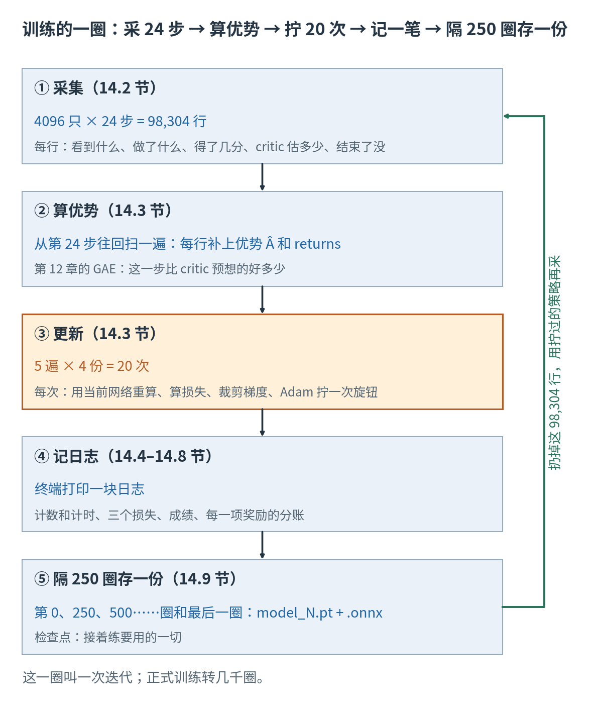
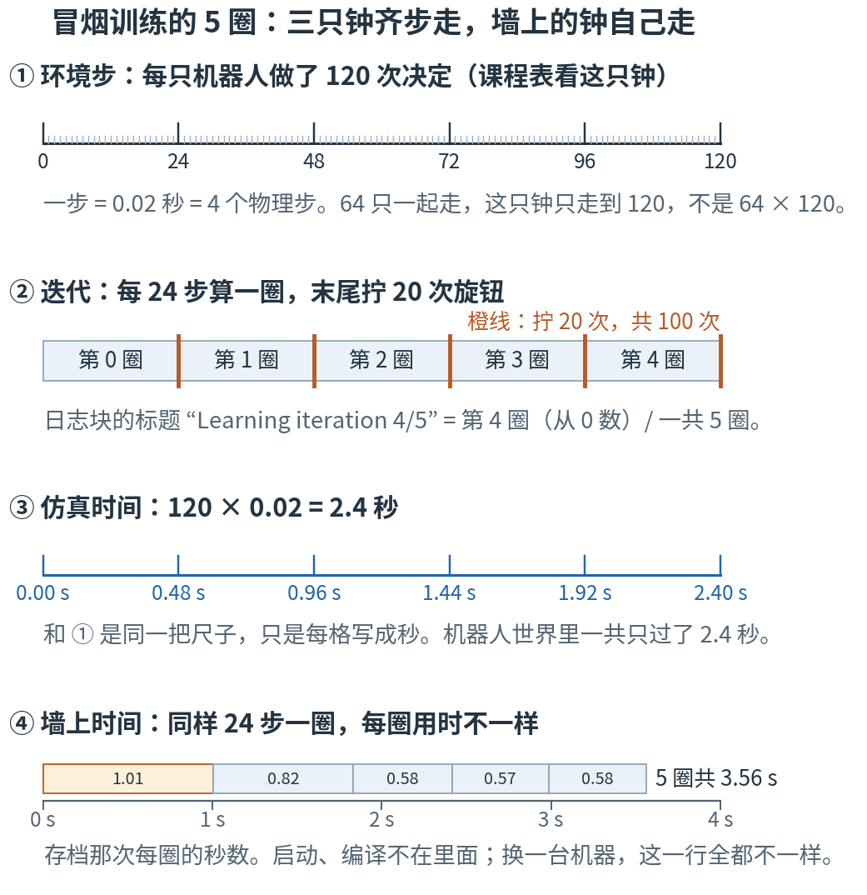
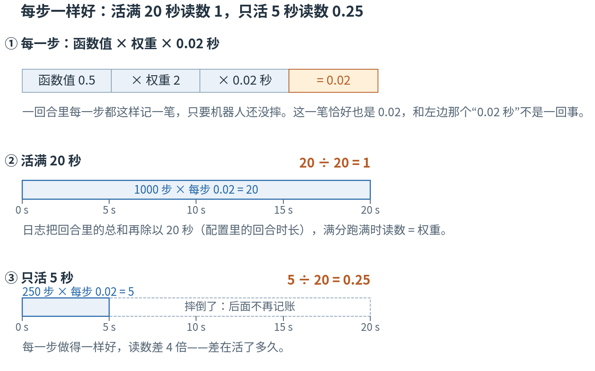
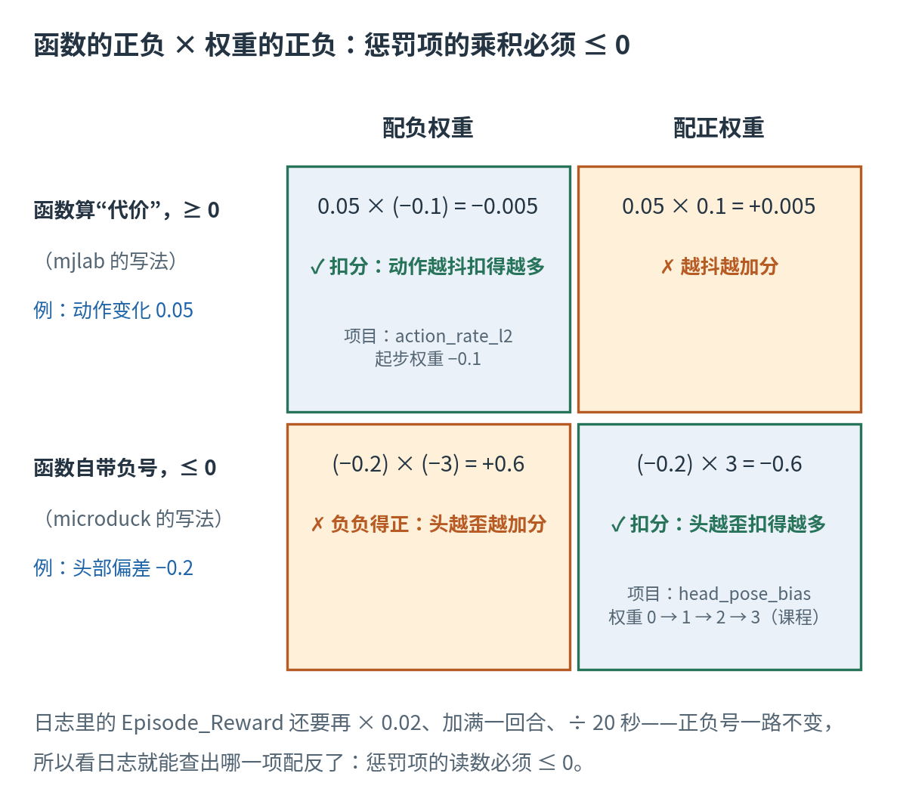
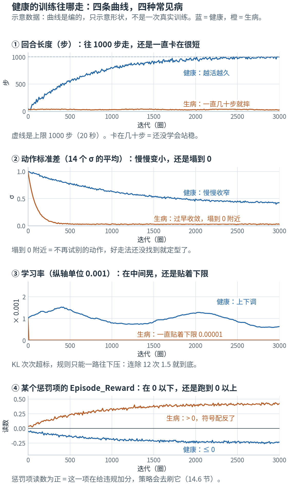
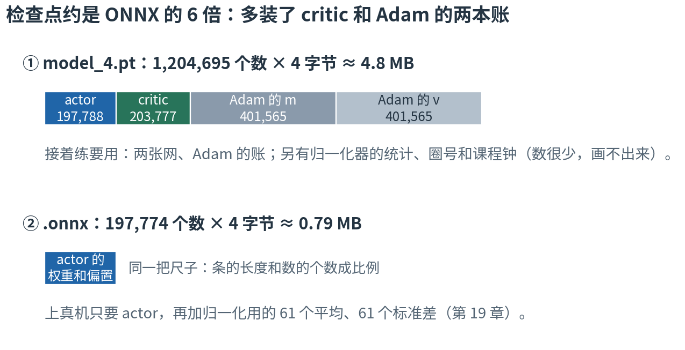

# 第 14 章 · 训练回路全貌：采 24 步、拧 20 次、记一笔，转几千圈

> **前五章我们有了什么**：强化学习的全部零件。回合、奖励和回报（第 9 章）；critic 给处境打分（第 10 章）；策略梯度和熵奖励（第 11 章）；
> GAE 从后往前算出每一步的优势（第 12 章）；PPO 带着保险拧旋钮（第 13 章）。
>
> **这一章要补什么**：这些零件一章讲一个，还没按时间顺序连起来。真训练时，它们每一圈怎样轮流上场？
> 终端每转一圈就打印一大块日志：每一行是哪个零件算出来的、单位是什么、正常的时候是什么样？"冒烟测试跑通了"又到底证明了什么？
> 这一章把一圈从头走到尾，再拿一次真实冒烟训练的日志，一行一行翻译。
>
> **本章新词**：仿真时间、墙上时间、采集、符号约定、冒烟测试。
> **需要的前提**：第 4 章的熵（4.9 节），第 7 章的 mini-batch 和 epoch（7.6 节），第 9 章的回合、终止与超时（9.5、9.6 节），
> 第 12 章的 GAE 和三种边界（12.3、12.6 节），第 17 章的环境步和物理步（17.5 节）。第 13 章的 PPO 只用到它的名字和作用。
> **不要求**读得懂 torch 代码，也**不要求**有 GPU：真跑训练的实验要 GPU，本章引用的是它的一次存档输出；另一个 CPU 实验把正文里的数全部复核一遍。
> 标"进阶"的折叠块可以第二遍再读。

---

## 14.0 先看地图：一圈 = 采 24 步、算优势、拧 20 次、记一笔

**训练就是同一圈转几千遍。每一圈：4096 只机器人用当前的策略各走 24 步，把经历记成一张 98,304 行的表（采集）；从最后一步往回，给每一行算出优势；
拿这张表把旋钮拧 20 次；打印一块日志；每隔 250 圈把此刻的网络存成一份文件——检查点（14.9 节）。然后把表扔掉，用拧过的策略再采下一圈。**

想象一支球队这样练：先按现在的打法打一小段比赛，全程录像；赛后教练从最后一个回合往回看，给每个动作记一笔"比预想的好还是差"；
照着这段录像把动作纠正 20 遍；在训练本上记下今天的数；每隔一阵，把"现在的打法"整理成一份收好。
然后录像作废——打法已经改了，旧录像拍的是旧打法——下一段比赛重新录。



**读图顺序：** 从 ① 往下读到 ⑤，再顺着右边的绿箭头回到 ①。每个框里蓝字是这一站的数，灰字是它在做什么；数字现在不用算，14.2–14.9 节会一个个算出来。
橙色的 ③ 是真正拧旋钮的地方：一圈里只有它在改策略，其余几站都只是收数据、算数、记账。

| 概念 | 它在回答什么问题 | 球队里对应什么 | 在哪一节 |
|---|---|---|---|
| 四只钟：环境步、迭代、仿真时间、墙上时间 | "过了多久"按什么数？ | 做了几次决定、复盘了几次、比赛钟、墙上的钟 | 14.1 |
| 采集 | 这一圈的数据从哪来？ | 按现在的打法打一段，全程录像 | 14.2 |
| 算优势、拧 20 次 | 数据怎样变成"拧旋钮"？ | 逐个动作记好坏，照着录像纠正 20 遍 | 14.3 |
| 一块日志 | 这一圈的体检单上写了什么？ | 训练本上的一笔 | 14.4 |
| Episode_Reward 的单位 | 一项奖励的读数怎样换算回"每一步"？ | 总分和场均分 | 14.5 |
| 符号约定 | 惩罚项的读数为什么必须 ≤ 0？ | 犯规只能扣分，不能扣成加分 | 14.6 |
| 课程、结束原因、跟踪误差 | 日志里其余几组数怎么读？ | 训练计划到了哪一档、每次为什么停下 | 14.7 |
| 健康的曲线 | 几百圈以后，该往哪边走？ | 一个赛季的成绩走势 | 14.8 |
| 检查点 | 存下来的是什么？凭它能接着练吗？ | 打法加上教练的笔记 | 14.9 |
| 冒烟测试 | 跑 5 圈证明了什么？ | 开赛前先通电试灯 | 14.10 |

表里的名字先不背，到了各节再给。本章最容易混的四处，先贴上标签：

- **四只钟**：日志里说"过了多少"，可能按环境步数、按圈数、按机器人世界里的秒数，也可能按你墙上的钟。换算规则各不相同，读任何一个数，先问"是哪只钟"（14.1 节）。
- **Total steps 数的是记录，不是环境步**：64 只机器人各走 1 步，记录多出 64 条，环境步这只钟只走 1（14.4 节）。
- **同一个字，两个意思**："四只钟"的钟是计时的（14.1 节）；"14 口钟"的钟是第 4 章 4.7 节那种钟形的分布，策略从里面抽动作（14.2、14.3 节）——计时的论"只"，钟形的论"口"。
  奖励项的"权重"是人定的系数（14.5、14.6 节，第 16 章逐项讲）；网络的"权重"是旋钮（14.9 节）。
- **4096 × 24 和 [4096, 61]**：前一个是真乘法，得出记录的条数；后一个是形状，4096 行、每行 61 个数（14.2 节）。

现在觉得这些区别有点抽象很正常，读到对应小节就清楚了。

第一次读，按顺序看正文、图和手算就够了。标"进阶"的折叠块可以先跳过；代码是复核工具，不是阅读门槛。

## 14.1 四只钟：环境步、迭代、仿真时间、墙上时间

训练跑起来以后，"过了多久"有好几种说法。先用一个迷你版把它们分开：**2 只机器人，每圈各走 3 步，转 2 圈**
（真实训练是它的放大版：4096 只、每圈 24 步、几千圈）。

- 按环境步数（第 17 章 17.5 节的名字：策略做一次决定的那 0.02 秒）：每只机器人走了 3 × 2 = 6 步。两只是**一起**走的，所以这只钟只走到 6，不是 12。
- 按迭代数（一圈 = 走完这几步、再拧一轮旋钮；第 7 章 7.6 节给过这个名字）：2 圈。
- 按机器人世界里的秒数：6 × 0.02 = 0.12 秒。
- 按你墙上挂的钟：说不准——看电脑多快。

另外还有两个"计数"，它们不是钟，但日志里也有：一共记下 2 × 6 = 12 条记录（每只机器人每步一条）；一共拧了 2 × 20 = 40 次旋钮（一圈 20 次，14.3 节）。

机器人世界里的时间叫**仿真时间**（simulated time）：环境步数 × 0.02 秒，和电脑快慢无关。
你墙上挂钟走过的时间叫**墙上时间**（wall-clock time）：跑仿真、拧旋钮、打印日志、开头的启动和编译，统统算在里面，换一台机器就不一样。

现在换成本章要读的那次冒烟训练（64 只机器人 × 每圈 24 步 × 5 圈，14.10 节细讲）。本章引用的冒烟训练数字，都来自 GPU 实验在 2026-09-22 的一次运行，
它的输出存了档，下文简称"存档"；你自己跑一次，时间、损失、奖励都会不同。

| 钟 | 数的是什么 | 冒烟训练 |
|---|---|---|
| 环境步 | 每只机器人做了几次决定 | 5 × 24 = 120 |
| 迭代 | 转了几圈 | 5 |
| 仿真时间 | 机器人世界里过了几秒 | 120 × 0.02 = 2.4 秒 |
| 墙上时间 | 你的手表过了几秒 | 看机器（存档那次：5 圈共 3.56 秒，不含启动） |
| （计数）记录条数 | 所有机器人加起来记了几行 | 64 × 120 = 7680 |
| （计数）更新次数 | 拧了几次旋钮 | 5 × 20 = 100 |

环境步下面还有一只更细的钟：物理步。一个环境步 = 4 个物理步（第 17 章 17.5 节），120 个环境步就是 480 个物理步。日志里不出现它，本章不再提。



**这样读图：** 前三行用同一把横尺。① 环境步每 24 格一个大刻度；② 每 24 步算一圈，橙线是每圈末尾拧 20 次旋钮的地方；③ 还是这把尺子，每格写成秒。
这三只钟按固定比例一起走，知道其中一个，另外两个都算得出来。④ 墙上时间单独一把尺子：同样 24 步一圈，第 0 圈用了 1.01 秒，第 1 圈 0.82 秒，之后稳定在 0.57–0.58 秒。
（这一行的秒数，是存档那次训练留下的事件文件里记的，14.4 节介绍事件文件。）

把圈数放大到正式训练，差别更显眼。1000 圈 = 24,000 个环境步 = 480 秒 = 8 分钟：**每只**机器人在仿真里只活了 8 分钟。
可是一共有 4096 只：4096 × 480 = 1,966,080 秒，约 546 小时，22.8 天的经验。墙上时间呢？本书旧版记过一个例子：一台 RTX 5070 上 4096 只约 2.6 秒一圈，1000 圈 = 2600 秒，约 43 分钟——
这只是一台机器上的一个例子，你的机器会不一样。

每只机器人其实还揣着自己的一只秒表：回合（第 9 章 9.5 节）。摔倒或超时就清零，原地重来。
所以"120 个环境步"不是"一个 120 步长的回合"：存档那次平均 35.21 步就摔一次，120 步里摔了约 120 ÷ 35.21 ≈ 3.4 次。
（开训时，每只机器人的这只秒表还被随机拨到 0–999 之间的某一格，这样 4096 只不会在同一时刻一起超时、一起重置。）

为什么要分得这么清？项目的课程表按环境步这只钟换档（课程就是"随着训练进度一档一档加难"，第 17 章 17.8 节提过，第 18 章（课程学习）细讲）：
"第 500 圈起加难"在代码里写的是 500 × 24 = 12,000 个环境步。这只钟和机器人只数、机器快慢都无关。

> **停一下，自测**：把冒烟训练的 64 只机器人换成 4096 只，每圈还是走 24 步。课程表的钟走得更快了吗？每圈的记录条数变成多少？墙上时间呢？
> <details><summary>答案</summary>
>
> 课程钟不变：每圈照样只走 24 个环境步（所有机器人一起走）。记录从 64 × 24 = 1536 条变成 4096 × 24 = 98,304 条，正好 64 倍。
> 墙上时间说不准：GPU 同时算很多只，只数变 64 倍，时间并不跟着变 64 倍，要看机器。
>
> </details>

CPU 实验第 1 节把迷你版、冒烟、1000 圈的这些数都算了一遍，并从配置里读出 0.005 秒、4、20 秒、24 和 5 × 4。

## 14.2 采集：用当前的策略原样走 24 步，每一步记一行

一圈的第一件事是收数据。策略此刻什么样，就原样上场，边走边记，**不边走边改**（第 5 章 📍：这一段包在 `inference_mode` 里，不算梯度）。

还是迷你版：2 只机器人各走 3 步。一只机器人走一步，发生这几件事：

1. actor 看这一帧的观测，给出 14 口钟；从每口钟里抽一个数，就是动作（第 4 章 4.7 节：均值 + 标准差 × 噪声）。同时记下抽到这个动作的 ln π（第 4 章 4.8 节）。
2. critic 看同一帧，报一个 V：这个处境大概值多少分（第 10 章 10.5 节）。
3. 仿真往前走一个环境步（4 个物理步），给出奖励、下一帧的观测，以及"这一回合结束了吗"。
4. 归一化器用新来的这一批观测，更新自己的平均和标准差（第 8 章 8.4 节）。
5. 摔倒或超时的机器人原地重置，马上开始新回合；超时的那一步，奖励里补上 0.99 × V（第 12 章 12.6 节的超时自举）。

每走一步，每只机器人就记下一行。一行里有这些：

| 一行里记的东西 | 几个数 | 从哪来 |
|---|---|---|
| actor 看到的观测 | 61 | 这一帧（第 15 章） |
| critic 看到的观测 | 76 | 这一帧（第 15 章 15.8 节） |
| 抽出的动作 | 14 | 第 1 件事 |
| 那 14 口钟的均值 μ、标准差 σ | 14 + 14 | 第 1 件事（14.3 节量"策略变了多少"要用） |
| 这个动作的 ln π | 1 | 第 1 件事 |
| critic 的 V | 1 | 第 2 件事 |
| 奖励 r | 1 | 第 3、5 件事 |
| 结束了吗 | 1 | 第 3 件事 |

加起来一行 61 + 76 + 14 + 14 + 14 + 1 + 1 + 1 + 1 = 183 个数。迷你版一共 2 × 3 = 6 行，排出来是这样（示意，数先不填）：

```text
机器人  第几步  观测    动作   μ、σ   ln π   V    r    结束了吗
  1       1     ……      ……     ……     …     …    …      否
  1       2     ……      ……     ……     …     …    …      否
  1       3     ……      ……     ……     …     …    …      否
  2       1     ……      ……     ……     …     …    …      否
  2       2     ……      ……     ……     …     …    …      是    ← 摔了，原地重来
  2       3     ……      ……     ……     …     …    …      否    ← 已经是新回合的第 1 步
```

2 号机器人第 2 步就摔了，它的第 3 行已经属于新回合。所以一圈的 24 行里可能夹着好几个回合的片段，"结束了吗"那一列标出边界，14.3 节算优势时就靠它断开。

这样"用当前的策略走一段、把经历一行行记下来"，叫**采集**（rollout）。项目里一圈采集 4096 × 24 = 98,304 行；冒烟训练是 64 × 24 = 1536 行。

> ⚠️ **4096 × 24 是真乘法，[4096, 61] 是形状。** 98,304 是记录的条数：4096 只各记 24 行。
> 而一步里 4096 只的观测摆在一起，形状是 [4096, 61]：4096 行、每行 61 个数，一共 4096 × 61 = 249,856 个数——但它仍然只是 **4096 条**记录。
> 一圈存下来的观测形状是 [24, 4096, 61]（第 12 章 📍 说过：第 0 轴 24 个时刻，第 1 轴 4096 只机器人），5,996,544 个数，98,304 条记录。说"多少条"时，别把 61 乘进去。

> **停一下，自测**：冒烟训练一圈采集多少行？这些行里，actor 看到的观测一共是多少个数？
> <details><summary>答案</summary>
>
> 64 × 24 = 1536 行；1536 × 61 = 93,696 个数。
>
> </details>

CPU 实验第 2 节列出了一行里的 9 样东西、183 个数和三种规模的行数。

## 14.3 算优势、拧 20 次：记下的数不动，策略在动

24 步走完，手里是一张 98,304 行的表。接下来两件事。

**先算优势。** 从第 24 步往回扫一遍（第 12 章 12.3 节的 GAE），每一行补上两列：优势 Â（这一步比 critic 预想的好多少）和 returns（= Â + V，critic 的标签）。
碰到"结束了吗 = 是"就断开；第 24 步后面没记的，用 critic 对下一帧的估计补上（第 12 章 12.6 节的三种边界）。最后把整批 Â 减平均、除以标准差（第 12 章 12.7 节）。

**再拧 20 次。** 把表切成 4 份、从头到尾用 5 遍，每一份拧一次旋钮：5 × 4 = 20 次（第 7 章 7.6 节）。每份 98,304 ÷ 4 = 24,576 行，每一行在这一圈里被用 5 次。
每一次更新做四件事：

1. 用**当前**的网络，在存下的观测上重算：这个动作现在的 ln π、critic 现在的 V、钟现在的熵。
2. 量一量旧钟和现在的钟差多远（第 3 章 📍 说的 KL 那把尺子）：差太多，学习率除以 1.5；差太少，乘 1.5。
3. 拿现在的 ln π 和存下的旧 ln π 比，看策略对这个动作的看法变了多少，再给"变太多"上保险——第 13 章 13.2、13.3 节（比率和裁剪）就在这里上场。
4. 三项损失加起来（第 13 章）→ 清零 → 反向传播 → 梯度裁剪到 1.0（第 3 章 3.7 节）→ Adam 拧一步（第 7 章 7.5 节）。

留意哪些数在这 20 次里动、哪些不动：

| 采集时记下，这一圈里不再变 | 每次更新都重新算 |
|---|---|
| 观测、动作、奖励、结束了吗 | 当前 actor 给这个动作的 ln π |
| 旧的 ln π、旧的 V、旧钟的 μ 和 σ | 当前 critic 的 V、当前钟的熵 |
| 优势 Â、returns（这一节开头算好的） | 新旧两口钟差多远、学习率、Adam 的两本账 |

所以更新不是"让刚才那一步机器人重走一遍"——仿真一步也没再跑——而是拿刚才那个动作一遍遍地问：**现在的策略**觉得它有多可能？

20 次拧完，这张表就扔掉（`update()` 的最后几行里有一句 `self.storage.clear()`）。为什么不留到下一圈接着用？因为策略已经变了，这些行是**旧策略**走出来的，越往后越不准——
第 13 章 13.1 节（数据过期）讲的正是这件事。下一圈用拧过的策略重新采。

墙上时间主要花在哪一段？存档最后一圈：采集 0.538 秒，算优势加拧 20 次一共 0.040 秒——0.538 ÷ 0.578 ≈ 93% 的时间在跑仿真收数据。这也是为什么要在 GPU 上同时跑几千只机器人。
（这是 64 只的一次冒烟训练；4096 只时两边的比例会变，要看你自己的日志。）

> **停一下，自测**：把 `num_mini_batches` 从 4 改成 8（5 遍不变），一圈拧几次？每次用多少行？每一行在一圈里被用几次？
> <details><summary>答案</summary>
>
> 5 × 8 = 40 次；每次 98,304 ÷ 8 = 12,288 行；每一行每遍用一次，还是 5 次。
>
> </details>

CPU 实验第 3 节算了这些次数和份的大小，并画出 14.0 节的总览图。

## 14.4 一块日志：先数数，再看损失，再看成绩

每转完一圈，终端打印一块日志。照 rsl_rl 的打印顺序排出来是这样（示意：值都用"…"代替）：

```text
################################################################################
                     Learning iteration 4/5            ← 第 4 圈（从 0 数）/ 一共 5 圈

                 Run name: …                           ← 这次运行的名字
              Total steps: …      ┐
         Steps per second: …      │  ① 计数和计时
          Collection time: …      │
            Learning time: …      ┘
          Mean value loss: …      ┐
      Mean surrogate loss: …      │  ② 三个损失：这一圈 20 次更新的平均
        Mean entropy loss: …      ┘
              Mean reward: …      ┐
      Mean episode length: …      │  ③ 成绩，和钟有多宽
          Mean action std: …      ┘
 Episode_Reward/upright: …        ┐
                       …          │  ④ 分项账：16 项奖励、7 个课程项、
Metrics/twist/error_vel_xy: …     │     跟踪误差、4 种结束原因……（14.5–14.7 节）
Episode_Termination/fell_over: …  ┘
--------------------------------------------------------------------------------
           Iteration time: …      ┐
             Time elapsed: …      │  ⑤ 页脚：墙上时间
                      ETA: …      ┘
```

先手算三个代表项，数都取自存档（14.1 节）。

**Total steps：7680。** 它每圈加"24 × 机器人只数"：5 圈 × 64 只 × 24 步 = 7680。

> ⚠️ **Total steps 数的是记录，不是环境步。** 名字里有 steps，数的却是 14.1 节表里的"记录条数"。环境步这只钟 5 圈只走了 120；课程表看的是 120，不是 7680。
> 同理，`Steps per second` 是这一圈的记录条数除以这一圈用的秒数：每秒收多少条记录。

**Mean entropy loss：19.8079。** 名字里有 loss，记的却是熵本身（第 11 章 11.6 节）。开训时 14 口钟的 σ 都是 1，一口的熵是 1.41894，14 口加起来 14 × 1.41894 = 19.865（第 4 章 4.9 节）。
5 圈后读数 19.8079，只比 19.865 小了约 0.057：σ 几乎还没动。下面那行 `Mean action std: 1.00` 说的是同一件事。

<details>
<summary>进阶：从 19.8079 反推 σ 缩了多少（现在可跳过）</summary>

一口钟的熵 = 1.41894 + ln σ（第 4 章 4.9 节），14 口加起来 = 19.865 + (14 个 ln σ 之和)。
所以 (19.8079 − 19.865) ÷ 14 ≈ −0.0041 是 ln σ 的平均；在浏览器控制台按 `Math.exp(-0.0041)` 得 0.9959——σ 平均只缩了约 0.4%。
日志只印两位小数，0.996 就印成了 1.00。

</details>

**Mean episode length：35.21。** 平均一个回合走 35.21 步，35.21 × 0.02 = 0.7042 秒——还不到 1 秒就摔。跑满是 1000 步（20 秒）。

其余几行，各用一两句话说清：

- **Collection time / Learning time**：这一圈采集花了几秒；算优势加拧 20 次花了几秒。两个都是墙上时间（14.1 节）。
- **Mean value loss**：critic 猜的 V 和 returns 差多少（差的平方的平均；项目里还多一道裁剪，第 13 章）。它变小只说明 critic 更贴近这一批标签，不说明机器人走得更好（第 10 章 10.5 节）。
- **Mean surrogate loss**：actor 那一项损失（第 13 章）。它通常是个小负数：每圈头一次更新时网络还没拧过，新旧策略几乎一样，这一项差不多就是"优势的平均再取个负号"——
  而优势刚归一化过，平均是 0（第 12 章 12.7 节）；之后每拧一次，都朝让它变小的方向走，20 次一平均就成了小负数。看它别突然变得很大就行，数值本身没什么含义。
- **Mean reward**：一个回合里，每一步 16 项奖励的加权和（已经乘过 0.02）从头加到尾，是这个回合的总分；这一行是**最近 100 个结束的回合**的总分平均。
- **Mean action std**：14 个 σ 的平均（第 11 章 11.6 节），开训时是 1.0。

终端里不打印学习率；第 13 章 13.3 节（裁剪的平坦区）说过的那个"有多少条记录被封了顶"的比例，rsl_rl 也不记——既不打印，也不写进下面说的事件文件，想看只能自己算。到了 wandb（项目看训练曲线的网页工具，第 4 章 4.9 节提过）里，这几行换了名字：Loss/value、Loss/surrogate、Loss/entropy、Train/mean_reward、Train/mean_episode_length、Policy/mean_std、
Perf/collection_time、Perf/learning_time，学习率在 Loss/learning_rate。冒烟训练没开 wandb，同样这些数写进了运行目录里的**事件文件**：tensorboard 格式的一个文件，每圈记一笔。
14.1、14.8、14.10 节用到的"前几圈"的数，就是从那里读出来的。

下面是 GPU 实验第 2 节打印的原样输出——总表，不用背（时间、损失、奖励每次跑都不一样，你的数字会不同）：

```
             日志行  本次的值                                                                               它是什么
-------------------  --------  -------------------------------------------------------------------------------------
        Total steps      7680                          累计环境步数 = iteration × num_envs × 24（64 env：每次 1536）
    Collection time    0.538s                                                         跑 24 步仿真、收一批数据的时间
      Learning time    0.040s                                        20 次 PPO 更新（5 遍 × 4 批）的时间（第 13 章）
    Mean value loss    0.0568  critic 的损失：(V − returns)² 的平均，项目里还套了一层裁剪（第 10 章 10.5、第 13 章）
Mean surrogate loss   -0.0442                                                   −L^CLIP 的平均（第 13 章；负数正常）
  Mean entropy loss   19.8079                                           14 维高斯的熵，σ≈1 时 ≈ 19.86（第 4 章 4.9）
        Mean reward      0.12                                   回合内奖励之和的平均（16 项加权和 × 0.02，第 16 章）
Mean episode length     35.21                                                         平均回合长度（步）。摔得快就短
    Mean action std      1.00                                                14 个 σ 的平均（第 4 章 4.7），初值 1.0
```

"它是什么"那一列是 GPU 实验里写好的说明。第一行把 Total steps 叫"累计环境步数"，说的是把 64 只各自走的步数加在一起——也就是上面 ⚠️ 说的记录条数，不是 14.1 节里只走到 120 的那只环境步钟。本章一律叫它记录条数。

> **停一下，自测**：一次正式训练用 4096 只机器人。标题写着 Learning iteration 9/… 的那块日志里，Total steps 应该是多少？这时环境步这只钟走到了多少？
> <details><summary>答案</summary>
>
> 圈号从 0 数，9 号是第 10 圈：Total steps = 10 × 4096 × 24 = 983,040；环境步 = 10 × 24 = 240。
>
> </details>

CPU 实验第 4 节把存档里这几个数抄了进去，复核了 7680、19.865、反推的 0.9959 和 0.7042 秒。

## 14.5 Episode_Reward 的单位：加权、乘 0.02、整回合加起来、再除以 20 秒

日志第 ④ 组里最长的是 16 行 `Episode_Reward/<名字>`：每一项奖励单独记的一笔账。读它之前，先弄清它的单位——不然同一个数会被读错好几倍。

手算一个。设某一项奖励的函数（第 16 章逐项讲）在一个回合里每一步都等于 0.5，这一项的权重是 2（奖励项的系数，不是网络的权重），一步 0.02 秒：

1. **每一步记一笔**：0.5 × 2 × 0.02 = 0.02。（巧合：这一笔也是 0.02，和"一步 0.02 秒"不是一回事。）
2. **整回合加起来**：机器人活满 20 秒，就是 1000 步：1000 × 0.02 = 20。
3. **再除以 20 秒**（配置里的回合时长）：20 ÷ 20 = 1。日志里读到的就是 1。（又一个巧合：前一个 20 是分，后一个 20 是秒。）

同样的函数值、同样的权重，要是这只机器人只活了 5 秒：250 步 × 0.02 = 5，5 ÷ 20 = **0.25**。每一步做得一样好，读数小了 4 倍——差在活了多久。



**这样读图：** ① 是每一步记的那一笔。② ③ 是同一把 0–20 秒的时间尺子：蓝色涂满的长度和活着的秒数成比例，② 涂满全程，③ 只涂了前 5 秒，后面的虚线框表示摔倒以后不再记账。
右上角的橙字是日志里最后读到的数。

写成公式（Σ 就是 for 循环，第 2 章 2.2 节）：

$$\text{读数} = \frac{1}{20}\sum_{t=1}^{n} f_t \times w \times 0.02$$

| 符号 | 怎么读 | 就是 |
|---|---|---|
| $f_t$ | "f t" | 这一项的函数在第 t 步算出的值 |
| $w$ | "w" | 这一项的权重（奖励项的系数，第 16 章） |
| $0.02$ | | 一个环境步的秒数 |
| $n$ | "n" | 这个回合活了几步，最多 1000 |
| $\sum_{t=1}^{n}$ | "对 t 从 1 到 n 求和" | 从第 1 步加到第 n 步：`for` 循环 |
| $\frac{1}{20}$ | "除以 20" | 除以配置里的回合时长 20 秒 |

```js
let sum = 0;
for (let t = 0; t < n; t++) sum += f[t] * w * 0.02;   // 每一步记一笔，整回合加起来
const reading = sum / 20;                             // 再除以回合时长 20 秒
```

日志里的数，还要对"这一圈里结束的那些回合"取平均（准确说是：每一步先对这一步结束的那几只取平均，再对这一圈 24 步取平均——和 14.7 节进阶折叠里那套记法一样），单位不变。由此有两个推论：

- **每一步都拿满分 1、又活满 20 秒时，读数恰好等于权重**：1000 × 1 × w × 0.02 ÷ 20 = w。`track_linear_velocity` 的权重是 2（配置里读出来的），它的读数最高就是 2。
- **读数变了，有三种可能**：每一步做得更好了；同样的表现活得更久了；课程把权重调了（14.7 节）。只看这一个数分不出是哪种，要同时看回合长度和当前的权重。

拿存档试一下。`track_linear_velocity` 读 0.0224。回合平均只有 35.21 步，就算每一步都满分，最多也只能读到 2 × 35.21 × 0.02 ÷ 20 = 0.0704；0.0224 ÷ 0.0704 ≈ 0.32。
所以这 5 圈里，机器人活着的时候，速度跟踪这一项每步平均只拿到满分的三成左右。（这是估算：Mean episode length 统计的是最近 100 个回合，和这一项统计的回合不完全是同一批。）

> ⚠️ **三个"总分"不是同一种单位。** `Episode_Reward/<名字>` 是**一项**、除过 20 秒；`Mean reward` 是 **16 项**加在一起的回合总分、没除 20 秒、还是最近 100 个回合的平均；
> 第 9 章 9.7 节的回报又带着每步 0.99 的折扣。三个数不能指望互相对上。

> **停一下，自测**：某一项的函数值每步都是 0.8，权重 1，机器人活了 10 秒。日志里这一项读多少？
> <details><summary>答案</summary>
>
> 10 秒是 500 步：0.8 × 1 × 0.02 × 500 = 8，8 ÷ 20 = 0.4。
>
> </details>

CPU 实验第 5 节照 mjlab 的算法把 1 和 0.25 算了一遍，并复核了 0.0704 和 0.32。

## 14.6 符号约定：惩罚项的读数必须 ≤ 0

16 项奖励里有 9 项是惩罚：动作抖、身体晃、关节顶到极限、脚打滑……它们本该**扣**分。可是"扣分"在项目里有两种写法：

- **mjlab 的写法**：函数算一个"代价"，永远 ≥ 0（比如平方和），再配一个**负**权重。
  手算（14 个关节的迷你版，只写两个）：动作这一步比上一步变了 (0.1, −0.2)，`action_rate_l2` 算的是 0.1² + (−0.2)² = 0.05；权重 −0.1；0.05 × (−0.1) = −0.005，再乘 0.02 是每步 −0.0001。扣分。
- **microduck 自己的写法**：函数本身带着负号，返回 ≤ 0，再配一个**正**权重。
  手算：`head_pose_bias` 这一项的函数返回"−|头部平均偏了多少|"，偏了 0.2 rad 就返回 −0.2；课程最后把它的权重调到 3；(−0.2) × 3 = −0.6，再乘 0.02 是每步 −0.012。也是扣分。

两种写法都对，只要**函数的正负号 × 权重的正负号 = 负**。项目的说明文件 AGENTS.md 把这条规矩叫**符号约定**（sign convention）。

搞反了会怎样？给自带负号的函数也配上负权重：(−0.2) × (−3) = **+0.6**。负负得正——头越歪，分越高。
策略会一门心思去**刷分**：钻规则的空子，反复拿这一项的分（AGENTS.md 叫它 farm）。AGENTS.md 记下的真实例子是"屁股着地蹦""故意摔着坐下"。



**这样读图：** 行是函数的两种写法，列是权重的两种正负号。绿框是对的配法：乘出来是负数，扣分；橙框是配反了：乘出来是正数，违规反而加分。
左上的 action_rate_l2、右下的 head_pose_bias，就是项目里两种写法各一例。图底下那句话是查错的关键：日志里的数只是再乘 0.02、加满一回合、除以 20 秒，**正负号不变**。

所以不用去读每个函数的源码，看日志就能查。AGENTS.md 的原话：

> The infallible check: on every run, every `Episode_Reward/<penalty>` in wandb must be ≤ 0.
>
> （大意：万无一失的检查——每一次运行，wandb 里每一个惩罚项的 `Episode_Reward` 都必须 ≤ 0。）

存档那次冒烟训练的 16 项（GPU 实验第 3 节的原样输出，你的数字会不同）：

```
                奖励项  加权后的值
----------------------  ----------
 track_linear_velocity      0.0224
track_angular_velocity      0.0019
               upright      0.0301
                  pose      0.0081
          body_ang_vel     -0.0232
      angular_momentum          -0
        dof_pos_limits     -0.0006
        action_rate_l2     -0.1028
              air_time      0.0114
        foot_clearance     -0.0004
     foot_swing_height     -0.0017
             foot_slip     -0.0001
       self_collisions     -0.0009
    head_pose_tracking      0.0583
    body_pose_tracking           0
        head_pose_bias           0
  ✓ 所有惩罚项 ≤ 0（AGENTS.md 的不变量）
```

9 个惩罚项——`body_ang_vel` 到 `self_collisions` 之间带负号的 8 个，加上最后的 `head_pose_bias`——全都 ≤ 0，GPU 实验自动检查了这一条。还有两个细节：

- `angular_momentum` 印成 `-0`：日志只印 4 位小数，一个比 0.00005 还小的负数就印成了 −0.0000。它是负的，没有问题。
- `body_pose_tracking` 和 `head_pose_bias` 恰好是 0：它们眼下的权重是 0，mjlab 根本不去算权重为 0 的项（📍 里那行 `continue`）。读数 0 不代表做得完美，只代表**没被算**。
  `head_pose_bias` 要到第 600 圈才被课程调成 1（14.7 节）。

> ⚠️ **名字带 `_penalty`，不等于自带负号。** `body_ang_vel` 这一项用的是 mjlab 的 `body_angular_velocity_penalty`，算的是平方和（≥ 0），配的是负权重 −0.05；
> microduck 的 `head_pose_bias_penalty` 才自带负号。靠名字猜符号会猜错——所以要看日志里的正负号，而不是看名字。

> **停一下，自测**：一个自带负号的函数这一步返回 −0.3，有人把它的权重写成了 −2。这一步给总分加了多少？训练久了，策略会学成什么样？
> <details><summary>答案</summary>
>
> (−0.3) × (−2) = +0.6，再乘 0.02 是每步 +0.012——加分。策略会学着把那个偏差弄得更大，因为越偏分越高。日志里这一项的 Episode_Reward 会是正数，一眼就能查出来。
>
> </details>

第 16 章（奖励逐项拆解）把 16 项的公式逐个拆开，这一节只要会查正负号。CPU 实验第 6 节从配置里读出 16 项各自的函数和权重，分出两种写法，并复核了上面的手算。

## 14.7 其余几组：课程到了哪一档、回合为什么结束、跟得准不准

日志第 ④ 组还有三类行。

**Curriculum/***：课程此刻在哪一档。存档第 4 圈的 7 个读数，和配置里"第 0 档"的值一模一样——5 圈太短，一档都没动（CPU 实验第 7 节的原样输出）：

```
               课程项  配置里第 0 档  存档读数  第一次换档（环境步）  = 第几圈
---------------------  -------------  --------  --------------------  --------
   action_rate_weight           -0.1   -0.1000                 12000       500
        standing_envs           0.02    0.0200                 12000       500
      head_pose_range           0.07    0.0700                 12000       500
      body_pose_range           0.05    0.0500                不换档         —
            com_range          0.003    0.0030                 12000       500
       head_com_range          0.003    0.0030                 12000       500
head_pose_bias_weight              0    0.0000                 14400       600
```

最早的换档在第 500 圈（12,000 个环境步）：比如 `action_rate_l2` 的权重从 −0.1 变成 −0.2——14.5 节说的"课程改了权重，读数跟着变"，就发生在这种地方。
`head_pose_range` 读 0.07，是四个头部命令范围里最大的那个上限（头部左右转 ±0.07 rad）；`body_pose_range` 只有一档，永远不换。每一项是什么，第 18 章（课程学习）逐项讲。

**Episode_Termination/***：回合为什么结束，四种原因：超时、摔倒、走出地形、数值变成 NaN（算崩了）。存档这一圈只有摔倒：`fell_over: 2.0833`。

这个数很容易读错。它**不是**"每只机器人这一圈摔了 2 次"——那样的话，24 步里摔 2.08 次，一个回合只有 24 ÷ 2.0833 ≈ 11.5 步，和 Mean episode length 的 35.21 对不上。
它大致是"平均每走一步，64 只里有几只因为摔倒结束了回合"。核对一下：回合平均 35.21 步，那么每一步 64 只里约有 64 ÷ 35.21 ≈ 1.82 只走到回合尽头，和 2.08 差不多。

<details>
<summary>进阶：fell_over 这个数到底怎么算的（现在可跳过）</summary>

每一步，mjlab 把这一步要重置的机器人挑出来，数一数其中有几只是因为摔倒（`termination_manager.py` 里的 `count_nonzero`），记一笔；rsl_rl 再把这一圈各步记的数取平均。
某一步要是一只都没重置，这一步就沿用上一次记的那一笔。所以它和 64 ÷ 35.21 对不上严丝合缝，只是"差不多"；何况 Mean episode length 是最近 100 个回合的平均，两者统计的本来就不是同一批回合。

</details>

**Metrics/twist/***：速度命令跟得准不准。`error_vel_xy: 0.0336` 也不是"平均每步差 0.0336 m/s"。它的算法是：每一步的 |命令速度 − 实际速度| 先除以 400，再整回合加起来
（400 = 一段速度命令最长 8 秒不换，8 ÷ 0.02）。倒着算回去：0.0336 × 400 = 13.44 是一个回合里每步误差的总和，÷ 35.21 步 ≈ 0.38 m/s，才是活着的时候每步平均差多少。
又是一个"整回合加起来、再除以一个固定数"的读数：和 14.5 节一样，回合越短，它越小。

> **停一下，自测**：某一圈 64 只机器人，`time_out` 读 0，`fell_over` 读 3.2，`Mean episode length` 读 20。用上面的办法核对一下这两个数对不对得上。机器人平均活了几秒？
> <details><summary>答案</summary>
>
> 回合平均 20 步，每一步约有 64 ÷ 20 = 3.2 只走到回合尽头，正好对上 fell_over 的 3.2。20 × 0.02 = 0.4 秒。
>
> </details>

CPU 实验第 7 节核对了 7 个课程读数、2.0833 的两种读法和 0.38 m/s。

## 14.8 看曲线：健康的训练往哪走，四种常见病

一块日志只是一圈的快照。训练健不健康，要看几百圈连起来的走势——正式训练时在 wandb 上看曲线（第 18 章细讲）。先看健康的样子，再看四种常见病：



**这样读图：** 四块面板横轴都是圈数 0–3000，蓝线健康、橙线生病；曲线是编的示意数据，只示意形状。
① 回合长度：健康的一路涨向 1000 步（虚线，活满 20 秒）；生病的一直几十步就摔。② 动作标准差：健康的慢慢收窄；生病的几百圈就塌到 0 附近。
③ 学习率（纵轴单位 0.001）：健康的在中间上下调；生病的贴在下限上不动。④ 某一个惩罚项的 Episode_Reward：健康的在 0 以下；生病的跑到了 0 以上。

四种病各说一句：

1. **回合一直很短**：还没学会站稳。先查奖励的主任务项有没有在涨。
2. **σ 塌到 0 附近**：钟变得太窄，策略不再试别的动作，好走法还没找到就定型了，这叫过早收敛。"收敛"是第 10 章 10.2 节的词：越算越靠近某个数、到后来几乎不再变。
   第 11 章 11.6 节的熵奖励就是防它的。
3. **学习率一直贴着下限 0.00001**：学习率是按 KL 自动调的（第 3 章 📍）：新旧两口钟差得超过目标 0.01 的 2 倍，就除以 1.5，最低到 0.00001。
   要是次次超标，从 0.001 起连除 12 次就到了底（1.5 的 12 次方约 129.75，0.001 ÷ 129.75 ≈ 0.0000077，已经低于下限）——还不到一圈（一圈拧 20 次）。
   长期贴底，说明哪怕用最小的步子，策略每次也变得太猛。
4. **惩罚项的读数为正**：符号配反了（14.6 节），策略正在刷这一项。

AGENTS.md 里"读一次训练"的那几条，翻成一张表：

| 看什么 | 健康 | 不健康 |
|---|---|---|
| Mean reward | 持续往上走 | 平了；或者恰好在课程换档处往下掉（换档太急，第 18 章） |
| Mean episode length | 往 1000 走（活满 20 秒） | 一直很短 |
| 主任务项（`track_linear_velocity` 等） | 真的在涨 | 总分在涨、主任务项不涨：只靠别的小项在拿分 |
| 每个惩罚项的 Episode_Reward | ≤ 0 | 出现正数：符号配反 |
| Mean action std | 慢慢下降 | 骤降到 0 附近：过早收敛 |
| 学习率（wandb 的 Loss/learning_rate） | 在上下限之间来回调 | 长期贴着下限 0.00001 |

> ⚠️ **别拿冒烟测试的 5 圈看病。** 存档那次冒烟训练，第 0 圈结束时学习率就已经在下限 0.00001（事件文件里 5 圈都在 0.00001–0.000015 之间）。
> 5 圈的数据说明不了它之后会不会回升。病要看几百圈的走势，14.10 节接着说。

AGENTS.md 还有一条："Measure before theorizing"——先量，再下结论。训练"失败"了，先拿检查点在仿真里跑一遍、看视频、分情况统计，再去动奖励：
那里记着，好几次"失败"其实是看的检查点太早，或者判成功的标准本身有问题。

> **停一下，自测**：一次训练跑了 2000 圈。Mean reward 一直在涨，Mean episode length 早就接近 1000，可 `track_linear_velocity` 的读数从第 300 圈起就没动过，`Mean action std` 在第 400 圈已经掉到 0.02。你会怀疑什么？
> <details><summary>答案</summary>
>
> 两件事。一，主任务项不涨、总分却在涨：策略多半在靠别的小项拿分（比如站着不动也能拿的那些），并没学会按命令走。
> 二，σ 早早塌到 0.02：过早收敛，不再尝试别的动作了。这两件事常常一起出现。
>
> </details>

CPU 实验第 8 节算了"连除 12 次"，读出了存档的学习率，并画了这张示意图。

## 14.9 产物：检查点装着接着练所需的一切

冒烟训练跑完，运行目录 `logs/rsl_rl/velocity/<日期时间>_learnzh-ch14/` 里多了这些（GPU 实验第 5 节列出的）：

| 文件 | 是什么 | 干什么用 |
|---|---|---|
| `model_0.pt`、`model_4.pt` | 检查点：第 0 圈、第 4 圈结束时存的 | 接着练；在仿真里回放 |
| `<日期时间>_learnzh-ch14.onnx` | 只有 actor、烘好了归一化的网络 | 上真机（第 19 章） |
| `events.out.tfevents.…` | 事件文件：每圈的数 | 画曲线（14.4 节） |
| `params/` | 这次运行的完整配置 `env.yaml`、`agent.yaml` | 复现 |
| `git/` | 训练那一刻代码的版本和改动 | 复现 |

**什么时候存。** 圈号能被 250 整除就存一次（第 0 圈也算：0 能被 250 整除），最后一圈再存一次。冒烟训练只有 5 圈，所以只有 `model_0.pt` 和 `model_4.pt`；
正式训练是 model_0、model_250、model_500……每存一次检查点，就顺手导出一次 ONNX（同一个文件名，覆盖上一次的），所以目录里的 `.onnx` 总对应着最新的那个检查点。

**检查点里有什么。** `model_4.pt` 打开来是 5 样东西（CPU 实验第 9 节打开了存档那次的检查点）：

1. `actor_state_dict`：actor 的全部旋钮——197,774 个权重和偏置（网络的权重，不是奖励项的权重），加 14 个 σ，共 197,788 个（第 6 章 6.5 节）；还有 actor 的归一化器攒下的平均和标准差（第 8 章 8.4 节）。
2. `critic_state_dict`：critic 的 203,777 个旋钮（第 6 章 6.7 节）和它自己的归一化器。
3. `optimizer_state_dict`：Adam 的两本账，每个旋钮一个 m、一个 v（第 7 章 7.5 节），外加此刻的学习率。
4. `iter`：这是第几圈（从 0 数）。
5. `infos`：mjlab 在这里存了环境步那只钟，代码里叫 `common_step_counter`。

最有意思的是，14.1 节那张表里的四个计数，检查点全记着：

| 14.1 节的计数 | 检查点里的哪个数 | model_4.pt 里的值 |
|---|---|---|
| 迭代 | `iter` | 4（从 0 数，第 5 圈） |
| 环境步 | `infos` 里的 `common_step_counter` | 120 |
| 记录条数 | 归一化器的 `count`：一共吃进了多少行 | 7680 |
| 更新次数 | Adam 记的 `step`（它把每次更新叫一个 step） | 100 |

仿真时间可以从环境步算出来；墙上时间不存。

这就是为什么接着练（`--agent.load-checkpoint model_N.pt --agent.resume True`）要整个检查点，而不能只要 actor：critic 从头学，会拖后腿；
归一化器换了一套平均和标准差，网络看到的输入全变了样（第 8 章 8.5 节）；Adam 的两本账只能从零记起；课程钟归零，课程又从第 0 档重来。

**有多大。** 可训练的旋钮一共 197,788 + 203,777 = 401,565 个；Adam 再给每个旋钮记两个数，一共三份：401,565 × 3 = 1,204,695 个数。
每个数占 4 字节，401,565 × 3 × 4 = 4,818,780 字节，约 4.8 MB。存档那次的 `model_4.pt` 是 4,842,943 字节，多出来的两万多字节是归一化器的统计和文件格式本身。
ONNX 只装 actor 的 197,774 个权重和偏置（外加归一化要用的 61 个平均、61 个标准差）：197,774 × 4 = 791,096 字节，约 0.79 MB，实际 793,706 字节。



**这样读图：** 两根条用同一把尺子，长度和数的个数成比例。① 检查点：蓝色 actor、绿色 critic，后面两段灰色是 Adam 的 m 和 v，各和两张网加起来一样长。
② ONNX 只有最前面那一小段。4,818,780 ÷ 791,096 ≈ 6.1：检查点约是 ONNX 的 6 倍。

两个数别混：197,774 是 actor 四层网络的权重和偏置，ONNX 里就是这个数；加上 14 个 σ 的 197,788，是 actor 可训练旋钮的总数。说哪个数，就说清是哪个口径。

> **停一下，自测**：同事说："检查点太大了，我只留 ONNX，下回从 ONNX 接着练。"行不行？缺了什么？
> <details><summary>答案</summary>
>
> 不行。ONNX 里只有 actor 的权重和偏置（和烘进去的归一化）：没有 14 个 σ，没有 critic，没有 Adam 的两本账，也没有课程钟。
> 接着练要从检查点 `model_N.pt` 开始；ONNX 是给真机用的（第 19 章）。
>
> </details>

CPU 实验第 9 节按配置算出了这些个数和字节数；找得到你那次的运行目录时，还会打开 `model_4.pt` 逐项核对。

## 14.10 冒烟测试：5 圈证明"能跑通"，不证明"学得会"

新做的电路板，第一次通电先看冒不冒烟：不冒烟，至少没有接反、短路这种大错；冒烟了，后面什么都不用测。
训练也一样：改了配置，先用很小的规模跑几圈，看它能不能从头跑到尾。这叫**冒烟测试**（smoke test）。

项目的冒烟测试就是本章 GPU 实验跑的那一条命令：64 只机器人、5 圈。AGENTS.md 说它花几分钱的算力就能抓住约 95% 的配置错误，长训练之前必须先跑：

> A 5-iteration smoke test at 64 envs catches ~95% of config errors for cents. Never launch a long run without one.

AGENTS.md 列了它要证明的五条，在存档那次运行留下的东西里都找得到证据（第三条要打开检查点看，CPU 实验第 9 节做了这一步）：

| AGENTS.md 要它证明的 | 存档里的证据 |
|---|---|
| 环境建得起来（builds） | 训练进程退出码 0 |
| 一路没有 NaN（steps NaN-free） | `Episode_Termination/nan_state: 0.0000` |
| 观测是 61 维（obs is 61D） | 检查点里 actor 第一层的形状是 [512, 61] |
| 每一项奖励都算得出（every reward term computes） | 16 行 Episode_Reward 都有数 |
| ONNX 导得出（ONNX exports） | 产物里有 `.onnx` |

第四条要打个折扣：权重为 0 的两项（`body_pose_tracking`、`head_pose_bias`）读数是 0，是因为它们这 5 圈里**一次都没被算过**（14.6 节）。
`head_pose_bias` 的函数要到第 600 圈被课程调成 1 以后才第一次运行——它要是有 bug，冒烟测试抓不到。

它**不**证明的，存档里也看得出来：

- **不证明会走路**：回合平均 35 步就摔。
- **不证明课程没问题**：7 个课程项全停在第 0 档；最早的换档在第 500 圈，5 圈只走到 5 ÷ 500 = 1%。
- **不证明曲线健康**：存档那次，Mean episode length 在 5 圈里从 17.6 涨到 35.21，这**不是**学会了。第 0 圈只走了 24 步，那时能结束的回合最长也只有 24 步
  （日志的回合长度从开训那一刻才开始数），所以 17.6 ≤ 24；后面几圈，"最近 100 个回合"这个窗口慢慢被更长的回合填满。学习率贴着下限也一样（14.8 节）。
- **不证明**别的出生姿态、别的地形，更不证明真机上能用（第 19 章）。

走路这类步态，AGENTS.md 给的预算是 4000–6000 圈；5 圈是 4000 圈的 0.125%。所以读冒烟日志，是为了认识每一行、确认数值正常；它不能替任何一次正式训练担保。

> **停一下，自测**：下面哪些是冒烟测试跑通就能保证的？① `upright` 那一项的奖励函数里没有写错的变量名；② 策略能学会跟随速度命令；③ 第 1500 圈那一档课程的设置没写错；④ 导出的 ONNX 输入是 61 个数。
> <details><summary>答案</summary>
>
> ① 能：`upright` 的权重是 2，每一步都被算过，写错了会直接报错。（要是一项的权重眼下是 0，就保证不了。）
> ④ 能：每存一次检查点就导出一次 ONNX，第 0 圈就存过；actor 第一层是 [512, 61]。
> ② 不能：5 圈什么都还没学会。③ 不能：第 1500 圈那一档的设置，5 圈里一次都没被用上。
>
> </details>

CPU 实验第 10 节核对了 AGENTS.md 的原话、1% 和 0.125%，以及 17.6 ≤ 24。

## 📍 映射到项目

> 只需看一眼。语法看不懂没关系。

**这段代码做什么**：一圈训练的五站（14.0 节的总览图）就写在 `rsl_rl/runners/on_policy_runner.py` 的 `learn()` 里。第 5 章 📍 贴过它的前半段；这里把记日志、存检查点的后半段也接上（省略了查 NaN、搬到 GPU 等行）：

```python
        for it in range(start_it, total_it):                                  # 一圈 = 一次迭代（14.1 节）
            start = time.time()                                               # 墙上时间从这里开始计
            ...
            with torch.inference_mode():                                      # 采集时不算梯度、不改策略（14.2 节）
                for _ in range(self.cfg["num_steps_per_env"]):                # 每只机器人走 24 步
                    actions = self.alg.act(obs)                               # 抽动作，同时记下 V、ln π、钟的 μ 和 σ
                    obs, rewards, dones, extras = self.env.step(actions.to(self.env.device))   # 仿真走一个环境步
                    ...
                    self.alg.process_env_step(obs, rewards, dones, extras)    # 记一行；归一化器更新；超时补 0.99 × V
                    ...
                    self.logger.process_env_step(rewards, dones, extras, intrinsic_rewards)   # 记账：回合总分、回合长度
                ...
                collect_time = stop - start                                   # 日志里的 Collection time
                ...
                self.alg.compute_returns(obs)                                 # 从后往前算优势和 returns（14.3 节）
            ...
            loss_dict = self.alg.update()                                     # 拧 20 次，最后扔掉这批行（14.3 节）
            ...
            learn_time = stop - start                                         # 日志里的 Learning time
            ...
            self.logger.log(                                                  # 打印一块日志（14.4 节）
            ...
            if self.logger.writer is not None and it % self.cfg["save_interval"] == 0:   # 圈号能被 250 整除
                self.save(os.path.join(self.logger.log_dir, f"model_{it}.pt"))  # 存检查点（14.9 节）
        ...
            self.save(os.path.join(self.logger.log_dir, f"model_{self.current_learning_iteration}.pt"))   # 最后一圈再存一份
```

**这段代码做什么**：`Episode_Reward` 的单位（14.5 节）和"权重为 0 就不算"（14.6 节），写在 `mjlab/managers/reward_manager.py` 里。
文件里 `reset()`（一个回合结束时结账）写在前面，`compute()`（每一步记账）写在后面：

```python
      episodic_sum_avg = torch.mean(self._episode_sums[key][env_ids])   # reset()：这次重置的几只机器人，这一项的回合账取平均
      extras["Episode_Reward/" + key] = (                              # 就是日志里的 Episode_Reward/<名字>
        episodic_sum_avg / self._env.max_episode_length_s              # 再除以回合时长 20 秒（14.5 节）
      )
    ...
      if term_cfg.weight == 0.0:                                       # compute()：权重为 0 的项……
        ...
        continue                                                       # ……直接跳过，函数都不调用，读数恒为 0（14.6 节）
      value = term_cfg.func(self._env, **term_cfg.params) * term_cfg.weight * scale   # 函数值 × 权重 × 0.02（scale 就是一步的秒数）
      ...
      self._reward_buf += value                                        # 各项加起来 = 这一步的奖励（Mean reward 累加的就是它）
      self._episode_sums[name] += value                                # 每一项另记一本回合账
```

正文还用到这些文件里的事实（CPU 实验第 11 节逐行核对）：`rsl_rl/utils/logger.py`（Total steps 每圈加 24 × 机器人只数；Mean reward 取最近 100 个回合；学习率只写进 wandb 和事件文件）；
`rsl_rl/algorithms/ppo.py`（学习率夹在 0.00001 和 0.01 之间；`update()` 末尾 `storage.clear()`；`save()` 存两张网和优化器）；
`mjlab/managers/termination_manager.py`（结束原因的计数）；`mjlab/tasks/velocity/mdp/velocity_command.py`（速度误差除以 400）；
`mjlab/rl/runner.py` 和 `mjlab/tasks/velocity/rl/runner.py`（检查点里存课程钟；每存一次导出一次 ONNX）；`mjlab/scripts/train.py`（开训时随机拨回合钟）；
`src/mjlab_microduck/tasks/microduck_velocity_env_cfg.py` 的 `MicroduckRlCfg`（`save_interval=250`、`num_steps_per_env=24`）；仓库根目录的 AGENTS.md。

**冒烟测试的命令**（AGENTS.md：每次改了配置都先跑它）：

```bash
uv run train Mjlab-Velocity-Flat-MicroDuck --env.scene.num-envs 64 --agent.max_iterations 5
```

GPU 实验跑的就是它，只多加了 `--agent.logger tensorboard`（不用登录 wandb，数写进事件文件）和 `--agent.run-name learnzh-ch14`（给运行目录起个名字）。
正式训练用 `--env.scene.num-envs 4096`，圈数按任务定；接着练加 `--agent.load-checkpoint model_N.pt --agent.resume True`。

## 🧪 动手实验

```bash
uv run python docs/learn-zh/labs/ch14_loop_by_hand.py     # CPU，几秒钟
uv run python docs/learn-zh/labs/ch14_smoke_train.py      # 🖥️ 需要 CUDA GPU，约 1 分钟（第一次要编译，更久）
```

CPU 实验 `labs/ch14_loop_by_hand.py`（第 K 节对应正文 14.K 节）：

1. 四只钟：迷你版的 6、0.12 秒、12、40；冒烟的 120、2.4 秒、480、7680、100；存档每圈的墙上时间；1000 圈的 8 分钟和 22.8 天；从配置读出 0.005 秒、4、20 秒、24、5 × 4；画 `ch14_four_clocks.png`。
2. 采集：一行里的 9 样东西、183 个数，行数 6、1536、98,304，形状和乘法的区别。
3. 算优势、拧 20 次：每份 24,576 行、每行用 5 次、自测的 40 次；采集占 93%；画 14.0 节的总览图 `ch14_overview.png`。
4. 一块日志：Total steps 7680，熵 19.865 和反推的 0.9959，0.7042 秒。
5. Episode_Reward 的单位：1 和 0.25，满分跑满 = 权重，0.0704 和 0.32，自测的 0.4；画 `ch14_episode_reward_units.png`。
6. 符号约定：从配置读出 16 项的函数和权重，分出两种写法；0.05 × (−0.1)、(−0.2) × 3、存档里 9 个惩罚项 ≤ 0；画 `ch14_sign_convention.png`。
7. 其余几组：7 个课程项的第 0 档和换档时间；2.0833 的两种读法；0.38 m/s。
8. 看曲线：连除 12 次 1.5 到下限；存档的学习率；画示意图 `ch14_health_curves.png`。
9. 产物：197,788、203,777、803,130、4.8 MB 和 0.79 MB，四个计数；找得到运行目录时打开 `model_4.pt` 核对；画 `ch14_checkpoint.png`。
10. 冒烟测试：AGENTS.md 的原话、1% 和 0.125%、17.6 ≤ 24；找得到运行目录时读出你那次的事件文件。
11. 映射到项目：核对 📍 里引用的配置行和源码行还在不在。

GPU 实验 `labs/ch14_smoke_train.py`（🖥️ 要 CUDA GPU；本章引用的是它 2026-09-22 的一次存档输出。时间、损失、奖励每次都不一样，表的样子不变）：

1. 启动冒烟训练：64 只机器人、5 圈，日志写成 tensorboard 格式，不用登录 wandb（14.10 节）。
2. 抓最后一圈的那块日志，逐行翻译（14.4 节那张总表）。
3. 16 项 Episode_Reward，自动检查惩罚项 ≤ 0（14.6 节）。
4. 课程、结束原因、跟踪误差（14.7 节）。
5. 列出产物（14.9 节）。

**改一改**（每条都先写下你的预测，再运行 CPU 实验。要改的三行在脚本里都标着 `# TWEAK-1` / `TWEAK-2` / `TWEAK-3`。
改了参数以后，锁正文数字的检查会从 ✓ 变成 ✗，脚本照常跑完，最后提示有几项没对上——这是预期的；有 ✗ 时新画的图不会覆盖教材里的图。试完记得改回去再跑一遍）：

- 把第 1 节的 `NUM_ENVS_SMOKE` 从 64 改成 4096。先预测：表里的环境步、仿真时间、更新次数、记录条数，哪几个会变、变成多少？再运行，看是哪条检查变 ✗。
- 把第 5 节的 `ALIVE_S` 从 5 改成 10。先用 14.5 节的公式预测：这一项读多少？图 ③ 里的蓝条会涂到哪里？再运行。
- 把第 6 节的 `HEAD_POSE_BIAS_WEIGHT` 从 3.0 改成 −3.0，犯一次 14.6 节说的错。先预测：头部偏 0.2 rad 时，这一项每步给多少分？日志里它的 Episode_Reward 会是正是负？再运行，看是哪条检查报 ✗。

有 GPU 的话，还可以直接跑训练命令、把圈数改成 50：`uv run train Mjlab-Velocity-Flat-MicroDuck --env.scene.num-envs 64 --agent.max-iterations 50 --agent.logger tensorboard`
（别改 GPU 实验脚本里的 5：它只认"Learning iteration 4/5"那一块）。先预测最后一块日志的 Total steps、7 个课程读数会不会变，再对着日志看。

本章的 1、0.25、0.05（动作变化的代价）和 12,000（500 × 24）这几个手算，也可用 `python3 docs/learn-zh/labs/worked_examples.py` 独立复核。

## 本章小结

- 训练是同一圈转几千遍：**采集** 24 步（4096 只各记 24 行，共 98,304 行）→ 从后往前算优势 → 同一批行切 4 份、用 5 遍，拧 20 次 → 打印一块日志 → 每 250 圈存一份检查点；
  然后扔掉这批行，用新策略再采。像球队：打一段、录像、复盘、照着录像纠正 20 遍、记训练本，隔一阵把打法收好。
- 四只钟：**环境步**（每只机器人做了几次决定，课程表看它）、**迭代**（圈数）、**仿真时间**（环境步 × 0.02 秒）、**墙上时间**（你的手表，看机器）。
  前三只按固定比例一起走，墙上时间自己走。Total steps 数的是记录条数，不是环境步；4096 × 24 是真乘法，[4096, 61] 是形状。
- 拧那 20 次时，记下的数不动（观测、动作、旧 ln π、旧 V、Â、returns），策略在动：每次都用当前网络重算，和旧的比。拧完就扔掉这批行，因为它们是旧策略走出来的。
- 读日志：先数数（7680 = 5 × 64 × 24），再看损失（熵开始时约 19.865，Mean entropy loss 记的就是熵），再看成绩（回合 35.21 步 = 0.7 秒）。
- `Episode_Reward/<名字>` = 函数值 × 权重 × 0.02、整回合加起来、再除以 20 秒；每步满分又跑满时读数等于权重。读数小，可能只是活得短。Metrics/twist/* 也是"整回合加起来、除以固定数"。
- **符号约定**：函数的正负号 × 权重的正负号必须是负。惩罚项的 Episode_Reward 必须 ≤ 0；配反了就负负得正，策略会刷分。权重为 0 的项读数是 0，只是没被算。
- 健康的训练：回合变长、主任务项在涨、σ 慢慢降、学习率不长期贴底、惩罚项 ≤ 0。要看几百圈的走势，不看冒烟的 5 圈。
- 检查点装着接着练的一切：两张网（含归一化器）、Adam 的两本账、圈号、课程钟，约 4.8 MB；ONNX 只有 actor，约 0.79 MB。
- **冒烟测试**（64 只 × 5 圈）证明"能跑通"：建得起来、没有 NaN、观测 61 维、权重不为 0 的奖励都算得出、ONNX 导得出；不证明学得会，不证明课程后面几档没问题，更不证明真机能用。

**第 3 部到此结束。** 从走廊小游戏到 PPO，再到一圈训练的每一站，你都推过一遍了。
第 4 部不再引入新算法，而是把这一套对到 Microduck 的每一个具体数字上：61 维观测的每一位、16 项奖励的每一条公式、14 个舵机的电压方程、7 个课程项的时间表、导出到真机的最后一步。
先拆"策略每一步看到什么"——[第 15 章 · 61 维观测逐位拆解](../part4-microduck/15-61维观测逐位拆解.md)。
