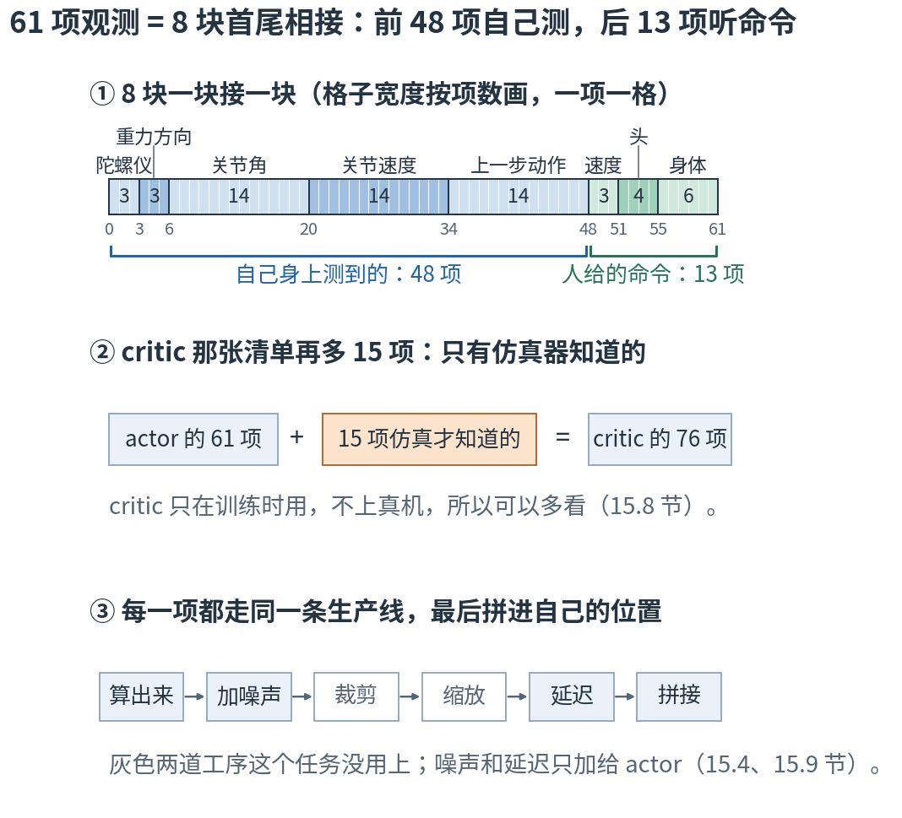
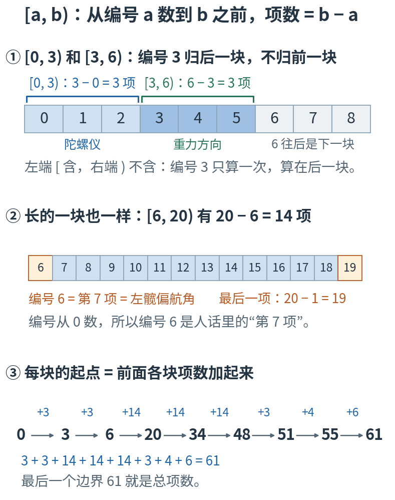
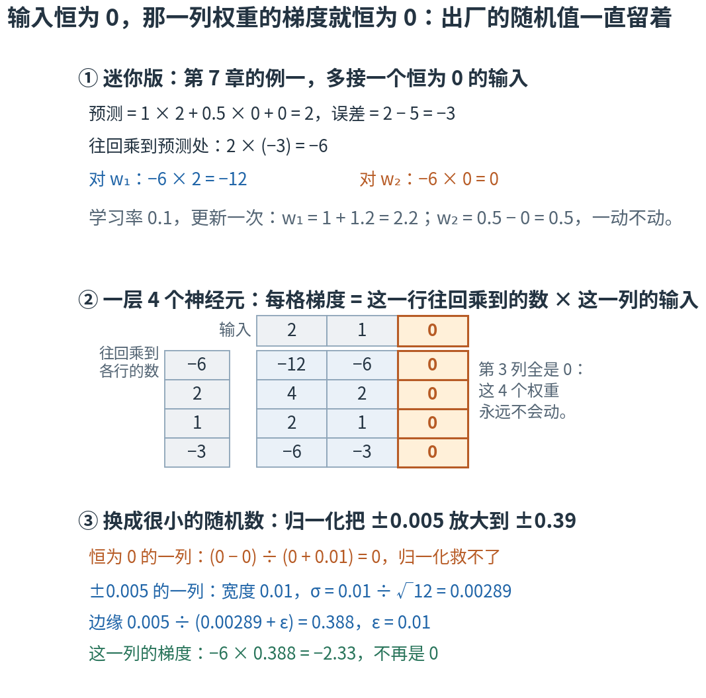
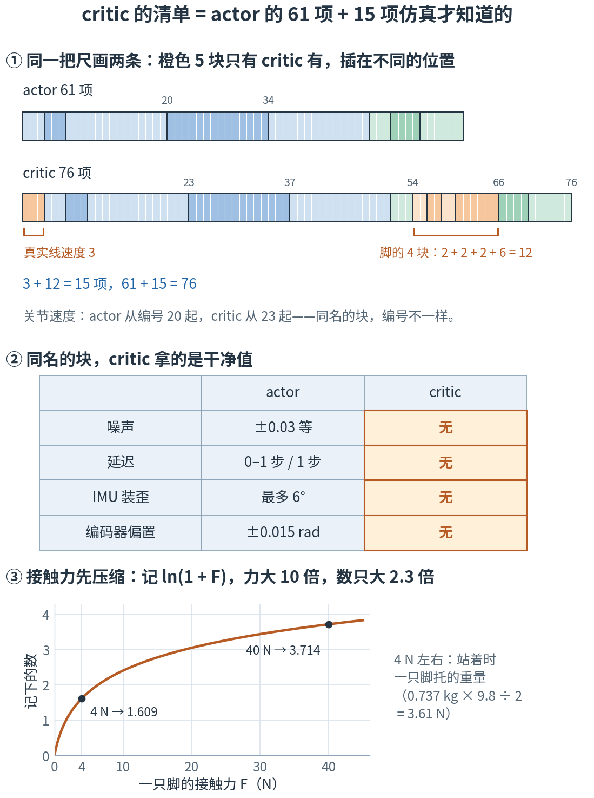

# 第 15 章 · 61 维观测逐位拆解：一张 61 项的清单，8 块首尾相接

> **上一部我们有了什么**：从走廊小游戏到 PPO 的全部算法。策略每 0.02 秒看一张 61 项的清单、吐出 14 个动作；critic 看 76 项，给处境打分。
> 算法只管把这些数当输入，并不关心它们是什么意思。
>
> **这一章要补什么**：第 4 部不再引入新算法，只把前面的每个概念对到 Microduck 的具体数字上。这一章先拆"策略看到什么"：
> 61 个数每一个是什么物理量、什么单位、加了多少噪声、晚了几步；critic 为什么能多看 15 个数；为什么有 6 个数几乎永远接近 0，却不能删。
>
> **本章新词**：半开区间、本体感受、命令块、热切换、零填充、死权重、特权观测。
> **需要的前提**：第 2 章的清单、投影重力和切片（2.1、2.4、2.7 节），第 4 章的均匀分布和它的标准差（4.2、4.4 节），第 7 章的反向传播（7.2 节），
> 第 8 章的归一化和烘焙（8.2、8.3、8.6 节），第 9 章的状态与观测（9.3 节）。**不要求**会三角函数：用到角度的地方都直接给了数；想补弧度，[附录 D.2](../appendix/D-三角函数从0补课.md) 几分钟就够。
> 标"进阶"的折叠块可以第二遍再读。

---

## 15.0 先看地图：一张 61 项的清单，8 块首尾相接

**策略每一步看到的 61 个数，是 8 块首尾相接拼成的：前 5 块共 48 项，是机器人用自己身上的传感器测到的；后 3 块共 13 项，是人给它的命令。
每一项的位置、单位都是定死的；训练时还故意让读数差一点、晚一点。critic 那一份再多 15 项，只有仿真器才知道。**

第 2 章 2.1 节说过，61 维观测就是"每次要填 61 个数字的记录单"。现在把这张单子拿到手里看。它很像医院的体检表：
前面几栏是仪器测的（体温、心率、血压），最后一栏是医生写的医嘱（"每天走半小时"）。每一栏在表上的位置是印死的：
护士永远把体温写在第一格，医生永远去第一格找体温。仪器有误差，化验单总是晚一点才送到。
哪怕这家医院不测血压，那一格也得留着——表的格式一变，别处的医生就读不懂了。
实习期间，还有一位带教老师在旁边给实习医生的每个决定打分；老师手里是加长版，多几栏化验室才出得来的结果。实习医生将来独立出诊，老师不跟着去，手里只有那张基本表。

这一章就是逐栏读这张表。



**读图顺序：** 从 ① 到 ③ 竖着读。① 是全章的骨架：8 块按项数画成一条，一项一格，格子数得清；下面的小数字是每块的起点，最后的 61 是总项数。
前 48 项（蓝）是机器人自己测的，后 13 项（绿）是人给的命令。② critic 在这 61 项之外再多看 15 项。③ 每一项交出去之前，都走同一条生产线。
块名和数字现在不用记，15.1–15.9 节会一块一块讲。

| 概念 | 它在回答什么问题 | 体检表里对应什么 | 在哪一节 |
|---|---|---|---|
| 半开区间 [a, b) | 某一块占编号几到几？一共几项？ | 第几格到第几格 | 15.1 |
| 本体感受 | 前 48 项：机器人自己能测到什么？ | 仪器测的那几栏 | 15.2–15.3 |
| 噪声与延迟 | 训练时为什么故意让读数差一点、晚一点？ | 仪器有误差，化验单晚一点到 | 15.4 |
| 命令块 | 后 13 项：人要它做什么？ | 医嘱栏 | 15.5 |
| 热切换 | 为什么好几个策略必须读同一张表？ | 别处的医生也读得懂 | 15.6 |
| 零填充、死权重 | 用不上的格子为什么不删？为什么又不能真的填 0？ | 不测血压也得留着那格 | 15.7 |
| 特权观测 | critic 多看的 15 项是什么？ | 带教老师手里的化验结果 | 15.8 |
| 生产线 | 一项数从测出来到交出去，经过哪几道工序？ | 测量、誊写、送达 | 15.9 |

表里的名字先不背，到了各节再给。本章最容易混的四处，先贴上标签：

- **编号和"第几项"**：代码从 0 数，人话从 1 数。编号 6 就是第 7 项（第 2 章 2.1 节："数学从 1 数起，代码从 0 数起"）。说整张清单里的位置，本章一律用编号；说一块**里面**的第几项，照人话从 1 数："陀螺仪的第 2 项"是编号 1，"关节角那一块的第 4 个"是编号 9。
- **本章的 8 块和第 8 章 8.2 节的 6 块**：是同样的 61 项。第 8 章和部署演练脚本（📍 里的 `scripts/infer_policy.py`）把 3 块命令并成一块 13 项，所以数成 6 块；训练配置里命令是分开的 3 块，所以是 8 块。
- **观测噪声和动作噪声**：本章的噪声加在**读数**上，模拟传感器不准；第 4 章 4.7 节的噪声加在**动作**上，为了探索。两样东西，互不相干。
- **"零填充"填的不是零**：名字里有"零"，训练时喂的却是很小的随机数。15.7 节解释为什么真填 0 反而坏事。

现在觉得这些区别有点抽象很正常，读到对应小节就清楚了。

第一次读，按顺序看正文、图和手算；标"进阶"的折叠块可以先跳过。本章有两个实验：GPU 实验真建环境、打印一帧真实的观测；
CPU 实验不建环境，从配置里把每个常数读出来核对，并画出本章的图。两个都是复核工具，不是阅读门槛。

## 15.1 读表的三把钥匙：[a, b) 数项数，rad 量角度，一步是 0.02 秒

后面每一节都要读"某一块占编号几到几、单位是什么、晚几步"。先把三件工具备齐。

### 第一把：[a, b) 读作"从 a 到 b 之前"

第 2 章 2.7 节说过，切片 `:2` 是"从开头取到编号 2 **之前**"，取到的是编号 0 和 1。本章的表都按这个规矩写区间：

- 陀螺仪占 [0, 3)：编号 0、1、2，一共 3 − 0 = **3** 项。
- 重力方向紧接着占 [3, 6)：编号 3、4、5，一共 6 − 3 = **3** 项。
- 关节角占 [6, 20)：编号 6 到 19，一共 20 − 6 = **14** 项；最后一项的编号是 20 − 1 = 19，不是 20。

两条规矩就够用：**项数 = 右端 − 左端**；**上一块的右端，就是下一块的左端**。编号 3 不归陀螺仪、归重力方向——左端算、右端不算，
所以每个编号恰好只归一块，块和块之间既没有缝，也不重叠。

这种"左端含、右端不含"的区间叫**半开区间**（half-open interval），写成 [a, b)：方括号表示含，圆括号表示不含。

| 符号 | 怎么读 | 就是 |
|---|---|---|
| $[a, b)$ | "a 到 b，左闭右开" | 编号 a、a + 1、……、b − 1，一共 b − a 项 |
| `x[a:b]` | "x 从 a 切到 b" | 代码里的同一件事（第 2 章 2.7 节） |



**这样读图：** ① 编号 3 被蓝、绿两个括号夹在中间：它是蓝块的右端（不含），又是绿块的左端（含），只算一次。
② 长块也一样：20 − 6 = 14，最后一项是 19。编号 6 是人话里的第 7 项——第 2 章 2.1 节说"第 7 位永远是左髋偏航角"，指的就是这一格。
③ 把 8 块的项数依次加起来，每一步的累计就是下一块的起点；加到最后是 61。

CPU 实验第 1 节不建环境，从配置和机器人模型推出这 8 块，边界依次是 0, 3, 6, 20, 34, 48, 51, 55, 61。
GPU 实验真建了 4 个环境（它的第 1 节确认 actor 61 项、critic 76 项、一步 0.02 s）。GPU 实验第 2 节读出的表，和 CPU 推出的逐行对上：

```
           观测块  维数  索引区间
-----------------  ----  --------
     base_ang_vel     3     [0:3)
projected_gravity     3     [3:6)
        joint_pos    14    [6:20)
        joint_vel    14   [20:34)
          actions    14   [34:48)
          command     3   [48:51)
     head_command     4   [51:55)
     body_command     6   [55:61)
```

**怎么读这段输出**：左列是代码里每一块的名字，中间是项数（输出里叫"维数"），右列是区间——`[0:3)` 就是本节的 [0, 3)。
从上往下，每行的右端 = 下一行的左端，最后一行停在 61。前 5 行加起来 48，后 3 行加起来 13。每块叫什么、是什么，15.2–15.5 节一块一块讲。

### 第二把：rad 是转到了哪，rad/s 是转得多快

项目里的角度都用弧度（rad）。换算只记一句：π rad = 180°，所以 1 rad ≈ 57.3°，0.1 rad ≈ 5.73°（[附录 D.2](../appendix/D-三角函数从0补课.md)）。

rad/s 是"每秒转多少弧度"，说的是**快慢**，不是转到了哪。一个关节以 0.5 rad/s 的速度转 0.02 s，只转过 0.5 × 0.02 = 0.01 rad，约 0.57°。

> ⚠️ **rad 和 rad/s 只差"每秒"两个字，意思差得远。** 关节角那一块的单位是 rad，关节速度那一块是 rad/s。两块紧挨着，数的大小也差不多：
> 关节角读到 0.5，是已经比站姿多转了约 29°；关节速度读到 0.5，是这一步只转了约 0.57°。读表先看单位。

### 第三把：一步 = 0.02 秒

"一步"指策略做一次决定：看一张 61 项的清单，吐出 14 个动作。仿真器内部每 0.005 s 算一次物理，算 4 次（代码里叫 `decimation = 4`）才交一张新清单，
所以一步 = 4 × 0.005 = **0.02 s**，一秒 50 步。本章说"延迟 1 步"，就是晚 0.02 s = 20 毫秒。

CPU 实验第 1 节把这三把钥匙里的数（57.3°、5.73°、0.01 rad、0.02 s）都从配置和公式里重算了一遍。

> **停一下，自测**：速度命令占 [48, 51)，头部命令紧接着占 4 项。头部命令的区间怎么写？最后一项的编号是几？另外，0.3 rad 大约是多少度？
> <details><summary>答案</summary>
>
> 左端接着上一块的右端 51，右端是 51 + 4 = 55：[51, 55)，最后一项编号 55 − 1 = 54。0.3 rad ≈ 0.3 × 57.3 = 17.19°，约 17°。
>
> </details>

## 15.2 前 48 项（一）：身体歪没歪、转多快——陀螺仪 3 项，重力方向 3 项

前 5 块、48 项有一个共同点：全是机器人**用自己身上的传感器**测出来的——就像你闭着眼也知道自己的胳膊弯没弯、身子歪没歪。
这类"自己感觉自己"的信息叫**本体感受**（proprioception）。它不包括"离墙多远""前面的地平不平"这种要看外面才知道的事。

打头的两块来自躯干里的 **IMU**（惯性测量单元：一块小芯片，里面有测转速的陀螺仪，和用来估计重力方向的加速度计）：

| 编号 | 块（代码名） | 是什么 | 单位 |
|---|---|---|---|
| 0–2 | 陀螺仪 `base_ang_vel` | 躯干绕自己的前后（x）、左右（y）、上下（z）三根轴，各转多快 | rad/s |
| 3–5 | 重力方向 `projected_gravity` | 第 2 章 2.4 节的投影重力：从机器人自己看，"下"在哪一边 | 无单位（理想时长度为 1） |

两块都用第 2 章 2.4 节那套钉在躯干上的轴（x 朝前、y 朝左、z 朝上），跟着身体转。训练和真机必须用同一套轴：同样是 3 个数，要是按房间的轴填进去，形状不变，意思全错。

GPU 实验第 3 节让 4 只机器人做了 30 步随机小动作，然后打印第 0 号机器人的一帧。前两块是：

```
  base_ang_vel       [ 0: 3)  [-0.032  0.677 -0.163]
  projected_gravity  [ 3: 6)  [ 0.243  0.012 -0.971]
```

逐项翻译：

1. **歪了多少**：用第 2 章 2.4 节和[附录 D.6](../appendix/D-三角函数从0补课.md) 的办法，倾角 = arccos(−g_z) = arccos(0.971) ≈ 13.8°，约 14°。
   浏览器控制台里按一下 `Math.acos(0.971) * 180 / Math.PI` 就能核对。
2. **往哪边歪**：第 1 项 0.243 为正，第 2 项 0.012 几乎为 0。按第 2 章 2.4 节的约定，这是**往前倾**。
3. **转得多快、往哪边转**：陀螺仪三项里第 2 项最大，是绕左右轴（y 轴）转，也就是"点头"的那个方向：0.677 rad/s ≈ 每秒 38.8°。一步 0.02 s 里只转 0.677 × 0.02 = 0.01354 rad ≈ 0.78°。
   正负号按**右手定则**读：右手握拳、竖起大拇指，让大拇指指向这根轴的正方向，四根手指弯的方向就是"正着转"。y 轴朝左，大拇指就指向左边；自己比一下，四指是从头顶往前、再往下弯的——绕 y 轴正着转，就是**往前低头**。所以 +0.677 说的是：这一刻它正往前栽，前倾还在加大。（15.5 节"ωz 为正是左转"也是这条规矩，大拇指朝上。）
4. **长度不是 1**：√(0.243² + 0.012² + 0.971²) = 1.001。重力方向理想时是单位向量，可 actor 看到的每一项都加过一点噪声（15.4 节），长度就不再恰好是 1。

它为什么歪？这只机器人身上没有训练好的策略，只是在随机抖；GPU 实验用的是演示模式（`play=True`），还会每 0.5–1 秒推它一把。歪 14° 不奇怪，离摔倒还远：
倾角超过 70°，也就是 g_z 高过 −0.342（−cos 70°），才算摔倒，这一回合就此结束（第 2 章 2.4 节）。
严格说，13.8° 是 actor **读到**的倾角：读数带着噪声，还有下面马上要讲的"装歪"，真实的倾角可能差几度。

**IMU 故意"装歪"。** 真机的 IMU 焊在板子上，不可能装得绝对正。所以每只机器人在训练一开始随机抽一根转轴、转一个 0 到 6° 之间的角度，整个训练都不变；
陀螺仪和重力方向两块用同一个旋转。站得笔直的机器人，也可能读到自己歪了 6°：g_z = −cos 6° = −0.9945，水平分量最多 sin 6° = 0.105。
这是第 17 章（域随机化）的一种，先不背。它练的是"IMU 装得不太正也能走"；
但转轴是随机的，它抵消不了一个**固定方向**的偏差——项目的真机板子就有约 5° 的固定前后偏差，那是在运行时校准掉的，不靠训练。

CPU 实验第 2 节从这一帧和配置里，把 1.001、13.8°、38.8°/s、0.78°、70° 和 6° 的两个分量都重算了一遍，还用一个小旋转核对了右手定则读出的正负号。

> **停一下，自测**：另一只机器人读到重力方向 (0, −0.5, −0.866)。它歪了多少度？往哪边歪？
> <details><summary>答案</summary>
>
> arccos(0.866) = 30°（[附录 D.3](../appendix/D-三角函数从0补课.md) 的表：cos 30° ≈ 0.866）。第 1 项是 0：不往前也不往后。
> 第 2 项 −0.5：按第 2 章 2.4 节"y 轴朝左"的约定，往左歪时 g_y ≈ +0.5；这里是负的，所以是**往右**歪了 30°。
>
> </details>

## 15.3 前 48 项（二）：14 个关节的角度、速度，和上一步的动作

接下来三块各 14 项，一项对应一个舵机，顺序是固定的：

| 关节组 | 关节（按顺序） | 关节角的编号 | 关节速度的编号 | 上一步动作的编号 |
|---|---|---|---|---|
| 左腿 | 髋偏航、髋横滚、髋俯仰、膝、踝 | 6–10 | 20–24 | 34–38 |
| 颈和头 | 颈俯仰、头俯仰、头偏航、头横滚 | 11–14 | 25–28 | 39–42 |
| 右腿 | 髋偏航、髋横滚、髋俯仰、膝、踝 | 15–19 | 29–33 | 43–47 |

同一个关节在三块里排在同一个位置：左膝是每块的第 4 个，编号分别是 9、23、37。

**关节角 [6, 20)：减掉站姿之后的差。** 每个关节先读舵机里的**编码器**（测转角的传感器），再减去这个关节在标准站姿 HOME 时的角度（第 8 章 8.2 节）。
手算一次，用教学构造的数（接近颈俯仰关节真实的 HOME 0.3491 rad，也就是 20°）：HOME 是 0.35 rad，编码器读到 0.40 rad，
填进清单的是 0.40 − 0.35 = **0.05 rad**，约 2.9°。它说的是"比站姿多转了约 2.9°"，不是"关节转到了 2.9°"。
好处是：站着不动时，这 14 项全在 0 附近——最常见的姿势，在输入里是一个干净的零点。

**关节速度 [20, 34)：每个关节转多快**，单位 rad/s。它的正负号和关节角各管各的：关节角 +0.05、速度 −0.2 rad/s，
意思是"比站姿多转了一点，正往回转"，并不矛盾，不能因为两个符号相反就以为传感器坏了。

**上一步动作 [34, 48)：策略自己上一步吐出的 14 个数。** 每个数的意思是"目标角比站姿多转多少"（单位 rad，目标角 = HOME + 动作）。
它不是传感器读数，是策略自己记下的。为什么要喂回去？舵机追目标要时间。假设上一步的动作是 +0.10，现在关节角还只有 +0.05：
两个数都在，网络才分得清"已经到了"和"还差 0.05，正在追"；只看关节角，这两种情况一模一样。
第 9 章 9.3 节的折叠（马尔可夫性质）说，知道"现在"就足以预测下一步——前提是"现在"记得够全；把上一步的动作喂回去，就是让这一帧记得更全的一个办法。
第 16 章（奖励）里让动作平滑的那一项，罚的也正是相邻两步动作的差。

那一帧的三块：

```
  joint_pos          [ 6:20)  [ 0.004  0.012 -0.043  0.162 -0.086 -0.026  0.035 -0.02   0.022 -0.004 -0.001  0.045 -0.123  0.075]
  joint_vel          [20:34)  [-0.171  0.101 -0.01   0.069 -0.714 -0.351  0.084 -0.217 -0.014 -0.273 -0.267  0.667  0.152 -0.01 ]
  actions            [34:48)  [ 0.108  0.067 -0.022 -0.031 -0.007 -0.007  0.094 -0.014  0.007 -0.006 -0.047 -0.04  -0.037 -0.005]
```

读几个数：

- 关节角离 0 最远的是第 4 个数 0.162（编号 9，左膝）：左膝比站姿多转了 0.162 rad ≈ 9.3°。
- 关节速度离 0 最远的是第 5 个数 −0.714（编号 24，左踝）。
- 动作全在 ±0.11 以内：GPU 实验喂的是随机小动作，不是训练好的策略。
- 同一张清单里，左髋偏航的关节角只有 0.004，重力方向第 3 项是 −0.971，大小差 0.971 ÷ 0.004 ≈ 243 倍。0.004 是这一帧碰巧小（关节角平常能到 ±0.5 rad），但各列**平常的大小**本来就差得远：第 8 章 8.2 节的表里，关节速度 ±8 是身体位置命令 ±0.005 的 1600 倍。这才是第 8 章要给每一列各配一把尺子的原因。

**没有前进速度。** 本体感受里没有"我相对地面走多快"：机器人身上没有 GPS，也没有能直接测对地速度的传感器。
mjlab 的模板里本来有这一块（身体线速度 `base_lin_vel`），项目把它从 actor 的清单里**删掉**了，策略只能从关节速度和陀螺仪里**推断**自己走得多快。
这就是第 9 章 9.3 节（状态与观测）说的"状态里有、观测里没有"。模板里的地形扫描 `height_scan` 也删了：机器人身上没有扫地形的传感器。

**编码器偏置：一把歪尺子，两头一起歪。** 真机的编码器装配时有零点误差：同一个角度，这只读得偏大一点，那只偏小一点。
（这里的"偏置"说的是读数整体歪了一点，和第 6 章网络里的偏置 b 同名，不是一回事。）
训练一开始，每只机器人给每个关节抽一个固定的偏差，在 ±0.015 rad（约 ±0.86°）之间，整个训练不变。
actor 看到的关节角带着这个偏差；动作换算成目标角时，mjlab 也减掉同一个偏差——真机上，编码器读数和舵机目标用的是同一把歪尺子，仿真也得一样歪。
critic 看到的关节角不带偏差（15.8 节）。

CPU 实验第 3 节从机器人模型里读出 14 个关节的顺序和 HOME，核对了上面的编号表、0.05 rad ≈ 2.9°、左膝 9.3°、243 倍和 1600 倍、±0.86°。

> **停一下，自测**：某关节 HOME = 0.35 rad，编码器读到 0.30 rad，上一步的动作是 +0.10。清单里关节角那一项填多少？这个关节离它的目标还差多少？
> <details><summary>答案</summary>
>
> 关节角填 0.30 − 0.35 = −0.05 rad。目标是比站姿多 0.10，现在比站姿少 0.05，还差 0.10 − (−0.05) = 0.15 rad，正在追。
>
> </details>

## 15.4 噪声和延迟：每一项都"差一点、晚一点"

真机的传感器没有一个是准的，也没有一个是即时的：陀螺仪的读数带着抖，舵机报上来的速度是一小段时间的平均，从测量到策略拿到还要排队。
如果仿真里给策略的全是完美、即时的数，它就会依赖这种完美——上了真机，读数一抖，它就不会走了。所以训练时故意把 actor 的读数弄得"差一点、晚一点"：

| 块 | 噪声（每项、每步重新抽） | 延迟 |
|---|---|---|
| 陀螺仪 | ±0.03 rad/s | 0 或 1 步（每 64 步重抽一次） |
| 重力方向 | ±0.01 | 0 或 1 步（同上） |
| 关节角 | ±0.001 rad | 无 |
| 关节速度 | ±0.25 rad/s | 固定 1 步 |
| 上一步动作、3 块命令 | 无 | 无 |

**噪声**：每一步、每一项，从第 4 章 4.2 节的均匀分布里抽一个数，加到读数上（表里写 ±0.25，就是从 U(−0.25, 0.25) 里抽）。拿关节速度算一下：真实值 0.40 rad/s，
actor 读到的可能是 0.40 − 0.25 = 0.15 到 0.40 + 0.25 = 0.65 之间的任何数。±0.25 听着大，放到第 8 章 8.2 节估的典型幅度 ±8 rad/s 上，只占约 3%。
关节角的噪声 ±0.001 rad 才约 0.057°：编码器本来就准，它真正的不准是上一节那个固定的偏置。

**延迟**：关节速度**固定晚 1 步**。这是照着真舵机定的：舵机固件取最近一小段位置读数的平均来算速度，策略读到的速度天然就晚一个控制周期左右。
陀螺仪和重力方向是 **0 或 1 步**：每只机器人自己抽，每 64 步（64 × 0.02 = 1.28 s）重抽一次。上一步动作和命令本来就在策略手里，不加噪声，也没有延迟。

延迟怎么做出来？排一个队：每一步把新读数放到队尾，交出去的是往回数第 1 个。前端的写法：

```js
const history = [];
function delayed(value, lag = 1) {
  history.push(value);                                   // 这一步的新读数排到队尾
  const i = Math.max(0, history.length - 1 - lag);       // 往回数 lag 个；队里还不够，就拿最早那个
  return history[i];                                     // 交给策略的是这一个
}
```

手算一次。某关节连续 5 步的真实速度是 0.10、0.30、0.50、0.70、0.90（教学构造的数）。晚 1 步交出去的依次是 0.10、0.10、0.30、0.50、0.70：
第 0 步队里只有一个数，只能先交它；从第 1 步起，每次交的都是上一步的数。
CPU 实验第 4 节用这段队列和 mjlab 自己的延迟缓冲各算一遍，两串数一样；噪声和延迟的设置也从配置里读出来核对了，GPU 实验第 5 节从建好的环境里读出的是同一张表。

> **停一下，自测**：某关节这一步的真实速度是 0.40 rad/s，上一步是 0.20 rad/s。actor 这一步读到的关节速度，可能落在什么范围？
> <details><summary>答案</summary>
>
> 关节速度固定晚 1 步，交出来的是上一步的 0.20，带着上一步抽的噪声（噪声在排队之前就加上了，15.9 节）：0.20 − 0.25 = −0.05 到 0.20 + 0.25 = 0.45 之间。
> 它甚至可能是负的。策略得学会不被一两步的读数带偏。
>
> </details>

## 15.5 后 13 项：命令块——走多快、头朝哪、身体怎么摆

后 3 块不是测出来的，是人告诉机器人"现在该做什么"。这 13 项合起来叫**命令块**（command block）。

| 编号 | 块（代码名） | 每一项是什么 | 单位 | 训练时的抽样范围 |
|---|---|---|---|---|
| 48–50 | 速度命令 `command` | 前后速度 vx、左右速度 vy、转向速度 ωz | m/s、m/s、rad/s | ±0.4、±0.3、±1.0，整个训练不变 |
| 51–54 | 头部命令 `head_command` | 颈俯仰、头俯仰、头偏航、头横滚 4 个关节的目标偏移（相对 HOME） | rad | 起步 ±0.05、±0.05、±0.07、±0.015；训练中途按计划逐步放宽（这叫课程，第 18 章讲），最后 ±1.10、±1.10、±1.40、±0.31 |
| 55–60 | 身体命令 `body_command` | 躯干姿态的目标偏移：x、y、z 三个位置，横滚、俯仰、偏航三个角度 | m、rad | 位置 ±0.005、角度 ±0.05，**永远这么小** |

方向照第 2 章 2.4 节那套轴：vx 为正是往前，vy 为正是往左，ωz 为正是从上往下看逆时针转，也就是左转。

换成人话：速度命令最快 0.4 m/s，一秒走 40 厘米。头部命令最后放宽到 ±1.10 rad ≈ ±63°（颈、头俯仰）、±1.40 rad ≈ ±80°（头偏航）、
±0.31 rad ≈ ±18°（头横滚，机械上本来就转不了多少）——每个关节按自己够得着的范围定，不是统一的一个数。
身体命令的 ±0.005 m 只有 5 毫米，±0.05 rad 约 2.9°。

**命令怎么变**：每只机器人的速度命令每 3–8 秒重抽一次，头和身体的每 2–5 秒重抽一次，两次之间保持不变。
另外总有一部分机器人拿到**恰好全零**的速度命令，意思是站着别动：起步时 2%，课程里慢慢涨到 25%。
第 4 章 4.2 节说过，光靠均匀地抽，几乎永远抽不到恰好全零，而"站着别动"偏偏是真机上最常见的命令。头部命令的范围怎么随训练放宽，第 18 章（课程学习）细讲。

那一帧的命令块：

```
  command            [48:51)  [0.231 0.267 0.613]
  head_command       [51:55)  [ 0.046 -0.042 -0.038 -0.005]
  body_command       [55:61)  [-0.004  0.005 -0.    -0.029 -0.039  0.   ]
```

翻译：要它前进 0.231 m/s、同时往左 0.267 m/s、左转 0.613 rad/s ≈ 每秒 35°。头部命令 4 项都在起步范围 ±0.05、±0.05、±0.07、±0.015 以内：
GPU 实验建的是刚开局的环境，课程还没往前走。身体命令的位置都在 5 毫米以内，角度都在 0.05 rad 以内。`-0.` 是一个很小的负数，按 3 位小数打印成了 0。
这只机器人并没有照着命令走：它身上没有训练好的策略，只有随机小动作。命令只是被抽出来，填进了清单。


**这样读图：** 左边是块名和区间；右边第一行是原始数（或其中最显眼的一个），第二行是翻成的人话。
①（蓝字）五块是 15.2–15.3 节翻过的，②（绿字）三块是本节刚翻的。整张图读下来是一句话：一只往前歪了约 14°、还在往前栽的机器人，被要求一边前进、往左，一边左转。

CPU 实验第 5 节从配置里读出所有命令范围、重抽间隔和全零命令的比例，并核对这一帧都落在范围里。

## 15.6 同一张清单，几个策略轮流读：热切换

Microduck 不止一个策略：走路一个，站着一个，还有坐下再站起、踢球、前滚翻……每个都是单独导出的一个 ONNX 文件（第 8 章 8.6 节）。
真机上按一下按钮，运行时就换一个文件，读同一张清单、出同一种格式的 14 个动作，机器人不用停下来。这叫**热切换**（hot-swap）。

热切换的前提是：**所有策略都用同一张 61 项的清单**。仓库的 AGENTS.md 把"61 项的布局"列为不能破坏的规矩，原因就在这里。

"同一张清单"不只是"都是 61 个数"。拿速度命令举例，约定是 [vx, vy, ωz]。一个策略要求 [0.2, 0, 0.5]：前进 0.2 m/s，同时以 0.5 rad/s 左转。
要是哪段代码把第 1、3 项填反了，网络读到的是 [0.5, 0, 0.2]：前进 0.5 m/s（比训练时的上限 0.4 还快），转向只有 0.2 rad/s。
形状照样是 3 项，任何"长度对不对"的检查都会通过（部署演练脚本启动时就有这样一道长度检查，见 📍），任务却完全变了。

> ⚠️ **形状对了，不等于意思对了。** 热切换要求这些全都一致：块的顺序、每块里各项的顺序、单位、坐标系、HOME、关节顺序、每个命令的含义。
> 举两个项目里真实存在的坑。其一，有的机器人模型带着不装舵机的关节（名字都以 `passive_` 开头，比如轮子），它们在关节列表里**插在中间**，
> "关节列表的前 14 个就是 14 个舵机"并不成立，得按名字把舵机关节挑出来。
> 其二，"坐下再站起"那个策略把"坐 / 站"的开关写在速度命令的第 1 项（1 是坐下，0 是站起），运行时必须按它的约定填；全填 0，它的意思是"站着"。

部署那头怎么拼，📍 会看一眼仓库里的部署演练脚本：拼的顺序和训练的 8 块一致（3 块命令在那里是一个 13 项的数组）；导出的 ONNX 文件里还记着这 8 块的名字和顺序，第 19 章（导出与部署）会用到。

CPU 实验第 6 节核对了对调之后的 0.5 超出训练范围，以及下面自测里的长度 0.073。

> **停一下，自测**：头部命令恰好有 4 项。有人说："4 个数，那就是表示头朝向的四元数吧？"（四元数是另一种用 4 个数表示旋转的写法，表示旋转时，4 个数的长度必须是 1。）
> 用那一帧的 (0.046, −0.042, −0.038, −0.005) 验证一下。
> <details><summary>答案</summary>
>
> 不对。这 4 项是颈俯仰、头俯仰、头偏航、头横滚 4 个关节各自的目标偏移。那一帧的长度 √(0.046² + 0.042² + 0.038² + 0.005²) = 0.073，远不是 1。
> 读一串数，必须连同它的布局约定一起读，不能凭"有几个数"猜意思。
>
> </details>

## 15.7 用不上的格子：零填充，而且不能真的填零

身体命令那 6 项，在走路任务里其实没用：奖励里对应的那一项权重是 0（第 16 章），走路时也不需要谁告诉它躯干往哪歪几毫米。
可"摔倒后站起来"那个任务要用它：告诉机器人躯干该摆成什么姿势。

要是走路任务把这 6 项删了，它的清单就只剩 61 − 6 = 55 项，和站立策略的 61 项对不上，两个 ONNX 就不能热切换了。
所以仓库的规矩是：**用不上的块也原样占着位置，不删**。这叫**零填充**（zero-padding），名字来自"没用的位置填 0"。

可项目里并没有真的填 0，而是在一个很小的范围里随机抽（身体命令就是 ±0.005 m、±0.05 rad）。为什么？

### 迷你版：第 7 章的例一，多接一个恒为 0 的输入

回到第 7 章 7.2 节的例一：x = 2、真值 y = 5、w = 1、偏置 b = 0，误差 −3，往回乘到预测处是 2 × (−3) = −6，对 w 的梯度是 −6 × 2 = −12。

现在给它多接一个输入，永远是 0（就像一个填了 0 的命令格子），配一个权重 0.5（网络刚建好时随手填的初值）。
为了分清两个，原来的输入和权重改叫 x₁、w₁，新接的叫 x₂、w₂：

- 预测 = 1 × 2 + 0.5 × 0 + 0 = 2，误差还是 −3，往回乘到预测处还是 −6。
- 对 w₁：乘加机器对 w₁ 的本地汇率是 x₁ = 2，梯度 −6 × 2 = −12，和第 7 章一样。
- 对 w₂：本地汇率是 x₂ = 0，梯度 −6 × 0 = **0**。

学习率取 0.1，更新一次：w₁ = 1 − 0.1 × (−12) = 2.2；w₂ = 0.5 − 0.1 × 0 = 0.5，**没动**。再更新一千次也一样：只要 x₂ 一直是 0，w₂ 拿到的梯度就一直是 0，永远停在出厂时的 0.5。

真正的麻烦在后面：换了任务、或者课程把范围放宽了，x₂ 第一次变成 0.3，这个权重给出 0.5 × 0.3 = 0.15——一个从来没学过、随手填的贡献。网络对这个输入的反应，等于是随机的。

这种因为输入恒为 0、永远拿不到梯度、一直停在初值上的权重，叫**死权重**（dead weights）。仓库的 AGENTS.md 说得很直白：

> A command input that is never non-zero has dead weights forever.
>
> （一个从来没有非零过的命令输入，它连着的权重永远是死的。）



**这样读图：** ① 就是上面的手算。② 把它推到一层 4 个神经元：每个神经元有一个"往回乘到这一行的数"（左边一列，教学构造的数），
每一格的梯度 = 这一行的数 × 这一列的输入。第 3 列的输入是 0，这一列 4 格全是 0。真网络的第一层有 512 行，那一列的 512 个权重都一样一动不动。③ 是换成小随机数的情况，下面马上算；③ 里的 ε 就是第 8 章 8.3 节分母上那个防止除以 0 的 0.01。

### 小范围随机：让这一列活着

规矩的后半句是：**用不上的格子也要喂一点非零的数**，从训练一开始就喂。身体命令的位置在 ±0.005 m 里抽，看着小得可怜——
可别忘了，网络看到的不是原始读数，是第 8 章 8.3 节归一化之后的数。先把那条换算搬过来：

**归一化后的数 = (读数 − 这一列的平均) ÷ (这一列的标准差 + ε)**，ε 是一个固定的小数 0.01，只为防止除以 0。

- 恒为 0 的一列：平均是 0，标准差也是 0，归一化后是 (0 − 0) ÷ (0 + 0.01) = 0。归一化救不了它。
- ±0.005 的一列：从 −0.005 到 0.005，宽度 0.01。第 4 章 4.4 节说，均匀分布的方差 = 宽度² ÷ 12；标准差是方差开根号，所以标准差 = 宽度 ÷ √12 = 0.01 ÷ 3.464 = 0.00289（√12 ≈ 3.464）。
  边缘的 0.005 归一化后是 0.005 ÷ (0.00289 + ε) = 0.005 ÷ (0.00289 + 0.01) = **0.388**。浏览器控制台里按 `0.005 / (0.01 / Math.sqrt(12) + 0.01)` 可以核对。

> ⚠️ **这里有两个 0.01，是两样东西。** 一个是这一列的宽度（0.005 − (−0.005)），一个是分母里的 ε。数值碰巧相等：范围改小，宽度跟着变小，ε 不变——"改一改"第 2 条改的就是范围。

原始读数只有几毫米，进网络时能到 ±0.39：比别的列小一些（ε 在分母里压着它，第 8 章 8.3 节），但已经不是 0。同一个例子里，这一列的梯度就是 −6 × 0.388 = −2.33，不再是 0。

有两件事要分清：

- 零填充是**接口上的规矩**：位置必须占着，谁也不许删，不然后面的块全部错位。
- 小范围采样是**学习上的讲究**：让那一列一直有梯度，权重不死。它只保证"有机会学"，不保证"学会了"——走路任务里身体命令的奖励权重是 0，网络很可能学成"不理这 6 项"。
  真要让某个命令起作用，还得有对应的奖励（第 16 章）。

所以头部命令起步时也不是 0，而是 ±0.05 这样的小范围：课程后面要把它放宽到 ±1.10，到那时，这些输入连着的权重早就是活的了（第 18 章）。

<details>
<summary>进阶：一般的式子——恒为 0 的第 j 列，512 个权重的梯度全是 0（现在可跳过）</summary>

第一层第 k 个神经元先算 $z_k = \sum_j W_{kj}\,x_j + b_k$（第 2 章 2.6 节那张价格表的一行）。对其中一个权重 $W_{kj}$ 求偏导：
只有 $W_{kj}\,x_j$ 这一项里有它，本地汇率就是 $x_j$。再乘上从损失往回乘到 $z_k$ 的数（第 7 章 7.2 节）：

$$\frac{\partial L}{\partial W_{kj}} = \frac{\partial L}{\partial z_k}\,x_j$$

| 符号 | 怎么读 | 就是 |
|---|---|---|
| $W_{kj}$ | "W k j" | 第一层第 k 行、第 j 列的权重：第 k 个神经元给第 j 项输入标的"价格" |
| $x_j$ | "x j" | 第 j 项输入（归一化之后的） |
| $\dfrac{\partial L}{\partial z_k}$ | "L 对 z k 的偏导" | 往回乘到第 k 个神经元的数（图 ② 左边那一列） |

如果进网络的第 j 列恒为 0，那么对每一个 k，这个乘积都是 0：第 j 列的 512 个权重一起冻住。整张梯度表就是"左边一列 × 上面一行"，图 ② 那张 4 × 3 的表是它的迷你版。

项目用的 Adam（第 7 章 7.5 节）也救不了它：梯度一直是 0，Adam 记的两本账也一直是 0，每次更新走的都是 0。

</details>

CPU 实验第 7 节用 torch 的自动求导把 −12、0 和 4 × 3 的梯度表算了一遍，再用项目的归一化器实测 ±0.005 那一列归一化后的边缘，和手算的 0.388 对上。

> **停一下，自测**：有人提议："头部命令一开局就按最终范围 ±1.10 抽，何必从 ±0.05 起步？"另一个人说："那就干脆先填 0，等课程到了再放开。"两个提议各有什么问题？
> <details><summary>答案</summary>
>
> 第一个是课程的问题：走路还没学会，就要求头转 ±63°，一上来就被一个很难的目标压着——为什么要从容易的开始，第 18 章（课程学习）讲。
> 第二个就是本节的死权重：先填 0，这几项输入连着的权重一直拿不到梯度，停在初值；等课程放开，网络对它们的反应是随机的。
> ±0.05 的小范围两头都顾到了：足够容易，又让这些权重从一开始就在学。
>
> </details>

## 15.8 critic 那张清单多 15 项：特权观测

第 6 章 6.7 节说过，critic 看 76 项，比 actor 多 15 项。多出来的 5 块，每一块都是真机上测不到、或者测不准的：

| 块（代码名） | 项数 | 是什么 | 为什么真机拿不到 |
|---|---|---|---|
| 身体线速度 `base_lin_vel` | 3 | 躯干真实的前后、左右、上下速度 | 没有 GPS，也没有能测对地速度的传感器（15.3 节） |
| 脚离地高度 `foot_height` | 2 | 每只脚离地面多高（仿真里从脚往下打射线量出来） | 脚底没有测距的传感器 |
| 腾空时间 `foot_air_time` | 2 | 每只脚已经离地多久 | 得先知道脚着没着地 |
| 着地没 `foot_contact` | 2 | 每只脚现在碰没碰到地 | 脚底没有触地开关 |
| 接触力 `foot_contact_forces` | 6 | 每只脚受到的地面的力，三个方向各一项 | 脚底没有测力的传感器 |

3 + 2 + 2 + 2 + 6 = 15，61 + 15 = 76。这种只有仿真器才知道、只给训练用的观测，叫**特权观测**（privileged observation）。
为什么能给 critic 看？critic 只在训练时给处境打分，从来不上真机（第 6 章 6.7 节）；它看得越全，"这个处境有多好"就越容易估。
两张网络看的东西不一样，这种做法叫非对称 actor-critic，第 10 章 10.5 节讲过道理：多看不自动保证估得更准、训练更快，它的作用都要通过优势间接传给 actor。

**同名的块，critic 拿的是干净值。** 另外 8 块虽然和 actor 同名，但 critic 这一组的开关 `enable_corruption` 是关着的：不加噪声；
也没有延迟、没有 IMU 装歪的旋转、没有编码器偏置。critic 不需要学会容忍噪声，只需要估得准。

**接触力先压缩，再交出去。** 脚撞地的一瞬间，力可能是站着时的好几倍。直接交给网络，偶尔一个特别大的数，就会把这一列的统计带偏。
所以这一块记的不是力 F 本身，而是 ln(1 + |F|)（自然对数，第 4 章 4.8 节），再带上原来的正负号。加 1 是为了 F = 0 时记下的也是 0：ln 1 = 0。
机器人模型重 0.737 kg，两只脚站着各托一半：0.737 × 9.8 ÷ 2 = 3.61 N（重量 = 质量 × 9.8，初中物理），就按 4 N 算：ln(1 + 4) = ln 5 = 1.609。
力大 10 倍到 40 N，记下的是 ln 41 = 3.714，只大 2.3 倍。反方向的 −4 N 记成 −1.609。
前端写法是 `Math.sign(F) * Math.log1p(Math.abs(F))`（`log1p(x)` 就是 ln(1 + x)）。

GPU 实验第 4 节读出的 critic 清单——总表，不用背：

```
      critic 观测块  维数             
-------------------  ----  -----------
       base_lin_vel     3  ★ 仅 critic
       base_ang_vel     3             
  projected_gravity     3             
          joint_pos    14             
          joint_vel    14             
            actions    14             
            command     3             
        foot_height     2  ★ 仅 critic
      foot_air_time     2  ★ 仅 critic
       foot_contact     2  ★ 仅 critic
foot_contact_forces     6  ★ 仅 critic
       head_command     4             
       body_command     6             
```

**怎么读这段输出**：带 ★ 的 5 块只有 critic 有，其余 8 块和 actor 同名。先数项数，加起来是 76。再看位置：★ 块没有整齐地接在 actor 那 61 项后面，而是插在中间——
身体线速度打头，4 块脚的信息夹在速度命令和头部命令之间。
为什么这么排？mjlab 的模板里，critic 的清单 = actor 的清单（打头就是线速度）+ 地形扫描 + 脚的 4 块；项目从 actor 那份删了线速度、从两份都删了地形扫描，最后在两份末尾各追加头部、身体命令。顺序是这样一步步留下来的，不是谁特意排的。

> ⚠️ **同一个量，在两张清单里的编号不一样。** 关节速度在 actor 里是 [20, 34)，在 critic 里是 [23, 37)：前面多了身体线速度那 3 项（3 + 3 + 3 + 14 = 23）。
> 拿 actor 的编号去 critic 的清单里找东西，会错开 3 格。



**这样读图：** ① 两条用的是同一把尺，一项一格：critic 那条更长，橙色 5 块是它独有的，打头 3 项，中间 12 项。灰色的小数字是几个块的起点。
② 同名的 8 块，critic 那一列样样是"无"。③ 接触力压缩的曲线：越往右越平，力大 10 倍，记下的数只多一点。

CPU 实验第 8 节从配置推出 critic 的 13 块，和 GPU 实验第 4 节的表逐行对上，并核对了 mjlab 模板里 critic 清单的来历、"干净值"的每一条和 1.609、3.714 两个数。

> **停一下，自测**：critic 清单里，身体命令是哪个区间？（提示：它是最后一块，6 项。）critic 的头部命令又从编号几开始？
> <details><summary>答案</summary>
>
> 最后一块的右端就是总项数 76：[76 − 6, 76) = [70, 76)。头部命令 4 项紧挨在它前面：[66, 70)，从编号 66 开始。
>
> </details>

## 15.9 一项观测的生产线：算出来、加噪声、裁剪、缩放、延迟、拼接

最后把前面几节串起来：一项观测从"算出来"到"进了网络"，中间过了哪几道工序？mjlab 对每一块都按同一个固定顺序加工，像一条**生产线**：

1. **算出来**：从仿真里读出这个量（关节速度、投影重力……）。
2. **加噪声**：15.4 节的均匀噪声（只有 actor 加）。
3. **裁剪**：把数夹在一个范围里（本任务没用）。
4. **缩放**：乘一个倍数（本任务没用）。
5. **延迟**：排队，晚几步交出（15.4 节，只有 actor 有）。
6. **拼接**：8 块按顺序首尾相接，拼成 61 项（15.1 节）。

mjlab 的源码注释里，延迟之后还有一道"保留最近几步的历史"，本任务同样没用，这里就不列了。

拿左膝的关节速度走一遍。真实值 0.40 rad/s；这一步抽到的噪声假设是 +0.12（教学构造的数，在 ±0.25 以内），加完是 0.52；不裁剪，不缩放；
进队列排着，下一步才交出去；拼接时放进关节速度块的第 4 格，编号 20 + 3 = 23。
critic 的同一项没有噪声、也不排队，这一步拿到的就是 0.40，放在它自己清单的编号 23 + 3 = 26。

注意顺序：**噪声在延迟之前**。队列里排着的是已经加过噪声的数，晚一步交出去时，带着的是上一步抽的那次噪声——15.4 节那道自测就是这么算的。


**这样读图：** ① actor 的一项走完 6 道工序，灰框是这个任务没用上的两道。② critic 的同一项只走首尾两道。
③ 拼好的 61 项先交给第 8 章的归一化器，再进网络；蓝色虚线框是导出的 ONNX 文件，归一化器和网络装在一起（第 8 章 8.6 节）。

所以真机上的程序只管按顺序喂**原始读数**：不用自己加噪声（真传感器自带），也不用自己做归一化（ONNX 里已经有了）。
仿真里加噪声、加延迟，是为了让策略在训练时就见过真机的样子。

CPU 实验第 9 节核对了 mjlab 源码里写明的工序顺序、actor 的 8 块都没设裁剪和缩放，以及 23、26 这两个编号。

## 📍 映射到项目

> 只需看一眼。语法看不懂没关系。

**这段配置做什么**：训练用的这张清单不是从零写的。`src/mjlab_microduck/tasks/microduck_velocity_env_cfg.py` 的 `make_microduck_velocity_env_cfg()`
先拿 mjlab 的模板，然后删掉 actor 的线速度和两组的地形扫描、把 critic 的线速度重写一遍留着、给 actor 加噪声和延迟、换上"装歪的 IMU"、打开编码器偏置，最后在两组末尾各追加两块命令。
下面是其中的关键几行，中间省略了很多：

```python
del cfg.observations["actor"].terms["base_lin_vel"]                          # actor 看不到身体线速度（15.3 节）
del cfg.observations["actor"].terms["height_scan"]                           # 两组都删掉地形扫描：身上没这种传感器
del cfg.observations["critic"].terms["height_scan"]
cfg.observations["critic"].terms["base_lin_vel"] = ObservationTermCfg(       # critic 的线速度模板里本来就有，这里重写一遍留着：特权观测（15.8 节）
...
cfg.observations["actor"].terms["base_ang_vel"].delay_max_lag = 1            # 陀螺仪最多晚 1 步（15.4 节；重力方向同样设置）
...
cfg.observations["actor"].terms["base_ang_vel"].noise = Unoise(n_min=-0.03, n_max=0.03)   # 陀螺仪噪声 ±0.03（15.4 节）
...
cfg.observations["actor"].terms["joint_vel"].noise = Unoise(n_min=-0.25, n_max=0.25)      # 关节速度噪声 ±0.25
...
    av.func = microduck_mdp.base_ang_vel_imu_misaligned                      # 陀螺仪换成"装歪最多 6°"的版本（15.2 节）
...
cfg.observations["actor"].terms["joint_vel"].delay_min_lag = 1               # 关节速度最少晚 1 步
cfg.observations["actor"].terms["joint_vel"].delay_max_lag = 1               # 最多也晚 1 步：固定 1 步（15.4 节）
...
    cfg.observations["actor"].terms["joint_pos"].params["biased"] = True      # actor 的关节角带编码器偏置（15.3 节）
    cfg.observations["critic"].terms["joint_pos"].params["biased"] = False    # critic 的不带（15.8 节）
...
for group in ("actor", "critic"):                                            # 两组末尾都追加两块命令（15.5 节）
    cfg.observations[group].terms["head_command"] = ObservationTermCfg(      # 头部命令 4 项
    ...
    cfg.observations[group].terms["body_command"] = ObservationTermCfg(      # 身体命令 6 项
```

**部署那头怎么拼**：真机上跑的程序在另一个仓库里；本仓库的 CPU 部署演练脚本 `scripts/infer_policy.py`，在电脑上用 MuJoCo 照着它的做法跑 ONNX，上真机之前先在这里排练。它的 `get_observations()`（第 2 章 📍 看过它那 6 行 `append`）按同样的顺序拼：
陀螺仪、重力方向、关节角、关节速度、上一步动作、命令。3 块命令在这里是一个数组：

```python
        self.command = np.zeros(13 if self.new_cmd_obs else 3, dtype=np.float32)   # 开 --new-cmd-obs 是 13 项（15.5 节）；不开是旧策略的 3 项
...
        Total: 51D                                                           # get_observations() 的说明文字还停在旧布局：3+3+14+14+14+3 = 51
...
        obs.append(self.command)                                             # 命令拼在最后：3+3+14+14+14+13 = 61
        return np.concatenate(obs).astype(np.float32)                        # 拼好直接交出去
...
    expected_obs_size = 3 + 3 + policy.n_joints + policy.n_joints + policy.n_joints + cmd_dim   # 启动时算应有的项数：14 个关节、13 项命令时是 61
...
    if test_obs.size != expected_obs_size:                                   # 和实际拼出的长度比：对不上只打印 WARNING，不中断
```

三件事要知道。第一，启动时那道检查只核对**长度**：对不上也只是打印一条 WARNING，程序照样往下跑，它不是 assert；
而且长度对了，顺序和含义对不对它管不了（15.6 节）——顺序靠两边的代码写成一样来保证。
第二，说明文字写的 51D 是命令还只有 3 项时的旧布局，开了 `--new-cmd-obs` 才是 61。
第三，导出 ONNX 时，mjlab 的 `rl/exporter_utils.py` 在 `get_base_metadata()` 里把 actor 这 8 块的名字按顺序存成 `observation_names`，第 19 章（导出与部署）拿它核对。

正文还用到几处别的源码，这里只列出来：mjlab 的 `managers/observation_manager.py`（生产线的工序顺序，以及 critic 这一组建环境时清掉噪声设置）、`tasks/velocity/velocity_env_cfg.py`（模板里 actor、critic 两份清单原来的顺序）、
`envs/mdp/actions/actions.py`（目标角减掉编码器偏置）、`tasks/velocity/mdp/observations.py` 的 `foot_contact_forces()`（ln(1 + |F|) 压缩），
项目的 `src/mjlab_microduck/tasks/mdp.py` 的 `_imu_misalignment_quat()`（每只机器人一个固定的随机旋转，最多 6°）。

CPU 实验第 10 节核对：上面引用的配置行和源码行，在你机器上的源码里还原样存在，顺序一致。

## 🧪 动手实验

```bash
uv run python docs/learn-zh/labs/ch15_obs_layout.py      # CPU，几秒钟
uv run python docs/learn-zh/labs/ch15_print_obs.py       # 🖥️ 需要 CUDA GPU
```

CPU 实验 `labs/ch15_obs_layout.py`（第 K 节对应正文 15.K 节）：

1. 三把钥匙：从配置和机器人模型推出 8 块和边界 0, 3, …, 61，和 GPU 实验的表逐行对上；编号 6 = 左髋偏航角；57.3°、5.73°、0.01 rad、0.02 s；画 `ch15_overview.png` 和 `ch15_half_open.png`。
2. 姿态：那一帧重力方向的长度 1.001、倾角 13.8°、0.677 rad/s ≈ 38.8°/s、一步 0.01354 rad ≈ 0.78°；用一个小旋转核对右手定则的正负号；70° 的摔倒阈值；IMU 装歪 6° 的两个分量。
3. 关节：14 个关节的顺序、HOME 和三块里的编号；0.40 − 0.35 = 0.05 rad ≈ 2.9°、左膝 9.3°、243 倍与第 8 章的 1600 倍、编码器偏置 ±0.86°；actor 里没有 `base_lin_vel`。
4. 噪声和延迟：从配置读出噪声和延迟表；晚 1 步的队列和 mjlab 的延迟缓冲逐步对照。
5. 命令块：三块命令的范围、重抽间隔、全零命令的比例、头部命令课程的起步和终值；画 `ch15_one_frame.png`。
6. 热切换：[0.2, 0, 0.5] 对调成 [0.5, 0, 0.2]；头部命令那 4 个数的长度 0.073。
7. 零填充与死权重：autograd 算出 −12 和 0、4 × 3 的梯度表；项目的归一化器实测 ±0.005 → 0.388；画 `ch15_dead_weight.png`。
8. 特权观测：critic 的 13 块和区间、多出的 15 项、mjlab 模板里 critic 清单的来历、干净值的每一条、ln(1 + F) 压缩；画 `ch15_actor_critic.png`。
9. 生产线：mjlab 写明的工序顺序；左膝速度在 actor、critic 里的编号 23、26；画 `ch15_pipeline.png`。
10. 映射到项目：核对 📍 里引用的配置行和源码行还在不在。

GPU 实验 `labs/ch15_print_obs.py`（🖥️ 要 CUDA GPU；本章引用的是它的一次存档输出。随机动作没有固定种子，你跑出来的那一帧数字会不一样，布局和表格不变）：

1. 建 4 个环境，确认 actor 61 项、critic 76 项、一步 0.02 s。
2. actor 的 8 块：名字、项数、区间（15.1 节那张表）。
3. 走 30 步随机小动作，打印第 0 号机器人的一帧（15.2、15.3、15.5 节引用的数）。
4. critic 的 13 块，★ 标出只有 critic 有的 5 块（15.8 节）。
5. 从建好的环境里读出每块的噪声和延迟（15.4 节）。

**改一改**（每条都先写下你的预测，再运行 CPU 实验。要改的三行在脚本里都标着 `# TWEAK-1` / `TWEAK-2` / `TWEAK-3`。
改了参数以后，锁正文数字的检查会从 ✓ 变成 ✗，脚本照常跑完，最后提示有几项没对上——这是预期的；有 ✗ 时新画的图不会覆盖教材里的图。试完记得改回去再跑一遍）：

- 把第 1 节的 `DROP_BLOCK` 从 `None` 改成 `"joint_vel"`，假装有人把关节速度那一块删了。先预测：总项数变成多少？编号 20 在训练时是关节速度的第一项，删块之后它归哪一块？编号 48 呢？
  再运行，看那张"训练时 / 删块之后"的对照表。
- 把第 7 节的 `SMALL_RANGE` 从 0.005 改成 0.0005，范围缩小 10 倍。先用 15.7 节的办法预测：归一化之后的边缘也会缩小 10 倍吗？（提示：标准差跟着小 10 倍，可分母里还有一个 0.01。）
  再运行，看打印出来的理论值和实测值。
- 把第 4 节的 `LAG_STEPS` 从 1 改成 3，也就是晚 60 毫秒。先预测：真实值 0.10、0.30、0.50、0.70、0.90，交出去的 5 个数依次是什么？再运行对照。

## 本章小结

- 61 项观测是 8 块首尾相接。用**半开区间** [a, b) 读：项数 = b − a，上一块的右端就是下一块的左端；边界是 0, 3, 6, 20, 34, 48, 51, 55, 61。
  编号从 0 数，编号 6 是第 7 项（左髋偏航角）。单位要看清：rad 是转到了哪，rad/s 是转得多快；一步是 0.02 s。
- 前 48 项是**本体感受**：陀螺仪 3（rad/s）、重力方向 3、关节角 − HOME 14（rad）、关节速度 14（rad/s）、上一步动作 14（rad）。
  没有前进速度，真机测不到。那一帧：往前歪了约 14°，还在以每秒 38.8° 往前低头（正负号按右手定则读）。
- actor 的读数故意"差一点、晚一点"：噪声 ±0.03 / ±0.01 / ±0.001 / ±0.25，关节速度固定晚 1 步（20 毫秒），陀螺仪和重力方向 0 或 1 步；
  外加 IMU 装歪最多 6°、编码器偏置 ±0.015 rad。
- 后 13 项是**命令块**：速度 3 项（±0.4 m/s、±0.3 m/s、±1.0 rad/s）、头 4 项（起步 ±0.05 左右，课程放宽到 ±1.10 / ±1.10 / ±1.40 / ±0.31 rad）、
  身体 6 项（±0.005 m、±0.05 rad，永远这么小）。
- 几个策略读同一张清单，真机上才能**热切换**。形状对了不等于意思对了：顺序、单位、坐标系、HOME、命令的含义都得一致。
- **零填充**：用不上的块也占着位置。而且不能真填 0：恒为 0 的输入让那一列权重永远拿不到梯度，成了**死权重**；喂 ±0.005 的小随机数，归一化后能到 ±0.39，这一列才活着。
- critic 多 15 项**特权观测**：真实线速度 3 项，加上脚的 4 块 12 项，61 + 15 = 76。同名的块 critic 拿干净值；它们插在中间，同一个量在两张清单里编号不同。
- 一项观测的生产线：算出来 → 加噪声 → 裁剪 → 缩放 → 延迟 → 拼接，再交给归一化器和网络。噪声在延迟之前；真机只喂原始读数。

**下一章**：策略每一步看完这 61 项、吐出 14 个动作，然后拿到一个分数。那个分数其实是 16 条规则的加权和：每一条的公式、权重，
以及仓库 `AGENTS.md` 里那些"血泪教训"在数学上到底说了什么——[第 16 章 · 奖励逐项拆解](16-奖励逐项拆解.md)。
