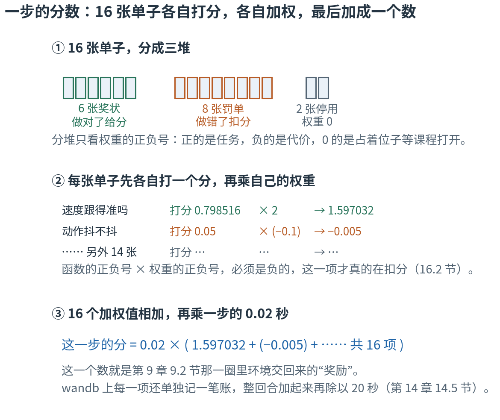
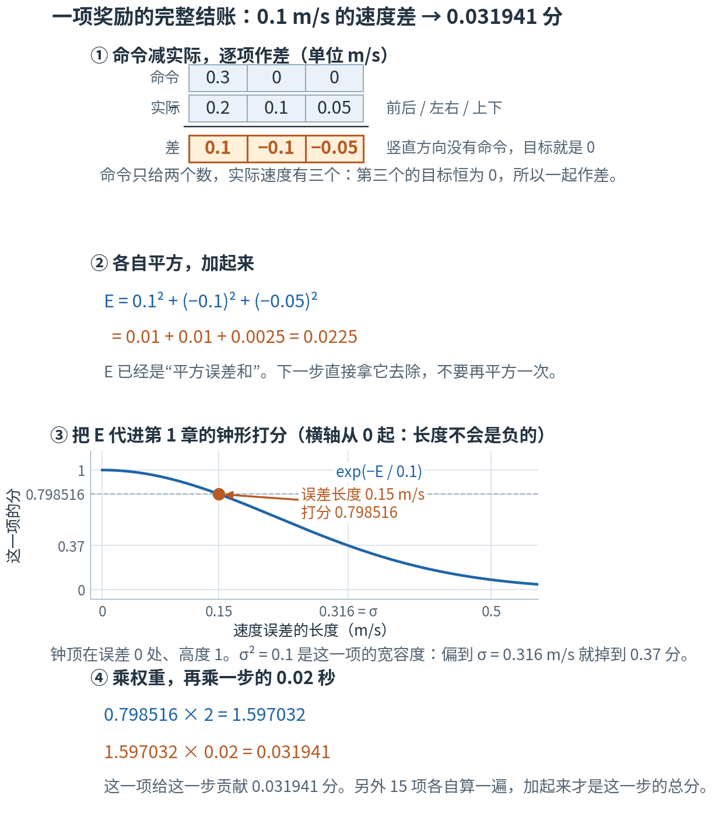
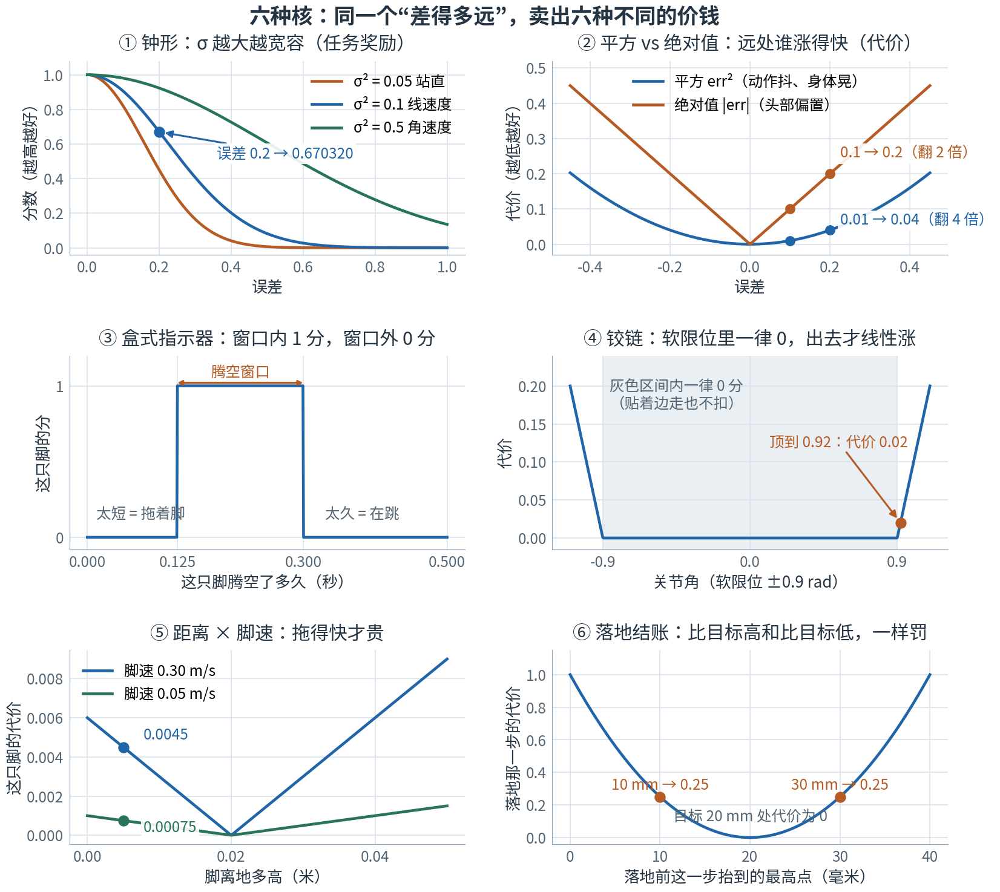
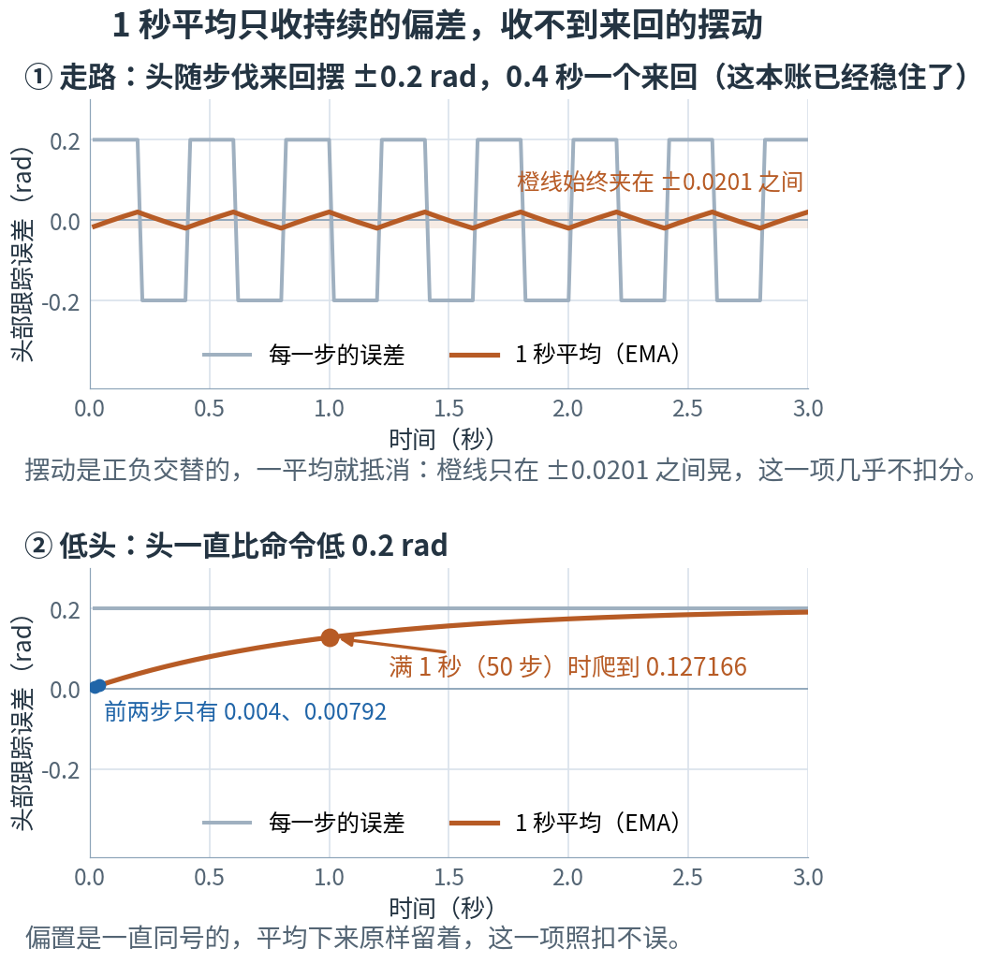
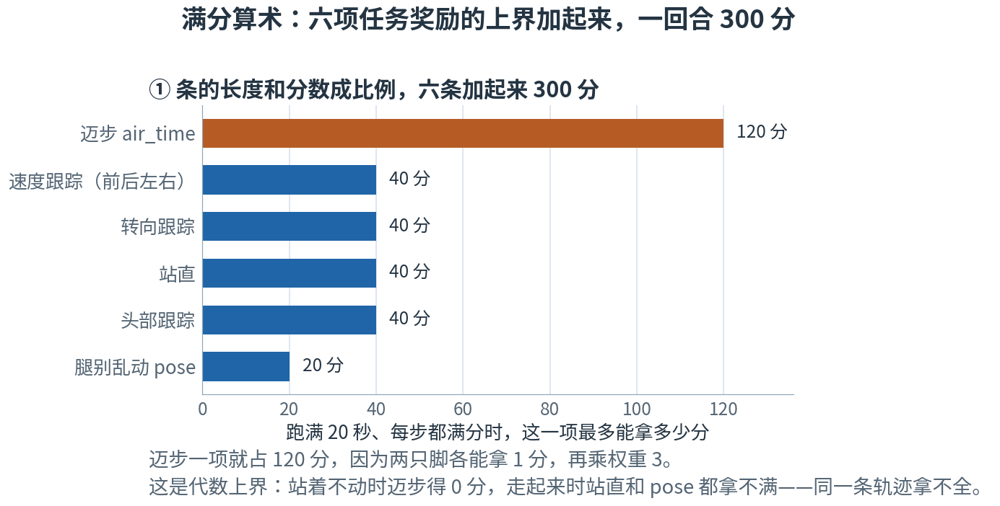

# 第 16 章 · 奖励逐项拆解：16 张单子，各自加权，一条铁律

> **上一章我们有了什么**：策略每一步**看到**的 61 个数，一位一位都拆开了。
>
> **这一章要补什么**：它每一步**拿到**的那"一个分数"还是个黑盒。
> 这个数不是谁拍脑袋给的：16 条规则各自看一件事、各自打一个分，再各自乘一个人定的系数，加起来才是它。
> 每条规则用的形状你都学过——第 1 章的钟形打分、第 2 章的平方和、第 7 章的滑动平均。
> 难的不是单条规则，是**怎么组合才不会被钻空子**：这个仓库用几个月踩坑换来的经验，写在 `AGENTS.md` 里。
> 这一章把 16 条逐一拆开，再把那些"血泪教训"翻译成你已经会的数学。
>
> **本章新词**：代价、自负号惩罚、盒式指示器、核、势能式塑形。
> **需要的前提**：第 1 章的钟形打分与宽容度 σ（1.9–1.11、1.14 节），第 2 章的点积与长度（2.2、2.3 节），
> 第 7 章 7.4 节的滑动平均，第 14 章 14.5–14.6 节的日志单位与符号约定，第 15 章的 61 项观测。
> **不要求**读过 torch 代码；标"进阶"的折叠块可以第二遍再读。

---

## 16.0 先看地图：16 张单子，各自打分、各自加权，最后加成一个数

**机器人每走一步，有 16 位检查员各填一张单子：每张单子只看一件事，给出一个分；
再按"这位检查员说了多少算"（一个人定的系数，叫权重）把 16 个分加起来，就是这一步的奖励。**

想象一家健身房给学员打分。教练把要看的事拆成很多条：跑得够不够快、身子正不正、脚抬得够不够高、动作抖不抖、有没有撞到自己……
每条各自打分，再各自乘一个系数——"跑得快"这条算 3 分满，"动作抖"这条最多扣 0.1 分。
学员看不到这张表，只知道最后那一个总分；他能做的，就是想办法让总分变大。

机器人一模一样。它看到的是 61 个数（第 15 章），做出 14 个数的动作，然后收到**一个**数。
这一个数是怎么拼出来的，就是这一章的内容。



**读图顺序：** 从 ① 到 ③ 竖着读。① 只按权重的正负号把 16 张单子分成三堆：6 张给分的、8 张扣分的、2 张权重是 0 暂时不算的。
② 每张单子先自己打一个分，再乘自己的权重——图里那两行的数字，16.1 节会一个一个手算出来。
③ 16 个加权值相加，再乘一步的 0.02 秒，就是这一步的奖励。现在不用算，只要看清"各自打分 → 各自加权 → 加起来"这个次序。

| 概念 | 它在回答什么问题 | 在哪一节 |
|---|---|---|
| 一步的总分 | 16 张单子怎么变成一个数？ | 16.1 |
| 代价 | 写惩罚的第一种方式：函数算"有多糟"，负号放在权重里 | 16.2 |
| 自负号惩罚 | 第二种：函数自己带负号，权重是正的 | 16.2 |
| 六项任务奖励 | 做对了给分的是哪几件事？ | 16.3 |
| 八项代价 | 做错了扣分的是哪几件事？ | 16.4 |
| 权重为 0 的项 | 为什么留着两项不算？ | 16.5 |
| 八条血泪教训 | 这套配方为什么长成这样？ | 16.6 |
| 核 | 同一个"差得多远"，怎么定出不同的价？ | 16.7 |
| 盒式指示器 | "腾空时间要合适"怎么写成公式？ | 16.3、16.7 |
| 只收直流分量 | 怎么只罚改得掉的那部分误差？ | 16.8 |
| 满分算术 | 一个回合最多能拿多少分？ | 16.9 |
| 势能式塑形 | "只付进步的钱"要满足什么条件？ | 16.10 |

表里的名字先不背，到了各节再给。本章最容易混的四处，先贴上标签：

- **两种惩罚写法**。一种是函数算出一个"有多糟"的非负数，负号放在权重里；另一种是函数自己带负号、权重是正的。
  两种都对，混在一起用会把惩罚变成奖励（16.2 节，第 14 章 14.6 节已经见过一次）。
- **两个 σ**。本章的 σ 是"钟有多宽"（第 1 章 1.10 节）；第 4 章 4.7 节里策略吐出动作时也有个 σ，那是"随机有多大"。
  同一个希腊字母，管的是两件事。本章出现的 σ 一律是前者。
- **"满分 300"不是一条轨迹拿得到的**。16.9 节把六项的上界加起来得到 300，那是**代数上界**：
  站着不动时迈步那一项就是 0 分，走快了站直那一项又拿不满。上界是用来看比例的，不是目标。
- **这 16 项 ≠ 训练时的损失**。第 13 章 13.4 节那三项（裁剪目标、价值损失、熵）是算法那一侧的账；
  第 12 章 12.7 节的优势归一化、第 11 章 11.6 节的熵奖励也都不在这 16 项里。本章讲的是**环境给的分**，它只是那条账的起点。

第一次读，按顺序看正文、图和手算就行。标着"进阶"的折叠内容可以先跳过；代码是复核工具，不是阅读门槛。
这一章有点长：读完 16.8 节，第 17、18 章需要的东西就已经齐了，那里会再提醒你一次。

## 16.1 一项奖励的完整结账：0.1 m/s 的速度差，值多少分

先把一整条单子从头到尾走一遍。挑最好懂的那条：**跑得够不够快**。

这一步命令机器人往前 0.3 m/s，不许横移。实际测出来的身体速度是三个数：往前 0.2、往左 0.1、往上 0.05（单位都是 m/s）。
命令只给了前两个方向，竖直方向的目标一直是 0——机器人本来就不该往上蹿。

**第一步，逐项作差。** 0.3 − 0.2 = 0.1；0 − 0.1 = −0.1；0 − 0.05 = −0.05。

**第二步，各自平方再加起来**（第 2 章 2.3 节量长度的前两步）：

$$E = 0.1^2 + (-0.1)^2 + (-0.05)^2 = 0.01 + 0.01 + 0.0025 = 0.0225$$

**第三步，代进第 1 章 1.9 节的钟形打分**。这一项的宽容度是 σ² = 0.1：

$$f = e^{-0.0225 / 0.1} = e^{-0.225} = 0.798516$$

（0.0225 ÷ 0.1 = 0.225，取负，再按 $e^{-0.225}$ 查；在浏览器控制台敲 `Math.exp(-0.225)` 就能验。）

**第四步，乘权重、乘一步的秒数。** 这一项的权重是 2，一个环境步是 0.02 秒（第 14 章 14.1 节）：

$$0.798516 \times 2 = 1.597032, \qquad 1.597032 \times 0.02 = 0.031941$$



**这样读图：** ① 三行格子是一次竖式减法，橙色那一行是三个差。② 就是上面的平方求和。
③ 横尺是"速度误差这根箭头有多长"（$\sqrt{0.0225} = 0.15$ m/s），竖尺是这一项打的分。
横尺从 0 起——长度不会是负的，所以这里只画右半口钟；橙点就是这一次的结果，虚线帮你在竖尺上读数。
④ 两次乘法，橙色那一行是最后交上去的数。图里四步的数字和正文、和实验第 1 节的核对是同一组。

**16 项都走一遍同样的四步，把 16 个结果加起来，就是这一步的奖励** $r_t$：

$$r_t = \Delta t \sum_{i=1}^{16} w_i\, f_i$$

| 符号 | 怎么读 | 就是 |
|---|---|---|
| $r_t$ | "r t" | 第 t 步的奖励，一个数。第 9 章 9.2 节那一圈里环境交回来的就是它 |
| $f_i$ | "f i" | 第 i 条规则打的分。输入是当前状态，输出一个数 |
| $w_i$ | "w i" | 第 i 条规则的权重，人在配置文件里定的系数 |
| $\sum_{i=1}^{16}$ | "对 i 从 1 到 16 求和" | 16 项加起来，就是一个 `for` 循环（第 2 章 2.2 节） |
| $\Delta t$ | "delta t" | 一个环境步的秒数，0.02 |

写成 JS，就是一个 `reduce`：

```js
const terms = [{ f: 0.798516, w: 2 }, { f: 0.05, w: -0.1 /* 动作抖 */ }, /* …… 共 16 项 */];
const r = 0.02 * terms.reduce((sum, t) => sum + t.f * t.w, 0);   // 各自加权，加起来，再乘一步的秒数
```

最后那个 $\Delta t$ 为什么要乘？它把"每步一笔"换算成"每秒多少分"。
好处是：万一哪天把控制频率从 50 Hz 改成 100 Hz，同样的动作、同样的时长，总分大致不变（步数翻倍，每步的钱减半）。
这只对"连续打分的轨迹"成立；如果换频率之后行为本身变了，或者某一项是按次数计的，总分还是会变。

> ⚠️ **E 已经是"平方误差和"，不要再平方一次。** 这是抄公式最容易犯的错：把 $e^{-E/\sigma^2}$ 写成 $e^{-E^2/\sigma^2}$。
> 代进数看看：$0.0225^2 = 0.00050625$，除以 0.1 得 0.0050625，$e^{-0.0050625} = 0.99495$——几乎满分。
> 也就是说，多平方一次之后，偏了 0.15 m/s 和没偏几乎一样值钱，这一项等于白写。实验第 1 节把这个错误写法也算了一遍。

> **停一下，自测**：同样这一项，如果机器人跟得刚刚好（三个差都是 0），它这一步拿多少分？如果速度差的平方和是 0.1 呢？
> <details><summary>答案</summary>
>
> 三个差都是 0：E = 0，$e^0 = 1$，然后 1 × 2 × 0.02 = 0.04 分——这是这一项一步能拿的上限。
> E = 0.1：0.1 ÷ 0.1 = 1，$e^{-1} = 0.367879$，0.367879 × 2 × 0.02 = 0.014715 分。
> 第二种情况正好是第 1 章 1.10 节说的"偏差等于 σ 时掉到 0.37 分"。
>
> </details>

## 16.2 符号约定：两种惩罚写法，一条铁律

16 项里有 9 项是**扣分**的。可是"扣分"在项目里有两种写法——第 14 章 14.6 节已经各手算过一次，这里把它们的名字补上，再用同一组数复习一遍。

第一种是 mjlab 的习惯：函数算出一个"有多糟"，永远 ≥ 0，越大越糟；负号放在**权重**里。
这样的函数叫**代价**（cost）。比如动作这一步比上一步变了 (0.1, −0.2)，代价是 0.1² + (−0.2)² = 0.05，权重 −0.1，
一步记 0.05 × (−0.1) × 0.02 = −0.0001。八项负权重的都是这种。

第二种是这个仓库自己写的：函数**自己带负号**，返回 ≤ 0，权重是**正**的。这样的函数叫**自负号惩罚**（self-negating penalty）。
16 项里只有 `head_pose_bias` 是这种：头平均偏了 0.2 rad，它返回 −0.2，课程最后把权重调到 3，一步记 (−0.2) × 3 × 0.02 = −0.012。

两种都对，判据只有一条：**函数的正负号 × 权重的正负号 = 负**，这一项才真的在扣分。
`AGENTS.md` 里那条万无一失的检查也就是它——wandb 上每一个惩罚项的 `Episode_Reward` 必须 ≤ 0（第 14 章 14.6 节）。

> ⚠️ **混用两种写法，会把惩罚变成奖励。** 给一个自带负号的函数配上负权重，(−0.2) × (−3) = +0.6：头越歪，分越高。
> 策略会一门心思去把这个"错"犯得更大（`AGENTS.md` 记下的真实后果是"屁股着地蹦"和"故意摔着坐下"）。
> 名字也靠不住：`body_ang_vel` 用的函数叫 `body_angular_velocity_penalty`，名字里有 penalty，算的却是平方和（≥ 0），配的是负权重。
> 看日志的正负号，不要看名字。实验第 2 节从配置里把 16 项分成这两类，顺便复核了上面两个乘法。

> **停一下，自测**：`foot_slip`（打滑）这一项，函数算的是着地那只脚的水平速度平方，权重 −0.1。它是上面哪一种写法？
> 要是有人把这个函数改成自己带负号（返回 −速度平方），却忘了把权重也改成正的，日志上这一项的读数会变成正的还是负的？策略会学会干什么？
> <details><summary>答案</summary>
>
> 速度平方永远 ≥ 0，配的是负权重——第一种，**代价**。
> 改成自带负号之后，函数 ≤ 0、权重还是 −0.1，负负得正：读数变成**正的**，铁律被破坏。
> 于是"打滑"成了赚钱的事，策略会学着故意搓着脚走。查法还是那一条：把函数的输出和权重乘起来看正负号，别看名字。
>
> </details>

## 16.3 六项任务奖励：做对了给分

六张奖状，问的是六件不同的事。先说三张最像的——它们都用第 1 章的钟形打分，只是宽容度不同。

**跑得够不够快**（`track_linear_velocity`，权重 2）：就是 16.1 节那一项，σ² = 0.1。

**转得够不够快**（`track_angular_velocity`，权重 2）：命令里还有一个"每秒转多少弧度"。
误差同样是"绕竖轴的差"加上"另外两个方向的转速"，平方求和，σ² = 0.5。

**身子正不正**（`upright`，权重 2）：用第 2 章 2.4 节的投影重力。机器人站直时，重力在它自己的前后轴和左右轴上都是 0；
一歪，这两个数就不是 0 了。把它们平方相加进钟形打分，σ² = 0.05——三项里最严的一个。

这三个 σ² 正是第 1 章 1.10 节那张表里并排算过的 0.05、0.1、0.5。第 2 章 2.7 节埋过一句话："第 16 章给不同物理量分别设计评分"——
兑现就在这里：线速度的单位是 m/s，角速度是 rad/s，投影重力没有单位。**三把尺子量的是三种东西，宽容度只能各调各的，不能横着比谁更宽容。**

**腿别乱动**（`pose`，权重 1）：拿 10 个腿关节现在的角度和站姿比，每个关节有自己的 σ，误差平方除以各自的 σ² 之后取平均，再进钟形打分。
妙处在于这组 σ **按命令切换**：命令速度几乎为 0（站着）时用一套窄的，一旦要走就换一套宽的。
手算一次，膝盖比站姿多弯了 0.2 rad，其余 9 个关节不动：

- 走着，膝盖的 σ 是 0.4：(0.2 / 0.4)² = 0.25，除以 10 个关节得 0.025，$e^{-0.025} = 0.97531$——几乎不扣分。
- 站着，膝盖的 σ 是 0.15：(0.2 / 0.15)² = 1.777778，除以 10 得 0.177778，$e^{-0.177778} = 0.837128$——扣得明显。

同一个 0.2 rad，走路时几乎免费，站着时要付钱。**走路本来就得大幅摆腿，站着乱晃就没道理**，这句话就是这样写进公式的。

**迈步**（`air_time`，权重 3）：这一项不用钟。它问的是"每只脚这一次腾空的时长落在 0.125 到 0.3 秒之间吗"——
在窗口里记 1 分，不在记 0 分，两只脚加起来，所以这一项最大是 2。命令速度小于 0.01 时整项乘 0，站着不迈步不算错。

这种"在区间内给 1、区间外给 0"的打分叫**盒式指示器**（box indicator），因为画出来是一个方盒子（16.7 节的图 ③）。
注意它说的不是"腾空越久越好"：太短是拖着脚蹭地，太长是在跳——**要的是合适，不是极端**。

**头朝哪**（`head_pose_tracking`，权重 2）：4 个颈/头关节各自和命令比，每个关节一口钟，σ = 0.5（这一项的配置里直接写 σ，不是 σ²），**取平均**。
手算：4 个关节里有一个偏了 0.2 rad，其余三个刚好。单关节 $e^{-(0.2/0.5)^2} = e^{-0.16} = 0.852144$，
取平均 (0.852144 + 1 + 1 + 1) ÷ 4 = 0.963036。

"取平均"三个字要紧。要是改成四个相乘，同样这一步只剩 0.852144：一个关节没跟上，另外三个做得再好也被拖下去。
取平均则是**做对一部分，就拿一部分的分**。σ 选 0.5 也有道理：头部命令的范围是课程一级级放宽的，
一开始只有 ±0.05 rad 上下，到第 2000 次迭代才放到 ±1.1 rad（头的左右转放到 ±1.4）。
就算拉到 1.0 rad 这么远，单关节还有 $e^{-4} = 0.018316$ 分——很小，但不是 0，还有得可进步。

| 这张单子在问什么 | 代码里的名字 | 权重 | 宽容度 / 窗口 |
|---|---|---:|---|
| 跑得够不够快 | `track_linear_velocity` | 2 | σ² = 0.1 |
| 转得够不够快 | `track_angular_velocity` | 2 | σ² = 0.5 |
| 身子正不正 | `upright` | 2 | σ² = 0.05 |
| 腿别离站姿太远 | `pose` | 1 | 每个关节一个 σ，站着窄、走着宽 |
| 迈步的腾空时长合不合适 | `air_time` | 3 | 窗口 0.125–0.3 秒，两只脚各 1 分 |
| 头朝的方向对不对 | `head_pose_tracking` | 2 | σ = 0.5，4 个关节取平均 |

实验第 3 节从配置里读出这六项的权重和宽容度，并复核了上面两处手算。

> **停一下，自测**：`head_pose_tracking` 这一项，4 个关节的误差都是 0.5 rad。取平均的写法得几分？改成四个相乘又得几分？
> <details><summary>答案</summary>
>
> 单关节 $e^{-(0.5/0.5)^2} = e^{-1} = 0.367879$。四个都一样，取平均还是 0.367879；四个相乘是 $0.367879^4 = 0.018316$。
> 误差完全一样时，相乘罚得狠得多——这正是"部分分"和"全有或全无"的区别。
>
> </details>

## 16.4 八项代价：做错了扣分

八张罚单，每张防一件具体的事。按 16.2 节的第一种写法：函数算一个 ≥ 0 的数，权重带负号。

| 这张罚单在防什么 | 代码里的名字 | 权重 | 算的是 |
|---|---|---:|---|
| 动作抖 | `action_rate_l2` | −0.1（课程涨到 −1.0） | 相邻两步动作之差的平方和 |
| 关节顶到极限 | `dof_pos_limits` | −1.0 | 超出软限位的那一截，超多少算多少 |
| 躯干乱晃 | `body_ang_vel` | −0.05 | 躯干前后翻、左右滚的转速平方和（不算转向） |
| 整机甩动 | `angular_momentum` | −0.02 | 整机角动量的长度平方 |
| 拖地 | `foot_clearance` | −2.0 | 每只脚：离目标高度 2 cm 的距离 × 这只脚的水平速度 |
| 抬脚不够 | `foot_swing_height` | −0.25 | 落地那一步结账：这一步抬到的最高点离 2 cm 差几成，平方 |
| 打滑 | `foot_slip` | −0.1 | 着地的脚的水平速度平方 |
| 腿打到自己 | `self_collisions` | −1.0 | 自碰撞里撞得够重（接触力超过 10 N）的次数 |

**动作抖**这一项要单独说两句。它罚的是策略**自己**相邻两步输出的差，不是关节实际转了多少——
第 15 章 15.3 节和第 17 章 17.6 节都提过这一项，说的就是它。而且它是在**原始输出**上算的：
第 17 章 17.1 节说过动作的缩放系数是 1，所以动作从 0.10 变到 0.20，目标角就真的跳了 0.1 rad ≈ 5.7°。

**躯干乱晃**只算前后翻和左右滚两个方向，不算绕竖轴转——转向是命令要求的事，罚它等于自相矛盾。

几个手算（实验第 4 节）：

```
           代价项                                  一次手算    代价值  × 权重 × 0.02 秒
-----------------  ----------------------------------------  --------  ----------------
     body_ang_vel   躯干每秒翻 1.0、侧滚 0.5 rad：1² + 0.5²  1.250000         -0.001250
   dof_pos_limits     软限位 0.9，关节顶到 0.92：0.92 − 0.9  0.020000         -0.000400
   foot_clearance  脚高 5 mm、快速划过 0.3 m/s：0.015 × 0.3  0.004500         -0.000180
   foot_clearance   同样脚高，慢慢蹭 0.05 m/s：0.015 × 0.05  0.000750         -0.000030
foot_swing_height    落地时峰值只有 10 mm：(0.01/0.02 − 1)²  0.250000         -0.001250
foot_swing_height    落地时峰值到了 30 mm：(0.03/0.02 − 1)²  0.250000         -0.001250
```

**怎么读这段输出**：最后一列是这一步真正记进总分的钱，所以都是负的。
中间两行是同一个脚高、两种脚速：**慢慢蹭比快速划过便宜 6 倍**——这一项乘了脚速，所以罚的是"拖着地快速划"，不是"脚放得低"。
最后两行说的是另一件事：抬 10 mm 和抬 30 mm 罚得一模一样。这一项算的是"离目标 20 mm 差几成"，比目标低和比目标高一样算错。

软限位是量程的中间 90%（两端各留 5%）。关节角在这个区间里，这一项一律是 0，贴着边走也不扣；
一旦出去，超多少扣多少（16.7 节的图 ④）。

**没有的项也说明问题**：这里没有关节力矩、关节速度、关节加速度的惩罚。
这三种函数 mjlab 里都有现成的（`mjlab/envs/mdp/rewards.py` 里的 `joint_torques_l2`、`joint_vel_l2`、`joint_acc_l2`）；
仓库自己的 `mdp.py` 里还另写了四个（力矩、力矩变化率、关节加速度、站着时的关节速度）——走路任务一项都没用。
平滑全靠 `action_rate_l2` 加上舵机自己的物理惯性（第 17 章 17.4 节）。

> **停一下，自测**：`action_rate_l2` 的权重从 −0.1 涨到 −1.0（课程做的事，16.5 节讲）。
> 同样一步动作变了 (0.1, −0.2)，扣的分从多少变成多少？行为变了吗？
> <details><summary>答案</summary>
>
> 代价还是 0.1² + (−0.2)² = 0.05。权重 −0.1 时一步记 0.05 × (−0.1) × 0.02 = −0.0001；权重 −1.0 时记 −0.001。
> 行为一点没变，扣分变了十倍——所以看日志里某一项的读数变化，一定要同时看当前的权重（第 14 章 14.5 节）。
>
> </details>

## 16.5 两个权重为 0 的项：位子占着，等课程打开

剩下两项，权重是 0。mjlab 根本不会去算权重为 0 的项（📍 里那行 `continue`），所以它们眼下对总分毫无影响。留着干什么？

**`body_pose_tracking`**：躯干姿态跟踪，6 个轴（前后、左右、高低、三个角度）各一口钟取平均。
它留着是为了配合第 15 章 15.7 节的零填充：观测里那 6 个命令槽必须一直在，站起来那个任务要用；
奖励这边留一个对应物，哪天有任务把权重抬起来，整条线现成就能跑。走路用不上它，所以权重 0。

**`head_pose_bias`**：这一项是课程打开的。第 600 次迭代权重变成 1.0，第 1000 次 2.0，第 1500 次 3.0（第 18 章讲课程怎么排）。
它是这 16 项里最有教育意义的一条，16.8 节整节讲它。

顺便把另一条课程也记下：`action_rate_l2` 的权重从 −0.1 一路收紧到 −1.0，也在第 1500 次迭代到位。
这两条为什么都要"先松后紧"，16.6 节的第 4 条给答案。实验第 5 节把这两条阶梯从配置里读了出来。

至此 16 项都点过一遍了。下面这张是总表，**不用背**，当索引用（实验第 2 节的原样输出）：

```
                奖励项                           函数   权重  这是哪一种
----------------------  -----------------------------  -----  ----------
 track_linear_velocity          track_linear_velocity      2        任务
track_angular_velocity         track_angular_velocity      2        任务
               upright                        upright      2        任务
                  pose               variable_posture      1        任务
          body_ang_vel  body_angular_velocity_penalty  -0.05        代价
      angular_momentum       angular_momentum_penalty  -0.02        代价
        dof_pos_limits               joint_pos_limits     -1        代价
        action_rate_l2                 action_rate_l2   -0.1        代价
              air_time                  feet_air_time      3        任务
        foot_clearance                 feet_clearance     -2        代价
     foot_swing_height              feet_swing_height  -0.25        代价
             foot_slip                      feet_slip   -0.1        代价
       self_collisions            self_collision_cost     -1        代价
    head_pose_tracking             head_pose_tracking      2        任务
    body_pose_tracking          body_pose_tracking_6d      0        停用
        head_pose_bias         head_pose_bias_penalty      0        停用
```

**怎么读这张表**：第一列是 wandb 日志里的名字（第 14 章 14.4 节那 16 行就是按这个顺序印的），第二列是真正干活的函数，
第三列是权重，最后一列是这一章给它们的分类。注意第二列里有的名字和第一列不一样——
比如叫 `pose` 的那一项，函数叫 `variable_posture`；看日志时认第一列，读源码时认第二列。

## 16.6 血泪教训的数学翻译：八条规则，每条用学过的话说一遍

`AGENTS.md` 里有一节叫"Reward design — rules that were each learned the hard way"（奖励设计：每一条都是硬碰硬学来的）。
这八条是整个仓库最贵的知识。每条都能用前面学过的东西说清楚。

**1. 强化学习优化的是奖励的字面意思。** 第 11 章 11.2、11.4 节：策略梯度只做一件事——把"比平均好"的动作往上推。
它不知道你"想要"什么，只知道分数。任何没被公式盯住的自由度都会被拿来换分：用甩头代替翻滚、用侧倒代替前倾。
本章就有现成的例子：`air_time` 只问"这次腾空的时长在不在窗口里"。只要命令不是 0（是 0 的话整项乘 0，16.3 节），
**原地**把脚抬起来 0.2 秒再放下，它照样每步拿满 2 分。
把它拉回来的是别的项——命令 0.3 m/s 却原地不动时，速度那一项的 E = 0.3² = 0.09，打分 $e^{-0.9} = 0.4066$
（第 1 章 1.10 节那张表里就有这个数），比跟上时的接近 1 少了一大截。**没有哪一项单独定义得了"走路"。**
对策不是加一点小惩罚去"劝"，而是**把"什么才算完成"写成硬性的状态判断**（支撑脚接触了吗、朝向轴对不对）。

**2. 不能有"头奖"。** 一个"到达 X 之后每步给分"的奖励，早到一步就多赚一步——策略会不惜一切**提前到达**，暴力冲刺。
算笔账：到达之后每步记 0.02 分，回合还剩 500 步就是 10 分；早到 1 秒（50 步），白赚 50 × 0.02 = **1 分**。
而"别冲太快"那条惩罚就算每步扣 0.001，冲刺的那 50 步一共才扣 50 × 0.001 = **0.05 分**。
1 分是 0.05 分的 20 倍——所以暴力冲刺是划算的。**只加一个"别太快"的惩罚不管用：那是一笔有限的罚款，冲过去赚的是每一步的钱。**
对策：让它跟踪一个**限速的内部目标**（按固定速度匀速滑动），领先目标不给钱，于是"慢"反而成了最优解。

**3. 别把正奖励绑在坏状态上。** 比如"倒地时给站起来的奖励"——策略会找一个最便宜的"算倒地"姿势躺着刷分。
对策是只为**进步**付钱，比如用 $\Delta\cos(\text{tilt})$：这一步比上一步"直了多少"就给多少。站着不动，差分是 0，刷不了。
但这句话有前提条件，不能无条件地说它刷不了——16.10 节把条件写清楚。

**4. 两种正则项，脾气完全不同。**
"动作阻断型"（躯干乱晃、整机甩动、`pose` 的窄 σ）罚的是**动态动作物理上必需**的东西——想翻滚就一定会有角动量。
这类项在动态任务里必须**小**，否则等于禁止那个动作。
"平滑型"（`action_rate_l2`）罚的是相邻两步变得太猛，同样幅度慢慢做通常便宜得多，所以它不挡大动作，可以给重；
但要**等技能出现之后**再收紧（这就是 16.5 节那条课程）。原因很直白：**任何"尝试税"在技能还没学会的时候，都会让"什么都不做"赢**——
不动就不抖，不抖就不扣钱。

**5. 比奖励的分量，不比权重的数字。** 策略梯度看的是**相对**优势（第 12 章 12.7 节：整批减平均、除以标准差）。
同一笔 0.005 的扣分，在"任务项每步一共 0.3 分"的环境里（16.9 节会算出，这个项目的上界正好是每步 0.3 分）占 1/60 ≈ 0.016667；换到正分总量大 4 倍、每步 1.2 分的环境里，只占 1/240 ≈ 0.004167。
权重数字一模一样，分量差了 4 倍。**从别的任务抄正则项，要连同那边正分的总量一起看。**

**6. 钟的宽度 ≈ 你现在还在乎的那个误差**（第 1 章 1.14 节）。但在调窄之前先问一句：
这个误差，策略**改得掉吗**？改不掉的（走路时头必然摆）罚了也没用，只会让它干脆不走——16.8 节就是这条教训的现场。

**7. 加法能被"折中姿势"蒙混，乘法不行。** 四项各自打 0.8 分：加起来取平均是 0.8，四个相乘是 $0.8^4 = 0.4096$。
再看一项彻底做砸（打 0 分）的情形：加法还有 (0.8 + 0.8 + 0.8 + 0) ÷ 4 = 0.6，乘法直接是 0。
**加法允许"每项八成"的折中，乘法逼着每一项都做到。** 代价是 σ 必须够宽：要是当前策略每项只有 0.01 分，乘起来小到看不出差别，就没有改进的方向了。

**8. 关节老顶在限位上，要从关节角那一侧罚。** 也就是 16.4 节的 `dof_pos_limits`。
从命令那一侧罚没用：配置里故意不给动作设上下限（第 17 章 17.1 节：缩放系数是 1，而且 `clip = None`），
因为舵机的比例增益调得低（第 17 章 17.2 节：200，出厂默认是 400），非得"过量下达"才追得上。

实验第 6 节把第 5、7 两条里的数算了出来，另外还算了下一节要用的那两个真实数字（0.77 和 1.01）。

## 16.7 六种核：同一个"差得多远"，卖出六种不同的价钱

前面出现了各种形状：平方、绝对值、钟形、方盒子、折线、距离乘速度。
把"误差"变成"分数"的那个函数，统称叫**核**（kernel）——第 1 章 1.9 节给钟形打分起的正式名字"高斯核"，就是其中一种。

同一个误差，不同的核给出完全不同的价钱。先手算三种，误差从 0.1 涨到 0.2：

- **平方** $err^2$：0.01 → 0.04，翻 **4** 倍。误差越大，涨得越凶——它盯的是大偏差。
- **绝对值** $|err|$：0.1 → 0.2，只翻 **2** 倍。远近一个价，每多偏一点就多罚固定的一点。
- **钟形** $e^{-err^2/0.1}$：0.904837 → 0.670320（第 1 章 1.10 节那张表里就是这两个数，那里印 4 位：0.9048、0.6703）。近处分得清，越远越平——走到很远的地方，进步一点几乎不加分。

它们不是三种写法，是**三种定价策略**。挑哪个，取决于你想让策略在哪一段最上心。



**这样读图：** 六张小图的横轴都是"差得多远"，纵轴是这一项给的分或代价（每张图自己标了方向）。
六张图不是六种核一一对应：② 一张图里并排放了两种核，⑥ 是平方核用在"落地那一刻"这个场合。一张一张看：

- ① 三条钟一个比一个宽，σ² 越大越宽容；蓝点是正文手算的 0.670320。
- ② 在画出来的这一段里橙线（绝对值）一直更高，但要看的是涨得快不快：蓝线（平方）从 0.01 到 0.04 涨了 4 倍，橙线只涨了 2 倍；误差超过 1 之后平方就会反超。
- ③ 方盒子没有斜坡：窗口内一律 1 分，窗口外一律 0 分，在窗口里往哪边挪都不改分数。
- ④ 灰色区间是软限位内，代价恒为 0，出去才开始线性上涨。
- ⑤ 同一个脚高，脚速大的那条贵得多。
- ⑥ 抛物线的底在 20 mm，两侧对称——抬太低和抬太高一样罚。

三张小图值得多看一眼。**方盒子**（③）是 `air_time` 用的那种，好处是不会被"越久越好"带偏，代价是窗口里面完全没有方向感：
腾空 0.15 秒和 0.28 秒一个价。所以它只负责"别拖脚也别跳"，**步态好不好看，得靠别的项一起决定**。
**折线**（④）是软限位那种，术语叫铰链；它的特点是"界内完全免费"，所以只防撞极限，防不了"一直贴着边走"。
**距离乘速度**（⑤）是 `foot_clearance` 那种：两个因子相乘，任何一个为 0 都不罚——脚停着不动就不算拖地。

<details>
<summary>进阶：`.mean()` 写在哪一行，是三个不同的目标（现在可跳过）</summary>

两项误差，一项刚好（标准化平方误差 0）、一项偏了一个 σ（标准化平方误差 1）。同样"都是高斯"，三种写法给三个数：

| 组合方式 | 算式 | 值 |
|---|---|---:|
| 平方误差先求和，再取指数 | $e^{-(0+1)}$ | 0.367879 |
| 平方误差先平均，再取指数 | $e^{-(0+1)/2}$ | 0.606531 |
| 每项先取指数，再平均 | $(e^{0} + e^{-1}) / 2$ | 0.683940 |

第一种等价于"每项的钟相乘"（指数相加就是底数相乘），第二种是它们的几何平均，第三种才是"做对一半拿一半分"。
`head_pose_tracking` 用的是第三种（16.3 节），`track_linear_velocity` 用的是第一种（16.1 节，三个方向的平方和一起进指数）。
所以看到两处都写着 `exp`，不能就认定它们是同一种评分。实验第 7 节把这三个数并排算了出来。

</details>

> **停一下，自测**：某项代价现在是 0.1。如果误差翻倍，用平方核它变成多少？用绝对值核呢？
> 如果这个误差是"头在走路时必然的摆动"，你更愿意用哪一种？
> <details><summary>答案</summary>
>
> 平方核：代价正比于误差的平方，误差翻倍代价变 4 倍，0.1 → 0.4。绝对值核：变 2 倍，0.1 → 0.2。
> 对"改不掉"的误差，两种都不该用在瞬时值上——下一节给的答案是：先把误差平均掉，再用绝对值罚剩下的那部分。
>
> </details>

## 16.8 只给逃得掉的误差定价：头部偏置的 1 秒平均

这一节是一次真实事故的完整复盘，也是第 1 章 1.14 节留的那个伏笔——"这个偏差是不是机器人**改得掉**的"。

**先说清这一节的数从哪来。** 15°、0.77、1.01、15 mm → 2 mm 这几个，都是 2026-08-20 那两次训练留下的**实测记录**
（wandb 上叫 `ww1g2198` 和 `5yay13u4`），抄在 `microduck_velocity_env_cfg.py` 里 `head_pose_bias` 那一段注释上。
这类数你在自己机器上复现不了，只能当史料读——实验第 6 节替你核对的只有两件事：0.77 ÷ 1.01 这个比值，
以及"那段注释还原样在源码里"。这一节别的数，都会让你自己算。

**事故**。这只机器人的头很重：那段注释写着头组件约 280 g，占整机质量的 38%。测下来，走路时头一直比命令低大约 15°。
想法很自然：`head_pose_tracking` 的 σ = 0.5 太宽容了——`mdp.py` 里这个函数的说明算过一笔账：
一个关节下垂 10°（0.1745 rad），4 个关节取平均之后一共才掉 0.0287 分，几乎免费。那就再叠一口窄钟，σ 用 0.1。
结果这次训练到第 300 次迭代**干脆不走了**：迈步那一项从 1.01 分掉到 0.02，脚抬的高度从 15 mm 掉到 2 mm。

为什么？因为**一个 38% 体重的头，只要迈步就一定会晃**。窄钟罚的是**每一瞬间**的误差，算下来每步要收 0.77 分，
而当时迈步那一项每步实际只拿到 1.01 分——0.77 ÷ 1.01 ≈ 0.76，**一项罚款吃掉了迈步奖励的四分之三**。
（两个数用的是同一把尺子：每步的"函数值 × 权重"，也就是跑满一回合时日志里的读数，第 14 章 14.5 节。
注意 1.01 不是这一项的**上限**——它的上限是 6，16.9 节会算；拿到 1.01 说明那个步态本来就离满分很远。）
站着不动反而分高，于是它就站着不动。这个税**逃不掉**：不是策略不努力，是物理不允许。

可是"头长期下垂"是逃得掉的——脖子的命令抬高一点，正好抵消重力把头拽下去的那一截。
所以问题变成：**怎么只给逃得掉的那部分定价？**

**办法一：先平均，再取绝对值。** 假设连着四步的头部误差是 +0.2、−0.2、+0.2、−0.2（走路时的摆动，左右交替）：

- 先平均再取绝对值：(0.2 − 0.2 + 0.2 − 0.2) ÷ 4 = 0，绝对值还是 **0**。罚不到。
- 先取绝对值再平均：(0.2 + 0.2 + 0.2 + 0.2) ÷ 4 = **0.2**。罚得到。

如果误差一直是 −0.2（头一直低着），两种算法的绝对大小都是 0.2。
**两种统计的差别，恰好就是"来回摆"和"一直偏"的差别**——先平均，摆动自己抵消，只有一直同号的那部分留得下来。
这个留下来的部分，本书叫它**直流分量**（"直流"借自电学：不来回变号的那一部分）。

**办法二：平均要用滑动的。** 回合有一千步，不可能攒够再算。用第 7 章 7.4 节的滑动平均就行，每步更新一次：

$$m \leftarrow (1-\alpha)\,m + \alpha \cdot err, \qquad \alpha = \frac{0.02\ \text{秒}}{1.0\ \text{秒}} = 0.02$$

旧值留 98%，今天占 2%。头一直低 0.2 rad，从 0 起步手算前两步：

- 第 1 步：0.98 × 0 + 0.02 × 0.2 = **0.004**
- 第 2 步：0.98 × 0.004 + 0.004 = 0.00392 + 0.004 = **0.00792**

爬得很慢。50 步（正好 1 秒）之后是 $0.2 \times (1 - 0.98^{50}) = 0.2 \times (1 - 0.36417) = 0.127166$
（$0.98^{50}$ 在浏览器控制台敲 `Math.pow(0.98, 50)` 就能验），
离真值 0.2 还差不少。$0.98^{50} = 0.36417$ 的意思是：**一秒之前那一步的影响，现在还剩三成多**。
所以这一项不会在偏置刚出现时就满额收钱，它要一秒左右才反应过来——这也是为什么回合一重置，这本账必须清零。



**这样读图：** 两张图的纵轴刻度相同，都是头部跟踪误差（rad），灰线是每一步的误差，橙线是它的 1 秒平均。
① 走路：灰线在 ±0.2 之间来回跳，橙线被浅橙色的窄带夹住，始终不超过 ±0.0201——只有下图那个 0.127166 的六分之一左右。
（上图画的是**已经走了十几秒、这本账稳定下来之后**的 3 秒；下图才是从回合一开始、账面为 0 画起。）
② 一直低头：灰线是一条 0.2 的平线，橙线从 0 起步慢慢往上爬，蓝点是手算的前两步，橙点是满 1 秒时的 0.127166。
**同样的 0.2，摆着的收不到钱，偏着的收得到。**

把两个办法合起来，就是这一项的公式：

$$f = -\,\text{mean}_{4}\big|\,m_j\,\big|$$

| 符号 | 怎么读 | 就是 |
|---|---|---|
| $m_j$ | "m j" | 第 j 个颈/头关节的跟踪误差**的 1 秒滑动平均**（4 个关节各存一本账）。换个字母是为了不和 $e^{-x}$ 里那个 e 撞 |
| $\lvert\cdot\rvert$ | "绝对值" | 取绝对值（不是平方）：大偏差处每多偏一点，罚得一样多，不像钟形那样远处变平 |
| $\text{mean}_4$ | "对 4 个取平均" | 4 个关节的账取平均 |
| 前面的负号 | | 让这个函数自己带负号，配正权重——16.2 节的第二种写法 |

课程把权重涨到 3.0 之后，一直低头 0.2 rad 每步要付 (−0.127166) × 3 × 0.02 = −0.00763 分；
而走路时的摆动只有 ±0.0201，付的钱只有六分之一。`AGENTS.md` 的原话是 "Price only the escapable part"——**只给逃得掉的那部分定价**。
做到最优时，这一项对一个走路的策略**一分钱也不收**。实验第 8 节把这一节的每个数都算了一遍。

> ⚠️ **奖励里用了滑动平均，不等于动作也要滤波。** 这里的平均是**给误差记账用的统计**，和"把策略输出的动作平滑一下再送给舵机"是两码事。
> 项目的策略**不带动作滤波**：训练时没加，部署时也不能加（第 17 章 17.6 节）。看到奖励里有 EMA 就在部署端也加一个滤波器，会直接破坏迁移。

<details>
<summary>进阶：为什么 50 步的递推正好等于 0.2 × (1 − 0.98⁵⁰)（现在可跳过）</summary>

误差恒为 0.2 时，每一步都是 $m \leftarrow 0.98m + 0.004$。把它展开：

第 1 步 $0.004$；第 2 步 $0.004 + 0.98 \times 0.004$；第 3 步 $0.004 + 0.98 \times 0.004 + 0.98^2 \times 0.004$……
第 n 步就是 $0.004 \times (1 + 0.98 + 0.98^2 + \cdots + 0.98^{n-1})$。

括号里是每项乘同一个数的一串和（第 1 章 1.8 节的"每走一步，乘同一个数"）。
这种和有个现成的结果：$1 + q + q^2 + \cdots + q^{n-1} = \dfrac{1 - q^n}{1 - q}$。
代进去，$1 - q = 0.02$，于是总和 $= 0.004 \times \dfrac{1 - 0.98^{n}}{0.02} = 0.2 \times (1 - 0.98^{n})$。

n = 50 时就是 $0.2 \times (1 - 0.36417) = 0.127166$。实验第 8 节同时用递推和这个式子算了一遍，两边对上。

</details>

> **停一下，自测**：头一直低着 0.2 rad，一直这么走下去。这本账最终会停在哪个数？
> 如果把平均时长从 1 秒改成 0.2 秒（α 变成 0.1），第 1 步的账是多少？
> <details><summary>答案</summary>
>
> 最终停在 0.2：误差不变时，$m$ 会一直往 0.2 靠（式子里 $0.2 \times (1 - 0.98^n)$ 的 $0.98^n$ 越来越接近 0）。
> α = 0.1 时第 1 步是 0.9 × 0 + 0.1 × 0.2 = 0.02，是原来的 5 倍——平均窗口越短，反应越快，但也越容易把摆动一起收进来。
>
> </details>

**读到这里，第 17、18 章需要的东西已经齐了**：16 项各是什么、权重多少、两种符号写法、以及为什么要用课程慢慢收紧。
剩下两节是两笔账——"最多能拿多少"和"只付进步的钱要满足什么条件"——第一遍累了可以先跳到 📍 和小结。

## 16.9 满分算术：六项上界加起来，一回合 300 分

八项代价的最好情况都是 0（没犯错就不扣钱），所以"最多能拿多少"只看六张奖状。
每一项的上界 = 权重 × 这个核的最大值 × 0.02 秒 × 1000 步（跑满 20 秒）。
除了 `air_time` 的最大值是 2（两只脚各 1 分），其余五项的核最大值都是 1。

```
                任务项  权重  核最大值  每步最多  跑满 20 秒最多
----------------------  ----  --------  --------  --------------
 track_linear_velocity     2         1      0.04              40
track_angular_velocity     2         1      0.04              40
               upright     2         1      0.04              40
                  pose     1         1      0.02              20
              air_time     3         2      0.12             120
    head_pose_tracking     2         1      0.04              40
  六项的代数上界相加：300 分 / 回合（同一条轨迹并不能同时拿满）
```

**怎么读这段输出**：先看一行。`track_linear_velocity` 权重 2、核最大 1，每步最多 2 × 1 × 0.02 = 0.04 分；
跑满 1000 步就是 40 分。把六行的"权重 × 核最大值"加起来（所以 `air_time` 那行是 3 × 2 = 6，不是 3），
每步 2 + 2 + 2 + 1 + 6 + 2 = 15 分，乘 0.02 是 0.3 分，一回合 300 分。



**这样读图：** 条的长度和分数成比例，横尺的刻度就是分。最长的橙条是迈步：120 分，一项就占了 300 分的 40%。
它之所以最大，是因为它的核最大值是 2（两只脚），权重又是六项里最高的 3——**仓库有意把"愿意迈步"做成最大的一块**。

两个要紧的说明。

第一，回到第 14 章 14.5 节的换算：日志里 `Episode_Reward/<名字>` 是"整回合加起来再除以 20 秒"。
所以**跑满 20 秒、每步都满分时，这一项的读数正好等于权重 × 核最大值**：`upright` 读 2，`air_time` 读 6。
这条换算 14.5 节已经推过，这里直接用。

第二，300 是**代数上界**，不是哪条真实轨迹能拿到的分。同一步里，各项会互相扯：
站着不动时 `air_time` 是 0；走快了躯干总要晃一点，`upright` 就拿不满；头跟得死紧又会影响迈步（上一节刚讲过）。
上界的用处是**看比例**——知道迈步占 40%、速度跟踪占 13%，才读得懂日志里某一项涨了 0.1 到底算多算少。

> **停一下，自测**：假设把 `air_time` 的权重从 3 改成 1，别的不动。六项的上界合计变成多少？迈步那一项占的比例呢？
> <details><summary>答案</summary>
>
> 迈步的上界变成 1 × 2 × 0.02 × 1000 = 40 分，合计 40 + 40 + 40 + 40 + 20 + 40 = 220 分，迈步占 40 ÷ 220 ≈ 18%。
> 从 40% 掉到 18%：同样一次成功的迈步，能换到的相对好处小了一半多。实验的"改一改"第 3 条就让你亲手试这个改动。
>
> </details>

## 16.10 势能式塑形：只付进步的钱，也要有边界条件

16.6 节第 3 条给了一个对策：别把正奖励绑在坏状态上，只为**进步**付钱。这一节把它说完整——因为它有条件，说漏了照样会被刷分。

给每个状态定一个"进度分" $\Phi$（读"斐"）。比如让 $\Phi = \cos(\text{倾角})$：躺平时倾角 90°，$\Phi = 0$；站直时倾角 0°，$\Phi = 1$。
（余弦不熟没关系，需要的三个数这里直接给：$\cos 60° = 0.5$、$\cos 30° = 0.866$、$\cos 0° = 1$；附录 D 有补课。）

**只付进步的钱**，就是每一步额外给 $F = \Phi(\text{这一步之后}) - \Phi(\text{这一步之前})$。手算一次：从倾角 60° 一路站到 0°，

- 60° → 30°：0.866 − 0.5 = **0.366**
- 30° → 0°：1 − 0.866 = **0.134**
- 一共 0.366 + 0.134 = **0.5**，正好等于 $\Phi(\text{终}) - \Phi(\text{起}) = 1 - 0.5$。

中间那个 0.866 加了一次又减了一次，自己抵消了。**不管中间怎么绕，总额只由起点和终点决定**——这就叫望远镜式相消（像拉伸的望远镜筒一节套一节收起来）。
所以站着不动挣不到钱，绕远路也挣不到钱，看上去刷不了。

**可是有一个漏洞。** 直觉上很多人会想：下坡（倒退）的时候扣钱太打击积极性了，把负的差分裁成 0 吧，只留上涨的。
一裁就坏了：60° ↔ 30° 来回摆，上去赚 0.366，下来零，**一个来回净赚 0.366**。摆 10 个来回就是 3.66 分，
是老老实实站起来那 0.5 分的 7 倍还多。策略会去当不倒翁。**把差分裁成单向，就是把"只付进步"变成"每一次上涨都付一次"。**

还有两个边界：回合中途结束时，最后那一笔没结清；重置之后 $\Phi$ 换了新起点。这两处都要一起处理，账才平。

"定一个进度分 $\Phi$、每一步只付它的增量"这套写法，叫**势能式塑形**（potential-based shaping），$\Phi$ 叫势函数。
它有一条很有名的好处：只要 $\Phi$ 只跟状态有关，加上这笔钱不会改变原任务的最优策略——它只改"沿途怎么给钱"，不改"最后该怎么走"。
但这条好处是**有前提**的：折扣要算进去，终止那一步要按规矩结清，负的差分不能裁。下面的折叠把折扣那一半算给你看。

<details>
<summary>进阶：带折扣的版本长什么样（现在可跳过）</summary>

第 9 章 9.7 节说过，回报里每往后一步要乘一次 γ = 0.99。所以上面那个"自己抵消"在打了折之后并不成立——
一加一减的两笔，折扣不一样，抵不干净。要让它重新抵消，额外奖励得写成：

$$F_t = \gamma\,\Phi(s_{t+1}) - \Phi(s_t)$$

还是刚才那两步：第 1 步 0.99 × 0.866 − 0.5 = 0.35734；第 2 步 0.99 × 1 − 0.866 = 0.124。
按回报的规矩，第 2 步那笔要再乘一次 γ：0.99 × 0.124 = 0.12276。两笔加起来 0.35734 + 0.12276 = **0.4801**。
而 $\gamma^2\Phi(\text{终}) - \Phi(\text{起}) = 0.9801 \times 1 - 0.5 = 0.4801$——对上了，中间项确实抵消了。

所以：工程里用的 $\Delta\cos(\text{tilt})$ 是这个思想的**直觉版**，不能直接宣称它不可刷，也不能把它和严格的定理画等号。
实验第 10 节把上面两组数都算了一遍，包括"裁成 0 之后刷 3.66 分"那一组。

</details>

> **停一下，自测**：倾角从 60° 先到 0°（站直），再摔回 60°，再站直。用"不裁的差分"，这三步一共得多少分？
> 用"裁成 0 只留上涨"的版本呢？
> <details><summary>答案</summary>
>
> 不裁：0.5 + (0.5 − 1) + 0.5 = 0.5，和一次站直一样多——摔回去那一步把钱吐了出来。
> 裁成 0：0.5 + 0 + 0.5 = 1，是老实站起来的两倍。摔一次再站起来反而更赚，这正是不能裁的原因。
>
> </details>

## 📍 映射到项目

> 只需看一眼。语法看不懂没关系。

**这段配置做什么**：16 项的权重和宽容度，都写在 `src/mjlab_microduck/tasks/microduck_velocity_env_cfg.py` 的 `make_microduck_velocity_env_cfg()` 里。
它先从 mjlab 的走路模板拿到一份现成的奖励表，再逐项改权重和 σ、删掉用不上的项、追加头部和躯干那三项。下面是其中几行：

```python
cfg.rewards["upright"].weight = 2.0                              # 16.3 节：站直，权重 2
cfg.rewards["upright"].params["std"] = math.sqrt(0.05)           # σ = 根号 0.05，也就是 σ² = 0.05（第 1 章 1.10 节）
cfg.rewards["air_time"].weight = 3.0                             # 16.3 节：迈步，六项里权重最高的一项
cfg.rewards["track_linear_velocity"].params["std"] = math.sqrt(0.1)   # 16.1 节手算用的 σ² = 0.1
cfg.rewards["action_rate_l2"].weight = -0.1                      # 16.4 节：动作抖，课程会把它收紧到 −1.0（16.5 节）
...                                                              # （中间省略若干行）
    func=microduck_mdp.head_pose_tracking,                       # 16.3 节：4 个头部关节各一口钟，取平均
    weight=2.0,                                                  # 权重 2
...
    func=microduck_mdp.head_pose_bias_penalty,                   # 16.8 节：只收直流分量的那一项
    params={"command_name": "head_pose", "tau_s": 1.0},          # 平均时长 1 秒 → α = 0.02 / 1.0 = 0.02
```

**这段代码做什么**：16.8 节那本"1 秒平均"的账，核心就三行，在 `src/mjlab_microduck/tasks/mdp.py` 的 `head_pose_bias_penalty()` 里：

```python
alpha = min(1.0, float(env.step_dt) / max(tau_s, 1e-6))                  # α = 一步 0.02 秒 ÷ 1.0 秒 = 0.02
env._head_bias_ema = (1.0 - alpha) * env._head_bias_ema + alpha * err    # 旧值留 98%，今天占 2%（第 7 章 7.4 节）
out = -env._head_bias_ema.abs().mean(dim=-1)                             # 4 个关节取绝对值再平均，最后取负：16.2 节的第二种写法
```

**这段代码做什么**：把 16 项加起来的地方在 `mjlab/managers/reward_manager.py` 的 `compute()` 里。一行就是 16.1 节的公式：

```python
if term_cfg.weight == 0.0:                                                        # 权重为 0 的项直接跳过（16.5 节）
    continue                                                                      # 所以它们的日志读数恒为 0
value = term_cfg.func(self._env, **term_cfg.params) * term_cfg.weight * scale      # 函数值 × 权重 × 0.02 秒
```

正文还用到另外两个文件里的事实。16 项的函数分在三个文件里：**11 项**是 mjlab 走路模板自带的，在
`mjlab/tasks/velocity/mdp/rewards.py`（速度跟踪、转向跟踪、站直、`variable_posture`、迈步、脚的三项、躯干乱晃、整机甩动、自碰撞）；
**2 项**是 mjlab 的通用项，在 `mjlab/envs/mdp/rewards.py`（`action_rate_l2` 和 `joint_pos_limits`——16.4 节说"没有的项"时
提到的力矩、关节速度、关节加速度三种函数也在这里）；**3 项**是这个仓库自己写的，在上面那个 `mdp.py`（头部跟踪、头部偏置、躯干姿态）。
实验第 11 节会核对：上面引用的常数和代码行在你机器上的源码里还原样存在，这 11 / 2 / 3 的分法也是从每一项的函数本身读出来的。

## 🧪 动手实验

```bash
uv run python docs/learn-zh/labs/ch16_reward_curves.py            # 第 1–11 节：纯 CPU，读配置、手算、画五张图
uv run python docs/learn-zh/labs/ch16_reward_curves.py --env      # 🖥️ 可选：再建 4 个环境跑 50 步验证符号（需要 GPU）
```

1. 一项奖励的完整结账：0.0225 → 0.798516 → 0.031941，外加"多平方一次"的错误写法和动作变化那 0.05；
   画 `ch16_one_term.png`（四步结账）和 16.0 节的总览图 `ch16_overview.png`。
2. 符号约定：从配置里读出 16 项，按"任务 / 代价 / 自负号惩罚 / 停用"分类，复核负负得正。
3. 六项任务奖励：三个钟的 σ²、迈步的窗口与命令门槛、`pose` 的 10 个腿关节与站着 / 走着两个手算、
   头部 4 个关节取平均与相乘的对比、头部命令范围的课程终点。
4. 八项代价：八个权重、软限位是量程的中间 90%，以及躯干、限位、拖地、落地四项各一次手算。
5. 两个权重为 0 的项：`body_pose_tracking` 的参数，以及两条课程阶梯（头部偏置 0 → 3.0、动作平滑 −0.1 → −1.0）。
6. 血泪教训里的数：原地抬脚照样拿 2 分而速度只剩 0.406、头奖那笔 1 分 vs 0.05 分的账、
   加法 0.8 与乘法 0.4096、同一笔扣分在 4 倍大的正分堆里只剩 1/4、0.77 与 1.01（连同那段注释一起核对）。
7. 六种核：平方 / 绝对值 / 钟形在同一组误差上的价钱，`.mean()` 三种放法的三个数；画 `ch16_reward_kernels.png`。
8. 头部偏置的 1 秒平均：α = 0.02，前两步 0.004、0.00792，50 步 0.127166，摆动与持续偏置的对比；画 `ch16_head_bias_ema.png`。
9. 满分算术：六项上界、每步 0.3 分、一回合 300 分、迈步占 40%；画 `ch16_score_budget.png`。
10. 只付进步的钱：望远镜相消、裁成 0 之后刷 3.66 分、带折扣的 0.4801。
11. 映射到项目：核对 📍 里引用的配置常数和源码行还在不在，以及 16 项函数的 11 / 2 / 3 分布。
12. （`--env`，需要 GPU，可跳过）建 4 个环境跑 50 步，检查每一项的符号确实都对。

**改一改**（每条都先写下你的预测，再运行。要改的三行在脚本里标着 `# TWEAK-1` / `TWEAK-2` / `TWEAK-3`。
改动之后，锁正文数字的检查会从 ✓ 变成 ✗，脚本照常跑完，最后提示"N 项没对上"——这是预期的，它们锁的是正文里的数；
有 ✗ 时新画的图不会覆盖教材里的图。试完记得改回去再跑一遍）：

- 把第 1 节的 `STD_SQ_LIN` 从 0.1 改成 0.5（换成角速度那一项的宽容度）。先预测：同样偏 0.15 m/s，这一项的打分会变高还是变低？变到多少？再运行对照。
- 把第 8 节的 `TAU_S` 从 1.0 改成 0.2。先预测：α 变成多少？第 1 步的账会变大还是变小？50 步之后离 0.2 更近还是更远？
  再运行，然后看 `ch16_head_bias_ema.png` 的上半张图：摆动还能被平均掉吗？
- 把第 9 节的 `W_AIR` 从 3.0 改成 1.0。先预测：六项的上界合计变成多少？迈步占的比例从 40% 变成多少？
  （16.9 节的自测已经让你算过一遍。）再运行对照，并想一想仓库为什么把它定成最大的一块。

本章的 0.0225、0.031941、0.05、0.127166 这几个手算，也可用 `python3 docs/learn-zh/labs/worked_examples.py` 独立复核。

## 本章小结

- 一步的奖励 $r_t = \Delta t \sum w_i f_i$：16 张单子各自打分、各自乘权重，加起来再乘 0.02 秒。
  速度那一项从头走一遍就是：作差 → 平方和 0.0225 → 钟形 0.798516 → × 2 → × 0.02 = 0.031941。
- 扣分有两种写法：**代价**（函数 ≥ 0，负号在权重里）和**自负号惩罚**（函数自己带负号，权重为正）。
  判据只有一条：函数的正负号 × 权重的正负号 = 负。混用会把惩罚变成奖励，策略会专门去犯那个错。
- 6 项任务奖励（速度、转向、站直、腿姿、迈步、头部）、8 项代价（动作抖、限位、躯干晃、甩动、拖地、抬脚、打滑、自碰撞）、
  2 项权重为 0（躯干姿态占着观测的位子，头部偏置等课程打开）。
- 打分的形状统称**核**：平方（远处罚得凶）、绝对值（远近一个价）、钟形（近处分得清、远处平）、
  **盒式指示器**（窗口内 1 分、窗口外 0 分）、铰链（界内免费、出界线性涨）、距离 × 速度（任一为 0 就不罚）。`.mean()` 写在哪一行，是三种不同的目标。
- **只给逃得掉的误差定价**：38% 体重的头走路时必然摆，用窄钟罚瞬时误差，每步 0.77 分的税会让策略干脆不走。
  先做 1 秒滑动平均，摆动自己抵消（只剩 ±0.0201），只留下一直同号的那部分（0.127166），再用绝对值罚它。
- 六项任务奖励的代数上界是一回合 300 分，迈步一项占 40%。跑满 20 秒且每步满分时，日志读数正好等于权重 × 核最大值。
  上界是用来看比例的，同一条轨迹拿不全。
- 八条血泪教训：奖励怎么写策略就怎么钻；不设头奖；正奖励别绑在坏状态上（改用 $\Delta\cos(\text{tilt})$ 这种只付进步的写法，
  但要满足 16.10 节的条件，尤其**不能把负的差分裁成 0**）；动作阻断型正则项要小、平滑型要等技能出现再收紧；
  比的是奖励的分量不是权重数字；钟的宽度先看误差改不改得掉；加法能被折中姿势蒙混、乘法不行；关节顶限位要从关节角那一侧罚。
- 严格版的**势能式塑形** $F_t = \gamma\Phi(s') - \Phi(s)$ 在打了折之后仍然中间项相消（0.4801 = 0.9801 − 0.5），
  但工程里那个 $\Delta\cos(\text{tilt})$ 只是它的直觉版，不能直接当成定理用。

**下一章**：这一章讲清了机器人每一步**拿到**什么分。还有一头没说：它吐出来的那 14 个数，到底怎么变成舵机的电压和力矩，
以及 4096 只"略有不同"的机器人是怎么来的——[第 17 章 · 动作、执行器与域随机化](17-动作执行器与域随机化.md)。
