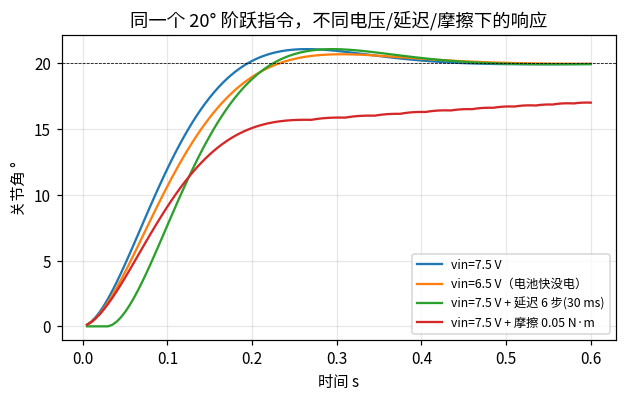

# 第 17 章 · 动作、执行器与域随机化

> **上一章我们有了什么**：61 维观测和 16 项奖励的每一个数字。
>
> **这一章要补什么**：策略吐出 14 个数之后发生了什么。它们怎么变成舵机的目标角、舵机里的芯片怎么把"目标角"变成电压、
> 电压怎么变成力矩。然后是 sim2real 最核心的一招——**域随机化**：给 4096 只机器人各配一套略有不同的"身体"，
> 用第 4 章的期望把“在设定的物理参数分布上平均表现好”写成训练目标。
>
> **本章新词**：目标角、固件位置环、反电动势、域随机化。
> **需要的前提**：第 4 章的均匀分布与期望，第 1 章的函数。

---

## 17.1 动作 → 目标角：加上站姿

策略输出 $\mathbf{a} \in \mathbb{R}^{14}$。它**不是**关节角本身，而是**相对 HOME 站姿的偏移**：

$$q^{\text{target}}_j = \text{HOME}_j + a_j \times \text{scale} - \text{bias}_j\qquad \text{scale} = 1.0$$

实验 `ch17_bam_motor.py` 第 1 节随机抽了一组 a，算出目标角：

```
idx         关节  HOME (rad)      动作 a  目标角 (rad)  目标角 (°)
---  -----------  ----------  ----------  ------------  ----------
  2  L_hip_pitch     -0.4579    0.192127     -0.265773    -15.2277
  4      L_ankle       0.453   -0.160701      0.292299     16.7475
  5   neck_pitch      0.3491    0.108479      0.457579     26.2173
 12       R_knee       0.0049   -0.697509     -0.692609    -39.6836
```

三点：
- **HOME** 是站姿（左右腿镜像：髋俯仰 ∓26.24°、踝 ±25.95°、颈和头各 20°）。观测里的 `joint_pos` 减的也是它——**观测和动作共用一个零点**。
- **scale = 1.0**：策略输出 1 个单位 = 1 弧度 = 57°。所以策略必须学会输出很小的数（走路时 |a| 通常 < 0.3）。这就是为什么 `action_rate` 惩罚要课程式加重（第 18 章）。
- **策略输出不额外裁剪**：模型仍有执行器电压饱和、控制范围和关节物理限位；`dof_pos_limits` 是学习代价，不是真机安全保证。

## 17.2 舵机里发生什么：BAM 模型

真机的舵机是 Dynamixel XL330。它收到目标角后，**芯片里的固件**自己跑一个位置环，输出**电压**给电机。
仿真里如果只用理想的"弹簧"（位置 PD），策略到真机上会发现舵机比想象中软、慢、有死区——这是 sim2real 最大的坑之一。
仓库用 **BAM**（Better Actuator Models）——一个用真舵机数据拟合出来的电压模型，逐级复现固件的行为。三步：

### ① 固件位置环：误差 → 占空比 → 电压

$$\text{duty} = (q^{\text{target}} - q)\cdot k_p\cdot g \qquad V = v_{in}\cdot\text{clip}(\text{duty}, -1, 1)$$

| 符号 | 就是 |
|---|---|
| $q^{\text{target}} - q$ | 目标角减当前角（rad） |
| $k_p$ | 固件的 P 增益。Microduck 设 200（出厂 400） |
| $g$ | `error_gain` = (4096/2π)/(256×885) = 0.00288，把"弧度"换算成固件内部的"编码器计数 / PWM 单位" |
| duty | 占空比，PWM 的开通比例，夹在 ±1 |
| $v_{in}$ | 电池电压，名义 7.5 V |

实验第 2 节：

```
位置误差 (°)  占空比（裁剪前）     电压 V
------------  ----------------  ---------
           1         0.0100439  0.0753296
           5         0.0502197   0.376648
          20          0.200879    1.50659
         120           1.20527        7.5      ← 饱和
```

正常走路时关节误差只有几度，电压只用零点几伏——舵机远没到极限。限制它的是下一步。

### ② 直流电机：电压 → 力矩，减去反电动势

$$\tau = \frac{k_t V}{R} - \frac{k_t^2\,\dot q}{R}$$

| 符号 | 就是 |
|---|---|
| $k_t$ | 力矩常数 0.366 N·m/A（BAM 对真舵机拟合的值） |
| $R$ | 绕组电阻 2.81 Ω |
| $\dot q$ | 关节转速 rad/s |
| 第二项 | **反电动势**：电机转得越快，自己发的电越抵消外加电压，推力越小 |

```
转速 q̇ (rad/s)  满电压 7.5 V 时的力矩 (N·m)
---------------  ---------------------------
              0                     0.976421     ← 堵转力矩
              5                     0.738165
             10                      0.49991
         20.491                            0     ← 空载最高转速
```

堵转力矩 0.98 N·m（路线图里实测的 ±0.96 N·m 就是它）。这是一只 25 cm 机器人能用的全部力气。

### ③ 摩擦与电池

BAM 还算每个关节的**摩擦预算**（库仑 + Stribeck + 随负载变化的项，M6 模型），写进 MuJoCo 的 `dof_frictionloss` 让求解器处理；
以及**电池压降** $v_{in}^{\text{eff}} = \max(v_{in} - g_d\sum|\tau|, 6.0)$——所有舵机一起使劲时电压会塌。



实验第 4 节用这套方程仿真"让一个关节从 0 追到 20°"：7.5 V 时 0.1 秒到 12°，0.6 秒才到位；电压低、有延迟、有摩擦时各慢一截。
实验是简化的单关节响应示例，用来理解电压、延迟和摩擦；完整训练使用 BAM。这样的建模有助迁移，但不能保证真机行为一致。

### 时序

策略 50 Hz（每 0.02 s 出一次目标角），BAM 和物理 200 Hz（每 0.005 s 算一次电压和力矩，`decimation=4`）。
另外目标角送到舵机有 **3–6 个物理步延迟**（15–30 ms，随机；17.5 节核对计时单位），模拟真机通信延迟。

## 17.3 域随机化：4096 只不一样的机器人

仿真永远不等于真机：质量差几克、电池电量不同、脚底打滑程度不同、IMU 装歪一点。策略如果只在"一台标准机器人"上练，到真机就废。

**域随机化**（domain randomization, DR）：每只仿真机器人（每次回合）从一个范围里**随机抽一套参数**。策略见过几千种"身体"，就学会了对这些差异不敏感。

实验第 5 节列了走路任务真正在随机化的量：

```
             随机化的量              分布  期望  这只机器人抽到的
-----------------------  ----------------  ----  ----------------
       电池电压 vin (V)       U(6.5, 8.2)  7.35           7.74041
       压降增益 (V/N·m)       U(0.0, 0.2)   0.1         0.0351311
摩擦倍率 friction_scale       U(0.9, 1.1)     1           1.07264
           脚底摩擦系数       U(0.7, 1.3)     1           1.02488
           躯干质量倍率     U(0.95, 1.05)     1          0.979971
       编码器偏置 (rad)  U(-0.015, 0.015)     0       -0.00231938
       躯干质心偏移 (m)  U(-0.003, 0.003)     0       -0.00283008
     IMU 安装误差角 (°)       U(0.0, 6.0)     3            0.7457
```

（第 4 章的均匀分布 U(a, b)，期望 (a+b)/2。）完整清单和"什么时候抽"：

| 什么时候抽 | 抽什么 | 意义 |
|---|---|---|
| **开局一次**（整个训练不变） | 脚底摩擦、编码器偏置、躯干质量惯量 ±5%、电池电压、压降增益、IMU 误差 | 模拟"这台机器人"的固定特性 |
| **每回合** | 躯干质心偏移（课程从 ±3 mm 涨到 ±15 mm）、头部质心、BAM 摩擦倍率、转子惯量 ±10% | 模拟每次开机的小变化 |
| **每 3–6 秒** | 推一把：给躯干加 ±0.3 m/s 的速度 | 模拟被碰、地面不平 |

**用第 4 章的语言写训练目标**：不再是"让 $\mathbb{E}[G]$ 最大"，而是

$$\max_\theta\ \mathbb{E}_{\xi\sim\text{DR}}\Big[\ \mathbb{E}[G\mid\xi]\ \Big]$$

ξ（"克西"）是一套随机抽的物理参数。策略要在**参数分布上的平均**表现好。4096 个环境同时抽 4096 套 ξ，这个外层期望也是用样本平均估的（大数定律）。

### 三条实践规则（每条都是踩坑换来的）

1. **不能累积**。每回合重新抽的量必须"先恢复默认值再加偏移"，不能在上一回合的基础上再加。曾经一个质心随机化每回合累加，几个月里每次长训练都越来越差。
2. **BAM 下摩擦要走 BAM 的接口**。BAM 把 MuJoCo 自己的关节摩擦清零、自己算，所以随机化 MuJoCo 的 `dof_frictionloss` 是**静默的无操作**；要随机化 BAM 的 `friction_scale`（`randomize_bam_friction`）。
3. **IMU 误差是零中心的**。它训练的是"容忍随机方向的小偏差"，**不能**补偿真机上一个固定方向的安装偏差——那要在真机运行时校准。

---

## 17.4 目标位置不是瞬间位置：从指令到力矩算一遍

假设 HOME=0.35 rad、动作 a=0.10、scale=1、编码器偏置 0.01 rad：

$$q^{target}=0.35+0.10-0.01=0.44\ \mathrm{rad}.$$

若当前真实角度 q=0.40 rad，位置环看到的误差是 0.04 rad。
用 $k_p=200$、$g\approx0.00288$、电池 7.5 V：

$$duty\approx0.04\times200\times0.00288=0.02304,$$
$$V\approx7.5\times0.02304=0.1728\ \mathrm V.$$

占空比约 2.3%，表示按该方向施加一小部分供电电压。
它不是“关节完成了目标的 2.3%”，也不是直接给出转速。
正负号表达驱动方向，绝对值限制在 1 以内。

用本章拟合参数 $k_t=0.366,R=2.81$，若关节暂时不转，理想电磁力矩约为：

$$\tau=0.366\times0.1728/2.81\approx0.02251\ \mathrm{N\cdot m}.$$

若此时已沿正方向转到 0.2 rad/s，还要减去
$0.366^2(0.2)/2.81\approx0.00953$，剩约 0.01297 N·m。
再考虑摩擦、重力和负载，这个小力矩可能不足以让关节立刻追上目标。
网络输出 +0.10，并不意味着下一帧角度必然增加 0.10。

这些是帮助理解链条的近似手算，不能把忽略负载的电磁堵转值当成可长期使用的舵机安全力矩。

## 17.5 两种延迟的“步”，先问是哪只钟

观测里配置的一个环境步是 0.02 s；执行器 `delay_min_lag` / `delay_max_lag`
在当前 mjlab 的 `ActuatorCfg` 中明确按**物理步**计数。
`ManagerBasedRlEnv.step()` 的 decimation 循环内，每个物理子步都会写执行器控制；
`Entity._apply_actuator_controls()` 调用 `act.apply_delay()` 再算力矩。

所以执行器 3～6 步对应：

$$3\times0.005=0.015\ \mathrm s,\qquad6\times0.005=0.030\ \mathrm s.$$

即 **15～30 ms**，不是 60～120 ms。
两种参数名都出现 lag/step，并不意味着共享一个计时单位。

一个固定 3 步延迟的教学序列应该是：

```text
写入目标：1  1  1  1  1 ...
到达目标：0  0  0  1  1 ...
```

lag=0 应在第一次更新就收到 1。
实验用简单缓冲区演示这件事，真实实现还会重采延迟并按环境保存缓冲状态。

### 延迟、摩擦和动作平滑各自解决什么

延迟让命令晚到；摩擦阻碍或限制运动；平滑惩罚让策略倾向少做突变。
三者都可能让观测中的运动“变慢”，却不是同一种效果。
因此在训练里加了某种滤波，部署必须一致；不能用“反正电机也慢”来替代传递行为的核对。

## 17.6 域随机化不是“越随机越强”

假设一种质量设置出现概率 0.9、回报 10，另一种出现概率 0.1、回报 −20。
平均目标是 $0.9\times10+0.1\times(-20)=7$。
平均表现可以不错，同时在少数设置下很差。因此 DR 的期望目标不等于“每一种真机都必然成功”。
重要边缘条件要单独评估；分布之外的真实误差也不会因为训练用了随机化就自动解决。

随机化还要符合物理：把质量改变却不一致地处理惯量，可能造出并不存在的身体。
把质心范围放到根本无法保持稳定的区域，可能只是让训练不断面对无法完成的任务。
课程逐步扩大范围是在管理学习难度，不是在保证任意范围最终都可学。

“不能累积”的差别可以直接用两个 reset 看懂。
默认质心位置为 10 mm，每次抽到偏移 +1 mm：正确做法两次都得到 11 mm；
错误做法先变 11、下一次在其上再加，变成 12 mm，长训练会持续漂移。
mjlab 1.3.0 的对应 add/scale DR 操作会读默认值；自定义函数仍要核对基准。

**自测**：IMU 每次有零均值噪声，是否等于一个固定 +5° 的安装偏差？

**解释**：不是。前者反复测量可以部分平均掉，后者持续改变读数坐标。
随机化可训练容忍度，真机固定安装关系仍要校准并保持训练部署约定一致。

## 📍 映射到项目

> 只需看一眼。

**动作换算**：`mjlab/envs/mdp/actions/actions.py` 的 `JointPositionAction`：

```python
self._processed_actions = self._raw_actions * self._scale + self._offset    # a × 1.0 + HOME
...
target = self._processed_actions - encoder_bias                            # 再减编码器偏置
```

`scale = 1.0` 在 `microduck_velocity_env_cfg.py`：`joint_pos_action.scale = 1.0`。

**BAM 参数**：`src/mjlab_microduck/robot/microduck_constants.py`：

```python
_BAM_ACTUATOR_KWARGS = dict(
    motor_name="xl330", model="m6",       # 舵机型号、BAM 的第 6 代摩擦模型
    kp_fw=200.0,                          # 固件 P 增益（17.2 ①）
    vin_range=(6.5, 8.2),                 # 电池电压 U(6.5, 8.2)
    vin_drop_gain_range=(0.0, 0.2),       # 压降增益
    vin_min=6.0,                          # 电压地板
    delay_min_lag=3, delay_max_lag=6,     # 命令延迟 3–6 步
)
```

**电机方程**在 `bam/actuator.py`（`.venv` 里）：`compute_control()` 是 ①，`compute_torque()` 对应 ②；正文提取的是理解用的核心关系，完整模型还包含其他计算。
拟合参数在 `bam/params/xl330/m6.json`。

**域随机化事件**：`microduck_velocity_env_cfg.py` 的 `cfg.events[...]`，每一项写明 `mode="startup" / "reset" / "interval"`。
其中 `expand_bam_friction_fields` 是个空函数，只为了声明"我要按环境展开 `dof_frictionloss` 字段"——不注册它，BAM 的每环境摩擦会塌成一个共享值。

## 🧪 动手实验

```bash
uv run python docs/learn-zh/labs/ch17_bam_motor.py
```

1. 动作 → 目标角。
2. 固件位置环：误差 → 电压。
3. 直流电机：电压 → 力矩，反电动势。
4. 阶跃响应仿真，画图。
5. 域随机化：每只机器人抽一套参数。

**改一改**：第 4 节把 `KP` 改成 400（出厂值），看阶跃响应快多少、有没有过冲。Microduck 用 200 是因为真机就是这么设的。

## 本章小结

- 动作 = **相对 HOME 的偏移**，scale 1.0 → 1 单位 1 弧度；观测和动作共用 HOME 零点。
- **BAM**：固件位置环（误差 → 占空比 → 电压）→ 直流电机（$\tau = k_tV/R - k_t^2\dot q/R$）→ 摩擦预算 + 电池压降。堵转力矩约 0.98 N·m。
- 策略 50 Hz，物理和 BAM 200 Hz，命令延迟 3–6 个物理步，即 15–30 ms。
- **域随机化** = 训练目标变成对物理参数分布的期望；开局抽、每回合抽、定时推。
- 三条规则：不累积、BAM 下用 `friction_scale`、IMU 误差零中心。

**下一章**：好几个东西是"随训练进度变化"的：action_rate 权重从 −0.1 到 −1.0、质心偏移从 3 mm 到 15 mm、头部命令范围从 5% 到 100%。
这叫课程学习，它是一张时间表，也是读 wandb 曲线时最容易误判的地方——[第 18 章 · 课程学习与读懂 wandb](18-课程学习与读懂wandb.md)。
