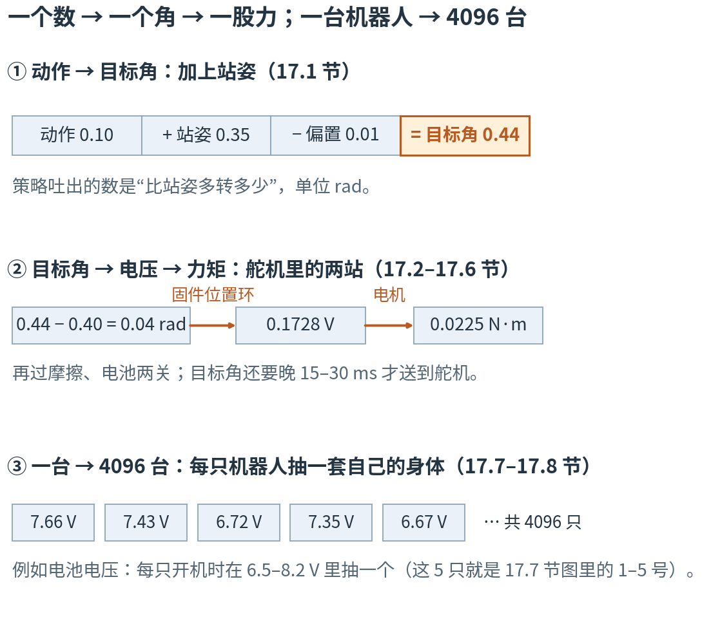
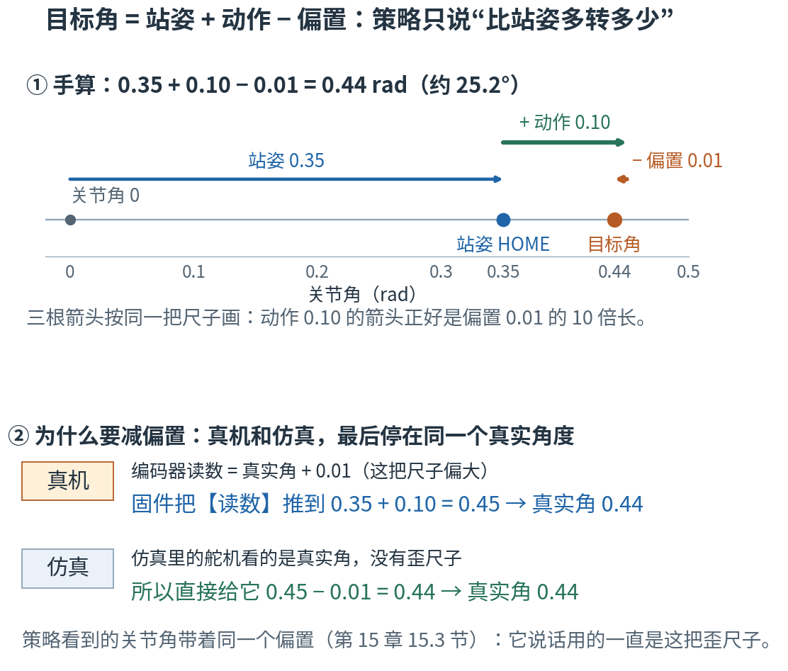
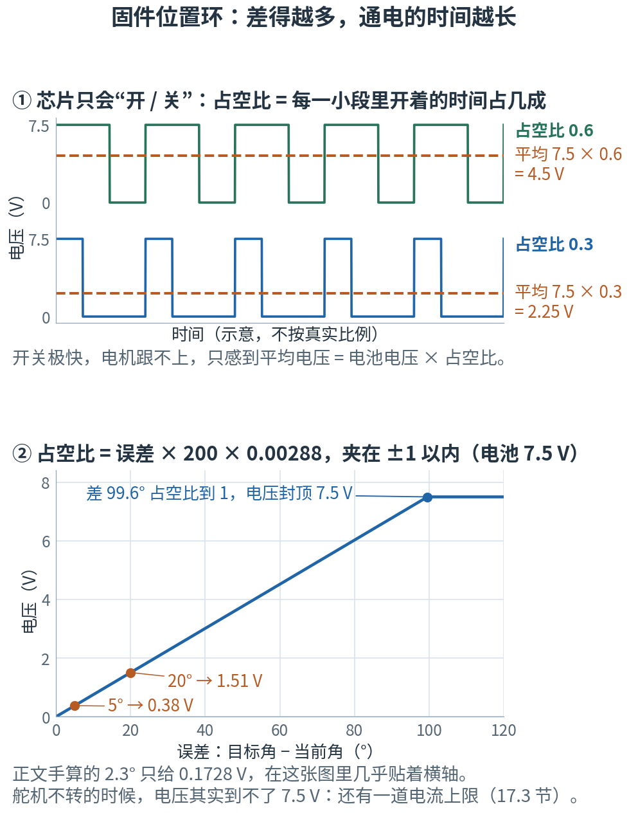
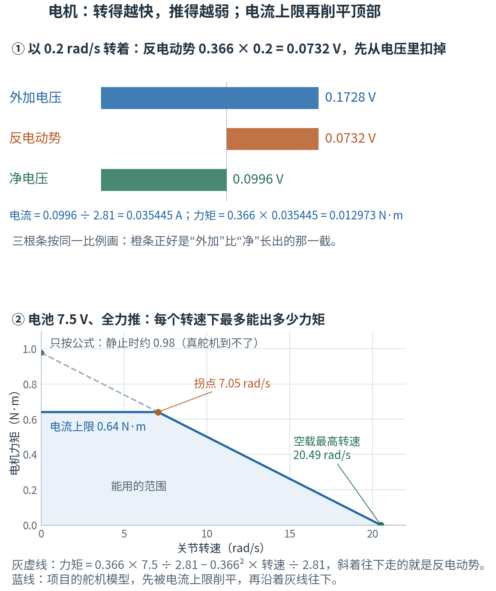
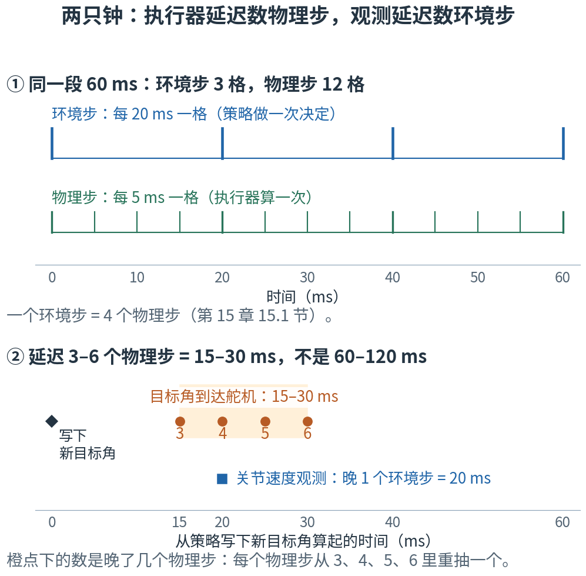
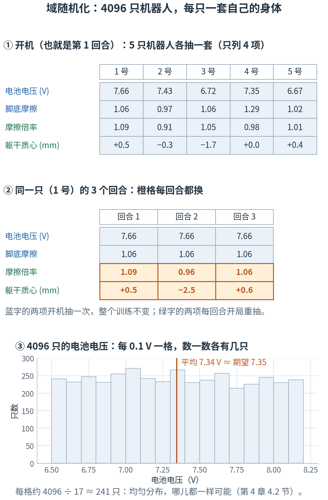

# 第 17 章 · 动作、执行器与域随机化：一个数变成一股力，一台机器人变成 4096 台

> **上一章我们有了什么**：第 15 章拆开了策略每一步看到的 61 个数，第 16 章拆开了它每一步拿到的分。"看"和"得分"两头都清楚了。
>
> **这一章要补什么**：中间还缺"做"。策略每 0.02 秒吐出 14 个数，然后呢？这 14 个数怎样变成 14 个舵机要转到的角度？
> 舵机又怎样把"转到那里"变成电压、再变成真正推动关节的力？这条链上每一环都和理想情况不一样：电压有上限，电流有上限，
> 转得越快推得越弱，齿轮里有摩擦，命令还要晚十几毫秒才到。最后一件事：仿真里的机器人和真机总有差别，
> 项目的对策是让 4096 只仿真机器人各带一套略有不同的"身体"去练。
>
> **本章新词**：目标角、固件位置环、占空比、反电动势、执行器、BAM、域随机化。
> **需要的前提**：第 15 章的关节角、编码器偏置和延迟（15.1、15.3、15.4 节），第 4 章的均匀分布、期望和大数定律（4.2、4.3、4.5 节），
> 第 9 章的"环境"和"目标"（9.2、9.9 节）；初中物理的欧姆定律（电流 = 电压 ÷ 电阻）。
> **不要求**懂电机或电路：用到的物理都当场讲，每一步都有能手算的小数字。标"进阶"的折叠块可以第二遍再读。

---

## 17.0 先看地图：一个数 → 一个角 → 一股力；一台机器人 → 4096 台

**策略吐出的数是"比站姿多转多少"，加上站姿、减去编码器的偏置，就是目标角。舵机里的芯片看"还差多少"决定给几成电压，
电机把电压变成力矩，转得越快推得越弱，还要过摩擦和电池两关；目标角本身还要晚 15–30 毫秒才送到。
训练时，4096 只机器人的这些物理参数各抽各的，逼策略对这些差别不敏感。**

假设你写了一个遥控空调的网页。网页只做一件事：发出一个目标温度，比如 24°。温度怎么降下来，网页管不着——
空调里有一块温控芯片，看"现在比目标高几度"：高得多，就让压缩机多出力；快到了，就少出一点。
压缩机再使劲也有上限；你点下按钮，要过一小会儿空调才收到。
这个网页要装进千家万户：每家的空调新旧不同、房间大小不同、电压也不同。你没法挨家去试，只能在测试时故意模拟各种情况——
就像在浏览器的开发者工具里把网速调慢、把 CPU 降速，确认页面在最差的设备上也能用。

这一章讲的就是这三件事：网页发出的目标（17.1 节），空调里那条"目标 → 出力"的链（17.2–17.6 节），千家万户的差别（17.7–17.8 节）。



**读图顺序：** 从 ① 到 ③ 竖着读。① 是 17.1 节的一次加减法；② 是一个关节里从"还差多少"到"推多大劲"的两站，数字是 17.2、17.3 节要手算的同一组；
③ 是 4096 只机器人各抽各的电池电压。图里的数现在不用算，到了各节会一个一个算出来。

| 概念 | 它在回答什么问题 | 空调里对应什么 | 在哪一节 |
|---|---|---|---|
| 目标角 | 策略吐出的数，和舵机要转到的角是什么关系？ | 网页发出的目标温度 | 17.1 |
| 固件位置环、占空比 | 舵机收到目标角，按什么给电？给了几成？ | 温控芯片看差几度，决定压缩机开几成 | 17.2 |
| 反电动势 | 为什么电机转得越快，推得越弱？ | （没有现成的对应，17.3 节用自行车讲） | 17.3 |
| 执行器、BAM | 从目标角到力矩这一整套，仿真里怎么算？ | 空调的整机模型 | 17.4 |
| 延迟 | 目标角多久才送到舵机？ | 按下按钮到空调收到 | 17.5 |
| 域随机化 | 怎样让一个策略对付各种略有不同的机器人？ | 在各种设备、各种网速下测试 | 17.7–17.8 |

表里的名字先不背，到了各节再给。本章最容易混的四处，先贴上标签：

- **两种"步"**：策略每 0.02 秒做一次决定；仿真器在这 0.02 秒里其实算了 4 次物理，每次 0.005 秒（第 15 章 15.1 节）。
  本章的执行器延迟按 0.005 秒那种步数，第 15 章 15.4 节的观测延迟按 0.02 秒那种步数。"延迟 3 步"是 15 毫秒还是 60 毫秒，先问是哪只钟（17.5 节）。
- **占空比不是"完成了百分之几"**：17.2 节会算出一个 2.304% 的占空比。它说的是"这一刻给了电池电压的 2.304%"，不是"关节走完了目标的 2.304%"，也不是转速。
- **同一个字母，前面的章用过**：本章的 V 是电压（单位伏），不是第 10 章 10.1 节的价值 V；本章的 τ 是力矩（单位 N·m），不是第 9 章 9.5 节的轨迹 τ。看单位就分得开。
- **两种"摩擦"**：脚底摩擦是脚和地面之间的，一个没有单位的系数（0.7–1.3）；关节摩擦是舵机齿轮里的，单位 N·m。域随机化两样都改，改法不同（17.4、17.7 节）。

现在觉得这些区别有点抽象很正常，读到对应小节就清楚了。

第一次读，按顺序看正文、图和手算；标"进阶"的折叠块可以先跳过；代码是复核工具，不是阅读门槛。
本章的实验只在 CPU 上读配置、调用项目舵机模型自己的两个函数核对手算，不建环境、不训练。
读完 17.6 节，"动作怎样变成关节转动"这条链就齐了；17.7–17.8 节讲域随机化，第一遍可以分两次读。

## 17.1 目标角：站姿 + 动作 − 偏置，策略只说"比站姿多转多少"

第 15 章 15.3 节已经说过：策略吐出的 14 个数，每个的意思是"目标角比站姿多转多少"，单位 rad。现在把这句话落成一次加减法。

手算一次，用教学构造的数（接近颈俯仰关节的站姿 0.3491 rad，也就是 20°）：

- 站姿 HOME：0.35 rad。
- 策略吐出的动作：+0.10，意思是"比站姿多转 0.10 rad"。
- 这只舵机的编码器偏置：0.01 rad。第 15 章 15.3 节说过，编码器装配时有零点误差，这一只的读数总比真实角度大 0.01。

$0.35 + 0.10 - 0.01 = 0.44$ rad，约 25.2°。这个 0.44 就是这一步交给舵机的**目标角**（target joint position）。

为什么要减偏置？先看真机。策略看到的关节角带着同一个偏置（15.3 节），它说"比站姿多转 0.10"，用的也是这把偏大 0.01 的尺子，
所以舵机的芯片会把**读数**推到 0.35 + 0.10 = 0.45——这时真实角度是 0.45 − 0.01 = 0.44。
仿真里的舵机没有歪尺子，看的就是真实角度，于是 mjlab 直接把目标定成 0.44。两边最后停在同一个真实角度上。
15.3 节那句"编码器读数和舵机目标用的是同一把歪尺子"，算术就是这一步。



**这样读图：** ① 是一根按真实比例画的数轴：从 0 出发，先走到站姿 0.35（蓝），再往右走动作 0.10（绿），最后往回退偏置 0.01（橙），停在目标角 0.44。
三根箭头的长度就是三个数的大小——偏置那根小到只剩一个箭头尖，因为 0.01 本来就小。② 是"减偏置"的理由：真机和仿真用不同的办法，停在同一个真实角度。

写成公式（14 个关节各算一次）：

$$q^{\text{target}} = \text{HOME} + a \times \text{scale} - \text{bias}$$

| 符号 | 怎么读 | 就是 |
|---|---|---|
| $q^{\text{target}}$ | "q target" | 目标角：这一步要舵机转到的角度，单位 rad。q 是本章给关节角用的字母（小写 q，和第 10 章的动作价值 Q 无关） |
| HOME | | 站姿：这个关节在标准站姿时的角度（第 15 章 15.3 节） |
| $a$ | "a" | 策略吐出的动作，14 个数里的一个 |
| scale | | 动作的放大倍数。项目里是 **1.0**：动作 1 个单位 = 1 rad ≈ 57.3° |
| bias | | 编码器偏置：每只机器人的每个关节开机时抽一个，在 ±0.015 rad 之间（15.3 节） |

14 个关节一起算，就是第 2 章 2.1 节的逐项运算：

```js
const target = home.map((h, j) => h + a[j] * scale - bias[j]);   // 14 个关节，各算各的
```

项目里 14 个关节的站姿（实验第 1 节从机器人模型里读出来）：左右髋俯仰 ∓26.24°、左右踝 ±25.95°、颈俯仰和头俯仰各 20°、
左右髋横滚 ∓5°、左右膝 ∓0.28°，其余是 0。左右腿的数互为相反数：两条腿是镜像的。

**scale = 1.0，而且不裁剪。** 策略输出 1 个单位就是 1 rad ≈ 57.3°，一个很大的角度；项目也没给动作设上下限（配置里 `clip = None`）。
第 6 章 6.3 节说过，网络最后一排不装门，输出的数本身没有范围。那动作"想要多大都行"吗？不是。限制都在链条的下游：
目标角离当前角再远，舵机给的电压也有上限（17.2 节），电流也有上限（17.3 节），关节还有机械限位。
奖励里另有一项关节限位惩罚 `dof_pos_limits`，权重 −1.0（第 16 章讲奖励时列过）：它是训练时的扣分，不是真机上的安全保证。
另外，动作每步变 0.1，目标角就跳 0.1 rad ≈ 5.7°——第 16 章里罚"相邻两步动作之差"的那一项，罚的就是这种跳动。

训练时，这 14 个数是从第 4 章 4.7 节那口钟里抽出来的（均值 + 标准差 × 噪声）；部署到真机时用钟的均值，第 19 章（导出与部署）讲。

> **停一下，自测**：左髋俯仰这样的关节，站姿是负的。假设 HOME = −0.46 rad，动作 +0.06，这只舵机的编码器偏置是 −0.01（读数比真实偏小）。目标角是多少？
> <details><summary>答案</summary>
>
> $-0.46 + 0.06 - (-0.01) = -0.39$ rad。减一个负的偏置，等于加 0.01：芯片把读数推到 −0.46 + 0.06 = −0.40，
> 读数比真实小 0.01，真实角度就是 −0.40 + 0.01 = −0.39。
>
> </details>

## 17.2 固件位置环：差得越多，通电的时间越长

目标角 0.44 送到了舵机。Microduck 的 14 个舵机都是 Dynamixel XL330：一个小盒子，里面有电机、一串减速齿轮、一个测转角的编码器，和一块小芯片。
芯片里跑着厂家写好的程序（固件），它不停地做同一件事：读编码器 → 算"目标角减当前角还差多少" → 按差多少给电机加电压 → 再读编码器……

手算一次。假设此刻关节在 0.40 rad，目标 0.44，差 0.04 rad（约 2.3°）。固件把这个差连乘两个数：

- 乘 200：固件的**比例增益**。差得越多给得越多，比例就是它。
- 乘 0.00288：一个换算系数（这一节后面解释），把"差多少弧度"换成"该通几成电"。

$0.04 × 200 × 0.00288 = 0.02304$。这个数的意思是：**这一刻，把电池电压的 2.304% 加给电机。**
电池名义电压 7.5 V，所以加到电机上的是 $7.5 × 0.02304 = 0.1728$ V。

"几成电"是怎么给的？芯片不会调电压的大小，它只会开、关：在极短的一小段时间里，开着一部分、关着一部分，一段接一段。电机跟不上这么快的开关，只感到平均值。



**这样读图：** ① 是开关的样子（时间轴是示意）。图里写的"占空比 0.3"就是"每一小段开 3 成"，这个名字下面马上正式给。蓝线每一小段只开 3 成，平均电压 7.5 × 0.3 = 2.25 V；绿线开 6 成，平均 7.5 × 0.6 = 4.5 V。橙色虚线就是电机"感到"的电压。
② 横轴是误差（度），纵轴是电压：误差越大，电压越高，是一条直线；差到约 99.6° 时开关一直开着，电压到顶 7.5 V，再差也不会更高。
开头手算的 2.3°、0.1728 V 在这张图里几乎贴着横轴——追小误差时，舵机只用得到零点几伏。

每一小段里开着的比例，叫**占空比**（duty cycle）。它夹在 −1 到 1 之间：正负号是往哪边推，1 就是一直开着、把整块电池的电压全给上。
芯片里这套"读角度、算差、定占空比"的循环，叫**固件位置环**（firmware position loop）：固件（写在芯片里的程序）围着位置（角度）转的一个环。

> ⚠️ **占空比不是"完成了百分之几"。** 2.304% 说的是"这一刻给了电池电压的 2.304%"，和"关节走完了目标的几成"毫无关系；它也不是转速。
> 下一刻关节动了，差变了，占空比马上跟着变。

写成公式：

$$\text{占空比} = \text{clip}\big(k_p\,k_e\,(q^{\text{target}} - q),\ -1,\ 1\big), \qquad V = v_{in} \times \text{占空比}$$

| 符号 | 怎么读 | 就是 |
|---|---|---|
| $q$ | "q" | 此刻的关节角（编码器读到的），rad |
| $k_p$ | "k p" | 固件的比例增益。项目设 200（XL330 的默认值是 400） |
| $k_e$ | "k e" | 换算系数 0.0028774（代码里叫 `error_gain`；e 取自 error"误差"，和 17.3 节的反电动势无关），手算取三位：0.00288 |
| clip(x, −1, 1) | "夹到 −1 和 1 之间" | 小于 −1 的算 −1，大于 1 的算 1，中间的不变 |
| $v_{in}$ | "v in" | 电池电压，名义 7.5 V |
| $V$ | "V" | 加在电机上的电压，单位伏 |

> ⚠️ 本章的 V 是电压，单位伏；第 10 章 10.1 节的 V 是价值。字母一样，看单位就分得开。

```js
const clip = (x, lo, hi) => Math.min(Math.max(x, lo), hi);
const duty = clip(kp * ke * (qTarget - q), -1, 1);   // 占空比：夹在 ±1 之间
const V = vin * duty;                                // 加在电机上的电压
```

**换算系数只管换单位。** 0.00288 把"差多少弧度"先换成编码器的格数，再换成"占满格的几成"。三个原料都来自 XL330 自己：
编码器一圈 4096 格（和 4096 只机器人碰巧同一个数，没有关系），固件内部除以 256，占空比的满格记作 885。浏览器控制台里按一下 `4096 / (2 * Math.PI) / 256 / 885`，得 0.0028774。

<details>
<summary>进阶：0.00288 是怎么一步步来的（现在可跳过）</summary>

1. 编码器一圈 4096 格，一圈是 2π rad，所以 1 rad = 4096 ÷ 2π ≈ 651.9 格。差 0.04 rad，就是 0.04 × 651.9 ≈ 26.08 格。
2. 固件把"差几格"乘比例增益、再除以 256，得到它内部的占空比刻度：26.08 × 200 ÷ 256 = 20.375。
   （256 是 XL330 实测的除数；项目用的舵机模型在注释里说明，手册上写的是 128。）
3. 这个刻度的满格是 885。20.375 ÷ 885 ≈ 0.02302——就是上面的占空比。
   上面用取整的 0.00288 算出 0.02304，差在第 5 位小数，是取整带来的零头。

所以 $k_e$ = (4096 ÷ 2π) ÷ 256 ÷ 885：前一步把弧度换成格，后两步把格换成"占满格的几成"。

</details>

误差再大一些呢？实验第 2 节算了三行：

```
误差 (°)  占空比  电压 (V)  舵机模型算的 (V)
--------  ------  --------  ----------------
       1  0.0100    0.0753            0.0753
       5  0.0502    0.3766            0.3766
      20  0.2009    1.5066            1.5066
```

前三列是上面的公式（$k_e$ 不取整）；最后一列是项目所用舵机模型的代码算的（17.4 节介绍这个模型）。误差这么小，两边一模一样。
要让占空比到 1，得差 1 ÷ (200 × 0.0028774) ≈ 1.738 rad，约 99.6°——也就是图 ② 里的拐角。
不过关节不转的时候，电压其实到不了 7.5 V：固件还有第二道限制，要先讲完电机才说得清（17.3 节）。

> **停一下，自测**：关节冲过了头：目标 0.44，此刻 0.54。这只机器人的电池是 8.0 V。占空比和电压各是多少？负号说明什么？
> <details><summary>答案</summary>
>
> 差 $0.44 - 0.54 = -0.1$ rad；占空比 $-0.1 × 200 × 0.00288 = -0.0576$；电压 $8.0 × (-0.0576) = -0.4608$ V。
> 负号：往回推。注意同样差 0.1 rad，电池电压越高，加上去的电压也越高——17.4 节会用到这一点。
>
> </details>

## 17.3 电机与反电动势：转得越快，推得越弱

电压加到了电机上。电机真正交出来的是**力矩**：让关节转起来的"扭劲"，单位 N·m（牛·米）。从电压到力矩，分两步算。

**第一步：电压 → 电流。** 初中物理的欧姆定律：电流 = 电压 ÷ 电阻。XL330 的电阻按 2.81 Ω（欧姆）算——这是 17.4 节那个舵机模型用真舵机的数据拟合出来的。
0.1728 V 加上去：$0.1728 ÷ 2.81 = 0.061495$ A（安培）。

**第二步：电流 → 力矩。** 电机每通 1 A 电流，关节上得到 0.366 N·m 的力矩（这个 0.366 叫力矩常数，也是拟合出来的；它已经算上了减速齿轮的放大）：$0.366 × 0.061495 = 0.022507$ N·m。

这是关节**不转**时的情形。关节一转起来，事情就变了。

骑过带车灯发电机的自行车吗？车轮带着发电机转，灯就亮；骑得越快，灯越亮，脚下也越沉——发电机在把你的劲变成电。
电机也是一台发电机：只要轴在转，线圈里就会自己生出一个电压，方向总是和转动作对：轴往外加电压推的方向转时，它和外面加的电压**相反**，抵掉一部分外加电压；转得越快，这个电压越大。
这个反着来的电压，叫**反电动势**（back-EMF）。它的大小是 0.366 × 转速——还是那个 0.366：理想电机的"每安培出多少力矩"和"每 rad/s 生出多少伏"，
在国际单位里恰好是同一个数，项目用的舵机模型也只拟合了这一个数，两处共用。

手算一次：关节已经以 0.2 rad/s 往目标方向在转。

1. 反电动势：$0.366 × 0.2 = 0.0732$ V。
2. 净电压：$0.1728 - 0.0732 = 0.0996$ V。
3. 电流：$0.0996 ÷ 2.81 = 0.035445$ A。
4. 力矩：$0.366 × 0.035445 = 0.012973$ N·m。

同样的 0.1728 V，关节不转时推 0.022507 N·m，转着时只剩 0.012973，少了四成多。



**这样读图：** ① 是刚才的手算画成三根条：蓝条是外加的 0.1728 V，橙条是反电动势 0.0732 V，绿条是剩下的净电压 0.0996 V。三根按同一比例画，橙条正好补上绿条到蓝条的差。
② 换成电池 7.5 V、全力推的情形：横轴是转速，纵轴是电机最多能出的力矩。灰虚线是只按公式算的：不转时约 0.98 N·m，
转速每快 1 rad/s 少 0.0477，到 20.49 rad/s 降到 0——这时反电动势已经顶满 7.5 V，一点电流也推不进去。
蓝线是项目的舵机模型：顶部被削平在 0.64 N·m，过了 7.05 rad/s 才沿灰线往下。削平它的是什么，下面马上讲。

这一套（先扣反电动势，再用欧姆定律，再乘力矩常数）写成一个式子：

$$\tau = k_t \cdot \frac{V - k_t\,\dot q}{R} = \frac{k_t V}{R} - \frac{k_t^2\,\dot q}{R}$$

| 符号 | 怎么读 | 就是 |
|---|---|---|
| $\tau$ | "陶" | 电机的力矩，N·m |
| $k_t$ | "k t" | 力矩常数 0.366：1 A 电流出多少 N·m；同一个数也是"每 1 rad/s 转速生出多少伏反电动势" |
| $\dot q$ | "q 点" | 关节转速，rad/s。字母头上加一点，读作"这个量每秒变多少"：q 是角度，$\dot q$ 就是角度每秒变多少 |
| $R$ | "R" | 线圈电阻 2.81 Ω |
| $V$ | "V" | 17.2 节算出的电压 |

> ⚠️ 这里的 τ 是力矩，不是第 9 章 9.5 节的轨迹 τ。

右边拆成两项：第一项 $k_tV/R$ 是不转时的力矩，第二项 $k_t^2\dot q/R$ 是反电动势扣掉的那一份。
拿手算的数代进去：$0.366 × 0.1728 ÷ 2.81 - 0.366^2 × 0.2 ÷ 2.81 = 0.022507 - 0.009534 = 0.012973$，和一步一步算的一样。

**电流上限：真舵机的顶被削平了。** 按公式，电池 7.5 V、关节被按住一点不转（这叫堵转）时，力矩是 $0.366 × 7.5 ÷ 2.81 = 0.977$ N·m，约 0.98。
可 XL330 的固件还有一道保险：**电流上限** 1.75 A，不许电流超过它（舵机模型里 XL330 的默认值；项目没改它）。电流封顶，力矩也就封顶：$0.366 × 1.75 = 0.6405$ N·m，约 0.64。
固件管不了电流本身，它手里只有占空比这一个旋钮，所以它的办法是：把占空比压到"刚好推出 1.75 A"为止。
要推出 1.75 A，只需 $1.75 × 2.81 ≈ 4.92$ V，所以关节不转时，固件最多只给 4.92 V——17.2 节图里那条通到 7.5 V 的直线，关节不转时走不到顶。
转起来以后，反电动势先吃掉一截，固件就多给这一截。比如 5 rad/s：反电动势 $0.366 × 5 = 1.83$ V，固件给 $1.83 + 4.92 = 6.75$ V（还没到 7.5 V），
扣掉反电动势净剩 4.92 V，电流仍是 1.75 A，力矩仍是 0.64——下表 5 rad/s 那一行就是这么来的。
转速到 $(7.5 - 4.92) ÷ 0.366 ≈ 7.05$ rad/s 时，"反电动势 + 4.92 V"正好等于满电压 7.5 V；再快，电池给不出更多，就推不出 1.75 A 了——这就是图 ② 里的拐点。

实验第 3 节在几个转速上把两种算法并排算了一遍：

```
转速 (rad/s)  只按公式 (N·m)  舵机模型：加上电流上限 (N·m)
------------  --------------  ----------------------------
           0          0.9764                        0.6405
           5          0.7382                        0.6405
          10          0.4999                        0.4999
          15          0.2617                        0.2617
       20.49          0.0000                        0.0000
```

表里用的是拟合出的完整参数（$k_t$ = 0.366013、R = 2.811392），所以第一行是 0.9764，不是手算的 0.977；两个都约 0.98。
转速 0 和 5 时，电流上限在起作用；10 以上，两列一样。实验还直接调用舵机模型的代码，算了误差 120°、关节不转的情形：电压 4.92 V，不是 7.5 V。

> ⚠️ **"堵转力矩 0.98 N·m"是公式值，不是舵机真能出的劲。** 公式忽略了电流上限；按固件的电流上限算，舵机不转时最多 0.64 N·m（项目的舵机模型就是这么算的），
> 而且这还没扣齿轮的摩擦（17.4 节）。估计某个姿势"舵机撑不撑得住"，要拿 0.64 比，还得留出余量。

> **停一下，自测**：电池 7.5 V、全力推，关节已经以 10 rad/s 在转。电流是多少？碰到 1.75 A 的上限了吗？力矩是多少？
> <details><summary>答案</summary>
>
> 净电压 $7.5 - 0.366 × 10 = 3.84$ V；电流 $3.84 ÷ 2.81 = 1.3665$ A，没到 1.75 A；力矩 $0.366 × 1.3665 ≈ 0.500$ N·m。
> 和表里 10 rad/s 那一行的 0.4999 对上（表里的参数多几位小数）。
>
> </details>

## 17.4 执行器与 BAM：再加上摩擦和电池，就是一只"虚拟舵机"

前两节是舵机里的两站：固件位置环（差多少 → 几成电压）、电机（电压 → 力矩）。仿真要替真舵机做这件事，还得补上两样：齿轮里的摩擦、会变的电池。

把"目标角 → 力矩"这一整套装在一起，代码里叫**执行器**（actuator）：每个 0.005 秒的物理小步（17.5 节细说），它拿到目标角和关节此刻的角度、转速，
算出电机这一步出多少力矩，交给物理引擎 MuJoCo。项目用的执行器模型叫 **BAM**（Better Actuator Models）：研究者拿真的 XL330 做实验，
记下电压、角度、转速，拟合出前两节的 0.366、2.81，还有下面的摩擦系数。这些数存在 bam 包的 `xl330/m6.json` 里（BAM 有 m1 到 m6 六种摩擦模型，一种比一种细，项目用最细的 m6）。

为什么不用一根理想弹簧？理想弹簧"差多少、推多少"：没有电压上限、没有电流上限，也没有随负载变的摩擦。
在理想弹簧上练出来的策略，到了真舵机上会发现推不动、跟不上、差一点就停住。BAM 把这些都放进了仿真。

**摩擦：每一步先算一笔预算。** 齿轮之间有摩擦。BAM 每个物理步给每个关节算一笔**摩擦预算**，由三份组成：

- 一份固定的：0.00477 N·m（最基本的滑动摩擦）。
- 一份只在很慢时才有的：0.00468 N·m。推过重箱子就知道：推动之前最费劲，一动起来就轻了。转速到 2 rad/s 还剩 96%，到 3.5 rad/s 就几乎没了。
- 一份随负载变的：电机正在出的力矩 × 0.267。电机使的劲越大，齿轮之间压得越紧，越涩。
  （BAM 还有几项跟关节受的外力有关，比如重力压在关节上；下面的手算和 17.6 节的单关节都没有外力，先略去。）

手算一次：电机出 0.1 N·m、关节几乎不转：$0.00477 + 0.00468 + 0.267 × 0.1 = 0.00945 + 0.0267 = 0.03615$，约 0.036 N·m。
BAM 把这笔预算写进 MuJoCo 的"关节摩擦"那一栏（代码里叫 `dof_frictionloss`），由 MuJoCo 去施加：关节上其余的力加起来不到 0.036，关节就停着不动；
超过了，摩擦最多抵掉 0.036。电机使出的 0.1，有三成多被齿轮吃掉了。另外还有一份和转速成正比的粘滞摩擦（每 1 rad/s 0.00536 N·m），MuJoCo 按阻尼处理。

域随机化会动这笔预算：每回合给每只机器人抽一个摩擦倍率 `friction_scale`，在 0.9 到 1.1 之间，整笔预算乘上它（粘滞那一份不乘）。
为什么只能改这个倍率、不能直接改 `dof_frictionloss`，17.8 节讲。

**电池：电压不是定死的 7.5 V。** 两件事。

第一，每只机器人开机时抽一块电池，电压在 6.5 到 8.2 V 之间（第 4 章 4.2 节用的就是这个例子）。17.2 节说过，电压 = 电池电压 × 占空比：
同样差 0.04 rad，占空比都是 0.02304；电池 6.5 V 时加上去 $0.02304 × 6.5 = 0.14976$ V，8.2 V 时是 $0.02304 × 8.2 = 0.188928$ V，
相差 $8.2 ÷ 6.5 ≈ 1.26$ 倍。**电池电压低，舵机就"软"：同样的误差，推得更轻。**

第二，14 个舵机一起使劲时，电池电压会往下掉，叫**压降**：

有效电压 = 电池电压 − 压降增益 × 14 个舵机力矩大小之和，但不低于 6.0 V。

压降增益每只机器人开机时在 0 到 0.2 之间抽一个，单位 V/(N·m)：总力矩每多 1 N·m，电压掉多少伏。
注意它和 17.2 节的比例增益不是一回事：比例增益把误差放大成占空比，压降增益说的是电池掉多少电压。手算两次（教学构造的数）：

- 电池 7.0 V、增益 0.15、力矩大小加起来 2.0 N·m：$7.0 - 0.15 × 2.0 = 6.7$ V。
- 电池 6.5 V、增益 0.15、力矩大小加起来 4.0 N·m：$6.5 - 0.15 × 4.0 = 5.9$ V，低于 6.0，按 6.0 V 算。

算压降用的是上一个物理步的力矩：这一步的还没算出来。电池电压和压降增益都是开机抽一次，之后每回合都不重抽。

实验第 4 节从 `m6.json` 和配置里读出了这些数，重算了 0.036、1.26 倍、6.7 V 和 6.0 V 的地板。

> **停一下，自测**：两只机器人，电池一只 6.5 V、一只 8.2 V。同一个关节同样差 0.05 rad，各加多大电压？哪只的舵机"更硬"？
> <details><summary>答案</summary>
>
> 占空比都是 $0.05 × 200 × 0.00288 = 0.0288$。6.5 V 那只加 $6.5 × 0.0288 = 0.1872$ V，8.2 V 那只加 $8.2 × 0.0288 = 0.23616$ V。
> 8.2 V 那只更硬：同样的误差，推得更重。
>
> </details>

## 17.5 延迟：目标角要晚 3–6 个物理步才到

第 15 章 15.1 节说过，"一步"是 0.02 秒：策略每 0.02 秒看一次、做一次决定。可仿真器在这 0.02 秒里其实算了 4 次物理，每次 0.005 秒。
第 14 章 14.1 节给过这两个名字：策略做一次决定的 0.02 秒叫环境步，仿真器算一次物理的 0.005 秒叫物理步。本章要用它们分清一件事——延迟数的是哪只钟。
上一节的执行器就是每个物理步算一次：一个环境步里算 4 次。

真机上，策略算完目标角，要通过数据线发给 14 个舵机，这要花时间。第 9 章 9.2 节说过：这种延迟属于环境，策略管不着，只能适应。
项目在仿真里模拟它：**目标角要晚 3 到 6 个物理步才送到执行器**，而且每个物理步都从 3、4、5、6 里重新抽一个，四个数一样可能。

多少毫秒？

- 3 个物理步：$3 × 0.005 = 0.015$ s = 15 ms。
- 6 个物理步：$6 × 0.005 = 0.030$ s = 30 ms。

所以是 15–30 毫秒，平均 4.5 步，约 22.5 ms。

做法就是第 15 章 15.4 节那个队列：每个物理步把当前的目标角放进队尾，交给执行器的是往回数若干个（3 到 6 个）的那一个。
固定晚 3 步来看：旧目标是 0，从某一步起一直写入新目标 1——

```text
写入目标：1  1  1  1  1
到达目标：0  0  0  1  1
```

前 3 个物理步，执行器拿到的还是旧目标 0；第 4 步才拿到 1——比写入晚了 3 步。不延迟（晚 0 步）时，第一步就拿到 1。实验第 5 节用 mjlab 自己的延迟缓冲跑出的就是这两串数。



**这样读图：** ① 同一段 60 ms，上面一把尺子是环境步（每格 20 ms），下面一把是物理步（每格 5 ms）：环境步的一格等于物理步的 4 格。
② 从策略写下新目标角（黑色菱形）算起，它要晚 3、4、5 或 6 个物理步才到达舵机（橙点下的数），也就是 15–30 ms 之间。
蓝方块是第 15 章观测里关节速度的延迟：晚 1 个环境步，就是 20 ms——那把钟的一格就有 20 ms。

> ⚠️ **"延迟 3 步"先问是哪只钟。** 执行器延迟的参数（`delay_min_lag = 3`、`delay_max_lag = 6`）按物理步数；
> 第 15 章 15.4 节观测延迟的参数（关节速度的 `delay_max_lag = 1`）按环境步数。参数名字一样，钟不一样。
> 误把执行器的 3–6 步当成环境步，就会算成 $3 × 0.02 = 0.06$ s 到 $6 × 0.02 = 0.12$ s，也就是 60–120 ms——差了 4 倍。

> **停一下，自测**：有人把执行器延迟改成最少 2 步、最多 8 步。目标角最早、最晚各晚多少毫秒？同样一个 8，要是写在观测延迟的参数里，又是多少毫秒？
> <details><summary>答案</summary>
>
> 执行器按物理步：$2 × 5 = 10$ ms 到 $8 × 5 = 40$ ms。观测按环境步：$8 × 20 = 160$ ms。
>
> </details>

## 17.6 连起来：一个 20° 的目标，关节怎么追

把 17.2–17.5 节接起来，看一个关节怎样追一个目标：让目标角在 0 时刻从 0 一下子跳到 20°，看关节角随时间怎么变。
这种"目标突然跳一格"的测试，叫**阶跃响应**。

实验第 6 节做了一个简化的单关节：没有重力，没有地面，只有电机转子和一点负载要转动。一样东西转起来有多"沉"，叫**转动惯量**：
同样的力矩，转动惯量越大，转得越慢起来。每个物理步（5 ms）：用 17.2 节的固件位置环算电压、17.3 节的公式算力矩（这两步直接调用项目舵机模型的代码），
再按"力矩 ÷ 转动惯量 = 转速每秒变多少"推出转速和角度怎么变。
这后一步是实验自己写的几行，不是 MuJoCo；"加摩擦"那种情形，也是照 17.4 节的摩擦预算自己写的简化版：推力不超过预算就停住，超过了就扣掉预算。
所以下表和下图的数都出自这个简化模型——既不是 MuJoCo 跑出来的，也不是真机上量的。拿它比"谁快谁慢、差几成"可以，具体的数只当量级看。
四种情形，每次只改一样：

```
             情形  0.02 s (°)  0.1 s (°)  到 18° (s)  最高 (°)  0.6 s (°)
-----------------  ----------  ---------  ----------  --------  ---------
       电池 7.5 V        1.09       12.0       0.160      21.1       20.0
       电池 6.5 V        0.94       10.7       0.185      20.7       20.0
7.5 V + 延迟 6 步        0.00        7.7       0.190      21.1       19.9
  7.5 V + m6 摩擦        0.76        9.3       0.220      19.3       19.3
```

"到 18°"是第一次追到目标九成的时刻；"最高"是冲得最远的角度。


**这样读图：** ① 是 0 到 0.6 秒的全貌。蓝线（电池 7.5 V）0.16 秒追到 18°，冲过头到 21.1°，再回到 20°。
绿线（6.5 V）起步慢一点、冲得也低一点：17.4 节说的"电池低，舵机软"。紫线（加上 BAM 的摩擦）最慢，而且最后停在 19.3°。
② 把前 0.12 秒放大，每个点是一个物理步。竖虚线是一个环境步（0.02 秒）：这时蓝线才走了 1.09°。
橙色虚线是蓝线原样往右挪：同样到 8°，它晚了整整 30 ms。

从这张图读出四件事：

1. **一个环境步里，关节只追上一小截。** 目标一下子抬高 20°，一个环境步之后关节才动了 1.09°。所以动作是"目标"，不是"结果"：
   网络输出 +0.10，下一步看到的关节角远不会就多 0.10。这也是第 15 章 15.3 节要把"上一步的动作"喂回给策略的原因：它得知道自己正在追什么。
2. **电池电压改变的是"硬度"。** 6.5 V 时到 18° 要 0.185 秒，比 7.5 V 慢 0.025 秒。
3. **延迟不改变舵机追目标的样子，只让一切晚到。** 延迟加在"策略 → 舵机"这一段，舵机里面的位置环自己没有延迟，
   所以整条曲线原样往后挪 30 ms：到 18° 从 0.160 秒变成 0.190 秒（这里固定晚 6 步，曲线才整条平移；真训练里每个物理步在 3–6 之间重抽）。对策略来说，这意味着它看到的总是"稍早之前那个命令的结果"。
4. **摩擦让小误差推不动。** 紫线停在 19.3°，差的 0.7° 就是推不动的那一截：误差小到一定程度，电机的力矩连摩擦预算都抵不过。
   在这个简化模型里，这个"推不动"的范围大约是 1.31°——只是量级：真训练里有重力、有负载，这个范围会跟着变。
   关节是带着速度滑进这个范围、在里面某处停下的，所以差 0.7°，不一定正好差 1.31°。

<details>
<summary>进阶：1.31° 是怎么来的（现在可跳过）</summary>

关节不转时，推不动的条件是：电机力矩 ≤ 摩擦预算 = 0.00945 + 0.267 × 电机力矩（17.4 节的三份，负载那份跟着电机力矩走）。
两边都减去 0.267 × 电机力矩：0.733 × 电机力矩 ≤ 0.00945，即电机力矩 ≤ 0.00945 ÷ 0.733 ≈ 0.0129 N·m。

电机力矩又由误差决定：每差 1 rad，给 200 × 0.00288 × 7.5 = 4.32 V，出 4.32 × 0.366 ÷ 2.81 ≈ 0.563 N·m。
所以推不动的误差是 0.0129 ÷ 0.563 ≈ 0.0229 rad ≈ 1.31°。真训练里还有重力和地面，这个范围会跟着负载变，这里只是量级。

</details>

> ⚠️ **延迟、摩擦、动作平滑，三样都让动作显得"慢"，但不是一回事。** 延迟让命令晚到（曲线整体右移）；摩擦让小误差推不动（停在离目标一点的地方）；
> 第 16 章（奖励）里的动作平滑项，罚的是策略自己相邻两步变得太猛。项目的策略**不带动作滤波**：训练时没有给动作加"慢慢跟上"的平滑
> （比如第 7 章 7.4 节那种滑动平均），部署时也就不能加；反过来，训练时加了，部署时就必须一模一样地加上。
> "反正电机也慢"不能拿来代替这条训练—部署一致的核对。

再说一遍：这是一个简化的单关节，只用来看电压、延迟、摩擦各自的效果。真训练里 14 个关节连在一起，还有重力、地面和负载，摩擦由 MuJoCo 按完整的 BAM 施加；
这里的数字能帮你建立直觉，不能当成仿真训练里的数，更不能当成真机上的测量。

> **停一下，自测**：把电池换成 8.2 V，蓝线会怎样变？到 18° 更早还是更晚？冲过头更多还是更少？
> <details><summary>答案</summary>
>
> 更早，冲得也更高。电池电压高，同样的误差推得更猛（17.4 节），舵机更"硬"；可负责刹车的反电动势（17.3 节）和电池无关，没跟着变大，
> 所以冲过头也更多。实验第 6 节最后一条检查核对的就是这两点。
>
> </details>

读到这里，"动作怎样变成关节转动"这条链齐了。后面两节讲域随机化；第一遍累了，可以先跳到 📍 和小结。

## 17.7 域随机化：4096 只机器人，每只一套自己的身体

前几节里已经冒出一串"每只机器人不一样"的数：电池 6.5–8.2 V、压降增益 0–0.2、摩擦倍率 0.9–1.1、编码器偏置 ±0.015 rad。它们为什么要随机？

仿真永远不等于真机：真机的质量差几克、电池有新有旧、地面有的地方滑有的地方涩、IMU 焊得不太正。
第 5 章 5.5 节说过过拟合：只背下了收据，没学会规律。策略也会：要是只在"一台标准机器人"上练，它会把这台机器人的每个细节都当成规律，
换一台略有不同的，它就不会走了。

对策很朴素：**别让它只见过一台。** 训练时 4096 只仿真机器人，每只按一张表随机抽一套自己的物理参数；
策略要在所有这些"身体"上都拿到高分，就只能学会对这些差别不敏感。这叫**域随机化**（domain randomization，简称 DR）。"域"指仿真的那一整套物理设定。

先看两项。

- **电池电压**：每只机器人开机时抽一次，在 6.5 到 8.2 V 之间均匀地抽（第 4 章 4.2 节用的就是这个例子），之后整个训练不变。
  期望是 $(6.5 + 8.2) ÷ 2 = 7.35$ V（4.3 节）。实验第 7 节让 4096 只各抽一块，平均 7.34 V，离期望只差 0.01（4.5 节：抽得越多，平均越贴近期望）。
- **脚底摩擦**：也是开机抽一次，在 0.7 到 1.3 之间，两只脚用同一个数。1.3 的脚底很涩，0.7 的滑得多。

两项都是"开机抽一次"，可不是每项都这样。抽的时机有三种（外加 17.5 节那个每个物理步重抽的延迟）：

1. **开机一次**：整个训练都不变。模拟"这一台机器人"固定的特点：电池、脚底、编码器偏置、躯干的质量、IMU 装歪。
2. **每回合**：每一局开始时重抽。模拟"同一台机器人，这一趟和上一趟略有不同"的东西：质心的位置、关节摩擦、转子惯量。
3. **每隔 3–6 秒**：推一把——突然给躯干加一个速度，前后、左右各最多 ±0.3 m/s，模拟被人碰了一下。



**这样读图：** ① 开机时，5 只机器人（4096 只里的 5 只）各抽一套，只列 4 项：每一列是一只机器人，每一行是一项参数。
② 盯住 1 号，看它的 3 个回合（回合 1 就是 ① 里 1 号那一列）：蓝字的两行（开机抽的）三个回合一模一样；绿字的两行（每回合抽的）每回合都换，橙格就是换过的数。
①② 里的数是实验按配置里的范围用 numpy 抽的，教学模拟，不是某次训练真抽到的。
③ 是 4096 只的电池电压：横轴每 0.1 V 一格，纵轴是落在这一格里的机器人只数。每格都在 241 只上下，是均匀分布该有的平顶（第 4 章 4.2 节）；橙线是平均 7.34 V。

全部的随机化列在下面。这是总表，不用背，要查的时候回来看：

| 随机化什么 | 范围 | 什么时候抽 | 改在哪儿 |
|---|---|---|---|
| 电池电压 | 6.5–8.2 V | 开机一次 | BAM 执行器（17.4 节） |
| 电池压降增益 | 0–0.2 V/(N·m)，有效电压不低于 6.0 V | 开机一次 | BAM 执行器（17.4 节） |
| 脚底摩擦系数 | 0.7–1.3，两只脚同一个数 | 开机一次 | 两只脚底 |
| 编码器偏置 | ±0.015 rad（±0.86°），每个关节各抽 | 开机一次 | 目标角和 actor 看到的关节角（17.1 节） |
| 躯干的质量和转动惯量 | 一起乘 0.95–1.05 | 开机一次 | 躯干 |
| IMU 装歪 | 随机一根轴，转 0–6° | 开机一次 | actor 看到的陀螺仪和重力方向（第 15 章 15.2 节） |
| 躯干质心偏移 | ±3 mm 起步，按课程放宽到 ±15 mm | 每回合 | 躯干 |
| 头部质心偏移 | ±3 mm 起步，放宽到 ±10 mm | 每回合 | 头部的几个部件 |
| 关节摩擦倍率 `friction_scale` | 0.9–1.1 | 每回合 | BAM 的摩擦预算（17.4 节） |
| 转子惯量 | 乘 0.9–1.1 | 每回合 | 每个关节 |
| 推一把 | 前后、左右各 ±0.3 m/s | 每 3–6 秒 | 躯干的速度 |
| 执行器延迟 | 3–6 个物理步（15–30 ms） | 每个物理步 | 送往舵机的目标角（17.5 节） |

怎么读这张表：

- 第 15 章 15.2 节的"IMU 装歪"就是这里的一行。它改的不是身体，而是策略读到的数，道理一样：这只机器人的 IMU 就是有点歪，策略得学会不在乎。
- 两行"惯量"都是 17.6 节的转动惯量：躯干那一行随质量一起乘；转子惯量是电机转子经过齿轮放大、折算到关节上的那一份。
- 两种摩擦别混（17.0 节的标签）：脚底摩擦系数没有单位，改的是脚和地面；关节摩擦倍率乘在 N·m 的预算上，改的是齿轮。
- 实验第 7 节打印的事件清单里还有一项 `base_com`：它是 mjlab 模板自带的，要每种机器人自己填上改哪个部件，Microduck 没填（部件名是空的），所以它什么也不改。
- 除了这张表，每回合开局还会随机摆放机器人的位置和朝向。那是起点的随机，不是身体的随机。

> **停一下，自测**：1 号机器人第 1 回合的电池电压是 7.66 V、摩擦倍率 1.09。到了第 2 回合，这两个数会怎样？
> <details><summary>答案</summary>
>
> 电池电压还是 7.66 V：开机抽一次，整个训练不变。摩擦倍率每回合重抽，图 ② 里第 2 回合抽到的是 0.96。
>
> </details>

## 17.8 训练目标：对各种身体取平均，越随机不一定越强

有了域随机化，"学好了"的意思变了一点。第 9 章 9.9 节说：目标是让平均回报最大，平均里的随机来自两处——环境的骰子、策略的骰子。
现在多了第三颗骰子：**这一局抽到了什么样的身体**。

先用迷你版算一次（教学构造的数）。假设只有两种身体：九成机器人是"轻的"，策略在它们身上平均拿 10 分；一成是"重的"，平均只拿 −20 分（经常摔）。
对所有身体取平均：

$$0.9 × 10 + 0.1 × (-20) = 9 - 2 = 7$$

7 分看着不错——可那一成重的机器人几乎全摔了。域随机化优化的正是**这个平均**，所以：

- 平均高，不等于每一种身体都能走。重要的边缘情形（电池最低、脚底最滑）要单独拿出来测。
- 范围之外的情形，训练根本没见过。真机的某个参数要是落在表里的范围外面，随机化帮不上忙。

写成式子，就是"先在每种身体上取平均，再对各种身体取平均"。符号放在折叠里，第一遍可以跳过；上面那个 7 就是它的迷你版。

<details>
<summary>进阶：把目标写成"期望的期望"（现在可跳过）</summary>

$$\max_\theta\ \mathbb{E}_{\xi\sim\text{DR}}\Big[\ \mathbb{E}[\,G \mid \xi\,]\ \Big]$$

| 符号 | 怎么读 | 就是 |
|---|---|---|
| $\theta$ | "西塔" | 策略网络的全部旋钮（第 3 章 3.4 节） |
| $\xi \sim \text{DR}$ | "克西，按 DR 抽" | 按 17.7 节的表抽出的一整套物理参数，也就是"一种身体" |
| $G$ | "G" | 一局的回报（第 9 章 9.7 节的 G，从开局那一步算起） |
| $\mathbb{E}[\,G \mid \xi\,]$ | "给定 ξ 时 G 的期望" | 内层：身体固定成 ξ，对环境和策略的骰子取平均（第 9 章 9.9 节） |
| $\mathbb{E}_{\xi\sim\text{DR}}[\cdot]$ | "对 ξ 取期望" | 外层：再对各种身体取平均 |
| $\max_\theta$ | "对 θ 取最大" | 拧旋钮，让整个式子最大 |

迷你版里，内层是 10 和 −20 两个数，外层按 0.9、0.1 加权，得 7。
训练时两层期望都是用样本平均来估的（第 4 章 4.5 节）：4096 只机器人就是 4096 个样本。
注意"开机抽一次"的那些参数，整个训练只有这 4096 套，外层平均靠的就是它们；"每回合抽"的参数每局都换新的，样本越攒越多。

</details>

**越随机不一定越强。** 范围随便放宽，会出问题。三个例子都来自这个项目：

1. **随机化要符合物理。** 质量变了，转动惯量也得跟着变：一块东西重了 5%，转起来也该沉 5%。只改质量不改惯量，就造出了一个现实里不存在的身体。
   项目用 mjlab 的 `pseudo_inertia` 把躯干的质量和惯量一起乘同一个倍数。
2. **范围要"有解"。** 躯干质心的随机范围曾经一路放宽到 ±30 mm，可 Microduck 的脚跟只比踝关节靠后 20 mm：质心往后挪 30 mm，已经落到脚外面了。
   站都站不住的身体，策略怎么练也练不会，反而学出一种慌慌张张的步态。现在的上限是 ±15 mm（配置文件的注释记下了这段经过），而且分四档放宽：
   第 0、500、1000、1500 次迭代起，分别是 ±3、±5、±10、±15 mm（一次迭代 = 每只机器人走 24 个环境步、再把策略更新一轮，是第 14 章讲训练回路时的那只钟）。这种"随训练进度一档一档加难"的安排叫**课程**，先不背，第 18 章（课程学习）讲。
3. **零中心的随机，补不了固定的偏差。** IMU 装歪是"随机一根轴、0–6°"，各个方向都有，平均下来不偏向任何一边：它练的是"歪一点也能走"。
   真机的板子有约 5° 的固定前后偏差，这种方向固定的偏差训练补不了，要在真机运行时校准掉（第 15 章 15.2 节）。

### 三条规则：每条都是踩坑换来的

> ⚠️ **规则一：不能累积。** 每回合重抽的量，必须"先恢复默认值，再加新的偏移"。手算：某个部件的质心默认在 10 mm 处，每回合都抽到 +1 mm。
> 正确的做法每回合都是 10 + 1 = 11 mm；错误的做法在上一回合的结果上接着加，11、12、13 mm……越漂越远。
> 项目吃过这个亏：一个每回合累加的质心随机化，让好几个月里的长训练都越练越差。现在 mjlab 1.3.0 自带的随机化（加一个数或乘一个数的那几种）每次都从默认值出发；
> 项目自己写的 `randomize_bam_friction` 也是先把摩擦倍率恢复成 1.0，再换上新抽的数。

> ⚠️ **规则二：BAM 下，关节摩擦要改 `friction_scale`。** 17.4 节说过，BAM 每个物理步都把自己算的摩擦预算写进 MuJoCo 的 `dof_frictionloss`。
> 要是另写一个随机化去改 `dof_frictionloss`，下一个物理步就被 BAM 覆盖了：程序不报错、训练照跑，摩擦却根本没被随机化。
> 这种"看起来做了、其实什么也没做"叫静默的无操作。正确的路是改 BAM 自己的摩擦倍率 `friction_scale`（17.7 节表里那一行）。

> ⚠️ **规则三：用 BAM 的环境，要登记 `expand_bam_friction_fields`。** 4096 只机器人的摩擦预算各不相同，MuJoCo 得给每只机器人单独留一格 `dof_frictionloss`；
> 默认它们共用一格。`expand_bam_friction_fields` 是一个什么也不做的开机事件，唯一的作用是声明"关节摩擦的这几栏要按机器人分开存"。
> 在 velocity 配方上改出来的任务自动带着它；自己从头写的环境配置要是忘了登记，环境多于 1 个时，BAM 第一步就报错。

> **停一下，自测**：两个策略在同一张随机化表上训练。甲：九成身体 10 分、一成 −20 分；乙：一半身体 12 分、一半 2 分。按训练目标，谁更好？你更愿意把哪个装上真机？
> <details><summary>答案</summary>
>
> 按训练目标分不出高低：甲是 7，乙是 $0.5 × 12 + 0.5 × 2 = 7$。可甲在一成身体上几乎全摔，乙最差也有 2 分。
> 平均一样，最差的情形可以差很多——这就是"重要的边缘情形要单独测"的原因。
>
> </details>

## 📍 映射到项目

> 只需看一眼。语法看不懂没关系。

**这段代码做什么**：17.1 节的加减法。mjlab 的 `mjlab/envs/mdp/actions/actions.py` 里，`JointPositionAction` 先把动作乘 scale、加上 offset（offset 就是站姿），
交给执行器之前再减掉编码器偏置：

```python
self._processed_actions = self._raw_actions * self._scale + self._offset          # 动作 × scale + offset（17.1 节）
...
self._offset = self._entity.data.default_joint_pos[:, self._target_ids].clone()   # offset = 默认关节角，就是站姿 HOME
...
encoder_bias = self._entity.data.encoder_bias[:, self._target_ids]                # 每个关节开机时抽的编码器偏置
target = self._processed_actions - encoder_bias                                   # 再减偏置：目标角（17.1 节）
self._entity.set_joint_position_target(target, joint_ids=self._target_ids)        # 交给执行器
```

**这段代码做什么**：17.2、17.3 节的两个公式。bam 包的 `bam/actuator.py` 里，`compute_control()` 从误差算电压（先算占空比，再按电流上限把它夹进一个窗口，最后夹到 ±1），`compute_torque()` 从电压算力矩；
项目的执行器每个物理步调用它们一次：

```python
duty_cycle = (q_target - q) * self.kp * self.error_gain                     # 占空比 = k_p × k_e × 误差（17.2 节）
...
back_emf = self.model.kt.value * dq                                         # 反电动势 = k_t × 转速（17.3 节）
duty_span = self.model.R.value * self.max_current / self.vin                # 窗口半宽：电流正好 1.75 A 时，占空比离中心多远
duty_center = back_emf / self.vin                                           # 窗口中心：刚好抵掉反电动势；随转速平移，图 ② 的拐点由此而来
duty_cycle = self.backend.clamp(                                            # 电流上限（17.3 节）：把占空比夹进
    duty_cycle, duty_center - duty_span, duty_center + duty_span            #   "中心 ± 半宽"这个窗口，电流就不超过 1.75 A
)
...
duty_cycle = self.backend.clamp(duty_cycle, -self.max_pwm, self.max_pwm)    # 最后再夹到 ±1（17.2 节）
return self.vin * duty_cycle                                                # 电压 = 电池电压 × 占空比
...
torque = self.model.kt.value * volts / self.model.R.value                   # k_t V / R：不转时的力矩（17.3 节）
torque -= (self.model.kt.value**2) * dq / self.model.R.value                # 减去反电动势那一份
```

**这段配置做什么**：17.2–17.5 节的常数。`src/mjlab_microduck/robot/microduck_constants.py` 里的 `_BAM_ACTUATOR_KWARGS`：

```python
_BAM_ACTUATOR_KWARGS = dict(
    motor_name="xl330",                  # 舵机型号 XL330
    model="m6",                          # BAM 最细的摩擦模型 m6，参数在 xl330/m6.json（17.4 节）
    ...
    kp_fw=200.0,                         # 固件的比例增益 k_p = 200（17.2 节）
    ...
    vin_range=(6.5, 8.2),                # 电池电压：每只机器人开机抽一次（17.4、17.7 节）
    vin_drop_gain_range=(0.0, 0.2),      # 压降增益（17.4 节）
    vin_min=6.0,                         # 有效电压的地板 6.0 V
    # max_current=1.75,                  # 注释掉了：项目不改电流上限，用 bam 给 XL330 的默认值 1.75 A（17.3 节）
    delay_min_lag=3,                     # 目标角最少晚 3 个物理步（17.5 节）
    delay_max_lag=6,                     # 最多晚 6 个物理步
)
actuators = FrictionDRBamActuatorCfg(**_BAM_ACTUATOR_KWARGS)   # BAM 执行器，外加每只机器人一个摩擦倍率（17.4 节）
```

本章其余的项目事实来自这些地方：执行器延迟的先后顺序在 mjlab 的 `mjlab/entity/entity.py`（`_apply_actuator_controls()` 里先 `apply_delay()`、再 `compute()`）
和 `mjlab/envs/manager_based_rl_env.py`（`step()` 里每个物理步走一遍）；XL330 的 4096、256、885 和电流上限 1.75 A 在 bam 的 `bam/dynamixel/actuator.py`（`XL330Actuator`）；
域随机化的范围和事件在 `src/mjlab_microduck/tasks/microduck_velocity_env_cfg.py` 的 `make_microduck_velocity_env_cfg()`；
摩擦倍率在 `src/mjlab_microduck/actuator/friction_dr_bam.py`，它的随机化 `randomize_bam_friction()` 和 `expand_bam_friction_fields()` 在 `src/mjlab_microduck/tasks/mdp.py`。

实验第 9 节会核对：上面引用的代码行，和这段话里提到的常数，在你机器上的源码里还原样存在。

## 🧪 动手实验

```bash
uv run python docs/learn-zh/labs/ch17_bam_motor.py
```

1. 动作 → 目标角：从机器人模型读出 14 个站姿（∓26.24°、±25.95°、20°……），核对 scale = 1.0、不裁剪，手算 0.35 + 0.10 − 0.01 = 0.44；画 `ch17_action_target.png`。
2. 固件位置环：从 bam 包读出 4096、256、885，重算 0.0028774，手算 0.02304 和 0.1728 V，和舵机模型的代码对照 1°、5°、20° 三行；画 `ch17_duty_voltage.png`。
3. 电机：手算 0.022507、0.0732、0.012973，满电压的 0.977 和 20.49，电流上限的 0.6405、4.92、7.05 和 5 rad/s 时的 6.75 V，核对项目没改电流上限，并用舵机模型的代码核对不转时只给 4.92 V；
   画 `ch17_torque_speed.png` 和 17.0 节的总览图 `ch17_overview.png`。
4. 执行器与 BAM：从 `m6.json` 读出四个摩擦常数，摩擦预算 0.036、低速那一份的开关、电池 6.5 V 和 8.2 V 的 1.26 倍、压降的 6.7 V 和 6.0 V 的地板。
5. 延迟：从配置读出 3–6 个物理步，算 15 ms、30 ms（和误读成环境步的 60 ms、120 ms），用 mjlab 的延迟缓冲跑出 0 0 0 1 1；画 `ch17_delay_clocks.png`。
6. 阶跃响应：四种情形的表（1.09°、0.160 s、21.1°、19.3°……），核对"延迟 = 整条曲线右移"；画 `ch17_bam_step.png`。
7. 域随机化：从配置读出每一项的范围和抽样时机，4096 只电池的平均 7.34 V，1 号机器人 3 个回合抽到的数；画 `ch17_dr_robots.png`。
8. 目标与规则：混合回报 7，质心课程 ±3 → ±15 mm，累积的反例 11、12、13，核对摩擦随机化"先恢复、再设置"。
9. 映射到项目：核对 📍 里引用的源码行和常数还在不在。

**改一改**（每条都先写下你的预测，再运行。要改的三行在脚本里都标着 `# TWEAK-1` / `TWEAK-2` / `TWEAK-3`。
改动之后，锁数字的检查会从 ✓ 变成 ✗，脚本照常跑完，最后提示"N 项没对上"——这是预期的，它们锁的是正文里的数；有 ✗ 时新画的图不会覆盖教材里的图。
试完记得改回去再跑一遍）：

- 把第 2 节的 `KP_FW` 从 200 改成 400（XL330 的默认值）。先预测：手算的 0.1728 V 会变成多少？第 6 节的表里，到 18° 会更早还是更晚、冲得更高还是更低？
  摩擦那一行最后离 20° 更近还是更远？再运行对照。
- 把第 3 节的 `MAX_CURRENT` 从 1.75 改成 3.5。先预测：不转时电机最多能出多少力矩，是 0.366 × 3.5，还是公式的 0.98？为什么？再运行，看第 3 节的表和图 ②。
- 把第 6 节的 `DELAY_STEPS` 从 6 改成 24——这就是把"6 步"误当成环境步的后果（6 × 4 = 24 个物理步）。先预测：橙线会往后挪多少毫秒？0.1 秒时关节动了没有？再运行。

本章的 0.44、0.1728、0.012973、15 ms 和 30 ms、混合回报 7，也可用 `python3 docs/learn-zh/labs/worked_examples.py` 独立复核。

## 本章小结

- **目标角** = 站姿 HOME + 动作 × 1.0 − 编码器偏置：策略只说"比站姿多转多少"，1 个单位 = 1 rad ≈ 57.3°，不裁剪；0.35 + 0.10 − 0.01 = 0.44。
  减偏置，是为了让仿真和真机停在同一个真实角度。
- **固件位置环**：舵机里的芯片看"还差多少"定**占空比**（每一小段里通电的几成，夹在 ±1）：差 0.04 rad → 0.04 × 200 × 0.00288 = 0.02304 → 7.5 × 0.02304 = 0.1728 V。
  占空比不是"完成了几成"。
- 电机：电压 → 电流（欧姆定律）→ 力矩（× 0.366）。**反电动势** = 0.366 × 转速，像越骑越沉的自行车发电机：转得越快推得越弱，0.2 rad/s 时力矩从 0.022507 降到 0.012973 N·m。
  固件的电流上限 1.75 A 把力矩封顶在 0.64 N·m，公式里的"堵转 0.98 N·m"真舵机到不了。
- **执行器**是"目标角 → 力矩"的一整套，项目用 **BAM**：用真 XL330 的数据拟合，再加上摩擦预算（固定、低速、随负载三份）和电池（6.5–8.2 V、压降、不低于 6.0 V）。电池低，舵机就软。
- 延迟：目标角晚 3–6 个物理步（每步 5 ms）= 15–30 ms；观测延迟按环境步（每步 20 ms）数。延迟只让整条响应曲线往后挪，不改舵机追的样子；在 17.6 节的简化单关节里，一个环境步只追上约 1°。
- **域随机化**：4096 只机器人各抽一套身体，像在各种设备、各种网速下测网页——开机一次（电池、脚底、偏置、质量、IMU）、每回合（质心、关节摩擦、转子惯量）、每 3–6 秒推一把。
  目标变成对各种身体取平均：0.9 × 10 + 0.1 × (−20) = 7，平均好不等于每种身体都行。
- 三条规则：不能累积（11、11、11，不是 11、12、13）；BAM 下改 `friction_scale`，改 `dof_frictionloss` 是静默的无操作；自己写的环境要登记 `expand_bam_friction_fields`。

**下一章**：好几样东西是"随训练进度变化"的：躯干质心的范围 ±3 → ±15 mm、动作平滑项的权重、头部命令的范围。这种时间表叫课程；
它也是读训练曲线时最容易误判的地方——[第 18 章 · 课程学习与读懂 wandb](18-课程学习与读懂wandb.md)。
