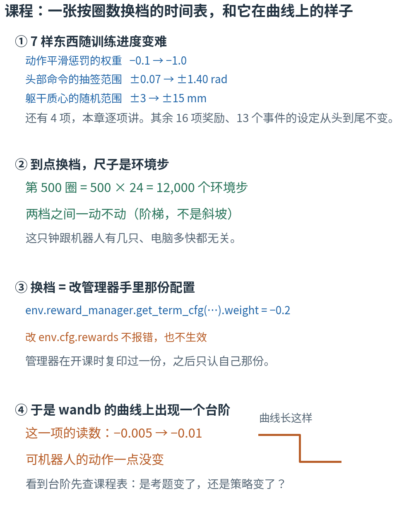
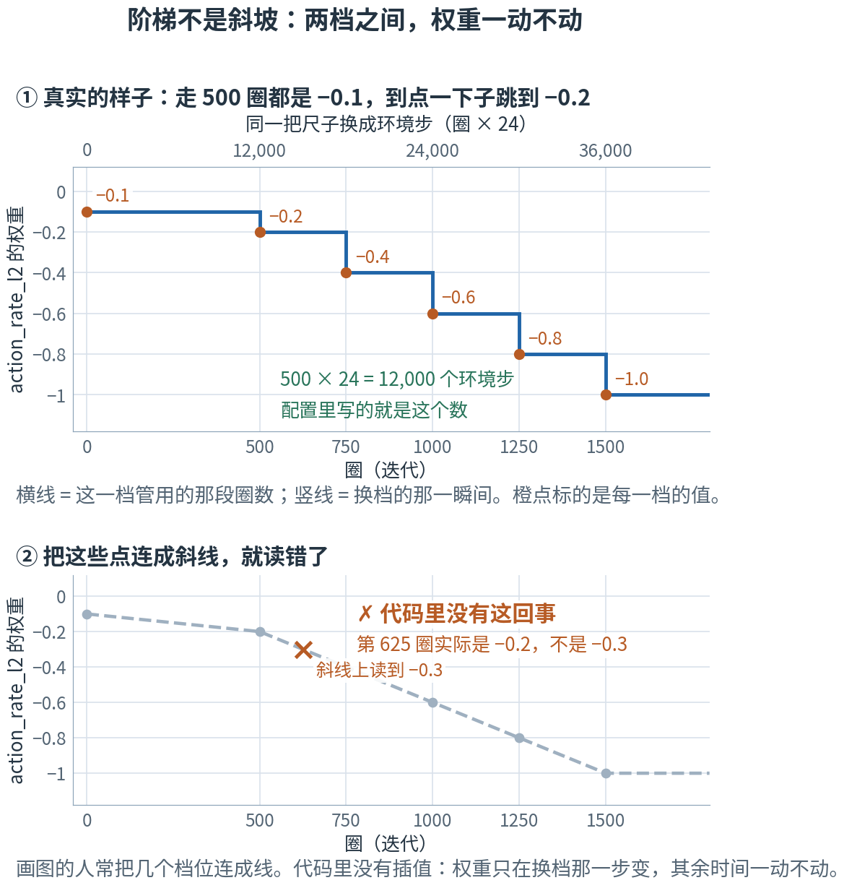
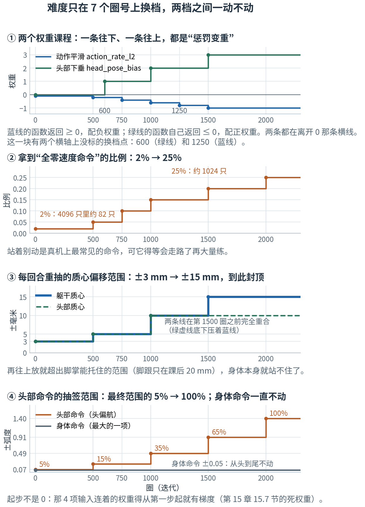
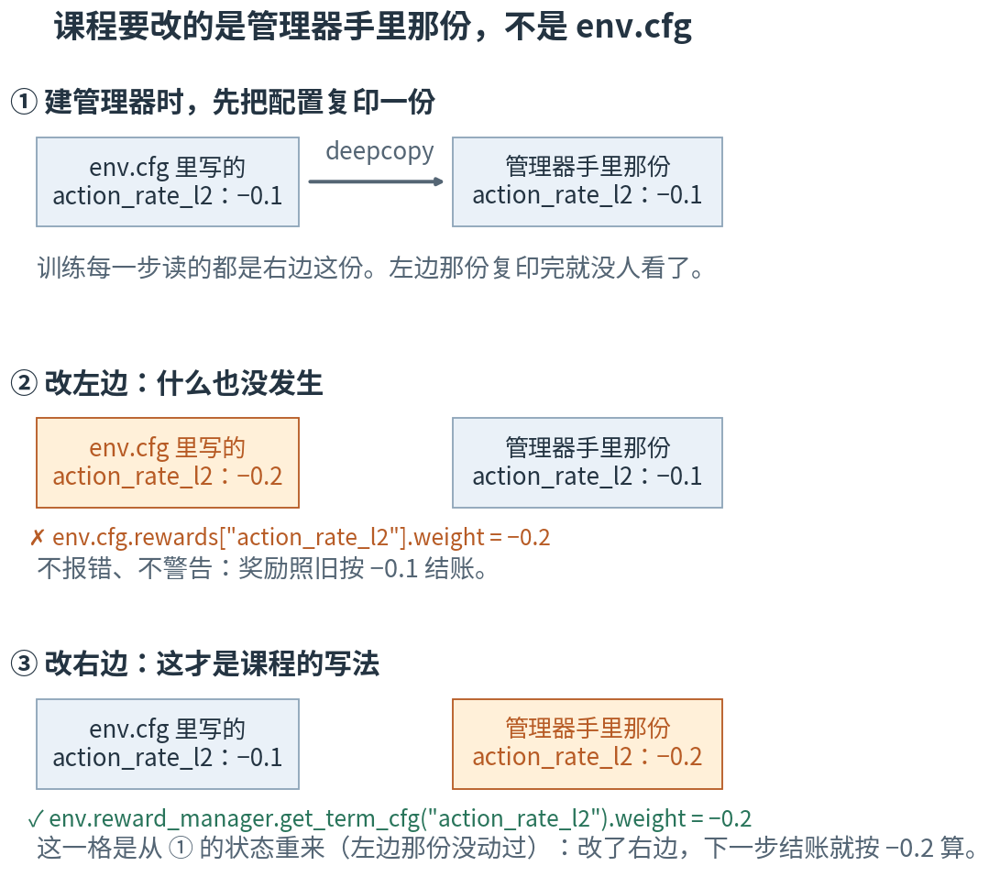
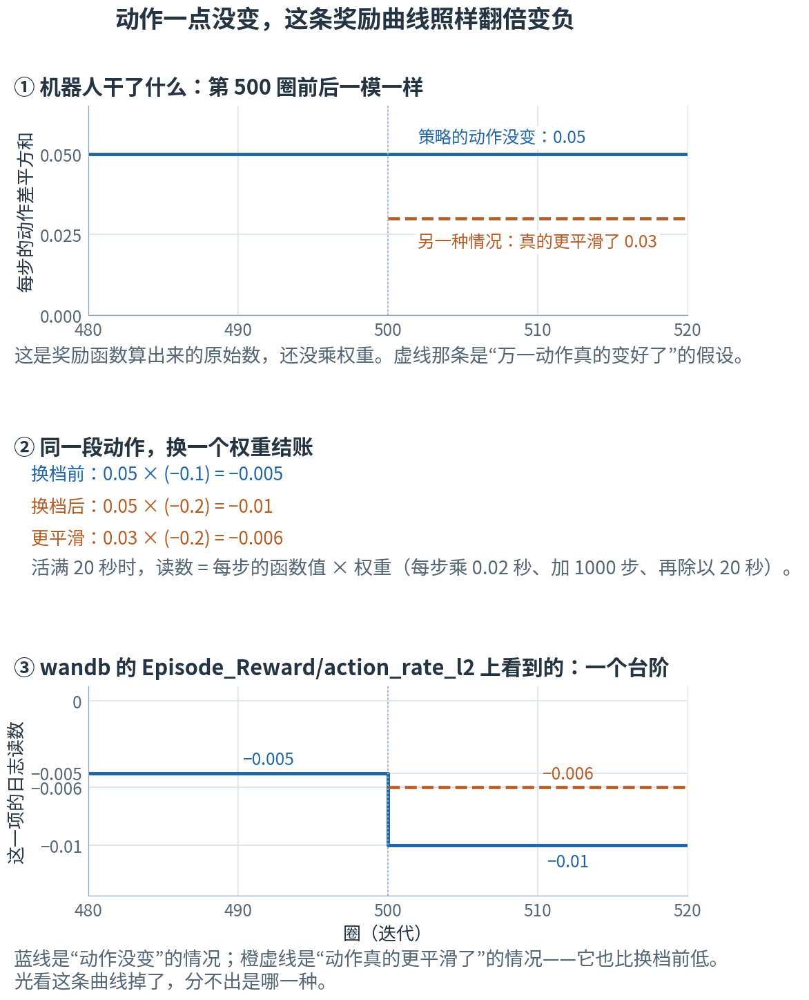

# 第 18 章 · 课程学习与读懂 wandb：先易后难的时间表，和它在曲线上留下的台阶

> **上一章我们有了什么**：一个数怎么变成一股力（BAM 舵机），以及 4096 只机器人各有一套自己的身体（域随机化）。
> 那一章的总表里有两行写着"±3 mm 起步，按课程放宽到 ±15 mm"——"课程"是什么，当时说先不背。
>
> **这一章要补什么**：走路任务里，有 7 样东西不是从头到尾一个样的，它们**随训练进度一档一档变难**：
> 两个奖励权重、一个"站着别动"的环境比例、两个质心随机范围、两个命令范围。这张时间表就是**课程**。
> 它同时是读训练曲线时最容易误判的地方：wandb（项目用来看训练曲线的那个网页工具，第 4 章 4.9 节提过一句，18.7 节细说）
> 上那条"为什么在第 500 圈突然掉下去"的曲线，十有八九是它干的。
>
> **本章新词**：课程学习、阶梯函数、逆向课程。
> **需要的前提**：第 14 章的四只钟（14.1 节）、一块日志怎么读（14.4 节）、`Episode_Reward` 的单位（14.5 节）、惩罚项的符号约定（14.6 节）、
> 课程那几行读数（14.7 节）、健康与生病的曲线（14.8 节）；第 15 章的命令块（15.5 节）和死权重（15.7 节）；第 17 章的域随机化（17.7 节）。
> **不要求**跑过训练，也**不要求**有 GPU：本章的实验只读配置文件，在你的笔记本上就能跑完。

---

## 18.0 先看地图：一张按圈数换档的时间表

**训练不是从头到尾一个难度。7 样东西写在一张时间表上，到了规定的圈数就换下一档，两档之间一动不动；
换档改的是管理器手里那份配置；于是 wandb 的曲线上会出现一级台阶——而台阶不一定意味着策略变差了。**

先想象一门游泳课。第一周只在浅水区，后面几周水越来越深（**范围**在变）；教练头几节课根本不管你姿势好不好看，
等你能游起来了，才开始抠动作，而且越抠越严（**扣分的轻重**在变）。课表是提前排好的，写着"第三周下深水"，
不看你今天游得怎么样——这正是本章这种课程的样子：**按进度换档，不按表现换档**。
还有一件事：课表复印了两份，一份贴在墙上，一份在教练手里。真正决定今天练什么的，是教练手里那份。



**读图顺序：** 从 ① 到 ④ 竖着读。① 是"有哪些东西在变"（18.1、18.3、18.4 节逐项讲）；② 是"什么时候变"（18.2、18.6 节）；
③ 是"怎么变的"（18.5 节）；④ 是"变完以后你在曲线上看到什么"（18.7、18.8 节）。图里的数字现在不用算，后面每一个都会手算一遍。

| 概念 | 它在回答什么问题 | 游泳课里对应什么 | 在哪一节 |
|---|---|---|---|
| 课程学习 | 为什么不一上来就按最终难度训练？ | 第一周不下深水 | 18.1 |
| 尺子：环境步 = 迭代 × 24 | 课表上的"第 500 圈"，代码里写成什么？ | 课表按第几周排 | 18.2 |
| 阶梯函数 | 两档之间，值是怎么变的？ | 这一周内，深度不变 | 18.2 |
| 权重课程（2 项） | 哪些惩罚是后来才加重的？ | 姿势扣分越来越严 | 18.3 |
| 范围课程（5 项） | 哪些"考题范围"是后来才放宽的？ | 水越来越深 | 18.4 |
| 活的管理器 | 课程改的到底是哪一份配置？ | 教练手里那份，不是墙上那份 | 18.5 |
| 换档时机 | 第 500 圈那一刻，到底换没换？ | 周一上午第一节课算不算第三周 | 18.6 |
| wandb 与 `Curriculum/*` | 训练跑起来以后，从哪儿看现在在第几档？ | 看课表进度 | 18.7 |
| 反事实账表 | 曲线掉了，是游得差了，还是评分变严了？ | 同一个动作，换个打分标准 | 18.8 |
| 逆向课程 | "容易"除了"范围小"，还能怎么造？ | 先从离岸边一米的地方游 | 18.9 |

表里的名字先不背，到了各节再给。本章最容易混的四处，先贴上标签：

- **四只钟**（第 14 章 14.1 节：环境步、迭代、仿真时间、墙上时间）。本章只用前两只，而且它们成固定比例：一圈 = 24 个环境步。
  课程表的横轴永远是**环境步**，它跟机器人有几只、你的电脑多快都无关。
- **三种"权重"**。第 2、6 章的权重是网络里的旋钮；第 16 章（奖励逐项拆解）的权重是奖励项前面的系数；
  本章的课程改的是**后者**——奖励项的系数，一个旋钮也没动。
- **阶梯不是斜坡**。图上把几个档位连成线，很容易读成"权重在慢慢变"。代码里没有插值：权重只在换档那一步跳一下（18.2 节）。
- **读数掉了 ≠ 行为变差**。课程一换档，同一个动作的计分口径就变了；曲线掉下去，可能什么都没发生（18.8 节）。

第一次读，按顺序看正文、图和手算。标着"进阶"的折叠块可以先跳过；代码是复核工具，不是阅读门槛。

## 18.1 为什么要先易后难：一上来全开，"什么都不做"就赢了

小孩先学站，再学走，最后才管姿势好不好看。训练也一样，而且理由更硬：**难度全开的时候，"什么都不做"常常是得分最高的选择。**

看一笔项目里真实量过的账。下面这两个数你没法自己算，也不用算：它们是 2026 年 8 月那次训练**实测**出来、记在配置文件注释里的
（本章实验的最后一节只核对那几行注释还在不在）。走路时机器人要抬脚，抬得好，`air_time` 这项奖励给到每步约 **1.01 分**（第 16 章逐项讲这些奖励）。
那次训练想顺手把头端正一点，就给头部姿态加了一条要求很严的惩罚。量出来：这条惩罚让一个正在走路的策略每步要交 **0.77 分**。

1.01 分的收益，对着 0.77 分的税。而且这笔税躲不掉——Microduck 的头有 280 g，占全身的 38%，只要迈步就一定会晃。
于是策略找到了那个"更划算"的选择：**不走了**。第 300 圈，`air_time` 从 1.01 掉到 0.02，抬脚高度从 15 mm 掉到 2 mm，站着不动。
（1.01 → 0.02、15 mm → 2 mm 这两组数也在同一段注释里。）

这就是第一个理由：**技能还没长出来的时候，任何"尝试税"都会让"不尝试"赢。**

第二个理由是反过来的：**目标太难，策略连"做对了一点点"的样本都拿不到。**
头部命令的最终范围是 ±1.40 rad（1 rad ≈ 57.3°，第 15 章 15.1 节），也就是 ±80°。
走都不会走，就要求头左右各转 80°——每一条经验都是"没做到"，分不出哪一次做得稍微好一点，也就没有可学的东西。
第 17 章 17.7 节那个质心的例子更极端：范围一路放宽到 ±30 mm，质心已经落到脚掌外面，那个身体本来就站不住。

对策：**从容易的设置开始，等策略学会了再逐步加难。** 这叫**课程学习**（curriculum learning）。
项目的做法是一张写死的时间表：在预定的训练进度上，把某个参数换成下一档。走路任务里一共 7 项——实验第 1 节从配置里原样读出来：

```
               课程项                       改什么            起步        最后一档  共几档  第一次换档（圈）
---------------------  ---------------------------  --------------  --------------  ------  ----------------
   action_rate_weight           动作平滑惩罚的权重            −0.1            −1.0       6               500
head_pose_bias_weight           头部下垂惩罚的权重             0.0             3.0       4               600
        standing_envs       拿到全零速度命令的比例            0.02            0.25       6               500
            com_range  躯干质心随机偏移的范围（m）           0.003           0.015       4               500
       head_com_range  头部质心随机偏移的范围（m）           0.003            0.01       3               500
      head_pose_range       4 个头部命令的抽签范围  最大 ±0.07 rad   最大 ±1.4 rad       5               500
      body_pose_range       6 个身体命令的抽签范围  最大 ±0.05 rad  最大 ±0.05 rad       1            不换档
```

这张表不用背，18.3 和 18.4 节会一项一项讲。现在只看三件事：

1. **两类**：前两行改的是**奖励的权重**（惩罚变重），后五行改的是**抽签的范围**（考题变难）。
2. **起步都更容易**，最后一档才是真正想要的难度。
3. **最后一行是个例外**：只有一档，永远不换——它就是第 15 章 15.7 节说的那个零填充的槽，占着位置，不参与考试。

走路任务里其余的设定都是固定的：16 项奖励的权重和参数、13 个事件的范围、3 组命令。比如速度命令的范围，从第一圈到最后一圈都是前后 ±0.4 m/s、左右 ±0.3 m/s、转 ±1.0 rad/s：
mjlab 模板自带的"速度范围逐渐放宽"那个课程被**删掉**了（配置注释说它"跑在机器人的能力前面"，第 1000 圈以后奖励和回合长度一起往下掉）。
能用课程解决的问题，并不是越多越好。

> **停一下，自测**：动作平滑惩罚的最终权重是 −1.0。既然最后要用 −1.0，为什么不一开始就设成 −1.0，省得换来换去？
> <details><summary>答案</summary>
>
> 因为这一项按"这一步的动作和上一步差多少"扣分：**想走路就一定会有动作变化**，不动才不扣。
> 步态还没出现的时候把它开到最大，等于对"尝试"课以重税，站着不动就成了最优解——正文开头那笔 0.77 对 1.01 的账，是同一件事的另一个例子。
>
> </details>

## 18.2 尺子和阶梯：迭代 × 24 = 环境步，两档之间一动不动

课表上写"第 500 圈起加难"，代码里得写成一个数。用哪只钟？

第 14 章 14.1 节那四只钟里，课程用的是**环境步**：每只机器人做了几次决定。理由是它最"干净"——
4096 只机器人是一起走的，所以这只钟不因为机器人多了就走得快；换台更快的电脑，它也不变。

环境步和圈数（迭代）是固定比例：**一圈 = 每只机器人走 24 个环境步**（配置里的 `NUM_STEPS_PER_ENV`）。所以：

$$\text{环境步} = \text{圈数} \times 24$$

手算几个，都是课表上真出现的数：

- 第 500 圈 = 500 × 24 = **12,000** 个环境步。
- 第 600 圈 = 600 × 24 = **14,400**。
- 第 2000 圈 = 2000 × 24 = **48,000**。

实验第 2 节把这张换算表打了出来，还从第 0 圈到第 2000 圈逐点查了一遍权重。

配置文件里写的就是 `500 * NUM_STEPS_PER_ENV` 这种样子，不是硬写 12000——这样万一哪天把一圈改成 48 步，整张课表会跟着挪。

两档之间发生什么？**什么也不发生。** 权重在第 500 圈变成 −0.2，然后一直是 −0.2，直到第 750 圈才变成 −0.4。
这种"到点跳一下、其余时间不动"的函数叫**阶梯函数**（step function）。查一档的写法就是一串 `if`（这正是源码的写法，章末 📍 里就是它的 Python 版）：

```js
let w = stages[0].weight;                       // 先取第 0 档
for (const s of stages) {
  if (step > s.step) w = s.weight;              // 凡是"已经过了"的档都覆盖一次
}                                               // 最后一个满足的档生效 → 所以档位必须按 step 从小到大写
```



**这样读图：** ① 先看横轴：下面一行是圈数，上面一行是同一把尺子换成环境步（乘 24），500 圈正对着 12,000 步。
再看蓝线：每一段**横线**是这一档管用的那段圈数，**竖线**是换档的一瞬间；橙点标着每一档的值。
② 是常见的读错法：把橙点连成斜线，就会以为权重在两档之间慢慢滑过去。代码里没有插值——第 625 圈查出来是 −0.2，不是斜线上的 −0.3。

> **停一下，自测**：第 1300 圈时，动作平滑惩罚的权重是多少？折成环境步是第几步？
> <details><summary>答案</summary>
>
> 第 1250 圈那一档已经生效、第 1500 圈那一档还没到，所以是 **−0.8**。环境步 = 1300 × 24 = **31,200**。
>
> </details>

## 18.3 两个权重课程：一个越来越负，一个越来越正

**第一个：`action_rate_l2`（动作平滑惩罚）。** 它按"这一步的动作和上一步差多少"扣分。
从很轻开始，等步态出现了再逐步加重——实验第 3 节从配置里读出的阶梯：

```
  action_rate_weight（改的是奖励项 action_rate_l2 的权重）
环境步  = 第几圈  权重
------  --------  ----
     0         0  −0.1
 12000       500  −0.2
 18000       750  −0.4
 24000      1000  −0.6
 30000      1250  −0.8
 36000      1500  −1.0
```

六档，越来越负，第 1500 圈到顶。为什么这样排，18.1 节已经说过了：早期的平滑惩罚是"尝试税"。

**第二个：`head_pose_bias`（头部下垂惩罚）。** 它算的是头的角度误差在 1 秒里的平均值——只罚"一直偏着"，不罚"走起来晃"。
它的课程更极端：**前 600 圈权重就是 0，等于这一项根本不存在。**

```
  head_pose_bias_weight（改的是奖励项 head_pose_bias 的权重）
环境步  = 第几圈  权重
------  --------  ----
     0         0   0.0
 14400       600   1.0
 24000      1000   2.0
 36000      1500   3.0
```

配置里的注释写得很直白：*"a posture-precision term is a distraction before a gait exists."*——步态出现之前，姿态精度是干扰。

到了权重 3.0 那一档，这一项有多重？算一笔就知道。假设头部那 4 个关节都一直偏着 15°（配置注释记的实测值就是这个量级）：

- 换成弧度：15 ÷ 57.3 = **0.2618** rad（第 15 章 15.1 节：1 rad ≈ 57.3°）。
- 乘权重：0.2618 × 3 = **0.79** 分／步。

对照 18.1 节那个 1.01 分／步的抬脚奖励，这已经是很重的一笔。再算一个偏得少的：2° = 0.0349 rad，0.0349 × 3 = **0.10** 分／步——
轻得多。**同一条惩罚，偏 15° 要交的分是偏 2° 的 7.5 倍**（15 ÷ 2；印出来的 0.79 对 0.10 也对得上），所以它逼的是"把头端正"，不是"别动头"。

> ⚠️ **两个权重课程，一个往负走，一个往正走，却都是"惩罚变重"。**
> 第 14 章 14.6 节的符号约定：mjlab 自带的代价函数返回 ≥ 0 的数，必须配**负**权重（`action_rate_l2`：−0.1 → −1.0）；
> 而 microduck 自己写的那一批 `*_penalty` 函数**自己就返回 ≤ 0**，必须配**正**权重（`head_pose_bias`：0 → 3.0）。
> 两种写法乘出来都是 ≤ 0 的扣分。看课程表时不要只看"权重变大还是变小"，要看**它离 0 越来越远**。

> **停一下，自测**：某次训练跑到第 400 圈，`Episode_Reward/head_pose_bias` 从头到尾读 0。能不能断定"机器人的头一点没下垂"？
> <details><summary>答案</summary>
>
> 不能。第 600 圈之前这一项的权重是 0，而日志记的是**加权**以后的值（第 14 章 14.5 节）：乘 0 以后，不管头垂了多少都读 0。
> 这个读数在告诉你"这一项现在不参与打分"，没有告诉你头的任何事。想知道头垂没垂，得看 `head_pose_tracking` 那一项，或者直接看视频。
>
> </details>

## 18.4 五个范围课程：考题范围从多小放宽到多大

剩下五项改的不是打分，是**出题**：每次抽签的范围。

**站着别动的比例。** 速度命令是每隔一段时间重抽一次的（第 15 章 15.5 节）。抽签时有一定比例的机器人拿到的是**全零命令**：不许走，站着别动。
第 4 章 4.2 节说过，均匀地抽几乎永远抽不到恰好全零，所以这个情况必须单独安排——而它恰恰是真机上最常见的一条命令。

```
  standing_envs（拿到“全零速度命令”的比例；4096 只机器人里平均有几只）
环境步  = 第几圈  比例  4096 只里约几只
------  --------  ----  ---------------
     0         0  0.02               82
 12000       500  0.05              205
 18000       750   0.1              410
 24000      1000  0.15              614
 36000      1500   0.2              819
 48000      2000  0.25             1024
```

右边那一列是期望（第 4 章 4.3 节）：0.02 × 4096 ≈ 82 只，0.25 × 4096 = 1024 只。
起步只有 2%，是因为"站着别动"和"按命令走"是两件不同的本事，一开始把四分之一的经验花在站着上，走路就学得慢；
但也不能是 0——那样"站住"这件事永远没练过，而它是部署时最常按到的那个按钮。

**两个质心范围。** 第 17 章 17.7 节那张域随机化总表里，有两行写着"按课程放宽"，就是这两项。
躯干质心四档，分别从第 0、500、1000、1500 圈起：**±3 → ±5 → ±10 → ±15 mm**（配置里按米写：0.003、0.005、0.01、0.015）。
头部质心少一档：前三档一样，到 ±10 mm（第 1000 圈起）就封顶。
注意课程改的是**抽签的范围**，不是这一回合抽到的那个值：每回合照样重抽一次，只是签筒变大了。

±15 mm 这个上限是踩出来的：之前一路放宽到 ±30 mm，可脚跟只在踝关节后面 20 mm，质心往后挪 30 mm 已经落在脚掌托不住的地方了
（17.7 节讲过这段）。配置注释里还记着一句：策略变差的时间点，和 0.015 → 0.02 → 0.03 这三次放宽一一对上。
**课程放得太宽，和放得太快，是两种不同的错。**

**头部命令范围。** 4 个头部关节，每个关节自己一条范围，一共五档：

```
  head_pose_range（4 个头部命令的抽签范围，弧度；颈俯仰和头俯仰每一档都相同）
  圈  颈俯仰 = 头俯仰  头偏航  头横滚  头偏航占最终的
----  ---------------  ------  ------  --------------
   0            ±0.05   ±0.07  ±0.015              5%
 500            ±0.17   ±0.21  ±0.047             15%
1000            ±0.39   ±0.49   ±0.11             35%
1500            ±0.72   ±0.91    ±0.2             65%
2000             ±1.1    ±1.4   ±0.31            100%
```

最后一列是自己算的：每一档大致是最终范围的 5%、15%、35%、65%、100%。头偏航那一列正好整齐——1.40 × 0.05 = **0.07**，
1.40 × 0.35 = **0.49**，最后一档 ±1.40 rad 就是第 8 章 8.2 节列过的那个上限。

起步的 5% 有多小？±0.07 rad ≈ ±4°，几乎就是"头别乱动"。**为什么不干脆填 0？** 第 15 章 15.7 节的死权重：
那 4 项观测要是从第一步起就恒等于 0，它们连着的权重拿不到梯度，会一直停在初值；等第 2000 圈把范围放开，网络对这 4 个输入的反应是随机的。
给一点非零的小范围，两头都顾到了：足够容易，又让这些权重从一开始就在学。

**身体命令范围**只有一档：±0.005 m（前后、左右、上下）和 ±0.05 rad（三个转角），从第一圈到最后一圈不变。
走路任务用不上它，但位置得占着，而且不能真填零——还是同一条死权重的规矩。
（上面这两张表和刚才那几组毫米数，都是实验第 4 节从配置里读出来打印的。）



**这样读图：** 四块面板共用一条横轴（圈数）。每块里的竖虚线是**这一项自己的换档点**；
七项合起来一共只有 7 个圈号：500、600、750、1000、1250、1500、2000
（其中 600 和 1250 只有 ① 里用到，横轴上没标刻度，图里单独写了出来）。**整个训练里，难度就只在这 7 个时刻动过。**
① 两条权重一条往下、一条往上，都是在离开 0 那条横线（18.3 节的 ⚠️）。
② 的两个数就是上面表里的 82 只和 1024 只。③ 里两条线**在第 1500 圈之前完全重合**（都是 ±3 → ±5 → ±10 mm，所以绿虚线底下还压着一条蓝线），到第 1500 圈只有躯干那条再涨一级。
④ 画的是头偏航那一列，橙字标着它占最终范围的百分之几；底下那条灰线是身体命令，从头到尾不动。
每块面板里都是横线加竖线，没有一根斜线——18.2 节那件事，在每一项上都成立。

> **停一下，自测**：训练跑到第 1200 圈。头偏航的命令范围是多少？躯干质心的随机范围是多少？
> <details><summary>答案</summary>
>
> 头偏航：第 1000 圈那一档生效、第 1500 圈还没到，所以是 **±0.49 rad**（约 ±28°）。
> 躯干质心：同样是第 1000 圈那一档，**±10 mm**。两项都还差一级才到顶。
>
> </details>

## 18.5 课程是怎么"生效"的：改管理器手里那份

课程函数每次被调用，就干一件事：把某个参数改成当前这一档的值。听起来简单，但这里有一个能让整门课程**悄悄失效**的坑。

回到游泳课那个比喻：课表复印了两份，一份贴在墙上，一份在教练手里。你在墙上那份改了"今天下深水"，教练不会知道——他只看自己手里那份。

mjlab 里的情形一模一样。你写的那份配置叫 `env.cfg`。建环境时，奖励管理器和事件管理器（还有终止、观测那几个）各自**深拷贝**了一份
（`deepcopy`，连里面的对象也复印一遍），之后训练每一步读的都是管理器自己那份。所以：

```js
const wall = { weight: -0.1 };
const manager = structuredClone(wall);   // 开课时复印一份：两份内容一样，但从此各过各的
wall.weight = -0.2;                      // 改墙上那张
manager.weight;                          // 还是 -0.1 —— 改了副本，没改引用
```

写成 Python，就是下面这两行的区别（上面那行你在别处也可能见到，它不会报错，但什么也不做）：

```python
env.cfg.rewards["action_rate_l2"].weight = -0.2                       # ✗ 改了墙上那份，训练照旧按 −0.1 结账
env.reward_manager.get_term_cfg("action_rate_l2").weight = -0.2       # ✓ 改到管理器手里那份，下一步就生效
```



**这样读图：** ① 两个方框：左边是你写的 `env.cfg`，右边是管理器开课时复印的那份，箭头上写着复印的方法。
② 改左边：左框变橙（改成了 −0.2），右框纹丝不动，而训练读的是右框——**什么也没发生**。
③ 改右边：右框变橙，下一步结账就按 −0.2 算。三张图里的数字和实验第 5 节打印的完全一致。

实验第 5 节用十几行纯 Python 把这件事演了一遍：复印、改左边、再改右边，每一步都核对两份的值。

**命令管理器是唯一的例外**：它没有复印（源码里就是 `self.cfg = cfg`），`env.cfg.commands[...]` 和它手里那份是同一个对象，改了照样生效。
可"哪个管理器复印过"不值得记——四个课程函数一律走管理器，就不会错。

> ⚠️ **写 `env.cfg.rewards` / `env.cfg.events` 是一次静默的无操作**：不报错、不警告，程序照常跑，只是什么也没改。
> 这条规矩咬过的不只是课程：评估脚本里"强制给机器人设一个初始状态"，改的是 `env.cfg.events[...]`，结果每次跑出来的还是原来的随机初始状态。
> 凡是训练中途要改配置的地方，都要通过管理器：`env.reward_manager.get_term_cfg(名字)`、`env.event_manager.get_term_cfg(名字)`、
> `env.command_manager.get_term(名字).cfg`。源码里为此留了一行注释：*"EventManager.__init__ does deepcopy(cfg), so mutating env.cfg.events is a no-op."*

## 18.6 换档的那一瞬间：一圈 24 步，门槛卡在第一步之前

"第 500 圈起加难"听着精确，但一圈有 24 步，到底是这一圈的第一步换，还是最后一步换？

先把圈和步对齐。环境步从 1 开始数：第 0 圈走的是第 1–24 步，第 1 圈是第 25–48 步……第 500 圈是第 **12,001–12,024** 步。
而门槛写的是 500 × 24 = 12,000。源码里的判断是 `common_step_counter > stage["step"]`——**大于**，不是大于等于。
于是 12,000 那一步还不算，12,001 才算，而 12,001 正是第 500 圈的第一步。**"第 500 圈起"名副其实。**

走路这 7 项课程由 4 个课程函数驱动，其中改命令范围的那个用的是 `>=`。实验第 6 节把换档前后这三圈逐步查了一遍：

```
 圈  这一圈的环境步  权重（首步）  权重（末步）  头部范围（首步）  头部范围（末步）
---  --------------  ------------  ------------  ----------------  ----------------
499     11977–12000          −0.1          −0.1              0.07              0.21
500     12001–12024          −0.2          −0.2              0.21              0.21
501     12025–12048          −0.2          −0.2              0.21              0.21
```

表上有两处零头，都只差 1 步。其一：`>=` 早一步，所以第 499 圈的最后一步（第 12,000 步）上，头部范围**已经**放宽到 ±0.21 rad，
而权重**还是** −0.1。其二：课程是在一步的**末尾**才算的（一步之内的次序：先加计数器、再按当前的权重结账、最后才轮到课程），
所以换档那一步的奖励仍按旧权重结账。一圈 24 步，这 1 步对训练没有任何影响，只在你盯着某一圈的读数较真时才看得出来。

还有两件更值得记住的事。

**第一，课程只在"有机器人重置"的时候才重算一次。** mjlab 把这行调用放在重置流程里（`_reset_idx`），
不是每步都算。4096 只机器人各有各的回合，几乎每一步都有几只摔倒或超时，所以实际上每步都会算到——
但**环境少的时候不一定**。另外，课程函数虽然收到"这次重置的是哪几只"，却根本不看：它改的是全局那一份配置，一改就是所有机器人一起换。

**第二，接着练不会把课程打回第 0 档。** 第 14 章 14.9 节说过，检查点里存了环境步那只钟（`common_step_counter`）；
`--agent.resume` 会把它读回来，所以从第 3000 圈接着练，课程照样停在最后一档。

> ⚠️ **但 `uv run play` 会。** 回放策略时环境是新建的，这只钟从 0 开始，课程于是把所有范围改回第 0 档：
> 头部命令范围变成 ±0.07 rad（±4°），"站着别动"的比例回到 2%。
> 你看到机器人的头几乎不动，那不是策略退化了，是**考题回到了第一周**。项目里几个起身任务专门加了环境变量来绕过这件事。

> **停一下，自测**：有人把一圈的步数从 24 改成 48，而课程表里写的仍然是 `500 * NUM_STEPS_PER_ENV`。
> 第一次换档落在第几圈？这一圈里每只机器人的经验是多了还是少了？
> <details><summary>答案</summary>
>
> 门槛跟着一起变：500 × 48 = 24,000 步，而第 500 圈走完正好是 500 × 48 = 24,000 步——还是**第 500 圈**换档。
> 每圈每只机器人走 48 步，经验是原来的两倍。配置里坚持写 `500 * NUM_STEPS_PER_ENV` 而不是写死 12000，为的就是这个：
> 课表跟着步数一起挪。写死会怎样，本章实验的"改一改"第 1 条让你自己试。
>
> </details>

## 18.7 wandb：把课程表和曲线对着看

训练跑几千圈，终端里滚过去几千块日志，没法用眼睛比。wandb（Weights & Biases 的缩写）就是第 4 章 4.9 节和第 14 章 14.4 节提过的那个网页工具：
训练时每圈把日志里的数发上去，在网页上画成曲线，还能把几次训练叠在一张图里比。
项目的 project 名是 `mjlab_microduck`，`uv run train` 默认就往那儿发。
第 14 章那次冒烟训练加了 `--agent.logger tensorboard`，数写进本地的事件文件，不用登录——两条路记的是同一组数，只是存放的地方不同。

课程在 wandb 上有自己的七条曲线，叫 `Curriculum/<课程项的名字>`（第 14 章 14.7 节见过它们）。
它们的值不是别的，正是**课程函数每次返回的那个数**：改权重的返回当前权重，改范围的返回当前范围里最大的那个上限。
实验第 7 节把七条曲线的头尾都算了出来：

```
                  wandb 上的曲线  第 0 圈的读数  第 2000 圈以后的读数
--------------------------------  -------------  --------------------
   Curriculum/action_rate_weight           −0.1                    −1
Curriculum/head_pose_bias_weight              0                     3
        Curriculum/standing_envs           0.02                  0.25
            Curriculum/com_range          0.003                 0.015
       Curriculum/head_com_range          0.003                  0.01
      Curriculum/head_pose_range           0.07                   1.4
      Curriculum/body_pose_range           0.05                  0.05
```

左边那一列和第 14 章 14.7 节存档里的读数一模一样——那次冒烟训练只跑了 5 圈，一档都没来得及换。
`Curriculum/head_pose_range` 读 0.07，是因为它报的是 4 个关节里最大的那个上限（头偏航的 ±0.07）；
`Curriculum/body_pose_range` 从头到尾 0.05，那一项本来就只有一档。

**看曲线的顺序**（第 14 章 14.8 节那张表的课程版）：

1. 先看 `Curriculum/*`：现在在第几档，上一次换档是哪一圈。
2. 再看 `Train/mean_reward` 和 `Train/mean_episode_length` 在**这一档之内**的趋势——跨着换档点比较，比的是两套不同的考题。
3. 最后看主任务项（`Episode_Reward/track_linear_velocity` 之类）是不是真的在涨。

对着课程表，很多"怪事"就有解释了：

| 现象 | 通常的原因 |
|---|---|
| `Episode_Reward/head_pose_bias` 前 600 圈一直是 0 | 权重是 0，读数是加权值（第 14 章 14.5 节） |
| `Episode_Reward/action_rate_l2` 在 500、750、1000… 处一级级变负 | 权重换档，不是动作变差（18.8 节） |
| `Train/mean_reward` 在某个换档点掉一下、之后慢慢回来 | 难度加了一档。小掉正常 |
| 掉下去**不回来** | 这一档太难或者来得太早：把它往后挪 |
| 掉的同时回合长度也掉 | 新档位让它摔了——质心那次就是这样 |
| 命令范围涨了，跟踪误差却没涨 | 好事：学会了 |

<details>
<summary>进阶：换档那一圈的读数可能落在两档之间（现在可跳过）</summary>

`Curriculum/*` 这些数是每次重置时记一笔、一圈之内取平均之后再发给 wandb 的。
换档正好发生在某一圈的中间时（比如命令范围那两项用 `>=`，会在上一圈的最后一步换），这一圈的平均值就会落在两档之间——
曲线上看到一个不上不下的点。它不是插值，只是"这一圈里前后记的不是同一个数"。下一圈就干净了。

</details>

## 18.8 曲线突然掉了：先做一张反事实账表

这是本章最该记住的一件事。

第 500 圈，`Episode_Reward/action_rate_l2` 从 −0.005 掉到 −0.01，扣的分正好翻倍。策略退化了吗？

先算清楚这个读数是怎么来的。第 14 章 14.5 节的算法：**每步的函数值 × 权重 × 0.02 秒，整回合加起来，再除以 20 秒**。
机器人活满 20 秒（1000 步）时，这一长串刚好约掉，读数 = 每步的函数值 × 权重。

现在做一张**反事实账表**："假如动作一点没变，光换权重，读数会变成多少？"假设这一项的函数值每步都是 0.05
（这个 0.05 是"动作差平方和"，和 18.4 节那个 ±0.05 rad 的命令范围没有任何关系）：

```
                  情况  每步的动作差平方和  权重  每步记的一笔  日志读数
----------------------  ------------------  ----  ------------  --------
   换档前（第 499 圈）                0.05  −0.1       −0.0001    −0.005
  换档后，动作一模一样                0.05  −0.2       −0.0002     −0.01
换档后，动作其实更平滑                0.03  −0.2      −0.00012    −0.006
```

这张表是实验第 8 节打印的。一行一行手算：

- 第一行：0.05 × (−0.1) × 0.02 = −0.0001（每步记的一笔）；−0.0001 × 1000 步 = −0.1；−0.1 ÷ 20 秒 = **−0.005**。
- 第二行：**动作一个字都没改**，只是权重从 −0.1 变成 −0.2，读数就成了 0.05 × (−0.2) = **−0.01**。扣的分翻倍，曲线掉下去一级，可机器人什么都没做错。
- 第三行更扎心：动作真的变平滑了（0.05 → 0.03，降了四成），读数是 0.03 × (−0.2) = **−0.006**——**还是比换档前的 −0.005 低**。

要让这条曲线在换档后原地不动，动作差平方和得从 0.05 降到 0.025，正好减半（权重翻倍了）。达不到这个幅度，曲线就一定往下走。



**这样读图：** ① 是机器人真正干的事（奖励函数算出来的原始数，还没乘权重）：第 500 圈前后完全一样，一条平线。
② 是三笔账，数字和上面那张表同源。③ 是你在 wandb 上看到的那条曲线：第 500 圈一级台阶。
把 ① 和 ③ 对着看——**①没变，③却掉了**。橙色虚线是"动作真的更平滑了"的情况，它在 ③ 里也在换档前的下面。光看 ③ 这一条曲线，分不出是哪一种。

> ⚠️ **加权读数掉下去，不等于行为变差。** 每次看到某个 `Episode_Reward/*` 出现台阶，第一件事是查课程表：
> 这一圈是不是正好换档？是的话，先按上面的办法把读数**除以权重**还原成原始值再比较。
> 同理，读数变好也可能只是权重变轻了——虽然这张课程表里没有变轻的项。

要区分的情况有三种，越往下证据越硬：

1. **原始行为没变，只是计分口径变了**：把读数除以当前权重还原一下就看出来。
2. **考题变难了**：命令范围或质心范围刚放宽一档，误差自然变大，但回合长度没掉、完成度还行。
3. **真的退化了**：在**同一组固定的评估条件**下跑，也更容易摔。

第 3 条需要一把不随课程变的尺子：留一组固定的命令和固定的初始状态，每隔几百圈拿检查点跑一遍。
道理和第 5 章 5.6 节的验证集一样——那份数据不参与拧旋钮，只用来横向比较。固定评估**不能替代**训练分布，它只是让前后两个检查点有一把共同的尺。
项目里没有现成的脚本干这件事，得自己写一个（`uv run play` 不算：它每次新建环境，课程总把考题调回第 0 档——18.6 节那条 ⚠️ 说的就是这个。
永远最容易的一档，代表不了最终难度）。

最后一条规矩，来自项目的 `AGENTS.md`：

> 当一个指标**恰好在课程阶段边界处**下跌，说明节奏错了——拉长这一阶段，或者把它往后挪，**永远不要提前**。

配上第 14 章 14.8 节那句"先量，再下结论"：训练"失败"了，先拿检查点在仿真里跑一遍、看视频、分情况统计，再去动奖励。

> **停一下，自测**：换档前 `Episode_Reward/action_rate_l2` 读 −0.005（权重 −0.1），换档后读 −0.0075（权重 −0.2）。
> 假设机器人两次都活满了 20 秒，动作到底是更平滑了还是更糙了？
> <details><summary>答案</summary>
>
> 把读数除以权重还原：换档前 −0.005 ÷ (−0.1) = 0.05；换档后 −0.0075 ÷ (−0.2) = **0.0375**。
> 原始的动作差平方和从 0.05 降到 0.0375，**更平滑了**——尽管这条曲线看上去又往下掉了一截（扣的分多了一半）。
>
> </details>

## 18.9 自己设一门课程："容易"指什么，什么时候算练完

**"容易"不等于"把奖励都设成 0"。** 那样采到的经验没有方向，策略无从知道该往哪边改。
项目里的"容易"是这三种，每一种在前面都见过了：

- **更窄的抽签范围**，但非零：头部命令 ±0.07 rad 起步（18.4 节）。
- **更轻的惩罚**：动作平滑 −0.1 起步，姿态精度干脆先关掉（18.3 节）。
- **更集中的起点**：初始姿态的扰动更小。

**"加难"也不总是放宽范围。** 有时候要改的是"某种情况占多大比例"。
原地转身就是个例子：速度命令三个分量独立均匀地抽，"几乎不平移、但转得快"这种组合出现的概率很低，
于是这件本事永远练不到。项目的做法是开一个**显式的桶**：固定 15% 的机器人专门拿到原地转的命令。
注意它不是课程——这 15% 从第一圈到最后一圈都不变，只是把采样的概率改了。

**还有一种加难是从终点往回退。** 起身任务（教机器人从地上爬起来）里有一项课程，改的不是难度参数，而是**回合从什么状态开始**：

```
  圈  已经站着  坐着  趴着  仰面躺着
----  --------  ----  ----  --------
   0       0.4   0.4   0.2         0
 600      0.25   0.3  0.35       0.1
1500       0.2  0.25   0.3      0.25
2500      0.15   0.2   0.3      0.35
```

一开始 80% 的回合从"已经站着"或"坐着"开始——离终点只差最后一小段，策略很容易碰到"再撑一下就成功了"的经验；
最难的"仰面躺着"一开始一个都没有，到最后才涨到 35%。这种"先练最后一段，再逐步把起点往前挪"的安排叫**逆向课程**（reverse curriculum）。
它治的是一种很典型的病：**开头学会了，最后一米永远学不会**——因为策略几乎走不到那里，那一段就拿不到经验。
（起身任务一共有 14 项课程，走路只有 7 项——那是另一个任务，这里只借它举个例子。这张表和 14 这个数都是实验第 9 节从它的配置里读出来的。）

**什么时候算练完？** 先说一个不能用的判据：损失不再下降。第 5 章 5.3 节那种训练里，损失一路降到平就差不多算学完了；
PPO 不是这样——数据每一圈都换，损失的目标跟着策略动，它本来就不会一路往下走。

能用的有这么几条，按顺序看：

1. **课程跑完了没有。** 最后一档在第 2000 圈 = 48,000 个环境步 = 每只机器人 960 秒 ≈ 16 分钟的仿真时间。
   **课程跑完只意味着"考题到齐了"**，策略还得在最终难度上再练很久：一次步态训练的常见预算是 4000–6000 圈，
   也就是说课程只占前三分之一到一半。
2. **曲线健康**（第 14 章 14.8 节）：平均奖励还在涨、回合长度接近 1000 步、主任务项真的在涨、每个惩罚项 ≤ 0、动作标准差在慢慢降而不是塌到 0。
3. **固定评估**：同一组命令下，新检查点比旧的强。
4. **看视频，最后看真机。** 仿真里的数字全绿，视频里照样可能在同手同脚地抖。

说"它能走了"之前，先说清楚看到的是什么：走十次摔几次、往哪个方向容易摔、哪些命令跟不上。

## 📍 映射到项目

> 只需看一眼。语法看不懂没关系。

**这段配置做什么**：定义两个权重课程里的一个。每一项课程都是一个 `CurriculumTermCfg`：`func` 指定用哪个课程函数，
`params` 里装着这一项的阶梯。它在 `src/mjlab_microduck/tasks/microduck_velocity_env_cfg.py` 的 `make_microduck_velocity_env_cfg()` 里：

```python
cfg.curriculum["action_rate_weight"] = CurriculumTermCfg(      # 7 项课程之一（18.1 节那张表的第一行）
    func=microduck_mdp.reward_weight,                          # 用哪个课程函数：改奖励权重的那个
    params={
        "reward_name": "action_rate_l2",                       # 改哪一项奖励的权重（18.3 节）
        "weight_stages": [                                     # 阶梯：按环境步从小到大写，顺序不能乱
            {"step": 0, "weight": -0.1},                       # 第 0 圈起：−0.1
            {"step": 500 * NUM_STEPS_PER_ENV, "weight": -0.2}, # 500 × 24 = 12,000 步起：−0.2（18.2 节的尺子）
            ...                                                # （中间省略 750、1000、1250 三档）
            {"step": 1500 * NUM_STEPS_PER_ENV, "weight": -1.0},# 第 1500 圈起：−1.0，到顶
        ],
    },
)
del cfg.curriculum["command_vel"]                              # 删掉模板自带的速度命令课程（18.1 节）
```

**这段代码做什么**：查出当前该用哪一档，改到管理器手里那份配置上，再把这一档的值报给日志。
它在 `src/mjlab_microduck/tasks/mdp.py` 的 `reward_weight()` 里，正是 18.2 节那段 JS 的 Python 版：

```python
term_cfg = env.reward_manager.get_term_cfg(reward_name)   # 18.5 节：管理器手里那份，不是 env.cfg
for stage in weight_stages:                               # 从第 0 档开始，逐档检查
    if env.common_step_counter > stage["step"]:           # 环境步超过这一档的起点（18.6 节：> 不是 >=）
        term_cfg.weight = stage["weight"]                 # 覆盖一次；最后一个满足的档生效
return torch.tensor([term_cfg.weight])                    # 这个返回值就是 wandb 上的 Curriculum/action_rate_weight（18.7 节）
```

另外三个课程函数是同一个模子：`com_range_curriculum` 改事件管理器里的质心范围，
`pose_command_range_curriculum` 改命令管理器里的范围（它用的是 `>=`），`standing_envs_curriculum` 改速度命令的全零比例。
正文还用到这些文件里的事实（实验第 10 节逐行核对）：`mjlab/managers/event_manager.py` 和 `reward_manager.py`（初始化时 `deepcopy(cfg)`）、
`command_manager.py`（没有 `deepcopy`，就是 18.5 节那个例外）；
`mjlab/managers/curriculum_manager.py`（调用课程函数、把返回值记成 `Curriculum/<名字>`）；
`mjlab/envs/manager_based_rl_env.py`（环境步计数器每步加 1；重置流程里调用课程）；
`mjlab/rl/runner.py`（存检查点时保存这个计数器，接着练时恢复）。

## 🧪 动手实验

```bash
uv run python docs/learn-zh/labs/ch18_curriculum_timeline.py
```

只构造配置对象，不建仿真、不训练，纯 CPU（头一次 import 要十几秒）。

1. 走路任务的 7 项课程：每项的起步、最后一档、第一次换档在第几圈；核对速度命令范围是固定的、模板自带的两个课程被删掉了。
2. 尺子与阶梯函数：迭代 × 24 的换算表，第 0 到 2000 圈逐点查权重；画 `ch18_step_not_ramp.png`（阶梯与"斜坡"的对比）。
3. 两个权重课程的阶梯表，以及权重 3.0 下偏 15° / 2° 每步各扣多少分。
4. 五个范围课程的阶梯表：站立比例（含 4096 只里的只数）、两个质心范围、头部命令的四列与百分比、身体命令的唯一一档；画 `ch18_curriculum_timeline.png`。
5. 改哪一份配置：用十几行纯 Python 演一遍 `deepcopy` 之后"改左边没用、改右边才行"；画 `ch18_live_cfg.png`。
6. 换档到底在哪一步：第 499、500、501 圈的环境步区间，以及 `>` 和 `>=` 差的那一步。
7. wandb 上 `Curriculum/*` 七条曲线的头尾读数，和第 14 章 14.7 节的存档对照。
8. 反事实账表：三种情况的每步一笔与日志读数，以及"读数不变需要动作平滑多少"；画 `ch18_weight_step_drop.png` 和 18.0 节的总览图 `ch18_overview.png`。
9. 课程跑完占训练预算的多少；起身任务那张逆向课程的表。
10. 映射到项目：核对 📍 里引用的配置、课程函数和 mjlab 的那几行还在不在。

**改一改**（每条都先写下你的预测，再运行。要改的三行在脚本里标着 `# TWEAK-1` / `TWEAK-2` / `TWEAK-3`。
改动之后，锁正文数字的检查会从 ✓ 变成 ✗，脚本照常跑完，最后提示"N 项没对上"——这是预期的，它们锁的是正文里的数；有 ✗ 时新画的图不会覆盖教材里的图。
试完记得改回去再跑一遍）：

- 第 2 节的 `STEPS_PER_ITER` 从 24 改成 48（假装有人把一圈的步数翻了一倍）。先预测：课程表上的数一个没改，第一次换档会落在第几圈？第 3、4 节那几张表里的"第几圈"会怎么变？
- 第 8 节的 `RAW_SMOOTHER` 从 0.03 改成 0.02（假设换档后动作平滑了六成）。先预测：这一行的日志读数会比换档前的 −0.005 高还是低？曲线是掉下去还是涨上来？
- 第 6 节的 `QUERY_ITER` 从 500 改成 501。先预测：表里三行的环境步区间各是多少？"这一圈的第一步就换档"这句话还成立吗？

本章的 500 × 24 = 12,000 这个手算，也可用 `python3 docs/learn-zh/labs/worked_examples.py` 独立复核。

## 本章小结

- **课程学习** = 先易后难的时间表。两个理由：技能还没长出来时，任何"尝试税"都会让"不尝试"赢（0.77 分的姿态税压垮了 1.01 分的抬脚奖励）；
  目标太难则连"做对了一点点"的经验都采不到。
- 走路任务 7 项：动作平滑权重 −0.1 → −1.0（第 1500 圈）、头部下垂权重第 600 圈才打开、站立比例 2% → 25%、
  躯干质心 ±3 → ±15 mm、头部质心 ±3 → ±10 mm、头部命令范围最终值的 5% → 100%、身体命令永远一档。
- 尺子是**环境步 = 圈数 × 24**（第 500 圈 = 12,000 步）；形状是**阶梯函数**——两档之间一动不动，图上把档位连成斜线就读错了。
- 两个权重课程一个往负走、一个往正走，都是"惩罚变重"：函数返回 ≥ 0 的配负权重，自己返回 ≤ 0 的配正权重。
- 课程必须改**管理器手里那份**（`get_term_cfg`）。写 `env.cfg.rewards` / `env.cfg.events` 不报错也不生效，是一次静默的无操作——
  `structuredClone` 之后改原对象（命令管理器是唯一没复印的那个，但统一走管理器就不用记）。
- 读 wandb：先看 `Curriculum/*` 在第几档，再看这一档**之内**的趋势。看到某项读数出现台阶，先做**反事实账表**：
  同一个动作换个权重，读数本来就会变（0.05 × −0.1 = −0.005 变成 0.05 × −0.2 = −0.01）。加权读数掉下去，不等于行为变差。
- 指标恰好在阶段边界往下掉，是**节奏**错了：拉长阶段或往后挪，永远不要提前。
- **逆向课程**：让一部分回合从"快做完"的状态开始，专治"开头学会了、最后一米永远学不会"。
- 课程跑完（第 2000 圈）只说明考题到齐了；一次步态训练的预算是 4000–6000 圈，之后还要看固定评估、看视频、看真机。

**下一章**：训练终于结束了。可 wandb 上的曲线再好看，机器人也还在电脑里。
最后一步是把 197,774 个旋钮和 61 对归一化统计装进一个文件、送上真机，每 0.02 秒跑一次——[第 19 章 · 导出与部署](19-导出与部署.md)。
