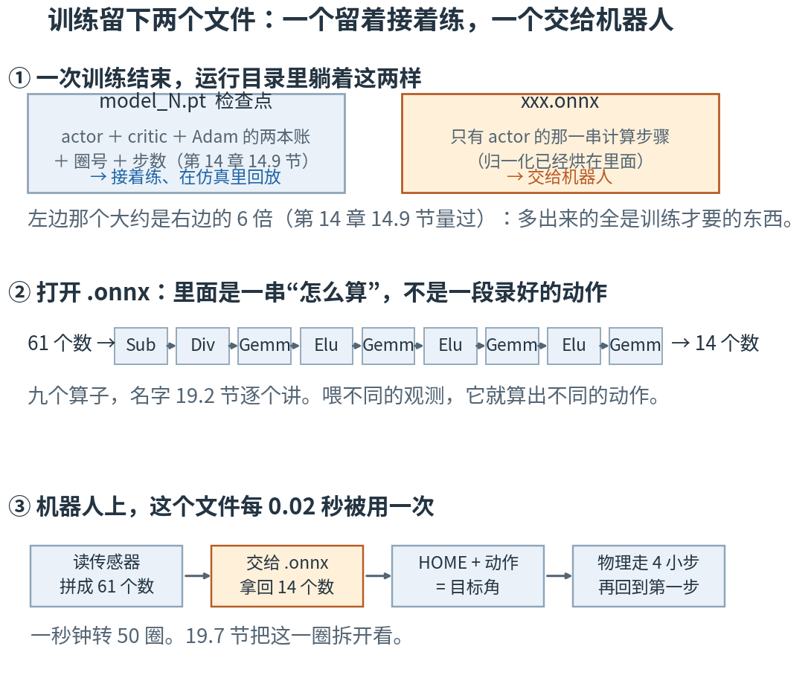
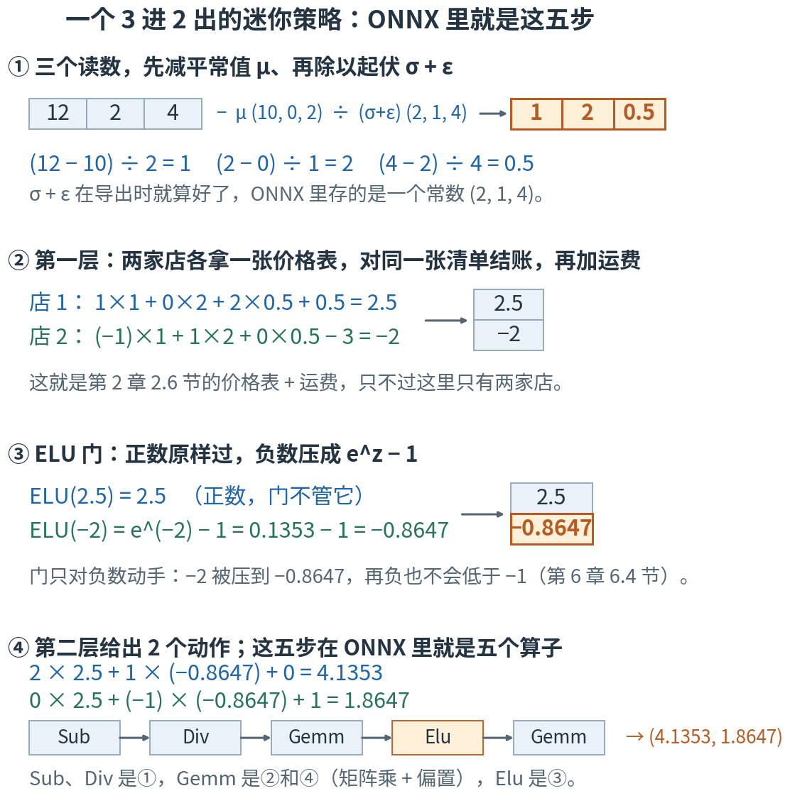
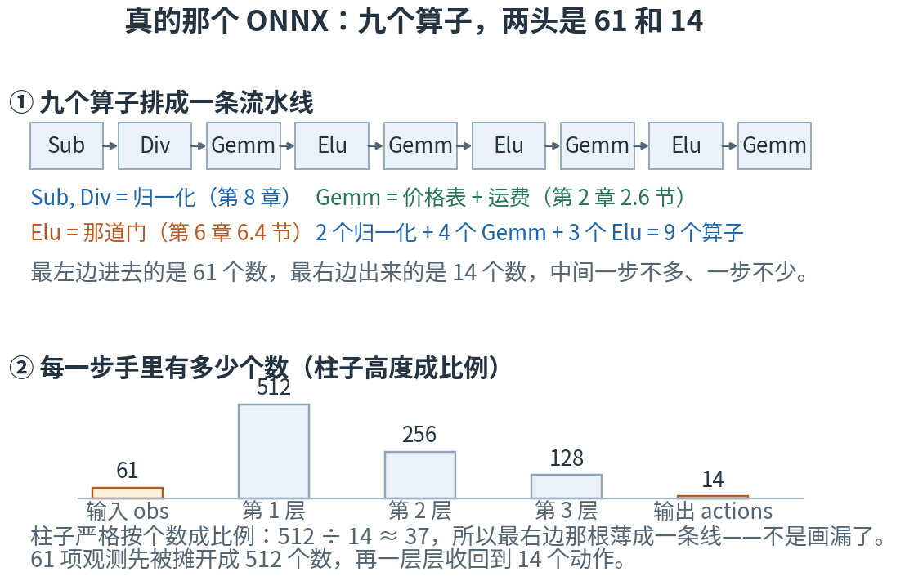
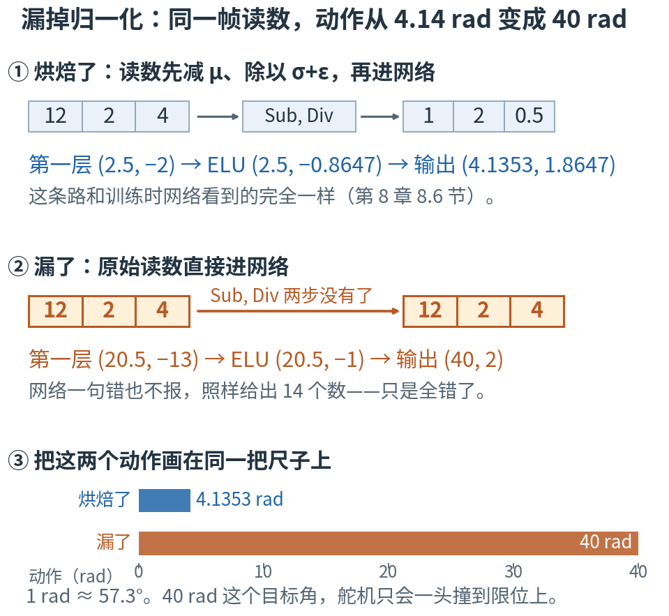
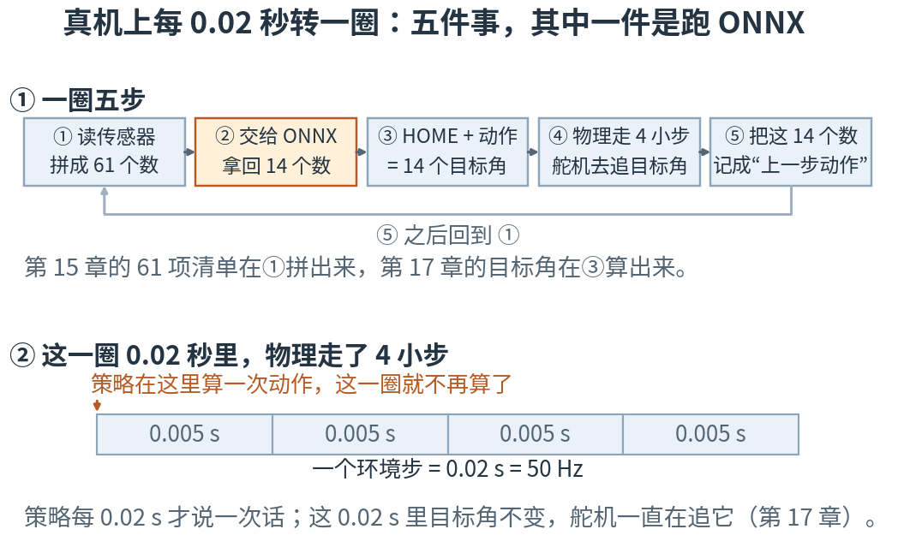
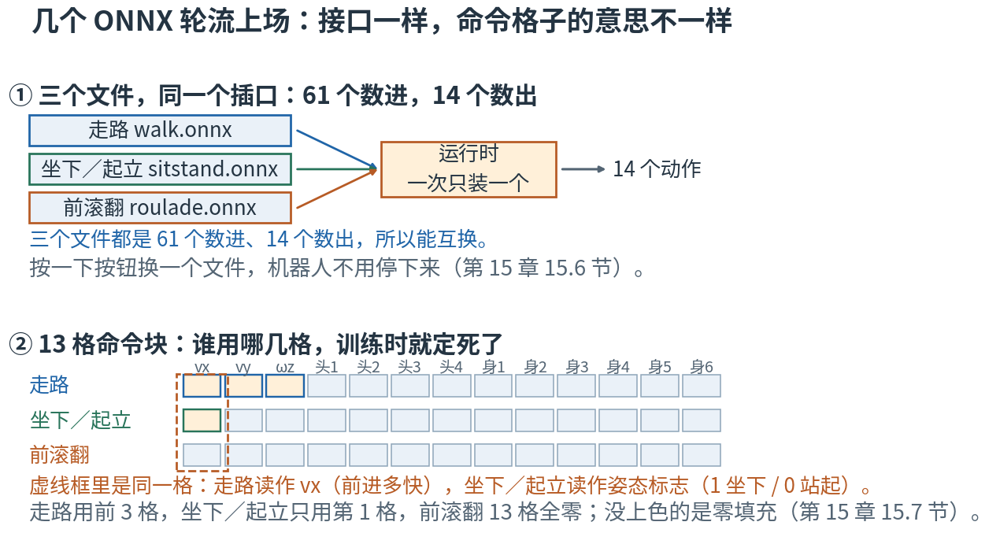

# 第 19 章 · 导出与部署：把学会的本事装进一个文件，交给机器人

> **上一章我们有了什么**：训练这头的全部细节——怎么排课程、怎么看 wandb 上的曲线判断一次训练健不健康（第 18 章（课程学习与读懂 wandb））。
> 到这里，训练能跑完，也能看懂了。
>
> **这一章要补什么**：训练跑完，硬盘上躺着一个 `model_4.pt`。可真机上那台小电脑没有装 PyTorch，也没有仿真环境、没有 critic、没有优化器——
> 它只想做一件事：**拿到 61 个数，还我 14 个数，每 0.02 秒一次**。
> 这一章就把"网络学会的那一串计算"单独搬出来，装进一个叫 ONNX 的文件里；
> 然后打开这个文件看个究竟：里面恰好就是第 8 章的归一化加第 6 章的四层，一步不多、一步不少。
> 我们会先用一个 3 进 2 出的迷你网络把整件事（搭、导出、打开、手算、对答案）完整做一遍，再去开真的那一个。
>
> **本章新词**：检查点、ONNX、算子、推理运行时、元数据。
> **需要的前提**：第 6 章的四层网络和那道 ELU 门（6.4、6.5 节），第 8 章的归一化与烘焙（8.3、8.6 节），
> 第 15 章的 61 项清单（15.1、15.3、15.5 节），第 17 章的目标角（17.1 节），第 14 章的检查点（14.9 节）。
> **不要求**你会 PyTorch 或者 ONNX 的任何 API——本章要你看懂的是**文件里装着什么**，不是怎么调用它。

---

## 19.0 先看地图：一份可以接着改的工程档案，一张只管照着做的菜谱卡

**训练结束会留下两个文件。一个装着"接着练所需要的一切"，另一个只装着"从 61 个数算到 14 个数的那一串步骤"。
前者给下一次训练，后者给机器人。这一章就是打开后者，一步一步看清里面是什么，并且亲手用加减乘除算一遍。**

打个比方。一家餐厅的后厨里有两样东西：

- **整间厨房**：食材、配方笔记、上次试菜的记录、厨师的经验、还没定下来的改法。要继续研发新菜，这些一样都不能少。
- **一张菜谱卡**：几克盐、油温几度、先下什么后下什么。拿着这张卡，一个没进过这间厨房的人也能把这道菜做出来。

`model_4.pt` 是整间厨房，导出的 `.onnx` 是那张菜谱卡。
真机上的程序只要那张卡：它不打算研发新菜，它只要每 0.02 秒照着做一遍。



**读图顺序：** 从 ① 到 ③ 竖着读。① 是两个文件各装什么；② 是打开右边那个文件看到的东西——
那一排英文名字（Sub、Div、Gemm、Elu）现在**不用记**，19.2 节会一个一个给出中文意思；
③ 是这个文件在机器人上怎么被用。现在只要记住一句话：右边那个文件里装的是**一串怎么算**，不是一段录好的动作。

| 概念 | 它在回答什么问题 | 在哪一节 |
|---|---|---|
| 检查点 | 要接着练，得留下什么？ | 19.1 |
| ONNX | 只想让别人照着算，留什么就够？ | 19.1 |
| 算子 | 这个文件里的"一步"叫什么？ | 19.2 |
| 推理运行时 | 谁来照着这个文件算？ | 19.3 |
| 元数据 | 两头怎么说好这 61 个数、14 个数的意思？ | 19.3 |
| 手写 = ONNX | 我能不能不用任何框架，自己把它算出来？ | 19.4 |
| 部署不采样 | 真机上还掷不掷那颗骰子？ | 19.5 |
| 烘焙 | 归一化那两步，在文件里还是在文件外？ | 19.6 |
| 每 0.02 秒的一圈 | 这个文件在机器人上什么时候被用？ | 19.7 |
| 不是录像 | 它存的是一段动作，还是一套怎么算？ | 19.8 |
| 三种差异 | 出了问题，怎么分辨是哪一种？ | 19.9 |
| 证据 | 说"能用"之前，手里该有哪几样东西？ | 19.10 |

名字先不背，到了各节再给。本章最容易混的四处，先贴上标签：

- **检查点里的全部 和 ONNX 里的那一点**：检查点装着 actor、critic、Adam 的两本账、圈号（第 14 章 14.9 节数过）；
  ONNX 只装 actor 的权重、偏置和归一化要用的那两串数（19.1 节）。
- **197,774 和 197,788**：前者是 actor 四层网络的权重与偏置，**ONNX 里的就是这个数**；
  后者是它再加上 14 个动作 σ，是训练时 actor 可训练旋钮的总数（第 14 章 14.9 节）。本章提到 ONNX 的时候，一律是前一个。
- **算子 和 第 7 章的计算图**：同一件事的两种说法。第 7 章 7.1 节把一行算式拆成一台台小机器；
  ONNX 存下来的就是这些小机器排成的一串，每台小机器在那里叫一个**算子**（19.2 节）。
- **"数值对得上" 和 "机器人会走"**：两种完全不同的证据。前者是这一章大部分篇幅在做的事，后者这一章一点也没证明（19.10 节）。

第一次读，按顺序看正文、图和手算就行。19.2 节那个迷你版是本章的地基，别跳——后面所有的数都是从那七八个整数里长出来的。
标着"进阶"的折叠块可以先跳过；代码是复核工具，不是阅读门槛。
读完 19.7 节，从训练到真机的整条路就走完了；剩下三节是**排查问题时的分辨力**，第一遍累了可以先跳到 📍 和本章小结。

## 19.1 两个文件：一个留着接着练，一个交给机器人

第 14 章 14.9 节已经打开过运行目录。那里有两样东西跟这一章有关：

```
                                 文件   字节数
-------------------------------------  -------
                           model_0.pt  4842943
                           model_4.pt  4842943
2026-09-22_13-21-10_learnzh-ch14.onnx   793706
```

（这是实验第 1 节打印的。文件名带着训练开始的日期时间，**你的会不同**。）

`model_N.pt` 这种文件叫**检查点**（checkpoint）：训练到第 N 圈时，把"接着练所需要的一切"原样存下来的一份存档。
第 14 章 14.9 节数过里面的五样东西——actor、critic、Adam 的两本账、圈号、步数——这里不重数。
本章只用得上其中一样：`actor_state_dict`，也就是 actor 那张网的全部数。

另一个文件的后缀是 `.onnx`。**ONNX**（Open Neural Network Exchange，"开放神经网络交换"）是一种**文件格式**：
把一张网络**要做哪几步计算**、以及**每一步要用到的那些固定不变的数**，一起存进一个文件。
存进去之后，任何认得这种格式的程序都能照着算——不需要 PyTorch，不需要 Python，不需要训练时的那套环境。

两个文件的分工，一句话说清：

| 文件 | 里面有什么 | 给谁用 |
|---|---|---|
| `model_N.pt` | 检查点：actor + critic + Adam 的两本账 + 圈号 + 步数 | 接着练、在仿真里回放 |
| `xxx.onnx` | 只有 actor 的那一串计算步骤（归一化已经烘在里面，第 8 章 8.6 节） | 交给机器人 |

大小对得上这个分工：检查点约 4.8 MB，ONNX 约 0.79 MB，差不多 6 倍（第 14 章 14.9 节量过这两个数）。
多出来的那五倍，全是**训练才需要、跑一步动作用不上**的东西。

> **停一下，自测**：同事只给了你一个 `.onnx`，没给检查点。下面三件事，哪些做得到？
> ① 在电脑上跑这个策略，看它对一帧观测给出什么动作；② 从他停下的那一圈接着往下练；③ 查出它训练时每一列用的是哪个平常值、哪个起伏。
> <details><summary>答案</summary>
>
> ① 做得到——文件里装的就是"怎么算"，谁认得这个格式谁就能照着算一遍。
> ③ 也做得到——归一化那两串数烘在文件里（第 8 章 8.6 节），19.3 节就把它们打印出来了。
> ② 做不到：ONNX 里没有 critic（价值网络，第 10 章（价值函数）），没有 Adam 的两本账（第 7 章 7.5 节），没有 14 个动作 σ（第 4 章 4.7 节），也没有课程走到了第几档。
> 接着练要检查点，上机器人才用 ONNX——第 14 章 14.9 节那道自测问的就是这件事。
>
> </details>

## 19.2 迷你版：3 个数进、2 个数出，自己导一个 ONNX 出来

真的那个文件有 61 个输入、197,774 个权重和偏置。直接打开它，看到的只会是一堆数。
所以先做一个**迷你版**：3 个数进去，2 个数出来，中间是**两层**——第一层 2 个神经元，过一道门，第二层再 2 个神经元。
（数层数就是数价格表：第 6 章 6.5 节把 61 → 512 → 256 → 128 → 14 数成四层，迷你版是 3 → 2 → 2，所以是两层。）
它和真的那个是同一种东西，只是每样都小到能用加减乘除算完。

迷你版的全部数字（都是为了好算而编出来的**教学构造数字**）：

- 三项读数的平常值 μ = (10, 0, 2)，起伏 σ = (1.99, 0.99, 3.99)，再加上第 8 章 8.3 节那个防止除以 0 的 ε = 0.01，分母正好是 **(2, 1, 4)**。
- 第一层两个神经元的价格表：第 1 个是 (1, 0, 2)，运费 0.5；第 2 个是 (−1, 1, 0)，运费 −3。
- 第二层（输出层）两个神经元的价格表：第 1 个是 (2, 1)，运费 0；第 2 个是 (0, −1)，运费 1。

现在喂一帧读数 **(12, 2, 4)**，一步一步手算：

1. **减 μ、除以 σ + ε**（第 8 章 8.3 节）：(12 − 10) ÷ 2 = **1**；(2 − 0) ÷ 1 = **2**；(4 − 2) ÷ 4 = **0.5**。
2. **第一层：价格表 × 清单 + 运费**（第 2 章 2.6 节）：
   第 1 个神经元 1×1 + 0×2 + 2×0.5 + 0.5 = **2.5**；第 2 个神经元 (−1)×1 + 1×2 + 0×0.5 − 3 = **−2**。
3. **过 ELU 门**（第 6 章 6.4 节）：正数原样过，所以 2.5 还是 2.5；负数压成 $e^z - 1$，所以 $e^{-2} - 1 = 0.1353 - 1 = -0.8647$。
   （$e^{-2}$ 是第 1 章 1.8 节的指数函数，浏览器控制台里按 `Math.exp(-2)` 就能看到 0.1353…。）
4. **第二层**：2 × 2.5 + 1 × (−0.8647) + 0 = **4.1353**；0 × 2.5 + (−1) × (−0.8647) + 1 = **1.8647**。

两个动作：**(4.1353, 1.8647)**。

第 2 项的数字是特意挑的：它的 μ 是 0、分母是 1，所以 2 进去还是 2——**归一化对它什么也没做**，
另外两项各被改成了什么，一眼就能对照出来。别把它当摆设：第一层里店 1 给它的价格是 0（根本不看它），店 2 给的价格是 1（只有店 2 在看它）。
19.9 节把它和第 3 项对调一下，两个动作立刻就不是这两个数了。

这五步全都是加减乘除加一个 `Math.exp`，浏览器控制台里粘进去就能跑一遍：

```js
const norm = [(12 - 10) / 2, (2 - 0) / 1, (4 - 2) / 4];    // 减 μ、除以 σ+ε → (1, 2, 0.5)
const elu  = z => (z >= 0 ? z : Math.exp(z) - 1);          // 第 6 章 6.4 节那道门
const z1 =  1 * norm[0] + 0 * norm[1] + 2 * norm[2] + 0.5; // 第一层第 1 个神经元 → 2.5
const z2 = -1 * norm[0] + 1 * norm[1] + 0 * norm[2] - 3;   // 第一层第 2 个神经元 → −2
[2 * elu(z1) + 1 * elu(z2) + 0,  0 * elu(z1) - 1 * elu(z2) + 1];   // → [4.1353…, 1.8647…]
```



**这样读图：** ①②③④ 竖着读，每一步的手算就写在图里，和上面正文里的数字是同一组。
最要紧的是 ④ 最下面那一排方框：这五步存进 ONNX 文件之后，就是**五个方框**。
方框上那几个英文名字下一段就解释。

现在把这个迷你网络**真的导出成一个 ONNX 文件**，再打开它看（实验第 2 节干的就是这件事）：

```
迷你 ONNX 的算子 : Sub → Div → Gemm → Elu → Gemm
它存下来的常数   : fc1.weight [2, 3], fc1.bias [2], fc2.weight [2, 2], fc2.bias [2], _mean [1, 3], add [1, 3]
除法用的那个常数 : (2, 1, 4) = σ + ε，导出时就加好了，图里只有一次除法
```

文件里存的就两类东西：

- 一串**算子**（operator）：ONNX 把计算拆成一台台小机器，每台机器叫一个算子。
  `Sub` 是减法，`Div` 是除法，`Gemm` 是"矩阵乘一下再加个偏置"（第 2 章 2.6 节的价格表 + 运费），`Elu` 就是那道门。
  这正是第 7 章 7.1 节的计算图——那里我们把一行算式拆成小机器是为了往回传梯度，这里存下来是为了让别人照着往前算。
- 一堆**常数**：每台机器要用到的、固定不变的数。价格表、运费、μ，还有那个 (2, 1, 4)。

注意第三行：σ + ε 不是存两份再让运行时去加，而是**导出的时候就加好了**，文件里直接存 (2, 1, 4) 这一个常数。
所以图里只有一次除法。（它在文件里的名字是 `add`——导出器按"这个数是怎么算出来的"随手起的名，不用管。）

| 符号 | 怎么读 | 就是 |
|---|---|---|
| `Sub` | "sub" | subtract，减法。这里是减 μ |
| `Div` | "div" | divide，除法。这里是除以 σ + ε |
| `Gemm` | "gem-m" | 矩阵乘 + 偏置 $W\mathbf{x}+\mathbf{b}$（第 2 章 2.6 节）。名字是 GEneral Matrix Multiply（通用矩阵乘）的缩写 |
| `Elu` | 按字母读 | 第 6 章 6.4 节那道门 |

拿这个文件跑一遍 (12, 2, 4)，和我们的手算并排（实验第 2 节原样打印）：

```
                  这一步          算出来是
------------------------  ----------------
                读数 obs        (12, 2, 4)
         减 μ 再除以 σ+ε       (1, 2, 0.5)
 第一层（价格表 + 运费）         (2.5, −2)
               过 ELU 门    (2.5, −0.8647)
           第二层 = 输出  (4.1353, 1.8647)
onnxruntime 跑同一个文件  (4.1353, 1.8647)
```

最后两行一模一样。**你已经把一个 ONNX 文件从头到尾手算了一遍。**

> **停一下，自测**：同一个迷你策略，换一帧读数 (8, 1, 6)。归一化之后是多少？两个动作各是多少？
> （用得上 $e^{-1} = 0.3679$。）
> <details><summary>答案</summary>
>
> 归一化：(8 − 10) ÷ 2 = −1；(1 − 0) ÷ 1 = 1；(6 − 2) ÷ 4 = 1，所以是 (−1, 1, 1)。
> 第一层：1×(−1) + 0×1 + 2×1 + 0.5 = 1.5；(−1)×(−1) + 1×1 + 0×1 − 3 = −1。
> 过门：1.5 原样；ELU(−1) = 0.3679 − 1 = −0.6321。
> 第二层：2 × 1.5 + 1 × (−0.6321) = 3 − 0.6321 = **2.3679**；(−1) × (−0.6321) + 1 = **1.6321**。
> 实验第 2 节把这两个数也锁住了。
>
> </details>

## 19.3 打开真的那一个：九个算子，一步不多一步不少

迷你版是两层、中间夹 1 道门，5 个算子的账是：2 个归一化 + 2 个 `Gemm` + 1 个 `Elu` = 5。
真的那张网有四层（第 6 章 6.5 节：61 → 512 → 256 → 128 → 14），中间夹 3 道门，照同一本账数：
2 个归一化 + 4 个 `Gemm` + 3 个 `Elu` = **9**。打开来看（实验第 3 节）：

```
输入 : obs [1, 61]
输出 : actions [1, 14]
算子 : Sub → Div → Gemm → Elu → Gemm → Elu → Gemm → Elu → Gemm
```

一个不多，一个不少。输入的名字叫 `obs`，形状 `[1, 61]`——第 2 章 2.8 节的写法：一次算 1 帧，每帧 61 个数。
输出叫 `actions`，`[1, 14]`。批大小固定是 1，因为真机一次只算一帧。



**这样读图：** ① 从左到右就是算的顺序，和上面那行输出一字不差。
② 柱子的高度和"这一步手里有多少个数"成比例：61 项观测先被第一层摊开成 512 个数，再一层层收回到 14 个。
最右边那根 14 的柱子薄成了一条线——图里专门注了一句：512 ÷ 14 ≈ 37，它本来就该这么薄，不是画漏了。

文件里存下来的常数（同样是实验第 3 节打印的）：

```
 ONNX 里存下来的常数        形状  有几个数
--------------------  ----------  --------
obs_normalizer._mean     [1, 61]        61
        mlp.0.weight   [512, 61]     31232
          mlp.0.bias       [512]       512
        mlp.2.weight  [256, 512]    131072
          mlp.2.bias       [256]       256
        mlp.4.weight  [128, 256]     32768
          mlp.4.bias       [128]       128
        mlp.6.weight   [14, 128]      1792
          mlp.6.bias        [14]        14
        onnx::Div_24     [1, 61]        61
```

**怎么读这段输出**：中间八行是第 6 章 6.5 节数过的四张价格表和四串运费（`mlp.0` 是第一层，`mlp.6` 是最后一层，中间隔着的号码给了那三道门）。
头一行和末一行是归一化那两个常数：61 个 μ，和 61 个"σ + 0.01"——和迷你版里那个 (2, 1, 4) 一样，加法在导出时就做完了，
名字 `onnx::Div_24` 是导出器自己编的。实验核对过：它**逐位等于**检查点里的 `obs_normalizer._std` 加 0.01。

照着这个文件算的那个程序，叫**推理运行时**（inference runtime）。
"推理"（inference）就是"只往前算一遍，不学习"：拿输入，走完这九步，交出输出，不碰任何一个权重。
本章用的是其中最常见的一个，叫 ONNX Runtime。本仓库那个 CPU 排练脚本（19.7 节）用的就是它，它不需要 PyTorch。
真机那头装的是哪一个运行时，由另一个仓库说了算，**本书没有核实过**（19.10 节的折叠块再说一次）。

文件里还附了一小段**元数据**（metadata，就是"关于这个文件的说明"），8 项，实验第 3 节打印了其中 4 项：

| 元数据 | 是什么 | 对应哪一章 |
|---|---|---|
| `observation_names` | 61 项观测是哪 8 块、什么顺序 | 第 15 章 15.1 节 |
| `joint_names` | 14 个关节的名字和顺序 | 第 15 章 15.3 节 |
| `default_joint_pos` | 14 个 HOME 角度 | 第 17 章 17.1 节 |
| `action_scale` | 动作乘几倍变成角度（这里是 1.0） | 第 17 章 17.1 节 |

这四项就是第 15 章说的"约定"。真机那头拼观测、换算动作，都得按它们来。
（另外 4 项是 `run_path`、`command_names`，和两项在 BAM 执行器下读出来是 1 和 0 的 `joint_stiffness` / `joint_damping`——
力矩由 BAM 自己算，第 17 章 17.4 节，所以那两项在这里没有意义。）

> ⚠️ **算子数对了，不等于导对了。** 九个算子是"这一次、用这个导出器"的结果。
> 换一个版本的导出器，可能把 `Sub` 和 `Div` 合成一个算子，也可能把 `Gemm` 写成别的等价形式——
> 那样数出来不是 9，网络却一点没变。**所以不要拿"算子个数"当验收标准**；该核对的是 19.4 节那件事：同样的输入，输出对不对得上。

> **停一下，自测**：上面那张常数表里，ONNX 一共存了多少个数？和第 14 章 14.9 节说的 197,774 差多少？差的是什么？
> <details><summary>答案</summary>
>
> 四张价格表和四串运费加起来 31232 + 512 + 131072 + 256 + 32768 + 128 + 1792 + 14 = 197,774，正是第 6 章 6.5 节数过的那个数。
> 再加上归一化的 61 个 μ 和 61 个 σ + 0.01，一共 197,896 个数。多出来的 122 个，就是被"烘"进文件里的归一化（第 8 章 8.6 节）。
>
> </details>

## 19.4 手写 = ONNX：同样的观测，差在百万分之一上下

到这一步，一件事已经很清楚了：这九步你全都会算。那就不用任何框架，自己写一遍。
实验第 4 节用 numpy 写的就是下面这五行（`W`、`B` 是从检查点里取出来的四张价格表和四串运费，`mean`、`std` 是那两串统计；
脚本里 0.01 写成了变量 `EPS_HAND`，"改一改"第 3 条就是改它）：

```python
x = (obs - mean) / (std + 0.01)            # Sub、Div：第 8 章 8.3 节的归一化，ε = 0.01
h = elu(W[0] @ x + B[0])                   # Gemm + Elu：第一层 512 个神经元，过门
h = elu(W[1] @ h + B[1])                   # 第二层 256 个
h = elu(W[2] @ h + B[2])                   # 第三层 128 个
return W[3] @ h + B[3]                     # 最后一层 14 个，不过门：输出就是 14 个动作
```

（`@` 是 Python 里的矩阵乘号，`W[0] @ x` 就是第 2 章 2.6 节"512 行 61 列的价格表乘一张 61 项的清单"。）

喂 5 帧随便造的观测，和 ONNX Runtime 的结果比最大差异：

```
                                    前 5 个动作（rad）
-----------  -----------------------------------------
 numpy 手写  [-0.0173  0.1113  0.4024 -0.669   0.753 ]
onnxruntime  [-0.0173  0.1113  0.4024 -0.669   0.753 ]
5 帧随机观测的最大差异 = 7.15e-07  （你的数字会不同；量级应该在 1e-6 上下）
```

**你的数字会不同**：这几个动作是那次冒烟训练的权重算出来的，换个检查点就换一组数。
不会变的是**量级**：差异在 $10^{-7}$ 到 $10^{-6}$ 这一带。

这一点点差异是**浮点误差**：计算机存一个小数只存得下有限位，几十万次乘加累积下来，末几位就对不齐。
两边算的是同一件事，只是加的顺序不同。所以核对的办法是"最大绝对误差小于某个容差"，
**不要求每一位都一样**——那个要求任何两套实现都过不了。

> ⚠️ **别用"完全相等"当验收条件。** $10^{-6}$ 和"下一节那种 1 rad"，差着六个数量级，不会认错。
> 真正该定的是：容差取多大算通过。14 个动作的单位是 rad，取 $10^{-4}$（约 0.006°）已经非常宽松了。

## 19.5 部署不采样：同一帧喂两次，输出一模一样

第 4 章 4.7 节说过：训练时，策略吐出的不是一个动作，是一口钟——真正执行的动作 = μ + σ × 噪声。
那颗随机的骰子是为了探索（第 9 章 9.4 节）：不试试没试过的动作，就不知道有没有更好的。

真机上不需要探索，需要的是**确定**：同样的处境，给同样的动作。所以部署时**只用 μ**，那颗骰子根本不掷。

> ⚠️ **这一节的 μ 和 σ，不是 19.2 节那两个。** 名字撞了，装的东西完全不同。
> 19.2–19.4、19.6 里的 μ 和 σ 是**观测**那边的：每一项读数各有一个平常值、一个起伏（真模型是两串各 61 个数，迷你版是各 3 个），
> 用在流水线最前面那两步（`Sub`、`Div`）。这一节的 μ 和 σ 是**动作**那边的：14 个动作各有一个中心、一个宽度，
> 两串各 14 个数，用在最后一步之后（第 4 章 4.7 节）。一个在流水线的头上，一个在尾巴外面——
> 导出时前者被烘进文件，后者被丢掉。

这件事不用靠"运行时记得别加噪声"来保证，而是**导出时就做掉了**。看实验第 5 节：

- 同一帧观测喂两次，两次输出**逐位相同**。
- ONNX 存下来的常数名字里，根本**没有** `std_param`——那 14 个动作 σ 留在检查点里，导出时丢掉了。

丢掉之后，运行时连"要不要加噪声"这个选择都没有。这就是兑现第 4 章 4.7 节和第 9 章 9.4 节留的那句话：部署到真机不再加噪声，直接执行钟的中心。

> **停一下，自测**：同事说"真机上也加一点噪声吧，抖一抖说不定更稳"。有什么问题？
> <details><summary>答案</summary>
>
> 至少两个。第一，噪声是用来试新动作的，试出来的好坏要靠奖励反馈回去改旋钮——真机上没有这个回路，试了也学不到，白抖。
> 第二，行为变得不可重复：同一段视频拍两遍不一样，出了问题没法复现，也没法说清"到底是策略的问题还是这次抖歪了"。
> 训练时的 σ 是拿来探索的，不是拿来当"鲁棒性"用的。
>
> </details>

## 19.6 忘了烘焙：同一帧读数，动作从 4.14 变成 40

第 8 章 8.6 节讲过**烘焙**：归一化器和网络装进同一个文件，真机程序只管交原始观测。
那一节也说过，漏掉归一化，程序一句错都不会报。现在我们手里有一个能手算的迷你版，可以把"到底错多少"算出来。

还是那帧 (12, 2, 4)。这回跳过 `Sub` 和 `Div`，把原始读数直接塞进第一层：

- 第 1 个神经元：1×12 + 0×2 + 2×4 + 0.5 = **20.5**（本来是 2.5）。
- 第 2 个神经元：(−1)×12 + 1×2 + 0×4 − 3 = **−13**（本来是 −2）。
- 过门：20.5 原样；ELU(−13) = $e^{-13} - 1 = 0.000002 - 1 = -0.999998$，四舍五入到 4 位就是 −1（门的下限，第 6 章 6.4 节）。
- 输出：2 × 20.5 + 1 × (−0.999998) = **40.000002**；(−1) × (−0.999998) + 1 = **1.999998**。
  （下面那张表四舍五入到 4 位，所以印成 40 和 2。）

实验第 6 节把两条路并排打印：

```
    迷你版这一步          走归一化   跳过归一化
----------------  ----------------  -----------
进第一层的三个数       (1, 2, 0.5)   (12, 2, 4)
    第一层算出来         (2.5, −2)  (20.5, −13)
       过 ELU 门    (2.5, −0.8647)   (20.5, −1)
     输出（rad）  (4.1353, 1.8647)      (40, 2)
```

第一个动作从 4.1353 rad 变成 40 rad，**差 40 − 4.1353 = 35.8647 rad**。
动作的单位是 rad（第 17 章 17.1 节：1 rad ≈ 57.3°），35.8647 × 57.3 ≈ **2055°**；
2055 ÷ 360 ≈ 5.7，差不多要转六圈。



**这样读图：** ① 是正确的那条路，② 是漏了那两步的路——两张图里进网络的三个数不一样，别的一模一样。
③ 把两个动作画在同一把尺子上（刻度是 rad），蓝条 4.1353、橙条 40：一眼能看出这不是"差一点"，是"完全不是一回事"。

真模型上也是同一个量级。实验第 6 节用那个冒烟训练的检查点跑了一帧，最大差 1.9 rad 左右（**你的数字会不同**，取决于是哪一帧、哪个检查点）——
重点不是这个数，是它和上一节那个 $10^{-6}$ **差着六个数量级**。

第 8 章 8.6 节的那句话在这里就有了具体的分量：这种错**在仿真里回放看不出来**，因为回放脚本用的是训练框架里的整个策略模型，归一化器本来就在里面。
所以仓库的规矩是：导出只走 `scripts/export.py` 这一条路，永远不要手工把检查点转成 ONNX。

## 19.7 真机的一圈：每 0.02 秒，读一次、算一次、追 4 小步

前面都在看这个文件里有什么。这一节看它**什么时候被用**。

本仓库里有一个 CPU 上的**部署排练**脚本 `scripts/infer_policy.py`：不用 GPU，用 MuJoCo 在电脑上按真机的做法跑 ONNX，
上真机之前先在这里排练一遍。它的主循环每 0.02 秒转一圈（第 14 章 14.1 节的"环境步"那只钟）：

```text
每 0.02 s：
  ① 读传感器，按第 15 章的顺序拼成 61 个数
  ② 把这 61 个数交给 ONNX，拿回 14 个数
  ③ 目标角 = HOME + 动作 × 1.0（第 17 章 17.1 节）；排练脚本还可以打开一个延迟缓冲（第 17 章 17.5 节）
  ④ 物理往前走 4 小步，每小步 0.005 s，舵机一直在追这个目标角
  ⑤ 把这 14 个数记成"上一步动作"，回到 ①
```



**这样读图：** ① 的五个框按顺序走，⑤ 之后回到 ①，一秒钟转 50 圈。
橙色那个框（②）就是这一章的文件被用到的地方——一圈只用一次。
② 那根时间条说明：这 0.02 s 被物理引擎切成 4 小步，但**策略只在开头说一次话**，这 0.02 s 里目标角不变，舵机一直在追它。

实验第 7 节把这一圈的 ②③ 两步做了一遍：从元数据里取出 14 个 HOME 和 `action_scale`，
拼一帧 61 维（只在命令块的前 3 项填上"前进 0.2 m/s、左转 0.5 rad/s"），跑一次 ONNX，再算出 14 个目标角。

⑤ 那一步容易被忽略：交出去的 14 个数，下一圈要作为"上一步动作"塞回观测里（第 15 章 15.3 节的那一块）。
真机程序自己得记着——ONNX 不替你记，它里面没有任何"上一次是什么"的记忆。

**命令块由人来填。** 61 项里最后 13 项是命令（第 15 章 15.5 节）：走路时前 3 项是遥控器的速度指令，后面 10 项按各自的约定填。
而 Microduck 上不止一个策略：走路、坐下起立、前滚翻各是一个单独的 ONNX。
它们共用同一个 61 进 14 出的接口，所以运行时按一下按钮就能换一个文件——这就是第 15 章 15.6 节说的热切换，
第 15 章 15.7 节的零填充（用不上的格子也必须占着）就是为了它。



**这样读图：** ① 三个文件长得一样（61 进、14 出），所以能互换；运行时一次只装一个。
② 是同一个 13 格的命令块，三行分别是三个策略**训练时**怎么用它的：
走路用前 3 格，坐下起立只用第 1 格，前滚翻 13 格全零。橙色虚线框起来的是**同一格**——
走路读作 `vx`，坐下起立读作姿态标志，这就是上面那条 ⚠️ 说的事。没上色的格子是零填充，位置必须占着，不然后面的块全会错位。

> ⚠️ **"全零"不是"什么都不做"。** 坐下起立那个策略把姿态标志放在命令块的**第 1 格**——
> 就是走路策略读作 `vx`（前进多快）的那一格。同一格，两种读法：走路那边填 0 是"别往前走"；
> 坐下起立那边 **1 是坐下、0 是站起**，填 0 是"给我站着"。
> 要命的地方在于，**全零恰好是命令块最自然的默认值**：遥控器还没接、按钮还没按、程序刚初始化，这 13 格就都是 0。
> 于是默认状态下，坐下起立那个策略一直在收到"站着"这条指令，机器人站得好好的一动不动——
> 看起来就像"按了按钮，策略不理我"，而它其实每一步都在认真执行你真正下达的那条命令。
> 形状一样、长度一样，任何"维数对不对"的检查都会通过（第 15 章 15.6 节那条 ⚠️ 说的就是这件事）；
> 错的是**这一格是什么意思**。所以热切换换的不只是文件，还得换上这个策略自己的命令约定。

> **停一下，自测**：按了"坐下"的按钮，机器人纹丝不动。手边有 ONNX 文件、有排练脚本。你先查哪两件事？
> <details><summary>答案</summary>
>
> 第一，运行时到底装上那个策略的文件了没有（是不是还在跑走路那个）。
> 第二，命令块第 1 格填进去的是什么——按钮有没有把它从 0 改成 1。
> 这两件事都跟网络的权重无关。重新训练一个网络不会有任何帮助：它从来就没收到过"换姿态"这个输入。
>
> </details>

读到这里，从"训练存下一个检查点"到"机器人每 0.02 秒动一次"的整条路已经走完了。
剩下三节讲的是**出问题时怎么分辨**，第一遍累了可以先跳到 📍 和本章小结。

## 19.8 它是一张菜谱卡：每次现算，不是播放一段录好的动作

有一个很自然的误会，值得单独说一句：**导出的不是一段动作录像。**

检查点像一份还能接着改的工程档案；ONNX 像一个打包好的函数——
可它仍然是个**函数**：每次拿当前这一帧观测，现场算出一组新动作。它不是把训练时录下的 14 个角度按顺序播放一遍。

还是那个迷你版，两帧不同的读数（实验第 8 节）：

| 喂进去的三个读数 | 归一化后 | 第一层 | 过门后 | 输出 |
|---|---|---|---|---|
| (12, 2, 4) | (1, 2, 0.5) | (2.5, −2) | (2.5, −0.8647) | **(4.1353, 1.8647)** |
| (10, 0, 2) | (0, 0, 0) | (0.5, −3) | (0.5, −0.9502) | **(0.0498, 1.9502)** |

第二帧三个读数正好等于 μ，归一化之后全是 0，于是第一层只剩下运费 (0.5, −3)；
过门后 $e^{-3} - 1 = 0.0498 - 1 = -0.9502$；输出 2 × 0.5 + (−0.9502) = **0.0498**，和 (−1) × (−0.9502) + 1 = **1.9502**。

同一个文件，两帧不同的观测，两组完全不同的动作。反过来，**同一帧连着喂两次，输出一模一样**（19.5 节）。
这两句话合起来，正好说清了"确定"的含义：**输出完全由这一帧输入决定**。
它不等于"机器人每次都走同一条路"——真实的传感器读数和物理状态，每一次都不一样。

<details>
<summary>进阶：这个文件的边界在哪里（现在可跳过）</summary>

ONNX 里有的：归一化的 μ 和 σ + ε，四张价格表，四串运费。就这些。

ONNX 里**没有**的：仿真环境、奖励函数、GAE、critic、Adam、课程——训练那一整套（第 3 部和第 4 部讲的东西）一样都没进来。
还少三样容易被想当然的：14 个动作 σ（第 4 章 4.7 节）、"上一步动作是什么"的记忆、以及"把 14 个数换算成关节角"这一步。

最后一条特别容易搞错：元数据里确实写着 HOME 和 `action_scale`（19.3 节），但那只是**写在说明里**，
不等于 ONNX 的输出已经是绝对角度了。它的输出仍然是"比 HOME 多转多少"，换算是**运行时**做的（19.7 节第 ③ 步）。
"文件里记了这个字段"和"文件替你做了这件事"，是两回事。

</details>

## 19.9 三种差异：先看差多少，再猜是哪一种毛病

两头的数对不上，先别急着改网络——**先量一量差多少**。差多少这件事，本身就把毛病分成了几类。
拿迷你版把三种情况各算一遍（实验第 9 节），量级差得很远：

```
                       哪种问题  第 1 个动作差多少（rad）                          怎么回事
-------------------------------  ------------------------  --------------------------------
浮点误差（手写 vs onnxruntime）                     2e-07          算的是同一件事，末位不同
         把读数的第 2、3 项对调                    1.1353         形状还是 3 项，意思全变了
                     漏掉归一化                   35.8647  网络看到的数完全不是训练时的量级
```

三行都是迷你版上的数——第一行那个 2e-07 是迷你版自己的浮点误差，和 19.4 节真模型那次 7.15e-07 不是同一次比较，量级是一回事。

中间那行是新的，手算一遍：把读数的第 2、3 项对调，(12, 2, 4) 变成 (12, 4, 2)——
这模拟的是"两头约定不一致"，比如拼观测的顺序和训练时不一样（第 15 章 15.6 节那个把 vx 和 ωz 填反的例子）。

- 归一化：(12 − 10) ÷ 2 = 1；(4 − 0) ÷ 1 = **4**；(2 − 2) ÷ 4 = **0**。
- 第一层：1×1 + 0×4 + 2×0 + 0.5 = **1.5**；(−1)×1 + 1×4 + 0×0 − 3 = **0**。
- 过门：1.5 原样；ELU(0) = 0（0 不是负数，门不管它）。
- 输出：2 × 1.5 + 1 × 0 = **3**；(−1) × 0 + 1 = **1**。

从 4.1353 变成 3，差 **1.1353 rad**（约 65°）。形状还是 3 项，一点错都没报，动作却不是那个动作了。

三种毛病，三种查法：

| 差多少 | 多半是什么 | 怎么办 |
|---|---|---|
| $10^{-7}$–$10^{-6}$ | 浮点误差 | 正常，定个容差就行（19.4 节） |
| 零点几到几 rad，但形状全对 | 顺序、单位、坐标系或者命令格子的意思对不上 | 拿元数据逐块核对（19.3 节），别动网络 |
| 一大片都对不上，量级明显不对 | 漏了或者多做了归一化 | 检查从传感器到网络这条路上恰好做了一次（第 8 章 8.6 节） |

中间那一行最值得记住：**这种毛病重新训练一个网络是治不好的**。网络收到的输入从头到尾就是错的，它再练一万圈也只会更擅长"按错的输入干活"。

## 19.10 证据分四种：跑得起来、数值一致、接口一致、行为达标

最后一节不讲计算，讲一件更朴素的事：说"这个策略能用"之前，手里该有哪几样东西。

**第一件：说清楚这个 ONNX 是从哪来的。** 任务 ID、哪一次训练、第几个检查点。
听起来像废话，可目录里常常躺着好几个 `.onnx` 和好几个 `model_*.pt`，"挑最新的两个"并不保证它们是一对——
手工导过几次的目录尤其容易配错。这件事可以**直接验**：把 ONNX 里存的第一层价格表，和每个检查点里的第一层价格表逐位比一比（实验第 10 节）：

```
    检查点  和 ONNX 第一层权重的最大差      结论
----------  --------------------------  --------
model_0.pt                   8.830e-03  不是这个
model_4.pt                   0.000e+00      配对
```

差 0，就是同一组权重；差 0.0088，就不是（**你的数字会不同**，但"配对的那个差 0"不会变）。
第 14 章 14.9 节说过，每存一次检查点就顺手导一次 ONNX，同名覆盖，所以目录里的 `.onnx` 对应的是**编号最大**的那个检查点。

**第二件：分清四种证据。** 下面四句话听起来都像"它行"，其实是四个不同的判断：

| 你能说的话 | 靠什么证据 | 它**不能**替代的 |
|---|---|---|
| "导得出来、跑得起来" | 文件能加载，形状是 61 进 14 出 | 数值对不对 |
| "数值和训练那头一致" | 19.4 节那种最大误差 + 容差 | 两头对这 61 个数的理解一致 |
| "接口含义一致" | 用元数据逐块核对顺序、单位、HOME、命令格子 | 机器人真能站住、能走 |
| "在测试场景里能走 20 秒" | 仿真回放或真机录像，写清命令、出生姿态、时长、失败现象 | 换个场地、换块电池还能不能走 |

**这四层，拿迷你版当场演一遍。** 把 19.9 节那个错误放进这张表：读数本该是 (12, 2, 4)，运行时拼成了 (12, 4, 2)。

| 这一层 | 对调之后怎么样 | 结论 |
|---|---|---|
| 跑得起来 | 还是 3 个数进、2 个数出，文件照样加载、照样吐出两个动作 | 过 |
| 数值一致 | 手写和 onnxruntime 喂的是同一组（已经填错的）数，两边都算出 (3, 1)，**差 0**——连浮点误差都没有 | 过 |
| 接口含义一致 | 拿元数据逐项核对顺序，才看出第 2、3 项反了：第一个动作 4.1353 → 3，差 1.1353 rad ≈ 65° | 不过 |
| 行为达标 | 命令的意思从头就错了，机器人不会做你要它做的那件事 | 不过 |

前两层满分，第三层才亮红灯。注意第二层那个 0：**数值那一层越干净，越说明不了接口对不对**——
它比的只是"两边照同一张图算出来的数一样不一样"，那张图错没错，它一个字也没说。（实验第 9 节把这个 0 也锁住了。）

上一行通过，不能替代下一行。19.7 节那个 CPU 排练脚本也一样：它是**部署路径**的检查工具，里面仍然是仿真，不等于真机验证过了。
按这个层次记录，出了问题才分得清是训练、是转换、是运行时的理解，还是真实物理的差别。

<details>
<summary>进阶：再往后——把策略发布出去（现在可跳过）</summary>

仓库里有一条 `uv run publish` 命令，把 `policy.onnx` 连同一份说明文件（manifest）打包传到 Hugging Face Hub 上。
说明文件里写的就是上面那些约定，本仓库 `src/mjlab_microduck/publish/manifest.py` 里能查到这几个定死的数：
`SCHEMA_VERSION = 2`（说明文件的版本）、`MODEL_API = 1`、`OBS_LEN = 61`、`ACTION_LEN = 14`，
机器人型号那一项里还写着 `control_hz: 50`（19.7 节那只钟）。实验第 11 节核对这几行还在不在。

真机那头由另一个仓库（`pollen-robotics/microduck`）里的守护进程去拉取和加载，本书**没有核实过**那部分代码。
要记住的只有一句：**发布是一个分发动作**，把文件搬到另一台机器上；它不会让策略变好一点点。

</details>

> **停一下，自测**：有人说"ONNX 输入维数是 61、随机输入下和训练那头的输出一致，sim2real 成功了"。这话哪里不对？
> <details><summary>答案</summary>
>
> 它只证明了**这些输入上的数值转换一致**（上表第二行）。还差三件事：
> 两头对这 61 个数的理解是不是一致（顺序、单位、坐标系、命令格子的意思，19.9 节）；
> 随机造的输入并不是真实观测，真机上的读数不一定落在训练见过的范围里；
> 以及最后——机器人到底站不站得住。四种证据，它拿到了一种。
>
> </details>

## 📍 映射到项目

> 只需看一眼。语法看不懂没关系。

**这段代码做什么**：这是**从检查点到 ONNX 的唯一一条路**。`src/mjlab_microduck/export.py` 的 `run_export()`
先照着任务配置把环境和 runner 建起来、把检查点加载进去，然后就是下面这三行：

```python
runner.export_policy_to_onnx(path, filename)                                    # 19.3 节：写出那九个算子和 197,896 个常数
metadata = get_base_metadata(runner.env.unwrapped, run_path=cfg.checkpoint_file) # 19.3 节：joint_names、default_joint_pos、observation_names、action_scale
attach_metadata_to_onnx(onnx_path, metadata)                                    # 把这份说明附到 .onnx 文件上
```

同一个文件的说明里写着烘焙为什么是自动的（第 8 章 8.6 节、19.6 节）：

> `runner.export_policy_to_onnx` emits `actor(normalizer(obs))`, so what the robot runs is what training saw.
>
> （大意：导出的图算的是"先归一化、再过 actor"，所以机器人跑的就是训练时网络看到的那一套。）

**被导出的到底是哪个模块**：`rsl_rl/models/mlp_model.py` 里的 `_OnnxMLPModel`，它的 `forward` 只有三行——
这三行就是 19.3 节那九个算子的来历：

```python
    x = self.obs_normalizer(x)              # Sub、Div：归一化（第 8 章 8.3 节）
    out = self.mlp(x)                       # 4 个 Gemm + 3 个 Elu：四层网络（第 6 章 6.5 节）
    return self.deterministic_output(out)   # 高斯分布只取均值 μ：19.5 节的“部署不采样”
```

**真机排练**：`scripts/infer_policy.py` 的主循环，19.7 节那一圈：

```python
        action = self.ort_session.run([self.output_name], {self.input_name: obs_batch})[0]  # ② 交给 ONNX Runtime，拿回 14 个数
        self.last_action = action.copy()                          # ⑤ 记成“上一步动作”，下一圈要拼进观测里（第 15 章 15.3 节）
...
            target_positions = self.default_pose + action * self.action_scale   # ③ 目标角 = HOME + 动作 × scale（第 17 章 17.1 节）
...
                for _ in range(decimation):                       # ④ 一个环境步里物理走 4 小步（decimation = 4，第 14 章 14.1 节）
...
                    mujoco.mj_step(model, data)                   # 每小步 0.005 s
```

（拼 61 项观测的那个 `get_observations()`，第 15 章 📍 已经逐行看过，这里不重复。）

正文还用到本仓库另外两处：`src/mjlab_microduck/publish/manifest.py`（19.10 节折叠块里那几个常数），
以及 `AGENTS.md` 里"导出必须走 `scripts/export.py`、不要手工转检查点"那条规矩。实验第 11 节核对上面引用的每一行还在不在、顺序对不对。

## 🧪 动手实验

```bash
uv run python docs/learn-zh/labs/ch19_onnx_vs_torch.py
# 或者指定一次训练的产物目录：
LEARNZH_RUN_DIR=logs/rsl_rl/velocity/<某个训练目录> uv run python docs/learn-zh/labs/ch19_onnx_vs_torch.py
```

不给目录，脚本会自己找 `logs/rsl_rl/velocity/` 下最新的、同时含 `.onnx` 和 `model_*.pt` 的 `learnzh-*` 目录（第 14 章的冒烟训练会生成）。
一个也找不到也没关系：第 2、6、8、9 节全是手算，照样跑。

1. 两个文件：运行目录里的检查点和 ONNX 各多大、`actor_state_dict` 里有哪些键；画 `ch19_overview.png`（本章地图）。
2. 迷你版：搭一个 3 进 2 出的网络、导出成 ONNX、打开看算子和常数、手算 (12, 2, 4) 的五步、和 onnxruntime 对答案，外加 19.2 节自测那一帧；画 `ch19_mini_graph.png`。
3. 打开真的那一个：输入输出的名字和形状、九个算子、10 个常数、8 项元数据；画 `ch19_nine_ops.png`。
4. numpy 手写九步 vs onnxruntime：5 帧随机观测的最大差异。
5. 部署不采样：同一帧喂两次逐位相同；ONNX 里没有 `std_param`。
6. 忘了烘焙：迷你版两条路的对照（4.1353 → 40），再在真模型上跑一次；画 `ch19_bake_or_not.png`。
7. 真机那一圈：从元数据取出 HOME 和 `action_scale`，拼一帧 61 维（只填速度命令）、跑一次、算出 14 个目标角；画 `ch19_deploy_loop.png` 和 `ch19_hotswap.png`。
8. 同一个文件、两帧不同的读数：(4.1353, 1.8647) 和 (0.0498, 1.9502)。
9. 三种差异：浮点误差、把读数第 2、3 项对调、漏掉归一化。
10. 留证据：每个检查点都和 ONNX 的第一层权重比一比，看哪一个才是它的出处。
11. 映射到项目：核对 📍 里引用的源码行还在不在。

**改一改**（每条都先写下你的预测，再运行。要改的三行在脚本里都标着 `# TWEAK-1` / `TWEAK-2` / `TWEAK-3`。
改动之后，锁正文数字的检查会从 ✓ 变成 ✗，脚本照常跑完，最后提示"N 项没对上"——这是预期的，它们锁的是正文里的数；有 ✗ 时新画的图不会覆盖教材里的图。
试完记得改回去再跑一遍）：

- 把第 2 节的 `MINI_OBS` 从 `[12.0, 2.0, 4.0]` 改成 `[12.0, 2.0, 12.0]`。先手算：归一化后第三项变成多少？第一层的两个数呢？两个输出呢？再运行对照。
- 把第 2 节的 `MINI_B1` 从 `[0.5, -3.0]` 改成 `[0.5, 3.0]`。先预测：第二个神经元还会不会是负数？那道 ELU 门这一次做了什么？输出会不会变成两个整数？
- 把第 4 节的 `EPS_HAND` 从 `0.01` 改成 `0.0`（手写那一行的 ε）。先预测：手写和 ONNX 还对得上吗？差异会落在 19.9 节那张表的哪一行？

## 本章小结

- **检查点**（`model_N.pt`）装着接着练所需要的一切（第 14 章 14.9 节）；**ONNX** 只装 actor 的那一串计算步骤和它要用的常数。
  一个是整间厨房，一个是一张菜谱卡；大小差大约 6 倍。
- ONNX 里的"一步"叫一个**算子**。迷你版两层，5 个算子：`Sub → Div → Gemm → Elu → Gemm`（2 个归一化 + 2 个 `Gemm` + 1 个 `Elu`）；
  真的那个四层，9 个算子：2 个归一化 + 4 个 `Gemm` + 3 个 `Elu`，两头是 `obs [1, 61]` 和 `actions [1, 14]`。
  `Gemm` 就是第 2 章 2.6 节的价格表 + 运费，`Elu` 就是第 6 章 6.4 节那道门。照着这个文件算的程序叫**推理运行时**，它不需要 PyTorch。
- 归一化被**烘**在文件里（第 8 章 8.6 节）：61 个 μ 和 61 个"σ + 0.01"就在常数表里，加法在导出时就做完了。
  漏掉这两步，迷你版的第一个动作从 4.1353 rad 变成 40 rad——差 35.8647 rad，而且仿真回放看不出来。
- **部署不采样**：导出时就把 14 个动作 σ 丢掉了，同一帧喂两次输出逐位相同。探索是训练的事（第 4 章 4.7 节、第 9 章 9.4 节）。
- 手写九步 = onnxruntime，差异在 $10^{-6}$ 上下，那是**浮点误差**；核对用"最大误差 + 容差"，不要求逐位相同。
- 真机每 0.02 秒一圈：拼 61 个数 → ONNX → HOME + 动作 = 目标角 → 物理走 4 小步 → 记下这一步动作。
  几个策略共用这个 61 进 14 出的接口，所以能热切换（第 15 章 15.6、15.7 节）；但**同一格命令在不同策略里意思可以完全不同**——
  "全零"对坐下起立那个策略的意思是"站着"。
- 三种差异量级差得很远：浮点误差 $10^{-6}$，格子填错零点几到几 rad，漏归一化一大片都不对。中间那种，重新训练治不好。
- 文件里还附着一小段**元数据**：8 块观测的名字和顺序、14 个关节名、14 个 HOME、`action_scale`。接口对不对，靠它逐块核对。
- 说"能用"之前，先说清这个 ONNX 是哪个检查点导出来的（拿第一层权重逐位比一比），再分清四种证据：
  跑得起来、数值一致、接口含义一致、行为达标——上一种不能替代下一种。

---

## 全书结束

翻回 README 开头那段话——"每隔 0.02 秒，每只机器人把 61 个数喂给一个神经网络；网络吐出 14 个数……
按一张评分表打一个分数……用 PPO 把网络的参数往以后得分更高的方向微调一点点"。
那段话的最后一句是"最后把网络导出成一个 `.onnx` 文件，装到真机上"——就是这一章刚刚做完的事。整段话到这里没有一个词还是黑箱。

四部书，四段路：

- **第 1 部 · 数学地基**（第 1–4 章）备齐了四样工具：量坡度的尺子、清单与价格表、一张写着"每个旋钮该往哪边拧"的梯度清单，
  和一口用来说"说不准下一次、说得清很多次"的钟。这一章里 `(12 − 10) ÷ 2`、`1×1 + 0×2 + 2×0.5 + 0.5`、$e^{-2} - 1$ 这几个手算，用的全是它们。
- **第 2 部 · 机器学习**（第 5–8 章）把工具接成一个圈：模型、损失、反向传播、优化器，外加给每一列各配一把尺子的归一化。
  ONNX 文件里那九个算子，正好就是第 8 章的两步加第 6 章的四层——一步不多，一步不少。
- **第 3 部 · 强化学习**（第 9–14 章）换掉了"标准答案"：没有老师，只有分数；于是有了价值、优势、比率和裁剪，
  最后汇成第 14 章那一圈训练回路。它转够几千圈，就留下一个检查点。
- **第 4 部 · 映射到 Microduck**（第 15–19 章）把这一切钉在一台真机器人上：61 项观测、一张评分表、
  一只会打滑会发热的舵机、一张按圈数换档的课程表，和这一章的那个 `.onnx`。

同一段话里的每一个词，现在都能展开成公式、代码和你自己算得出来的数字：

- **61 个数**：第 2、8、15 章。
- **吐出 14 个数**：第 4、6、17、19 章。
- **一个分数**：第 1、16 章。
- **往得分更高的方向**：第 3、7、10、11、12、13 章。
- **微调一点点**：第 5、14、18 章。

书到这里结束，那一圈却还在转：真机上每 0.02 秒，它就把这本书里的东西完整走一遍。
接下来可以做的事：读 `docs/single-leg-stand-roadmap-zh.md`，用这套语言去设计一个新任务；
或者打开 `rsl_rl/algorithms/ppo.py` 从头读到尾——一共 545 行，其中最难的那几十行你已经逐行读过了。
延伸阅读在 [附录 C](../appendix/C-延伸阅读.md)。
